# Capítulo 1: Introducción a los patrones de diseño

> **Bienvenido a los patrones de diseño**
>
> Ahora que vivimos en Objectville, tenemos que meternos en los patrones de diseño... todo el mundo está usándolos. ¡Pronto seremos el éxito del grupo de patrones de Jim y Betty los miércoles por la noche!

Alguien ya resolvió tus problemas. En este capítulo aprenderás por qué (y cómo) puedes explotar la sabiduría y las lecciones aprendidas por otros desarrolladores que han recorrido el mismo camino del problema de diseño y han sobrevivido al viaje.

Antes de terminar, veremos el uso y los beneficios de los patrones de diseño, algunos principios clave del diseño orientado a objetos (OO) y repasaremos un ejemplo de cómo funciona un patrón. La mejor forma de usar los patrones es cargar tu cerebro con ellos y luego reconocer lugares en tus diseños y en tus aplicaciones existentes donde puedas aplicarlos.

En lugar de reutilización de código, con los patrones obtienes **reutilización de experiencia**.

!!! tip "Nota de la traducción"
    Los nombres de clases, interfaces y métodos se mantienen en inglés (`Duck`, `FlyBehavior`, `performFly()`...) para que el código siga siendo válido y comparable con el original. La prosa, los comentarios y las explicaciones sí están traducidos.

## Empezó con una simple aplicación SimUDuck

Joe trabaja en una empresa que hace un juego de simulación de un estanque de patos muy exitoso, SimUDuck. El juego puede mostrar una gran variedad de especies de patos nadando y haciendo sonidos de graznido. Los diseñadores iniciales del sistema usaron técnicas OO estándar y crearon una superclase `Duck` de la que heredan todos los demás tipos de pato.

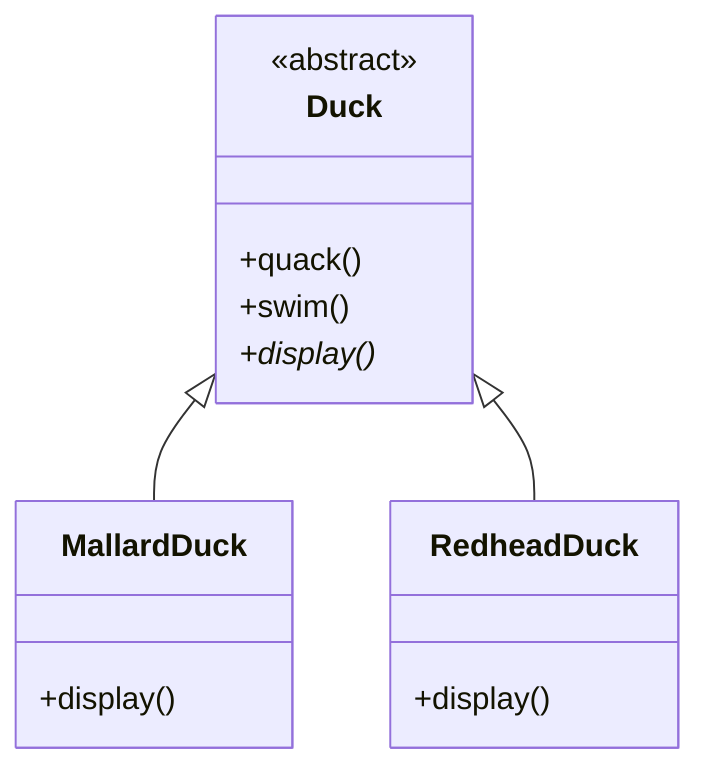

- Todos los patos graznan y nadan. La superclase se encarga de `quack()` y `swim()`.
- El método `display()` es código de implementación abstracto, ya que todos los subtipos de pato se ven distintos.
- Cada subtipo de pato es responsable de implementar su propio `display()`, es decir, de saber cómo se ve en la pantalla.
- Muchos otros tipos de patos heredan de la clase `Duck`.

En el último año, la empresa ha estado bajo una presión creciente de la competencia. Tras una semana de lluvia de ideas fuera de las oficinas, jugando al golf, los ejecutivos de la empresa creen que ya es hora de una gran innovación. Necesitan algo realmente impresionante que enseñar en la próxima junta de accionistas, en Maui, la semana que viene.

## Pero ahora necesitamos que los patos VOLEN

Los ejecutivos decidieron que patos volando es justo lo que el simulador necesita para arrasar con la competencia. Y, por supuesto, el jefe de Joe le dijo que no será ningún problema para Joe inventar algo en una semana. «Después de todo», dijo el jefe de Joe, «es un programador OO... ¿qué tan difícil puede ser?».

> Solo necesito añadir un método `fly()` en la clase `Duck` y entonces todos los patos heredarán esto. Ahora es mi momento de mostrar mi verdadero genio OO.

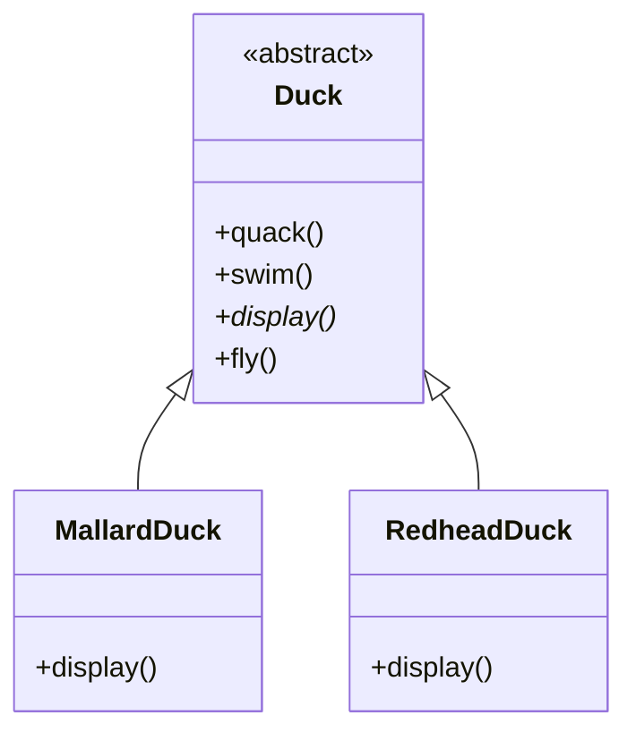

- **Lo que queremos:** patos que naden y graznen, con la volabilidad como una característica opcional.
- **Lo que Joe añadió:** `fly()` en la superclase, y todas las subclases heredan `fly()`.

## Pero algo salió muy mal...

> Joe, estoy en la junta de accionistas. Acaban de hacer una demostración y había patitos de goma volando por la pantalla. ¿Fue esta tu idea de broma?

> ¿Qué pasó?

Joe no se dio cuenta de que no todos los subtipos de `Duck` deberían volar. Cuando Joe añadió el nuevo comportamiento a la superclase `Duck`, también estaba añadiendo un comportamiento que no era apropiado para algunos subtipos de `Duck`. Ahora tiene objetos inanimados volando en el programa SimUDuck.

!!! note "Nota marginal"
    *Una actualización localizada del código causó un efecto secundario no local (¡patos de goma volando!).*

!!! warning "Lo que Joe pensó que era un gran uso de la herencia con el fin de conseguir reutilización no salió tan bien cuando se trata del mantenimiento."
    Al poner `fly()` en la superclase, le dio la capacidad de volar a **todos** los patos, incluidos aquellos que no deberían volar.

Fíjate además en que los patos de goma no graznan, así que `quack()` se sobrescribe para hacer «Squeak».

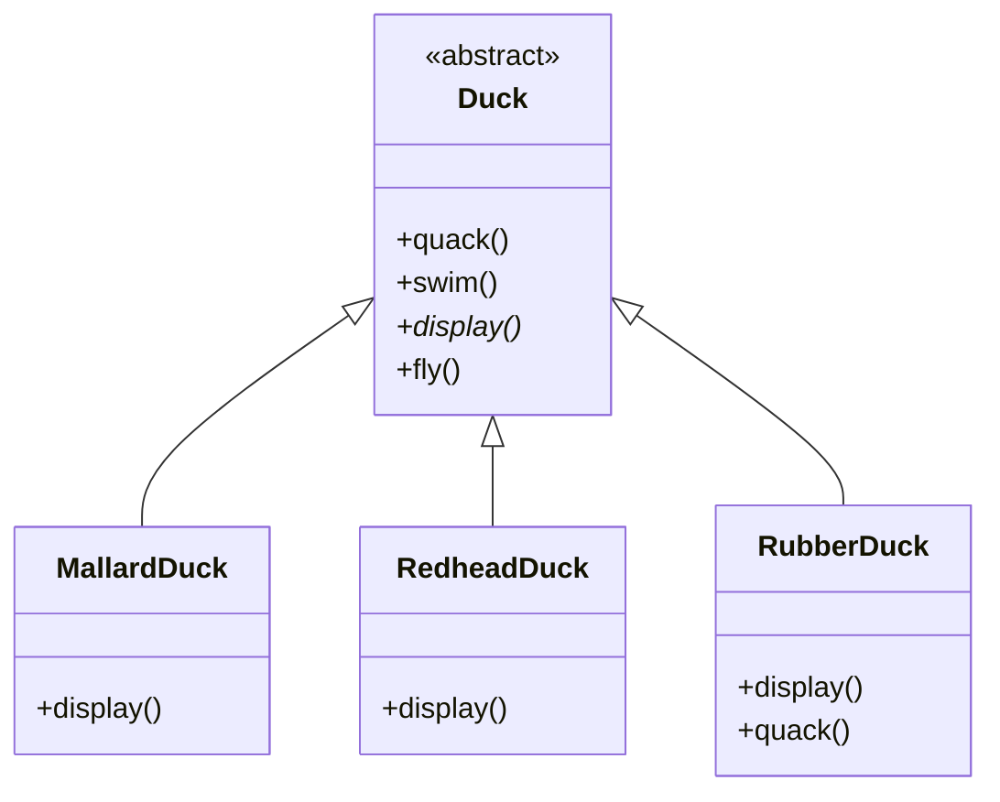

## Joe piensa en la herencia...

> Siempre podría simplemente sobrescribir el método `fly()` en el pato de goma, igual que hice con `quack()`...

> Pero entonces, ¿qué pasa cuando añadimos patos señuelo de madera al programa? No se supone que vuelen ni graznen...

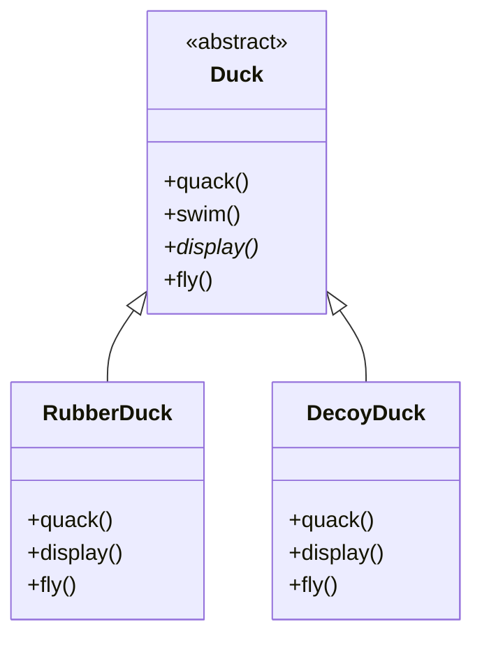

Aquí hay otra clase en la jerarquía; fíjate en que, igual que `RubberDuck`, no vuela, pero tampoco grazna.

!!! question "Cuestionario"
    **¿Cuáles de las siguientes son desventajas de usar herencia para proporcionar el comportamiento de Pato?** (Elige todas las que apliquen.)

    - A. El código se duplica entre las subclases.
    - B. Los cambios de comportamiento en tiempo de ejecución son difíciles.
    - C. No podemos hacer que los patos bailen.
    - D. Es difícil adquirir conocimiento de todos los comportamientos de pato.
    - E. Los patos no pueden volar y graznar al mismo tiempo.
    - F. Los cambios pueden afectar sin querer a otros patos.

## ¿Y si usamos una interfaz?

Joe se dio cuenta de que probablemente la herencia no era la respuesta, porque acaba de recibir un memo que dice que los ejecutivos ahora quieren actualizar el producto cada seis meses (de maneras que aún no han decidido). Joe sabe que la especificación seguirá cambiando y se verá obligado a revisar y posiblemente sobrescribir `fly()` y `quack()` para cada nueva subclase de `Duck` que se añada al programa... para siempre.

Así que necesita una forma más limpia de tener solo algunos (pero no todos) de los tipos de pato volando o graznando.

> Podría sacar `fly()` de la superclase `Duck` y hacer una interfaz `Flyable()` con un método `fly()`. Así, solo los patos que deben volar implementarán esa interfaz y tendrán un método `fly()`... y podría hacer también una `Quackable`, ya que no todos los patos pueden graznar.

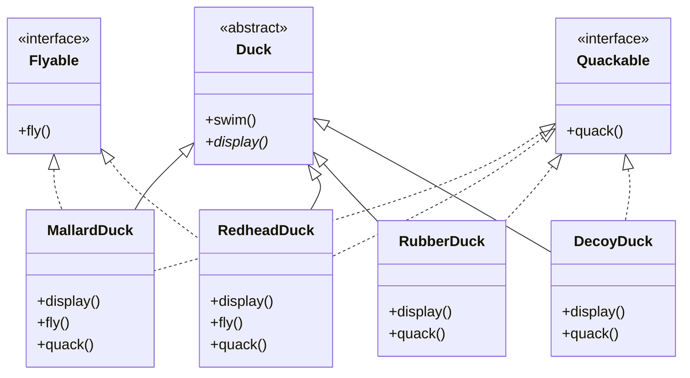

!!! danger "¿QUÉ PIENSAS TÚ de este diseño?"

## ¿Qué harías si fueras Joe?

> Eso es, como, la idea más tonta que se te ha ocurrido. ¿Puedes decir «código duplicado»? Si pensar que tener que sobrescribir unos cuantos métodos ya era malo, ¿cómo te vas a sentir cuando necesites hacer un pequeño cambio en el comportamiento de vuelo... en las **48 subclases de pato que vuelan**?!

Sabemos que no todas las subclases deberían tener comportamiento de vuelo o de graznido, así que la herencia no es la respuesta correcta. Pero aunque hacer que las subclases implementen `Flyable` y/o `Quackable` resuelve parte del problema (se acabaron los patos de goma volando inapropiadamente), destruye por completo la reutilización de código para esos comportamientos, así que simplemente crea una distinta pesadilla de mantenimiento. Y, por supuesto, podría haber más de un tipo de comportamiento de vuelo incluso entre los patos que sí vuelan...

En este punto quizá estés esperando a que un Patrón de Diseño venga montado en un caballo blanco y salve el día. Pero ¿qué gracia tendría eso? No: vamos a encontrar una solución a la vieja usanza, aplicando buenos principios de diseño de software OO.

> ¿No sería divino si hubiera una forma de construir software de modo que, cuando necesitemos cambiarlo, pudiéramos hacerlo con el menor impacto posible sobre el código existente? Podríamos dedicar menos tiempo a rehacer código y más a hacer que el programa haga cosas más geniales...

## La única constante en el desarrollo de software

Bien, ¿cuál es esa única cosa con la que siempre puedes contar en el desarrollo de software?

No importa dónde trabajes, qué estés construyendo o en qué lenguaje estés programando, ¿cuál es la única verdadera constante que siempre estará contigo?

!!! danger "CAMBIO"
    *(usa un espejo para ver la respuesta)*

Por muy bien que diseñes una aplicación, con el tiempo una aplicación debe crecer y cambiar o morirá.

Muchas cosas pueden impulsar el cambio. Enumera algunas razones que hayas tenido para cambiar el código de tus aplicaciones (hemos puesto un par de las nuestras para que empieces). Comprueba tus respuestas con la solución al final del capítulo antes de continuar.

- Mis clientes o usuarios deciden que quieren otra cosa, o quieren nueva funcionalidad.
- Mi empresa decidió que se va con otro proveedor de base de datos y además está comprando sus datos a otro proveedor que usa un formato de datos distinto. ¡Arg!

## Enfocando el problema...

Así que sabemos que usar herencia no ha funcionado muy bien, ya que el comportamiento de pato cambia constantemente entre las subclases, y no es apropiado que todas las subclases tengan esos comportamientos. Las interfaces `Flyable` y `Quackable` sonaban prometedoras al principio —solo los patos que de verdad vuelan serán `Flyable`, etc.—, salvo que las interfaces de Java normalmente no tienen código de implementación, así que no hay reutilización de código. En ambos casos, cuando necesitas modificar un comportamiento, a menudo te ves obligado a rastrearlo y cambiarlo en todas las diferentes subclases donde está definido ese comportamiento, ¡probablemente introduciendo nuevos errores por el camino!

Por suerte, hay un principio de diseño justo para esta situación.

!!! tip "Nota marginal"
    *Toma lo que varía y «encapsúlalo» para que no afecte al resto de tu código.*

    *El resultado: menos consecuencias no deseadas por los cambios de código y más flexibilidad en tus sistemas.*

!!! abstract "Principio de diseño"
    **Identifica los aspectos de tu aplicación que varían y sepáralos de los que se mantienen iguales.**

!!! note "Nota marginal"
    *El primero de muchos principios de diseño. Dedicaremos más tiempo a estos principios a lo largo del libro.*

En otras palabras: si tienes algún aspecto de tu código que está cambiando, digamos con cada requisito nuevo, entonces sabes que tienes un comportamiento que necesita ser extraído y separado de todo lo demás que no cambia.

Otra forma de pensar este principio: toma las partes que varían y encapsúlalas, para que más adelante puedas alterar o extender las partes que varían sin afectar a las que no varían.

Por simple que parezca este concepto, es la base de casi todos los patrones de diseño. Todos los patrones ofrecen una forma de dejar que una parte de un sistema varíe independientemente de todas las demás partes.

Bien, es hora de extraer el comportamiento de pato de las clases `Duck`.

## Separar lo que cambia de lo que se mantiene

¿Por dónde empezamos? Hasta donde sabemos, salvo por los problemas con `fly()` y `quack()`, la clase `Duck` funciona bien y no hay otras partes que parezcan variar o cambiar con frecuencia. Así que, aparte de unos pequeños cambios, vamos a dejar la clase `Duck` tal cual está.

Ahora, para separar las «partes que cambian de las que se mantienen igual», vamos a crear dos conjuntos de clases (totalmente aparte de `Duck`): uno para volar y otro para graznar. Cada conjunto de clases contendrá todas las implementaciones del comportamiento respectivo. Por ejemplo, podríamos tener una clase que implemente el graznido, otra que implemente el chillido y otra que implemente el silencio.

!!! danger "Lo que sabemos"
    `fly()` y `quack()` son las partes de la clase `Duck` que varían entre patos.

    Para separar estos comportamientos de la clase `Duck`, vamos a extraer ambos métodos de `Duck` y crear un nuevo conjunto de clases que represente cada comportamiento.

!!! note "Nota marginal"
    *La clase `Duck` sigue siendo la superclase de todos los patos, pero estamos extrayendo las implementaciones de vuelo y graznido, que son comportamientos, y poniéndolas en otra estructura de clases.*

    *A partir de ahora, los comportamientos de Pato vivirán en una clase separada: una clase que implemente un comportamiento concreto. De ese modo, las clases `Duck` no necesitarán conocer ningún detalle de implementación de sus propios comportamientos.*

### Comportamientos de Pato

- Comportamiento de vuelo
- Comportamiento de graznido

## Diseñando los comportamientos de Pato

¿Cómo vamos a diseñar el conjunto de clases que implementa los comportamientos de vuelo y graznido?

Nos gustaría mantener las cosas flexibles; después de todo, fue la rigidez de los comportamientos de pato la que nos meteró en problemas al principio. Y sabemos que queremos asignar comportamientos a las instancias de `Duck`. Por ejemplo, quizá queramos instanciar un nuevo `MallardDuck` e inicializarlo con un tipo concreto de comportamiento de vuelo. Y ya que estamos aquí, ¿por qué no asegurarnos de poder cambiar el comportamiento de un pato dinámicamente? En otras palabras, deberíamos incluir *setters* de comportamiento en las clases `Duck` para poder cambiar el comportamiento de vuelo del `MallardDuck` en tiempo de ejecución.

Dados estos objetivos, veamos nuestro segundo principio de diseño:

!!! abstract "Principio de diseño"
    **Programa a una interfaz, no a una implementación.**

Usaremos una interfaz para representar cada comportamiento —por ejemplo, `FlyBehavior` y `QuackBehavior`— y cada implementación de un comportamiento implementará una de esas interfaces.

Así que esta vez no serán las clases `Duck` las que implementen las interfaces de vuelo y graznido. En su lugar, vamos a hacer un conjunto de clases cuya única razón de existir sea representar un comportamiento (por ejemplo, «chillar»), y será la clase de comportamiento, y no la clase `Duck`, la que implemente la interfaz de comportamiento.

Esto contrasta con la forma en que hacíamos las cosas antes, donde un comportamiento provenía de una implementación concreta en la superclase `Duck`, o proporcionaba una implementación especializada en la propia subclase. En ambos casos dependíamos de una implementación. Estábamos atados a usar esa implementación concreta y no había margen para cambiar el comportamiento (salvo escribiendo más código).

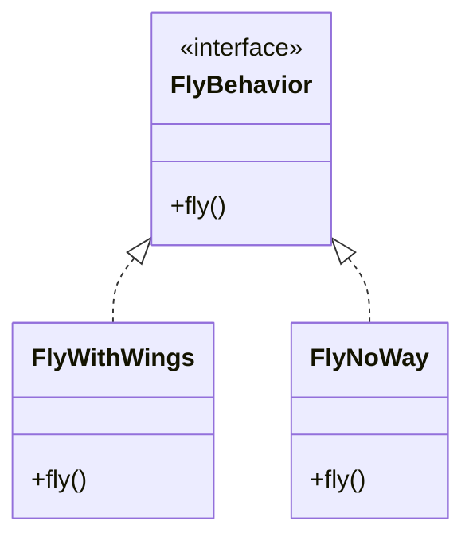

Con nuestro nuevo diseño, las subclases de `Duck` usarán un comportamiento representado por una interfaz (`FlyBehavior` y `QuackBehavior`), de modo que la implementación real del comportamiento (es decir, el comportamiento concreto codificado en la clase que implementa `FlyBehavior` o `QuackBehavior`) no quedará atada a la subclase de `Duck`.

> No veo por qué tienes que usar una interfaz para `FlyBehavior`. Puedes hacer lo mismo con una superclase abstracta. ¿No es justo el polimorfismo el objetivo?

!!! danger "«Programar a una interfaz» realmente significa «programar a un supertipo»."

La palabra *interfaz* está sobrecargada aquí. Existe el concepto de interfaz, pero también está la construcción *interface* de Java. Puedes programar a una interfaz sin necesidad de usar realmente una *interface* de Java. El punto es explotar el polimorfismo programando a un supertipo, de modo que el objeto real en tiempo de ejecución no quede atado al código. Y podríamos reformular «programar a un supertipo» como «el tipo declarado de las variables debería ser un supertipo, normalmente una clase abstracta o una interfaz, de modo que los objetos asignados a esas variables puedan ser cualquier implementación concreta del supertipo; lo que significa que la clase que las declara no tiene que conocer los tipos reales de objeto».

Probablemente esto no sea nada nuevo para ti, pero para asegurarnos de que todos decimos lo mismo, aquí va un ejemplo simple de uso de un tipo polimórfico: imagina una clase abstracta `Animal` con dos implementaciones concretas, `Dog` y `Cat`.

!!! note "Nota marginal"
    *Supertipo abstracto (puede ser una clase abstracta O una interfaz). Implementaciones concretas.*

Programar a una implementación sería:

```java
Dog d = new Dog();
d.bark();
```

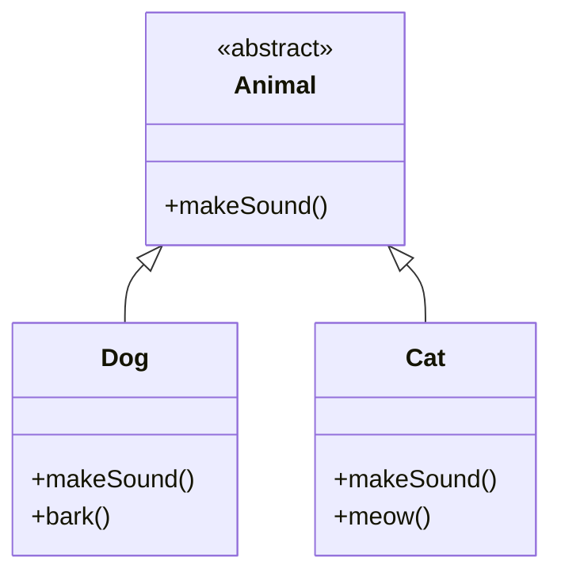

!!! note "Nota marginal"
    *Declarar la variable «d» como tipo `Dog` (una implementación concreta de `Animal`) nos obliga a programar a una implementación concreta. Sabemos que es un `Dog`, pero ahora podemos usar la referencia `animal` de forma polimórfica.*

Pero programar a una interfaz/supertipo sería:

```java
Animal animal = new Dog();
animal.makeSound();
```

Mejor aún: en lugar de codificar la instanciación del subtipo (como `new Dog()`) en el código, asigna el objeto de implementación concreta en tiempo de ejecución:

```java
Animal a = getAnimal();
a.makeSound();
```

!!! note "Nota marginal"
    *No sabemos CUÁL es el subtipo real de animal... lo único que nos importa es que sabe responder a `makeSound()`.*

## Implementando los comportamientos de Pato

Aquí tenemos las dos interfaces, `FlyBehavior` y `QuackBehavior`, junto con las clases correspondientes que implementan cada comportamiento concreto:

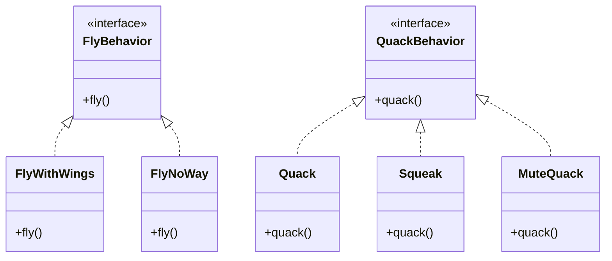

!!! note "Notas marginales"
    *`FlyBehavior` es una interfaz que solo incluye el método `fly()` que debe implementarse. Todas las clases voladoras nuevas solo necesitan implementar el método `fly()`.*

    *Aquí está la implementación de vuelo para todos los patos que tienen alas. Y aquí está la implementación para todos los patos que no pueden volar.*

    *Lo mismo ocurre aquí con el comportamiento de graznido: tenemos una interfaz y las clases que implementan cada comportamiento concreto.*

    *Patos que de verdad graznan. Patos que chillan. Patos que no hacen ningún sonido.*

!!! danger "Con este diseño, otros tipos de objetos pueden reutilizar nuestros comportamientos de vuelo y graznido porque estos comportamientos ya no están escondidos dentro de nuestras clases `Duck`."

    *Así obtenemos el beneficio de la REUTILIZACIÓN sin toda la carga que viene con la herencia.*

    *Y podemos añadir nuevos comportamientos sin modificar ninguna de nuestras clases de comportamiento existentes ni tocar ninguna de las clases `Duck` que usan comportamientos de vuelo.*

!!! question "Pregunta"
    **P: ¿Siempre tengo que implementar mi aplicación primero, ver dónde cambian las cosas, y luego volver a separar esas cosas y encapsularlas?**

    **R:** No siempre; a menudo, cuando estás diseñando una aplicación, anticipas las áreas que van a variar y te adelantas y construyes la flexibilidad para lidiar con ello. Verás que los principios y patrones se pueden aplicar en cualquier etapa del ciclo de vida del desarrollo.

!!! question "Pregunta"
    **P: Se siente un poco raro tener una clase que es solo un comportamiento. ¿No se supone que las clases representan cosas? ¿No se supone que las clases tengan estado (variables de instancia) y métodos?**

    **R:** En un sistema OO, sí, las clases representan cosas que normalmente tienen estado (variables de instancia) y métodos. En este caso, lo que resulta ser un comportamiento es un comportamiento. Pero incluso un comportamiento puede tener estado y métodos; un comportamiento de vuelo podría tener variables de instancia que representen los atributos del comportamiento de vuelo (latidos de ala por minuto, altitud máxima, velocidad, etc.).

!!! question "Pregunta"
    **P: ¿Deberíamos hacer que `Duck` sea una interfaz también?**

    **R:** En este caso, no. Como verás cuando tengamos todo conectado, nos beneficia que `Duck` no sea una interfaz y que, además de patos concretos como `MallardDuck`, que hereden propiedades y métodos comunes, tengamos esta estructura sin los problemas.

!!! question "Cuestionario"
    **1. Usando nuestro nuevo diseño, ¿qué harías si necesitaras añadir vuelo propulsado por cohete a la aplicación SimUDuck?**

    **2. ¿Se te ocurre alguna clase que quisiera usar el comportamiento `Quack` y que no sea un pato?**

??? note "Respuestas"

    1. Crear una clase `FlyRocketPowered` que implemente la interfaz `FlyBehavior`.
    2. Un ejemplo: un llamada de pato (un dispositivo que emite sonidos de pato).

## Integrando los comportamientos de Pato

!!! danger "Aquí está la clave: un `Duck` delegará ahora sus comportamientos de vuelo y graznido, en lugar de usar métodos de graznido y vuelo definidos en la clase `Duck` (o subclase)."

Así es como lo hacemos.

### 1. Añadir las variables de instancia de comportamiento

Primero añadiremos dos variables de instancia de tipo `FlyBehavior` y `QuackBehavior` —llamémoslas `flyBehavior` y `quackBehavior`. Cada objeto de pato concreto asignará a esas variables un comportamiento concreto en tiempo de ejecución, como `FlyWithWings` para volar y `Squeak` para graznar.

También eliminaremos los métodos `fly()` y `quack()` de la clase `Duck` (y de cualquier subclase), porque hemos movido ese comportamiento a las clases `FlyBehavior` y `QuackBehavior`.

Reemplazaremos `fly()` y `quack()` en la clase `Duck` con dos métodos similares, llamados `performFly()` y `performQuack()`; veremos cómo funcionan a continuación.

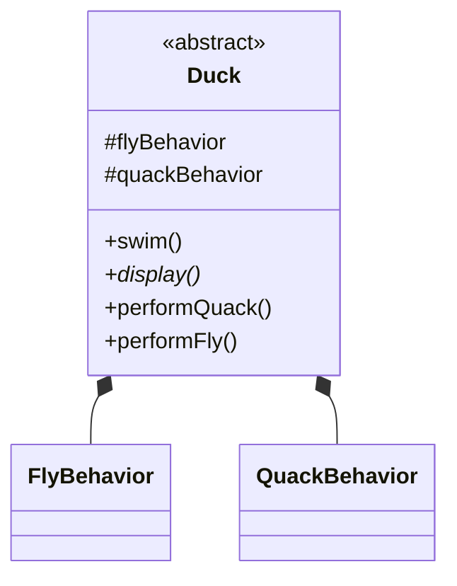

!!! note "Notas marginales"
    *Las variables de comportamiento se declaran como el tipo de INTERFAZ de comportamiento. Las variables de instancia mantienen una referencia a un comportamiento concreto en tiempo de ejecución.*

    *Estos métodos reemplazan a `fly()` y `quack()`.*

    *Cada `Duck` tiene una referencia a algo que implementa la interfaz `QuackBehavior`.*

### 2. Implementar `performQuack()`

Ahora implementamos `performQuack()`:

```java
public abstract class Duck {
    QuackBehavior quackBehavior;

    // más cosas

    public void performQuack() {
        quackBehavior.quack();
    }
}
```

¡Bastante sencillo, no? Para hacer el graznido, un `Duck` simplemente le pide al objeto referenciado por `quackBehavior` que grzne por él. En esta parte del código no nos importa qué clase concreta sea el pato; lo único que nos importa es que ¡sepas graznar!

## Más integración...

### 3. Fijar las variables de instancia de comportamiento

Bien, hora de preocuparse de cómo se asignan las variables de instancia `flyBehavior` y `quackBehavior`. Veamos la clase `MallardDuck`:

```java
public class MallardDuck extends Duck {

    public MallardDuck() {
        quackBehavior = new Quack();
        flyBehavior = new FlyWithWings();
    }

    public void display() {
        System.out.println("I'm a real Mallard duck");
    }
}
```

!!! note "Notas marginales"
    *Un `MallardDuck` usa la clase `Quack` para manejar su graznido, así que cuando se llama a `performQuack()`, la responsabilidad del graznido se delega al objeto `Quack` y obtenemos un graznido real.*

    *Y usa `FlyWithWings` como su comportamiento de vuelo.*

    *Recuerda: `MallardDuck` hereda las variables de instancia `quackBehavior` y `flyBehavior` de la clase `Duck`.*

El graznido de `MallardDuck` es un graznido de pato real y vivo, no un chillido ni un graznido mudo. Cuando se instancia un `MallardDuck`, su constructor inicializa la variable de instancia heredada `quackBehavior` con una nueva instancia de tipo `Quack` (una clase de implementación concreta de `QuackBehavior`).

Y lo mismo vale para el comportamiento de vuelo del pato: el constructor de `MallardDuck` inicializa la variable de instancia heredada `flyBehavior` con una instancia de tipo `FlyWithWings` (una clase de implementación concreta de `FlyBehavior`).

> Un momento, ¿no dijiste que NO deberíamos programar a una implementación? ¿Pero qué estamos haciendo en ese constructor? ¡Estamos creando una nueva instancia de una clase de implementación concreta de `Quack`!

Buen ojo, eso es exactamente lo que estamos haciendo... *por ahora*. Más adelante en el libro tendremos más patrones en nuestra caja de herramientas que nos ayudarán a arreglarlo.

Aun así, fíjate en que, mientras asignamos los comportamientos a clases concretas (instanciando una clase de comportamiento como `Quack` o `FlyWithWings` y asignándola a nuestra variable de referencia de comportamiento), podríamos cambiarlo fácilmente en tiempo de ejecución. Así que aquí todavía tenemos mucha flexibilidad. Dicho esto, estamos haciendo un mal trabajo de inicializar las variables de instancia de forma flexible. Pero piénsalo: como la variable de instancia `quackBehavior` es un tipo de interfaz, podríamos (gracias a la magia del polimorfismo) asignar dinámicamente una clase de implementación de `QuackBehavior` distinta en tiempo de ejecución.

Tómate un momento y piensa en cómo implementarías un pato de modo que su comportamiento pudiera cambiar en tiempo de ejecución. (Verás el código que hace esto unas páginas más adelante.)

## Probando el código de Pato

### 1. `Duck.java`

Escribe y compila la clase `Duck` de abajo, y la clase `MallardDuck` de hace dos páginas.

```java
public abstract class Duck {

    FlyBehavior flyBehavior;
    QuackBehavior quackBehavior;

    public Duck() { }

    public abstract void display();

    public void performFly() {
        flyBehavior.fly();
    }

    public void performQuack() {
        quackBehavior.quack();
    }

    public void swim() {
        System.out.println("All ducks float, even decoys!");
    }
}
```

!!! note "Notas marginales"
    *Declara dos variables de referencia para los tipos de interfaz de comportamiento. Todas las subclases de pato (en el mismo paquete) heredan estas.*

    *Delega a la clase de comportamiento.*

### 2. `FlyBehavior.java`, `FlyWithWings.java` y `FlyNoWay.java`

Escribe y compila la interfaz `FlyBehavior` y las dos clases de implementación de comportamiento.

```java
public interface FlyBehavior {
    public void fly();
}
```

```java
public class FlyWithWings implements FlyBehavior {
    public void fly() {
        System.out.println("I'm flying!!");
    }
}
```

```java
public class FlyNoWay implements FlyBehavior {
    public void fly() {
        System.out.println("I can't fly");
    }
}
```

!!! note "Notas marginales"
    *La interfaz que implementan todas las clases de comportamiento de vuelo.*

    *Implementación del comportamiento de vuelo para patos que SÍ vuelan...*

    *...e implementación del comportamiento de vuelo para patos que NO vuelan (como los patos de goma y los patos señuelo).*

### 3. `QuackBehavior.java`, `Quack.java`, `MuteQuack.java` y `Squeak.java`

Escribe y compila la interfaz `QuackBehavior` y las tres clases de implementación de comportamiento.

```java
public interface QuackBehavior {
    public void quack();
}
```

```java
public class Quack implements QuackBehavior {
    public void quack() {
        System.out.println("Quack");
    }
}
```

```java
public class MuteQuack implements QuackBehavior {
    public void quack() {
        System.out.println("<< Silence >>");
    }
}
```

```java
public class Squeak implements QuackBehavior {
    public void quack() {
        System.out.println("Squeak");
    }
}
```

### 4. `MiniDuckSimulator.java`

Escribe y compila la clase de prueba.

```java
public class MiniDuckSimulator {
    public static void main(String[] args) {
        Duck mallard = new MallardDuck();
        mallard.performQuack();
        mallard.performFly();
    }
}
```

!!! note "Notas marginales"
    *Esto llama al método heredado `performQuack()` del `MallardDuck`, que a su vez delega en el `QuackBehavior` del objeto (es decir, llama a `quack()` sobre la referencia `quackBehavior` heredada del pato).*

    *Luego hacemos lo mismo con el método heredado `performFly()` del `MallardDuck`.*

### 5. ¡Ejecuta el código!

```text
%java MiniDuckSimulator
Quack
I'm flying!!
```

## Estableciendo el comportamiento dinámicamente

¡Qué pena tener todo ese talento dinámico integrado en nuestros patos y no usarlo! Imagina que quieres establecer el tipo de comportamiento del pato mediante un método *setter* en la clase `Duck`, en lugar de instanciarlo en el constructor del pato.

### 1. Añadir dos métodos nuevos a la clase `Duck`

```java
public void setFlyBehavior(FlyBehavior fb) {
    flyBehavior = fb;
}

public void setQuackBehavior(QuackBehavior qb) {
    quackBehavior = qb;
}
```

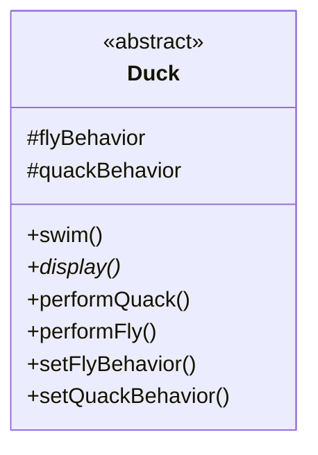

Podemos llamar a estos métodos cuando queramos para cambiar el comportamiento de un pato sobre la marcha.

### 2. Crear un nuevo tipo de pato: `ModelDuck.java`

```java
public class ModelDuck extends Duck {
    public ModelDuck() {
        flyBehavior = new FlyNoWay();
        quackBehavior = new Quack();
    }

    public void display() {
        System.out.println("I'm a model duck");
    }
}
```

!!! note "Nota marginal"
    *Nuestro pato modelo empieza su vida sin una forma de volar. Está bien, porque estamos creando un comportamiento de vuelo propulsado por cohete.*

### 3. Crear un nuevo tipo de `FlyBehavior`

```java
public class FlyRocketPowered implements FlyBehavior {
    public void fly() {
        System.out.println("I'm flying with a rocket!");
    }
}
```

### 4. Modificar la clase de prueba

Cambia la clase de prueba (`MiniDuckSimulator.java`), añade el `ModelDuck` y haz que el `ModelDuck` tenga cohete.

```java
public class MiniDuckSimulator {
    public static void main(String[] args) {
        Duck mallard = new MallardDuck();
        mallard.performQuack();
        mallard.performFly();

        Duck model = new ModelDuck();
        model.performFly();
        model.setFlyBehavior(new FlyRocketPowered());
        model.performFly();
    }
}
```

!!! note "Notas marginales"
    *La primera llamada a `performFly()` delega en el objeto `flyBehavior` establecido en el constructor de `ModelDuck`, que es una instancia de `FlyNoWay`.*

    *Esto invoca el método *setter* de comportamiento heredado del modelo y... ¡voilà! ¡De repente el modelo tiene capacidad de vuelo propulsado por cohete!*

    *Si funcionó, ¡el pato modelo cambió dinámicamente su comportamiento de vuelo! No puedes hacer ESO si la implementación vive dentro de la clase `Duck`.*

### 5. ¡Ejecuta el código!

```text
%java MiniDuckSimulator
Quack
I'm flying!!
I can't fly
I'm flying with a rocket!
```

| Antes | Después |
| --- | --- |
| `Quack` | `Quack` |
| `I'm flying!!` | `I'm flying!!` |
| | `I can't fly` |
| | `I'm flying with a rocket!` |

!!! tip "Nota marginal"
    *Para cambiar el comportamiento de un pato en tiempo de ejecución, solo llama al método *setter* de ese comportamiento en el pato.*

## La gran visión sobre el comportamiento encapsulado

Bien, ahora que hemos hecho la inmersión profunda en el diseño del simulador de patos, es hora de volver a la superficie y echarle un vistazo a la gran visión.

Aquí está la estructura de clases completa rehecha. Tenemos todo lo que esperarías: patos heredando de `Duck`, comportamientos de vuelo implementando `FlyBehavior` y comportamientos de graznido implementando `QuackBehavior`.

Fíjate también en que hemos empezado a describir las cosas de una forma algo distinta. En lugar de pensar en los comportamientos de pato como un conjunto de comportamientos, empezaremos a pensarlos como una familia de algoritmos. Piénsalo: en el diseño de SimUDuck, los algoritmos representan cosas que haría un pato (distintas formas de graznar o de volar), pero podríamos usar exactamente las mismas técnicas para un conjunto de clases que implementen las maneras de calcular el impuesto sobre las ventas de cada estado.

Presta especial atención a las relaciones entre las clases. De hecho, coge un bolígrafo y escribe la relación apropiada (`IS-A`, `HAS-A` e `IMPLEMENTS`) en cada flecha del diagrama de clases.

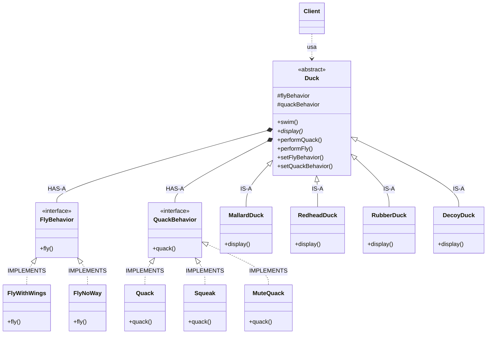

!!! note "Notas marginales"
    *El `Client` hace uso de una familia encapsulada de algoritmos para volar y graznar.*

    *Piensa en cada conjunto de comportamientos como una familia de algoritmos.*

    *Estos «algoritmos» de comportamiento son intercambiables.*

## HAS-A puede ser mejor que IS-A

La relación `HAS-A` es interesante: cada pato **tiene** un `FlyBehavior` y un `QuackBehavior` a los que delega el vuelo y el graznido.

Cuando juntas dos clases de esta forma estás usando **composición**. En lugar de heredar su comportamiento, los patos obtienen su comportamiento al ser compuestos con el objeto de comportamiento correcto. Esta es una técnica importante; de hecho, es la base de nuestro tercer principio de diseño:

!!! abstract "Principio de diseño"
    **Favorece la composición sobre la herencia.**

Como has visto, crear sistemas usando composición te da mucha más flexibilidad. No solo te permite encapsular una familia de algoritmos en su propio conjunto de clases, sino que también te permite cambiar el comportamiento en tiempo de ejecución siempre que el objeto con el que te compongas implemente la interfaz de comportamiento correcta.

La composición se usa en muchos patrones de diseño yáserás mucho más sobre sus ventajas y desventajas a lo largo del libro.

### Guru y estudiante

> **Guru:** Dime qué has aprendido sobre las formas orientada a objetos.
>
> **Estudiante:** Guru, he aprendido que la promesa de la forma orientada a objetos es la reutilización.
>
> **Guru:** Continúa...
>
> **Estudiante:** Guru, mediante la herencia todas las cosas buenas pueden ser reutilizadas y porvenir reducimos drásticamente el tiempo de desarrollo, como cuando cortamos caña rápidamente en el bosque.
>
> **Guru:** ¿Se gasta más tiempo en código antes o después del desarrollo?
>
> **Estudiante:** La respuesta es después, Guru. Siempre gastamos más tiempo manteniendo y cambiando software que en el desarrollo inicial.
>
> **Guru:** Entonces, ¿debería el esfuerzo centrarse en la reutilización por encima de la mantenibilidad y la extensibilidad?
>
> **Estudiante:** Guru, creo que hay algo de verdad en eso.
>
> **Guru:** Veo que todavía tienes mucho que aprender. Me gustaría que fueras a meditar más sobre la herencia y otras maneras de conseguir la reutilización.

!!! question "Cuestionario"
    Un **llamado de pato** es un dispositivo que usan los cazadores para imitar los graznidos de los patos. ¿Cómo implementarías tu propio llamado de pato sin que herede de la clase `Duck`?

## Hablemos de patrones de diseño...

!!! success "¡Felicidades por tu primer patrón!"

Acabas de aplicar tu primer patrón de diseño: el **patrón STRATEGY**. Así es, usaste el patrón Strategy para rehacer la aplicación SimUDuck.

Gracias a este patrón, el simulador está preparado para cualquier cambio que esos ejecutivos puedan cocinar en su próximo viaje de negocios a Maui.

Ahora que te hemos hecho recorrer el camino largo para aprenderlo, aquí va la definición formal del patrón:

> **El patrón Strategy define una familia de algoritmos, encapsula cada uno de ellos y los hace intercambiables. Strategy permite que el algoritmo varíe de forma independiente de los clientes que lo usan.**

!!! note "Nota marginal"
    *Usa ESTA definición cuando necesites impresionar a tus amigos e influir en los ejecutivos clave.*

## Rompecabezas de diseño

Aquí abajo encontrarás un lío de clases e interfaces para un juego de acción y aventura. Encontrarás clases para personajes del juego junto con clases para comportamientos de arma que los personajes pueden usar en el juego. Cada personaje puede usar un arma a la vez, pero puede cambiar de arma en cualquier momento durante el juego. Tu trabajo es ordenarlo todo...

(Las respuestas están al final del capítulo.)

**Tu tarea:**

1. Ordena las clases.
2. Identifica una clase abstracta, una interfaz y ocho clases.
3. Dibuja flechas entre las clases.
    a. Dibuja este tipo de flecha para herencia (`extends`).
    b. Dibuja este tipo de flecha para interfaz (`implements`).
    c. Dibuja este tipo de flecha para `HAS-A`.
4. Coloca el conjunto de métodos `setWeapon()` en la clase correcta.

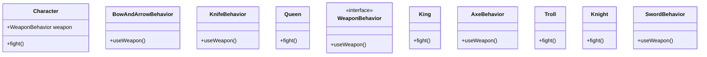

```java
setWeapon(WeaponBehavior w) {
    this.weapon = w;
}
```

## Escuchado en el restaurante local...

> **Alice:** Necesito un sándwich de queso crema con mermelada en pan blanco, un refresco de chocolate con helado de vainilla, un sándwich de queso a la plancha con tocino, una ensalada de atún sobre pan tostado, un banana split con helado y plátanos en rodajas, y un café con crema y dos de azúcar... ah, y ¡pon un hamburger en la parrilla!
>
> **Flo:** Dame un C.J. White, un negro y blanco, un Jack Benny, una radio, un boat (una casa sobre el agua), un café normal, y ¡quema uno!

¿Cuál es la diferencia entre estos dos pedidos? ¡Ninguna! Son el mismo pedido, salvo que Alice usa el doble de palabras y hace gala de la paciencia de un cocinero de pedidos cortos de mal genio.

¿Qué tiene Flo que Alice no tiene? Un **vocabulario compartido** con el cocinero de pedidos cortos. No solo eso hace más fácil comunicarse con el cocinero, sino que además le da al cocinero menos cosas que recordar, porque tiene todos los patrones de la cafetería en la cabeza.

Los patrones de diseño te dan un vocabulario compartido con otros desarrolladores. Una vez que tienes el vocabulario, puedes comunicarte con más facilidad con otros desarrolladores e inspirar a quienes no conocen patrones a empezar a aprenderlos. También eleva tu pensamiento sobre arquitecturas al permitirte pensar en el nivel de los patrones, y no en el nivel del objeto en sus detalles más menudos.

## Escuchado en el cubículo de al lado...

> **Rick:** Así que creé esta clase de difusión. Lleva el registro de todos los objetos que la escuchan, y cada vez que llega un dato nuevo envía un mensaje a cada oyente. Los oyentes pueden unirse a la difusión en cualquier momento o incluso retirarse de ella. Es realmente dinámico y poco acoplado.

¿Puedes pensar en otros vocabularios compartidos que se usan más allá del diseño OO y de las conversaciones de cafetería? (Pista: ¿qué hay de los mecánicos, los carpinteros, los chefs gourmet y los controladores de tráfico aéreo?)

¿Qué cualidades se comunican junto con la jerga?

¿Puedes pensar en aspectos del diseño OO que se comunican junto con los nombres de los patrones? ¿Qué cualidades se comunican junto con el nombre «patrón Strategy»?

> **Rick:** Exacto. Si te comunicas en patrones, entonces otros desarrolladores conocen de inmediato y con precisión el diseño que estás describiendo. lo sabrás cuando empieces a usar patrones para Hello World...
>
> **Desarrollador:** Rick, ¿por qué no dijiste simplemente que estás usando el **patrón Observer**?

## El poder de un vocabulario de patrones compartido

!!! danger "Cuando te comunicas usando patrones, estás haciendo mucho más que compartir jerga."

> *«Estamos usando el patrón Strategy para implementar los distintos comportamientos de nuestros patos.» Esto te dice que el comportamiento de pato ha sido encapsulado en su propio conjunto de clases que pueden ampliarse y cambiarse fácilmente, incluso en tiempo de ejecución si hace falta.*

**Los vocabularios compartidos de patrones son PODEROSOS.** Cuando te comunicas con otro desarrollador o con tu equipo usando patrones, no estás comunicando solo un nombre de patrón, sino todo un conjunto de cualidades, características y restricciones que el patrón representa.

**Los patrones te permiten decir más con menos.** Cuando usas un patrón en una descripción, otros desarrolladores saben rápidamente y con precisión qué diseño tienes en mente.

**Hablar en el nivel de los patrones te permite mantenerte «en el diseño» más tiempo.** Hablar de sistemas de software usando patrones te permite mantener la discusión en el nivel del diseño, sin tener que bajar a los detalles minuciosos de implementar objetos y clases.

**Los vocabularios compartidos pueden turboimpulsar tu equipo de desarrollo.** Un equipo VERSADO en patrones de diseño puede moverse mucho más rápido y con menos margen de malentendidos.

**Los vocabularios compartidos alientan a que los desarrolladores junior sean más rápidos.** Los desarrolladores junior miran a los desarrolladores senior. Cuando los desarrolladores senior usan patrones de diseño, los junior también se motivan para aprendirlos. Construye una comunidad de usuarios de patrones en tu organización.

## ¿Cómo se usan los patrones de diseño?

Todos hemos usado bibliotecas y frameworks listos para usar. Los tomamos, escribimos algo de código contra sus APIs, los compilamos en nuestros programas y nos beneficiamos de mucho código que alguien más ha escrito. Piensa en las APIs de Java y toda la funcionalidad que te dan: red, GUI, E/S, etc. Las bibliotecas y los frameworks nos llevan muy lejos hacia un modelo de desarrollo donde podemos simplemente elegir componentes y conectarlos directamente. Pero... no nos ayudan a estructurar nuestras propias aplicaciones de maneras más fáciles de entender, más mantenibles y más flexibles. Ahí es donde entran los patrones de diseño.

**Los patrones de diseño no van directamente a tu código, primero van a tu CEREBRO.** Una vez que hayas cargado tu cerebro con un buen conocimiento práctico de los patrones, podrás empezar a aplicarlos a tus nuevos diseños y a rehacer tu código antiguo cuando descubras que se está degradando en un desastre inflexible.

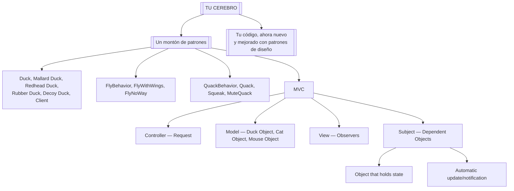

!!! question "Pregunta"
    **P: Si los patrones de diseño son tan buenos, ¿por qué no puede alguien construir una biblioteca de ellos para que yo también diseñe patrones?**

    **R:** No, pero más adelante aprenderás sobre catálogos de patrones con listas de patrones que puedes aplicar a tus aplicaciones.

!!! question "Pregunta"
    **P: ¿No es todo esto simplemente buen diseño orientado a objetos?**

    **R:** No, pero es más sutil que eso. Hay mucho que aprender.

!!! question "Pregunta"
    **P: ¿No es que las bibliotecas y los frameworks tampoco tienen que seguir patrones de diseño?**

    **R:** Las bibliotecas y los frameworks no *son* patrones de diseño; proporcionan implementaciones concretas que vinculamos a nuestro código. A veces, sin embargo, bibliotecas y frameworks hacen uso de patrones de diseño en sus implementaciones. Eso es genial, porque una vez que entiendes los patrones de diseño, entenderás las APIs mucho más rápido, ya que están estructuradas en torno a patrones de diseño.

## Desarrollador escéptico / Guru de patrones amigable

> **Desarrollador:** Okay, mmm, pero ¿no es esto solo buen diseño orientado a objetos? Quiero decir, mientras siga la encapsulación y conozca la abstracción, la herencia y el polimorfismo, ¿de verdad necesito pensar en patrones de diseño? ¿No es bastante directo? ¿No es por eso que hice todos esos cursos de OO? Creo que los patrones de diseño son útiles para gente que no sabe hacer buen diseño OO.
>
> **Guru:** Ah, este es uno de los verdaderos malentendidos del desarrollo orientado a objetos: que por conocer los básicos de OO vamos automáticamente a ser buenos construyendo sistemas flexibles, reutilizables y mantenibles.
>
> **Desarrollador:** ¿No?
>
> **Guru:** No. Resulta que construir sistemas OO que tengan esas propiedades no siempre es evidente, y se ha descubierto solo a base de trabajo duro.
>
> **Desarrollador:** Creo que estoy empezando a entenderlo. Estas formas, a veces no obvias, de construir sistemas orientados a objetos se han recopilado...
>
> **Guru:** ...sí, en un conjunto de patrones llamados Patrones de Diseño.
>
> **Desarrollador:** Entonces, conociendo los patrones, ¿puedo saltarme el trabajo duro y saltar directamente a diseños que siempre funcionan?
>
> **Guru:** Sí, hasta cierto punto, pero recuerda: el diseño es un arte. Siempre habrá compensaciones. Pero, si sigues patrones de diseño bien pensados y probados en el tiempo, irás muy por delante.
>
> **Desarrollador:** ¿Qué hago si no encuentro un patrón?

!!! tip "Nota marginal"
    *Recuerda: conocer conceptos como la abstracción, la herencia y el polimorfismo no te convierte en un buen diseñador orientado a objetos. Un gurú de diseño piensa en cómo crear diseños flexibles, mantenibles y capaces de sobrevivir al cambio.*

> **Guru:** Hay algunos principios orientados a objetos que subyacen a los patrones, y conocerlos te ayudará a salir adelante cuando no encuentres un patrón que se ajuste a tu problema.
>
> **Desarrollador:** ¿Principios? ¿Quieres decir más allá de la abstracción, la encapsulación y...?
>
> **Guru:** Sí, uno de los secretos para crear sistemas OO mantenibles es pensar en cómo podrían cambiar en el futuro, y estos principios abordan esos problemas.

## Herramientas para tu caja de herramientas de diseño

¡Ya casi has terminado el primer capítulo! Ya has puesto algunas herramientas en tu caja de herramientas OO; vamos a hacer una lista antes de pasar al capítulo 2.

### Fundamentos de OO

- Conocer los fundamentos de OO no te convierte en un buen diseñador OO.
- Los buenos diseños OO son reutilizables, extensibles y mantenibles.

!!! note "Notas marginales"
    *Suponemos que conoces los fundamentos de OO como la abstracción, la encapsulación, el polimorfismo y la herencia. Si tienes un poco de óxido en ellos, saca tu libro de diseño orientado a objetos favorito, repasa y luego vuelve a leer rápidamente este capítulo.*

    **Fundamentos de OO**

    - Abstracción
    - Encapsulación
    - Polimorfismo
    - Herencia

### Principios de OO

- Los patrones te muestran cómo construir sistemas con buenas cualidades de diseño OO.
- Los patrones son experiencia probada de diseño orientado a objetos.
- Los patrones no te dan código, te dan soluciones generales a problemas de diseño. Tú los aplicas a tu aplicación concreta.
- La mayoría de los patrones y principios abordan problemas de cambio en el software.
- La mayoría de los patrones permiten que alguna parte de un sistema varíe independientemente de todas las demás partes.

!!! note "Notas marginales"
    *Echaremos un vistazo más de cerca a estos más adelante y también añadiremos algunos más a la lista.*

    *A lo largo del libro, piensa en cómo se apoyan los patrones en los fundamentos de OO y en los principios.*

    **Principios de OO**

    - Encapsula lo que varía.
    - Favorece la composición sobre la herencia.
    - Programa a interfaces, no a implementaciones.

### Patrones de diseño

- Intenta encapsular lo que varía en un sistema.
- Los patrones no se inventan, se descubren.
- La mayoría de los patrones se apoya en principios OO.

!!! note "Nota marginal"
    **Patrones de diseño**

    *Los patrones proporcionan un lenguaje compartido que puede maximizar el valor de tu comunicación con otros desarrolladores.*

- **Strategy**: define una familia de algoritmos, encapsula cada uno de ellos y los hace intercambiables. Strategy permite que el algoritmo varíe de forma independiente de los clientes que lo usan.

!!! tip "¡Uno menos, muchos por venir!"

## Crucigrama de patrones de diseño

¡Vamos a darle algo de trabajo a tu cerebro derecho!

Es el crucigrama de siempre; todas las palabras de la solución son de este capítulo.

!!! note "Nota"
    La retícula del crucigrama original no es reproducible en Markdown, por lo que se conservan las definiciones y sus soluciones.

| N.º | Dirección | Definición | Respuesta |
| --- | --- | --- | --- |
| 1 | Horizontal | Los patrones pueden ayudarnos a construir aplicaciones ________. | FLEXIBLE |
| 2 | Vertical | Los patrones van a tu _______. | BRAIN |
| 3 | Vertical | Pato que no puede graznar. | DECOY |
| 4 | Horizontal | Las estrategias se pueden ________. | REUSED |
| 5 | Vertical | Los patos de goma hacen un _______. | SQUEAK |
| 6 | Vertical | _________ lo que varía. | ENCAPSULATE |
| 7 | Horizontal | Favorece esto sobre la herencia. | COMPOSITION |
| 8 | Horizontal | Constante del desarrollo. | CHANGE |
| 9 | Horizontal | Java E/S, Redes, Sonido. | APIs |
| 10 | Horizontal | La mayoría de los patrones se derivan de _________ OO. | PRINCIPLES |
| 11 | Vertical | Queso a la plancha con tocino. | JACK BENNY |
| 12 | Horizontal | Los patrones de diseño son un _________ compartido. | VOCABULARY |
| 13 | Vertical | A Rick le encantó este patrón. | OBSERVER |
| 14 | Horizontal | Bibliotecas de alto nivel. | FRAMEWORKS |
| 15 | Horizontal | Aprende del ___________ del otro. | EXPERIENCE |
| 16 | Vertical | La demo de patos estaba aquí. | MAUI |
| 17 | Vertical | Patrón que arregló el simulador. | STRATEGY |
| 18 | Horizontal | Programa a esto, no a una implementación. | INTERFACE |

## Solución del rompecabezas de diseño

`Character` es la clase abstracta de todos los demás personajes (`King`, `Queen`, `Knight` y `Troll`), mientras que `WeaponBehavior` es una interfaz que implementan todos los comportamientos de arma. Así que todos los personajes y armas reales son clases concretas.

Para cambiar de arma, cada personaje llama al método `setWeapon()`, que está definido en la superclase `Character`. Durante un combate se llama al método `useWeapon()` sobre el arma actual establecida para un personaje dado, para infligir un gran daño corporal a otro personaje.

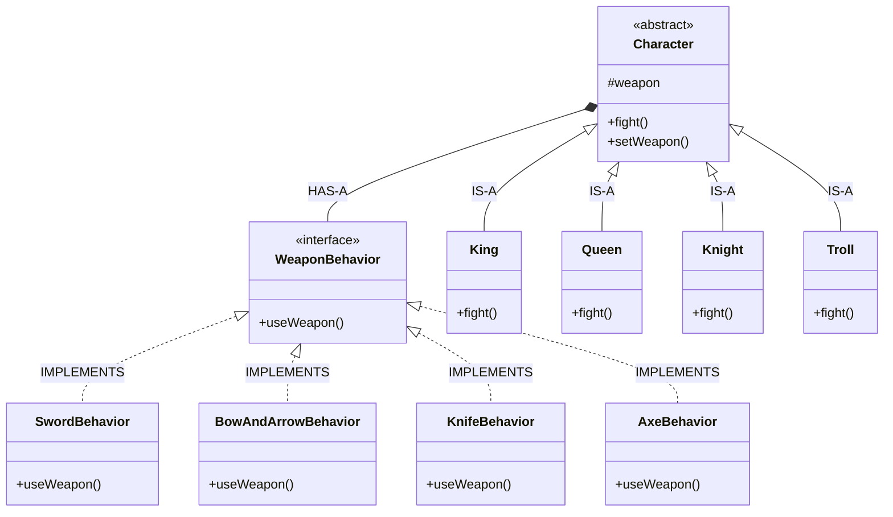

```java
setWeapon(WeaponBehavior w) {
    this.weapon = w;
}
```

!!! note "Notas marginales"
    *Un `Character` tiene-un (`HAS-A`) `WeaponBehavior`.*

    *Fíjate en que CUALQUIER objeto podría implementar la interfaz `WeaponBehavior`: digamos, un clip, un tubo de pasta de dientes o una lubina mutada.*

## Respuestas

### Cuestionario: desventajas de la herencia para el comportamiento de Pato

**¿Cuáles de las siguientes son desventajas de usar la subclasificación para proporcionar el comportamiento específico de Pato?** (Elige todas las que apliquen.) Aquí está nuestra solución.

- A. El código se duplica entre las subclases.
- B. Los cambios de comportamiento en tiempo de ejecución son difíciles.
- D. Es difícil adquirir conocimiento de todos los comportamientos de pato.
- F. Los cambios pueden afectar sin querer a otros patos.

### Cuestionario: factores que impulsan el cambio

Es posible que tu lista sea muy distinta, pero aquí van algunas de las nuestras. ¿Te suenan? Aquí está nuestra solución.

- Mis clientes o usuarios deciden que quieren otra cosa, o quieren nueva funcionalidad.
- Mi empresa decidió que se va con otro proveedor de base de datos y además está comprando sus datos a otro proveedor que usa un formato de datos distinto. ¡Arg!
- Bueno, la tecnología cambia y tenemos que actualizar nuestro código para aprovechar los protocolos.
- Hemos aprendido lo suficiente al construir nuestro sistema como para volver atrás y hacer las cosas un poco mejor.

### Cuestionario: implements `setWeapon()`

El conjunto de métodos `setWeapon()` va en la clase abstracta `Character`, porque es la superclase de todos los personajes y por lo tanto todos ellos necesitan poder cambiar de arma.

## Crucigrama de patrones de diseño: soluciones

| N.º | Dirección | Respuesta |
| --- | --- | --- |
| 1 | Horizontal | FLEXIBLE |
| 2 | Vertical | BRAIN |
| 3 | Vertical | DECOY |
| 4 | Horizontal | REUSED |
| 5 | Vertical | SQUEAK |
| 6 | Vertical | ENCAPSULATE |
| 7 | Horizontal | COMPOSITION |
| 8 | Horizontal | CHANGE |
| 9 | Horizontal | APIs |
| 10 | Horizontal | PRINCIPLES |
| 11 | Vertical | JACK BENNY |
| 12 | Horizontal | VOCABULARY |
| 13 | Vertical | OBSERVER |
| 14 | Horizontal | FRAMEWORKS |
| 15 | Horizontal | EXPERIENCE |
| 16 | Vertical | MAUI |
| 17 | Vertical | STRATEGY |
| 18 | Horizontal | INTERFACE |
