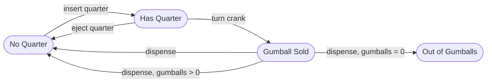
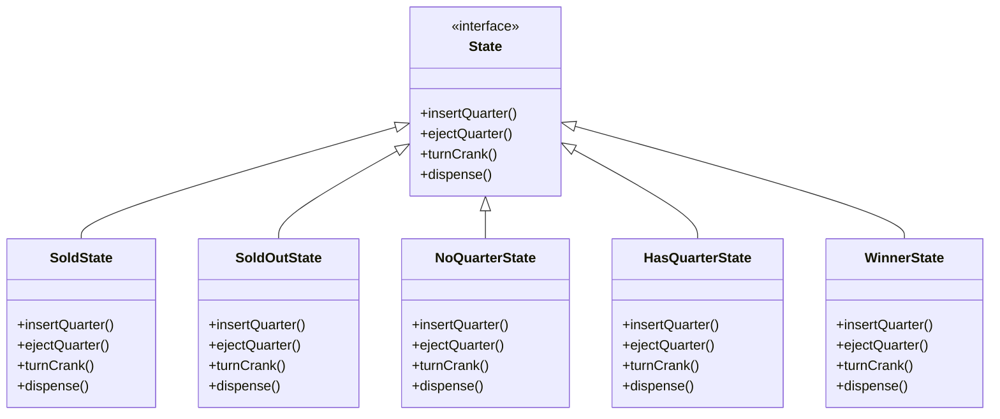
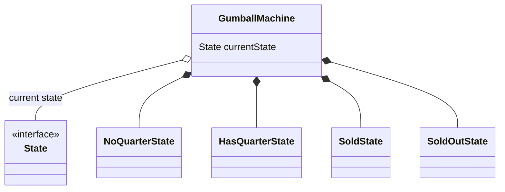
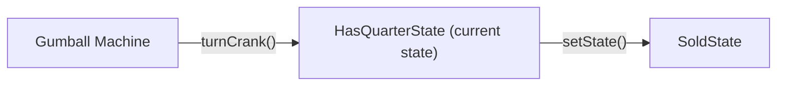
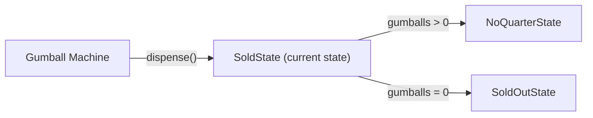
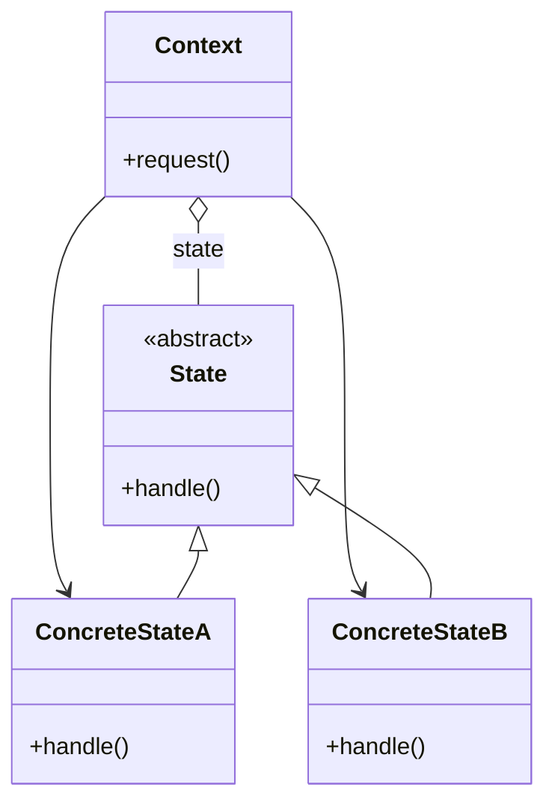
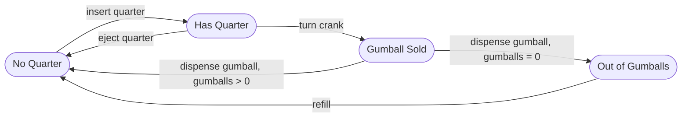
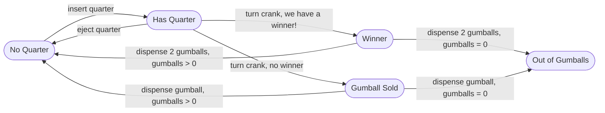

# Capítulo 10: El estado de las cosas

> Pensaba que las cosas en Objectville serían muy fáciles, pero ahora cada vez que me doy la vuelta llega otra petición de cambio. ¡Estoy al borde del colapso! Ay, quizá debería haber estado yendo desde el principio al grupo de patrones del miércoles por la noche de Betty. ¡Estoy en un estado espantoso!

Un hecho poco conocido: los patrones Strategy y State son gemelos separados al nacer. Cabría esperar que vivieran vidas similares, pero el patrón Strategy siguió adelante y creó un negocio increíble alrededor de los algoritmos intercambiables, mientras que State tomó el camino, quizá más noble, de ayudar a los objetos a controlar su comportamiento cambiando su estado interno. Por muy diferentes que acabaran siendo sus caminos, sin embargo, por debajo encontrarás casi exactamente el mismo diseño. ¿Cómo puede ser eso? Como verás, Strategy y State tienen intenciones muy distintas. Primero, vamos a meternos de lleno y ver de qué trata realmente el patrón State, y luego volveremos a explorar su relación al final del capítulo.

## Mandíbula Rota

Las máquinas de chicles se han modernizado. Así es: los grandes fabricantes han descubierto que, al instalar CPUs en sus máquinas expendedoras, pueden aumentar las ventas, monitorizar el inventario a través de la red y medir la satisfacción del cliente.

!!! note "Al menos eso es lo que ellos cuentan..."
    Con más precisión: creemos que simplemente se aburrieron de la tecnología de hacia 1800 y necesitaban encontrar una forma de que su trabajo fuera más emocionante.

Pero estos fabricantes son expertos en máquinas de chicles, no desarrolladores de software, y nos han pedido tu ayuda:

> Así pensamos que el controlador de la máquina de chicles necesita funcionar. ¡Esperamos que puedas implementar esto en Java por nosotros! Puede que en el futuro añadamos más comportamiento, así que necesitas mantener el diseño tan flexible y mantenible como sea posible!
>
> \- Ingenieros de Mighty Gumball

**Mighty Gumball, Inc.**
*Donde la máquina de chicles nunca está medio vacía*



## Conversación en el cubículo

Echemos un vistazo a este diagrama y veamos lo que quieren los de Mighty Gumball...

**Judy:** Este diagrama parece un diagrama de estados.

**Joe:** Correcto, cada uno de esos círculos es un estado...

**Judy:** ...y cada una de las flechas es una transición de estado.

**Frank:** Poco a poco, vosotros dos, hace demasiado que no estudio diagramas de estados. ¿Podéis recordarme de qué va todo esto?

**Judy:** Claro, Frank. Mira los círculos; esos son los estados. «No Quarter» probablemente es el estado inicial de la máquina de chicles, porque ahí está simplemente esperando a que metas tu moneda. Todos los estados son, sencillamente, configuraciones distintas de la máquina que se comportan de una manera concreta y necesitan alguna acción para llevarlas a otro estado.

**Joe:** Exacto. Mira, para pasar a otro estado necesitas hacer algo como meter una moneda en la máquina. ¿Ves la flecha que va de «No Quarter» a «Has Quarter»?

**Frank:** Sí...

**Joe:** Eso simplemente significa que, si la máquina de chicles está en el estado «No Quarter» y tú metes una moneda, pasará al estado «Has Quarter». Esa es la transición de estado.

**Frank:** ¡Ah, ya lo entiendo! Y si estoy en el estado «Has Quarter», puedo girar la manivela y pasar al estado «Gumball Sold», o expulsar la moneda y volver al estado «No Quarter».

**Judy:** ¡Lo has entendido!

**Frank:** Esto no parece tan difícil entonces. Obviamente tenemos cuatro estados, y creo que también tenemos cuatro acciones: «insert quarter», «eject quarter», «turn crank» y «dispense». Pero... cuando dispensamos, comprobamos si hay cero o más chicles en el estado «Gumball Sold», y entonces vamos o al estado «Out of Gumballs» o al estado «No Quarter». Así que en realidad tenemos cinco transiciones de un estado a otro.

**Judy:** Esa comprobación de cero o más chicles también implica que tenemos que llevar la cuenta del número de chicles. Cada vez que la máquina te da un chicle, podría ser el último, y si lo es, necesitamos pasar al estado «Out of Gumballs».

**Joe:** Además, no olvides que podrías hacer cosas sin sentido, como intentar expulsar la moneda cuando la máquina de chicles está en el estado «No Quarter», o insertar dos monedas.

**Frank:** Ah, no se me había ocurrido; también tendremos que ocuparnos de esas cosas.

**Joe:** Para cada acción posible simplemente tendremos que comprobar en qué estado estamos y actuar en consecuencia. ¡Podemos hacerlo! Empecemos a mapear el diagrama de estados al código...

## Repaso de las máquinas de estados

¿Cómo vamos a pasar de ese diagrama de estados a código real? Aquí tienes una breve introducción a la implementación de máquinas de estados:

1. Primero, reúne tus estados:

    !!! note "Aquí están los estados: cuatro en total"
        ```mermaid
        flowchart LR
            A(["No Quarter"])
            B(["Has Quarter"])
            C(["Gumball Sold"])
            D(["Out of Gumballs"])
        ```

2. A continuación, crea una variable de instancia que guarde el estado actual, y define valores para cada uno de los estados:

    !!! note "Vamos a llamar «Sold Out» a «Out of Gumballs» para abreviar"
        Aquí tienes cada estado representado como un entero único...

    ```java
    final static int SOLD_OUT = 0;
    final static int NO_QUARTER = 1;
    final static int HAS_QUARTER = 2;
    final static int SOLD = 3;
    ```

    !!! note "Y aquí tienes una variable de instancia que guarda el estado actual"
        La fijaremos a «Sold Out», ya que la máquina estará vacía cuando se saque por primera vez de su caja y se encienda.

    ```java
    int state = SOLD_OUT;
    ```

3. Ahora reunimos todas las acciones que pueden tener lugar en el sistema:

    !!! note "Estas acciones son la interfaz de la máquina de chicles: las cosas que puedes hacer con ella"
        ```mermaid
        flowchart LR
            GM["Gumball Machine"] --> A1["insert quarter"]
            GM --> A2["eject quarter"]
            GM --> A3["turn crank"]
            GM --> A4["dispense"]
        ```

    !!! note "Mirando el diagrama, invocar cualquiera de estas acciones provoca una transición de estado"
        Dispensar es más bien una acción interna: una acción que la máquina se invoca a sí misma.

4. Ahora creamos una clase que actúe como la máquina de estados. Para cada acción creamos un método que usa sentencias condicionales para determinar qué comportamiento es apropiado en cada estado. Por ejemplo, para la acción «insert quarter», podríamos escribir un método así:

    !!! note "Cada estado posible se comprueba con una sentencia condicional"
        ```java
        public void insertQuarter() {
            if (state == HAS_QUARTER) {
                System.out.println("You can't insert another quarter");
            } else if (state == NO_QUARTER) {
                state = HAS_QUARTER;
                System.out.println("You inserted a quarter");
            } else if (state == SOLD_OUT) {
                System.out.println("You can't insert a quarter, the machine is sold out");
            } else if (state == SOLD) {
                System.out.println("Please wait, we're already giving you a gumball");
            }
        }
        ```

    !!! note "Y muestra el comportamiento apropiado para cada estado posible"
        ...pero que también puede pasar a otros estados, tal y como se representa en el diagrama.

Con ese rápido repaso, ¡vamos a implementar la Gumball Machine!

## Escribiendo el código

Es hora de implementar la Gumball Machine. Ya sabemos que vamos a tener una variable de instancia que guarda el estado actual. A partir de ahí, solo necesitamos gestionar todas las acciones, comportamientos y transiciones de estado que pueden producirse. Para las acciones, necesitamos implementar insertar una moneda, retirar una moneda, girar la manivela y dispensar un chicle; también tenemos que implementar la condición de Gumball Machine vacía.

```java
public class GumballMachine {
    final static int SOLD_OUT = 0;
    final static int NO_QUARTER = 1;
    final static int HAS_QUARTER = 2;
    final static int SOLD = 3;
    int state = SOLD_OUT;
    int count = 0;
    public GumballMachine(int count) {
        this.count = count;
        if (count > 0) {
            state = NO_QUARTER;
        }
    }
    public void insertQuarter() {
        if (state == HAS_QUARTER) {
            System.out.println("You can't insert another quarter");
        } else if (state == NO_QUARTER) {
            state = HAS_QUARTER;
            System.out.println("You inserted a quarter");
        } else if (state == SOLD_OUT) {
            System.out.println("You can't insert a quarter, the machine is sold out");
        } else if (state == SOLD) {
            System.out.println("Please wait, we're already giving you a gumball");
        }
    }
```

!!! note "Aquí están los cuatro estados; coinciden con los estados del diagrama de estados de Mighty Gumball"

!!! note "Aquí está la variable de instancia que va a llevar la cuenta del estado en el que estamos. Empezamos en el estado `SOLD_OUT`"

!!! note "Tenemos una segunda variable de instancia que lleva la cuenta del número de chicles que hay en la máquina"

!!! note "El constructor recibe un inventario inicial de chicles. Si el inventario no es cero, la máquina entra en el estado `NO_QUARTER`, lo que significa que está esperando a que alguien inserte una moneda; en caso contrario, se queda en el estado `SOLD_OUT`"

!!! note "Ahora empezamos a implementar las acciones como métodos..."

!!! note "Cuando se inserta una moneda..."
    ...si ya había una moneda, se lo decimos al cliente... en caso contrario, aceptamos la moneda y pasamos al estado `HAS_QUARTER`.

!!! note "Si el cliente acaba de comprar un chicle, tiene que esperar hasta que la transacción se complete antes de insertar otra moneda"

!!! note "Y si la máquina está agotada, rechazamos la moneda"

```java
    public void ejectQuarter() {
        if (state == HAS_QUARTER) {
            System.out.println("Quarter returned");
            state = NO_QUARTER;
        } else if (state == NO_QUARTER) {
            System.out.println("You haven't inserted a quarter");
        } else if (state == SOLD) {
            System.out.println("Sorry, you already turned the crank");
        } else if (state == SOLD_OUT) {
            System.out.println("You can't eject, you haven't inserted a quarter yet");
        }
    }
```

!!! note "Ahora, si el cliente intenta retirar la moneda..."
    ...si hay una moneda, se la devolvemos y volvemos al estado `NO_QUARTER`... en caso contrario, si no hay ninguna, no podemos devolvérsela.

!!! note "Si el cliente acaba de girar la manivela, no podemos devolverle el dinero; ¡ya tiene el chicle!"

!!! note "No puedes expulsar si la máquina está agotada, ¡no acepta monedas!"

!!! note "Alguien está intentando hacer trampas a la máquina"

```java
    public void turnCrank() {
        if (state == SOLD) {
            System.out.println("Turning twice doesn't get you another gumball!");
        } else if (state == NO_QUARTER) {
            System.out.println("You turned but there's no quarter");
        } else if (state == SOLD_OUT) {
            System.out.println("You turned, but there are no gumballs");
        } else if (state == HAS_QUARTER) {
            System.out.println("You turned...");
            state = SOLD;
            dispense();
        }
    }
```

!!! note "Necesitamos una moneda primero"

!!! note "No podemos entregar chicles; no queda ninguno"

!!! note "¡Éxito! Se llevan un chicle. Cambiamos el estado a `SOLD` y llamamos al método `dispense()` de la máquina"

!!! note "Se llama para dispensar un chicle"

```java
    public void dispense() {
        if (state == SOLD) {
            System.out.println("A gumball comes rolling out the slot");
            count = count - 1;
            if (count == 0) {
                System.out.println("Oops, out of gumballs!");
                state = SOLD_OUT;
            } else {
                state = NO_QUARTER;
            }
        } else if (state == NO_QUARTER) {
            System.out.println("You need to pay first");
        } else if (state == SOLD_OUT) {
            System.out.println("No gumball dispensed");
        } else if (state == HAS_QUARTER) {
            System.out.println("You need to turn the crank");
        }
    }
    // other methods here like toString() and refill()
}
```

!!! note "Estamos en el estado `SOLD`; ¡le damos un chicle!"

!!! note "Aquí es donde gestionamos la condición «no quedan chicles»: si este era el último, ponemos el estado de la máquina en `SOLD_OUT`; en caso contrario, volvemos a no tener moneda"

!!! note "Ninguno de estos casos debería ocurrir nunca, pero si ocurre, le damos un error, no un chicle"

## Pruebas internas

Eso parece un diseño sólido y compacto, hecho con una metodología bien pensada, ¿verdad? Hagamos unas pruebas internas antes de entregarlo a Mighty Gumball para que lo carguen en sus máquinas de chicles reales. Aquí tienes nuestro banco de pruebas:

```java
public class GumballMachineTestDrive {
    public static void main(String[] args) {
        GumballMachine gumballMachine = new GumballMachine(5);
        System.out.println(gumballMachine);
        gumballMachine.insertQuarter();
        gumballMachine.turnCrank();
        System.out.println(gumballMachine);
        gumballMachine.insertQuarter();
        gumballMachine.ejectQuarter();
        gumballMachine.turnCrank();
        System.out.println(gumballMachine);
        gumballMachine.insertQuarter();
        gumballMachine.turnCrank();
        gumballMachine.insertQuarter();
        gumballMachine.turnCrank();
        gumballMachine.ejectQuarter();
        System.out.println(gumballMachine);
        gumballMachine.insertQuarter();
        gumballMachine.insertQuarter();
        gumballMachine.turnCrank();
        gumballMachine.insertQuarter();
        gumballMachine.turnCrank();
        gumballMachine.insertQuarter();
        gumballMachine.turnCrank();
        System.out.println(gumballMachine);
    }
}
```

!!! note "Cárgala con cinco chicles en total"

!!! note "Imprime el estado de la máquina"

!!! note "Mete una moneda..."

!!! note "Gira la manivela; deberíamos obtener nuestro chicle"

!!! note "Imprime el estado de la máquina de nuevo"

!!! note "Pide la moneda de vuelta"

!!! note "Gira la manivela; no deberíamos obtener nuestro chicle"

!!! note "Pide una moneda de vuelta que no hemos metido"

!!! note "Mete DOS monedas..."

!!! note "Ahora a las pruebas de resistencia..."

```text
%java GumballMachineTestDrive
Mighty Gumball, Inc.
Java-enabled Standing Gumball Model #2004
Inventory: 5 gumballs
Machine is waiting for quarter
You inserted a quarter
You turned...
A gumball comes rolling out the slot
Mighty Gumball, Inc.
Java-enabled Standing Gumball Model #2004
Inventory: 4 gumballs
Machine is waiting for quarter
You inserted a quarter
Quarter returned
You turned but there's no quarter
Mighty Gumball, Inc.
Java-enabled Standing Gumball Model #2004
Inventory: 4 gumballs
Machine is waiting for quarter
You inserted a quarter
You turned...
A gumball comes rolling out the slot
You inserted a quarter
You turned...
A gumball comes rolling out the slot
You haven't inserted a quarter
Mighty Gumball, Inc.
Java-enabled Standing Gumball Model #2004
Inventory: 2 gumballs
Machine is waiting for quarter
You inserted a quarter
You can't insert another quarter
You turned...
A gumball comes rolling out the slot
You inserted a quarter
You turned...
A gumball comes rolling out the slot
Oops, out of gumballs!
You can't insert a quarter, the machine is sold out
You turned, but there are no gumballs
Mighty Gumball, Inc.
Java-enabled Standing Gumball Model #2004
Inventory: 0 gumballs
Machine is sold out
```

## Ya lo sabías... ¡una petición de cambio!

Mighty Gumball, Inc. ha cargado tu código en su máquina más reciente y sus expertos en control de calidad lo están poniendo a prueba a fondo. Hasta ahora, todo tiene muy buena pinta desde su punto de vista.

De hecho, las cosas han ido tan bien que les gustaría llevarlo al siguiente nivel...

> Pensamos que, convirtiendo la «compra de chicles» en un juego, podemos aumentar significativamente nuestras ventas. Vamos a poner una de estas pegatinas en cada máquina. Nos alegra mucho tener Java en las máquinas, porque esto va a ser fácil, ¿verdad?
>
> \- El CEO de Mighty Gumball, Inc.

!!! warning "Regla de la pegatina"
    El 10 % de las veces, cuando se gira la manivela, el cliente recibe dos chicles en lugar de uno.

!!! exercise "Puzle de diseño"

    Dibuja un diagrama de estados para una Gumball Machine que gestione el concurso de 1 entre 10. En este concurso, el 10 % de las veces el estado `SOLD` da lugar a que se liberen dos chicles en lugar de uno. Comprueba tu respuesta con la nuestra (al final del capítulo) para asegurarte de que estamos de acuerdo antes de seguir adelante...

    !!! note "Usa la papelería de Mighty Gumball para dibujar tu diagrama de estados"

## El caótico estado de las cosas...

El hecho de que hayas escrito tu máquina de chicles siguiendo una metodología bien pensada no significa que vaya a ser fácil de extender. De hecho, cuando vuelvas a mirar tu código y pienses en lo que tendrás que hacer para modificarlo, pues...

Primero, tendrías que añadir aquí un nuevo estado `WINNER`. Eso no es tan malo...

```java
final static int SOLD_OUT = 0;
final static int NO_QUARTER = 1;
final static int HAS_QUARTER = 2;
final static int SOLD = 3;
```

```java
public void insertQuarter() {
    // insert quarter code here
}
```

!!! note "...pero entonces tendrías que añadir un nuevo condicional en cada uno de los métodos para gestionar el estado `WINNER`; eso es mucho código que modificar"

```java
public void ejectQuarter() {
    // eject quarter code here
}
```

```java
public void turnCrank() {
    // turn crank code here
}
```

```java
public void dispense() {
    // dispense code here
}
```

!!! note "El método `turnCrank()` se va a poner especialmente enrevesado, porque tendrías que añadir código para comprobar si tienes un `WINNER` y luego pasar al estado `WINNER` o al estado `SOLD`"

!!! question "¿Cuál de las siguientes opciones describe el estado de nuestra implementación?"
    Elige todas las que apliquen.

    - [ ] **A.** Este código desde luego no se está adhiriendo al principio Open-Closed.
    - [ ] **B.** Este código le haría sentir orgulloso a un programador de FORTRAN.
    - [ ] **C.** Este diseño ni siquiera es muy orientado a objetos.
    - [ ] **D.** Las transiciones de estado no son explícitas; están enterradas en medio de un montón de sentencias condicionales.
    - [ ] **E.** Aquí no hemos encapsulado nada que varíe.
    - [ ] **F.** Las adiciones posteriores probablemente provocarán errores en el código que ya funciona.

> Vale, esto no está bien. Creo que nuestra primera versión era genial, pero no va a aguantar con el paso del tiempo a medida que Mighty Gumball siga pidiendo comportamientos nuevos. La tasa de errores simplemente nos va a dejar mal, sin mencionar que el CEO nos va a volver locos.

**Frank:** Tienes toda la razón. Necesitamos refactorizar este código para que sea fácil de mantener y modificar.

**Judy:** Realmente deberíamos intentar localizar el comportamiento de cada estado para que, si hacemos cambios en un estado, no corramos el riesgo de estropear el demás código.

**Frank:** Exacto; en otras palabras, seguir aquel viejo principio de «encapsula lo que varía».

**Judy:** Exactamente.

**Frank:** Si ponemos el comportamiento de cada estado en su propia clase, entonces cada estado simplemente implementa sus propias acciones.

**Judy:** Correcto. Y quizá la Gumball Machine pueda simplemente delegar en el objeto `State` que representa el estado actual.

**Frank:** Ah, se te da bien: favorece la composición... más principios en acción.

**Judy:** Qué cute. Bueno, no estoy al 100 % seguro de cómo va a funcionar esto, pero creo que vamos por buen camino.

**Frank:** Me pregunto si esto hará más fácil añadir nuevos estados.

**Judy:** Creo que sí... Aún tendremos que cambiar código, pero los cambios estarán mucho más limitados en su alcance, porque añadir un nuevo estado significará que solo tenemos que añadir una nueva clase y quizá cambiar alguna transición por aquí y por allá.

**Frank:** Me gusta cómo suena eso. ¡Empecemos a darle forma a este nuevo diseño!

## El nuevo diseño

Parece que tenemos un plan nuevo: en lugar de mantener nuestro código actual, vamos a reelaborarlo para encapsular los objetos de estado en sus propias clases y después delegar en el estado actual cuando se produzca una acción.

Estamos siguiendo nuestros principios de diseño, así que deberíamos acabar con un diseño más fácil de mantener en el futuro. Así es como lo vamos a hacer:

1. Primero, vamos a definir una interfaz `State` que contenga un método para cada acción de la Gumball Machine.
2. A continuación, vamos a implementar una clase `State` para cada estado de la máquina. Estas clases serán responsables del comportamiento de la máquina cuando está en el estado correspondiente.
3. Por último, vamos a deshacernos de todo nuestro código condicional y delegar el trabajo en su lugar en la clase `State`.

!!! note "No solo estamos siguiendo principios de diseño, como verás, sino que además estamos implementando el patrón State. Pero llegaremos a todo el código oficial del patrón State después de reelaborar nuestro código..."

!!! note "Ahora vamos a meter todo el comportamiento de un estado en una sola clase. De ese modo localizamos el comportamiento y hacemos que las cosas sean mucho más fáciles de cambiar y de entender"

## Definiendo las interfaces y clases `State`

Primero vamos a crear una interfaz para `State`, que implementan todos nuestros estados:

```java
public interface State {
    void insertQuarter();
    void ejectQuarter();
    void turnCrank();
    void dispense();
}
```

!!! note "Aquí está la interfaz para todos los estados"
    Los métodos se corresponden directamente con acciones que pueden ocurrirle a la Gumball Machine (son los mismos métodos que en el código anterior).

A continuación, toma cada estado de nuestro diseño y encapsúlalo en una clase que implemente la interfaz `State`.

!!! note "Para averiguar qué estados necesitamos, miramos nuestro código anterior..."

```java
public class GumballMachine {
    final static int SOLD_OUT = 0;
    final static int NO_QUARTER = 1;
    final static int HAS_QUARTER = 2;
    final static int SOLD = 3;
    int state = SOLD_OUT;
    int count = 0;
}
```

!!! note "Y mapeamos cada estado directamente a una clase"



!!! note "No olvides que necesitamos también un nuevo estado «winner» que implemente la interfaz `State`. Volveremos a esto después de reimplementar la primera versión de la Gumball Machine"

!!! exercise "Tu turno: implementa los estados"

    Para implementar nuestros estados, primero necesitamos especificar el comportamiento de las clases cuando se llama a cada acción. Anota el siguiente diagrama con el comportamiento de cada acción en cada clase; ya hemos rellenado unas cuantas por ti.

    ```mermaid
    classDiagram
    class NoQuarterState {
        +insertQuarter()
        +ejectQuarter()
        +turnCrank()
        +dispense()
    }
    class HasQuarterState {
        +insertQuarter()
        +ejectQuarter()
        +turnCrank()
        +dispense()
    }
    class SoldState {
        +insertQuarter()
        +ejectQuarter()
        +turnCrank()
        +dispense()
    }
    class SoldOutState {
        +insertQuarter()
        +ejectQuarter()
        +turnCrank()
        +dispense()
    }
    class WinnerState {
        +insertQuarter()
        +ejectQuarter()
        +turnCrank()
        +dispense()
    }
    ```

    Las anotaciones que ya vienen rellenadas en el diagrama del libro son estas:

    - `NoQuarterState.insertQuarter()`: ir a `HasQuarterState`.
    - `NoQuarterState.ejectQuarter()`: decirle al cliente: «No has insertado ninguna moneda».
    - `HasQuarterState.turnCrank()`: ir a `SoldState`.
    - `SoldState.insertQuarter()`: decirle al cliente: «Por favor, espera, ya te estamos dando un chicle».
    - `SoldState.dispense()`: dispensar un chicle. Comprobar el número de chicles; si es > 0, ir a `NoQuarterState`; en caso contrario, ir a `SoldOutState`.
    - `SoldOutState.insertQuarter()`: decirle al cliente: «No quedan chicles».

    Adelante, rellénalo aunque lo implementemos más tarde.

## Implementando nuestras clases `State`

Es hora de implementar un estado: ya sabemos qué comportamientos queremos; solo necesitamos ponerlos por escrito en código. Vamos a seguir de cerca el código de la máquina de estados que escribimos, pero esta vez todo está separado en clases distintas.

Empecemos con el `NoQuarterState`:

```java
public class NoQuarterState implements State {
    GumballMachine gumballMachine;
    public NoQuarterState(GumballMachine gumballMachine) {
        this.gumballMachine = gumballMachine;
    }
    public void insertQuarter() {
        System.out.println("You inserted a quarter");
        gumballMachine.setState(gumballMachine.getHasQuarterState());
    }
    public void ejectQuarter() {
        System.out.println("You haven't inserted a quarter");
    }
    public void turnCrank() {
        System.out.println("You turned, but there's no quarter");
     }
    public void dispense() {
        System.out.println("You need to pay first");
    } 
}
```

!!! note "Primero tenemos que implementar la interfaz `State`"

!!! note "Nos pasan una referencia a la Gumball Machine por el constructor. Lo único que vamos a hacer es guardarla en una variable de instancia"

!!! note "Si alguien inserta una moneda, imprimimos un mensaje diciendo que la moneda se ha aceptado y luego cambiamos el estado de la máquina al `HasQuarterState`"

!!! note "Ya verás cómo funcionan estas cosas dentro de nada..."

!!! note "No puedes recuperar el dinero si nunca nos lo diste"

!!! note "Y no puedes llevarte un chicle si no nos pagas"

!!! note "No podemos estar dispensando chicles sin pago"

!!! note "Lo que estamos haciendo es implementar los comportamientos apropiados para el estado en el que estamos. En algunos casos, ese comportamiento incluye llevar la Gumball Machine a un estado nuevo"

## Reelaborando la clase `GumballMachine`

Antes de terminar las clases `State`, vamos a reelaborar la Gumball Machine: así podrás ver cómo encaja todo. Empezaremos por las variables de instancia relacionadas con el estado y cambiaremos el código de usar enteros a usar objetos de estado:

```java
public class GumballMachine {
    final static int SOLD_OUT = 0;
    final static int NO_QUARTER = 1;
    final static int HAS_QUARTER = 2;
    final static int SOLD = 3;
    int state = SOLD_OUT;
    int count = 0;
```

```java
public class GumballMachine {
    State soldOutState;
    State noQuarterState;
    State hasQuarterState;
    State soldState;
    State state = soldOutState;
    int count = 0;
```

!!! note "Código antiguo"

!!! note "Código nuevo"

!!! note "En la `GumballMachine`, actualizamos el código para usar las clases nuevas en lugar de los enteros estáticos. El código es bastante parecido, salvo que en una clase tenemos enteros y en la otra objetos..."

!!! note "Todos los objetos `State` se crean y se asignan en el constructor"

!!! note "Ahora esto guarda un objeto `State`, no un entero"

## Implementando más estados

Ahora que estás empezando a coger el ritmo de cómo encajan la Gumball Machine y los estados, vamos a implementar las clases `HasQuarterState` y `SoldState`...

```java
public class HasQuarterState implements State {
    GumballMachine gumballMachine;
    public HasQuarterState(GumballMachine gumballMachine) {
        this.gumballMachine = gumballMachine;
    }
    public void insertQuarter() {
        System.out.println("You can't insert another quarter");
    }
    public void ejectQuarter() {
        System.out.println("Quarter returned");
        gumballMachine.setState(gumballMachine.getNoQuarterState());
    }
    public void turnCrank() {
        System.out.println("You turned...");
        gumballMachine.setState(gumballMachine.getSoldState());
    }
    public void dispense() {
        System.out.println("No gumball dispensed");
    }
}
```

!!! note "Cuando se instancia el estado le pasamos una referencia a la GumballMachine. Esto se usa para hacer que la máquina pase a un estado diferente"

!!! note "Una acción inadecuada para este estado"

!!! note "Devuelve la moneda del cliente y vuelve al `NoQuarterState`"

!!! note "Cuando se gira la manivela hacemos que la máquina pase al estado `SoldState` llamando a su método `setState()` y pasándole el objeto `SoldState`"

!!! note "El objeto `SoldState` se recupera mediante el método getter `getSoldState()` (hay uno de estos métodos getter para cada estado)"

!!! note "Otra acción inadecuada para este estado"

Ahora vamos a ver la clase `SoldState`...

```java
public class SoldState implements State {
    //constructor and instance variables here
    public void insertQuarter() {
        System.out.println("Please wait, we're already giving you a gumball");
    }
    public void ejectQuarter() {
        System.out.println("Sorry, you already turned the crank");
    }
    public void turnCrank() {
        System.out.println("Turning twice doesn't get you another gumball!");
    }
    public void dispense() {
        gumballMachine.releaseBall();
        if (gumballMachine.getCount() > 0) {
            gumballMachine.setState(gumballMachine.getNoQuarterState());
        } else {
            System.out.println("Oops, out of gumballs!");
            gumballMachine.setState(gumballMachine.getSoldOutState());
        }
    }
}
```

!!! note "Aquí están todas las acciones inadecuadas para este estado"

!!! note "Y aquí es donde empieza el trabajo de verdad..."

!!! note "Estamos en el `SoldState`, lo que significa que el cliente ha pagado. Así que primero necesitamos pedirle a la máquina que libere un chicle"

!!! note "Después le preguntamos a la máquina cuál es el número de chicles y, o bien pasamos al `NoQuarterState`, o bien al `SoldOutState`"

!!! question "Una pregunta"
    Mira atrás la implementación de la `GumballMachine`. Si se gira la manivela y no tiene éxito (por ejemplo, si el cliente no insertó antes una moneda), llamamos a `dispense()` igualmente, aunque sea innecesario. ¿Cómo lo arreglarías?

!!! exercise "Tu turno: implementa un estado"

    Nos queda una clase que no hemos implementado: `SoldOutState`. ¿Por qué no la implementas tú? Para hacerlo, piensa con cuidado en cómo debería comportarse la Gumball Machine en cada situación. Comprueba tu respuesta antes de seguir adelante...

    ```java
    public class SoldOutState implements _______________  {
        GumballMachine gumballMachine;
        public SoldOutState(GumballMachine gumballMachine) {
        }
        public void insertQuarter() {
        }
        public void ejectQuarter() {
        }
        public void turnCrank() {
        }
        public void dispense() {
        }
    }
    ```

## Veamos lo que hemos hecho hasta ahora...

Para empezar, ahora tienes una implementación de Gumball Machine que es estructuralmente bastante distinta de tu primera versión y, sin embargo, funcionalmente es exactamente la misma. Al cambiar estructuralmente la implementación, has:

- Localizado el comportamiento de cada estado en su propia clase.
- Eliminado todos los condicionales `if` problemáticos que habrían sido difíciles de mantener.
- Cerrado cada estado a la modificación y, al mismo tiempo, dejado Gumball Machine abierta a la extensión añadiendo nuevas clases de estado (y lo haremos dentro de un momento).
- Creado una base de código y una estructura de clases que se ajusta mucho más al diagrama de Mighty Gumball y que resulta más fácil de leer y de entender.

Ahora veamos un poco más el aspecto funcional de lo que hemos hecho:

!!! note "Gumball Machine States"
    La Gumball Machine ahora contiene una instancia de cada clase `State`.



!!! note "El estado actual de la máquina es siempre una de estas instancias de clase."

!!! note "Cuando se llama a una acción, se delega en el estado actual."



!!! note "En este caso, se está llamando al método `turnCrank()` cuando la máquina está en el estado `HasQuarterState`, así que como resultado la máquina pasa al estado `SoldState`."

!!! note "TRANSICIÓN AL ESTADO SOLD"
    La máquina entra en el estado `Sold` y se dispensa un chicle...



!!! note "Más chicles"
    ...y entonces la máquina va a `dispense()` y pasa al estado `SoldOutState` o al `NoQuarterState` en función del número de chicles que queden en la máquina. Agotada.

## Tour autoguiado entre bambalinas

!!! exercise "Tour autoguiado entre bambalinas"
    Sigue los pasos de la Gumball Machine empezando por el estado `NoQuarterState`. Anota también el diagrama con las acciones y la salida de la máquina. Para este ejercicio puedes suponer que hay de sobra chicles en la máquina.

1. La máquina tiene un estado actual, el `NoQuarterState`, y delega en él la acción que llega del cliente.

    ```mermaid
    flowchart LR
        G["Gumball Machine"] -->|delegates| N["NoQuarterState (current state)"]
        N -->|"insertQuarter()"| H["HasQuarter state"]
    ```

2. Ahora el estado actual es el `HasQuarterState`; cuando el cliente gira la manivela, la acción se delega en ese estado.

    ```mermaid
    flowchart LR
        G["Gumball Machine"] -->|delegates| H["HasQuarterState (current state)"]
        H -->|"turnCrank()"| S["Sold state"]
    ```

3. Con el estado actual siendo el `SoldState`, la máquina llama a `dispense()` para entregar el chicle.

    ```mermaid
    flowchart LR
        G["Gumball Machine"] -->|delegates| S["SoldState (current state)"]
        S -->|"dispense()"| N["NoQuarter state"]
    ```

4. La máquina vuelve al `NoQuarterState` y el ciclo continúa.

    ```mermaid
    flowchart LR
        G["Gumball Machine"] -->|delegates| N["NoQuarterState (current state)"]
        N -->|"insertQuarter()"| H["HasQuarter state"]
    ```

## El patrón State definido

Sí, es cierto, ¡acabas de implementar el patrón State! Así que ahora veamos de qué va realmente:

!!! abstract "Definición del patrón State"
    El patrón State permite que un objeto altere su comportamiento cuando cambia su estado interno. El objeto parecerá cambiar de clase.

La primera parte de esta descripción tiene mucho sentido, ¿verdad? Como el patrón encapsula el estado en clases separadas y delega en el objeto que representa el estado actual, sabemos que el comportamiento cambia junto con el estado interno. Gumball Machine ofrece un buen ejemplo: cuando la máquina de chicles está en el `NoQuarterState` e insertas una moneda, obtienes un comportamiento distinto (la máquina acepta la moneda) que si insertas una moneda cuando está en el `HasQuarterState` (la máquina rechaza la moneda).

¿Y la segunda parte de la definición? ¿Qué significa que un objeto «parezca cambiar de clase»? Piénsalo desde la perspectiva de un cliente: si un objeto que estás usando cambia por completo su comportamiento, entonces te parece que el objeto está en realidad instanciado a partir de otra clase. En realidad, sin embargo, sabes que estamos usando composición para dar la apariencia de un cambio de clase simplemente referenciando objetos de estado distintos.

Bien, ahora es hora de echarle un vistazo al diagrama de clases del patrón State:



!!! note "La interfaz `State`"
    La interfaz `State` define una interfaz común para todos los estados concretos; como todos los estados implementan la misma interfaz, son intercambiables.

!!! note "El `Context`"
    El `Context` es la clase que puede tener un número de estados internos. En nuestro ejemplo, `GumballMachine` es el `Context`.

!!! note "La `request()` del Context delega en `state.handle()`"

!!! note "Muchos estados concretos son posibles"
    Cada vez que se hace una `request()` en el `Context`, se delega en el estado para que la gestione. Los `ConcreteState` gestionan las peticiones del `Context`. Cada `ConcreteState` proporciona su propia implementación para una petición. De este modo, cuando el `Context` cambia de estado, su comportamiento cambia también.

!!! tip "Espera un momento"
    Por lo que recuerdo del patrón Strategy, este diagrama de clases es EXACTAMENTE el mismo.

Tienes buen ojo (¡o te leíste el principio del capítulo!). Sí, los diagramas de clases son esencialmente los mismos, pero los dos patrones difieren en su intención.

Con el patrón State, tenemos un conjunto de comportamientos encapsulados en objetos de estado; en cualquier momento el contexto está delegando en uno de esos estados. Con el tiempo, el estado actual cambia a lo largo del conjunto de objetos de estado para reflejar el estado interno del contexto, así que el comportamiento del contexto también cambia con el tiempo. El cliente normalmente sabe muy poco, o directamente nada, sobre los objetos de estado.

Con Strategy, el cliente normalmente especifica el objeto de estrategia con el que el contexto está compuesto. Ahora bien, aunque el patrón ofrece la flexibilidad de cambiar el objeto de estrategia en tiempo de ejecución, a menudo hay un objeto de estrategia que es el más apropiado para un objeto de contexto dado. Por ejemplo, en el capítulo 1, algunos de nuestros patos estaban configurados para volar con un comportamiento de vuelo típico (como los patos reales), mientras que otros estaban configurados con un comportamiento de vuelo que los mantenía pegados al suelo (como los patos de goma y los patos de señuelo).

En general, piensa en el patrón Strategy como una alternativa flexible a la herencia de clases; si usas herencia para definir el comportamiento de una clase, entonces te quedas atado a ese comportamiento aunque necesites cambiarlo. Con Strategy puedes cambiar el comportamiento componiéndote con un objeto diferente.

Piensa en el patrón State como una alternativa a meter un montón de condicionales en tu contexto; al encapsular los comportamientos dentro de objetos de estado, sencillamente puedes cambiar el objeto de estado del contexto para cambiar su comportamiento.

## Preguntas y respuestas sobre el patrón State

!!! question "¿Tienen los `ConcreteState` que decidir siempre cuál es el siguiente estado?"
    **Pregunta:** En `GumballMachine`, los estados deciden cuál debería ser el siguiente estado. ¿Tienen siempre los `ConcreteState` que decidir a qué estado ir después?

    **Respuesta:** No, no siempre. La alternativa es dejar que sea el `Context` quien decida el flujo de las transiciones de estado. Como regla general, cuando las transiciones de estado son fijas, es apropriado ponerlas en el `Context`; sin embargo, cuando las transiciones son más dinámicas, normalmente se colocan en las propias clases de estado (por ejemplo, en `GumballMachine` la elección de la transición a `NoQuarter` o a `SoldOut` dependía del número de chicles en tiempo de ejecución). La desventaja de tener las transiciones de estado en las clases de estado es que creamos dependencias entre las clases de estado. En nuestra implementación de `GumballMachine` intentamos minimizar esto usando métodos getter en el `Context`, en lugar de codificar a mano clases de estado concretas explícitas. Fíjate en que, al tomar esta decisión, estás tomando una decisión sobre qué clases quedan «cerradas a la modificación» y qué clases quedan «abiertas a la extensión» a medida que el sistema evoluciona.

!!! note "Nota marginal"
    Para compartir tus estados, normalmente asignarás cada estado a una variable de instancia estática. Si tu estado necesita usar métodos o variables de instancia de tu `Context`, también tendrás que darle una referencia al `Context` en cada método `handler()`.

!!! question "¿No aumenta siempre el patrón State el número de clases?"
    **Pregunta:** Parece que usar el patrón State siempre aumenta el número de clases de nuestros diseños. ¡Mira cuántas clases más tenía nuestra `GumballMachine` que el diseño original!

    **Respuesta:** Tienes razón; al encapsular el comportamiento de estado en clases de estado separadas, siempre acabarás con más clases en tu diseño. Ese es a menudo el precio que pagas por la flexibilidad. A menos que tu código sea una implementación «de usar y tirar» que vas a descartar (sí, claro), considera construirlo con las clases adicionales y probablemente te agradecerás a ti mismo más adelante. Ten en cuenta que a menudo lo importante es el número de clases que expones a tus clientes, y hay formas de ocultar esas clases extra de tus clientes (por ejemplo, declarándolas con visibilidad de paquete). Considera también la alternativa: si tienes una aplicación con mucho estado y decides no usar objetos separados, acabarás en cambio con condicionales muy grandes y monolíticos. Eso hace que tu código sea difícil de mantener y de entender. Al usar objetos, haces que los estados sean explícitos y reduces el esfuerzo necesario para entender y mantener tu código.

!!! question "El diagrama muestra `State` como una clase abstracta, ¿no?"
    **Pregunta:** El diagrama de clases del patrón State muestra que `State` es una clase abstracta. Pero si usaste una interfaz en la implementación del estado de la máquina de chicles, ¿no?

    **Respuesta:** Sí. Dado que no teníamos ninguna funcionalidad común que poner en una clase abstracta, optamos por una interfaz. En tu propia implementación, quizá quieras considerar una clase abstracta. Hacerlo tiene la ventaja de permitirte añadir métodos a la clase abstracta más adelante, sin romper las implementaciones de los estados concretos.

!!! question "¿Interactúan los clientes directamente con los estados?"
    **Pregunta:** ¿Los clientes llegan a interactuar directamente con los estados?

    **Respuesta:** No. Los estados los usa el `Context` para representar su estado interno y su comportamiento, así que todas las peticiones a los estados provienen del `Context`. Los clientes no cambian directamente el estado del `Context`. Es trabajo del `Context` supervisar su estado, y normalmente no quieres que un cliente cambie el estado de un `Context` sin que ese `Context` lo sepa.

!!! question "¿Puedo compartir los objetos de estado entre varios `Context`?"
    **Pregunta:** Si tengo muchas instancias del `Context` en mi aplicación, ¿es posible compartir los objetos de estado entre ellas?

    **Respuesta:** Sí, por supuesto, y de hecho este es un escenario muy común. El único requisito es que tus objetos de estado no conserven su propio contexto interno; de lo contrario, necesitarías una instancia única por contexto.

## Todavía tenemos que terminar el juego 1 de 10

Recuerda, no hemos terminado. Tenemos un juego que implementar, pero ahora que ya tenemos implementado el patrón State, debería ser coser y cantar. Primero, necesitamos añadir un estado a la clase `GumballMachine`:

```java
public class GumballMachine {
    State soldOutState;
    State noQuarterState;
    State hasQuarterState;
    State soldState;
    State winnerState;
    State state = soldOutState;
    int count = 0;
    // methods here
}
```

!!! note "Aquí lo único que tienes que añadir es el nuevo `WinnerState` e inicializarlo en el constructor. No olvides que también tienes que añadir un método getter para `WinnerState`."

Ahora implementemos la clase `WinnerState`; es sorprendentemente similar a la clase `SoldState`:

```java
public class WinnerState implements State {
    // instance variables and constructor
    // insertQuarter error message
    // ejectQuarter error message
    // turnCrank error message
    public void dispense() {
        gumballMachine.releaseBall();
        if (gumballMachine.getCount() == 0) {
            gumballMachine.setState(gumballMachine.getSoldOutState());
        } else {
            gumballMachine.releaseBall();
            System.out.println("YOU'RE A WINNER! You got two gumballs for your quarter");
            if (gumballMachine.getCount() > 0) {
                gumballMachine.setState(gumballMachine.getNoQuarterState());
            } else {
                System.out.println("Oops, out of gumballs!");
                gumballMachine.setState(gumballMachine.getSoldOutState());
            }
        }
    }
}
```

!!! note "Igual que `SoldState`."

!!! note "Aquí soltamos dos chicles y luego vamos o bien al `NoQuarterState` o bien al `SoldOutState`."

!!! note "Si tenemos un segundo chicle, lo soltamos."

!!! note "Si hemos podido soltar dos chicles, le decimos al usuario que ha ganado."

## Terminar el juego

Nos queda un solo cambio por hacer: tenemos que implementar el juego de probabilidad aleatoria y añadir una transición al `WinnerState`. Vamos a añadir ambas cosas al `HasQuarterState`, ya que es ahí donde el cliente gira la manivela:

!!! note "Primero añadimos un generador de números aleatorios para generar el 10 % de probabilidad de ganar... y a continuación determinamos si ha ganado este cliente."

```java
public class HasQuarterState implements State {
    Random randomWinner = new Random(System.currentTimeMillis());
    GumballMachine gumballMachine;
    public HasQuarterState(GumballMachine gumballMachine) {
        this.gumballMachine = gumballMachine;
    }
    public void insertQuarter() {
        System.out.println("You can't insert another quarter");
    }
    public void ejectQuarter() {
        System.out.println("Quarter returned");
        gumballMachine.setState(gumballMachine.getNoQuarterState());
    }
    public void turnCrank() {
        System.out.println("You turned...");
        int winner = randomWinner.nextInt(10);
        if ((winner == 0) && (gumballMachine.getCount() > 1)) {
            gumballMachine.setState(gumballMachine.getWinnerState());
        } else {
            gumballMachine.setState(gumballMachine.getSoldState());
        }
    }
    public void dispense() {
        System.out.println("No gumball dispensed");
    }
}
```

!!! note "Si ganó y quedan suficientes chicles para poder darle dos, vamos al `WinnerState`; en caso contrario, vamos al `SoldState` (igual que hacíamos siempre)."

Vaya, ¡eso ha sido bastante sencillo de implementar! Solo añadimos un estado nuevo a `GumballMachine` y luego lo implementamos. Todo lo que teníamos que hacer a partir de ahí era implementar nuestro juego de probabilidad y pasar al estado correcto. Parece que nuestra nueva estrategia de código está dando fruto...

## Demo para el CEO de Mighty Gumball, Inc.

El CEO de Mighty Gumball se ha pasado para ver una demo de tu nuevo código del juego de chicles. ¡Ojalá esos estados estén todos en orden! Mantendremos la demo breve y dulce (que la atención de los CEO es corta está más que documentado), pero con la esperanza de que sea lo bastante larga como para que ganemos al menos una vez.

!!! note "Este código no ha cambiado realmente nada; solo lo hemos acortado un poco."

```java
public class GumballMachineTestDrive {
    public static void main(String[] args) {
        GumballMachine gumballMachine = new GumballMachine(5);
        System.out.println(gumballMachine);
        gumballMachine.insertQuarter();
        gumballMachine.turnCrank();
        System.out.println(gumballMachine);
        gumballMachine.insertQuarter();
        gumballMachine.turnCrank();
        gumballMachine.insertQuarter();
        gumballMachine.turnCrank();
        System.out.println(gumballMachine);
    }
}
```

!!! note "Una vez más, empezamos con una máquina de chicles con 5 chicles."

!!! note "Queremos obtener un estado ganador, así que simplemente seguimos metiendo monedas y girando la manivela. Imprimimos el estado de la máquina de chicles de vez en cuando..."

!!! info "El equipo de ingeniería al completo espera fuera de la sala de reuniones para ver si el nuevo diseño basado en el patrón State va a funcionar."

```text
%java GumballMachineTestDrive
Mighty Gumball, Inc.
Java-enabled Standing Gumball Model #2004
Inventory: 5 gumballs
Machine is waiting for quarter
You inserted a quarter
You turned...
A gumball comes rolling out the slot...
A gumball comes rolling out the slot...
YOU'RE A WINNER! You got two gumballs for your quarter
Mighty Gumball, Inc.
Java-enabled Standing Gumball Model #2004
Inventory: 3 gumballs
Machine is waiting for quarter
You inserted a quarter
You turned...
A gumball comes rolling out the slot...
You inserted a quarter
You turned...
A gumball comes rolling out the slot...
A gumball comes rolling out the slot...
YOU'RE A WINNER! You got two gumballs for your quarter
Oops, out of gumballs!
Mighty Gumball, Inc.
Java-enabled Standing Gumball Model #2004
Inventory: 0 gumballs
Machine is sold out
%
```

!!! tip "¡Sí! ¡Eso es la bomba!"

!!! note "Vaya, ¿y qué suerte la nuestra? En nuestra demo para el CEO, ganamos no una, ¡sino dos veces!"

!!! question "¿Por qué necesitamos el `WinnerState`?"
    **Pregunta:** ¿Por qué necesitamos el `WinnerState`? ¿No podría simplemente ser el `SoldState` el que dispensara dos chicles?

    **Respuesta:** Es una pregunta excelente. `SoldState` y `WinnerState` son casi idénticos, salvo que `WinnerState` dispensa dos chicles en lugar de uno. Desde luego podrías meter en `SoldState` el código para dispensar dos chicles. La desventaja es, por supuesto, que ahora tienes DOS estados representados en una sola clase `State`: el estado en el que eres ganador y el estado en el que no lo eres. Así que estás sacrificando claridad en tu clase `State` para reducir la duplicación de código. Otra cosa que tener en cuenta es el principio que aprendiste en el capítulo anterior: el Principio de Responsabilidad Única. Al meter la responsabilidad del `WinnerState` dentro del `SoldState`, lo que has hecho es darle al `SoldState` DOS responsabilidades. ¿Qué pasa cuando acaba la promoción? ¿O cuando cambian los premios del concurso? Así que es una compensación de criterios y se reduce a una decisión de diseño.

## Comprobación de cordura...

!!! note "Bravo!"
    ¡Gran trabajo, pandilla! Nuestras ventas ya se nos están disparando con el nuevo juego. Sabes, también fabricamos máquinas de refrescos, y estaba pensando que podríamos poner una de esas palancas de máquina tragaperras en el lateral y hacer de eso también un juego. Ya tenemos a niños de cuatro años apostando con las máquinas de chicles; ¿por qué parar ahí?

Sí, el CEO de Mighty Gumball probablemente necesita una revisión médica, pero de eso no estamos hablando aquí. Pensemos en algunos aspectos de `GumballMachine` que quizá queramos reforzar antes de enviar la versión de oro:

- Tenemos mucho código duplicado en los estados `Sold` y `Winner`, y quizá queramos limpiarlo. ¿Cómo lo haríamos? Podríamos convertir `State` en una clase abstracta e incorporar algunos comportamientos por defecto para los métodos; después de todo, los mensajes de error del tipo «Ya has insertado una moneda» no los va a ver el cliente. Así que todo el comportamiento de «respuesta de error» podría ser genérico y heredarse de la clase abstracta `State`.

!!! tip "Mierda, Jim, ¡soy una máquina de chicles, no una computadora!"

- El método `dispense()` siempre se llama, incluso si se gira la manivela cuando no hay moneda. Aunque la máquina funciona correctamente y no dispensa nada a menos que esté en el estado correcto, podríamos arreglarlo fácilmente haciendo que `turnCrank()` devuelva un booleano o introduciendo excepciones. ¿Cuál te parece una mejor solución?

- Toda la inteligencia para las transiciones de estado está en las clases `State`. ¿Qué problemas podría causar eso? ¿Querríamos mover esa lógica a `GumballMachine`? ¿Cuáles serían las ventajas y las desventajas de eso?

- ¿Vas a instanciar muchos objetos `GumballMachine`? Si es así, quizá quieras mover las instancias de estado a variables de instancia estáticas y compartirlas. ¿Qué cambios exigiría eso en `GumballMachine` y en los `States`?

## Charlas junto a la chimenea: State y Strategy

!!! note "El tema de esta noche"
    El reencuentro de Strategy y State.

**Strategy:** Hey, tío. ¿Te has enterado de que estuve en el capítulo 1?

**State:** Sí, la noticia se está extendiendo de sobra.

**Strategy:** Hace nada le estuve echando un cable a los del Template Method; necesitaba que les ayudara a terminar su capítulo. Así que, en fin, ¿qué está haciendo mi noble hermano?

**State:** Lo de siempre: ayudar a las clases a mostrar comportamientos distintos en estados distintos.

**Strategy:** No lo sé, siempre suenas como si hubieras copiado lo que yo hago y estuvieras usando palabras distintas para describirlo. Piénsalo: yo permito que los objetos incorporen comportamientos o algoritmos distintos mediante composición y delegación. Tú solo me estás copiando.

**State:** Admito que lo que hacemos está claramente relacionado, pero mi intención es totalmente distinta de la tuya. Y la forma en que enseño a mis clientes a usar la composición y la delegación es completamente diferente.

**Strategy:** ¿Ah, sí? ¿Cómo es eso? No lo entiendo.

**State:** Bueno, si dedicaras un poco más de tiempo a pensar en algo que no seas tú mismo, quizá lo entenderías. En fin, piensa en cómo trabajas tú: tienes una clase que estás instanciando y normalmente le das un objeto de estrategia que implementa algún comportamiento. Como, en el capítulo 1, cuando repartías comportamientos de graznido, ¿verdad? Los patos de verdad tenían un graznido de verdad; a los patos de goma les daba un graznido que chirriaba.

**Strategy:** Sí, ese fue buen trabajo... y estoy seguro de que puedes ver que eso es más potente que heredar tu comportamiento, ¿verdad?

**State:** Sí, por supuesto. Ahora, piensa en cómo trabajo yo; es totalmente diferente.

**Strategy:** Lo siento, vas a tener que explicarlo.

**State:** Bueno, cuando se crean mis objetos `Context`, puede que les indique en qué estado empezar, pero luego van cambiando de estado por su cuenta con el tiempo.

**Strategy:** Venga, vamos, que yo también puedo cambiar el comportamiento en tiempo de ejecución; ¡de eso va la composición!

**State:** Claro que puedes, pero la forma en que yo trabajo se articula en torno a estados discretos; mis objetos `Context` cambian de estado con el tiempo según un conjunto de transiciones de estado bien definido. Dicho de otro modo, cambiar de comportamiento está incorporado en mi esquema: ¡así es como funciono!

**Strategy:** Bueno, admito que yo no animo a mis objetos a tener un conjunto bien definido de transiciones entre estados. De hecho, normalmente prefiero controlar qué estrategia están usando mis objetos.

**State:** Mira, ya hemos dicho que nos parecemos en estructura, pero lo que hacemos es bastante distinto en intención. Sé honesto, el mundo tiene sitio para los dos.

**Strategy:** Sí, sí, sigue soñando con tus sueños, hermano. Te comportas como si fueras un gran patrón como yo, pero mira: yo estoy en el capítulo 1; a ti te han colocado bien al fondo, en el capítulo 10. Dime, ¿cuánta gente va a leer hasta aquí realmente?

**State:** ¿Me estás tomando el pelo? Esto es un libro Head First y los lectores de Head First son geniales. ¡Claro que van a llegar al capítulo 10!

**Strategy:** Ese es mi hermano, siempre el soñador.

## ¡Casi lo olvidamos!

!!! exercise "Una transición se nos pasó"
    Nos ha faltado poner una transición en la especificación original... ¡necesitamos una forma de rellenar la máquina de chicles cuando se queda sin chicles! Aquí tienes el nuevo diagrama... ¿puedes implementarlo por nosotros? Has hecho un trabajo tan bueno con el resto de la máquina de chicles que no tenemos ninguna duda de que puedes añadir esto en un santiamén.

**Mighty Gumball, Inc.**
*Donde la máquina de chicles nunca está medio vacía*



\- Los ingenieros de Mighty Gumball

!!! exercise "Tu turno: el método `refill()`"
    Necesitamos que escribas el método `refill()` para la máquina de chicles. Tiene un argumento —«el número de chicles que añades a la máquina»— y debería actualizar el contador de chicles de la máquina y restablecer el estado de la máquina.

!!! tip "Un último aviso"
    ¡Has hecho un trabajo increíble! Tengo algunas ideas más que van a cambiar la industria de los chicles y necesito que las implementes. ¡Shhh! Te las revelaré en el próximo capítulo.

## ¿Quién hace qué?

Empareja cada patrón con su descripción:

| Patrón | Descripción |
|---|---|
| State | Encapsula comportamientos intercambiables y usa la delegación para decidir cuál usar |
| Strategy | Las subclases deciden cómo implementar los pasos de un algoritmo |
| Template Method | Encapsula el comportamiento basado en estados y delega el comportamiento en el estado actual |

## Herramientas para tu caja de herramientas de diseño

Es el final de otro capítulo; ya tienes suficientes patrones aquí para pasar de largo cualquier entrevista de trabajo!

- El patrón State permite que un objeto tenga muchos comportamientos distintos basados en su estado interno.
- A diferencia de una máquina de estados procedural, el patrón State representa cada estado como una clase de pleno derecho.
- El `Context` obtiene su comportamiento delegando en el objeto de estado actual con el que está compuesto.
- Al encapsular cada estado en una clase, localizamos cualquier cambio que haya que hacer.
- Los patrones State y Strategy tienen el mismo diagrama de clases, pero difieren en su intención.
- El patrón Strategy configura normalmente las clases `Context` con un comportamiento o un algoritmo.
- El patrón State permite que un `Context` cambie su comportamiento a medida que cambia el estado del `Context`.
- Las transiciones de estado pueden variar de forma independiente de los clientes que las usan.
- Las transiciones de estado están controladas por las clases `State` o por las clases `Context`.
- Usar el patrón State normalmente dará como resultado un número mayor de clases en tu diseño.
- Las clases de estado pueden compartirse entre instancias de `Context`.

### Conceptos básicos de OO

!!! note "Conceptos básicos de OO"
    - Encapsula lo que varía.
    - Favorece la composición sobre la herencia.

### Principios OO

!!! note "Principios OO"
    - **Abstracción**: encapsula lo que varía. Favorece la composición sobre la herencia.
    - **Encapsulación**: programa contra interfaces, no contra implementaciones.
    - **Polimorfismo**: aspira a diseños débilmente acoplados entre los objetos que interactúan. Las clases deberían estar abiertas a la extensión pero cerradas a la modificación. Depende de las abstracciones, no de las clases concretas.
    - **Herencia**: habla solo con tus amigos. No nos llames, te llamaremos nosotros. Una clase debería tener una sola razón para cambiar.

!!! note "No hay principios nuevos en este capítulo. Eso te da tiempo para dormir en ellos."

### Patrones OO

- **Strategy**: define una familia de algoritmos, encapsula cada uno de ellos y los hace intercambiables. Strategy permite que el algoritmo varíe de forma independiente de los clientes que lo usan.
- **Observer**: define una relación uno-a-muchos de modo que, cuando un objeto cambia de estado, todos sus dependientes son notificados y actualizados.
- **Decorator**: adjunta responsabilidades adicionales a un objeto dinámicamente. Los decoradores proporcionan una alternativa flexible a la herencia para ampliar la funcionalidad especificando sus clases concretas.
- **Abstract Factory**: proporciona una interfaz para crear familias de objetos relacionados o dependientes sin especificar sus clases concretas.
- **Factory Method**: define una interfaz para crear un objeto, pero deja que las subclases decidan qué clase instanciar. Factory Method permite que una clase difiera la instanciación a las subclases.
- **Singleton**: garantiza que una clase solo tenga una instancia y proporciona un punto de acceso global a ella.
- **Command**: encapsula una petición como un objeto, permitiéndote parametrizar a los clientes con distintas peticiones, poner en cola o registrar peticiones y soportando operaciones deshacibles.
- **Adapter**: encapsula una petición como un objeto, permitiéndote adaptarla a la interfaz de otro objeto.
- **Facade**: encapsula una petición como un objeto, permitiéndote simplificar la interfaz de un grupo de clases o subsistemas.
- **State**: permite que un objeto altere su comportamiento cuando cambia su estado interno. El objeto parecerá cambiar de clase.

## Solución de los imanes de código

Dibuja un diagrama de estados para una Gumball Machine que gestione el concurso 1 de 10. En este concurso, el 10 % de las veces el estado `Sold` da lugar a que se liberen dos chicles, no uno. Aquí tienes nuestra solución.

**Mighty Gumball, Inc.**
*Donde la máquina de chicles nunca está medio vacía*



!!! success "¿Cuáles de las siguientes afirmaciones describen el estado de nuestra implementación?"
    (Elige todas las que apliquen.) Aquí tienes nuestra solución.

    - A. Este código desde luego no se está adhiriendo al Principio Abierto/Cerrado. ✔
    - B. Este código haría sentirse orgulloso a un programador de FORTRAN.
    - C. Este diseño ni siquiera está muy orientado a objetos.
    - D. Las transiciones de estado no son explícitas; están enterradas en medio de un montón de condicionales. ✔
    - E. No hemos encapsulado nada que varíe aquí.
    - F. Las adiciones posteriores probablemente provocarán errores en el código que ya funciona.

!!! exercise "Tu turno: implementa `SoldOutState`"
    Nos queda una clase que no hemos implementado: `SoldOutState`. ¿Por qué no la implementas tú? Para hacerlo, piensa con cuidado en cómo debería comportarse la Gumball Machine en cada situación. Aquí tienes nuestra solución.

```java
public class SoldOutState implements State {
    GumballMachine gumballMachine;
    public SoldOutState(GumballMachine gumballMachine) {
        this.gumballMachine = gumballMachine;
    }
    public void insertQuarter() {
        System.out.println("You can't insert a quarter, the machine is sold out");
    }
    public void ejectQuarter() {
        System.out.println("You can't eject, you haven't inserted a quarter yet");
    }
    public void turnCrank() {
        System.out.println("You turned, but there are no gumballs");
    }
    public void dispense() {
        System.out.println("No gumball dispensed");
    }
}
```

!!! note "En el estado `SoldOut` no podemos hacer realmente nada hasta que alguien rellene la Gumball Machine."

Para implementar los estados, primero tenemos que definir cuál será el comportamiento cuando se llame a la acción correspondiente. Anota el diagrama de abajo con el comportamiento de cada acción en cada clase; aquí tienes nuestra solución.

| Método | `NoQuarterState` | `HasQuarterState` | `SoldState` | `SoldOutState` | `WinnerState` |
|---|---|---|---|---|---|
| `insertQuarter()` | Ve a `HasQuarterState` | Dile al cliente: «No puedes insertar otra moneda» | Dile al cliente: «Espera, ya te estamos dando un chicle» | Dile al cliente: «La máquina está agotada» | Dile al cliente: «Espera, ya te estamos dando un chicle» |
| `ejectQuarter()` | Dile al cliente: «No has insertado una moneda» | Devuelve la moneda, ve al estado `NoQuarter` | Dile al cliente: «Lo sentimos, ya has girado la manivela» | Dile al cliente: «Todavía no has insertado una moneda» | Dile al cliente: «Lo sentimos, ya has girado la manivela» |
| `turnCrank()` | Dile al cliente: «Has girado, pero no hay moneda» | Ve al `SoldState` | Dile al cliente: «Girar dos veces no te da otro chicle» | Dile al cliente: «No hay chicles» | Dile al cliente: «Girar dos veces no te da otro chicle» |
| `dispense()` | Dile al cliente: «Primero tienes que pagar» | Dile al cliente: «No se ha dispensado ningún chicle» | Dispende un chicle. Comprueba el número de chicles; si es > 0, ve al estado `NoQuarter`; en caso contrario, ve al estado `SoldOut` | Dile al cliente: «No se ha dispensado ningún chicle» | Dispende dos chicles. Comprueba el número de chicles; si es > 0, ve al estado `NoQuarter`; en caso contrario, ve al `SoldOutState` |

## Solución del tour autoguiado entre bambalinas

!!! note "1. `insertQuarter()`"
    La Gumball Machine delega `insertQuarter()` en su estado actual, el `NoQuarterState`.

    ```mermaid
    flowchart LR
        G["Gumball Machine"] -->|"delegates insertQuarter()"| N["NoQuarterState (current state)"]
        N -->|setState| H["HasQuarter state"]
    ```

    Salida de la máquina: `You inserted a quarter`

!!! note "2. `turnCrank()`"
    La Gumball Machine delega `turnCrank()` en el estado actual, ahora el `HasQuarterState`.

    ```mermaid
    flowchart LR
        G["Gumball Machine"] -->|"delegates turnCrank()"| H["HasQuarterState (current state)"]
        H -->|setState| S["Sold state"]
    ```

    Salida de la máquina: `You turned...`

!!! note "3. `dispense()`"
    La Gumball Machine llama a la acción interna `dispense()` sobre el estado actual, el `SoldState`, y da un chicle...

    ```mermaid
    flowchart LR
        G["Gumball Machine"] -->|"calls dispense()"| S["SoldState (current state)"]
        S -->|releaseBall| N["NoQuarter"]
    ```

    Salida de la máquina: `A gumball comes rolling out the slot...`

!!! note "4. Vuelta al principio"
    ...y a continuación pasa al `NoQuarterState`, donde el ciclo vuelve a empezar.

    ```mermaid
    flowchart LR
        G["Gumball Machine"] -->|"delegates insertQuarter()"| N["NoQuarterState (current state)"]
        N -->|setState| H["HasQuarter state"]
    ```

    Salida de la máquina: `You inserted a quarter`

## Solución

Empareja cada patrón con su descripción:

!!! success "Relaciona cada patrón con su descripción"
    | Patrón | Descripción |
    |---|---|
    | State | Encapsula el comportamiento basado en estados y delega el comportamiento en el estado actual |
    | Strategy | Las subclases deciden cómo implementar los pasos de un algoritmo |
    | Template Method | Encapsula comportamientos intercambiables y usa la delegación para decidir cuál usar |

Para rellenar la Gumball Machine, añadimos un método `refill()` a la interfaz `State`, que cada `State` debe implementar. En todos los estados excepto en `SoldOutState`, el método no hace nada. En `SoldOutState`, `refill()` pasa a `NoQuarterState`. También añadimos un método `refill()` a `GumballMachine` que suma al contador de chicles y luego llama al método `refill()` del estado actual.

!!! note "Añadimos este método al `SoldOutState`..."

```java
public void refill() {
    gumballMachine.setState(gumballMachine.getNoQuarterState());
}
```

!!! note "...y añadimos este método a la clase `GumballMachine`."

```java
void refill(int count) {
    this.count += count;
    System.out.println("The gumball machine was just refilled; its new count is: " + this.count);
    state.refill();
}
```
