# Capítulo 11: El patrón Proxy

> ¿Alguna vez has jugado al «buen poli, mal poli»? Tú eres el buen poli y ofreces todos tus servicios de una forma agradable y amistosa, pero no quieres que todo el mundo te pida servicios, así que le encargas al mal poli que controle el acceso a ti. Eso es exactamente lo que hacen los proxies: controlar y gestionar el acceso. Como vas a ver, hay montones de maneras en las que los proxies sustituyen a los objetos a los que sirven de proxy. Se ha visto a los proxies transportar llamadas a métodos enteras a través de internet para sus objetos proxificados; también se les ha visto sustituir pacientemente a algunos objetos bastante perezosos.

!!! tip "Nota de la traducción"
    Los nombres de clases, interfaces y métodos (`GumballMachine`, `GumballMonitor`, `State`, `GumballMachineRemote`, `Naming.rebind()`...) se mantienen en inglés para que el código siga siendo válido y comparable con el original. La prosa, los comentarios y las explicaciones sí están traducidos. Los términos *proxy*, *stub* y *skeleton* se transliteran sin traducir por ser tecnicismos ya consolidados en la literatura en español.

**El CEO:** Hey, equipo, me gustaría conseguir un monitor mucho mejor para mis máquinas de gumballs. ¿Podéis encontrar una forma de obtener un informe con el inventario y el estado de las máquinas?

Suena bastante fácil. Si recuerdas, ya tenemos en el código de la máquina de gumballs los métodos para obtener el recuento de gumballs, `getCount()`, y para obtener el estado actual de la máquina, `getState()`.

Todo lo que tenemos que hacer es crear un informe que se pueda imprimir y enviar de vuelta al CEO. Hmmm, seguramente deberíamos añadir además un campo de ubicación a cada máquina de gumballs; así el CEO podrá distinguir las máquinas.

Vamos a meternos de lleno en el código. Le impresionaremos al CEO con un tiempo de entrega muy rápido.

!!! note "Nota marginal"
    ¿Te acuerdas del CEO de Mighty Gumball, Inc.?

## Programando el monitor

Empecemos añadiendo soporte a la clase `GumballMachine` para que pueda manejar ubicaciones:

```java
public class GumballMachine {

    // otras variables de instancia
    String location;

    public GumballMachine(String location, int count) {
        // aquí va el resto del código del constructor
        this.location = location;
    }

    public String getLocation() {
        return location;
    }
    // aquí van los otros métodos
}
```

!!! note "Notas marginales"
    Una ubicación no es más que un `String`.

    La ubicación se pasa al constructor y se guarda en la variable de instancia.

    Añadamos también un método *getter* para obtener la ubicación cuando la necesitemos.

Ahora vamos a crear otra clase, `GumballMonitor`, que recupere la ubicación de la máquina, el inventario de gumballs y el estado actual de la máquina, y los imprima en un pequeño informe:

```java
public class GumballMonitor {

    GumballMachine machine;

    public GumballMonitor(GumballMachine machine) {
        this.machine = machine;
    }

    public void report() {
        System.out.println("Gumball Machine: " + machine.getLocation());
        System.out.println("Current inventory: " + machine.getCount() + " gumballs");
        System.out.println("Current state: " + machine.getState());
    }
}
```

!!! note "Notas marginales"
    El monitor recibe la máquina en su constructor y la asigna a la variable de instancia `machine`.

    Nuestro método `report()` simplemente imprime un informe con la ubicación, el inventario y el estado de la máquina.

## Probando el monitor

Lo implementamos en un visto y hecho. El CEO va a estar eufórico y asombrado por nuestras habilidades de desarrollo.

Ahora solo necesitamos instanciar un `GumballMonitor` y darle una máquina que monitorizar:

```java
public class GumballMachineTestDrive {

    public static void main(String[] args) {
        int count = 0;
        if (args.length < 2) {
            System.out.println("GumballMachine <name> <inventory>");
            System.exit(1);
        }
        count = Integer.parseInt(args[1]);
        GumballMachine gumballMachine = new GumballMachine(args[0], count);
        GumballMonitor monitor = new GumballMonitor(gumballMachine);
        // aquí va el resto del código de prueba
        monitor.report();
    }
}
```

!!! note "Notas marginales"
    Pasa una ubicación y el número inicial de gumballs por línea de comandos.

    No olvides darle al constructor una ubicación y un recuento...

    ...e instanciar un monitor al que pasarle una máquina sobre la que emitir el informe.

    Cuando necesitamos un informe de la máquina, llamamos al método `report()`.

**El CEO:** La salida del monitor se ve genial, pero supongo que no me he explicado bien. ¡Necesito monitorizar máquinas de gumballs EN REMOTO! De hecho, ya tenemos las redes montadas para el monitorizado. Venga, guys, ¡se supone que sois la generación de internet!

!!! info "¡Y aquí está la salida!"
    ```text
    File  Edit   Window  Help  FlyingFish
    %java GumballMachineTestDrive Austin 112
    Gumball Machine: Austin
    Current Inventory: 112 gumballs
    Current State: waiting for quarter
    ```

**Frank:** No os preocupéis, guys, llevo un tiempo repasando mis patrones de diseño. Todo lo que necesitamos es un proxy remoto y estaremos listos para empezar.

!!! note "Nota marginal"
    Bueno, eso nos enseñará a reunir algunos requisitos antes de meternos a escribir código. Ojalá no tengamos que empezar de cero...

**Frank:** Un proxy remoto, ¿eh?

**Joe:** Un proxy remoto. Piénsalo: ya tenemos escrito el código del monitor, ¿verdad? Le damos a la clase `GumballMonitor` una referencia a una máquina y esta nos da un informe. El problema es que el monitor se ejecuta en la misma JVM que la máquina de gumballs, ¡y el CEO quiere quedarse en su escritorio y monitorizar las máquinas en remoto! ¿Qué pasaría si dejáramos nuestra clase `GumballMonitor` tal cual, pero le entregáramos un proxy de un objeto remoto?

**Frank:** No estoy seguro de entenderlo.

**Jim:** Yo tampoco.

**Joe:** Empecemos por el principio... un proxy es un sustituto de un objeto real. En este caso, el proxy se comporta exactamente como si fuera un objeto `GumballMachine`, pero por dentro se está comunicando a través de la red para hablar con la `GumballMachine` remota y real.

**Jim:** Entonces estás diciendo que dejamos nuestro código tal cual y le damos al monitor una referencia a una versión proxy de la `GumballMachine`...

**Frank:** Y ese proxy finge ser el objeto real, pero en realidad solo se está comunicando por la red con el objeto real.

**Joe:** Sí, esa es más o menos la historia.

**Frank:** Suena a algo más fácil de decir que de hacer.

**Joe:** Quizá, pero no creo que sea tan grave. Tenemos que asegurarnos de que la máquina de gumballs pueda actuar como un servicio y aceptar peticiones a través de la red; además necesitamos darle a nuestro monitor una forma de obtener una referencia a un objeto proxy, pero ya tenemos magníficas herramientas integradas en Java que nos ayudarán. Hablemos un poco más primero de los proxies remotos...

## El papel del «proxy remoto»

Un proxy remoto actúa como representante local de un objeto remoto. ¿Qué es un «objeto remoto»? Es un objeto que vive en el heap de otra Máquina Virtual Java (o, más en general, un objeto remoto que se está ejecutando en un espacio de direcciones distinto).

¿Y qué es un «representante local»? Es un objeto sobre el que puedes invocar métodos locales y que los reenvía al objeto remoto.

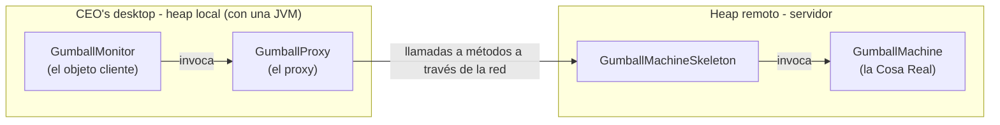

!!! note "Notas marginales"
    Máquina de gumballs remota con una JVM.

    Escritorio del CEO.

    El proxy finge ser el objeto remoto, pero no es más que un sustituto de la Cosa Real.

    Aquí la `GumballMonitor` es el objeto cliente; cree que está hablando con la máquina de gumballs real, pero en realidad solo está hablando con el proxy, y es el proxy quien después habla con la máquina real a través de la red.

    El objeto remoto **ES** la Cosa Real. Es el objeto que tiene el método que hace realmente el trabajo.

    Igual que tu antiguo código, solo que ahora estás hablando con un proxy.

    El objeto cliente es el objeto que hace uso del proxy; en nuestro caso, la clase `GumballMonitor`.

!!! tip "El tío apestoso"
    Tu objeto cliente se comporta como si estuviera haciendo llamadas a métodos remotos. Pero lo que realmente está haciendo es llamar a métodos sobre un objeto «proxy» del heap local que se encarga de todos los detalles de bajo nivel de la comunicación en red.

**Un miembro del equipo:** Esto es una idea bastante ingeniosa. Vamos a escribir un poco de código que recoja una invocación de método, la transfiera de algún modo a través de la red e invoque ese mismo método sobre un objeto remoto. Y supongo que, cuando la llamada termine, el resultado volverá por la red hasta nuestro cliente. Pero me parece que este código va a ser muy complicado de escribir.

**Otro miembro del equipo:** Para, para; no vamos a escribir ese código nosotros, está más o menos incorporado en la funcionalidad de invocación remota de Java. Lo único que tenemos que hacer es adaptar nuestro código para que aproveche RMI.

!!! exercise "1 · Piensa antes de continuar"
    Antes de seguir adelante, piensa en cómo diseñarías un sistema que permitiera habilitar la Invocación Remota de Métodos (RMI). ¿Cómo se lo pondrías fácil al desarrollador para que tuviera que escribir el menor código posible? ¿Cómo harías que la invocación remota pareciera transparente?

!!! exercise "2 · Una pregunta incómoda"
    ¿Deberían ser totalmente transparentes las llamadas remotas? ¿Es buena idea? ¿Cuál podría ser el problema de ese enfoque?

## Añadiendo un proxy remoto al código de monitorización de la máquina de gumballs

Sobre el papel, nuestro plan parece bueno, pero ¿cómo creamos un proxy que sepa invocar un método sobre un objeto que vive en otra JVM?

Hmmm. Bueno, no puedes obtener una referencia a algo que está en otro heap, ¿verdad? En otras palabras, no puedes decir:

```java
   Duck d = <object in another heap>
```

Lo que sea que referencie la variable `d` tiene que estar en el mismo espacio de heap que el código que ejecuta la sentencia. Entonces, ¿cómo abordamos esto? Bueno, aquí es donde entra la Invocación Remota de Métodos (RMI) de Java... RMI nos da una forma de encontrar objetos en una JVM remota y nos permite invocar sus métodos.

Ahora quizá sea un buen momento para repasar RMI con tu referencia favorita de Java, o puedes coger el desvío de RMI que viene a continuación y te recorreremos los puntos clave de RMI antes de añadir el soporte de proxy al código de la máquina de gumballs.

En cualquier caso, aquí está nuestro plan:

1. Primero, vamos a coger el desvío de RMI y explorar RMI. Aunque ya estés familiarizado con RMI, quizá quieras seguirnos y ojear el paisaje.
2. Después tomaremos nuestra máquina de gumballs y la convertiremos en un servicio remoto que proporcione un conjunto de llamadas a métodos que se puedan invocar de forma remota.
3. Por último, vamos a crear un proxy que sea capaz de hablar con una máquina de gumballs remota, otra vez usando RMI, y volveremos a montar el sistema de monitorización para que el CEO pueda monitorizar cualquier número de máquinas remotas.

!!! tip "Un desvío por RMI"
    Si eres nuevo en RMI, haz el desvío que ocupa las próximas páginas; en caso contrario, quizá quieras solo hojear rápidamente el desvío a modo de repaso. Y si prefieres continuar sin detenerte, ahora que ya captaste la idea del proxy remoto también está bien: puedes saltarte el desvío.

## Métodos remotos 101

!!! note "Notas marginales"
    Considera este diseño...

    El helper del cliente finge ser el servicio, pero no es más que un proxy de la Cosa Real.

    El objeto cliente cree que está hablando con el Servicio Real. De hecho, el helper es la cosa que realmente puede hacer el trabajo real.

    Esto va a ser nuestro proxy.

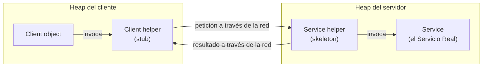

### Recorriendo el diseño

Digamos que queremos diseñar un sistema que nos permita llamar a un objeto local que reenvíe cada petición a un objeto remoto. ¿Cómo lo diseñaríamos? Necesitaríamos un par de objetos auxiliares que se encarguen de la comunicación por nosotros. Los helpers hacen posible que el cliente se comporte como si estuviera llamando a un método sobre un objeto local (que es lo que hace). El cliente llama a un método del helper del cliente, como si el helper del cliente fuera el servicio real. Después es el helper del cliente quien se encarga de reenviar esa petición por nosotros.

En otras palabras, el objeto cliente cree que está llamando a un método del servicio remoto, porque el helper del cliente está fingiendo ser el objeto de servicio; es decir, finge ser la cosa que tiene el método que el cliente quiere llamar.

Pero el helper del cliente no es realmente el servicio remoto. Aunque el helper del cliente se comporta como si lo fuera (porque tiene el mismo método que el servicio está anunciando), el helper del cliente no tiene ninguna de la lógica de métodos que el cliente espera. En su lugar, el helper del cliente contacta con el servidor, transfiere información sobre la llamada al método (p. ej., el nombre del método, los argumentos, etc.) y espera un valor de retorno del servidor.

En el lado del servidor, el helper del servicio recibe la petición del helper del cliente (a través de una conexión `Socket`), desempaqueta la información sobre la llamada y después invoca el método real sobre el objeto de servicio real. Así que, para el objeto de servicio, la llamada es local: viene del helper del servicio, no de un cliente remoto.

El helper del servicio obtiene el valor de retorno del servicio, lo empaqueta y lo envía de vuelta (por el flujo de salida de un `Socket`) al helper del cliente. El helper del cliente desempaqueta la información y devuelve el valor al objeto cliente.

Recorramos esto paso a paso para verlo más claro...

### Cómo se produce la llamada al método

1. **El objeto cliente llama a `doBigThing()` sobre el objeto helper del cliente.**
2. **El helper del cliente empaqueta información sobre la llamada** (argumentos, nombre del método, etc.) y la envía por la red al helper del servicio.
3. **El helper del servicio desempaqueta la información del helper del cliente**, averigua qué método hay que llamar (y sobre qué objeto) e invoca el método real sobre el objeto de servicio real.
4. **El método se invoca sobre el objeto de servicio**, que devuelve algún resultado al helper del servicio.
5. **El helper del servicio empaqueta la información devuelta por la llamada** y la envía de vuelta por la red al helper del cliente.
6. **El helper del cliente desempaqueta los valores devueltos** y los devuelve al objeto cliente. Para el objeto cliente, todo esto ha sido transparente.

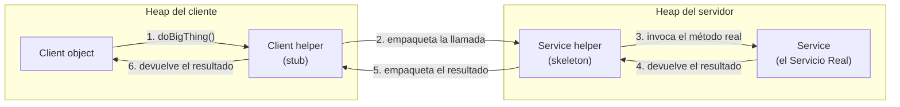

!!! note "Nota marginal"
    Recuerda que este es el objeto con la lógica REAL de los métodos. ¡El que hace el trabajo de verdad!

## Java RMI: el panorama general

Vale, ya tienes la idea de cómo funcionan los métodos remotos; ahora solo necesitas entender cómo usar RMI.

Lo que RMI hace por ti es construir los objetos helper del cliente y del servicio, hasta el punto de crear un objeto helper del cliente con los mismos métodos que el servicio remoto. Lo agradable de RMI es que no tienes que escribir tú mismo nada del código de red ni de E/S. Desde tu cliente, llamas a métodos remotos (es decir, los que tiene el Servicio Real) igual que llamas a métodos normales sobre objetos que se ejecutan en la propia JVM local del cliente.

!!! tip "El tío apestoso"
    Esto va a actuar como nuestro proxy.

RMI también proporciona toda la infraestructura de ejecución necesaria para que todo esto funcione, incluido un servicio de registro que el cliente puede usar para encontrar y acceder a los objetos remotos.

!!! note "Nomenclatura de RMI"
    En RMI, el helper del cliente es un «stub» y el helper del servicio es un «skeleton».

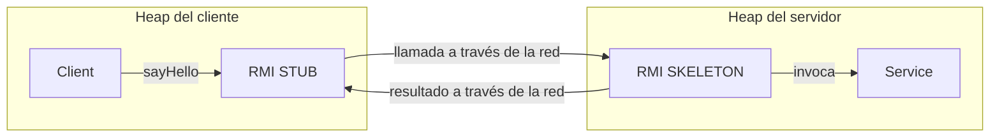

Ahora vamos a repasar todos los pasos necesarios para convertir un objeto en un servicio capaz de aceptar llamadas remotas, así como los pasos necesarios para que un cliente pueda hacer llamadas remotas.

Puede que quieras asegurarte de tener abrochado el cinturón de seguridad; hay muchos pasos, pero nada por lo que preocuparse demasiado.

## Crear el servicio remoto

Este es un resumen de los cinco pasos para crear el servicio remoto; en otras palabras, los pasos necesarios para tomar un objeto corriente y potenciarlo para que un cliente remoto pueda callinglo. Haremos esto más adelante con nuestra máquina de gumballs. Por ahora, fijémonos en los pasos y luego explicaremos cada uno en detalle.

!!! note "Notas marginales"
    Esta interfaz define los métodos remotos que quieres que llamen los clientes.

    El Servicio Real: la clase con los métodos que hacen el trabajo real. Implementa la interfaz remota.

1. **Paso uno: crear una interfaz remota.** `MyService.java`

    ```java
    public interface MyRemote extends Remote { }
    ```

    La interfaz remota define los métodos que un cliente puede llamar remotamente. Es lo que el cliente usará como tipo de clase para tu servicio. Tanto el *stub* como el servicio real implementarán esto.

2. **Paso dos: crear una implementación remota.** `MyServiceImpl.java`

    ```java
    public interface MyRemote extends Remote { }
    ```

    Esta es la clase que hace el trabajo real. Contiene la implementación real de los métodos remotos definidos en la interfaz remota. Es el objeto sobre el que el cliente quiere llamar a métodos (p. ej., `GumballMachine`).

3. **Paso tres: arrancar el registro RMI (`rmiregistry`).**

    !!! note "Nota marginal"
        Ejecuta esto en una ventana de terminal aparte.

    ```text
    File  Edit   Window  Help  Drink
    %rmiregistry
    ```

    El `rmiregistry` es como las páginas blancas de la guía telefónica. Es donde el cliente va a buscar el proxy (el objeto stub/helper del cliente).

4. **Paso cuatro: arrancar el servicio remoto.**

    !!! note "Nota marginal"
        Tienes que levantar y poner en marcha el objeto de servicio. Tu clase de implementación del servicio instancia una instancia del servicio y la registra en el registro RMI. Al registrarla, el servicio queda disponible para los clientes.

    ```text
    File  Edit   Window  Help  BeMerry
    %java MyServiceImpl
    ```

    ```text
    Stub                          Skeleton
    101101                        101101
    10 110 1                      10 110 1
    0 11 0                        0 11 0
    001 10                        001 10
    001 01                        001 01
    ```

    !!! note "Nota marginal"
        El stub y el skeleton se generan dinámicamente por ti entre bastidores.

## Paso uno: crear una interfaz Remote

1. **Extiende `java.rmi.Remote`**

    `Remote` es una interfaz «marcador», lo que significa que no tiene métodos. Sin embargo, tiene un significado especial para RMI, así que debes seguir esta regla. Fíjate en que decimos «extends» aquí. Una interfaz puede extender a otra interfaz.

    !!! note "Nota marginal"
        Esto nos dice que la interfaz se va a usar para soportar llamadas remotas.

    ```java
    public interface MyRemote extends Remote {
    ```

2. **Declara que todos los métodos lanzan `RemoteException`**

    La interfaz remota es la que el cliente usa como tipo para el servicio. En otras palabras, el cliente invoca métodos sobre algo que implementa la interfaz remota. Ese algo es el stub, por supuesto y, como el stub está haciendo red y E/S, pueden pasar toda clase de cosas malas. El cliente tiene que reconocer los riesgos gestionando o declarando las excepciones remotas. Si los métodos de una interfaz declaran excepciones, cualquier código que llame a métodos sobre una referencia de ese tipo (el tipo de la interfaz) debe gestionar o declarar las excepciones.

    !!! note "Nota marginal"
        La interfaz `Remote` está en `java.rmi`.

    ```java
    import java.rmi.*;

    public interface MyRemote extends Remote {
        public String sayHello() throws RemoteException;
    }
    ```

    !!! note "Nota marginal"
        Toda llamada a un método remoto se considera «de riesgo». Declarar `RemoteException` en cada método obliga al cliente a prestar atención y reconocer que puede que las cosas no funcionen.

3. **Asegúrate de que los argumentos y los valores de retorno son primitivos o `Serializable`**

    Los argumentos y los valores de retorno de un método remoto tienen que ser primitivos o `Serializable`. Piénsalo. Cualquier argumento de un método remoto tiene que empaquetarse y enviarse por la red, y eso se hace mediante *serialization*. Lo mismo ocurre con los valores de retorno. Si usas primitivos, `String` y la mayoría de los tipos de la API (incluidos los arrays y las colecciones), estarás bien. Si estás pasando tipos propios, asegúrate simplemente de que tus clases implementen `Serializable`.

    !!! note "Nota marginal"
        Consulta tu referencia favorita de Java si necesitas refrescar la memoria sobre `Serializable`.

    ```java
    public String sayHello() throws RemoteException;
    ```

    !!! note "Nota marginal"
        Este valor de retorno se va a enviar por el cable desde el servidor de vuelta al cliente, así que debe ser `Serializable`. Así es como se empaquetan y envían los argumentos y los valores de retorno.

## Paso dos: crear una implementación Remote

1. **Implementa la interfaz `Remote`**

    Tu servicio tiene que implementar la interfaz remota, la que tiene los métodos que tu cliente va a llamar.

    !!! note "Nota marginal"
        El compilador se asegurará de que hayas implementado todos los métodos de la interfaz que implementas. En este caso, solo hay uno.

    ```java
    public class MyRemoteImpl extends UnicastRemoteObject implements MyRemote {
        public String sayHello() {
            return "Server says, 'Hey'";
        }
        // más código en la clase
    }
    ```

2. **Extiende `UnicastRemoteObject`**

    Para poder funcionar como un objeto de servicio remoto, tu objeto necesita cierta funcionalidad relacionada con «ser remoto». La forma más sencilla es extender `UnicastRemoteObject` (del paquete `java.rmi.server`) y dejar que esa clase (tu superclase) haga el trabajo por ti.

    !!! note "Nota marginal"
        `UnicastRemoteObject` implementa `Serializable`, así que necesitamos el campo `serialVersionUID`.

    ```java
    public class MyRemoteImpl extends UnicastRemoteObject implements MyRemote {
        private static final long serialVersionUID = 1L;
    ```

3. **Escribe un constructor sin argumentos que declare `RemoteException`**

    Tu nueva superclase, `UnicastRemoteObject`, tiene un pequeño problema: su constructor lanza `RemoteException`. La única manera de lidiar con esto es declarar un constructor para tu implementación remota, solo para que tengas un sitio donde declarar `RemoteException`. Recuerda que, cuando se instancia una clase, siempre se llama a su constructor de la superclase. Si el constructor de tu superclase lanza una excepción, no tienes más remedio que declarar que tu constructor también lanza una excepción.

    !!! note "Nota marginal"
        No tienes que poner nada en el constructor. Solo necesitas una forma de declarar que el constructor de tu superclase lanza una excepción.

    ```java
    public MyRemoteImpl() throws RemoteException { }
    ```

4. **Registra el servicio en el registro RMI**

    Ahora que ya tienes un servicio remoto, tienes que hacerlo disponible para los clientes remotos. Lo haces instanciándolo y metiéndolo en el registro RMI (que debe estar en ejecución o esta línea de código fallará). Cuando registras el objeto de implementación, el sistema RMI en realidad pone el stub en el registro, ya que eso es lo que el cliente necesita de verdad. Registra tu servicio usando el método estático `rebind()` de la clase `java.rmi.Naming`.

    !!! note "Nota marginal"
        Dale a tu servicio un nombre (que los clientes puedan usar para buscarlo en el registro) y regístralo en el registro RMI. Cuando haces *bind* del objeto de servicio, RMI intercambia el servicio por el stub y pone el stub en el registro.

    ```java
    try {
        MyRemote service = new MyRemoteImpl();
        Naming.rebind("RemoteHello", service);
    } catch(Exception ex) {...}
    ```

## Paso tres: ejecutar rmiregistry

1. **Abre una terminal y arranca el `rmiregistry`.**

    Asegúrate de arrancarlo desde un directorio que tenga acceso a tus clases. La forma más sencilla es arrancarlo desde tu directorio de clases.

    ```text
    File  Edit   Window  Help  Huh?
    %rmiregistry
    ```

## Paso cuatro: arrancar el servicio

1. **Abre otra terminal y arranca tu servicio.**

    Puede que esto se haga desde un método `main()` en tu clase de implementación remota o desde una clase lanzadora aparte. En este ejemplo sencillo, ponemos el código de arranque en la clase de implementación, en un método `main` que instancia el objeto y lo registra en el registro RMI.

    ```text
    File  Edit   Window  Help  Huh?
    %java MyRemoteImpl
    ```

!!! question "¿Por qué muestras stubs y skeletons en los diagramas del código RMI?"
    Pensaba que nos habíamos deshecho de ellos hace tiempo.

!!! success "Respuesta"
    Tienes razón; para el skeleton, el entorno de ejecución de RMI puede despachar las llamadas del cliente directamente al servicio remoto usando reflexión, y los stubs se generan dinámicamente usando *Dynamic Proxy* (que veremos con más detalle un poco más adelante en el capítulo). El stub del objeto remoto es una instancia de `java.lang.reflect.Proxy` (con un *invocation handler*) que se genera automáticamente para manejar todos los detalles de llevar las llamadas a métodos locales del cliente hasta el objeto remoto. Pero nos gusta mostrar tanto el stub como el skeleton porque, conceptualmente, te ayuda a entender que hay algo entre bastidores que hace que ocurra esa comunicación entre el stub del cliente y el servicio remoto.

## Código completo del lado servidor

Veamos todo el código del lado servidor:

**La interfaz `Remote`:**

!!! note "Notas marginales"
    `RemoteException` y la interfaz `Remote` están en el paquete `java.rmi`.

    Tu interfaz **DEBE** extender `java.rmi.Remote`.

    Todos tus métodos remotos deben declarar `RemoteException`.

```java
import java.rmi.*;

public interface MyRemote extends Remote {
    public String sayHello() throws RemoteException;
}
```

**El servicio `Remote` (la implementación):**

!!! note "Notas marginales"
    `UnicastRemoteObject` está en el paquete `java.rmi.server`.

    Extender `UnicastRemoteObject` es la forma más fácil de crear un objeto remoto.

    ¡¡Tienes que implementar tu interfaz remota!!

    Tienes que implementar todos los métodos de la interfaz, por supuesto. Pero fíjate en que **NO** tienes que declarar el `RemoteException`.

    El constructor de tu superclase (el de `UnicastRemoteObject`) declara una excepción, así que **TÚ** tienes que escribir un constructor, porque eso significa que tu constructor está llamando a código de riesgo (el constructor de su superclase).

    Crea el objeto remoto y luego «haz *bind*» de él en el `rmiregistry` usando el `Naming.rebind()` estático. El nombre con el que lo registres es el nombre que usarán los clientes para buscarlo en el registro RMI.

```java
import java.rmi.*;
import java.rmi.server.*;

public class MyRemoteImpl extends UnicastRemoteObject implements MyRemote {

    private static final long serialVersionUID = 1L;

    public String sayHello() {
        return "Server says, 'Hey'";
    }

    public MyRemoteImpl() throws RemoteException { }

    public static void main (String[] args) {
        try {
            MyRemote service = new MyRemoteImpl();
            Naming.rebind("RemoteHello", service);
        } catch(Exception ex) {
            ex.printStackTrace();
        }
    }
}
```

## Cómo obtiene el cliente el objeto stub

!!! question "¿Cómo obtiene el cliente realmente el objeto stub?"

!!! success "Respuesta"
    Y aquí es donde entra el registro RMI. Y tienes razón; el cliente tiene que obtener el objeto stub (nuestro proxy), porque eso es aquello sobre lo que el cliente llamará a los métodos. Para hacerlo, el cliente hace una «búsqueda», como si consultara las páginas blancas de una guía telefónica, y esencialmente dice: «Este es un nombre, y me gustaría el stub que va asociado a ese nombre».

    Veamos el código que necesitamos para buscar y recuperar un objeto stub.

!!! example "Código de cerca"
    El cliente siempre usa la interfaz remota como tipo del servicio. De hecho, el cliente nunca necesita conocer el nombre real de la clase de tu servicio remoto.

    `lookup()` es un método estático de la clase `Naming`.

    Este tiene que ser el nombre con el que se registró el servicio.

    Tienes que hacer el *cast* a la interfaz, ya que el método `lookup()` devuelve tipo `Object`.

    El nombre de host o la dirección IP donde se está ejecutando el servicio. (`127.0.0.1` es *localhost*.)

    ```java
    MyRemote service =
        (MyRemote) Naming.lookup("rmi://127.0.0.1/RemoteHello");
    ```

    Así es como funciona, en la página siguiente.

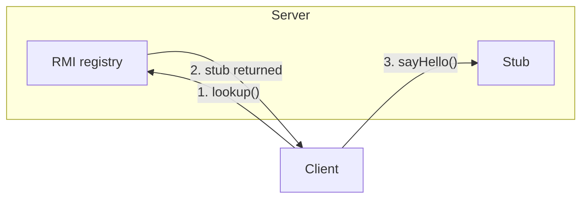

### Cómo funciona

1. **El cliente hace una búsqueda en el registro RMI.**

    ```java
    Naming.lookup("rmi://127.0.0.1/RemoteHello");
    ```

2. **El registro RMI devuelve el objeto stub** (como valor de retorno del método `lookup`) y RMI deserializa el stub automáticamente.
3. **El cliente invoca un método sobre el stub**, como si el stub **FUERA** el servicio real.

## Código completo del lado cliente

Veamos todo el código del lado cliente:

!!! note "Notas marginales"
    La clase `Naming` (para hacer la búsqueda en el `rmiregistry`) está en el paquete `java.rmi`.

    Sale del registro con tipo `Object`, así que no olvides el *cast*.

    Necesitas la dirección IP o el nombre de host...

    ...y el nombre usado para hacer *bind*/*rebind* del servicio.

    ¡Parece una llamada a método normal y corriente! (Salvo que debe reconocer el `RemoteException`.)

```java
import java.rmi.*;

public class MyRemoteClient {
    public static void main (String[] args) {
        new MyRemoteClient().go();
    }

    public void go() {
        try {
            MyRemote service = (MyRemote) Naming.lookup("rmi://127.0.0.1/RemoteHello");
            String s = service.sayHello();
            System.out.println(s);
        } catch(Exception ex) {
            ex.printStackTrace();
        }
    }
}
```

!!! warning "Las cosas que los programadores hacen mal con RMI"
    1. Olvidarse de arrancar el `rmiregistry` antes de arrancar el servicio remoto (cuando el servicio se registra usando `Naming.rebind()`, ¡el `rmiregistry` tiene que estar en marcha!).

    2. Olvidarse de hacer serializables los argumentos y los tipos de retorno (no te enterarás hasta el momento de ejecución; esto no es algo que el compilador pueda detectar).

## Volviendo a nuestro proxy remoto de GumballMachine

Vale, ahora que tienes los fundamentos de RMI claros, ya tienes las herramientas que necesitas para implementar el proxy remoto de la máquina de gumballs. Veamos cómo encaja la `GumballMachine` en este marco:

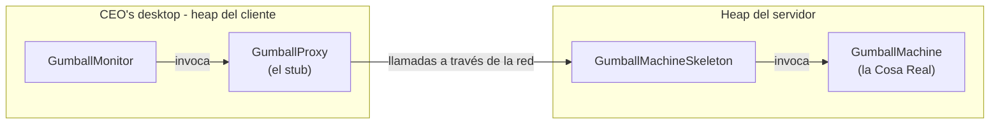

!!! note "Notas marginales"
    Máquina de gumballs remota con una JVM.

    Escritorio del CEO.

    El stub es un proxy del `GumballMachine` remoto.

    Este es nuestro código de monitor. Usa un proxy para hablar con las máquinas de gumballs remotas.

    La `GumballMachine` va a exponer una interfaz remota para que la use el cliente.

    El skeleton acepta las llamadas remotas y hace que todo funcione en el lado del servicio.

!!! exercise "Detente y piensa"
    Detente y reflexiona sobre cómo vamos a adaptar el código de la máquina de gumballs para que funcione con un proxy remoto. Tómate la libertad de hacer aquí algunas notas sobre lo que hay que cambiar y lo que va a ser diferente respecto a la versión anterior.

## Preparando la GumballMachine para que sea un servicio remoto

El primer paso para convertir nuestro código y usar el proxy remoto es hacer que la `GumballMachine` sirva peticiones remotas de los clientes. En otras palabras, vamos a convertirla en un servicio. Para hacer eso necesitamos:

1. Crear una interfaz remota para la `GumballMachine`. Esta proporcionará un conjunto de métodos que se puedan llamar de forma remota.
2. Asegurarnos de que todos los tipos de retorno de la interfaz son serializables.
3. Implementar la interfaz en una clase concreta.

Empecemos por la interfaz remota:

!!! note "Notas marginales"
    No olvides importar `java.rmi.*`.

    Esta es la interfaz remota.

    Aquí están los métodos que vamos a soportar. Todos los tipos de retorno tienen que ser primitivos o `Serializable`...

    Cada uno de ellos lanza `RemoteException`.

```java
import java.rmi.*;

public interface GumballMachineRemote extends Remote {
    public int getCount() throws RemoteException;
    public String getLocation() throws RemoteException;
    public State getState() throws RemoteException;
}
```

Tenemos un tipo de retorno que no es `Serializable`: la clase `State`. Vamos a arreglarlo...

!!! note "Nota marginal"
    `Serializable` está en el paquete `java.io`.

    Entonces simplemente extendemos la interfaz `Serializable` (que no tiene ningún método dentro). Y ahora `State`, en todas sus subclases, se puede transferir a través de la red.

```java
import java.io.*;

public interface State extends Serializable {
    public void insertQuarter();
    public void ejectQuarter();
    public void turnCrank();
    public void dispense();
}
```

En realidad, todavía no hemos terminado con `Serializable`; tenemos un problema con `State`. Como recordarás, cada objeto `State` mantiene una referencia a una máquina de gumballs para que pueda llamar a los métodos de la máquina y cambiar su estado. No queremos que la máquina de gumballs entera se serialice y se transfiera junto con el objeto `State`. Hay una forma fácil de arreglarlo:

!!! note "Nota marginal"
    En cada implementación de `State`, añadimos el `serialVersionUID` y la palabra clave `transient` a la variable de instancia `GumballMachine`. La palabra clave `transient` le indica a la JVM que no serialice este campo. Ten en cuenta de que esto puede ser ligeramente peligroso si intentas acceder a este campo una vez que el objeto ha sido serializado y transferido.

```java
public class NoQuarterState implements State {
    private static final long serialVersionUID = 2L;
    transient GumballMachine gumballMachine;
    // aquí van todos los demás métodos
}
```

Ya hemos implementado nuestra `GumballMachine`, pero tenemos que asegurarnos de que puede actuar como un servicio y gestionar las peticiones que llegan desde la red. Para hacer eso, tenemos que asegurarnos de que la `GumballMachine` está haciendo todo lo necesario para implementar la interfaz `GumballMachineRemote`.

Como ya has visto en el desvío por RMI, esto es bastante sencillo; lo único que tenemos que hacer es añadir un par de cosas...

!!! note "Notas marginales"
    Primero, necesitamos importar los paquetes de RMI.

    La `GumballMachine` va a extender de `UnicastRemoteObject`; esto le da la capacidad de actuar como un servicio remoto.

    La `GumballMachine` también necesita implementar la interfaz remota...

    ...y el constructor necesita lanzar una excepción remota, porque lo hace la superclase.

    ¡Eso es todo! ¡Aquí no cambia absolutamente nada!

```java
import java.rmi.*;
import java.rmi.server.*;

public class GumballMachine
        extends UnicastRemoteObject implements GumballMachineRemote {
    private static final long serialVersionUID = 2L;
    // aquí van las otras variables de instancia
    public GumballMachine(String location, int numberGumballs) throws RemoteException {
        // código aquí
    }
    public int getCount() {
        return count;
    }
    public State getState() {
        return state;
    }
    public String getLocation() {
        return location;
    }
    // aquí van los otros métodos
}
```

## Registrando el servicio de gumballs en el registro RMI...

Con esto queda terminado el servicio de la máquina de gumballs. Ahora solo hay que arrancarlo para que pueda recibir peticiones. Primero, tenemos que asegurarnos de registrarlo en el registro RMI para que los clientes puedan localizarlo.

Vamos a añadir un poco de código al test drive que se encargará de esto por nosotros:

```java
public class GumballMachineTestDrive {
    public static void main(String[] args) {
        GumballMachineRemote gumballMachine = null;
        int count;
        if (args.length < 2) {
            System.out.println("GumballMachine <name> <inventory>");
            System.exit(1);
        }
        try {
            count = Integer.parseInt(args[1]);
            gumballMachine = new GumballMachine(args[0], count);
            Naming.rebind("//" + args[0] + "/gumballmachine", gumballMachine);
        } catch (Exception e) {
            e.printStackTrace();
        }
    }
}
```

!!! note "Notas marginales"
    Primero necesitamos añadir un bloque `try`/`catch` alrededor de la instanciación de la máquina de gumballs, porque ahora nuestro constructor puede lanzar excepciones.

    También añadimos la llamada a `Naming.rebind`, que publica el stub de la `GumballMachine` bajo el nombre `gumballmachine`.

    Estamos usando las máquinas «oficiales» de Mighty Gumball; deberías sustituir aquí tu propio nombre de máquina, o «localhost».

Venga, vamos a poner esto en marcha...

!!! info "Ejecuta esto primero"
    Esto levanta el servicio de registro RMI y lo deja en marcha.

    ```text
    File  Edit   Window  Help  Huh?
    % rmiregistry
    ```

!!! info "Ejecuta esto segundo"
    Esto levanta la `GumballMachine` y la registra en el registro RMI.

    ```text
    File  Edit   Window  Help  Huh?
    % java GumballMachineTestDrive austin.mightygumball.com 100
    ```

## Ahora el cliente GumballMonitor...

¿Te acuerdas del `GumballMonitor`? Queríamos reutilizarlo sin tener que reescribirlo para que funcionara sobre una red. Bueno, es más o menos lo que vamos a hacer, pero necesitamos hacer algunos cambios.

!!! note "Notas marginales"
    Tenemos que importar el paquete RMI porque estamos usando la clase `RemoteException` más abajo...

    Ahora vamos a basarnos en la interfaz remota en lugar de en la clase concreta `GumballMachine`.

    También necesitamos capturar cualquier excepción remota que pueda producirse al intentar invocar métodos que, en última instancia, ocurren a través de la red.

```java
import java.rmi.*;

public class GumballMonitor {
    GumballMachineRemote machine;

    public GumballMonitor(GumballMachineRemote machine) {
        this.machine = machine;
    }
    public void report() {
        try {
            System.out.println("Gumball Machine: " + machine.getLocation());
            System.out.println("Current inventory: " + machine.getCount() + " gumballs");
            System.out.println("Current state: " + machine.getState());
        } catch (RemoteException e) {
            e.printStackTrace();
        }
    }
}
```

**Joe:** Joe tenía razón; esto está funcionando bastante bien.

## Escribiendo el test drive del monitor

Ahora ya tenemos todas las piezas que necesitamos. Solo tenemos que escribir un poco de código para que el CEO pueda monitorizar un montón de máquinas de gumballs:

!!! note "Notas marginales"
    Aquí tienes el test drive del monitor. ¡El CEO va a ejecutar esto!

    Aquí están todas las ubicaciones que vamos a monitorizar.

    Creamos un array de ubicaciones, uno por cada máquina.

    También creamos un array de monitores.

```java
import java.rmi.*;

public class GumballMonitorTestDrive {
    public static void main(String[] args) {
        String[] location = {"rmi://santafe.mightygumball.com/gumballmachine",
                             "rmi://boulder.mightygumball.com/gumballmachine",
                             "rmi://austin.mightygumball.com/gumballmachine"};
        GumballMonitor[] monitor = new GumballMonitor[location.length];
        for (int i=0; i < location.length; i++) {
            try {
                GumballMachineRemote machine =
                        (GumballMachineRemote) Naming.lookup(location[i]);
                monitor[i] = new GumballMonitor(machine);
                System.out.println(monitor[i]);
            } catch (Exception e) {
                e.printStackTrace();
            }
        }
        for (int i=0; i < monitor.length; i++) {
            monitor[i].report();
        }
    }
}
```

!!! note "Notas marginales"
    Ahora necesitamos obtener un proxy para cada máquina remota.

    Luego recorremos cada máquina e imprimimos su informe.

## Otra demostración para el CEO de Mighty Gumball...

Vale, es hora de unir todo este trabajo y hacer otra demostración. Primero asegurémonos de que algunas máquinas de gumballs están ejecutando el código nuevo:

!!! note "Nota marginal"
    En cada máquina, ejecuta `rmiregistry` en segundo plano o desde una ventana de terminal separada...

```text
File  Edit   Window  Help  Huh?
% rmiregistry &
% java GumballMachineTestDrive santafe.mightygumball.com 100
```

```text
File  Edit   Window  Help  Huh?
% rmiregistry &
% java GumballMachineTestDrive boulder.mightygumball.com 100
```

```text
File  Edit   Window  Help  Huh?
% rmiregistry &
% java GumballMachineTestDrive austin.mightygumball.com 250
```

!!! note "Nota marginal"
    ¡Máquina popular!

### Y ahora pongamos el monitor en manos del CEO. Con suerte, esta vez le encantará:

```text
File  Edit   Window  Help  GumballsAndBeyond
% java GumballMonitorTestDrive
Gumball Machine: santafe.mightygumball.com
Current inventory: 99 gumballs
Current state: waiting for quarter
Gumball Machine: boulder.mightygumball.com
Current inventory: 44 gumballs
Current state: waiting for turn of crank
Gumball Machine: austin.mightygumball.com
Current inventory: 187 gumballs
Current state: waiting for quarter
%
```

!!! note "Nota marginal"
    El monitor recorre cada máquina remota y llama a sus métodos `getLocation()`, `getCount()` y `getState()`.

**El CEO:** Esto es increíble; va a revolucionar mi negocio y va a arrasar con la competencia.

!!! abstract "Reflexión"
    Al invocar métodos sobre el proxy, hacemos una llamada remota a través de la red y recuperamos un `String`, un entero y un objeto `State`. Como estamos usando un proxy, el Gumball Monitor no sabe, ni le importa, que las llamadas son remotas (salvo por tener que preocuparse de las excepciones remotas).

### Entre bastidores

**Joe:** Esto ha funcionado genial. Pero quiero asegurarme de entender exactamente lo que está pasando...

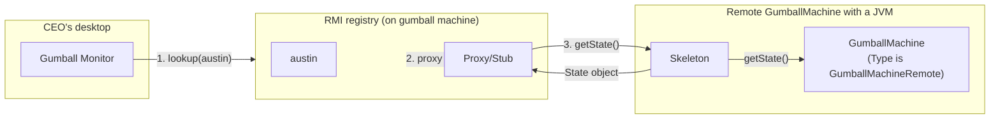

1. **El CEO ejecuta el monitor**, que primero obtiene los proxies de las máquinas de gumballs remotas y después llama a `getState()` en cada una de ellas (junto con `getCount()` y `getLocation()`).

    !!! note "Nota marginal"
        Máquina de gumballs remota con una JVM.

        El tipo es `GumballMachineRemote`.

2. **`getState()` se invoca sobre el proxy**, que reenvía la llamada al servicio remoto. El skeleton recibe la petición y después la reenvía a la `GumballMachine`.

    !!! note "Nota marginal"
        El monitor no ha cambiado en absoluto, salvo que ahora sabe que puede encontrarse con excepciones remotas. También usa la interfaz `GumballMachineRemote` en lugar de una implementación concreta.

3. **La `GumballMachine` devuelve el estado al skeleton**, que lo serializa y lo transfiere de vuelta a través de la red hasta el proxy. El proxy lo deserializa y lo devuelve como un objeto al monitor.

    !!! note "Nota marginal"
        La `GumballMachine` implementa otra interfaz y puede lanzar una excepción remota en su constructor, pero por lo demás el código no ha cambiado.

!!! note "Nota marginal"
    También tenemos una pequeña porción de código para registrar y localizar stubs usando el registro RMI. Pero diga lo que diga, si estuviéramos escribiendo algo para funcionar por internet, necesitaríamos algún tipo de servicio localizador.

## El patrón Proxy definido

Ya hemos dejado muchas páginas atrás en este capítulo; como puedes ver, explicar el Remote Proxy es algo enrevesado. Pese a eso, ya verás que la definición y el diagrama de clases del patrón Proxy son en realidad bastante sencillos. Fíjate en que el Remote Proxy es una implementación del patrón Proxy general; en realidad hay bastantes variaciones del patrón, y hablaremos de ellas más adelante. De momento, vamos con los detalles del patrón general.

Aquí tienes la definición del patrón Proxy:

!!! abstract "Definición del patrón Proxy"
    Usa el patrón Proxy para crear un objeto representativo que controla el acceso a otro objeto, que puede ser remoto, caro de crear, o que necesite protección.

El patrón Proxy proporciona un sustituto o marcador de posición para otro objeto, con el fin de controlar el acceso a él. Como ya hemos visto, el patrón Proxy proporciona un sustituto o marcador de posición para otro objeto. También hemos descrito el proxy como un «representante» de otro objeto.

Pero, ¿qué pasa con un proxy que controla el acceso? Eso suena un poco extraño. No te preocupes. En el caso de la máquina de gumballs, piensa simplemente en el proxy controlando el acceso al objeto remoto. El proxy necesitaba controlar el acceso porque nuestro cliente, el monitor, no sabía cómo hablar con un objeto remoto. Así que, en cierto sentido, el proxy remoto controlaba el acceso para poder encargarse de los detalles de red por nosotros.

Como acabamos de comentar, hay muchas variaciones del patrón Proxy, y las variaciones suelen girar en torno a la manera en que el proxy «controla el acceso». Volveremos sobre esto más adelante, pero de momento aquí tienes algunas formas en las que los proxies controlan el acceso:

- Como ya sabemos, un proxy remoto controla el acceso a un objeto remoto.
- Un proxy virtual controla el acceso a un recurso que es caro de crear.
- Un proxy de protección controla el acceso a un recurso en función de los derechos de acceso.

Ahora que ya tienes la idea general del patrón, echa un vistazo al diagrama de clases...

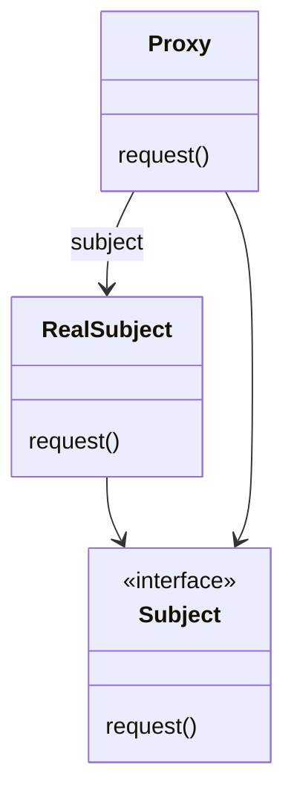

!!! note "Notas marginales"
    Tanto el `Proxy` como el `RealSubject` implementan la interfaz `Subject`. Esto permite que cualquier cliente trate al proxy igual que al `RealSubject`.

    El `RealSubject` suele ser el objeto que hace la mayor parte del trabajo real; el `Proxy` controla el acceso a él.

    El `Proxy` mantiene una referencia al `Subject`, de modo que puede reenviar las peticiones al `RealSubject`.

    El `Proxy` a menudo instancia el `RealSubject`, o se encarga de su creación cuando es necesario.

Recorramos el diagrama...

Primero tenemos un `Subject`, que proporciona una interfaz para el `RealSubject` y el `Proxy`. Como implementa la misma interfaz que el `RealSubject`, el `Proxy` puede sustituir al `RealSubject` en cualquier lugar en que aparezca.

El `RealSubject` es el objeto que hace el trabajo real. Es el objeto al que el `Proxy` representa y al que controla el acceso.

El `Proxy` mantiene una referencia al `RealSubject`. En algunos casos, el `Proxy` puede ser responsable de crear y destruir el `RealSubject`. Los clientes interactúan con el `RealSubject` a través del `Proxy`. Como el `Proxy` y el `RealSubject` implementan la misma interfaz (`Subject`), el `Proxy` puede sustituirse en cualquier lugar donde se pueda usar el `Subject`. El `Proxy` también controla el acceso al `RealSubject`; puede que este control sea necesario si el `Subject` se está ejecutando en una máquina remota, si el `Subject` es caro de crear de alguna manera, o si el acceso al subject necesita protegerse de alguna forma.

Ahora que entiendes el patrón general, veamos otras formas de usar el proxy más allá del Remote Proxy...

## Prepárate para el Virtual Proxy

Hasta ahora has visto la definición del patrón Proxy y has echado un vistazo a un ejemplo concreto: el Remote Proxy. Ahora vamos a ver un tipo de proxy distinto, el Virtual Proxy. Como descubrirás, el patrón Proxy puede manifestarse de muchas formas, y sin embargo todas las formas siguen, aproximadamente, el diseño general del proxy. ¿Por qué tantas formas? Porque el patrón Proxy se puede aplicar a muchos casos de uso distintos. Veamos el Virtual Proxy y compáralo con el Remote Proxy:

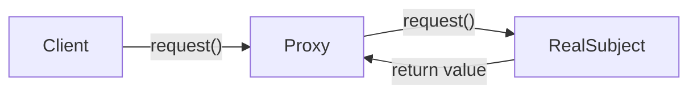

!!! note "Nota marginal"
    Ya conocemos este diagrama bastante bien a estas alturas...

### Remote Proxy

Con el Remote Proxy, el proxy actúa como representante local de un objeto que vive en una JVM distinta. Una llamada a un método sobre el proxy hace que la llamada sea transferida a través de la red e invocada de forma remota, y que el resultado se devuelva al proxy y luego al Client.

### Virtual Proxy

El Virtual Proxy actúa como representante de un objeto que puede ser caro de crear. El Virtual Proxy a menudo aplaza la creación del objeto hasta que este es necesario; además, el Virtual Proxy actúa como sustituto del objeto antes y mientras se está creando. Después de eso, el proxy delega directamente las peticiones en el `RealSubject`.

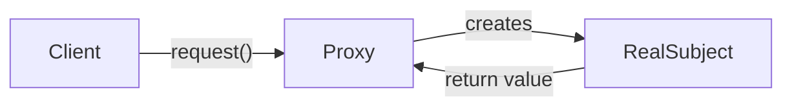

!!! note "Notas marginales"
    Objeto «caro de crear» de verdad.

    El proxy crea el `RealSubject` cuando hace falta.

    El proxy puede atender la petición, o, si el `RealSubject` ya se ha creado, delegar las llamadas en el `RealSubject`.

## Mostrando portadas de álbumes

Digamos que quieres escribir una aplicación que muestre tus portadas de álbumes favoritas. Podrías crear un menú con los títulos de los álbumes y después recuperar las imágenes de un servicio en línea como Amazon.com. Si estás usando Swing, podrías crear un `Icon` y pedirle que cargue la imagen desde la red. El único problema es que, dependiendo de la carga de la red y del ancho de banda de tu conexión, recuperar una portada puede tardar un poco, así que tu aplicación debería mostrar algo mientras esperas a que la imagen se cargue. Tampoco queremos bloquear toda la aplicación mientras espera a la imagen. Una vez cargada la imagen, el mensaje debería desaparecer y deberías ver la imagen.

Una forma fácil de conseguir esto es mediante un proxy virtual. El proxy virtual puede ocupar el lugar del icono, gestionar la carga en segundo plano y, antes de que la imagen se haya recuperado por completo de la red, mostrar «Loading album cover, please wait...». Una vez cargada la imagen, el proxy delega la visualización en el `Icon`.


!!! note "Notas marginales"
    Elige aquí la portada del álbum que más te guste.

    Mientras la portada se está cargando, el proxy muestra un mensaje.

    Cuando la portada está completamente cargada, el proxy muestra la imagen.

## Diseñando el Virtual Proxy de portadas de álbumes

Antes de escribir el código del visor de portadas, veamos el diagrama de clases. Verás que esto se parece mucho a nuestro diagrama de clases del Remote Proxy, pero aquí el proxy se usa para esconder un objeto que es caro de crear (porque necesitamos recuperar los datos del `Icon` a través de la red) en lugar de un objeto que vive en otro punto de la red.

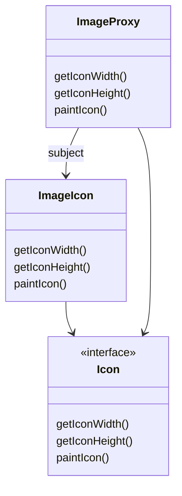

!!! note "Notas marginales"
    Esta es la interfaz `Icon` de Swing que se usa para mostrar imágenes en una interfaz de usuario.

    Este es `javax.swing.ImageIcon`, una clase que muestra una `Image`.

    Este es nuestro proxy, que primero muestra un mensaje y después, cuando la imagen está cargada, delega en `ImageIcon` para que muestre la imagen.

### Cómo va a funcionar `ImageProxy`:

1. `ImageProxy` primero crea un `ImageIcon` y empieza a cargarlo desde una URL de red.
2. Mientras se recuperan los bytes de la imagen, `ImageProxy` muestra «Loading album cover, please wait...».
3. Cuando la imagen está completamente cargada, `ImageProxy` delega todas las llamadas a métodos en el image icon, incluidos `paintIcon()`, `getIconWidth()` y `getIconHeight()`.
4. Si el usuario pide una imagen nueva, crearemos un proxy nuevo y volveremos a empezar el proceso.

## Escribiendo el Image Proxy

!!! note "Nota marginal"
    El `ImageProxy` implementa la interfaz `Icon`.

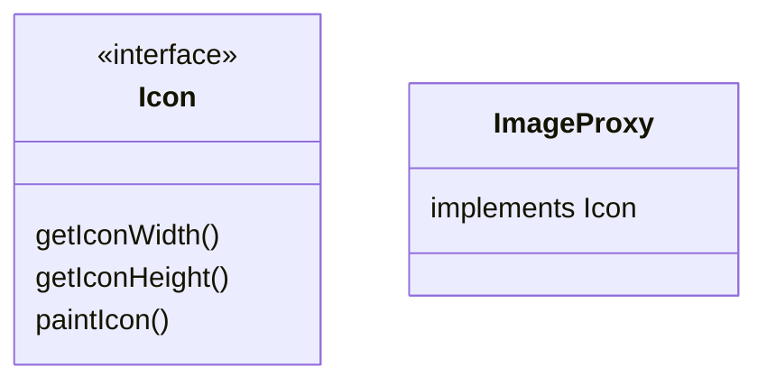

```java
class ImageProxy implements Icon {
    volatile ImageIcon imageIcon;
    final URL imageURL;
    Thread retrievalThread;
    boolean retrieving = false;
    public ImageProxy(URL url) { imageURL = url; }
    public int getIconWidth() {
        if (imageIcon != null) {
            return imageIcon.getIconWidth();
        } else {
            return 800;
        }
    }
    public int getIconHeight() {
        if (imageIcon != null) {
            return imageIcon.getIconHeight();
        } else {
            return 600;
        }
    }
    synchronized void setImageIcon(ImageIcon imageIcon) {
        this.imageIcon = imageIcon;
    }
    public void paintIcon(final Component c, Graphics  g, int x,  int y) {
        if (imageIcon != null) {
            imageIcon.paintIcon(c, g, x, y);
        } else {
            g.drawString("Loading album cover, please wait...", x+300, y+190);
            if (!retrieving) {
                retrieving = true;
                retrievalThread = new Thread(new Runnable() {
                    public void run() {
                        try {
                            setImageIcon(new ImageIcon(imageURL, "Album Cover"));
                            c.repaint();
                        } catch (Exception e) {
                            e.printStackTrace();
                        }
                    }
                });
                retrievalThread.start();
            }
        }
    }
}
```

!!! note "Notas marginales"
    El `imageIcon` es el icono REAL que en última instancia queremos mostrar cuando esté cargado.

    Pasamos la URL de la imagen al constructor. ¡Esta es la imagen que necesitamos mostrar una vez cargada!

    Devolvemos un ancho y una altura por defecto hasta que el `imageIcon` esté cargado; entonces le pasamos el problema al `imageIcon`.

    `imageIcon` lo usan dos hilos distintos, así que, además de declarar la variable como `volatile` (para proteger las lecturas), usamos un *setter* `synchronized` (para proteger las escrituras).

    Aquí es donde la cosa se pone interesante. Este código pinta el icono en la pantalla (delegando en `imageIcon`). Sin embargo, si no tenemos un `imageIcon` completamente creado, entonces creamos uno. Veamos esto más de cerca en la página siguiente...

!!! example "Código de cerca"
    Este método se llama cuando toca pintar el icono en la pantalla.

    ```java
    public void paintIcon(final Component c, Graphics  g, int x,  int y) {
        if (imageIcon != null) {
            imageIcon.paintIcon(c, g, x, y);
        } else {
            g.drawString("Loading album cover, please wait...", x+300, y+190);
            if (!retrieving) {
                retrieving = true;
                retrievalThread = new Thread(new Runnable() {
                    public void run() {
                        try {
                            setImageIcon(new ImageIcon(imageURL, "Album Cover"));
                            c.repaint();
                        } catch (Exception e) {
                            e.printStackTrace();
                        }
                    }
                });
                retrievalThread.start();
            }
        }
    }
    ```

    Si ya tenemos un icono, le decimos que se pinte a sí mismo.

    En caso contrario mostramos el mensaje de «cargando».

    !!! note "Nota marginal"
        Aquí es donde cargamos la imagen REAL del icono. Fíjate en que la carga de la imagen con `IconImage` es sincrónica: el constructor de `ImageIcon` no devuelve el control hasta que la imagen está cargada. Eso no nos da ningún margen para hacer actualizaciones de pantalla y que se muestre nuestro mensaje, así que lo vamos a hacer de forma asíncrona. Consulta el «Código bien de cerca» de la página siguiente para saber más...

!!! example "El código bien de cerca"
    Si no estamos ya intentando recuperar la imagen...

    ```java
            if (!retrieving) {
                retrieving = true;
                retrievalThread = new Thread(new Runnable() {
                    public void run() {
                        try {
                            setImageIcon(new ImageIcon(imageURL, "Album Cover"));
                            c.repaint();
                        } catch (Exception e) {
                            e.printStackTrace();
                        }
                    }
                });
                retrievalThread.start();
            }
    ```

    ...entonces ha llegado el momento de empezar a recuperarla (por si te preguntabas: solo un hilo llama a `paint`, así que aquí deberíamos estar bien en cuanto a seguridad de hilos).

    No queremos bloquear toda la interfaz de usuario, así que vamos a usar otro hilo para recuperar la imagen.

    En nuestro hilo instanciamos el objeto `Icon`. Su constructor no devolverá el control hasta que la imagen esté cargada.

    Cuando tenemos la imagen, le decimos a Swing que necesita repintarse.

    Así que, la próxima vez que se pinte la visualización después de que se haya instanciado el `ImageIcon`, el método `paintIcon()` pintará la imagen, no el mensaje de carga.

!!! exercise "Puzle de diseño"
    La clase `ImageProxy` parece tener dos estados que están controlados por sentencias condicionales. ¿Se te ocurre algún otro patrón que pudiera limpiar este código? ¿Cómo rediseñarías `ImageProxy`?

    ```java
    class ImageProxy implements Icon {
        // instance variables & constructor here
        public int getIconWidth() {
            if (imageIcon != null) {
                return imageIcon.getIconWidth();
            } else {
                return 800;
            }
        }
        public int getIconHeight() {
            if (imageIcon != null) {
                return imageIcon.getIconHeight();
            } else {
                return 600;
            }
        }
        public void paintIcon(final Component c, Graphics  g, int x,  int y) {
            if (imageIcon != null) {
                imageIcon.paintIcon(c, g, x, y);
            } else {
                g.drawString("Loading album cover, please wait...", x+300, y+190);
     // more code here
            }             
        }
    }
    ```

    !!! note "Notas marginales"
        Dos estados.

        Dos estados.

        Dos estados.

## Probando el visor de portadas de álbumes

Vale, es hora de probar este nuevo proxy virtual tan elegante. Entre bastidores hemos estado horneando un nuevo `ImageProxyTestDrive` que monta la ventana, crea un frame, instala los menús y crea nuestro proxy. No vamos a repasar todo ese código con todo detalle aquí, pero siempre puedes coger el código fuente y echarle un ojo, o consultarlo al final del capítulo, donde listamos todo el código fuente del Virtual Proxy. Aquí tienes una vista parcial del código del test drive:

!!! info "Código listo para hornear"
    Aquí creamos un proxy de imagen y le asignamos una URL inicial. Cada vez que elijas una opción del menú de álbumes, obtendrás un nuevo proxy de imagen.

    A continuación envolvemos nuestro proxy en un componente para poder añadirlo al frame. El componente se encarga del ancho del proxy, de la altura y de detalles similares.

    Por último añadimos el proxy al frame para que pueda mostrarse.

```java
public class ImageProxyTestDrive {
    ImageComponent imageComponent;

    public static void main (String[] args) throws Exception {
        ImageProxyTestDrive testDrive = new ImageProxyTestDrive();
    }
    public ImageProxyTestDrive() throws Exception {
        // set up frame and menus
        Icon icon = new ImageProxy(initialURL);
        imageComponent = new ImageComponent(icon);
        frame.getContentPane().add(imageComponent);
    }
}
```

Ahora vamos a ejecutar el test drive:

```text
File  Edit   Window  Help  JustSomeOfTheAlbumsThatGotUsThroughThisBook
% java ImageProxyTestDrive
aphex twin
```

!!! note "Nota marginal"
    Ejecutar `ImageProxyTestDrive` debería darte una ventana como esta.

### Cosas que puedes probar...

1. Usa el menú para cargar portadas de álbumes distintas; observa cómo el proxy muestra «cargando» hasta que la imagen ha llegado.
2. Redimensiona la ventana mientras se muestra el mensaje de «cargando». Fíjate en que el proxy está gestionando la carga sin bloquear la ventana de Swing.
3. Añade tus propios álbumes favoritos al `ImageProxyTestDrive`.

## ¿Qué hicimos?

### Entre bastidores

1. Creamos una clase `ImageProxy` para la visualización. Se llama al método `paintIcon()` y `ImageProxy` lanza un hilo para recuperar la imagen y crear el `ImageIcon`.

    !!! note "Nota marginal"
        `ImageProxy` crea un hilo para instanciar el `ImageIcon`, que empieza a recuperar la imagen.

2. En algún momento la imagen se devuelve y el `ImageIcon` queda completamente instanciado.

3. Después de que se cree el `ImageIcon`, la próxima vez que se llame a `paintIcon()`, el proxy delegará en el `ImageIcon`.

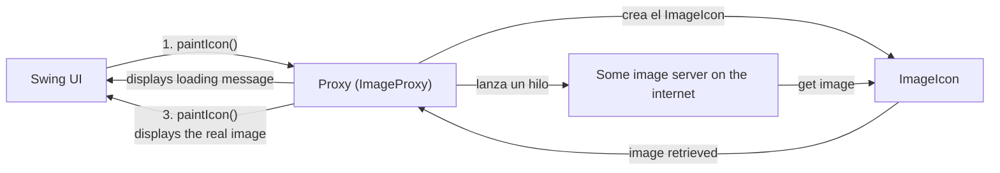

!!! question "¿El Remote Proxy y el Virtual Proxy me parecen muy distintos; son realmente UN MISMO patrón?"
    Me cuesta verlos como un mismo patrón.

!!! success "Respuesta"
    Te vas a encontrar con muchas variantes del patrón Proxy en el mundo real; lo que todas tienen en común es que interceptan una invocación a un método que el cliente está haciendo sobre el subject. Este nivel de indirección nos permite hacer muchas cosas, entre ellas despachar peticiones a un subject remoto, proporcionar un representante para un objeto caro mientras se está creando o, como verás, proporcionar cierto nivel de protección que permita determinar qué clientes deberían llamar a qué métodos. Eso es solo el principio; el patrón Proxy general se puede aplicar de muchas maneras distintas, y cubriremos algunas de las demás formas al final del capítulo.

!!! question "¿Cómo hago que los clientes usen el Proxy en lugar del Real Subject?"
    Buenas preguntas.

!!! success "Respuesta"
    Una técnica habitual es proporcionar una factoría que instancie y devuelva el subject. Como esto ocurre en un método de factoría, podemos envolver el subject con un proxy antes de devolverlo. El cliente nunca sabe ni le importa que esté usando un proxy en lugar de la cosa real.

!!! question "En el ejemplo del `ImageProxy` siempre creas un `ImageIcon` nuevo para obtener la imagen, incluso si la imagen ya se ha recuperado. ¿Podrías implementar algo similar que guarde en caché las recuperaciones anteriores?"
    Estás hablando de una forma especializada del Virtual Proxy llamada Caching Proxy. Un proxy de caché mantiene una caché de objetos creados anteriormente y, cuando se hace una petición, devuelve un objeto de la caché, si es posible.

!!! success "Respuesta"
    Vamos a echarle un vistazo a esto y a varias variantes más del patrón Proxy al final del capítulo.

!!! question "Veo cómo se relacionan Decorator y Proxy, pero ¿qué pasa con Adapter? Un adapter también me parece muy similar."
    Los dos se colocan delante de otros objetos y les reenvían las peticiones.

!!! success "Respuesta"
    Recuerda que Adapter cambia la interfaz de los objetos que adapta, mientras que Proxy implementa la misma interfaz. Hay una semejanza adicional relacionada con el Protection Proxy: un Protection Proxy puede permitir o denegar a un cliente el acceso a métodos concretos en función del papel del cliente. De este modo, un Protection Proxy solo puede ofrecer una interfaz parcial a un cliente, lo cual es bastante parecido a algunos Adapters. Vamos a echarle un vistazo al Protection Proxy dentro de unas cuantas páginas.

### La charla de esta noche: Proxy y Decorator se (intentan)

**Proxy:**

**Decorator:**

**Proxy:** Hola, Decorator. Supongo que estás aquí porque a veces la gente nos confunde, ¿no?

**Decorator:** Bueno, creo que la razón por la que la gente nos confunde es que tú vas por ahí fingiendo ser un patrón completamente distinto, cuando en realidad eres solo Decorator con disfraz. De verdad que no creo que deberías copiar todas mis ideas.

**Proxy:** ¿Yo copiando tus ideas? Por favor. Yo controlo el acceso a los objetos. Tú solo los decoras. Mi trabajo es muchísimo más importante que el tuyo; no tiene ni gracia.

**Decorator:** ¿«Solo» decorar? ¿Crees que decorar es algún patrón frívolo, sin importancia? Déjame decirte, amigo, yo añado comportamiento. Eso es lo más importante de los objetos: ¡lo que hacen!

**Proxy:** Vale, puede que no seas del todo frívolo... pero sigo sin entender por qué crees que estoy copiándote todas tus ideas. Yo estoy en el negocio de representar a mis subjects, no de decorarlos.

**Decorator:** Puedes llamarlo «representación», pero si tiene pinta de pato y anda como pato... Vamos, mira tu Virtual Proxy: es simplemente otra forma de añadir comportamiento a algo mientras un objeto grande y caro se está cargando; y tu Remote Proxy es una forma de hablar con objetos remotos para que tus clientes no tengan que molestarse ellos mismos. Todo se trata de comportamiento, exactamente como te he dicho.

**Proxy:** No creo que lo entiendas, Decorator. Yo estoy en lugar de mis Subjects; no me limito a añadir comportamiento. Los clientes me usan a mí como sustituto de un Real Subject, porque puedo protegerlos de accesos no deseados, o evitar que sus GUIs se bloqueen mientras esperan a que se carguen objetos grandes, o esconder el hecho de que sus Subjects se están ejecutando en máquinas remotas. Yo diría que esa es una intención muy distinta de la tuya.

**Decorator:** Llámalo como quieras. Yo implemento la misma interfaz que los objetos que envuelvo; tú también.

**Proxy:** Vale, repasemos esa afirmación. Tú envuelves un objeto. Aunque a veces decimos informalmente que un proxy envuelve a su Subject, ese no es un término realmente preciso.

**Decorator:** ¿Ah, sí? ¿Y por qué no?

**Proxy:** Piensa en un proxy remoto... ¿qué objeto estoy envolviendo? ¡El objeto al que represento y controlo el acceso vive en otra máquina!

**Decorator:** A ver cómo haces eso.

**Proxy:** Vale, toma un proxy virtual... piensa en el ejemplo del visor de álbumes. ¡Cuando el cliente me usa por primera vez como proxy, el subject ni siquiera existe! Así que, ¿qué estoy envolviendo ahí?

**Decorator:** Bueno, pero todos sabemos que los proxies remotos son un poco raros. ¿Tienes un segundo ejemplo? Lo dudo.

**Proxy:** Ah, sí, y lo siguiente que vas a decir es que además creas objetos.

**Decorator:** ¡No tenía ni idea de que los decorators fueran tan tontos! Bueno, a veces sí creo objetos. ¿Y cómo crees que un proxy virtual consigue su subject?!

**Proxy:** Vale, acabas de señalar una diferencia enorme entre nosotros: los dos sabemos que los decorators solo ponen adornos; nunca llegan a instanciar nada.

**Decorator:** ¿Ah, sí? ¡Pues instancia esto!

**Proxy:** Oye, después de esta conversación estoy convencido de que no eres más que un proxy tonto.

**Decorator:** ¿Un proxy tonto? Me gustaría verte envolver recursivamente un objeto con 10 decorators y mantener la cabeza recta al mismo tiempo.

**Proxy:** Muy rara vez verás que un proxy se meta a envolver un subject varias veces; de hecho, si estás envolviendo algo 10 veces, más te vale que vuelvas atrás y reexamines tu diseño.

**Decorator:** Igual que un proxy, haciéndote el real cuando en realidad solo estás en lugar de los objetos que hacen el trabajo de verdad. Sabes, de verdad que te tengo lástima.

## Usando el Proxy de la API de Java para crear un proxy de protección

Java tiene su propio soporte de proxies justo en el paquete `java.lang.reflect`. Con este paquete, Java te deja crear una clase proxy al vuelo que implementa una o más interfaces y reenvía las invocaciones a métodos a una clase que tú specifies. Como la clase proxy real se crea en tiempo de ejecución, nos referimos a esta tecnología de Java como un proxy dinámico.

Vamos a usar el proxy dinámico de Java para crear nuestra siguiente implementación de proxy (un proxy de protección), pero antes de hacerlo, veamos rápidamente un diagrama de clases que muestra cómo se montan los proxies dinámicos. Como casi todo en el mundo real, difiere ligeramente de la definición clásica del patrón:

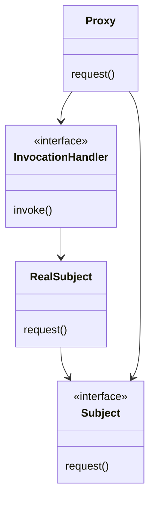

!!! note "Notas marginales"
    El `Proxy` lo genera Java e implementa toda la interfaz `Subject`.

    Tú proporcionas el `InvocationHandler`, al que se le pasan todas las llamadas a métodos que se invocan sobre el `Proxy`. El `InvocationHandler` controla el acceso a los métodos del `RealSubject`.

    El `Proxy` consta ahora de dos clases.

Como Java crea la clase `Proxy` por ti, necesitas alguna forma de decirle a la clase `Proxy` qué tiene que hacer. No puedes meter ese código en la clase `Proxy` como hicimos antes, porque no la estás implementando directamente. Así que, si no puedes meter este código en la clase `Proxy`, ¿dónde lo metes? En un `InvocationHandler`. El trabajo del `InvocationHandler` es responder a cualquier llamada a método sobre el proxy. Piensa en el `InvocationHandler` como el objeto al que el `Proxy` le pide que haga todo el trabajo de verdad después de haber recibido las llamadas a los métodos.

Vale, recorremos cómo usar el proxy dinámico...

## Citas para frikis en Objectville

Toda ciudad necesita un servicio de emparejamiento, ¿no? Tú has afrontado la tarea y has implementado un servicio de citas para Objectville. También has intentado ser innovador incluyendo una función de «índice de frikismo» (una buena cosa) donde los participantes pueden valorarse mutuamente el grado de frikismo: piensas que esto mantiene a tus clientesé y mirando posibles candidatos; además, hace las cosas mucho más divertidas.

Tu servicio gira en torno a una interfaz `Person` que te permite establecer y obtener información sobre una persona:

!!! note "Notas marginales"
    Esta es la interfaz; llegaremos a la implementación en un segundo...

    Aquí podemos obtener información sobre el nombre, el género, los intereses y el índice de frikismo (1-10) de la persona.

    También podemos establecer esa misma información mediante las llamadas a los métodos correspondientes.

```java
public interface Person {
    String getName();
    String getGender();
    String getInterests();
    int getGeekRating();
    void setName(String name);
    void setGender(String gender);
    void setInterests(String interests);
    void setGeekRating(int rating); 
}
```

!!! note "Nota marginal"
    `setGeekRating()` toma un entero y lo suma a la media acumulada de esta persona.

Ahora veamos la implementación...

## La implementación de Person

La `PersonImpl` implementa la interfaz `Person`.

!!! note "Notas marginales"
    Las variables de instancia.

    Todos los métodos getter; cada uno de ellos devuelve la variable de instancia apropiada...

    ...excepto `getGeekRating()`, que calcula el promedio de las puntuaciones dividiendo el total de las puntuaciones entre el `ratingCount`.

    Y aquí están todos los métodos setter, que asignan la variable de instancia correspondiente.

    Por último, el método `setGeekRating()` incrementa el `ratingCount` total y añade la puntuación al total acumulado.

```java
public class PersonImpl implements Person {
    String name;
    String gender;
    String interests;
    int rating;
    int ratingCount = 0;
    public String getName() {
        return name;    
    } 
    public String getGender() {
        return gender;
    }
    public String getInterests() {
        return interests;
    }
    public int getGeekRating() {
        if (ratingCount == 0) return 0;
        return (rating/ratingCount);
    }
    public void setName(String name) {
        this.name = name;
    }
    public void setGender(String gender) {
        this.gender = gender;
    } 
    public void setInterests(String interests) {
        this.interests = interests;
    } 
    public void setGeekRating(int rating) {
        this.rating += rating;  
        ratingCount++;
    }
}
```

**Elroy:** No tuve mucho éxito encontrando citas. Entonces me di cuenta de que alguien había cambiado mis intereses. También me di cuenta de que mucha gente está subiendo sus índices de frikismo dándose a sí mismos puntuaciones altas. ¡No deberías poder cambiar los intereses de otra persona ni darte una puntuación a ti mismo!

Aunque sospechamos que otros factores pueden estar impidiendo que Elroy consiga citas, tiene razón: no deberías poder votar por ti mismo ni cambiar los datos de otro cliente. Tal y como está definida `Person`, cualquier cliente puede llamar a cualquiera de los métodos.

Este es un ejemplo perfecto de dónde podría resultar útil un Protection Proxy. ¿Qué es un Protection Proxy? Es un proxy que controla el acceso a un objeto basándose en los derechos de acceso. Por ejemplo, si tuviéramos un objeto de empleado, un Protection Proxy podría permitir al empleado llamar a ciertos métodos sobre el objeto, a un gerente llamar a métodos adicionales (como `setSalary()`), y a un empleado de recursos humanos llamar a cualquier método sobre el objeto.

En nuestro servicio de citas queremos asegurarnos de que un cliente pueda establecer su propia información mientras evitamos que otros la alteren. Con los índices de frikismo queremos permitir justo lo contrario: queremos que los otros clientes puedan establecer la puntuación, pero no ese cliente en particular. También tenemos un buen número de métodos getter en `Person` y, como ninguno de ellos devuelve información privada, cualquier cliente debería poder llamarlos.

## Drama de cinco minutos: protegiendo a los subjects

La burbuja de internet parece un recuerdo lejano; aquellos eran los días en los que todo lo que necesitabas para encontrar un trabajo mejor y mejor pagado era cruzar la calle. Hasta los agentes de desarrolladores de software estaban de moda...

**Sujeto:** Me gustaría hacer una oferta; ¿podemos contactar con ella por teléfono?

**Agente:** Ahora mismo está ocupada... eh... en una reunión; ¿qué tenía en mente?

**Sujeto:** Vamos. Creemos que podemos igualar su salario actual más un 15%.

**Agente:** ¡Estás haciendo perder nuestro tiempo aquí! ¡Ni hablar! Vuelve más tarde con una oferta mejor.

!!! note "Nota marginal"
    Como un proxy de protección, el agente protege el acceso a su subject, dejando pasar solo ciertas llamadas...

**Jane DotCom**

## Visión general: crear un Dynamic Proxy para el Person

Tenemos un par de problemas que arreglar: los clientes no deberían estar cambiando su propio índice de frikismo y los clientes no deberían poder cambiar la información personal de otros clientes. Para arreglar estos problemas vamos a crear dos proxies: uno para acceder a tu propio objeto `Person` y otro para acceder al objeto `Person` de otro cliente. De esa manera, los proxies pueden controlar qué peticiones pueden hacerse en cada circunstancia.

Para crear estos proxies vamos a usar el proxy dinámico de la API de Java que viste hace unas páginas. Java creará dos proxies por nosotros; todo lo que necesitamos hacer es proporcionar los handlers que sepan qué hacer cuando se invoca un método sobre el proxy.

!!! note "Notas marginales"
    Recuerda este diagrama de hace unas páginas...

    Necesitamos dos de estos.

    Creamos el proxy en sí en tiempo de ejecución.

**Paso uno:** crear dos InvocationHandlers.

Los InvocationHandlers implementan el comportamiento del proxy. Como verás, Java se encargará de crear la clase proxy y el objeto proxy reales; solo necesitamos proporcionar un handler que sepa qué hacer cuando se llama a un método sobre él.

**Paso dos:** escribir el código que crea los proxies dinámicos.

Necesitamos escribir un poco de código para generar la clase proxy e instanciarla. Recorreremos este código dentro de un momento.

**Paso tres:** envolver cualquier objeto `Person` con el proxy apropiado.

Cuando necesitamos usar un objeto `Person`, o bien es el objeto del propio cliente (en ese caso lo llamaremos «owner»), o bien es otro usuario del servicio al que el cliente está echando un vistazo (en ese caso lo llamaremos «non-owner»). En cualquier caso, creamos el proxy apropiado para el `Person`.

!!! note "Notas marginales"
    Cuando un cliente está viendo su propio bean.

    Cuando un cliente está viendo el bean de otra persona.

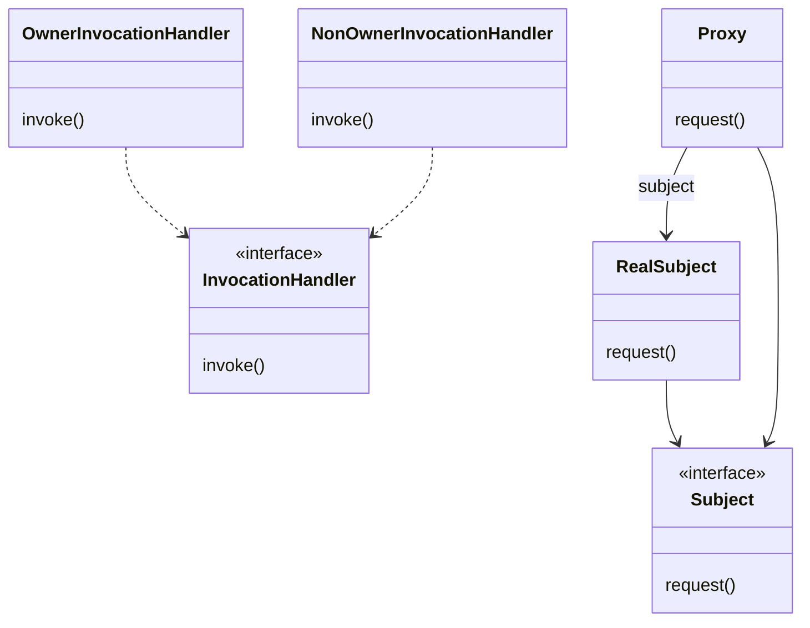

## Paso uno: crear los Invocation Handlers

Sabemos que necesitamos escribir dos invocation handlers, uno para el owner y otro para el non-owner. Pero, ¿qué son los invocation handlers? Esta es la forma de pensar en ellos: cuando se hace una llamada a un método sobre el proxy, el proxy reenvía esa llamada a tu invocation handler, pero no llamando al método correspondiente del invocation handler. Entonces, ¿qué es lo que llama? Echa un vistazo a la interfaz `InvocationHandler`:

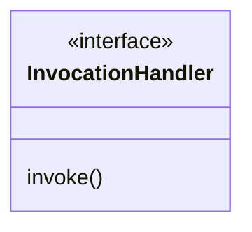

Solo hay un método, `invoke()`, y no importa qué métodos se llamen sobre el proxy: el método `invoke()` es el que se llama sobre el handler. Veamos cómo funciona esto:

1. **Digamos que se llama al método `setGeekRating()` sobre el proxy.**

    ```java
    proxy.setGeekRating(9);
    ```

2. **El proxy se da la vuelta y llama a `invoke()` sobre el InvocationHandler.**

    ```java
    invoke(Object proxy, Method method, Object[] args)
    ```

3. **El handler decide qué debería hacer con la petición y posiblemente la reenvía al RealSubject.**

    ```java
    return method.invoke(person, args);
    ```

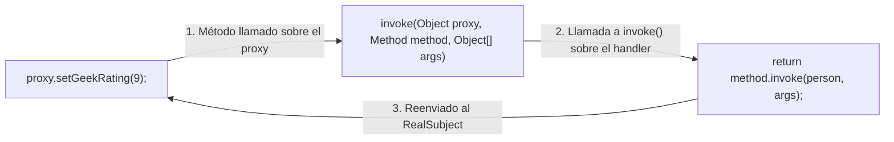

!!! note "Notas marginales"
    La clase `Method`, parte de la API de reflexión, nos dice qué método fue llamado sobre el proxy a través de su método `getName()`.

    Así es como invocamos el método sobre el RealSubject.

    Aquí invocamos el método original que fue llamado sobre el proxy. Este objeto se nos pasó en la llamada a `invoke`.

    Solo que ahora lo invocamos sobre el RealSubject...

    ...con los argumentos originales.

¿Cómo decide el handler? Lo descubriremos a continuación.

## Creando los Invocation Handlers, continuación...

Cuando el proxy llama a `invoke()`, ¿cómo sabes qué hacer con la llamada? Normalmente, examinarás el método que fue llamado sobre el proxy y tomarás decisiones basándote en el nombre del método y posiblemente en sus argumentos. Implementemos `OwnerInvocationHandler` para ver cómo funciona esto:

!!! note "Notas marginales"
    `InvocationHandler` es parte del paquete `java.lang.reflect`, así que necesitamos importarlo.

    Todos los invocation handlers implementan la interfaz `InvocationHandler`.

    El RealSubject se nos pasa en el constructor y guardamos una referencia a él.

    Aquí está el método `invoke()`, que es llamado cada vez que se invoca un método sobre el proxy.

    Si el método es un getter, procedemos a invocarlo sobre el subject real.

    De lo contrario, si es el método `setGeekRating()`, lo rechazamos lanzando `IllegalAccessException`.

    Debido a que somos el owner, cualquier otro método `set` está bien y procedemos a invocarlo sobre el subject real.

    Esto ocurrirá si el subject real lanza una excepción.

    Si se llama a cualquier otro método, vamos a devolver `null` en lugar de arriesgarnos.

```java
import java.lang.reflect.*;

public class OwnerInvocationHandler implements InvocationHandler { 
    Person person;
    public OwnerInvocationHandler(Person person) {
        this.person = person;
    }
    public Object invoke(Object proxy, Method method, Object[] args) 
            throws IllegalAccessException {
        try {
            if (method.getName().startsWith("get")) {
                return method.invoke(person, args);
            } else if (method.getName().equals("setGeekRating")) {
                throw new IllegalAccessException();
            } else if (method.getName().startsWith("set")) {
                return method.invoke(person, args);
            } 
        } catch (InvocationTargetException e) {
            e.printStackTrace();
        } 
        return null;
    }
}
```

!!! exercise "Afila el lápiz"
    El `NonOwnerInvocationHandler` funciona igual que el `OwnerInvocationHandler`, excepto que permite las llamadas a `setGeekRating()` y no permite las llamadas a ningún otro método `set`. Adelante, escribe este handler tú mismo:

## Paso dos: crear la clase Proxy e instanciar el objeto Proxy

Ahora, todo lo que nos queda es crear dinámicamente la clase `Proxy` e instanciar el objeto proxy. Empecemos escribiendo un método que tome un objeto `Person` y sepa cómo crear un proxy de owner para él. Es decir, vamos a crear el tipo de proxy que reenvía sus llamadas a métodos al `OwnerInvocationHandler`. Aquí está el código:

!!! note "Notas marginales"
    Este método toma un objeto `Person` (el subject real) y devuelve un proxy para él. Debido a que el proxy tiene la misma interfaz que el subject, devolvemos un `Person`.

    Este código crea el proxy. Ahora bien, este es un código bastante feo, así que vamos a repasarlo con cuidado.

    Para crear un proxy usamos el método estático `newProxyInstance()` de la clase `Proxy`.

    Le pasamos el class loader de nuestro subject...

    ...y el conjunto de interfaces que el proxy necesita implementar...

    Le pasamos el subject real al constructor del invocation handler. Si miras dos páginas atrás, verás que así es como el handler obtiene acceso al subject real.

    ...y un invocation handler, en este caso, nuestro `OwnerInvocationHandler`.

```java
Person getOwnerProxy(Person person) {
    return (Person) Proxy.newProxyInstance( 
            person.getClass().getClassLoader(),
            person.getClass().getInterfaces(),
            new OwnerInvocationHandler(person));
}
```

!!! exercise "Afila el lápiz"
    Aunque es un poco complicado, no hay mucho en la creación de un proxy dinámico. ¿Por qué no escribes `getNonOwnerProxy()`, que devuelve un proxy para el `NonOwnerInvocationHandler`?

!!! exercise "Llévalo más lejos"
    ¿Puedes escribir un método llamado `getProxy()` que tome un handler y un person y devuelva un proxy que use ese handler?

## Probando el servicio de emparejamiento

Vamos a hacer una prueba del servicio de emparejamiento y a ver cómo controla el acceso a los métodos setter según el proxy que se utilice.

!!! note "Notas marginales"
    El método `main()` solo crea el test drive y llama a su método `drive()` para poner las cosas en marcha.

    El constructor inicializa nuestra base de datos de personas en el servicio de emparejamiento.

    Vamos a recuperar una persona de la base de datos...

    ...y crear un proxy de owner.

    Llamar a un getter...

    ...y después a un setter.

    Y luego intentar cambiar la puntuación. ¡Esto no debería funcionar!

    Ahora crear un proxy de non-owner...

    ...y llamar a un getter...

    ...seguido de un setter. ¡Esto no debería funcionar!

    Después intentar establecer la puntuación. ¡Esto debería funcionar!

```java
public class MatchMakingTestDrive {
    // instance variables here
    public static void main(String[] args) {
        MatchMakingTestDrive test = new MatchMakingTestDrive();
        test.drive();
    }
    public MatchMakingTestDrive() {
        initializeDatabase();
    }
    public void drive() {
        Person joe = getPersonFromDatabase("Joe Javabean"); 
        Person ownerProxy = getOwnerProxy(joe);
        System.out.println("Name is " + ownerProxy.getName());
        ownerProxy.setInterests("bowling, Go");
        System.out.println("Interests set from owner proxy");
        try {
            ownerProxy.setGeekRating(10);
        } catch (Exception e) {
            System.out.println("Can't set rating from owner proxy");
        }
        System.out.println("Rating is " + ownerProxy.getGeekRating());
        Person nonOwnerProxy = getNonOwnerProxy(joe);
        System.out.println("Name is " + nonOwnerProxy.getName());
        try {
            nonOwnerProxy.setInterests("bowling, Go");
        } catch (Exception e) {
            System.out.println("Can't set interests from non owner proxy");
        }
        nonOwnerProxy.setGeekRating(3);
        System.out.println("Rating set from non owner proxy");
        System.out.println("Rating is " + nonOwnerProxy.getGeekRating());
    }
    // other methods like getOwnerProxy and getNonOwnerProxy here
}
```

## Ejecutando el código...

Aquí está la salida del test drive:

```text
File  Edit   Window  Help  Born2BDynamic
% java MatchMakingTestDrive 
Name is Joe Javabean
Interests set from owner proxy
Can't set rating from owner proxy
Rating is 7
Name is Joe Javabean
Can't set interests from non owner proxy
Rating set from non owner proxy
Rating is 5
%
```

!!! note "Notas marginales"
    Nuestro Owner proxy permite obtener y establecer, excepto el índice de frikismo.

    Nuestro NonOwner proxy permite solo obtener, pero también permite llamadas para establecer el índice de frikismo.

    La nueva puntuación es el promedio de la puntuación anterior, 7, y del valor establecido por el NonOwner proxy, 3.

!!! question "Entonces, ¿qué es exactamente el aspecto «dinámico» de los proxies dinámicos? ¿Es que estoy instanciando el proxy y asignándoselo a un handler en tiempo de ejecución?"

!!! success "Respuesta"
    No, el proxy es dinámico porque su clase se crea en tiempo de ejecución. Piensa en ello: antes de que tu código se ejecute, no existe ninguna clase proxy; se crea bajo demanda a partir del conjunto de interfaces que le pases.

!!! question "¿Hay alguna restricción sobre los tipos de interfaces que puedo pasar a `newProxyInstance()`?"

!!! success "Respuesta"
    Sí, hay unas pocas. Primero, vale la pena señalar que siempre pasamos a `newProxyInstance()` un array de interfaces: solo se permiten interfaces, ninguna clase. Las principales restricciones son que todas las interfaces no públicas deben ser del mismo paquete. Tampoco puedes tener interfaces con nombres de métodos en conflicto (es decir, dos interfaces con un método con la misma firma). También hay un par de sutilezas menores más, así que en algún momento deberías echarle un vistazo a la letra pequeña sobre los proxies dinámicos en el javadoc.

!!! question "¿Hay alguna manera de saber si una clase es una clase Proxy?"

!!! success "Respuesta"
    Sí. La clase `Proxy` tiene un método estático llamado `isProxyClass()`. Llamar a este método con una clase devolverá `true` si la clase es una clase de proxy dinámico. Aparte de eso, la clase proxy se comportará como cualquier otra clase que implemente un conjunto particular de interfaces.

!!! question "Mi `InvocationHandler` me parece un proxy muy extraño; no implementa ninguno de los métodos de la clase a la que está haciendo de proxy."

!!! success "Respuesta"
    Eso es porque el `InvocationHandler` no es un proxy: es una clase a la que el proxy recurre para manejar las llamadas a métodos. El proxy en sí se crea dinámicamente en tiempo de ejecución mediante el método estático `Proxy.newProxyInstance()`.

!!! exercise "Relaciona cada patrón con su descripción"

    | Patrón | Descripción |
    |---|---|
    | Decorator | Envuelve otro objeto y le proporciona una interfaz diferente. |
    | Facade | Envuelve otro objeto y le proporciona un comportamiento adicional. |
    | Proxy | Envuelve otro objeto para controlar el acceso a él. |
    | Adapter | Envuelve un montón de objetos para simplificar su interfaz. |

## El zoo de los proxies

¡Bienvenido al Zoo de Objectville! Ya conoces los proxies remoto, virtual y de protección, pero en la naturaleza vas a ver muchas mutaciones de este patrón. Aquí, en el rincón de los Proxies del zoo, tenemos una bonita colección de patrones de proxy salvajes que hemos capturado para tu estudio.

Nuestro trabajo no ha terminado; estamos seguros de que vas a ver más variaciones de este patrón en el mundo real, así que échanos una mano catalogando más proxies. Echemos un vistazo a la colección existente:

**Firewall Proxy** controla el acceso a un conjunto de recursos de red, protegiendo al subject de los clientes «malos».

!!! note "Hábitat"
    A menudo se ve en el lugar de los sistemas de firewall corporativos.

**Smart Reference Proxy** proporciona acciones adicionales cada vez que se hace referencia a un subject, como contar el número de referencias a un objeto.

!!! tip "Ayuda a encontrar un hábitat"

**Caching Proxy** proporciona almacenamiento temporal para los resultados de operaciones que son caras. También puede permitir que múltiples clientes compartan los resultados para reducir el cómputo o la latencia de red.

!!! note "Hábitat"
    A menudo se ve en los proxies de servidores web, así como en los sistemas de gestión de contenidos y publicación.

**Synchronization Proxy** proporciona acceso seguro a un subject desde múltiples hilos.

!!! note "Hábitat"
    Se ve merodeando por Collections, donde controla el acceso sincronizado a un conjunto subyacente de objetos en un entorno multihilo.

**Complexity Hiding Proxy** oculta la complejidad de un conjunto complejo de clases y controla el acceso a él. A veces se le llama Facade Proxy por razones obvias. El Complexity Hiding Proxy difiere del patrón Facade en que el proxy controla el acceso, mientras que el patrón Facade solo proporciona una interfaz alternativa.

!!! tip "Ayuda a encontrar un hábitat"

**Copy-On-Write Proxy** controla la copia de un objeto retrasando la copia de un objeto hasta que un cliente la requiere. Es una variante del Virtual Proxy.

!!! note "Hábitat"
    Se ve en las cercanías del `CopyOnWriteArrayList` de Java.

!!! info "Notas de campo"
    Por favor, añade aquí tus observaciones sobre otros proxies vistos en la naturaleza.

## Crucigrama de patrones de diseño

Ha sido un capítulo MUY largo. ¿Por qué no te relajas haciendo un crucigrama antes de que termine?

**HORIZONTALES**

5. Grupo de la primera portada de álbum mostrada (dos palabras).
7. Proxy de uso común para servicios web (dos palabras).
8. En RMI, el objeto que recibe las peticiones de red en el lado del servicio.
11. Proxy que protege las llamadas a métodos de llamadores no autorizados.
13. Grupo que hizo el álbum MCMXC a.D.
14. Una clase de proxy ________ se crea en tiempo de ejecución.
15. Lugar para aprender sobre las muchas variantes de proxy.
16. El visor de álbumes usó este tipo de proxy.
17. En RMI, el proxy se llama así.
18. Hicimos uno de estos para aprender RMI.
19. Por qué Elroy no podía conseguir citas.

**VERTICALES**

1. El emparejamiento de Objectville es para ________.
2. El proxy dinámico de Java reenvía todas las peticiones a este (dos palabras).
3. Esta utilidad actúa como un servicio de búsqueda para RMI.
4. Proxy que suplanta a los objetos caros.
6. El ______ remoto se usó para implementar el monitor de la máquina de gumballs (dos palabras).
9. El agente de desarrolladores de software estaba siendo este tipo de proxy.
10. Nuestro primer error: los informes de la máquina de gumballs no eran _____.
12. Similar al proxy, pero con un propósito diferente.

## Herramientas para tu caja de herramientas de diseño

Tu caja de herramientas de diseño está casi llena; estás preparado para casi cualquier problema de diseño que se te presente.

- El patrón Proxy proporciona un representante para otro objeto con el fin de controlar el acceso del cliente a él. Hay un buen número de formas en las que puede gestionar ese acceso.
- Un Remote Proxy gestiona la interacción entre un cliente y un objeto remoto.
- Un Virtual Proxy controla el acceso a un objeto que es caro de instanciar.
- Un Protection Proxy controla el acceso a los métodos de un objeto en función del llamador.
- Existen muchas otras variantes del patrón Proxy, incluyendo los caching proxies, los synchronization proxies, los firewall proxies, los copy-on-write proxies, etc.
- Proxy es estructuralmente similar a Decorator, pero los dos patrones difieren en su propósito.
- El patrón Decorator añade comportamiento a un objeto, mientras que Proxy controla el acceso.
- El soporte integrado de Java para Proxy puede construir una clase de proxy dinámico bajo demanda y despachar todas las llamadas sobre ella a un handler que tú elijas.
- Como cualquier envoltorio, los proxies aumentarán el número de clases y objetos en tus diseños.

### Fundamentos de la POO

Abstracción, encapsulación, polimorfismo, herencia.

### Principios de la POO

- Encapsula lo que varía.
- Favorece la composición frente a la herencia.
- Programa para interfaces, no para implementaciones.
- Esfuérzate por conseguir diseños débilmente acoplados entre los objetos que interactúan.
- Las clases deberían estar abiertas para la extensión, pero cerradas para la modificación.
- Depende de las abstracciones. No dependas de las clases concretas.
- Habla solo con tus amigos.
- No nos llames, nosotros te llamaremos.
- Una clase debería tener solo una razón para cambiar.

!!! note "Nota marginal"
    Sin nuevos principios este capítulo; ¿puedes cerrar el libro y recordarlos todos?

### Patrones de la POO

- **Strategy**: define una familia de algoritmos, encapsula cada uno de ellos y los hace intercambiables. Strategy permite que el algoritmo varíe independientemente de los clientes que lo usan.
- **Observer**: define una dependencia de uno a muchos entre objetos, de modo que cuando un objeto cambia de estado, todos sus dependientes son notificados y actualizados automáticamente.
- **Decorator**: añade responsabilidades adicionales a un objeto dinámicamente. Los decorators proporcionan una alternativa flexible a la subclasificación para extender la funcionalidad.
- **Abstract Factory**: proporciona una interfaz para crear familias de objetos relacionados o dependientes sin especificar sus clases concretas.
- **Factory Method**: define una interfaz para crear un objeto, pero deja que las subclases decidan qué clase instanciar. Factory Method permite que una clase difiera la instanciación a las subclases.
- **Singleton**: asegura que una clase solo tenga una instancia y proporciona un punto de acceso global a ella.
- **Command**: encapsula una petición como un objeto, lo que te permite parametrizar clientes con diferentes peticiones, poner en cola o registrar peticiones y soportar operaciones deshacer.
- **Adapter**: envuelve otro objeto y le proporciona una interfaz diferente.
- **Facade**: envuelve un montón de objetos para simplificar su interfaz.
- **State**: permite que un objeto altere su comportamiento cuando cambia su estado interno. El objeto parecerá cambiar de clase.
- **Proxy**: proporciona un sustituto o marcador de posición para otro objeto, con el fin de controlar el acceso a él. Nuestro nuevo patrón.

## Soluciones de los ejercicios

El `NonOwnerInvocationHandler` funciona igual que el `OwnerInvocationHandler`, excepto que permite las llamadas a `setGeekRating()` y no permite las llamadas a ningún otro método `set`. Aquí está nuestra solución:

```java
import java.lang.reflect.*;

public class NonOwnerInvocationHandler implements InvocationHandler { 
    Person person;
    public NonOwnerInvocationHandler(Person person) {
        this.person = person;
    }
    public Object invoke(Object proxy, Method method, Object[] args) 
            throws IllegalAccessException {
        try {
            if (method.getName().startsWith("get")) {
                return method.invoke(person, args);
            } else if (method.getName().equals("setGeekRating")) {
                return method.invoke(person, args);
            } else if (method.getName().startsWith("set")) {
                throw new IllegalAccessException();
            } 
        } catch (InvocationTargetException e) {
            e.printStackTrace();
        } 
        return null;
    }
}
```

### Solución del puzle de diseño

La clase `ImageProxy` parece tener dos estados controlados por sentencias condicionales. ¿Puedes pensar en otro patrón que pueda limpiar este código? ¿Cómo rediseñarías `ImageProxy`?

!!! success "Solución"
    Usa el patrón State: implementa dos estados, `ImageLoaded` y `ImageNotLoaded`. Después pon el código de las sentencias `if` en sus respectivos estados. Comienza en el estado `ImageNotLoaded` y luego pasa al estado `ImageLoaded` una vez que se haya recuperado el `ImageIcon`.

Aunque es un poco complicado, no hay mucho en la creación de un proxy dinámico. ¿Por qué no escribes `getNonOwnerProxy()`, que devuelve un proxy para el `NonOwnerInvocationHandler`? Aquí está nuestra solución:

```java
Person getNonOwnerProxy(Person person) {
    return (Person) Proxy.newProxyInstance(
            person.getClass().getClassLoader(),
            person.getClass().getInterfaces(),
            new NonOwnerInvocationHandler(person));
}
```

### Solución del crucigrama de patrones de diseño

**HORIZONTALES**

| Pista | Solución |
|---|---|
| 5 | Aphex Twin |
| 7 | Web Proxy |
| 8 | Skeleton |
| 11 | Protection |
| 13 | Enigma |
| 14 | Dynamic |
| 15 | Zoo |
| 16 | Virtual |
| 17 | Stub |
| 18 | Detour |
| 19 | Suspenders |

**VERTICALES**

| Pista | Solución |
|---|---|
| 1 | Geeks |
| 2 | Invocation Handler |
| 3 | RMI Registry |
| 4 | Virtual |
| 6 | Method Invocation |
| 9 | Proxy |
| 10 | Remote |
| 12 | Decorator |

### Solución: relaciona cada patrón con su descripción

| Patrón | Descripción |
|---|---|
| Adapter | Envuelve otro objeto y le proporciona una interfaz diferente. |
| Decorator | Envuelve otro objeto y le proporciona un comportamiento adicional. |
| Proxy | Envuelve otro objeto para controlar el acceso a él. |
| Facade | Envuelve un montón de objetos para simplificar su interfaz. |

## Código listo para hornear: el código del Visor de portadas de álbumes

Este es todo el código del Visor de portadas de álbumes. Primero, el test drive, que monta la ventana, instala los menús y empieza mostrando una portada:

```java
package headfirst.designpatterns.proxy.virtualproxy;
import java.net.*;
import java.awt.*;
import java.awt.event.*;
import javax.swing.*;
import java.util.*;
public class ImageProxyTestDrive {
    ImageComponent imageComponent;
    JFrame frame = new JFrame("Album Cover Viewer");
    JMenuBar menuBar;
    JMenu menu;
    Hashtable<String, String> albums = new Hashtable<String, String>();
    public static void main (String[] args) throws Exception {
        ImageProxyTestDrive testDrive = new ImageProxyTestDrive();
    }
    public ImageProxyTestDrive() throws Exception{
        albums.put("Buddha Bar","http://images.amazon.com/images/P/B00009XBYK.01.LZZZZZZZ.jpg");
        albums.put("Ima","http://images.amazon.com/images/P/B000005IRM.01.LZZZZZZZ.jpg");
        albums.put("Karma","http://images.amazon.com/images/P/B000005DCB.01.LZZZZZZZ.gif");
        albums.put("MCMXC a.D.","http://images.amazon.com/images/P/B000002URV.01.LZZZZZZZ.jpg");
        albums.put("Northern Exposure","http://images.amazon.com/images/P/B000003SFN.01.LZZZZZZZ.jpg");
        albums.put("Selected Ambient Works, Vol. 2","http://images.amazon.com/images/P/B000002MNZ.01.LZZZZZZZ.jpg");
        URL initialURL = new URL((String)albums.get("Selected Ambient Works, Vol. 2"));
        menuBar = new JMenuBar();
        menu = new JMenu("Favorite Albums");
        menuBar.add(menu);
        frame.setJMenuBar(menuBar);
        for(Enumeration e = albums.keys(); e.hasMoreElements();) {
            String name = (String)e.nextElement();
            JMenuItem menuItem = new JMenuItem(name);
            menu.add(menuItem); 
            menuItem.addActionListener(event -> {
                imageComponent.setIcon(
                     new ImageProxy(getAlbumUrl(event.getActionCommand())));
                frame.repaint();
            });
        }
        // set up frame and menus
        Icon icon = new ImageProxy(initialURL);
        imageComponent = new ImageComponent(icon);
        frame.getContentPane().add(imageComponent);
        frame.setDefaultCloseOperation(JFrame.EXIT_ON_CLOSE);
        frame.setSize(800,600);
        frame.setVisible(true);
    }
    URL getAlbumUrl(String name) {
        try {
            return new URL((String)albums.get(name));
        } catch (MalformedURLException e) {
            e.printStackTrace();
            return null;
        }
    }
}
```

Y a continuación, el `ImageProxy`, que es el corazón del Virtual Proxy, junto con el `ImageComponent`, el componente Swing que lo pinta:

```java
package headfirst.designpatterns.proxy.virtualproxy;
import java.net.*;
import java.awt.*;
import javax.swing.*;
class ImageProxy implements Icon {
    volatile ImageIcon imageIcon;
    final URL imageURL;
    Thread retrievalThread;
    boolean retrieving = false;
    public ImageProxy(URL url) { imageURL = url; }
    public int getIconWidth() {
        if (imageIcon != null) {
            return imageIcon.getIconWidth();
        } else {
            return 800;
        }
    }
    public int getIconHeight() {
        if (imageIcon != null) {
            return imageIcon.getIconHeight();
        } else {
            return 600;
        }
    }
    synchronized void setImageIcon(ImageIcon imageIcon) {
        this.imageIcon = imageIcon;
    }
    public void paintIcon(final Component c, Graphics  g, int x,  int y) {
        if (imageIcon != null) {
            imageIcon.paintIcon(c, g, x, y);
        } else {
            g.drawString("Loading album cover, please wait...", x+300, y+190);
            if (!retrieving) {
                retrieving = true;
                retrievalThread = new Thread(new Runnable() {
                    public void run() {
                        try {
                            setImageIcon(new ImageIcon(imageURL, "Album Cover"));
                            c.repaint();
                        } catch (Exception e) {
                            e.printStackTrace();
                        }
                    }
                });
                retrievalThread.start();
            }
        }
    }
}
```

```java
package headfirst.designpatterns.proxy.virtualproxy;
import java.awt.*;
import javax.swing.*;
class ImageComponent extends JComponent {
    private Icon icon;
    public ImageComponent(Icon icon) {
        this.icon = icon;
    }
    public void setIcon(Icon icon) {
        this.icon = icon;
    }
    public void paintComponent(Graphics g) {
        super.paintComponent(g);
        int w = icon.getIconWidth();
        int h = icon.getIconHeight();
        int x = (800 - w)/2;
        int y = (600 - h)/2;
        icon.paintIcon(this, g, x, y);
    }
}
```
