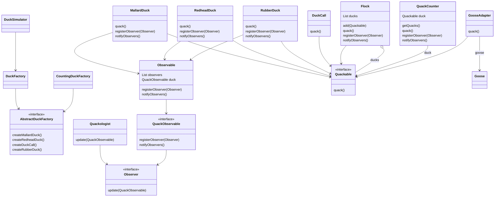
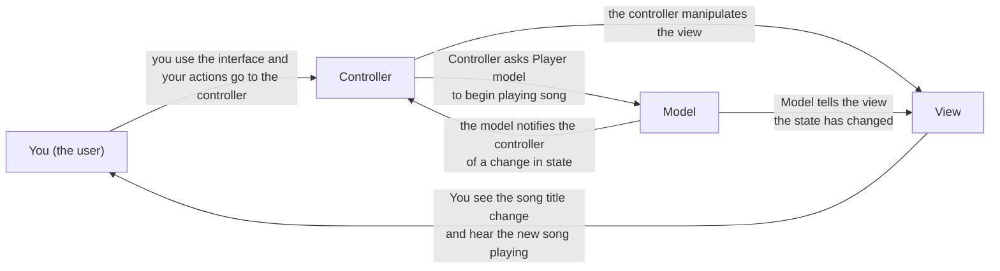
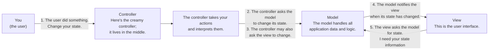
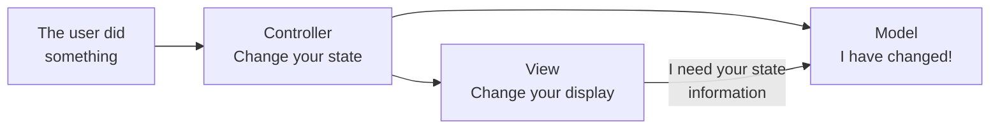
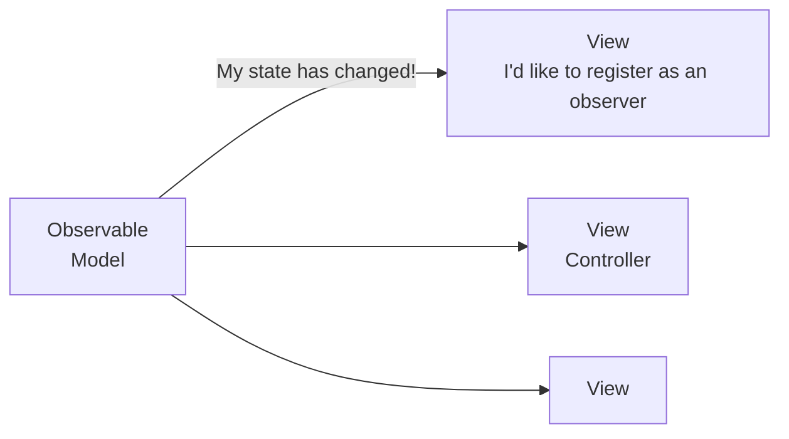
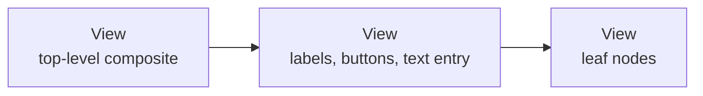
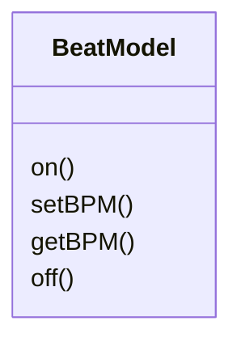
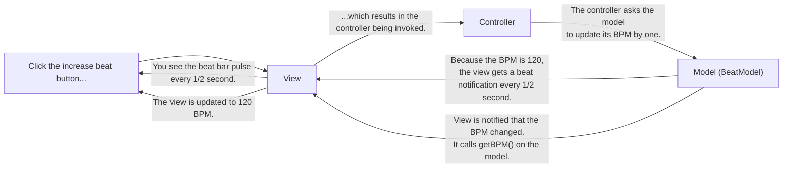
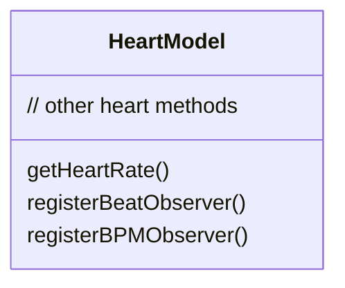
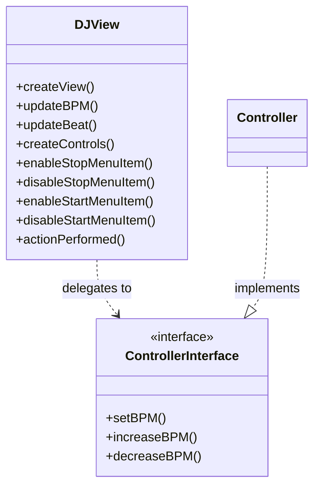

# Capítulo 12: Patrones de patrones

> ¿Quién habría apostado alguna vez a que los Patrones podían trabajar juntos? Ya has sido testigo de las acaloradas Charlas junto a la chimenea (y ni siquiera has visto las páginas del Duelo a muerte entre Patrones que el editor nos obligó a quitar del libro), así que ¿quién habría pensado que los patrones pueden realmente llevarse bien? Pues bien, créelo o no, algunos de los diseños OO más poderosos usan varios patrones a la vez. Prepárate para llevar tus habilidades con patrones al siguiente nivel; es hora de los patrones compuestos.

!!! tip "Nota de la traducción"
    Los nombres de clases, interfaces y métodos (`Quackable`, `QuackCounter`, `GooseAdapter`, `DuckSimulator`, `quack()`...) se mantienen en inglés para que el código siga siendo válido y comparable con el original. La prosa, los comentarios y las explicaciones sí están traducidos. Los términos *observer*, *decorator*, *adapter*, *factory*, *composite* y *iterator* se transliteran sin traducir por ser tecnicismos ya consolidados en la literatura en español.

## Trabajando juntos

Una de las mejores maneras de usar patrones es sacarlos de casa para que puedan interactuar con otros patrones. Cuanto más usas patrones, más los verás aparecer juntos en tus diseños. Tenemos un nombre especial para un conjunto de patrones que trabajan juntos en un diseño que se puede aplicar a muchos problemas: un patrón compuesto. Así es, ¡ahora estamos hablando de patrones hechos de patrones!

Encontrarás muchos patrones compuestos en uso en el mundo real. Ahora que tienes patrones en la cabeza, verás que en realidad son solo patrones trabajando juntos, y eso hace que sean más fáciles de entender.

Vamos a empezar este capítulo volviendo a nuestros simpáticos patos en el simulador de patos SimUDuck. No tiene nada de raro que los patos estén aquí cuando combinamos patrones; después de todo, han estado con nosotros a lo largo de todo el libro y han sido muy generosos al participar en montones de patrones. Los patos van a ayudarte a entender cómo pueden trabajar juntos los patrones en una misma solución. Pero el hecho de que hayamos combinado algunos patrones no significa que tengamos una solución que califique como patrón compuesto. Para eso, tiene que ser una solución de propósito general que se pueda aplicar a muchos problemas. Así que, en la segunda mitad del capítulo visitaremos un verdadero patrón compuesto: el Modelo-Vista-Controlador, también conocido como MVC. Si no has oído hablar de MVC, lo oirás, y descubrirás que MVC es uno de los patrones compuestos más poderosos de tu caja de herramientas de diseño.

!!! abstract "Definición"
    Los patrones se usan a menudo juntos y combinados dentro de la misma solución de diseño.

    Un patrón compuesto combina dos o más patrones en una solución que resuelve un problema recurrente o general.

## Reunión de patos

Como ya te has enterado, vamos a volver a trabajar con los patos. Esta vez los patos van a mostrarte cómo pueden coexistir los patrones e incluso cooperar dentro de una misma solución.

Vamos a reconstruir nuestro simulador de patos desde cero y darle algunas capacidades interesantes usando un montón de patrones. Bueno, empecemos...

**Primero, vamos a crear una interfaz `Quackable`.**

1. Como dijimos, empezamos desde cero. Esta vez, los Patos van a implementar una interfaz `Quackable`. Así sabremos qué cosas del simulador pueden hacer `quack()`: como los Patos Reales, los Patos de Cabeza Roja, las Llamadas de Pato, y quizá hasta veamos reaparecer al Pato de Goma.

```java
public interface Quackable {
    public void quack();
}
```

!!! note "Nota marginal"
    Los `Quackable` solo tienen que hacer bien una cosa: ¡Quack!

**Ahora, algunos Patos que implementan `Quackable`.**

2. ¿De qué sirve una interfaz sin unas cuantas clases que la implementen? Es hora de crear unos patos concretos (pero no del tipo «arte de jardín», si sabes a qué nos referimos).

```java
public class MallardDuck implements Quackable {
    public void quack() {
        System.out.println("Quack");
    }
}

public class RedheadDuck implements Quackable {
    public void quack() {
        System.out.println("Quack");
    }
}
```

!!! note "Notas marginales"
    Tu pato real (*mallard*) de toda la vida.

    Tenemos que tener cierta variación de especies si queremos que esto sea un simulador interesante.

### Añadiendo más patos

**Esto no sería muy divertido si no añadiéramos también otros tipos de Patos.** ¿Te acuerdas de la última vez? Teníamos llamadas de pato (esas cosas que usan los cazadores; desde luego son *quackables*) y patos de goma.

```java
public class DuckCall implements Quackable {
    public void quack() {
        System.out.println("Kwak");
    }
}

public class RubberDuck implements Quackable {
    public void quack() {
        System.out.println("Squeak");
    }
}
```

!!! note "Notas marginales"
    Una `DuckCall` que hace *quack* pero que no suena del todo como la cosa real.

    Un `RubberDuck` que hace un *squeak* cuando hace *quack*.

**Bien, ya tenemos nuestros patos; ahora solo necesitamos un simulador.**

3. Vamos a preparar un simulador que cree unos cuantos patos y se asegure de que sus *quackers* funcionan...

```java
public class DuckSimulator {
    public static void main(String[] args) {
        DuckSimulator simulator = new DuckSimulator();
        simulator.simulate();
    }
    void simulate() {
        Quackable mallardDuck = new MallardDuck();
        Quackable redheadDuck = new RedheadDuck();
        Quackable duckCall = new DuckCall();
        Quackable rubberDuck = new RubberDuck();
        System.out.println("\nDuck Simulator");
        simulate(mallardDuck);
        simulate(redheadDuck);
        simulate(duckCall);
        simulate(rubberDuck);
    }
    void simulate(Quackable duck) {
        duck.quack();
    }
}
```

!!! note "Notas marginales"
    Aquí tienes nuestro método `main()` para ponerlo todo en marcha.

    Creamos un simulador y luego llamamos a su método `simulate()`.

    Necesitamos algunos patos, así que aquí creamos uno de cada `Quackable`...

    ...y luego simulamos cada uno.

    Aquí sobrecargamos el método `simulate()` para simular un solo pato.

    Aquí dejamos que el polimorfismo haga su magia: no importa qué tipo de `Quackable` se le pase, el método `simulate()` le pide que haga *quack*.

!!! note "Nota marginal"
    Todavía no es demasiado emocionante, ¡pero aún no hemos añadido patrones!

!!! info "¡Y aquí está la salida!"
    ```text
    File  Edit   Window  Help  ItBetterGetBetterThanThis
    % java DuckSimulator
    Duck Simulator
    Quack
    Quack
    Kwak
    Squeak
    ```

!!! note "Nota marginal"
    Todos implementan la misma interfaz `Quackable`, pero sus implementaciones les permiten hacer *quack* a su manera.

**Parece que todo está funcionando; hasta aquí, bien.**

**Cuando hay patos, las ocas no pueden estar lejos.**

4. Donde hay un ave acuática, seguramente haya dos. Aquí tienes una clase `Goose` que lleva un tiempo rondando por el simulador.

```java
public class Goose {
    public void honk() {
        System.out.println("Honk");
    }
}
```

!!! note "Nota marginal"
    Un `Goose` es un *honker*, no un *quacker*.

Supongamos que quisiéramos poder usar un `Goose` en cualquier sitio donde quisiéramos usar un `Duck`. Después de todo, las ocas hacen ruido; las ocas vuelan; las ocas nadan. ¿Por qué no podemos tener Ocas en el simulador?

¿Qué patrón nos permitiría que las Ocas se mezclaran fácilmente con los Patos?

### Adaptador de pato

**Necesitamos un adaptador de pato.**

5. Nuestro simulador espera ver interfaces `Quackable`. Como las ocas no son *quackers* (son *honkers*), podemos usar un adaptador para adaptar una oca a un pato.

```java
public class GooseAdapter implements Quackable {
    Goose goose;
    public GooseAdapter(Goose goose) {
        this.goose = goose;
    }
    public void quack() {
        goose.honk();
    }
}
```

!!! note "Notas marginales"
    Recuerda, un `Adapter` implementa la interfaz destino, que en este caso es `Quackable`.

    El constructor toma la oca que vamos a adaptar.

    Cuando se llama a `quack`, la llamada se delega en el método `honk()` de la oca.

**Ahora las ocas también deberían poder jugar en el simulador.**

6. Todo lo que tenemos que hacer es crear un `Goose` y envolverlo en un adaptador que implemente `Quackable`, y listo.

```java
public class DuckSimulator {
    public static void main(String[] args) {
        DuckSimulator simulator = new DuckSimulator();
        simulator.simulate();
    }
    void simulate() {
        Quackable mallardDuck = new MallardDuck();
        Quackable redheadDuck = new RedheadDuck();
        Quackable duckCall = new DuckCall();
        Quackable rubberDuck = new RubberDuck();
        Quackable gooseDuck = new GooseAdapter(new Goose());
        System.out.println("\nDuck Simulator: With Goose Adapter");
        simulate(mallardDuck);
        simulate(redheadDuck);
        simulate(duckCall);
        simulate(rubberDuck);
        simulate(gooseDuck);
    }
    void simulate(Quackable duck) {
        duck.quack();
    }
}
```

!!! note "Notas marginales"
    Creamos un `Goose` que se comporta como un `Duck` envolviendo la oca en el `GooseAdapter`.

    Una vez que el `Goose` está envuelto, podemos tratarlo como cualquier otro objeto `Quackable` de pato.

**Vamos a darle una vuelta rápida...**

7. Esta vez, cuando ejecutamos el simulador, la lista de objetos que se le pasa al método `simulate()` incluye un `Goose` envuelto en un adaptador de pato. ¿El resultado? ¡Deberíamos ver algún graznido!

!!! info "¡Y aquí está la salida!"
    ```text
    File  Edit   Window  Help  GoldenEggs
    % java DuckSimulator
    Duck Simulator: With Goose Adapter
    Quack
    Quack
    Kwak
    Squeak
    Honk
    ```

!!! note "Nota marginal"
    ¡Ahí está la oca! Ahora el `Goose` puede hacer *quack* junto con el resto de los Patos.

### Quackology

Los Cuaclólogos están fascinados por todos los aspectos del comportamiento `Quackable`. Una de las cosas que los Cuaclólogos siempre han querido estudiar es el número total de *quacks* que produce una bandada de patos.

¿Cómo podemos añadir la capacidad de contar los *quacks* de los patos sin tener que cambiar las clases de pato?

¿Se te ocurre algún patrón que nos pudiera ayudar?

*J. Brewer, guardaparques y Cuaclólogo*

### Decorador de pato

**Vamos a dar gusto a esos Cuaclólogos y darles unos cuantos recuentos de *quacks*.**

8. ¿Cómo? Vamos a crear un decorador que le dé a los patos un comportamiento nuevo (el comportamiento de contar) envolviéndolos con un objeto decorador. No tendremos que cambiar el código de `Duck` en absoluto.

```java
public class QuackCounter implements Quackable {
    Quackable duck;
    static int numberOfQuacks;
    public QuackCounter (Quackable duck) {
        this.duck = duck;
    }
    public void quack() {
        duck.quack();
        numberOfQuacks++;
    }
    public static int getQuacks() {
        return numberOfQuacks;
    }
}
```

!!! note "Notas marginales"
    Igual que con `Adapter`, tenemos que implementar la interfaz destino. `QuackCounter` es un decorador.

    Tenemos una variable de instancia para guardar el *quacker* que estamos decorando.

    Y estamos contando TODOS los *quacks*, así que usaremos una variable estática para llevar la cuenta.

    Obtenemos la referencia al `Quackable` que estamos decorando en el constructor.

    Cuando se llama a `quack()`, delegamos la llamada en el `Quackable` que estamos decorando...

    ...y luego aumentamos el número de *quacks*.

    Estamos añadiendo otro método al decorador. Este método estático simplemente devuelve el número de *quacks* que se han producido en todos los `Quackable`.

**Tenemos que actualizar el simulador para que cree patos decorados.**

9. Ahora tenemos que envolver cada objeto `Quackable` que instanciemos en un decorador `QuackCounter`. Si no lo hacemos, tendremos patos dando vueltas por ahí haciendo *quacks* sin contar.

```java
public class DuckSimulator {
    public static void main(String[] args) {
        DuckSimulator simulator = new DuckSimulator();
        simulator.simulate();
    }
    void simulate() {
        Quackable mallardDuck = new QuackCounter(new MallardDuck());
        Quackable redheadDuck = new QuackCounter(new RedheadDuck());
        Quackable duckCall = new QuackCounter(new DuckCall());
        Quackable rubberDuck = new QuackCounter(new RubberDuck());
        Quackable gooseDuck = new GooseAdapter(new Goose());
        System.out.println("\nDuck Simulator: With Decorator");
        simulate(mallardDuck);
        simulate(redheadDuck);
        simulate(duckCall);
        simulate(rubberDuck);
        simulate(gooseDuck);
        System.out.println("The ducks quacked " +
                           QuackCounter.getQuacks() + " times");
    }
    void simulate(Quackable duck) {
        duck.quack();
    }
}
```

!!! note "Notas marginales"
    Cada vez que creamos un `Quackable`, lo envolvemos con un decorador nuevo.

    El guardaparques nos dijo que no quería contar los graznidos de las ocas, así que no lo decoramos.

    Aquí es donde reunimos el comportamiento de *quack* para los Cuaclólogos.

    Aquí no cambia nada; los objetos decorados siguen siendo `Quackable`.

!!! info "¡Y aquí está la salida!"
    ```text
    File  Edit   Window  Help  DecoratedEggs
    % java DuckSimulator
    Duck Simulator: With Decorator
    Quack
    Quack
    Kwak
    Squeak
    Honk
    The ducks quacked 4 times
    %
    ```

!!! note "Notas marginales"
    Aquí tienes la salida.

    Recuerda, no estamos contando las ocas.

### Fábrica de patos

Este recuento de *quacks* es genial. Estamos aprendiendo cosas que nunca supimos sobre los pequeños *quackers*. Pero estamos comprobando que demasiados *quacks* no se están contando. ¿Nos ayudas?

!!! warning "Regla de la pegatina"
    Tienes que decorar los objetos para obtener el comportamiento decorado.

Tiene razón, ese es el problema de envolver objetos: tienes que asegurarte de que se envuelven o no obtienen el comportamiento decorado.

¿Por qué no tomamos la creación de patos y la localizamos en un solo sitio; en otras palabras, tomemos la creación y la decoración de patos y encapsulémoslo?

¿Cómo suena eso? ¿A qué patrón te recuerda?

**¡Necesitamos una fábrica que produzca patos!**

10. Vale, necesitamos un poco de control de calidad para asegurarnos de que nuestros patos se envuelven. Vamos a construir una fábrica entera solo para producirlos. La fábrica debería producir una familia de productos que consiste en distintos tipos de patos, así que vamos a usar el Patrón de Fábrica Abstracta.

Empecemos por la definición de la clase `AbstractDuckFactory`:

```java
public abstract class AbstractDuckFactory {
    public abstract Quackable createMallardDuck();
    public abstract Quackable createRedheadDuck();
    public abstract Quackable createDuckCall();
    public abstract Quackable createRubberDuck();
}
```

!!! note "Notas marginales"
    Estamos definiendo una fábrica abstracta que las subclases implementarán para crear distintas familias.

    Cada método crea un tipo de pato.

A continuación vamos a crear una fábrica que cree patos sin decoradores, solo para coger el tranquillo a la fábrica:

```java
public class DuckFactory extends AbstractDuckFactory {
    public Quackable createMallardDuck() {
        return new MallardDuck();
    }
    public Quackable createRedheadDuck() {
        return new RedheadDuck();
    }
    public Quackable createDuckCall() {
        return new DuckCall();
    }
    public Quackable createRubberDuck() {
        return new RubberDuck();
    }
}
```

!!! note "Notas marginales"
    `DuckFactory` extiende la fábrica abstracta.

    Cada método crea un producto: un tipo concreto de `Quackable`. El producto real es desconocido para el simulador; simplemente sabe que está recibiendo un `Quackable`.

Ahora vamos a crear la fábrica que realmente queremos, la `CountingDuckFactory`:

```java
public class CountingDuckFactory extends AbstractDuckFactory {
    public Quackable createMallardDuck() {
        return new QuackCounter(new MallardDuck());
    }
    public Quackable createRedheadDuck() {
        return new QuackCounter(new RedheadDuck());
    }
    public Quackable createDuckCall() {
        return new QuackCounter(new DuckCall());
    }
    public Quackable createRubberDuck() {
        return new QuackCounter(new RubberDuck());
    }
}
```

!!! note "Notas marginales"
    `CountingDuckFactory` también extiende la fábrica abstracta.

    Cada método envuelve el `Quackable` con el decorador que cuenta los *quacks*. El simulador nunca sabrá la diferencia; simplemente recibe un `Quackable`. Pero ahora nuestros guardaparques pueden estar seguros de que se están contando todos los *quacks*.

### Familias de patos

**Vamos a configurar el simulador para que use la fábrica.**

11. ¿Recuerdas cómo funciona el Patrón de Fábrica Abstracta? Creamos un método polimórfico que recibe una fábrica y la usa para crear objetos. Al pasar distintas fábricas, podemos usar distintas familias de productos en el método.

Vamos a modificar el método `simulate()` para que reciba una fábrica y la use para crear patos.

```java
public class DuckSimulator {
    public static void main(String[] args) {
        DuckSimulator simulator = new DuckSimulator();
        AbstractDuckFactory duckFactory = new CountingDuckFactory();
        simulator.simulate(duckFactory);
    }
    void simulate(AbstractDuckFactory duckFactory) {
        Quackable mallardDuck = duckFactory.createMallardDuck();
        Quackable redheadDuck = duckFactory.createRedheadDuck();
        Quackable duckCall = duckFactory.createDuckCall();
        Quackable rubberDuck = duckFactory.createRubberDuck();
        Quackable gooseDuck = new GooseAdapter(new Goose());
        System.out.println("\nDuck Simulator: With Abstract Factory");
        simulate(mallardDuck);
        simulate(redheadDuck);
        simulate(duckCall);
        simulate(rubberDuck);
        simulate(gooseDuck);
        System.out.println("The ducks quacked " +
                           QuackCounter.getQuacks() +
                           " times");
    }
    void simulate(Quackable duck) {
        duck.quack();
    }
}
```

!!! note "Notas marginales"
    Primero creamos la fábrica que vamos a pasarle al método `simulate()`.

    El método `simulate()` recibe un `AbstractDuckFactory` y lo usa para crear patos en vez de instanciarlos directamente.

    Aquí no cambia nada. El mismo código de siempre.

!!! info "¡Y aquí está la salida usando la fábrica...!"
    ```text
    File  Edit   Window  Help  EggFactory
    % java DuckSimulator
    Duck Simulator: With Abstract Factory
    Quack
    Quack
    Kwak
    Squeak
    Honk
    4 quacks were counted
    %
    ```

!!! note "Nota marginal"
    Igual que la última vez, pero esta vez nos aseguramos de que todos los patos están decorados porque estamos usando la `CountingDuckFactory`.

!!! exercise "Puzle de diseño"
    Todavía estamos instanciando Ocas directamente apoyándonos en clases concretas. ¿Podrías escribir una Fábrica Abstracta para las Ocas? ¿Cómo debería gérer la creación de los «patos oca»?

### Bandada de patos

Se nos está haciendo un poco difícil gestionar todos estos patos distintos por separado. ¿Hay alguna manera en que puedas ayudarnos a gestionar los patos como un conjunto, y quizá incluso permitirnos gestionar unas cuantas «familias» de patos que nos gustaría tener controladas?

**Ah, quiere gestionar una bandada de patos.**

Aquí va otra buena pregunta del Ranger Brewer: ¿Por qué estamos gestionando los patos individualmente?

```java
Quackable mallardDuck = duckFactory.createMallardDuck();
Quackable redheadDuck = duckFactory.createRedheadDuck();
Quackable duckCall = duckFactory.createDuckCall();
Quackable rubberDuck = duckFactory.createRubberDuck();
Quackable gooseDuck = new GooseAdapter(new Goose());
simulate(mallardDuck);
simulate(redheadDuck);
simulate(duckCall);
simulate(rubberDuck);
simulate(gooseDuck);
```

!!! note "Nota marginal"
    Esto no es muy manejable.

Lo que necesitamos es una forma de hablar de colecciones de patos e incluso de subcolecciones de patos (para atender la petición de familia del Ranger Brewer). También estaría bien si pudiéramos aplicar operaciones a todo el conjunto de patos.

¿Qué patrón puede ayudarnos?

**Vamos a crear una bandada de patos (bueno, en realidad una bandada de `Quackable`).**

12. ¿Recuerdas el Patrón Compuesto que nos permite tratar una colección de objetos de la misma manera que los objetos individuales? ¿Qué compuesto mejor que una bandada de `Quackable`!

Vamos a repasar paso a paso cómo va a funcionar esto:

```java
public class Flock implements Quackable {
    List<Quackable> quackers = new ArrayList<Quackable>();
    public void add(Quackable quacker) {
        quackers.add(quacker);
    }
    public void quack() {
        Iterator<Quackable> iterator = quackers.iterator();
        while (iterator.hasNext()) {
            Quackable quacker = iterator.next();
            quacker.quack();
        }
    }
}
```

!!! note "Notas marginales"
    Recuerda, el compuesto necesita implementar la misma interfaz que los elementos hoja. Nuestros elementos hoja son los `Quackable`.

    Estamos usando un `ArrayList` dentro de cada `Flock` para guardar los `Quackable` que pertenecen a la `Flock`.

    El método `add()` añade un `Quackable` a la `Flock`.

    Ahora el método `quack()`; después de todo, la `Flock` también es un `Quackable`. El método `quack()` de `Flock` tiene que funcionar sobre toda la `Flock`. Aquí iteramos por el `ArrayList` y llamamos a `quack()` en cada elemento.

!!! example "Código de cerca"
    ¿Te has fijado en que hemos intentado colarte un Patrón de Diseño sin decírtelo?

    ```java
    public void quack() {
        Iterator<Quackable> iterator = quackers.iterator();
        while (iterator.hasNext()) {
            Quackable quacker = iterator.next();
            quacker.quack();
        }
    }
    ```

    ¡Ahí está! ¡El Patrón Iterator en acción!

### Compuesto de patos

**Ahora necesitamos modificar el simulador.**

13. Nuestro compuesto está listo; solo necesitamos algo de código que reúna a los patos dentro de la estructura compuesta.

```java
public class DuckSimulator {
    // main method here
    void simulate(AbstractDuckFactory duckFactory) {
        Quackable redheadDuck = duckFactory.createRedheadDuck();
        Quackable duckCall = duckFactory.createDuckCall();
        Quackable rubberDuck = duckFactory.createRubberDuck();
        Quackable gooseDuck = new GooseAdapter(new Goose());
        System.out.println("\nDuck Simulator: With Composite - Flocks");
        Flock flockOfDucks = new Flock();
        flockOfDucks.add(redheadDuck);
        flockOfDucks.add(duckCall);
        flockOfDucks.add(rubberDuck);
        flockOfDucks.add(gooseDuck);
        Flock flockOfMallards = new Flock();
        Quackable mallardOne = duckFactory.createMallardDuck();
        Quackable mallardTwo = duckFactory.createMallardDuck();
        Quackable mallardThree = duckFactory.createMallardDuck();
        Quackable mallardFour = duckFactory.createMallardDuck();
        flockOfMallards.add(mallardOne);
        flockOfMallards.add(mallardTwo);
        flockOfMallards.add(mallardThree);
        flockOfMallards.add(mallardFour);
        flockOfDucks.add(flockOfMallards);
        System.out.println("\nDuck Simulator: Whole Flock Simulation");
        simulate(flockOfDucks);
        System.out.println("\nDuck Simulator: Mallard Flock Simulation");
        simulate(flockOfMallards);
        System.out.println("\nThe ducks quacked " +
                           QuackCounter.getQuacks() +
                           " times");
    }
    void simulate(Quackable duck) {
        duck.quack();
    }
}
```

!!! note "Notas marginales"
    Creamos todos los `Quackable`, igual que antes.

    Primero creamos una `Flock` y la llenamos de `Quackable`.

    Luego creamos una nueva `Flock` de patos reales.

    Aquí estamos creando una pequeña familia de patos reales...

    ...y añadiéndolos a la `Flock` de patos reales.

    Luego añadimos la `Flock` de patos reales a la bandada principal.

    ¡Vamos a probar toda la `Flock`!

    Luego vamos a probar simplemente la `Flock` de patos reales.

    Finalmente, vamos a darle los datos al Cuaclólogo.

    Aquí no necesita cambiar nada; ¡una `Flock` es un `Quackable`!

**Vamos a darle una vuelta...**

!!! info "¡Y aquí está la salida!"
    ```text
    File  Edit   Window  Help  FlockADuck
    % java DuckSimulator
    Duck Simulator: With Composite - Flocks
    Duck Simulator: Whole Flock Simulation
    Quack
    Kwak
    Squeak
    Honk
    Quack
    Quack
    Quack
    Quack
    Duck Simulator: Mallard Flock Simulation
    Quack
    Quack
    Quack
    Quack
    Quack
    The ducks quacked 11 times
    ```

!!! note "Notas marginales"
    Aquí está la primera bandada.

    Y ahora los patos reales.

    Los datos tienen buena pinta (recuerda que la oca no se cuenta).

#### Seguridad frente a transparencia

Puede que recuerdes que en el capítulo del Patrón Compuesto, los compuestos (los `Menu`) y las hojas (los `MenuItem`) tenían exactamente el mismo conjunto de métodos, incluido el método `add()`. Como tenían el mismo conjunto de métodos, podíamos llamar a métodos sobre `MenuItem` que no tenían mucho sentido (como intentar añadir algo a un `MenuItem` llamando a `add()`). La ventaja de esto era que la distinción entre hojas y compuestos era transparente: el cliente no tenía que saber si estaba tratando con una hoja o con un compuesto; simplemente llamaba a los mismos métodos en ambos casos.

Aquí hemos decidido mantener los métodos de mantenimiento de hijos del compuesto separados de los nodos hoja: es decir, solo las `Flock` tienen el método `add()`. Sabemos que no tiene sentido intentar añadir algo a un `Duck`, y en esta implementación no puedes. Solo puedes llamar a `add()` sobre una `Flock`. Así que este diseño es más seguro: no puedes llamar a métodos que no tienen sentido sobre los componentes, pero es menos transparente. Ahora el cliente tiene que saber que un `Quackable` es una `Flock` para poder añadirle `Quackable`.

Como siempre, hay compromisos cuando haces diseño OO, y tienes que tenerlos en cuenta a medida que creas tus propios compuestos.

### Observador de patos

¡El Compuesto está funcionando genial! ¡Gracias!

Ahora tenemos la petición contraria: también necesitamos seguir el rastro de los patos individuales. ¿Puedes darnos una forma de llevar la cuenta del *quack* de cada pato individual en tiempo real?

!!! warning "Regla de la pegatina"
    ¿Puedes decir «observer»?

Suena a que el Cuaclólogo gustaría observar el comportamiento de los patos individuales. Eso nos lleva directamente a un patrón hecho para observar el comportamiento de los objetos: el Patrón Observer.

**Primero necesitamos una interfaz para nuestro `Subject`.**

14. Recuerda que el `Subject` es el objeto que está siendo observado. Vamos a llamarlo algo más memorable: ¿qué tal `Observable`? Un `Observable` necesita métodos para registrar observadores y notificarlos. También podríamos tener un método para quitar observadores, pero por ahora mantendremos la implementación simple y lo dejaremos fuera.

```java
public interface QuackObservable {
    public void registerObserver(Observer observer);
    public void notifyObservers();
}
```

!!! note "Notas marginales"
    `QuackObservable` es la interfaz que los `Quackable` deberían implementar si quieren ser observados.

    Tiene un método para registrar Observers. Cualquier objeto que implemente la interfaz `Observer` puede escuchar los *quacks*. Definiremos la interfaz `Observer` en un segundo.

    También tiene un método para notificar a los observadores.

Ahora tenemos que asegurarnos de que todos los `Quackable` implementen esta interfaz...

```java
public interface Quackable extends QuackObservable {
    public void quack();
}
```

!!! note "Nota marginal"
    Así que extendemos la interfaz `Quackable` con `QuackObservable`.

15. Ahora tenemos que asegurarnos de que todas las clases concretas que implementan `Quackable` puedan hacer las veces de `QuackObservable`.

!!! note "Nota marginal"
    ¡Deja de mirarme! ¡Me estás poniendo nervioso!

Podríamos resolver esto implementando el registro y la notificación en cada una de las clases (como hicimos en el Capítulo 2). Pero esta vez lo vamos a hacer un poco diferente: vamos a encapsular el código de registro y notificación en otra clase, llamémosla `Observable`, y componerla con `QuackObservable`. Así, solo escribimos el código real una vez y `QuackObservable` solo necesita el código justo para delegar en la clase auxiliar `Observable`.

Empecemos con la clase auxiliar `Observable`.

```java
public class Observable implements QuackObservable {
    List<Observer> observers = new ArrayList<Observer>();
    QuackObservable duck;
    public Observable(QuackObservable duck) {
        this.duck = duck;
    }
    public void registerObserver(Observer observer) {
        observers.add(observer);
    }
    public void notifyObservers() {
        Iterator iterator = observers.iterator();
        while (iterator.hasNext()) {
            Observer observer = iterator.next();
            observer.update(duck);
        }
    }
}
```

!!! note "Notas marginales"
    `Observable` implementa toda la funcionalidad que un `Quackable` necesita para ser un observable. Solo tenemos que enchufarlo a una clase y hacer que esa clase delegue en `Observable`.

    `Observable` debe implementar `QuackObservable` porque estas son las mismas llamadas a métodos que se van a delegar en ella.

    En el constructor nos pasan el `QuackObservable` que está usando este objeto para gestionar su comportamiento observable. Echa un vistazo al método `notifyObservers()` de abajo; verás que cuando se produce una notificación, `Observable` pasa este objeto para que el observador sepa qué objeto está haciendo *quack*.

    Aquí está el código para registrar un observador.

    Y el código para hacer las notificaciones.

Ahora veamos cómo usa una clase `Quackable` a esta auxiliar...

### Los decoradores Quack también son observables

**Integra la clase auxiliar `Observable` con las clases `Quackable`.**

16. Esto no debería ser muy difícil. Todo lo que tenemos que hacer es asegurarnos de que las clases `Quackable` están compuestas con un `Observable` y de que saben cómo delegar en él. Después de eso, están listas para ser `Observable`. Aquí está la implementación de `MallardDuck`; los otros patos son iguales.

```java
public class MallardDuck implements Quackable {
    Observable observable;
    public MallardDuck() {
        observable = new Observable(this);
    }
    public void quack() {
        System.out.println("Quack");
        notifyObservers();
    }
    public void registerObserver(Observer observer) {
        observable.registerObserver(observer);
    }
    public void notifyObservers() {
        observable.notifyObservers();
    }
}
```

!!! note "Notas marginales"
    Cada `Quackable` tiene una variable de instancia `Observable`.

    En el constructor creamos un `Observable` y le pasamos una referencia al objeto `MallardDuck`.

    Cuando hacemos *quack*, tenemos que avisar a los observadores.

    Aquí están nuestros dos métodos `QuackObservable`. Fíjate en que simplemente delegamos en la auxiliar.

!!! exercise "Tu turno"
    No hemos cambiado la implementación de uno de los `Quackable`, el decorador `QuackCounter`. También necesitamos convertirlo en un `Observable`. ¿Por qué no escribes tú esa parte?

### Los compuestos de bandadas también son observables

17. Ya casi estamos. Solo necesitamos trabajar en el lado del `Observer` del patrón.

Ya hemos implementado todo lo que necesitamos para los `Observable`; ahora necesitamos algunos `Observer`. Empezaremos por la interfaz `Observer`:

```java
public interface Observer {
    public void update(QuackObservable duck);
}
```

!!! note "Nota marginal"
    La interfaz `Observer` solo tiene un método, `update()`, al que se le pasa el `QuackObservable` que está haciendo *quack*.

Ahora necesitamos un `Observer`: ¿dónde están esos Cuaclólogos?!

```java
public class Quackologist implements Observer {
    public void update(QuackObservable duck) {
        System.out.println("Quackologist: " + duck + " just quacked.");
    }
}
```

!!! note "Notas marginales"
    Tenemos que implementar la interfaz `Observer` o no podremos registrarnos en un `QuackObservable`.

    El `Quackologist` es simple; solo tiene un método, `update()`, que imprime el `Quackable` que acaba de hacer *quack*.

!!! exercise "Tu turno"
    ¿Y si un Cuaclólogo quiere observar una bandada entera? ¿Qué significa eso, además? Piénsalo así: si observamos un compuesto, entonces estamos observando todo lo que hay en el compuesto. Así que, cuando te registras en una bandada, el compuesto bandada se asegura de que te registres en todos sus hijos (perdona, todos sus pequeños *quackers*), que pueden incluir otras bandadas. Adelante y escribe el código observer de la `Flock` antes de que sigamos más adelante.

18. Estamos listos para observar. Vamos a actualizar el simulador y darle una vuelta:

```java
public class DuckSimulator {
    public static void main(String[] args) {
        DuckSimulator simulator = new DuckSimulator();
        AbstractDuckFactory duckFactory = new CountingDuckFactory();
        simulator.simulate(duckFactory);
    }
    void simulate(AbstractDuckFactory duckFactory) {
        // create duck factories and ducks here
        // create flocks here
        System.out.println("\nDuck Simulator: With Observer");
        Quackologist quackologist = new Quackologist();
        flockOfDucks.registerObserver(quackologist);
        simulate(flockOfDucks);
        System.out.println("\nThe ducks quacked " +
                           QuackCounter.getQuacks() +
                           " times");
    }
    void simulate(Quackable duck) {
        duck.quack();
    }
}
```

!!! note "Notas marginales"
    Aquí lo único que hacemos es crear un `Quackologist` y establecerlo como observer de la bandada.

    Esta vez simplemente simulamos toda la bandada.

    Vamos a darle una vuelta y ver cómo funciona.

### El gran final de los patos

Este es el gran final. Cinco —no, seis— patrones se han unido para crear este increíble Duck Simulator. Sin más preámbulos, ¡presentamos a `DuckSimulator`!

!!! info "¡Y aquí está la salida!"
    ```text
    File  Edit   Window  Help  DucksAreEverywhere
    % java DuckSimulator
    Duck Simulator: With Observer
    Quack
    Quackologist: Redhead Duck just quacked.
    Kwak
    Quackologist: Duck Call just quacked.
    Squeak
    Quackologist: Rubber Duck just quacked.
    Honk
    Quackologist: Goose pretending to be a Duck just quacked.
    Quack
    Quackologist: Mallard Duck just quacked.
    Quack
    Quackologist: Mallard Duck just quacked.
    Quack
    Quackologist: Mallard Duck just quacked.
    Quack
    Quackologist: Mallard Duck just quacked.
    The Ducks quacked 7 times.
    ```

!!! note "Notas marginales"
    Después de cada *quack*, no importa de qué tipo fuera, el observer recibe una notificación.

    Y el Cuaclólogo sigue obteniendo sus recuentos.

!!! question "¿Así que esto era un patrón compuesto?"
    **R:** No, esto era solo un conjunto de patrones trabajando juntos. Un patrón compuesto es un conjunto de unos cuantos patrones que se combinan para resolver un problema general. Estamos a punto de echarle un vistazo al patrón compuesto Modelo-Vista-Controlador; es una colección de unos cuantos patrones que se ha usado una y otra vez en muchas soluciones de diseño.

!!! question "Entonces, ¿la verdadera belleza de los Patrones de Diseño es que puedo coger un problema e ir aplicándole patrones hasta que tenga una solución? ¿Verdad?"
    **R:** Equivocado. Hemos hecho este ejercicio con los Patos para enseñarte cómo pueden trabajar juntos los patrones. Nunca querrías abordar un diseño como el que acabamos de hacer. De hecho, puede que haya soluciones para partes del Duck Simulator para las que algunos de estos patrones eran una exageración absoluta. A veces, simplemente usar buenos principios de diseño OO puede resolver un problema lo bastante bien por sí solo.

    Va a ser mejor que sigamos hablando de esto en el próximo capítulo, porque lo único que quieres es aplicar patrones cuando y donde tengan sentido. Nunca deberías empezar con la intención de usar patrones solo por el hecho de usarlos. Deberías considerar que el diseño del Duck Simulator te ha sido forzado y artificial. Pero oye, ha sido divertido y nos ha dado una buena idea de cómo varios patrones pueden encajar en una solución.

## ¿Qué hicimos?

Empezamos con un montón de Quackables... Un ganso apareció y quiso comportarse como un Quackable también. Así que usamos el patrón Adapter para adaptar el ganso a un Quackable. Ahora puedes llamar a `quack()` sobre un ganso envuelto en el adapter y hará su graznido.

Luego, los cuaquólogos decidieron que querían contar los graznidos. Así que usamos el patrón Decorator para añadir un decorator QuackCounter que lleva la cuenta del número de veces que se llama a `quack()`, y luego delega el graznido en el Quackable que está envolviendo.

Pero a los cuaquólogos les preocupaba que olvidaran añadir el decorator QuackCounter. Así que usamos el patrón Abstract Factory para crear patos por ellos. Ahora, siempre que quieran un pato, se lo piden a la fábrica y esta les devuelve un pato decorado. (¡Y no olvides que también pueden usar otra fábrica de patos si quieren un pato sin decorar!)

Teníamos problemas de gestión para llevar la cuenta de todos esos patos, gansos y quackables. Así que usamos el patrón Composite para agrupar los Quackables en Flocks. El patrón también permite que el Quackologist cree subFlocks para gestionar familias de patos. Usamos el patrón Iterator en nuestra implementación utilizando el iterator de `java.util` en el `ArrayList`.

Los cuaquólogos también querían que se les notificara cada vez que cualquier Quackable graznaba. Así que usamos el patrón Observer para que los cuaquólogos se registraran como Quackable Observers. Ahora se les notifica cada vez que cualquier Quackable grazna. Volvimos a usar el iterator en esta implementación. Los cuaquólogos incluso pueden usar el patrón Observer con sus composites.

!!! tip "Un respiro"
    Eso ha sido un buen entrenamiento de patrones de diseño. deberías estudiar el diagrama de clases de la página siguiente y luego tomarte una pausa relajante antes de continuar con Model-View-Controller.

## Una vista del patorama: el diagrama de clases

Hemos metido un montón de patrones en un pequeño simulador de patos! Aquí tienes la gran imagen de lo que hicimos:



!!! note "Notas marginales"
    `DuckSimulator` usa una fábrica para crear Ducks.

    Aquí tienes dos fábricas distintas que producen la misma familia de productos. La `DuckFactory` crea patos, y la `CountingDuckFactory` crea Ducks envueltos en decorators `QuackCounter`.

    Si una clase implementa `Observer`, eso significa que puede observar Quackables, y se le notificará cada vez que un Quackable grazne.

    Solo implementamos un tipo de Observer para los Quackables: el `Quackologist`. Pero cualquier clase que implemente la interfaz `Observer` puede observar patos... ¿qué tal si implementamos un observer `BirdWatcher`?

    La interfaz `QuackObservable` nos da un conjunto de métodos que cualquier `Observable` debe implementar.

    `Quackable` es la interfaz que implementan todas las clases que tienen comportamiento de graznido.

    Cada `Quackable` tiene una instancia de `Observable` para llevar la cuenta de sus observers y notificarles cuando el `Quackable` grazne.

    Este Adapter...

    ...y este Composite...

    ...y este Decorator.

    Tenemos dos clases de Quackables: patos y otras cosas que quieren comportamiento de Quackable, como el `GooseAdapter`, que envuelve un `Goose` y hace que parezca un `Quackable`; y este `Flock`, que es un Composite de Quackables. ¡Y todos se comportan como Quackables!

    `QuackCounter`, que añade comportamiento a los Quackables.

## El rey de los patrones compuestos

### Si Elvis fuera un patrón compuesto, su nombre sería Model-View-Controller, y estaría cantando una pequeña canción como esta...

**Model, View, Controller**

Modela una botella de fino Chardonnay  
Modela todas las oclusivas que dice la gente  
Modela el revuelto de huevos hirviendo  
Puedes modelar el vaivén de las patas de Hexley  
Model View, puedes modelar todas las modelos que posan para GQ  
Model a un lado, View al otro, el Controller en medio.  
Model View Controller

!!! note "Notas marginales"
    Letra y música de James Dempsey.

    MVC es un paradigma para factorizar tu código en segmentos funcionales, de modo que tu cerebro no explote.

    Para conseguir reutilización tienes que mantener esos límites limpios.

    ¡Java también!

Los objetos View suelen ser controles que se usan para mostrar y editar  
Cocoa tiene muchísimos de esos, y además bien escritos  
Coge un NSTextView y dale cualquier cadena Unicode  
El usuario puede interactuar con él, puede contener casi cualquier cosa  
Pero la vista no sabe nada del Model  
Esa cadena podría ser un número de teléfono o las obras de Aristóteles  
Mantén el acoplamiento flojo  
y así consigue un enorme nivel de reutilización

!!! note "Etiquetas del diagrama"
    View

    Creamy Controller

    Model

Model View, todo renderizado muy mola en azul aqua  
Model View, tiene tres capas como las Oreo  
Model View Controller  
Model View, Model View, Model View Controller

Ahora seguramente te estarás preguntando  
Seguro que te preguntas cómo  
Los objetos Model representan la razón de ser de tu aplicación  
Los datos fluyen entre Model y View  
Objetos propios que contienen datos, lógica y demás  
El Controller tiene que mediar  
Entre el estado cambiante de cada capa  
Para sincronizar los datos de las dos  
Tira y empuja cada valor que ha cambiado  
Puedes modelar un acelerador y un colector  
Model View, ¡un saludo enorme al equipo de Smalltalk!  
Modela el primer andar de un niño de dos años  
Model View Controller

Cómo diablos vamos a librarnos de todo ese pegamento  
Model View, se pronuncia Oh Oh, no Ooo Ooo  
Model View Controller

Los Controllers conocen el Model y el View muy íntimamente  
Queda un poquito de esta historia

A menudo usan valores fijos en el código, lo cual puede ser un mal augurio para la reutilización  
Unas cuantas millas más por este camino

Pero ahora puedes conectar cada clave del modelo que selecciones con cualquier propiedad de la vista  
Nadie parece sacar mucha gloria

De escribir el código del controlador  
Y la vista es preciousísima

Y en cuanto empiezas a enlazar  
Pues bien, el modelo es crítico para la misión

Creo que encontrarás menos código en tu árbol de fuentes  
Puede que sea vago, pero a veces es sencillamente una locura

Sí, ya sé que estaba flipando con todo lo que han automatizado  
Cuánto código escribo es solo pegamento

y las cosas que te dan gratis  
Y no sería tan trágico

Pero el código no hace magia  
Y no lo digo con mala intención

Y creo que merece la pena repetirlo  
Pero se vuelve repetitivo

Solo está moviendo valores por todo el código que no necesitarás  
cuando lo enganches en IB. Con Swing.

Model View incluso gestiona también las selecciones múltiples  
Haciendo todas esas cosas que hacen los controladores  
Y ojalá tuviera un céntimo

Model View, apuesta a que publico mi aplicación antes que tú  
Por cada vez  
que envié un TextField StringValue.  
Model View

!!! warning "No te limites a leer!"
    Después de todo, esto es un libro Head First... mira esta URL:

    ```text
    https://www.youtube.com/watch?v=YYvOGPMLVDo
    ```

    Siéntate y dale una escucha.

!!! question
    Bonita canción, pero ¿de verdad se supone que eso debería enseñarme qué es Model-View-Controller? Ya he intentado aprender MVC antes y me hizo daño el cerebro.

**Design Patterns son tu clave para entender MVC.**

Solo intentábamos despertar tu apetito con la canción. Te cuento qué, cuando termines de leer este capítulo, vuelve y escucha la canción otra vez: te divertiré más.

Suena como si hubieras tenido un mal encuentro con MVC en el pasado. A la mayoría nos ha pasado. Probablemente otros desarrolladores te hayan dicho que les cambió la vida y que podría crear quizá la paz mundial. Es un patrón compuesto muy potente, sin duda, y aunque no podemos afirmar que vaya a crear la paz mundial, te ahorrará horas de escritura de código una vez que lo conozcas.

Pero primero tienes que aprenderlo, ¿verdad? Pues bien, esta vez la diferencia va a ser grande, porque ahora ya conoces los patrones.

Así es: los patrones son la clave de MVC. Aprender MVC desde arriba abajo es difícil; no muchos desarrolladores lo logran. Aquí está el secreto para aprender MVC: no es más que unos cuantos patrones puestos juntos. Cuando abordas el aprendizaje de MVC mirando los patrones, de repente empieza a tener sentido.

Vamos a ello. Esta vez, ¡te va a quedar perfecto el MVC!

## Conoce a Model-View-Controller

Imagina que estás usando tu reproductor de música favorito, como iTunes. Puedes usar su interfaz para añadir canciones nuevas, gestionar listas de reproducción y renombrar pistas. El reproductor se encarga de mantener una pequeña base de datos con todas tus canciones junto con sus nombres y sus datos. También se encarga de reproducir las canciones y, mientras lo hace, la interfaz de usuario se actualiza constantemente con el título de la canción actual, la duración en curso, y así sucesivamente.

Pues bien, por debajo de todo eso está Model-View-Controller...



!!! note "Notas marginales"
    Aquí tienes el modelo; contiene todo el estado, los datos y la lógica de aplicación necesarios para mantener y reproducir mp3.

!!! example "El modelo en el reproductor de música"
    ```java
    class Player {
      play(){}
      rip(){}
      burn(){}
    }
    ```

## Un vistazo más de cerca...

La descripción del reproductor de música nos da una visión de alto nivel de MVC, pero realmente no ayuda a entender los detalles de cómo funciona el patrón compuesto, cómo lo construirías tú mismo, o por qué es algo tan bueno. Empecemos recorriendo las relaciones entre el modelo, la vista y el controlador, y después le echaremos un segundo vistazo desde la perspectiva de los patrones de diseño.

- **CONTROLLER:** Toma la entrada del usuario y averigua qué significa eso para el modelo.
- **MODEL:** El modelo contiene todos los datos, el estado y la lógica de aplicación. El modelo es ajeno a la vista y al controlador, aunque proporciona una interfaz para manipular y recuperar su estado, y puede enviar notificaciones de cambios de estado a los observers.
- **VIEW:** Te da una presentación del modelo. La vista normalmente obtiene directamente del modelo el estado y los datos que necesita para mostrarse.



!!! note "Pasos del ciclo"
    1. Tú eres el usuario: interactúas con la vista.

    2. El controlador pide al modelo que cambie su estado.

    3. El controlador puede además pedirle a la vista que cambie.

    4. El modelo notifica a la vista cuando su estado ha cambiado.

    5. La vista pide el estado al modelo.

## Entender MVC como un conjunto de patrones

Ya hemos sugerido que el mejor camino para aprender MVC es verlo por lo que es: un conjunto de patrones trabajando juntos en el mismo diseño.

Empecemos por el modelo: el modelo usa Observer para mantener las vistas y los controladores al día de los últimos cambios de estado. La vista y el controlador, en cambio, implementan el patrón Strategy. El controlador es la estrategia de la vista, y se puede cambiar fácilmente por otro controlador si quieres un comportamiento distinto. La propia vista también usa un patrón internamente para gestionar las ventanas, los botones y otros componentes de la pantalla: el patrón Composite.

Veamos esto más de cerca:

## Strategy

La vista y el controlador implementan el patrón Strategy clásico: la vista es un objeto que se configura con una estrategia. El controlador proporciona la estrategia. A la vista solo le preocupan los aspectos visuales de la aplicación, y delega en el controlador cualquier decisión sobre el comportamiento de la interfaz. Usar el patrón Strategy también mantiene la vista desacoplada del modelo, porque es el controlador quien se encarga de interactuar con el modelo para llevar a cabo las peticiones del usuario. La vista no sabe nada de cómo se hace esto.



## Observer

El modelo implementa el patrón Observer para mantener actualizados a los objetos interesados cuando se producen cambios de estado. Usar Observer permite que el modelo sea completamente independiente de las vistas y los controladores. Cuando el controlador le dice a la vista que se actualice, solo tiene que decírselo al componente de vista de nivel superior, y el Composite se encarga del resto.

## Composite

La pantalla consiste en un conjunto anidado de ventanas, paneles, botones, etiquetas de texto, y así sucesivamente. Cada componente de la pantalla es un composite (como una ventana) o una hoja (como un botón).

## Observer

Todos estos observers serán notificados cada vez que se produzcan cambios de estado en el modelo.



!!! note "Notas marginales"
    Cualquier objeto interesado en los cambios de estado del modelo se registra como observer del modelo.

    El modelo no tiene ninguna dependencia de las vistas ni de los controladores.

    Aquí tienes un ejemplo de una clase Observer cualquiera:

    ```java
    class Foo {
       void bar() {
         doBar();
       }
    }
    ```

## Strategy

El controlador es la estrategia de la vista: es el objeto que sabe cómo gestionar las acciones del usuario.

La vista delega en el controlador la gestión de las acciones del usuario.

Podemos cambiar por otro comportamiento para la vista cambiando el controlador.

!!! note "Notas marginales"
    La vista solo se preocupa de la presentación. El controlador se preocupa de traducir la entrada del usuario en acciones sobre el modelo.

## Composite

La vista es un composite de componentes de GUI (etiquetas, botones, entrada de texto, etc.).

El componente de nivel superior contiene otros componentes, que contienen otros componentes, y así sucesivamente hasta que llegas a los nodos hoja.



## Usar MVC para controlar el beat...

Es tu momento de ser el DJ. Cuando eres DJ todo gira en torno al beat. Quizá empieces tu sesión con un groove lento y a un tempo down de 95 beats por minuto (BPM) y después subas al público hasta un frenético trance techno de 140 BPM. Terminarás tu sesión con un ambient relajado de 80 BPM.

¿Cómo vas a hacer eso? Tienes que controlar el beat, y vas a construir la herramienta para llegar hasta allí.

### Conoce la vista del DJ de Java

Empecemos por la vista de la herramienta. La vista te permite crear un beat de bombo potente y ajustar sus beats por minuto...

!!! note "Notas marginales"
    Una barra que late muestra el beat en tiempo real.

    Una pantalla muestra los BPM actuales y se pone automáticamente siempre que cambia el BPM.

    La vista tiene dos partes: la parte para ver el estado del modelo y la parte para controlar las cosas.

    Puedes introducir un BPM concreto y pulsar el botón Set para fijar unos beats por minuto concretos, o puedes usar los botones de incremento y decremento para hacer ajustes finos.

    Decrementa los BPM en un beat por minuto.

    Incrementa los BPM en un beat por minuto.

!!! example "La vista del DJ"
    ```text
    120
    ```

Aquí tienes algunas formas más de controlar la vista del DJ...

!!! note "Notas marginales"
    Usas el botón Stop para apagar la generación del beat.

    Puedes empezar el beat eligiendo la opción de menú Start del menú «DJ Control».

    Fíjate en que Stop está deshabilitado hasta que empiezas el beat.

    Fíjate en que Start queda deshabilitado después de que el beat ha empezado.

    Todas las acciones del usuario se envían al controlador.

### El controlador está en el medio...

El controlador se sitúa entre la vista y el modelo. Toma tu entrada, como elegir Start del menú DJ Control, y la convierte en una acción sobre el modelo para empezar la generación del beat.

!!! note "Nota marginal"
    El controlador toma la entrada del usuario y averigua cómo traducirla en peticiones al modelo.

### No olvidemos del modelo que hay por debajo de todo esto...

No puedes ver el modelo, pero puedes oírlo. El modelo se sitúa por debajo de todo lo demás, gestionando el beat y manejando los altavoces.



!!! note "Notas marginales"
    El `BeatModel` es el corazón de la aplicación. Implementa la lógica para empezar y parar el beat, fijar los BPM y generar el sonido.

    El modelo también nos permite obtener su estado actual mediante el método `getBPM()`.

## Poniendo las piezas juntas

El beat está fijado en 119 BPM y te gustaría incrementarlo a 120.

Pulsa el botón de incrementar el beat...



## Construyendo las piezas

Vale, ya sabes que el modelo es responsable de mantener todos los datos, el estado y la lógica de aplicación. Entonces, ¿qué lleva el `BeatModel`? Su trabajo principal es gestionar el beat, así que tiene un estado que mantiene los beats por minuto actuales y código para reproducir un clip de audio que crea el beat que oímos. También expone una interfaz que permite al controlador manipular el beat y que permite a la vista y al controlador obtener el estado del modelo. Y además, no olvides que el modelo usa el patrón Observer, así que también necesitamos algunos métodos para que los objetos se registren como observers y para enviar notificaciones.

### Veamos la interfaz `BeatModelInterface` antes de mirar la implementación:

```java
public interface BeatModelInterface {
    void initialize();
    void on();
    void off();
    void setBPM(int bpm);
    int getBPM();
    void registerObserver(BeatObserver o);
    void removeObserver(BeatObserver o);
    void registerObserver(BPMObserver o);
    void removeObserver(BPMObserver o);
}
```

!!! note "Notas marginales"
    Esto se invoca después de que se haya instanciado el `BeatModel`.

    Estos son los métodos que el controlador usará para dirigir el modelo según la interacción del usuario.

    Estos métodos encienden y apagan el generador del beat.

    Este método fija los beats por minuto. Después de invocarlo, la frecuencia del beat cambia inmediatamente.

    El método `getBPM()` devuelve los BPM actuales, o 0 si el generador está apagado.

    Estos métodos permiten que la vista y el controlador obtengan el estado y se conviertan en observers.

    Esto debería resultarte familiar. Hemos dividido esto en dos clases de observers: observers que quieren ser notificados en cada beat, y observers que solo quieren ser notificados cuando cambian los beats por minuto.

    Estos métodos permiten que los objetos se registren como observers para los cambios de estado.

## Y ahora una mirada a la clase concreta `BeatModel`

```java
public class BeatModel implements BeatModelInterface, Runnable {
   List<BeatObserver> beatObservers = new ArrayList<BeatObserver>();
   List<BPMObserver> bpmObservers = new ArrayList<BPMObserver>();
   int bpm = 90;
   Thread thread;
   boolean stop = false;
   Clip clip;
   public void initialize() {
       try {
          File resource = new File("clap.wav");
          clip = (Clip) AudioSystem.getLine(new Line.Info(Clip.class));
          clip.open(AudioSystem.getAudioInputStream(resource));
       }
       catch(Exception ex) { /* ... */}
   }
   public void on() {
       bpm = 90;
       notifyBPMObservers();
       thread = new Thread(this);
       stop = false;
       thread.start();
   }
   public void off() {
       stopBeat();
       stop = true;
   }
   public void run() {
       while (!stop) {
          playBeat();
          notifyBeatObservers();
          try {
             Thread.sleep(60000/getBPM());
          } catch (Exception e) {}
       }
   }
   public void setBPM(int bpm) {
       this.bpm = bpm;
       notifyBPMObservers();
   }
   public int getBPM() {
       return bpm;
   }
   // Code to register and notify observers
   // Audio code to handle the beat
}
```

!!! note "Notas marginales"
    Implementamos `BeatModelInterface` y `Runnable`.

    Estas Lists contienen las dos clases de observers (los observers de Beat y de BPM).

    El método `initialize()` hace los preparativos para la pista del beat.

    El clip de audio que reproducimos para el beat.

    El método `on()` fija los BPM por defecto y arranca el hilo que reproduce el beat.

    Y `off()` lo apaga fijando los BPM a 0 y parando el hilo que reproduce el beat.

    El método `run()` ejecuta el hilo del beat, reproduciendo un beat determinado por los BPM, y notifica a los observers del beat que se ha reproducido un beat. El bucle termina cuando seleccionamos Stop del menú.

    El método `setBPM()` es la forma que tiene el controlador de manipular el beat. Fija la variable `bpm` y notifica a todos los BPM Observers de que el BPM ha cambiado.

    El método `getBPM()` simplemente devuelve los beats por minuto actuales.

!!! info "Código listo para hornear"
    Este modelo usa un clip de audio para generar los beats. Puedes consultar la implementación completa de todas las clases del DJ en los archivos de código fuente de Java, disponibles en el sitio wickedlysmart.com, o mirar el código al final del capítulo.

## La vista

Ahora empieza lo divertido: ¡vamos a conectar una vista y visualizar el `BeatModel`!

Lo primero que hay que observar de la vista es que la hemos implementado para que se muestre en dos ventanas separadas. Una ventana contiene el BPM actual y el pulso; la otra contiene los controles de la interfaz. ¿Por qué? Queríamos subrayar la diferencia entre la interfaz que contiene la vista del modelo y el resto de la interfaz que contiene el conjunto de controles de usuario.

Veamos más de cerca las dos partes de la vista:

!!! note "Notas marginales"
    Hemos separado la vista del modelo de la vista con los controles.

    La vista del DJ muestra dos aspectos del `BeatModel`... los beats por minuto actuales, del `BPMObserver`... y una «barra de beat» que late sincronizada con el beat, alimentada por las notificaciones del `BeatObserver`.

    Esta es la parte de la vista que usas para cambiar el beat. Esta vista lo pasa todo lo que haces al controlador.

Nuestro `BeatModel` no hace ninguna suposición sobre la vista. El modelo está implementado usando el patrón Observer, así que simplemente notifica a cualquier vista registrada como observer cuando su estado cambia.

La vista usa la API del modelo para acceder al estado. Hemos implementado un tipo de vista; ¿se te ocurren otras vistas que puedan aprovechar las notificaciones y el estado del `BeatModel`?

!!! tip "Ideas"
    Un espectáculo de luces que se base en el beat en tiempo real.

    Una vista textual que muestre un género musical según el BPM (ambient, downbeat, techno, etc.).

## Implementando la vista

Las dos partes de la vista (la vista del modelo y la vista con los controles de la interfaz de usuario) se muestran en dos ventanas, pero viven juntas en una única clase Java.

!!! info "El código de estas dos páginas es solo un esqueleto"
    Lo que hemos hecho aquí es dividir UNA clase en DOS, mostrándote una parte de la vista en esta página y la otra parte en la página siguiente. Todo este código vive realmente en UNA clase: `DJView.java`. Está todo listado al final del capítulo.

!!! note "Nota marginal"
    `DJView` es observer tanto de los beats en tiempo real como de los cambios de BPM.

```java
public class DJView implements ActionListener,  BeatObserver, BPMObserver {
    BeatModelInterface model;
    ControllerInterface controller;
    JFrame viewFrame;
    JPanel viewPanel;
    BeatBar beatBar;
    JLabel bpmOutputLabel;
    public DJView(ControllerInterface controller, BeatModelInterface model) {  
        this.controller = controller;
        this.model = model;
        model.registerObserver((BeatObserver)this);
        model.registerObserver((BPMObserver)this);
    }
    public void createView() {
        // Create all Swing components here
    }
    public void updateBPM() {
        int bpm = model.getBPM();
        if (bpm == 0) {
            bpmOutputLabel.setText("offline");
        } else {
            bpmOutputLabel.setText("Current BPM: " + model.getBPM());
        }
    }
    public void updateBeat() {
        beatBar.setValue(100);
    }
}
```

!!! note "Notas marginales"
    La vista mantiene una referencia tanto al modelo como al controlador. El controlador solo lo usa la interfaz de control, que veremos en un momento...

    Aquí creamos unos cuantos componentes para la pantalla.

    El constructor obtiene una referencia al controlador y al modelo, y guardamos referencias a esos objetos en las variables de instancia.

    También nos registramos como `BeatObserver` y como `BPMObserver` del modelo.

    El método `updateBPM()` se invoca cuando se produce un cambio de estado en el modelo. Cuando eso ocurre, actualizamos la pantalla con el BPM actual. Podemos obtener ese valor pidiéndoselo directamente al modelo.

    Del mismo modo, el método `updateBeat()` se invoca cuando el modelo empieza un nuevo beat. Cuando eso ocurre, necesitamos hacer latir nuestra barra de beat. Lo hacemos poniendo su valor al máximo (100) y dejándola que se encargue de la animación del pulso.

## Implementando la vista, continuación...

Ahora veamos el código de la parte de los controles de la interfaz de usuario de la vista. Esta vista te deja controlar el modelo diciéndole al controlador qué hacer, que a su vez le dice al modelo qué hacer. Recuerda que este código está en el mismo archivo de clase que el otro código de la vista.

```java
public class DJView implements ActionListener,  BeatObserver, BPMObserver {
    BeatModelInterface model;
    ControllerInterface controller;
    JLabel bpmLabel;
    JTextField bpmTextField;
    JButton setBPMButton;
    JButton increaseBPMButton;
    JButton decreaseBPMButton;
    JMenuBar menuBar;
    JMenu menu;
    JMenuItem startMenuItem;
    JMenuItem stopMenuItem;
    public void createControls() {
        // Create all Swing components here
    }
    public void enableStopMenuItem() {
        stopMenuItem.setEnabled(true);
    }
    public void disableStopMenuItem() {
        stopMenuItem.setEnabled(false);
    }
    public void enableStartMenuItem() {
        startMenuItem.setEnabled(true);
    }
    public void disableStartMenuItem() {
        startMenuItem.setEnabled(false);
    }
    public void actionPerformed(ActionEvent event) {
        if (event.getSource() == setBPMButton) {
            int bpm = Integer.parseInt(bpmTextField.getText());
            controller.setBPM(bpm);
        } else if (event.getSource() == increaseBPMButton) {
            controller.increaseBPM();
        } else if (event.getSource() == decreaseBPMButton) {
            controller.decreaseBPM();
        }
    }
}
```

!!! note "Notas marginales"
    Este método crea todos los controles y los coloca en la interfaz. También se ocupa del menú. Cuando se eligen los elementos de stop o de start, se invocan los métodos correspondientes en el controlador.

    Todos estos métodos permiten que los elementos de start y de stop del menú se habiliten y se deshabiliten. Veremos que el controlador los usa para cambiar la interfaz.

    Este método se invoca cuando se pulsa un botón.

    Si se pulsa el botón Set, entonces se le pasa al controlador junto con el nuevo bpm.

    Del mismo modo, si se pulsa el botón de incrementar o el de decrementar, esta información se le pasa al controlador.

## Ahora el controlador

Es hora de escribir la pieza que falta: el controlador. Recuerda que el controlador es la estrategia que enchufamos en la vista para darle algo de inteligencia.

Como estamos implementando el patrón Strategy, tenemos que empezar con una interfaz para cualquier Strategy que se pueda enchufar en la vista del DJ. La llamaremos `ControllerInterface`.

```java
public interface ControllerInterface {
    void start();
    void stop();
    void increaseBPM();
    void decreaseBPM();
    void setBPM(int bpm);
}
```

!!! note "Notas marginales"
    Estos son todos los métodos que la vista puede invocar en el controlador.

    Después de ver la interfaz del modelo, estos deberían resultarte familiares. Puedes parar y arrancar la generación del beat y cambiar los BPM.

    Esta interfaz es «más rica» que la interfaz del `BeatModel` porque puedes ajustar los BPM con incremento y decremento.

!!! exercise "Puzle de diseño"
    Has visto que la vista y el controlador juntos hacen uso del patrón Strategy. ¿Puedes dibujar un diagrama de clases de los dos que represente este patrón?

### Y aquí tienes la implementación del controlador:

```java
public class BeatController implements ControllerInterface {
    BeatModelInterface model;
    DJView view;
    public BeatController(BeatModelInterface model) {
        this.model = model;
        view = new DJView(this, model);
        view.createView();
        view.createControls();
        view.disableStopMenuItem();
        view.enableStartMenuItem();
        model.initialize();
    }
    public void start() {
        model.on();
        view.disableStartMenuItem();
        view.enableStopMenuItem();
    }
    public void stop() {
        model.off();
        view.disableStopMenuItem();
        view.enableStartMenuItem();
    }
    public void increaseBPM() {
        int bpm = model.getBPM();
        model.setBPM(bpm + 1);
    }
    public void decreaseBPM() {
        int bpm = model.getBPM();
        model.setBPM(bpm - 1);
    }
    public void setBPM(int bpm) {
        model.setBPM(bpm);
    }
}
```

!!! note "Notas marginales"
    El controlador implementa la `ControllerInterface`.

    El controlador es la sustancia cremosa del centro de la galleta Oreo de MVC, así que es el objeto al que le toca sostener la vista y el modelo y pegar todo junto.

    Al controlador se le pasa el modelo en el constructor y luego crea la vista.

    Cuando eliges Start del menú de la interfaz de usuario, el controlador enciende el modelo y luego altera la interfaz de usuario de modo que la opción de menú Start queda deshabilitada y la opción de menú Stop queda habilitada.

    Del mismo modo, cuando eliges Stop del menú, el controlador apaga el modelo y altera la interfaz de usuario de modo que la opción de menú Stop queda deshabilitada y la de Start queda habilitada.

    **NOTA:** el controlador es quien toma las decisiones inteligentes por la vista. La vista solo sabe cómo encender y apagar las opciones de menú; no conoce las situaciones en las que debería deshabilitarlas.

    Si se pulsa el botón de incrementar, el controlador obtiene el BPM actual del modelo, le suma uno, y entonces fija un nuevo BPM.

    Aquí pasa lo mismo, solo que le restamos uno al BPM actual.

    Por último, si se usa la interfaz de usuario para fijar un BPM arbitrario, el controlador le indica al modelo que fije su BPM.

## Juntándolo todo

Tenemos todo lo que necesitamos: un modelo, una vista y un controlador.

¡Ahora es hora de juntarlos todos! Vamos a ver y oír cómo trabajan tan bien juntos.

Todo lo que necesitamos es un poco de código para arrancar las cosas; no llevará mucho:

```java
public class DJTestDrive {
    public static void main (String[] args) {
        BeatModelInterface model = new BeatModel();
        ControllerInterface controller = new BeatController(model);
    }
}
```

!!! note "Notas marginales"
    Primero creamos un modelo...

    ...luego creamos un controlador y le pasamos el modelo. Recuerda, el controlador crea la vista, así que no tenemos que hacerlo nosotros.

### Y ahora, una prueba de funcionamiento...

!!! note "Nota marginal"
    Asegúrate de tener el archivo `clip.wav` en el nivel superior de tu carpeta de código.

```text
File  Edit   Window  Help  LetTheBassKick
% java DJTestDrive
```

!!! note "Nota marginal"
    Ejecuta esto...

    ...y verás esto.

### Cosas que puedes probar...

1. Inicia la generación del beat con la opción de menú Start; fíjate en que el controlador deshabilita el elemento después.
2. Usa el campo de entrada de texto junto con los botones de incremento y decremento para cambiar los BPM. Fíjate en que la pantalla de la vista refleja los cambios a pesar de que no tiene ningún vínculo lógico con los controles.
3. Fíjate en que la barra de beat siempre está al día con el beat, ya que es observer del modelo.
4. Pon una canción que te guste y mira si puedes clavar el beat usando los controles de incremento y decremento.
5. Detén el generador. Fíjate en que el controlador deshabilita la opción de menú Stop y habilita la de Start.

## Explorando Strategy

Llevemos el patrón Strategy un poco más allá para obtener una mejor sensación de cómo se usa en MVC. Vamos a ver aparecer otro patrón amistoso también: un patrón que verás dando vueltas alrededor del trío MVC: el patrón Adapter.

Piensa un momento en lo que hace la vista del DJ: muestra un ritmo de latidos y un pulso. ¿Te suena a algo más?

¿Qué tal un latido cardíaco? Casualmente tenemos una clase de monitor cardíaco; aquí tienes el diagrama de clases:



!!! note "Notas marginales"
    Tenemos un método para obtener la frecuencia cardiaca actual.

    Y afortunadamente, ¡sus desarrolladores conocían las interfaces Observer de Beat y de BPM!

!!! exercise "Ejercicio de diseño"
    Ciertamente sería bonito poder reutilizar nuestra vista actual con el `HeartModel`, pero necesitamos un controlador que funcione con este modelo. Además, la interfaz del `HeartModel` no coincide con lo que la vista espera, porque tiene un método `getHeartRate()` en lugar de `getBPM()`. ¿Cómo diseñarías un conjunto de clases que permitiera reutilizar la vista con el nuevo modelo? Anota aquí abajo tus ideas de diseño de clases.

## Adaptando el modelo

Para empezar, vamos a necesitar adaptar el `HeartModel` a un `BeatModel`. Si no lo hacemos, la vista no podrá trabajar con el modelo, porque la vista solo sabe cómo llamar a `getBPM()`, y el método equivalente en el modelo del corazón es `getHeartRate()`. ¿Cómo lo vamos a conseguir? ¡Usando el patrón Adapter, por supuesto! Resulta que esta es una técnica habitual cuando se trabaja con MVC: usar un adaptador para adaptar un modelo de modo que funcione con los controladores y las vistas existentes.

!!! note "Nota marginal"
    Necesitamos implementar la interfaz de destino —en este caso, `BeatModelInterface`.

Aquí tienes el código para adaptar un `HeartModel` a un `BeatModel`:

```java
public class HeartAdapter implements BeatModelInterface {
    HeartModelInterface heart;
    public HeartAdapter(HeartModelInterface heart) {
        this.heart = heart;
    }
    public void initialize() {}
    public void on() {}
    public void off() {}
    public int getBPM() {
        return heart.getHeartRate();
    }
    public void setBPM(int bpm) {}
    public void registerObserver(BeatObserver o) {
        heart.registerObserver(o);
    }
    public void removeObserver(BeatObserver o) {
        heart.removeObserver(o);
    }
    public void registerObserver(BPMObserver o) {
        heart.registerObserver(o);
    }
    public void removeObserver(BPMObserver o) {
        heart.removeObserver(o);
    }
}
```

!!! note "Aquí guardamos una referencia al modelo del corazón."
!!! note "No sabemos qué le harían estos métodos a un corazón, pero suena aterrador. Así que simplemente los dejamos como «no ops»."
!!! note "Cuando se llama a `getBPM()`, lo traduciremos a una llamada a `getHeartRate()` sobre el modelo del corazón."
!!! note "¡No queremos hacer esto sobre un corazón! Una vez más, lo dejamos como «no op»."
!!! note "Aquí están nuestros métodos de observador. Simplemente los delegamos en el modelo del corazón envuelto."

## Ahora estamos listos para un `HeartController`

Con nuestro `HeartAdapter` en la mano, deberíamos estar listos para crear un controlador y poner la vista en marcha con el `HeartModel`. ¡Hablando de reutilización!

!!! note "Nota marginal"
    El `HeartController` implementa el `ControllerInterface`, igual que hizo el `BeatController`.

!!! note "Nota marginal"
    Como antes, el controlador crea la vista y lo deja todo pegado.

!!! note "Nota marginal"
    Hay un cambio: nos pasan un `HeartModel`, no un `BeatModel`...

```java
public class HeartController implements ControllerInterface {
    HeartModelInterface model;
    DJView view;
    public HeartController(HeartModelInterface model) {
        this.model = model;
        view = new DJView(this, new HeartAdapter(model));
        view.createView();
        view.createControls();
        view.disableStopMenuItem();
        view.disableStartMenuItem();
    }
    public void start() {}
    public void stop() {}
    public void increaseBPM() {}
    public void decreaseBPM() {}
    public void setBPM(int bpm) {}
}
```

!!! note "...y necesitamos envolver ese modelo con un adaptador antes de entregárselo a la vista."
!!! note "Por último, el `HeartController` deshabilita los elementos de menú porque no hacen falta."
!!! note "Aquí no hay mucho que hacer; después de todo, no podemos controlar corazones como controlamos máquinas de beats."

### ¡Y eso es todo! Ahora es hora de escribir algo de código de prueba...

```java
public class HeartTestDrive {
    public static void main (String[] args) {
        HeartModel heartModel = new HeartModel();
        ControllerInterface model = new HeartController(heartModel);
    }
}
```

!!! note "Lo único que tenemos que hacer es crear el controlador y pasarle un monitor de corazón."

## Y ahora una ejecución de prueba...

```text
File  Edit   Window  Help  CheckMyPulse
% java HeartTestDrive
%
```

!!! note "Nota marginal"
    Ejecuta esto...

!!! note "Nota marginal"
    ...y verás esto.

### Cosas para probar...

1. Fíjate en que la visualización funciona genial con un corazón.
2. La barra de latidos parece un pulso. Como el `HeartModel` también soporta observadores de BPM y de latidos, podemos obtener actualizaciones de latidos igual que con los beats del DJ.
3. Como el latido del corazón tiene variación natural, fíjate en que la visualización se actualiza con los nuevos latidos por minuto.

    !!! note "Nota marginal"
        Un ritmo cardíaco-disco muy saludable.

4. Cada vez que recibimos una actualización de BPM, el adaptador está haciendo su trabajo de traducir las llamadas a `getBPM()` en llamadas a `getHeartRate()`.
5. Los elementos de menú Start y Stop no están habilitados porque el controlador los deshabilitó. Los otros botones siguen funcionando pero no tienen ningún efecto porque el controlador implementa «no ops» para ellos. La vista podría cambiarse para admitir la deshabilitación de estos elementos.

!!! question "P: Parece que estás despachando con la mano al hecho de que el patrón Composite está realmente en MVC. ¿De verdad está ahí?"
    R: Cuando se le dio nombre a MVC necesitaban una palabra que empezara por una «M» o de lo contrario no lo habrían podido llamar MVC. Pero en serio, estamos de acuerdo contigo. Todo el mundo se rasca la cabeza y se pregunta qué es un patrón Composite en MVC. Pero, en realidad, esta es una pregunta muy buena. Hoy en día los paquetes de GUI, como Swing, se han vuelto tan sofisticados que apenas notamos la estructura interna y el uso de Composite en la construcción y actualización de la visualización. Es todavía más difícil verlo cuando tenemos navegadores web que pueden tomar un lenguaje de marcado y convertirlo en una interfaz de usuario.

!!! question "P: Has hablado mucho del estado del modelo. ¿Significa esto que tiene dentro el patrón State?"
    R: No, queremos decir la idea general de estado. Cuando se descubrió MVC por primera vez, crear GUIs requería mucha más intervención manual y el patrón era más obviamente parte del MVC. Pero desde luego algunos modelos sí usan el patrón State para gestionar sus estados internos.

!!! question "P: He visto descripciones de MVC donde se describe el controlador como un «mediador» entre la vista y el modelo. ¿Está el controlador implementando el patrón Mediator?"
    R: No hemos cubierto el patrón Mediator (aunque encontrarás un resumen del patrón en el apéndice), así que no entraremos en mucho detalle aquí, pero la intención del mediador es encapsular cómo interactúan los objetos y promover un acoplamiento débil al mantener dos objetos sin que uno se refiera al otro explícitamente. Así que, hasta cierto punto, el controlador puede verse como un mediador, ya que la vista nunca establece el estado directamente sobre el modelo, sino que siempre pasa por el controlador. Recuerda, sin embargo, que la vista sí tiene una referencia al modelo para acceder a su estado. Si el controlador fuera de verdad un mediador, la vista tendría que pasar por el controlador para obtener el estado del modelo también.

!!! question "P: ¿La vista siempre tiene que pedirle su estado al modelo? ¿No podríamos usar el modelo push y mandar el estado del modelo junto con la notificación de actualización?"
    R: Sí, el modelo podría desde luego mandar su estado junto con la notificación, y podríamos hacer algo parecido con el `BeatModel` mandando solo el estado al que le interesa a la vista. Si recuerdas el capítulo del patrón Observer, sin embargo, también recordarás que hay un par de desventajas en esto. Si no lo recuerdas, vuelve al capítulo 2 y echa otro vistazo. El modelo MVC se ha adaptado a un número de modelos similares —en particular, para el entorno navegador/servidor de la web— así que encontrarás muchas excepciones a la regla ahí fuera.

!!! question "P: Si tengo más de una vista, ¿siempre necesito más de un controlador?"
    R: Normalmente necesitas un controlador por vista en tiempo de ejecución; sin embargo, la misma clase de controlador puede gestionar fácilmente muchas vistas.

!!! question "P: La vista no se supone que manipule el modelo; sin embargo, he visto que en tu implementación la vista tiene acceso completo a los métodos que cambian el estado del modelo. ¿Esto es peligroso?"
    R: Tienes razón; le dimos a la vista acceso completo al conjunto de métodos del modelo. Hicimos esto para mantener las cosas sencillas, pero puede haber circunstancias en las que quieras darle a la vista acceso solo a una parte de la API de tu modelo. Hay un gran patrón de diseño que te permite adaptar una interfaz para proporcionar solo un subconjunto. ¿Se te ocurre cuál es?

!!! question "P: ¿Alguna vez el controlador implementa lógica de aplicación?"
    R: No, el controlador implementa el comportamiento de la vista. Es la inteligencia que traduce las acciones de la vista en acciones sobre el modelo. El modelo toma esas acciones e implementa la lógica de aplicación para decidir qué hacer en respuesta a esas acciones. Puede que el controlador tenga que hacer un poco de trabajo para determinar qué llamadas a métodos hacer sobre el modelo, pero eso no se considera «lógica de aplicación». La lógica de aplicación es el código que gestiona y manipula tus datos y vive en tu modelo.

!!! question "P: Siempre me ha resultado difícil rodear la cabeza de la palabra «modelo». Ahora entiendo que son las entrañas de la aplicación, pero ¿por qué se usó una palabra tan vaga y difícil de entender para describir este aspecto de MVC?"

## Herramientas para tu caja de herramientas de diseño

Podrías impresionar a cualquiera con tu caja de herramientas de diseño. Vaya, mira todos esos principios, patrones y ahora, ¡patrones compuestos!

!!! note "Nota marginal"
    El patrón Model View Controller (MVC) es un patrón compuesto formado por los patrones Observer, Strategy y Composite.

!!! note "Nota marginal"
    El modelo hace uso del patrón Observer para poder mantener a los observadores actualizados y, al mismo tiempo, permanecer desacoplado de ellos.

!!! note "Nota marginal"
    El controlador es el Strategy para la vista. La vista puede usar distintas implementaciones del controlador para obtener comportamientos distintos.

!!! note "Nota marginal"
    La vista usa el patrón Composite para implementar la interfaz de usuario, que normalmente consiste en componentes anidados como paneles, marcos y botones.

!!! note "Nota marginal"
    Estos patrones trabajan juntos para desacoplar a los tres actores del modelo MVC, lo que mantiene los diseños claros y flexibles.

!!! note "Nota marginal"
    El patrón Adapter se puede usar para adaptar un modelo nuevo a una vista y un controlador ya existentes.

!!! note "Nota marginal"
    Se han añadido patrones nuevos a la caja: MVC es un patrón compuesto.

!!! note "Nota marginal"
    Se ha adaptado MVC a la web. Hay muchos frameworks MVC web con distintas adaptaciones del patrón MVC para que encajen con la estructura de aplicación cliente/servidor.

- **Observer**: define una dependencia uno a muchos entre objetos de modo que, cuando un objeto cambia de estado, todos sus dependientes son avisados y actualizados. El objeto parecerá cambiar de clase cuando cambie su estado interno.
- **Strategy**: define una familia de algoritmos, encapsula cada uno de ellos y los hace intercambiables. Strategy permite que el algoritmo varíe de manera independiente de los clientes que lo usan.
- **Decorator**: adjunta responsabilidades adicionales a un objeto de forma dinámica. Los Decorators proporcionan una alternativa flexible a la subclasificación para ampliar la funcionalidad.
- **Factory Method**: define una interfaz para crear un objeto, pero deja que las subclases decidan qué clase instanciar. Factory Method permite que una clase difiera la instanciación a sus subclases.
- **Singleton**: garantiza que una clase tenga una sola instancia y proporciona un punto de acceso global a ella.
- **Abstract Factory**: proporciona una interfaz para crear familias de objetos relacionados o dependientes sin especificar sus clases concretas.
- **Command**: encapsula una petición, encola o registra peticiones y soporta operaciones deshacibles.
- **Adapter**: encapsula una petición, encola o registra peticiones y soporta operaciones deshacibles.
- **State**: permite que un objeto altere su comportamiento cuando cambia su estado interno.
- **Facade**: encapsula una petición, encola o registra peticiones y soporta operaciones deshacibles.
- **Proxy**: proporciona un sustituto o marcador de posición para otro objeto con el fin de controlar el acceso a él.
- **Compound Pattern**: combina dos o más patrones en una solución que resuelve un problema recurrente o general.

!!! note "Principios OO"

    !!! note "Conceptos básicos de OO"
        - **Abstracción**: encapsula lo que varía.
        - **Favorece la composición sobre la herencia**.
        - **Encapsulación**: programa contra interfaces, no contra implementaciones.
        - **Polimorfismo**: aspira a diseños débilmente acoplados entre los objetos que interactúan. Las clases deberían estar abiertas a la extensión pero cerradas a la modificación.
        - **Herencia**: depende de las abstracciones, no de las clases concretas. Habla solo con tus amigos. No nos llames, te llamaremos nosotros. Una clase debería tener una sola razón para cambiar.

## Soluciones de los ejercicios

El `QuackCounter` también es un `Quackable`. Cuando hacemos que `Quackable` extienda `QuackObservable`, tenemos que cambiar todas las clases que implementen `Quackable`, incluido `QuackCounter`:

!!! note "Nota marginal"
    `QuackCounter` es un `Quackable`, así que ahora también es un `QuackObservable`.

```java
public class QuackCounter implements Quackable {
    Quackable duck;
    static int numberOfQuacks;
    public QuackCounter(Quackable duck) {
        this.duck = duck;
    }
    public void quack() {
        duck.quack();
        numberOfQuacks++;
    }
    public static int getQuacks() {
        return numberOfQuacks;
    }
    public void registerObserver(Observer observer) {
        duck.registerObserver(observer);
    }
    public void notifyObservers() {
        duck.notifyObservers();
    }
}
```

!!! note "Aquí está el pato que `QuackCounter` está decorando. Es este pato el que realmente tiene que manejar los métodos de observabilidad."
!!! note "Todo este código es el mismo que la versión anterior de `QuackCounter`."
!!! note "Aquí están los dos métodos de `QuackObservable`. Fíjate en que simplemente delegamos ambas llamadas en el pato que estamos decorando."

¿Y si nuestro `Quackologist` quisiera observar una bandada entera? ¿Qué significa eso, además? Piénsalo así: si observamos un compuesto, entonces estamos observándolo todo lo que hay dentro del compuesto. Así que, cuando te registras en una bandada, el compuesto bandada se asegura de que te registres en todos sus hijos, que pueden incluir otras bandadas.

!!! note "Nota marginal"
    `Flock` es un `Quackable`, así que ahora también es un `QuackObservable`.

```java
public class Flock implements Quackable {
    List<Quackable> quackers = new ArrayList<Quackable>();
    public void add(Quackable duck) {
        ducks.add(duck);
    }
    public void quack() {
        Iterator<Quackable> iterator = quackers.iterator();
        while (iterator.hasNext()) {
            Quackable duck = iterator.next();
            duck.quack();
        }
    }
    public void registerObserver(Observer observer) {
        Iterator<Quackable> iterator = ducks.iterator();
        while (iterator.hasNext()) {
            Quackable duck = iterator.next();
            duck.registerObserver(observer);
        }
    }
    public void notifyObservers() { }
}
```

!!! note "Aquí están los `Quackable` que están en la `Flock`."
!!! note "Cuando te registras como Observador en la `Flock`, en realidad te registras con todo lo que está DENTRO de la bandada, que es cada `Quackable`, sea un pato u otra `Flock`."
!!! note "Iteramos por todos los `Quackable` de la `Flock` y delegamos la llamada en cada `Quackable`. Si el `Quackable` es otra `Flock`, hará lo mismo."
!!! note "Cada `Quackable` hace su propia notificación, así que `Flock` no tiene que preocuparse. Esto pasa cuando `Flock` delega `quack()` en cada `Quackable` de la `Flock`."

Seguimos instanciando gansos directamente apoyándonos en clases concretas. ¿Puedes escribir una Abstract Factory para los gansos? ¿Cómo debería manejar la creación de «patos ganso»?

!!! tip "Nota marginal"
    Podrías añadir un método `createGooseDuck()` a las factorías de patos que ya existen. O podrías crear una factoría completamente aparte para crear familias de gansos.

## Solución del puzle de diseño

Ya has visto que la vista y el controlador juntos hacen uso del patrón Strategy. ¿Puedes dibujar un diagrama de clases de los dos que represente este patrón?

!!! note "Nota marginal"
    La vista delega el comportamiento en el controlador. El controlador delega la forma de controlar el modelo según la entrada del usuario.

!!! note "Nota marginal"
    El `ControllerInterface` es la interfaz que implementan todos los controladores concretos. Esta es la estrategia basada en la interfaz de usuario.

!!! note "Nota marginal"
    Podemos enchufar distintos controladores para proporcionar distintos comportamientos a la vista.



## Código listo para hornear

Aquí tienes la implementación completa del `DJView`. Muestra todo el código MIDI para generar el sonido, y todos los componentes Swing para crear la vista. También puedes descargar este código en https://www.wickedlysmart.com. ¡Diviértete!

```java
package headfirst.designpatterns.combined.djview;
public class DJTestDrive {
    public static void main (String[] args) {
        BeatModelInterface model = new BeatModel();
        ControllerInterface controller = new BeatController(model);
    }
}
```

### El modelo de latidos

```java
package headfirst.designpatterns.combined.djview;
public interface BeatModelInterface {
    void initialize();
    void on();
    void off();
    void setBPM(int bpm);
    int getBPM();
    void registerObserver(BeatObserver o);
    void removeObserver(BeatObserver o);
    void registerObserver(BPMObserver o);
    void removeObserver(BPMObserver o);
}
```

```java
package headfirst.designpatterns.combined.djview;
import java.util.*;
import javax.sound.sampled.AudioSystem;
import javax.sound.sampled.Clip;
import java.io.*;
import javax.sound.sampled.Line;
public class BeatModel implements BeatModelInterface, Runnable {
    List<BeatObserver> beatObservers = new ArrayList<BeatObserver>();
    List<BPMObserver> bpmObservers = new ArrayList<BPMObserver>();
    int bpm = 90;
    Thread thread;
    boolean stop = false;
    Clip clip;
    public void initialize() {
        try {
            File resource = new File("clap.wav");
            clip = (Clip) AudioSystem.getLine(new Line.Info(Clip.class));
            clip.open(AudioSystem.getAudioInputStream(resource));
        }
        catch(Exception ex) {
            System.out.println("Error: Can’t load clip");
            System.out.println(ex);
        }
    }
    public void on() {
        bpm = 90;
        notifyBPMObservers();
        thread = new Thread(this);
        stop = false;
        thread.start();
    }
    public void off() {
        stopBeat();
        stop = true;
    }
    public void run() {
        while (!stop) {
            playBeat();
            notifyBeatObservers();
            try {
                Thread.sleep(60000/getBPM());
            } catch (Exception e) {}
        }
    }
    public void setBPM(int bpm) {
        this.bpm = bpm;
        notifyBPMObservers();
    }
    public int getBPM() {
        return bpm;
    }
    public void registerObserver(BeatObserver o) {
        beatObservers.add(o);
    }
    public void notifyBeatObservers() {
        for (int i = 0; i < beatObservers.size(); i++) {
            BeatObserver observer = (BeatObserver)beatObservers.get(i);
            observer.updateBeat();
        }
    }
    public void registerObserver(BPMObserver o) {
        bpmObservers.add(o);
    }
    public void notifyBPMObservers() {
        for (int i = 0; i < bpmObservers.size(); i++) {
            BPMObserver observer = (BPMObserver)bpmObservers.get(i);
            observer.updateBPM();
        }
    }
    public void removeObserver(BeatObserver o) {
        int i = beatObservers.indexOf(o);
        if (i >= 0) {
            beatObservers.remove(i);
        }
    }
    public void removeObserver(BPMObserver o) {
        int i = bpmObservers.indexOf(o);
        if (i >= 0) {
            bpmObservers.remove(i);
        }
    }
    public void playBeat() {
        clip.setFramePosition(0);
        clip.start();
    }
    public void stopBeat() {
        clip.setFramePosition(0);
        clip.stop();
    }
}
```

### La vista

```java
package headfirst.designpatterns.combined.djview;
public interface BeatObserver {
    void updateBeat();
}
```

```java
package headfirst.designpatterns.combined.djview;
public interface BPMObserver {
    void updateBPM();
}
```

```java
package headfirst.designpatterns.combined.djview;
import java.awt.*;
import java.awt.event.*;
import javax.swing.*;
public class DJView implements ActionListener,  BeatObserver, BPMObserver {
    BeatModelInterface model;
    ControllerInterface controller;
    JFrame viewFrame;
    JPanel viewPanel;
    BeatBar beatBar;
    JLabel bpmOutputLabel;
    JFrame controlFrame;
    JPanel controlPanel;
    JLabel bpmLabel;
    JTextField bpmTextField;
    JButton setBPMButton;
    JButton increaseBPMButton;
    JButton decreaseBPMButton;
    JMenuBar menuBar;
    JMenu menu;
    JMenuItem startMenuItem;
    JMenuItem stopMenuItem;
    public DJView(ControllerInterface controller, BeatModelInterface model) {   
        this.controller = controller;
        this.model = model;
        model.registerObserver((BeatObserver)this);
        model.registerObserver((BPMObserver)this);
    }
    public void createView() {
        // Create all Swing components here
        viewPanel = new JPanel(new GridLayout(1, 2));
        viewFrame = new JFrame("View");
        viewFrame.setDefaultCloseOperation(JFrame.EXIT_ON_CLOSE);
        viewFrame.setSize(new Dimension(100, 80));
        bpmOutputLabel = new JLabel("offline", SwingConstants.CENTER);
        beatBar = new BeatBar();
        beatBar.setValue(0);
        JPanel bpmPanel = new JPanel(new GridLayout(2, 1));
        bpmPanel.add(beatBar);
        bpmPanel.add(bpmOutputLabel);
        viewPanel.add(bpmPanel);
        viewFrame.getContentPane().add(viewPanel, BorderLayout.CENTER);
        viewFrame.pack();
        viewFrame.setVisible(true);
    }
    public void createControls() {
        // Create all Swing components here
        JFrame.setDefaultLookAndFeelDecorated(true);
        controlFrame = new JFrame("Control");
        controlFrame.setDefaultCloseOperation(JFrame.EXIT_ON_CLOSE);
        controlFrame.setSize(new Dimension(100, 80));
        controlPanel = new JPanel(new GridLayout(1, 2));
        menuBar = new JMenuBar();
        menu = new JMenu("DJ Control");
        startMenuItem = new JMenuItem("Start");
        menu.add(startMenuItem);
        startMenuItem.addActionListener(new ActionListener() {
            public void actionPerformed(ActionEvent event) {
                controller.start();
            }
        });
        stopMenuItem = new JMenuItem("Stop");
        menu.add(stopMenuItem); 
        stopMenuItem.addActionListener(new ActionListener() {
            public void actionPerformed(ActionEvent event) {
                controller.stop();
            }
        });
        JMenuItem exit = new JMenuItem("Quit");
        exit.addActionListener(new ActionListener() {
            public void actionPerformed(ActionEvent event) {
                System.exit(0);
            }
        });
        menu.add(exit);
        menuBar.add(menu);
        controlFrame.setJMenuBar(menuBar);
        bpmTextField = new JTextField(2);
        bpmLabel = new JLabel("Enter BPM:", SwingConstants.RIGHT);
        setBPMButton = new JButton("Set");
        setBPMButton.setSize(new Dimension(10,40));
        increaseBPMButton = new JButton(">>");
        decreaseBPMButton = new JButton("<<");
        setBPMButton.addActionListener(this);
        increaseBPMButton.addActionListener(this);
        decreaseBPMButton.addActionListener(this);
        JPanel buttonPanel = new JPanel(new GridLayout(1, 2));
        buttonPanel.add(decreaseBPMButton);
        buttonPanel.add(increaseBPMButton);
        JPanel enterPanel = new JPanel(new GridLayout(1, 2));
        enterPanel.add(bpmLabel);
        enterPanel.add(bpmTextField);
        JPanel insideControlPanel = new JPanel(new GridLayout(3, 1));
        insideControlPanel.add(enterPanel);
        insideControlPanel.add(setBPMButton);
        insideControlPanel.add(buttonPanel);
        controlPanel.add(insideControlPanel);
        bpmLabel.setBorder(BorderFactory.createEmptyBorder(5,5,5,5));
        bpmOutputLabel.setBorder(BorderFactory.createEmptyBorder(5,5,5,5));
        controlFrame.getRootPane().setDefaultButton(setBPMButton);
        controlFrame.getContentPane().add(controlPanel, BorderLayout.CENTER);
        controlFrame.pack();
        controlFrame.setVisible(true);
    }
    public void enableStopMenuItem() {
        stopMenuItem.setEnabled(true);
    }
    public void disableStopMenuItem() {
        stopMenuItem.setEnabled(false);
    }
    public void enableStartMenuItem() {
        startMenuItem.setEnabled(true);
    }
    public void disableStartMenuItem() {
        startMenuItem.setEnabled(false);
    }
    public void actionPerformed(ActionEvent event) {
        if (event.getSource() == setBPMButton) {
            int bpm = 90;
            String bpmText = bpmTextField.getText();
            if (bpmText == null || bpmText.contentEquals("")) {
                bpm = 90;
            } else {
                bpm = Integer.parseInt(bpmTextField.getText());
            }
            controller.setBPM(bpm);
        } else if (event.getSource() == increaseBPMButton) {
            controller.increaseBPM();
        } else if (event.getSource() == decreaseBPMButton) {
            controller.decreaseBPM();
        }
    }
    public void updateBPM() {
        int bpm = model.getBPM();
        if (bpm == 0) {
            bpmOutputLabel.setText("offline");
        } else {
            bpmOutputLabel.setText("Current BPM: " + model.getBPM());
        }
    }
    public void updateBeat() {
        beatBar.setValue(100);
    }
}
```

### El controlador

```java
package headfirst.designpatterns.combined.djview;
public interface ControllerInterface {
    void start();
    void stop();
    void increaseBPM();
    void decreaseBPM();
    void setBPM(int bpm);
}
```

```java
package headfirst.designpatterns.combined.djview;
public class BeatController implements ControllerInterface {
    BeatModelInterface model;
    DJView view;
    public BeatController(BeatModelInterface model) {
        this.model = model;
        view = new DJView(this, model);
        view.createView();
        view.createControls();
        view.disableStopMenuItem();
        view.enableStartMenuItem();
        model.initialize();
    }
    public void start() {
        model.on();
        view.disableStartMenuItem();
        view.enableStopMenuItem();
    }
    public void stop() {
        model.off();
        view.disableStopMenuItem();
        view.enableStartMenuItem();
    }
    public void increaseBPM() {
        int bpm = model.getBPM();
        model.setBPM(bpm + 1);
    }
    public void decreaseBPM() {
        int bpm = model.getBPM();
        model.setBPM(bpm - 1);
    }
    public void setBPM(int bpm) {
        model.setBPM(bpm);
    }
}
```

### El modelo del corazón

```java
package headfirst.designpatterns.combined.djview;
public class HeartTestDrive {
    public static void main (String[] args) {
        HeartModel heartModel = new HeartModel();
        ControllerInterface model = new HeartController(heartModel);
    }
}
```

```java
package headfirst.designpatterns.combined.djview;
public interface HeartModelInterface {
    int getHeartRate();
    void registerObserver(BeatObserver o);
    void removeObserver(BeatObserver o);
    void registerObserver(BPMObserver o);
    void removeObserver(BPMObserver o);
}
```

```java
package headfirst.designpatterns.combined.djview;
import java.util.*;
public class HeartModel implements HeartModelInterface, Runnable {
    List<BeatObserver> beatObservers = new ArrayList<BeatObserver>();
    List<BPMObserver> bpmObservers = new ArrayList<BPMObserver>();
    int time = 1000;
    int bpm = 90;
    Random random = new Random(System.currentTimeMillis());
    Thread thread;
    public HeartModel() {
        thread = new Thread(this);
        thread.start();
    }
    public void run() {
        int lastrate = -1;
        for(;;) {
            int change = random.nextInt(10);
            if (random.nextInt(2) == 0) {
                change = 0 - change;
            }
            int rate = 60000/(time + change);
            if (rate < 120 && rate > 50) {
                time += change;
                notifyBeatObservers();
                if (rate != lastrate) {
                    lastrate = rate;
                    notifyBPMObservers();
                }
            }
            try {
                Thread.sleep(time);
            } catch (Exception e) {}
        }
    }
    public int getHeartRate() {
        return 60000/time;
    }
    public void registerObserver(BeatObserver o) {
        beatObservers.add(o);
    }
    public void removeObserver(BeatObserver o) {
        int i = beatObservers.indexOf(o);
        if (i >= 0) {
            beatObservers.remove(i);
        }
    }
    public void notifyBeatObservers() {
        for(int i = 0; i < beatObservers.size(); i++) {
            BeatObserver observer = (BeatObserver)beatObservers.get(i);
            observer.updateBeat();
        }
    }
    public void registerObserver(BPMObserver o) {
        bpmObservers.add(o);
    }
    public void removeObserver(BPMObserver o) {
        int i = bpmObservers.indexOf(o);
        if (i >= 0) {
            bpmObservers.remove(i);
        }
    }
    public void notifyBPMObservers() {
        for(int i = 0; i < bpmObservers.size(); i++) {
            BPMObserver observer = (BPMObserver)bpmObservers.get(i);
            observer.updateBPM();
        }
    }
}
```

### El adaptador del corazón

```java
package headfirst.designpatterns.combined.djview;
public class HeartAdapter implements BeatModelInterface {
    HeartModelInterface heart;
    public HeartAdapter(HeartModelInterface heart) {
        this.heart = heart;
    }
    public void initialize() {}
    public void on() {}
    public void off() {}
    public int getBPM() {
        return heart.getHeartRate();
    }
    public void setBPM(int bpm) {}
    public void registerObserver(BeatObserver o) {
        heart.registerObserver(o);
    }
    public void removeObserver(BeatObserver o) {
        heart.removeObserver(o);
    }
    public void registerObserver(BPMObserver o) {
        heart.registerObserver(o);
    }
    public void removeObserver(BPMObserver o) {
        heart.removeObserver(o);
    }
}
```

### El controlador

```java
package headfirst.designpatterns.combined.djview;
public class HeartController implements ControllerInterface {
    HeartModelInterface model;
    DJView view;
    public HeartController(HeartModelInterface model) {
        this.model = model;
        view = new DJView(this, new HeartAdapter(model));
        view.createView();
        view.createControls();
        view.disableStopMenuItem();
        view.disableStartMenuItem();
    }
    public void start() {}
    public void stop() {}
    public void increaseBPM() {}
    public void decreaseBPM() {}
    public void setBPM(int bpm) {}
}
```
