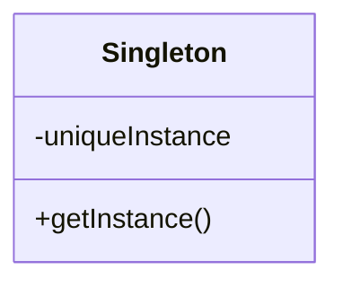

# Capítulo 13: Patrones en el mundo real

> Ahhhh, ya estáis listos para un mundo nuevo y brillante lleno de Patrones de Diseño. Pero, antes de que abráis todas esas nuevas puertas de oportunidad, necesitamos cubrir unos cuantos detalles con los que os vais a encontrar ahí fuera, en el mundo real; sí, las cosas se ponen un poco más complejas de lo que son aquí en Objectville. Venid con nosotros, tenemos una buena guía para echaros una mano con la transición en la siguiente página...

## La guía de Objectville para vivir mejor con patrones de diseño

Por favor, acepta nuestra práctica guía con consejos y trucos para vivir con patrones en el mundo real. En esta guía aprenderás:

- A conocer las demasiado comunes definiciones erróneas sobre lo que es un «patrón de diseño».
- A descubrir esos catálogos de Patrones de Diseño tan chulos y por qué simplemente tienes que conseguirte uno.
- A evitar el ridículo de usar un Patrón de Diseño en el momento equivocado.
- A aprender a mantener los patrones en las clasificaciones a las que pertenecen.
- A ver que descubrir patrones no es cosa solo de gurús; lee nuestro breve «cómo hacerlo» y conviértete también tú en escritor de patrones.
- A estar presente cuando se revele la verdadera identidad del misterioso Grupo de los Cuatro.
- A mantener el pulso con los vecinos: los libros de mesa que todo usuario de patrones debe tener.
- A aprender a entrenar tu mente como un maestro Zen.
- A ganar amigos e influir en otros desarrolladores mejorando tu vocabulario de patrones.

!!! note "Nota al margen"
    Ojo con la lista: esta es la hoja de ruta de todo el capítulo.

## Definición de un patrón de diseño

Apostamos a que después de leer este libro tienes una idea bastante buena de lo que es un patrón. Pero nunca hemos dado realmente una definición de un Patrón de Diseño. Bueno, puede que la definición de uso común te sorprenda un poco:

!!! abstract "Definición"
    Un Patrón es una solución a un problema en un contexto.

Esa no es la definición más reveladora, ¿verdad? Pero no te preocupes, vamos a recorrer cada una de estas partes: contexto, problema y solución:

- **El contexto** es la situación en la que aplica el patrón. Esta debería ser una situación recurrente.
- **El problema** se refiere a la meta que intentas alcanzar en ese contexto, pero también se refiere a cualquier restricción que se produzca en el contexto.
- **La solución** es lo que buscas: un diseño general que cualquiera puede aplicar y que resuelve la meta y el conjunto de restricciones.

Esta es una de esas definiciones que tardan un poco en asentarse, así que tómatela paso a paso. Intenta pensarla así:

!!! info "Otra manera de decirlo"
    «Si te encuentras en un contexto con un problema que tiene una meta que se ve afectada por un conjunto de restricciones, entonces puedes aplicar un diseño que resuelva la meta y las restricciones y dé lugar a una solución.»

Ahora bien, esto parece mucho trabajo solo para averiguar qué es un Patrón de Diseño. Después de todo, ya sabes que un Patrón de Diseño te da una solución a un problema de diseño recurrente y común. ¿Y qué te aporta toda esta formalidad? Bueno, vas a ver que el hecho de tener una forma formal de describir los patrones nos permite crear un catálogo de patrones, que tiene todo tipo de beneficios.

!!! tip "Nota al margen"
    **Ejemplo:** Tienes una colección de objetos. Necesitas recorrer los objetos sin exponer la implementación de la colección. Encapsula la iteración en una clase aparte.

## Un vistazo más de cerca a la definición de un patrón de diseño

!!! note "Nota al margen"
    Ya he estado pensando en la definición de tres partes, y no creo que defina un patrón en absoluto.

Puede que tengas razón; vamos a darle vueltas a esto un poco... Necesitamos un problema, una solución y un contexto:

!!! example "El caso de las llaves encerradas"
    **Problema:** ¿Cómo llego puntual al trabajo?

    **Contexto:** He cerrado las llaves dentro del coche.

    **Solución:** Romper la ventanilla, meterme en el coche, arrancar el motor e ir al trabajo.

Tenemos todos los componentes de la definición: tenemos un problema, que incluye la meta de llegar al trabajo y las restricciones de tiempo, distancia y probablemente algunos otros factores. También tenemos un contexto en el que las llaves del coche son inaccesibles. Y tenemos una solución que nos da acceso a las llaves y resuelve las restricciones de tiempo y de distancia. ¡Ya tenemos que tener un patrón! ¿Verdad?

!!! tip "Nota al margen"
    La próxima vez que alguien te diga que un patrón es una solución a un problema en un contexto, asiente y sonríe. Sabes lo que quiere decir, aunque no sea una definición suficiente para describir lo que es de verdad un Patrón de Diseño.

Nuestro ejemplo sí parece encajar con la definición de Patrón de Diseño, pero no es un verdadero patrón. ¿Por qué? Para empezar, sabemos que un patrón tiene que aplicarse a un problema recurrente. Aunque una persona despistada pueda encerrar las llaves en el coche a menudo, romper la ventanilla del coche no califica como una solución que se pueda aplicar una y otra vez (o al menos no es probable que lo sea si equilibramos la meta con otra restricción: el coste). También falla por otras dos vías: primero, no es fácil tomar esta descripción, dársela a alguien y que la aplique a su propio problema único. Segundo, hemos violado un aspecto importante pero sencillo de un patrón: ¡ni siquiera le hemos dado un nombre! Sin un nombre, el patrón no se convierte en parte de un vocabulario que se pueda compartir con otros desarrolladores. Por suerte, los patrones no se describen ni se documentan como un simple problema, contexto y solución; tenemos formas mucho mejores de describir los patrones y de recogerlos juntos en catálogos de patrones.

!!! info "Notas al margen"
    **Patterns A-I** — el catálogo de patrones de la A a la I.

    **Patterns J-R** — el catálogo de patrones de la J a la R.

    **Patterns S-Z** — el catálogo de patrones de la S a la Z.

!!! question "Preguntas frecuentes"
    **P: ¿Voy a ver descripciones de patrones enunciadas como un problema, un contexto y una solución?**

    R: Las descripciones de patrones, que normalmente encontrarás en los catálogos de patrones, suelen ser algo más reveladoras que eso. Vamos a mirar los catálogos de patrones en detalle dentro de un minuto; describen mucho más sobre la intención y la motivación de un patrón y sobre dónde podría aplicarse, junto con el diseño de la solución y las consecuencias (buenas y malas) de usarla.

    **P: ¿Está bien alterar ligeramente la estructura de un patrón para que encaje con mi diseño? ¿O tendré que ajustarme a la definición estricta?**

    R: Por supuesto que puedes alterarlo. Igual que los principios de diseño, los patrones no pretenden ser leyes ni reglas; son guías que puedes alterar para que se ajusten a tus necesidades. Como ya has visto, muchos ejemplos del mundo real no encajan en los diseños clásicos de patrones. Sin embargo, cuando adaptes patrones, nunca viene mal documentar en qué se diferencia tu patrón del diseño clásico; así, otros desarrolladores podrán reconocer rápidamente los patrones que estás usando y cualquier diferencia entre tu patrón y el patrón clásico.

    **P: ¿Dónde puedo conseguir un catálogo de patrones?**

    R: El primer catálogo de patrones y el más definitivo es *Design Patterns: Elements of Reusable Object-Oriented Software*, de Gamma, Helm, Johnson y Vlissides (Addison Wesley). Este catálogo expone 23 patrones fundamentales. Hablaremos un poco más sobre este libro dentro de unas páginas. Muchos otros catálogos de patrones empiezan a publicarse en distintas áreas de dominio, como el software empresarial, los sistemas concurrentes y los sistemas de negocio.

## Geek Bits: que la fuerza esté contigo

La definición de Patrón de Diseño nos dice que el problema consiste en una meta y un conjunto de restricciones. Los gurús de patrones tienen un término para esto: las llaman fuerzas. ¿Por qué? Bueno, estamos seguros de que ellos tienen sus propias razones, pero si te acuerdas de la película, la fuerza «da forma y controla el Universo». Del mismo modo, las fuerzas de la definición del patrón dan forma y controlan la solución. Solo cuando una solución equilibra ambos lados de la fuerza (el lado luminoso: tu meta, y el lado oscuro: las restricciones) tenemos un patrón útil.

Esta terminología de la «fuerza» puede resultar bastante confusa cuando la ves por primera vez en las discusiones sobre patrones, pero recuerda simplemente que hay dos lados de la fuerza (las metas y las restricciones) y que tienen que equilibrarse o resolverse para crear una solución de patrón. ¡Que la jerga no se interponga en tu camino y que la fuerza esté contigo!

## Usar un catálogo de patrones

!!! note "Nota al margen"
    Ojalá hubiera sabido lo de los catálogos de patrones hace mucho tiempo...

**Frank:** Rellenanos, Jim. Me acabo de iniciar en patrones leyendo unos cuantos artículos sueltos por ahí.

**Jim:** Claro, cada catálogo de patrones toma un conjunto de patrones y describe cada uno en detalle junto con su relación con los otros patrones.

**Joe:** ¿Estás diciendo que hay más de un catálogo de patrones?

**Jim:** Por supuesto; hay catálogos de Patrones de Diseño fundamentales y también hay catálogos de patrones específicos de dominio, como los patrones de computación empresarial o los de computación distribuida.

**Frank:** ¿Qué catálogo estás mirando?

**Jim:** Este es el catálogo clásico de GoF; contiene 23 Patrones de Diseño fundamentales.

**Frank:** ¿GoF?

**Jim:** Exacto, eso es abreviatura de *Gang of Four*, el Grupo de los Cuatro. El Grupo de los Cuatro son los tíos que reunieron el primer catálogo de patrones.

**Joe:** ¿Qué hay en el catálogo?

**Jim:** Hay un conjunto de patrones relacionados. Para cada patrón hay una descripción que sigue una plantilla y que detalla muchos aspectos del patrón. Por ejemplo, cada patrón tiene un nombre.

**Frank:** Vaya, eso es una bomba, ¡un nombre! Imagínate.

**Jim:** Para, Frank; en realidad, el nombre es realmente importante. Cuando tenemos un nombre para un patrón, nos da una forma de hablar del patrón; ya sabes, toda esa movida del vocabulario compartido.

**Frank:** Vale, vale. Estaba bromeando. Continúa, ¿qué más hay?

**Jim:** Bueno, como decía, cada patrón sigue una plantilla. Para cada patrón tenemos un nombre y unas cuantas secciones que nos cuentan más sobre el patrón. Por ejemplo, hay una sección *Intent* que describe qué es el patrón, una especie de definición. Luego están las secciones *Motivation* y *Applicability*, que describen cuándo y dónde se podría usar el patrón.

**Joe:** ¿Y el diseño en sí?

**Jim:** Hay varias secciones que describen el diseño de clases junto con todas las clases que lo componen y cuáles son sus papeles. También hay una sección que describe cómo implementar el patrón y, a menudo, código de ejemplo para mostrártelo.

**Frank:** Suena que se han pensado en todo.

**Jim:** Hay más. También hay ejemplos de dónde se ha usado el patrón en sistemas reales, así como lo que yo creo que es una de las secciones más útiles: cómo se relaciona el patrón con otros patrones.

**Frank:** Ah, o sea que te cuentan cosas como en qué se diferencian los patrones State y Strategy.

**Jim:** ¡Exactamente!

**Joe:** Entonces, Jim, ¿cómo usas de verdad el catálogo? Cuando tienes un problema, ¿vas a pescar una solución en el catálogo?

**Jim:** Primero intento familiarizarme con todos los patrones y con sus relaciones. Luego, cuando necesito un patrón, tengo ya una idea de lo que es. Vuelvo y miro las secciones *Motivation* y *Applicability* para asegurarme de que lo tengo bien. También hay otra sección muy importante: *Consequences*. La reviso para asegurarme de que no habrá algún efecto no intencionado en mi diseño.

**Frank:** Eso tiene sentido. Así que una vez que sabes que el patrón es el correcto, ¿cómo te aproximas a ello para integrarlo en tu diseño e implementarlo?

**Jim:** Ahí es donde entra el diagrama de clases. Primero leo la sección *Structure* para repasar el diagrama y luego la sección *Participants* para asegurarme de que entiendo el papel de cada clase. A partir de ahí, lo integro en mi diseño, haciendo las alteraciones que necesite para que encaje. Después reviso las secciones *Implementation* y *Sample Code* para asegurarme de que conozco las buenas técnicas de implementación y los posibles líos con los que me podría encontrar.

**Joe:** ¡Ya veo cómo un catálogo va a acelerar de verdad mi uso de los patrones!

**Frank:** Totalmente. Jim, ¿puedes guiarnos por una descripción de patrón?

### Ejemplo: una descripción de patrón en un catálogo

```text
SINGLETON
Object Creational

Intent
Et aliquat, velesto ent lore feuis acillao rperci tat, quat nonsequam il ea
at nim nos do enim qui eratio ex ea faci tet, sequis dion utat, volore magnisi.

Motivation
Et aliquat, velesto ent lore feuis acillao rperci tat, quat nonsequam il ea
at nim nos do enim qui eratio ex ea faci tet, sequis dion utat, volore magnisi.
Rud modolore dit laoreet augiam iril el dipis dionsequis dignibh eummy nibh
esequat. Duis nulputem ipisim esecte conullut wissi. Os nisissenim et lumsandre
do con el utpatuero corercipis augue doloreet luptat amet vel iuscidunt digna
feugue dunt num etummy nim dui blaor sequat num vel etue magna augiat.
Aliquis nonse vel exer se minissequis do dolortis ad magnit, sim zzrillut
ipsummo dolorem dignibh euguer sequam ea am quate magnim illam zzrit ad magna
feu facinit delit ut

Applicability
Duis nulputem ipisim esecte conullut wissiEctem ad magna aliqui blamet,
conullandre dolore magna feuis nos alit ad magnim quate modolore vent lut
luptat prat. Dui blaore min ea feuipit ing enit laore magnibh eniat wisissecte
et, suscilla ad mincinci blam dolorpe rcilit irit, conse dolore dolore et,
verci enis enit ip elesequisl ut ad esectem ing ea con eros autem diam nonullu
tpatiss ismodignibh er.

Structure
```



```text
Participants
Duis nulputem ipisim esecte conullut wissiEctem ad magna aliqui blamet,
conullandre dolore magna feuis nos alit ad magnim quate modolore vent lut
luptat prat. Dui blaore min ea feuipit ing enit laore magnibh eniat wisissecte
et, suscilla ad mincinci blam dolorpe rcilit irit, conse dolore dolore et,
verci enis enit ip elesequisl ut ad esectem ing ea con eros autem diam nonullu
tpatiss ismodignibh er

  - A dolore dolore et, verci enis enit ip elesequisl ut ad esectem ing ea con
    eros autem diam nonullu tpatiss ismodignibh er
  - A feuis nos alit ad magnim quate modolore vent lut luptat prat. Dui blaore
    min ea feuipit ing enit laore magnibh eniat wisissec
  - Ad magnim quate modolore vent lut luptat prat. Dui blaore min ea feuipit
    ing enit

Collaborations
  - Feuipit ing enit laore magnibh eniat wisissecte et, suscilla ad mincinci
    blam dolorpe rcilit irit, conse dolore.

Consequences
Duis nulputem ipisim esecte conullut wissiEctem ad magna aliqui blamet,
conullandre:
 1. Dolore dolore et, verci enis enit ip elesequisl ut ad esectem ing ea con
    eros autem diam nonullu tpatiss ismodignibh er.
 2. Modolore vent lut luptat prat. Dui blaore min ea feuipit ing enit laore
    magnibh eniat wisissecte et, suscilla ad mincinci blam dolorpe rcilit
    irit, conse dolore dolore et, verci enis enit ip elesequisl ut ad esectem.
 3. Dolore dolore et, verci enis enit ip elesequisl ut ad esectem ing ea con
    eros autem diam nonullu tpatiss ismodignibh er.
 4. Modolore vent lut luptat prat. Dui blaore min ea feuipit ing enit laore
    magnibh eniat wisissecte et, suscilla ad mincinci blam dolorpe rcilit
    irit, conse dolore dolore et, verci enis enit ip elesequisl ut ad esectem.

Implementation/Sample Code
DuDuis nulputem ipisim esecte conullut wissiEctem ad magna aliqui blamet,
conullandre dolore magna feuis nos alit ad magnim quate modolore vent lut
luptat prat. Dui blaore min ea feuipit ing enit laore magnibh eniat
wisissecte et, suscilla ad mincinci blam dolorpe rcilit irit, conse dolore
dolore et, verci enis enit ip elesequisl ut ad esectem ing ea con eros autem
diam nonullu tpatiss ismodignibh er.
```

```java
public class Singleton {
    private static Singleton uniqueInstance;

    // other useful instance variables here

    private Singleton() {}

    public static synchronized Singleton getInstance() {
        if (uniqueInstance == null) {
            uniqueInstance = new Singleton();
        }
        return uniqueInstance;
    }

    // other useful methods here
}
```

```text
Known Uses
Nos alit ad magnim quate modolore vent lut luptat prat. Dui blaore min ea
feuipit ing enit laore magnibh eniat wisissecte et, suscilla ad mincinci blam
dolorpe rcilit irit, conse dolore dolore et, verci enis enit ip elesequisl ut
ad esectem ing ea con eros autem diam nonullu tpatiss ismodignibh er.

Related Patterns
Dui blaore min ea feuipit ing enit laore magnibh eniat wisissecte et,
suscilla ad mincinci blam dolorpe rcilit irit, conse dolore dolore et, verci
enis enit ip elesequisl ut ad esectem ing ea con eros autem diam nonullu
tpatiss ismodignibh er. alit ad magnim quate modolore vent lut luptat prat.
Elesequisl ut ad esectem ing ea con eros autem diam nonullu tpatiss ismodignibh
er. alit ad magnim quate modolore vent lut luptat prat. Dui blaore min ea
feuipit ing enit laore magnibh eniat wisissecte et, suscilla ad mincinci blam
dolorpe rcilit irit, conse dolore dolore et, verci enis enit ip elesequisl ut
ad esectem ing ea con eros autem diam nonullu tpatiss ismodignibh er.
```

!!! note "Notas al margen"
    - **Nombre:** Todos los patrones de un catálogo empiezan con un nombre. El nombre es una parte vital de un patrón; sin un buen nombre, un patrón no puede convertirse en parte del vocabulario que compartes con otros desarrolladores.
    - **Clasificación o categoría:** Esta es la clasificación o la categoría del patrón. Hablaremos de estas dentro de unas páginas.
    - ***Intent*:** La intención describe qué hace el patrón en una frase breve. También puedes pensar en esto como la definición del patrón (igual que la hemos estado usando en este libro).
    - ***Motivation*:** La motivación te da un escenario concreto que describe el problema y cómo lo resuelve la solución.
    - ***Applicability*:** La aplicabilidad describe situaciones en las que el patrón se puede aplicar.
    - ***Structure*:** La estructura proporciona un diagrama que ilustra las relaciones entre las clases que participan en el patrón.
    - ***Participants*:** Los participantes son las clases y los objetos del diseño. Esta sección describe sus responsabilidades y sus papeles en el patrón.
    - ***Collaborations*:** *Collaborations* nos dice cómo trabajan juntos los participantes en el patrón.
    - ***Consequences*:** Las consecuencias describen los efectos que puede tener usar este patrón: buenos y malos.
    - ***Implementation/Sample Code*:** *Implementation* proporciona las técnicas que necesitas usar al implementar este patrón, y aporta fragmentos de código que pueden echarte una mano con tu implementación.
    - ***Known Uses*:** *Known Uses* describe ejemplos de este patrón encontrados en sistemas reales.
    - ***Related Patterns*:** *Related Patterns* describe la relación entre este patrón y otros.

!!! question "Preguntas frecuentes"
    **P: ¿Es posible crear tus propios Patrones de Diseño? ¿O es algo que solo puede hacer un «gurú de patrones»?**

    R: Primero, recuerda que los patrones se descubren, no se crean. Así que cualquiera puede descubrir un Patrón de Diseño y luego redactar su descripción; sin embargo, no es fácil, y no ocurre ni deprisa ni a menudo. Ser un «escritor de patrones» exige compromiso.

    Deberías pensar primero por qué querrías hacerlo: la mayoría de la gente no redacta patrones; simplemente los usa. No obstante, puede que trabajes en un dominio especializado para el que pienses que nuevos patrones serían útiles, o que te hayas encontrado con una solución para lo que crees que es un problema recurrente, o puede que solo quieras implicarte en la comunidad de patrones y contribuir al cuerpo de trabajo creciente.

    **P: Me apunto; ¿por dónde empiezo?**

    R: Como en cualquier disciplina, cuanto más sepas, mejor. Estudiar los patrones existentes, lo que hacen y cómo se relacionan con otros patrones es crucial. No solo te familiariza con la forma en que se elaboran los patrones, sino que además te evita reinventar la rueda. A partir de ahí querrás empezar a escribir tus patrones en papel, para poder comunicárselos a otros desarrolladores; vamos a hablar más en un rato sobre cómo comunicar tus patrones. Si te interesa de verdad, querrás leer la sección que sigue a estas preguntas.

    **P: ¿Cómo sé cuándo tengo realmente un patrón?**

    R: Esa es una muy buena pregunta: no tienes un patrón hasta que otros lo han usado y han comprobado que funciona. En general, no tienes un patrón hasta que pasa la «Regla de los Tres». Esta regla dice que un patrón solo puede ser llamado patrón si se ha aplicado en una solución del mundo real al menos tres veces.

!!! tip "Nota al margen"
    A ritmo de «So you wanna be a Rock'n'Roll Star»:

    *So you wanna be a design patterns star?*
    Well, listen now to what I tell.
    Get yourself a patterns catalog,
    Then take some time and learn it well.
    And when you've got your description right,
    And three developers agree without a fight,
    Then you'll know it's a pattern alright.

## Así que quieres ser escritor de patrones de diseño

**Haz los deberes.** Necesitas manejar bien los patrones existentes antes de poder crear uno nuevo. La mayoría de los patrones que parecen nuevos son, de hecho, solo variantes de patrones existentes. Estudiando los patrones, mejoras en el reconocimiento de los mismos y aprendes a relacionarlos con otros patrones.

**Tómate tu tiempo para reflexionar y evaluar.** Tu experiencia (los problemas que has encontrado y las soluciones que has usado) es donde nacen las ideas para los patrones. Así que tómate un tiempo para reflexionar sobre tus experiencias y rebúscales diseños novedosos que recurran. Recuerda que la mayoría de los diseños son variaciones de patrones existentes, y no patrones nuevos. Y cuando encuentres algo que parece un patrón nuevo, puede que su aplicabilidad sea demasiado estrecha para que califique como un patrón real.

**Apunta tus ideas en papel de una forma que otros puedan entender.** Localizar patrones nuevos no sirve de mucho si otros no pueden aprovechar lo que has encontrado; necesitas documentar tus patrones candidatos para que otros puedan leerlos, entenderlos, aplicarlos a su propia solución y devolverte luego sus comentarios. Por suerte, no necesitas inventar tu propio método para documentar patrones. Como ya has visto con la plantilla de GoF, ya se ha pensado mucho en cómo describir los patrones y sus características.

**Haz que otros prueben tus patrones; después refina y refina algo más.** No esperes acertar con tu patrón a la primera. Piensa en tu patrón como en un trabajo en curso que irá mejorando con el tiempo. Haz que otros desarrolladores revisen tu patrón candidato, que lo prueben y que te den sus comentarios. Incorpora esos comentarios a tu descripción y vuelve a intentarlo. Tu descripción nunca será perfecta, pero en algún momento debería ser lo bastante sólida como para que otros desarrolladores puedan leerla y entenderla.

**No olvides la Regla de los Tres.** Recuerda: mientras tu patrón no se haya aplicado con éxito en tres soluciones del mundo real, no puede calificar como patrón. Esa es otra buena razón para poner tu patrón en manos de otros, para que lo prueben, te den comentarios y te permitan converger en un patrón que funcione.

!!! tip "Nota al margen"
    Usa una de las plantillas de patrones existentes para definir tu patrón. Se ha pensado mucho en estas plantillas y los demás usuarios de patrones reconocerán el formato.

```text
Name
Intent
Motivation
Applicability
Structure
Participants
Collaborations
...
```

!!! exercise "Empareja cada patrón con su descripción"
    Une cada patrón con su descripción:

    | Patrón | Descripción |
    | --- | --- |
    | Decorator | Envuelve un objeto y le proporciona una interfaz diferente. |
    | State | Las subclases deciden cómo implementar los pasos de un algoritmo. |
    | Iterator | Las subclases deciden qué clases concretas crear. |
    | Facade | Garantiza que se cree uno y solo un objeto. |
    | Strategy | Encapsula comportamientos intercambiables y usa delegación para decidir cuál usar. |
    | Proxy | Los clientes tratan de forma uniforme a las colecciones de objetos y a los objetos individuales. |
    | Factory Method | Encapsula comportamientos basados en el estado y usa delegación para cambiar entre comportamientos. |
    | Adapter | Proporciona una forma de recorrer una colección de objetos sin exponer su implementación. |
    | Observer | Simplifica la interfaz de un conjunto de clases. |
    | Template Method | Envuelve un objeto para proporcionarle un comportamiento nuevo. |
    | Composite | Permite a un cliente crear familias de objetos sin especificar sus clases concretas. |
    | Singleton | Permite que los objetos sean notificados cuando cambia el estado. |
    | Abstract Factory | Envuelve un objeto para controlar el acceso a él. |
    | Command | Encapsula una petición como un objeto. |

## Organizar los patrones de diseño

A medida que crece el número de Patrones de Diseño descubiertos, tiene sentido particionarlos en clasificaciones para poder organizarlos, reducir nuestras búsquedas a un subconjunto de todos los Patrones de Diseño y hacer comparaciones dentro de un grupo de patrones.

En la mayoría de los catálogos encontrarás los patrones agrupados según uno de unos pocos esquemas de clasificación. El esquema más conocido fue el que usó el primer catálogo de patrones, y particiona los patrones en tres categorías distintas según su propósito: de creación, de comportamiento y estructurales.

| Categoría | En qué consiste |
| --- | --- |
| **Creational** | Los patrones de creación implican la instanciación de objetos y todos ellos proporcionan una forma de desacoplar al cliente de los objetos que necesita instanciar. |
| **Behavioral** | Cualquier patrón que sea un patrón de comportamiento se ocupa de cómo interactúan las clases y los objetos y de cómo se distribuye la responsabilidad. |
| **Structural** | Los patrones estructurales te permiten componer clases u objetos en estructuras mayores. |

!!! exercise "¡Vamos a organizarlos!"
    Lee la descripción de cada categoría y mira si puedes acorralar estos patrones en sus categorías correctas. Esto es ¡difícil! Pero haz tu mejor esfuerzo y luego comprueba las respuestas en la página siguiente.

    Observer · Abstract Factory · Composite · Strategy · Decorator · Adapter · State · Singleton · Factory Method · Template Method · Proxy · Command

!!! tip "Nota al margen"
    Cada uno de estos patrones pertenece a una de esas categorías.

## Categorías de patrones

Aquí tienes la agrupación de los patrones por categorías. Probablemente te resultó difícil el ejercicio, porque muchos de los patrones podrían encajar en más de una categoría. No te preocupes, todo el mundo tiene problemas para averiguar las categorías correctas de los patrones.

| Creational | Behavioral | Structural |
| --- | --- | --- |
| Singleton | Mediator | Proxy |
| Prototype | Visitor | Decorator |
| Builder | Template Method | Facade |
| Abstract Factory | Iterator | Composite |
| Factory Method | Command | Flyweight |
| | Memento | Bridge |
| | Interpreter | Adapter |
| | Observer | |
| | Chain of Responsibility | |
| | State | |
| | Strategy | |

!!! tip "Nota al margen"
    Tenemos unos cuantos patrones (en gris) que todavía no has visto. Encontrarás una vista de conjunto de estos patrones en el apéndice.

Los patrones se clasifican a menudo por un segundo atributo: si el patrón se ocupa de clases o de objetos:

| Tipo | En qué consiste |
| --- | --- |
| **Class Patterns** | Los patrones de clase describen cómo se definen las relaciones entre clases mediante herencia. Las relaciones en los patrones de clase se establecen en tiempo de compilación. |
| **Object Patterns** | Los patrones de objeto describen relaciones entre objetos y se definen principalmente por composición. Las relaciones en los patrones de objeto se crean normalmente en tiempo de ejecución y son más dinámicas y flexibles. |

| Class | Object |
| --- | --- |
| Template Method | Abstract Factory |
| Factory Method | Builder |
| Adapter | Composite |
| Interpreter | Decorator |
| Chain of Responsibility | Facade |
| Bridge | Strategy |
| Proxy | Mediator |
| | Flyweight |
| | Prototype |
| | Command |
| | Iterator |
| | Memento |
| | Observer |
| | State |
| | Singleton |

!!! tip "Nota al margen"
    ¡Fíjate en que hay muchos más patrones de objeto que patrones de clase!

!!! question "Preguntas frecuentes"
    **P: ¿Son estos los únicos esquemas de clasificación?**

    R: No, se han propuesto otros esquemas. Algunos otros esquemas parten de las tres categorías y luego añaden subcategorías, como los «patrones de desacoplamiento». Querrás familiarizarte con los esquemas más comunes para organizar patrones, pero siéntete también libre de crear los tuyos propios, si te ayudan a entender mejor los patrones.

    **P: ¿Organizar los patrones en categorías te ayuda realmente a recordarlos?**

    R: Seguro que te da un marco para poder compararlos. Pero mucha gente se confunde con las categorías de creación, estructurales y de comportamiento; a menudo un patrón parece encajar en más de una categoría. Lo más importante es conocer las tres categorías y luego añadir subcategorías, como los «patrones de desacoplamiento». Cuando las categorías te ayuden, ¡úsalas!

    **P: ¿Por qué está el patrón Decorator en la categoría estructural? ¡Yo habría pensado que es un patrón de comportamiento; después de todo, añade comportamiento!**

    R: ¡Sí, muchos desarrolladores dicen eso! Aquí está el razonamiento que hay detrás de la clasificación del Grupo de los Cuatro: los patrones estructurales describen cómo se componen las clases y los objetos para crear estructuras nuevas o funcionalidad nueva. El patrón Decorator te permite componer objetos envolviendo un objeto con otro para proporcionar funcionalidad nueva. Así que el foco está en cómo compones los objetos dinámicamente para ganar funcionalidad, y no en la comunicación e interconexión entre objetos, que es el propósito de los patrones de comportamiento. Pero recuerda: la intención de estos patrones es diferente, y esa suele ser la clave para entender a qué categoría pertenece un patrón.

### Guru y alumno...

**Guru:** Alumno, tienes cara de preocupado.

**Alumno:** Sí, acabo de aprender lo de la clasificación de patrones y estoy confundido.

**Guru:** Continúa...

**Alumno:** Después de aprender mucho sobre patrones, me acaban de decir que cada patrón encaja en una de tres clasificaciones: estructural, de comportamiento o de creación. ¿Por qué necesitamos estas clasificaciones?

**Guru:** Siempre que tenemos una colección grande de cualquier cosa, encontramos naturalmente categorías donde encajar esas cosas. Nos ayuda a pensar en los elementos a un nivel más abstracto.

**Alumno:** Guru, ¿puede darme un ejemplo?

**Guru:** Por supuesto. Cojamos los automóviles; hay muchos modelos distintos de automóviles y naturalmente los metemos en categorías como coches económicos, coches deportivos, todoterrenos, camiones y coches de lujo.

**Guru:** Parece que no te lo esperabas; ¿esto no tiene sentido?

**Alumno:** Guru, tiene mucho sentido, pero me sorprende que sepa tanto de coches.

**Guru:** No todo se puede relacionar con flores de loto o boles de arroz. Ahora, ¿puedo continuar?

**Alumno:** Sí, sí, lo siento, por favor continúa.

**Guru:** Una vez que tienes clasificaciones o categorías, puedes hablar fácilmente de las distintas agrupaciones: «Si vas a hacer la ruta de montaña desde Silicon Valley hasta Santa Cruz, un coche deportivo con buena respuesta es la mejor opción». O bien: «Con la situación del petróleo empeorando, lo que quieres de verdad es comprar un coche económico; son más eficientes en combustible».

**Alumno:** Así que teniendo categorías, podemos hablar de un conjunto de patrones como de un grupo. Puede que sepamos que necesitamos un patrón de creación, sin saber exactamente cuál, pero aun así podemos hablar de patrones de creación.

**Guru:** Sí, y además nos da una forma de comparar a un miembro con el resto de la categoría. Por ejemplo: «El Mini es de largo el coche compacto más elegante», o para reducir nuestra búsqueda: «Necesito un coche eficiente en combustible».

**Alumno:** Entiendo. Así que podría decir que el patrón Adapter es el mejor patrón estructural para cambiar la interfaz de un objeto.

**Guru:** Sí. También podemos usar las categorías para un propósito más: lanzarnos a territorio nuevo. Por ejemplo: «De verdad queremos entregar un coche deportivo con prestaciones Ferrari a precios Honda».

**Alumno:** Eso suena como una trampa mortal.

**Guru:** Lo siento, no te he oído, alumno.

**Alumno:** Eh, he dicho «Ya lo veo».

**Alumno:** Así que las categorías nos dan una forma de pensar en cómo se relacionan los grupos de patrones y cómo se relacionan entre sí los patrones de un grupo. También nos dan una forma de extrapolar a patrones nuevos. Pero ¿por qué hay tres categorías y no cuatro o cinco?

**Guru:** Ah, igual que las estrellas del cielo nocturno, hay tantas categorías como quieras ver. Tres es un número cómodo y un número con el que mucha gente ha decidido que queda bien agrupar los patrones. Pero otros han propuesto cuatro, cinco o más.

## Pensar en patrones

Contextos, restricciones, fuerzas, catálogos, clasificaciones... vaya, esto empieza a sonar muy académico. Vale, todo eso es importante y el conocimiento es poder. Pero, seamos realistas: si entiendes la parte académica y no tienes la experiencia ni la práctica de usar patrones, no te va a marcar mucha diferencia en tu vida.

Aquí tienes una guía rápida para empezar a pensar en patrones. ¿Qué queremos decir con eso? Queremos decir ser capaz de mirar un diseño y ver dónde encajan los patrones de manera natural y dónde no.

### Tu cerebro y los patrones

**Manténlo simple (KISS).** Ante todo, cuando diseñes, resuelve las cosas de la manera más simple posible. Tu objetivo debería ser la simplicidad, no «¿cómo puedo aplicar un patrón a este problema?». No te sientas como un desarrollador sofisticado si no usas un patrón para resolver un problema. Otros desarrolladores apreciarán y admirarán la simplicidad de tu diseño. Dicho esto, a veces la mejor forma de mantener tu diseño simple y flexible es usar un patrón.

**Los patrones de diseño no son una bala mágica; de hecho, ni siquiera son una bala.** Como ya sabes, los patrones son soluciones generales a problemas recurrentes. Los patrones también tienen la ventaja de estar muy contrastados por muchos desarrolladores. Así que, cuando veas la necesidad de uno, puedes dormir tranquilo sabiendo que muchos desarrolladores han estado ahí antes y han resuelto el problema usando técnicas similares. Sin embargo, los patrones no son una bala mágica. No puedes enchufar uno, compilar y luego irte a comer pronto. Para usar patrones, también tienes que pensar las consecuencias para el resto de tu diseño.

### Sabrás que necesitas un patrón cuando...

Ah... la pregunta más importante: ¿cuándo usas un patrón? A medida que te acercas a tu diseño, introduce un patrón cuando estés seguro de que aborda un problema de tu diseño. Si puede que una solución más sencilla funcione, considera esa opción antes de comprometerte a usar un patrón.

Saber cuándo un patrón aplica es donde entran tu experiencia y tu conocimiento. Una vez que estés seguro de que una solución simple no va a satisfacer tus necesidades, deberías considerar el problema junto con el conjunto de restricciones bajo el cual la solución tendrá que operar; te ayudarán a casar tu problema con un patrón. Si tienes un buen conocimiento de los patrones, puede que conozcas un patrón que encaje bien. Si no, repasa los patrones que parecen que podrían resolver el problema. Las secciones *Intent* y *Applicability* de los catálogos de patrones son particularmente útiles para esto. Una vez que hayas encontrado un patrón que parece encajar bien, asegúrate de que tiene un conjunto de consecuencias con el que puedas vivir y estudia su efecto sobre el resto de tu diseño. Si todo parece bien, ¡adelante!

Hay una situación en la que querrás usar un patrón aunque una solución más simple funcionaría: cuando esperas que algunos aspectos de tu sistema varíen. Como hemos visto, identificar las áreas de cambio en tu diseño suele ser buena señal de que hace falta un patrón. Solo asegúrate de que estás añadiendo patrones para manejar el cambio práctico que probablemente ocurrirá, no el cambio hipotético que podría ocurrir.

El momento del diseño no es el único momento en el que quieres considerar la introducción de patrones; también querrás hacerlo en el momento del refactoring.

### La hora del refactoring es la hora de los patrones

El refactoring es el proceso de hacer cambios en tu código para mejorar la forma en que está organizado. El objetivo es mejorar su estructura, no cambiar su comportamiento. Este es un gran momento para volver a examinar tu diseño y ver si podría estar mejor estructurado con patrones. Por ejemplo, un código lleno de sentencias condicionales puede señalar la necesidad del patrón State. O puede que sea el momento de limpiar las dependencias concretas con Factory. Hay libros enteros escritos sobre el tema del refactoring con patrones, y a medida que tus habilidades crezcan, querrás estudiar esta área más a fondo.

### Saca lo que de verdad no necesitas. No temas retirar un Patrón de Diseño de tu diseño

Nadie habla jamás de cuándo retirar un patrón. ¡Dirías que es una blasfemia! Nah, aquí todos somos adultos; podemos con ello.

!!! tip "Nota al margen"
    Centra tu pensamiento en el diseño, no en los patrones. Usa patrones cuando haya una necesidad natural de ellos. Si algo más sencillo funciona, entonces úsalo.

Así que, ¿cuándo retiras un patrón? Cuando tu sistema se ha vuelto complejo y la flexibilidad que planificaste no hace falta. Dicho de otro modo, cuando una solución más sencilla sin el patrón sería mejor.

### Si no lo necesitas ahora, no lo hagas ahora

Los Patrones de Diseño son potentes, y es fácil ver toda clase de formas en que se pueden usar en tus diseños actuales. Los desarrolladores caen por naturaleza en la tentación de crear arquitecturas bellas que estén listas para el cambio venga de donde venga. Resiste la tentación. Si hoy tienes una necesidad práctica de soportar el cambio en un diseño, adelante, usa un patrón para manejar ese cambio. Sin embargo, si el motivo es solo hipotético, no añadas el patrón; solo añadirá complejidad a tu sistema, ¡y puede que nunca lo necesites!

## Tu mente y los patrones

**La mente principiante** usa patrones en todas partes. Esto está bien: el principiante adquiere mucha experiencia y práctica en el uso de patrones. El principiante también piensa: «Cuantos más patrones use, mejor será el diseño». El principiante aprenderá que no es así, que todos los diseños deberían ser lo más simples posible. La complejidad y los patrones solo deberían usarse donde se necesitan para una extensibilidad práctica.

> «Necesito un patrón para Hola Mundo.»

**La mente intermedia** empieza a ver dónde se necesitan los patrones y dónde no. La mente intermedia todavía intenta encajar demasiados patrones cuadrados en agujeros redondos, pero también empieza a ver que los patrones se pueden adaptar para encajar en situaciones donde el patrón canónico no encaja.

> «Puede que necesite un Singleton aquí.»

**La mente Zen** es capaz de ver los patrones allí donde encajan de forma natural. La mente Zen no está obsesionada con usar patrones; al contrario, busca soluciones simples que resuelven mejor el problema. La mente Zen piensa en términos de principios de objetos y sus compensaciones. Cuando surge de forma natural la necesidad de un patrón, la mente Zen lo aplica sabiendo perfectamente que puede requerir adaptación. La mente Zen también ve relaciones con patrones similares y comprende las sutilezas de las diferencias en la intención de patrones relacionados.

> «Este es un sitio natural para un Decorator.»

!!! tip "Nota al margen"
    La mente Zen es también una mente principiante: no deja que todo ese conocimiento sobre patrones influya demasiado en las decisiones de diseño.

!!! warning "AVISO"
    El uso excesivo de patrones de diseño puede llevar a un código que está claramente sobrediseñado. Ve siempre con la solución más sencilla que haga el trabajo e introduce patrones donde surja la necesidad.

!!! note "Nota al margen"
    Espera un momento; ¿me he leído todo este libro y ahora me estás diciendo que NO use patrones?

### Por supuesto, ¡quieremos que uses patrones de diseño!

Pero queremos que seas un buen diseñador OO incluso por encima de eso.

Cuando una solución de diseño pide un patrón, obtienes el beneficio de usar una solución que ha sido contrastada en el tiempo por muchos desarrolladores. También estás usando una solución que está bien documentada y que otros desarrolladores van a reconocer (ya sabes, toda esa movida del vocabulario compartido).

Sin embargo, cuando usas Patrones de Diseño, también puede haber una contrapartida. Los Patrones de Diseño suelen introducir clases y objetos adicionales, y por tanto pueden aumentar la complejidad de tus diseños. Los Patrones de Diseño también pueden añadir más capas a tu diseño, lo que no solo añade complejidad, sino también ineficiencia.

Además, usar un Patrón de Diseño a veces puede ser sencillamente excesivo. Muchas veces puedes recurrir a tus principios de diseño y encontrar una solución mucho más sencilla para resolver el mismo problema. Si eso ocurre, no luches contra ello. Usa la solución más sencilla.

No te dejes desanimar, eso sí. Cuando un Patrón de Diseño es la herramienta adecuada para el trabajo, las ventajas son muchas.

## No olvides el poder del vocabulario compartido

Hemos pasado tanto tiempo en este libro hablando de los clavos y tornillos del OO que es fácil olvidar el lado humano de los Patrones de Diseño: no solo ayudan a llenar tu cerebro con soluciones, sino que también te dan un vocabulario compartido con otros desarrolladores. No subestimes el poder de un vocabulario compartido; es uno de los mayores beneficios de los Patrones de Diseño.

Solo piensa que algo ha cambiado desde la última vez que hablamos de vocabularios compartidos; ¡ahora ya has construido un vocabulario propio bastante considerable!

Sin mencionar que también has aprendido un conjunto completo de principios de diseño OO a partir de los cuales puedes entender fácilmente la motivación y el funcionamiento de cualquier patrón nuevo que te encuentres.

Ahora que tienes los fundamentos de los Patrones de Diseño bajo control, es hora de que salgas a extender la palabra entre los demás. ¿Por qué? Porque cuando tus compañeros desarrolladores conocen los patrones y también usan un vocabulario compartido, eso conduce a mejores diseños y mejor comunicación y, mejor de todo, te ahorrará mucho tiempo que podrás dedicar a cosas mucho más guais.

!!! tip "Nota al margen"
    Así que creé esta clase de difusión. Lleva el seguimiento de todos los objetos que la escuchan y cada vez que llega un dato nuevo envía un mensaje a cada oyente. Lo mejor de todo es que los oyentes pueden unirse a la difusión en cualquier momento o incluso darse de baja. Y la propia clase de difusión no sabe nada de los oyentes; cualquier objeto que implemente la interfaz adecuada puede registrarse.

    *Incompleto* · *Lento* · *Confuso*

### Las cinco mejores formas de compartir tu vocabulario

1. **En reuniones de diseño:** Cuando te reencuentras con tu equipo para discutir un diseño de software, usa los patrones de diseño para ayudaros a quedar «en el diseño» más tiempo. Discutir los diseños desde la perspectiva de los Patrones de Diseño y los principios OO evita que tu equipo se atasque en los detalles de implementación y evita muchos malentendidos.
2. **Con otros desarrolladores:** Usa los patrones en tus discusiones con otros desarrolladores. Esto ayuda a otros desarrolladores a conocer patrones nuevos y construye una comunidad. Lo mejor de compartir lo que has aprendido es esa sensación genial cuando alguien más «lo pilla».
3. **En la documentación de arquitectura:** Cuando escribas documentación de arquitectura, usar patrones reducirá la cantidad de documentación que necesitas escribir y dará a quien la lee una imagen más clara del diseño.
4. **En los comentarios del código y en las convenciones de nomenclatura:** Cuando escribas código, identifica claramente los patrones que estás usando en los comentarios. Además, elige nombres de clases y de métodos que revelen los patrones que hay por debajo. Otros desarrolladores que tengan que leer tu código te lo agradecerán por poder entender rápidamente tu implementación.
5. **A grupos de desarrolladores interesados:** Comparte tu conocimiento. Muchos desarrolladores han oído hablar de patrones pero no tienen una buena comprensión de lo que son. Ofrécete a dar un «almuerzo con bolsa marrón» sobre patrones o una charla en tu grupo de usuarios local.

!!! info "Notas al margen"
    *Sucinto* · *Preciso* · *Completo*

    Observer

## Recorriendo Objectville con el Grupo de los Cuatro

!!! note "Nota al margen"
    GoF lanzó el movimiento de los patrones de software, pero muchos otros han hecho contribuciones significativas, entre ellos Ward Cunningham, Kent Beck, Jim Coplien, Grady Booch, Bruce Anderson, Richard Gabriel, Doug Lea, Peter Coad y Doug Schmidt, por nombrar solo unos cuantos.

No encontrarás a los Jets ni a los Sharks paseando por Objectville, pero sí encontrarás al Grupo de los Cuatro. Como probablemente hayas notado, no puedes llegar muy lejos en el Mundo de los Patrones sin toparte con ellos. Así que, ¿quién es esta misteriosa pandilla?

Dicho de manera sencilla, «los GoF», que incluyen a Erich Gamma, Richard Helm, Ralph Johnson y John Vlissides, son el grupo de tíos que reunieron el primer catálogo de patrones y que, de paso, provocaron un movimiento entero en el campo del software!

¿Cómo se cogió ese nombre? Nadie lo sabe con seguridad; es simplemente un nombre que se quedó pegado. Pero piénsalo: si vas a tener un elemento de «pandilla» dando vueltas por Objectville, ¿se te ocurren unos tíos mejor? De hecho, incluso han aceptado visitarnos...

!!! tip "Tour de patrones por Objectville"
    - Hoy hay más patrones que en el libro de GoF; infórmate de ellos también.
    - Apunta a una extensibilidad práctica. No proporciones generalidad hipotética; sé extensible de maneras que importen.
    - Ve a por la simplicidad y no te emociones demasiado. Si puedes llegar a una solución más sencilla sin usar un patrón, ve a por ella.
    - Los patrones son herramientas, no reglas; hay que ajustarlos y adaptarlos a tu problema.

    **Richard Helm** · **Ralph Johnson** · **John Vlissides\*** · **Erich Gamma**

    \*John Vlissides falleció en 2005. Una gran pérdida para la comunidad de los Patrones de Diseño.

## Tu viaje apenas acaba de empezar...

Ahora que dominas los Patrones de Diseño y estás listo para profundizar, tenemos tres textos definitivos que necesitas añadir a tu estantería...

### El texto definitivo sobre patrones de diseño

Este es el libro que inició todo el campo de los Patrones de Diseño cuando se publicó en 1995. Aquí encontrarás todos los patrones fundamentales. De hecho, este libro es la base del conjunto de patrones que usamos en *Head First Design Patterns*. No te creas que este libro sea la última palabra sobre Patrones de Diseño (el campo ha crecido muchísimo desde su publicación), pero sí es el primero y el más definitivo. Comprar una copia de *Design Patterns* es una gran manera de empezar a explorar patrones después de Head First.

!!! tip "Notas al margen"
    Los autores de *Design Patterns* son conocidos cariñosamente como el «Grupo de los Cuatro», o GoF para abreviar.

    Christopher Alexander inventó los patrones, lo que inspiró aplicar soluciones similares al software.

### Los textos definitivos sobre patrones

Los patrones no empezaron con GoF; empezaron con Christopher Alexander, profesor de arquitectura en Berkeley; sí, Alexander es arquitecto, no informático. Alexander inventó patrones para construir arquitecturas vivas (como casas, pueblos y ciudades).

La próxima vez que tengas ganas de algo de lectura profunda y divertida, coge *The Timeless Way of Building* y *A Pattern Language*. Verás los verdaderos orígenes de los Patrones de Diseño y reconocerás las analogías directas entre crear «arquitectura viva» y software flexible y extensible.

Así que coge una taza de café de Starbuzz, siéntate y disfruta...

### Otros recursos sobre patrones de diseño

Vas a encontrar que hay una comunidad de usuarios y escritores de patrones vibrantemente viva y acogedora, y están alegres de que te unas a ellos. Aquí tienes algunos recursos para empezar...

### Sitios web

!!! note "The Portland Patterns Repository"
    El Portland Patterns Repository, mantenido por Ward Cunningham, es un wiki dedicado a todo lo relacionado con los patrones. Encontrarás hilos de debate sobre cualquier tema en el que puedas pensar relacionado con los patrones y los sistemas OO.

    `c2.com/cgi/wiki?WelcomeVisitors`

!!! note "The Hillside Group"
    El Hillside Group fomenta prácticas comunes de programación y diseño y ofrece un recurso central para el trabajo con patrones. El sitio incluye información sobre muchos recursos relacionados con los patrones, como artículos, libros, listas de correo y herramientas.

    `hillside.net`

!!! note "O'Reilly Online Learning"
    O'Reilly Online Learning ofrece libros de patrones de diseño en línea, cursos y docencia en vivo. También encontrarás un curso intensivo (*bootcamp*) de patrones de diseño basado en este libro.

    `oreilly.com`

### Conferencias y talleres

Si te apetece interactuar con la comunidad de patrones, no dejes de echar un vistazo a las muchas conferencias y talleres relacionados con los patrones. El sitio de Hillside mantiene una lista completa. Echa un vistazo a *Pattern Languages of Programs* (PLoP) y a la *ACM Conference on Object-Oriented Systems, Languages and Applications* (OOPSLA), que ahora forma parte de la conferencia SPLASH.

### Otros recursos

Estaríamos siendo negligentes si no mencionáramos Google, Stack Overflow, Quora y muchos otros sitios y servicios como buenos lugares para hacer preguntas, encontrar respuestas y discutir sobre patrones de diseño. Como con cualquier cosa de la web, comprueba siempre dos veces la información que recibes.

## El zoológico de los patrones

Como acabas de ver, los patrones no empezaron en el software; empezaron con la arquitectura de edificios y pueblos. De hecho, el concepto de patrón se puede aplicar en muchos dominios diferentes. Date una vuelta por el Zoológico de los Patrones para ver unos cuantos...

!!! example "Patrones de arquitectura"
    **Los patrones de arquitectura** se usan para crear la arquitectura viva y vibrante de edificios, pueblos y ciudades. Aquí es donde los patrones obtuvieron su origen.

    *Habitat: se encuentran en edificios en los que te gusta vivir, mirar y visitar.*

!!! example "Patrones de aplicación"
    **Los patrones de aplicación** son patrones para crear la arquitectura de sistemas. Muchas arquitecturas multinivel caen en esta categoría.

    *Habitat: se ven colgados por ahí en arquitecturas de tres niveles, sistemas cliente-servidor y la web.*

    *Field note: se sabe que MVC ha pasado por ser un patrón de aplicación.*

!!! example "Patrones específicos de dominio"
    **Los patrones específicos de dominio** son patrones que tratan de problemas en dominios concretos, como los sistemas concurrentes o los sistemas de tiempo real.

    *Habitat: se ven rondando por las salas de juntas corporativas y las reuniones de gestión de proyectos.*

!!! example "Patrones de proceso de negocio"
    **Los patrones de proceso de negocio** describen la interacción entre empresas, clientes y datos, y se pueden aplicar a problemas como cómo tomar y comunicar decisiones de forma eficaz.

!!! example "Patrones organizativos"
    **Los patrones organizativos** describen las estructuras y prácticas de las organizaciones humanas. La mayoría de los esfuerzos hasta la fecha se han centrado en organizaciones que producen y/o soportan software.

    *Habitat: equipo de desarrollo, equipo de soporte al cliente.*

!!! example "Patrones de diseño de interfaces de usuario"
    **Los patrones de diseño de interfaces de usuario** abordan los problemas de cómo diseñar programas de software interactivos.

    *Habitat: se ven en las proximidades de los diseñadores de videojuegos, los constructores de interfaces gráficas y los productores.*

!!! question "Notas de campo"
    Por favor, añadid aquí vuestras observaciones sobre los dominios de los patrones:

    ________________________________________________________________

## Aniquilar el mal con los antipatrones

El Universo no estaría completo si tuviéramos patrones y ningún antipatrón, ¿verdad?

Si un Patrón de Diseño te da una solución general a un problema recurrente en un contexto concreto, entonces, ¿qué te da un antipatrón?

!!! abstract "Definición"
    Un Antipatrón te indica cómo pasar de un problema a una solución MALA.

Probablemente te estés preguntando: «¿Por qué demonios iba alguien a perder el tiempo documentando soluciones malas?».

Piénsalo así: si hay una solución mala recurrente a un problema común, entonces documentándola podemos evitar que otros desarrolladores cometan el mismo error. Después de todo, ¡evitar soluciones malas puede ser tan valioso como encontrar buenas!

Veamos los elementos de un antipatrón:

!!! note "Un antipatrón te dice por qué una mala solución resulta atractiva"
    Un antipatrón te dice por qué una mala solución es atractiva. Seamos realistas: nadie elegiría una mala solución si no hubiera algo en ella que resultara atractivo a primera vista. Uno de los mayores trabajos del antipatrón es avisarte del aspecto seductor de la solución.

!!! note "Un antipatrón te dice por qué esa solución a largo plazo es mala"
    Un antipatrón te dice por qué esa solución a largo plazo es mala. Para entender por qué es un antipatrón, tienes que entender cómo va a tener un efecto negativo más adelante. El antipatrón describe dónde te vas a meter en problemas al usar la solución.

!!! note "Un antipatrón sugiere otros patrones aplicables que pueden dar buenas soluciones"
    Un antipatrón sugiere otros patrones aplicables que pueden proporcionar buenas soluciones. Para ser realmente útil, un antipatrón tiene que señalarte en la dirección correcta; debería sugerir otras posibilidades que puedan llevar a buenas soluciones.

!!! tip "Nota al margen"
    Un antipatrón siempre parece una buena solución, pero luego resulta ser una mala solución cuando se aplica.

    Al documentar los antipatrones ayudamos a otros a reconocer las soluciones malas antes de que las implementen.

    Como los patrones, hay muchos tipos de antipatrones, incluidos antipatrones de desarrollo, OO, organizativos y específicos de dominio.

Veamos un antipatrón.

### Ejemplo: un antipatrón de desarrollo de software

!!! tip "Nota al margen"
    Aquí tienes un ejemplo de un antipatrón de desarrollo de software. Justo como un Patrón de Diseño, un antipatrón tiene un nombre para poder crear un vocabulario compartido. El problema y el contexto, igual que en la descripción de un Patrón de Diseño. Te dice por qué la solución es atractiva. La mala, aunque atractiva, solución. Cómo llegar a una buena solución. Ejemplo de dónde se ha observado este antipatrón.

!!! example "Antipatrón"
    **Nombre:** Golden Hammer

    **Problema:** Necesitas elegir tecnologías para tu desarrollo y crees que exactamente una tecnología debe dominar la arquitectura.

    **Contexto:** Necesitas desarrollar un sistema nuevo o una pieza de software que no encaja bien con la tecnología con la que está familiarizado el equipo de desarrollo.

    **Fuerzas:**

    - El equipo de desarrollo está comprometido con la tecnología que conoce.
    - El equipo de desarrollo no está familiarizado con otras tecnologías.
    - Las tecnologías desconocidas se consideran arriesgadas.
    - Es fácil planificar y estimar el desarrollo usando la tecnología conocida.

    **Solución supuesta:** Usa la tecnología conocida de todos modos. La tecnología se aplica obsesivamente a muchos problemas, incluidos aquellos donde resulta claramente inapropiada.

    **Solución refactorizada:** Amplía los conocimientos de los desarrolladores mediante educación, formación y grupos de estudio de libros que exponen a los desarrolladores a nuevas soluciones.

    **Ejemplos:** Las empresas web siguen usando y manteniendo sus sistemas de caché internos desarrollados en casa cuando ya hay alternativas de código abierto en uso.

!!! note "Nota al pie"
    Adaptado del wiki del Portland Pattern Repository en `https://wiki.c2.com/?WelcomeVisitors`, donde encontrarás muchos antipatrones y discusiones.

## Herramientas para tu caja de herramientas de diseño

Has llegado a ese punto en el que nos has dejado atrás. Ahora es el momento de salir al mundo y explorar los patrones por tu cuenta...

!!! tip "Herramientas para tu caja de herramientas de diseño"
    - Deja que los Patrones de Diseño emerjan en tus diseños; no los fuerces solo por el simple hecho de usar un patrón.
    - Los Patrones de Diseño no están grabados en piedra; adáptalos y ajústalos para que cumplan tus necesidades.
    - Usa siempre la solución más sencilla que satisfaga tus necesidades, aunque no incluya un patrón.
    - Estudia los catálogos de Patrones de Diseño para familiarizarte con los patrones y las relaciones entre ellos.
    - Las clasificaciones de patrones (o categorías) proporcionan agrupaciones para los patrones. Cuando ayuden, úsalas.
    - Necesitas comprometerte para ser un escritor de patrones: lleva tiempo y paciencia, y tienes que estar dispuesto a hacer muchos refinamientos.
    - Recuerda: la mayoría de los patrones que te encontrarás serán adaptaciones de patrones existentes, no patrones nuevos.
    - Construye el vocabulario compartido de tu equipo. Este es uno de los beneficios más potentes de usar patrones.
    - Como cualquier comunidad, la comunidad de patrones tiene su propia jerga. No dejes que eso te frene. Habiendo leído este libro, ahora ya conoces casi toda ella.

!!! tip "Nota al margen"
    Ha llegado el momento de que salgas y descubras más patrones por tu cuenta. Hay muchos patrones específicos de dominio que ni siquiera hemos mencionado y también hay algunos patrones fundacionales que no cubrimos.

    También tienes patrones propios que crear.

    Echa un vistazo al apéndice; te adelantan algunos patrones más fundacionales que probablemente quieras echarle un vistazo.

### Principios OO

!!! tip "Bases de OO y principios OO"
    Abstracción, encapsulación, polimorfismo y herencia.

    **Abstracción**

    **Encapsulación** — Encapsula lo que varía.

    **Polimorfismo** — Prefiere la composición frente a la herencia.

    **Herencia** — Programa hacia interfaces, no hacia implementaciones.

    - Encapsula lo que varía.
    - Prefiere la composición frente a la herencia.
    - Programa hacia interfaces, no hacia implementaciones.
    - Persigue diseños débilmente acoplados entre objetos que interactúan.
    - Las clases deben estar abiertas a la extensión pero cerradas a la modificación.
    - Depende de las abstracciones. No dependas de clases concretas.
    - Habla solo con tus amigos.
    - No nos llames, te llamaremos nosotros.
    - Una clase debería tener una única razón para cambiar.

### Patrones OO

!!! tip "Patrones OO"
    - **Observer** - Define una dependencia de uno a muchos entre objetos de modo que, cuando un objeto cambia de estado, todos sus dependientes son notificados y actualizados.
    - **Strategy** - Define una familia de algoritmos, encapsula cada uno y los hace intercambiables. Strategy permite que el algoritmo varíe de forma independiente de los clientes que lo usan.
    - **Abstract Factory** - Proporciona una interfaz para crear familias de objetos relacionados o dependientes sin especificar sus clases concretas.
    - **Decorator** - Añade responsabilidades adicionales a un objeto dinámicamente. Los decoradores ofrecen una alternativa flexible a la subclasificación para ampliar la funcionalidad.
    - **Singleton** - Asegura que una clase tenga una sola instancia y proporciona un punto de acceso global a ella.
    - **Command** - Encapsula una petición como un objeto, lo que te permite parametrizar a los clientes con distintas peticiones, encolar o registrar peticiones y soportar operaciones deshacibles.
    - **Adapter** - Encapsula una petición como un objeto, lo que te permite parametrizar a los clientes con distintas peticiones, encolar o registrar peticiones y soportar operaciones deshacibles.
    - **State** - Permite que un objeto altere su comportamiento cuando cambia su estado interno.
    - **Facade** - Encapsula una petición como un objeto, lo que te permite parametrizar a los clientes con distintas peticiones, encolar o registrar peticiones y soportar operaciones deshacibles.
    - **Proxy** - Proporciona un sustituto o marcador de posición para otro objeto con el fin de controlar el acceso a él.

### ¡Tus patrones aquí!

!!! question "Patrones compuestos"
    Un Patrón Compuesto combina dos o más patrones en una solución que resuelve un problema recurrente o general.

    ____________________________________________________

    ____________________________________________________

    _____________________________________________________

## Dejando Objectville...

!!! note "¡Hombre, ha sido genial tenerte en Objectville!"
    Te vamos a extrañar, seguro. Pero no te preocupes: antes de que te des cuenta, el próximo libro Head First estará publicado y podrás volver a visitarnos. ¿Cuál es el próximo libro, preguntas? Hmmm, ¡buena pregunta! ¿Por qué no nos ayudas a decidirlo?

    Envía un correo a booksuggestions@wickedlysmart.com.

## Solución

!!! success "Solución"
    Empareja cada patrón con su descripción:

    | Patrón | Descripción |
    | --- | --- |
    | Decorator | Envuelve un objeto para proporcionarle un comportamiento nuevo. |
    | State | Encapsula comportamientos basados en el estado y usa delegación para cambiar entre comportamientos. |
    | Iterator | Proporciona una forma de recorrer una colección de objetos sin exponer su implementación. |
    | Facade | Simplifica la interfaz de un conjunto de clases. |
    | Strategy | Encapsula comportamientos intercambiables y usa delegación para decidir cuál usar. |
    | Proxy | Envuelve un objeto para controlar el acceso a él. |
    | Factory Method | Las subclases deciden qué clases concretas crear. |
    | Adapter | Envuelve un objeto y le proporciona una interfaz diferente. |
    | Observer | Permite que los objetos sean notificados cuando cambia el estado. |
    | Template Method | Las subclases deciden cómo implementar los pasos de un algoritmo. |
    | Composite | Los clientes tratan de forma uniforme a las colecciones de objetos y a los objetos individuales. |
    | Singleton | Garantiza que se cree uno y solo un objeto. |
    | Abstract Factory | Permite a un cliente crear familias de objetos sin especificar sus clases concretas. |
    | Command | Encapsula una petición como un objeto. |
