# Apéndice: Patrones restantes

> No todo el mundo puede ser el más popular. Mucho ha cambiado en los últimos 25 años largos. Desde que *Design Patterns: Elements of Reusable Object-Oriented Software* vio la luz, los desarrolladores han aplicado estos patrones miles de veces. Los patrones que resumimos en este apéndice son patrones GoF oficiales, de pleno derecho y con credenciales, pero no se usan tan a menudo como los patrones que hemos explorado hasta ahora. Dicho esto, estos patrones son excelentes en sí mismos y, si tu situación los requiere, deberías aplicarlos con la cabeza bien alta. Nuestro objetivo en este apéndice es darte una idea de alto nivel de qué son estos patrones.

## Bridge

**Usa el patrón Bridge para variar no solo tus implementaciones, sino también tus abstracciones.**

### Un escenario

Imagina que estás escribiendo el código de un nuevo mando a distancia ergonómico y fácil de usar para el televisor. Ya sabes que tienes que usar buenas técnicas orientadas a objetos porque, aunque el mando se basa en la misma abstracción, habrá un montón de implementaciones: una por cada modelo de televisor.

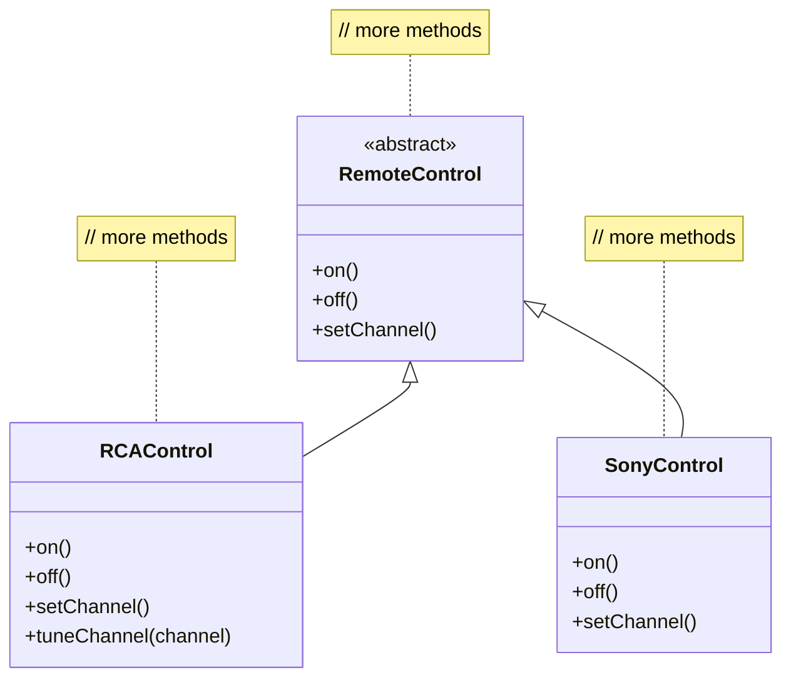

!!! note "Anotaciones del diagrama"
    - Esta es una abstracción. Podría ser una interfaz o una clase abstracta.
    - Todos los mandos comparten la misma abstracción.
    - Un montón de implementaciones, una por cada televisor.
    - Con este diseño podemos variar solo la implementación del televisor, no la interfaz de usuario.

### Tu dilema

Ya sabes que la interfaz de usuario del mando no va a ser la adecuada a la primera. De hecho, esperas que el producto se refine muchas veces a medida que se recopilan datos de usabilidad sobre el mando. Así que tu dilema es que los mandos van a cambiar y los televisores también van a cambiar. Ya has abstraído la interfaz de usuario para poder variar la implementación a lo largo de los muchos televisores que tus clientes serán dueños. Pero también vas a necesitar variar la abstracción, porque va a cambiar con el tiempo a medida que el mando mejore según los comentarios de los usuarios. Entonces, ¿cómo vas a crear un diseño orientado a objetos que te permita variar la implementación y la abstracción?

## ¿Por qué usar el patrón Bridge?

El patrón Bridge te permite variar la implementación y la abstracción colocando las dos en jerarquías de clases separadas.

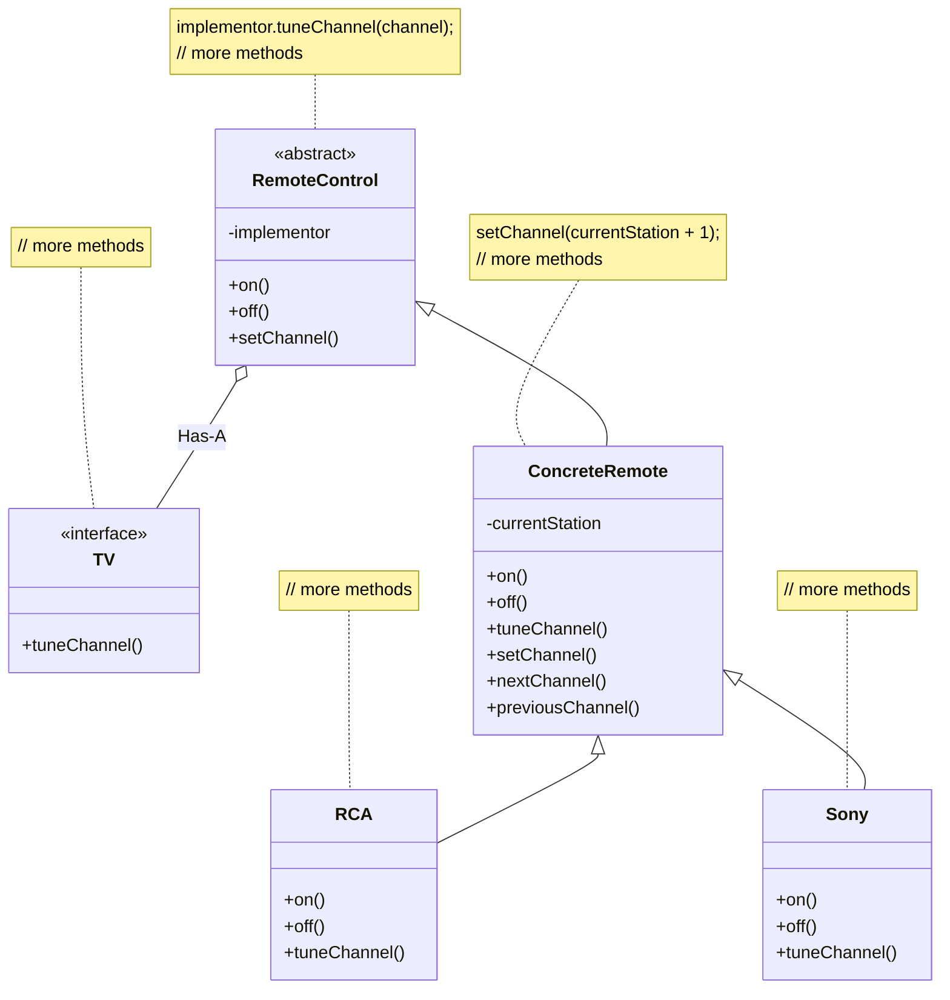

!!! note "Anotaciones del diagrama"
    - La relación entre las dos se denomina el «puente».
    - Jerarquía de clases de la implementación.
    - Todos los métodos de la abstracción se implementan en términos de la implementación.
    - Las subclases concretas se implementan en términos de la abstracción, no de la implementación.

Ahora tienes dos jerarquías: una para los mandos y otra, separada, para las implementaciones de televisores específicas de cada plataforma. El puente te permite variar cualquiera de los dos lados de las dos jerarquías de forma independiente.

| Bridge: beneficios | Bridge: usos e inconvenientes |
| --- | --- |
| Desacopla una implementación de modo que no queda ligada permanentemente a una interfaz. | Útil en sistemas de gráficos y de gestión de ventanas que necesitan ejecutarse sobre varias plataformas. |
| La abstracción y la implementación se pueden extender de forma independiente. | Útil siempre que necesites variar una interfaz y una implementación de maneras distintas. |
| Los cambios en las clases de abstracción concretas no afectan al cliente. | Aumenta la complejidad. |

## Builder

**Usa el patrón Builder para encapsular la construcción de un producto y permitir que se construya por pasos.**

### Un escenario

Acabas de recibir el encargo de construir un planificador de vacaciones para Patternsland, un nuevo parque de atracciones justo a las afueras de Objectville. Los visitantes del parque pueden elegir un hotel y varios tipos de entradas de admisión, hacer reservas de restaurante e incluso apuntarse a eventos especiales. Para crear un planificador de vacaciones necesitas poder crear estructuras como esta:

```text
             Day #   Hotel             Lunch        Dinner        Tickets              Special Event
  Vacation     1     Grand Facadian                                Patterns on Ice
               2     Grand Facadian                                Patterns on Ice
               3     Grand Facadian                   Dinner
               4     Grand Facadian
               5
               6
               7                                                                         Pattens park concert
```

!!! note "Anotaciones del diagrama"
    - Cada vacaciones se planifica a lo largo de cierto número de días.
    - Cada día puede tener cualquier combinación de reservas de hotel, entradas, comidas y eventos especiales.

### Necesitas un diseño flexible

El planificador de cada huésped puede variar en el número de días y en los tipos de actividades que incluye. Por ejemplo, un residente local puede que no necesite hotel, pero sí quiera hacer reservas de cena y de eventos especiales. Otro huésped puede que llegue en avión a Objectville y necesite hotel, reservas de cena y entradas de admisión.

Así que necesitas una estructura de datos flexible que pueda representar los planificadores de los huéspedes y todas sus variaciones; también necesitas seguir una secuencia de pasos potencialmente complejos para crear el planificador. ¿Cómo puedes ofrecer una forma de crear la estructura compleja sin mezclarla con los pasos para crearla?

## ¿Por qué usar el patrón Builder?

¿Recuerdas Iterator? Encapsulamos la iteración en un objeto aparte y ocultamos la representación interna de la colección al cliente. Aquí es la misma idea: encapsulamos la creación del planificador de viaje en un objeto (llamémosle builder) y hacemos que nuestro cliente le pida al builder que le construya la estructura del planificador de viaje.

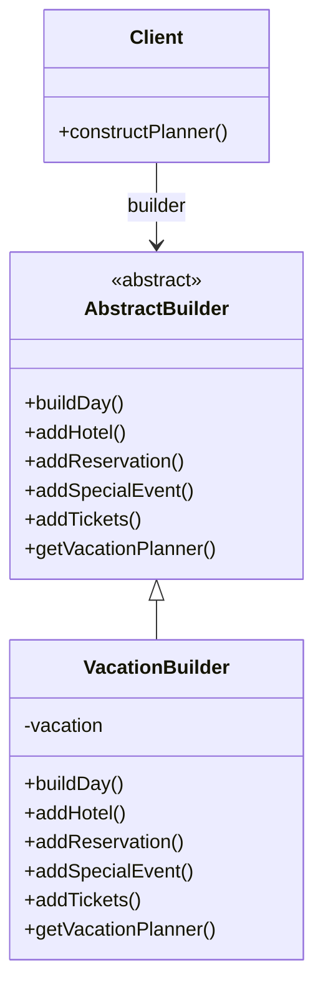

!!! note "Anotaciones del diagrama"
    - El cliente dirige al builder para que construya el planificador.
    - El cliente usa una interfaz abstracta para construir el planificador.
    - El builder concreto crea productos reales y los almacena en la estructura compuesta de vacaciones.
    - El cliente dirige al builder para que cree el planificador en varios pasos y luego llama al método `getVacationPlanner()` para recuperar el objeto completo.

```java
builder.buildDay(date);
builder.addHotel(date, "Grand Facadian");
builder.addTickets("Patterns on Ice");
// planifica el resto de las vacaciones
VacationPlanner yourPlanner =
        builder.getVacationPlanner();
```

| Builder: beneficios | Builder: usos e inconvenientes |
| --- | --- |
| Encapsula la forma en que se construye un objeto complejo. | Se usa a menudo para construir estructuras compuestas. |
| Permite construir objetos mediante un proceso de varios pasos y variable (en contraposición a las fábricas de un solo paso). | Construir objetos exige más conocimiento del dominio por parte del cliente que cuando se usa una fábrica. |
| Oculta al cliente la representación interna del producto. | |
| Las implementaciones del producto se pueden cambiar entre sí porque el cliente solo ve una interfaz abstracta. | |

## Chain of Responsibility

**Usa el patrón Chain of Responsibility cuando quieras darle a más de un objeto la oportunidad de gestionar una petición.**

### Un escenario

Mighty Gumball ha estado recibiendo más correo electrónico del que es capaz de gestionar desde el lanzamiento de la Gumball Machine hecha en Java. Según su propio análisis, reciben cuatro tipos de correo: correo de admiradores de clientes que adoran el nuevo juego del 1 de cada 10, quejas de padres cuyos hijos están enganchados al juego, peticiones para instalar máquinas en ubicaciones nuevas y bastante spam. Todo el correo de admiradores debería ir directamente al CEO, todas las quejas deberían ir al departamento legal y todas las peticiones de máquinas nuevas deberían ir a desarrollo de negocio. El spam debería borrarse.

### Tu tarea

!!! note "Nota al margen"
    Tienes que ayudarnos a manejar el aluvión de correo que estamos recibiendo desde el lanzamiento de la Java Gumball Machine.

Mighty Gumball ya ha escrito unos detectores de IA capaces de decir si un correo es spam, correo de admiradores, una queja o una petición, pero necesitan que tú crees un diseño que pueda usar esos detectores para gestionar el correo entrante.

## Cómo usar el patrón Chain of Responsibility

Con el patrón Chain of Responsibility creas una cadena de objetos que examinan las peticiones. Cada objeto examina a su vez una petición y o bien la gestiona o bien la pasa al siguiente objeto de la cadena.

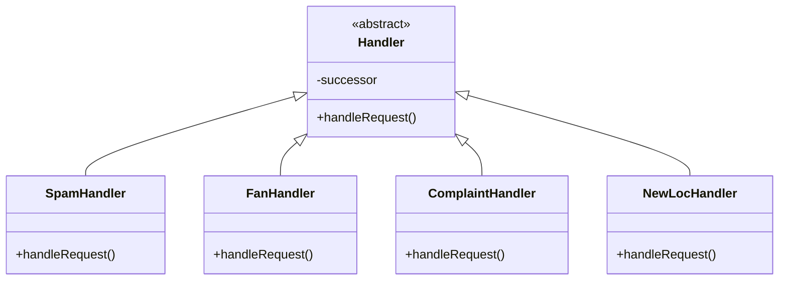

!!! note "Anotaciones del diagrama"
    - Cada objeto de la cadena actúa como un handler y tiene un objeto sucesor. Si puede gestionar la petición, lo hace; en caso contrario, le pasa la petición a su sucesor.

A medida que llega el correo, se le pasa al primer handler: `SpamHandler`. Si el `SpamHandler` no puede gestionar la petición, esta se le pasa al `FanHandler`. Y así sucesivamente...

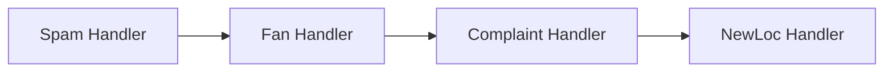

!!! note "Anotaciones del diagrama"
    - Cada correo se le pasa al primer handler.
    - Un correo no se gestiona si se cae por el final de la cadena, aunque siempre puedes implementar un handler «atrapa-todo» que se lleve cualquier correo.

| Chain of Responsibility: beneficios | Chain of Responsibility: usos e inconvenientes |
| --- | --- |
| Desacopla al emisor de la petición y a sus receptores. | Se usa habitualmente en sistemas Windows para gestionar eventos como clics de ratón y pulsaciones de teclado. |
| Simplifica tu objeto porque no tiene que conocer la estructura de la cadena ni mantener referencias directas a sus miembros. | No se garantiza la ejecución de la petición; puede caerse por el final de la cadena si ningún objeto la gestiona (esto puede ser una ventaja o un inconveniente). |
| Permite añadir o quitar responsabilidades dinámicamente cambiando los miembros o el orden de la cadena. | Puede ser difícil de observar y depurar en tiempo de ejecución. |

## Flyweight

**Usa el patrón Flyweight cuando una instancia de una clase pueda usarse para proporcionar muchas instancias virtuales.**

### Un escenario

Quieres añadir árboles como objetos en tu nueva aplicación de diseño de paisajes. En tu aplicación, los árboles no hacen gran cosa; tienen una posición X-Y y pueden dibujarse dinámicamente, dependiendo de su edad. El asunto es que un usuario puede querer tener muchísimos árboles en uno de sus diseños de paisajes domésticos. Puede que tenga este aspecto:

```text
        Tree           Tree
   Tree      House     Tree      Tree
   Tree                Tree
```

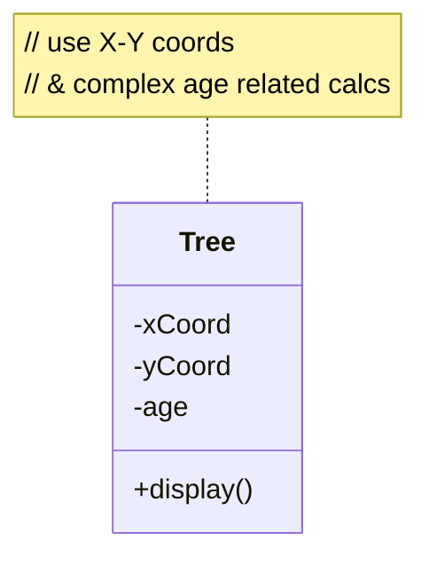

!!! note "Anotaciones del diagrama"
    - Cada instancia de `Tree` mantiene su propio estado.

### El dilema de tu gran cliente

Tienes un cliente importante al que llevas meses vendiéndole la idea. Va a comprar 1.000 licencias de tu aplicación y está usando tu software para diseñar paisajes de enormes comunidades planificadas. Después de usar tu software durante una semana, tu cliente se queja de que, cuando crean bosquecillos grandes de árboles, la aplicación empieza a volverse lenta...

## ¿Por qué usar el patrón Flyweight?

¿Y si, en lugar de tener miles de objetos `Tree`, pudieras rediseñar tu sistema de modo que solo tengas una instancia de `Tree` y un objeto cliente que mantenga el estado de TODOS tus árboles? ¡Eso es el Flyweight!

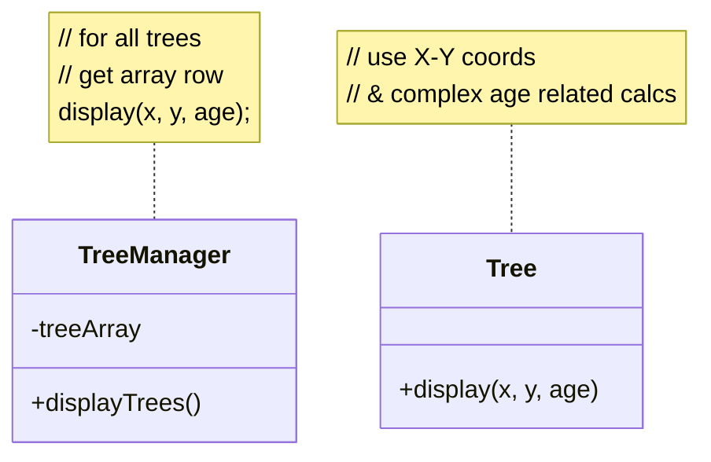

!!! note "Anotaciones del diagrama"
    - Todo el estado, de TODOS tus objetos virtuales `Tree`, se almacena en este array 2D.
    - Un único objeto `Tree`, sin estado.

| Flyweight: beneficios | Flyweight: usos e inconvenientes |
| --- | --- |
| Reduce el número de instancias de objetos en tiempo de ejecución, ahorrando memoria. | El Flyweight se usa cuando una clase tiene muchas instancias y todas se pueden controlar de forma idéntica. |
| Centraliza en un único lugar el estado de muchos objetos «virtuales». | Un inconveniente del patrón Flyweight es que, una vez implementado, las instancias lógicas de la clase no podrán comportarse de forma independiente de las demás instancias. |

## Interpreter

**Usa el patrón Interpreter para construir un intérprete de un lenguaje. El patrón Interpreter requiere cierto conocimiento de las gramáticas formales.**

### Un escenario

Si nunca has estudiado gramáticas formales, recuerda el simulador de patos: tienes la corazonada de que también sería una gran herramienta educativa para que los niños aprendan a programar. Aunque no sea así, sigue leyendo el patrón y te quedarás con la idea general. Con el simulador, cada niño puede controlar un pato con un lenguaje sencillo. Este es un ejemplo del lenguaje:

```text
right;
while (daylight) fly;
quack;
```

!!! note "Anotaciones del diagrama"
    - Gira el pato hacia la derecha.
    - Vuela todo el día...
    - ...y después grazna.

Ahora, recordando cómo se construían las gramáticas en aquellas clases introductorias de programación, escribes la gramática:

```text
expression ::=  <command> | <sequence> | <repetition>
sequence ::= <expression> ';' <expression>
command ::= right | quack | fly
repetition ::= while '(' <variable> ')'<expression>
variable ::= [A-Z,a-z]+
```

!!! note "Anotaciones del diagrama"
    - Un programa es una expresión que consta de secuencias de comandos y repeticiones (sentencias «while»).
    - Una secuencia es un conjunto de expresiones separadas por punto y coma.
    - Tenemos tres comandos: `right`, `quack` y `fly`.
    - Una sentencia `while` no es más que una variable condicional y una expresión.

### ¿Y ahora qué?

Tienes una gramática; ahora solo necesitas una forma de representar e interpretar las frases de la gramática para que los estudiantes puedan ver los efectos de su programación sobre los patos simulados.

## Cómo implementar un intérprete

Cuando necesitas implementar un lenguaje sencillo, el patrón Interpreter define una representación basada en clases para su gramática, junto con un intérprete que interpreta sus frases. Para representar el lenguaje usas una clase para representar cada regla del lenguaje. Este es el lenguaje de los patos traducido a clases. Fíjate en el mapeo directo con la gramática.

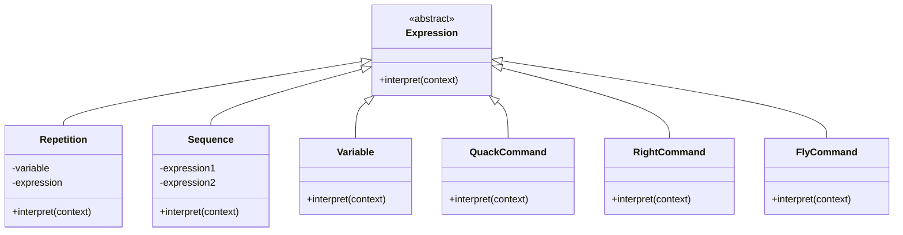

Para interpretar el lenguaje, llama al método `interpret()` en cada tipo de expresión. A este método se le pasa un contexto (que contiene el flujo de entrada del programa que estamos analizando) y este hace coincidir la entrada y la evalúa.

| Interpreter: beneficios | Interpreter: usos e inconvenientes |
| --- | --- |
| Representar cada regla de la gramática en una clase hace que el lenguaje sea fácil de implementar. | Usa Interpreter cuando necesites implementar un lenguaje sencillo. |
| Como la gramática está representada por clases, puedes cambiar o extender el lenguaje fácilmente. | Es apropiado cuando tienes una gramática sencilla y la simplicidad importa más que la eficiencia. |
| Al añadir métodos a la estructura de clases, puedes añadir comportamientos más allá de la interpretación, como una impresión bonita y una validación del programa más sofisticada. | Se usa para lenguajes de scripting y de programación. |
| | Este patrón puede volverse engorroso cuando el número de reglas de la gramática es grande. En esos casos puede ser más apropiado un generador de analizadores/compiladores. |

## Mediator

**Usa el patrón Mediator para centralizar las comunicaciones y el control complejos entre objetos relacionados.**

### Un escenario

Bob tiene una casa automatizada, gracias a la buena gente de HouseOfTheFuture. Todos sus electrodomésticos están diseñados para hacerle la vida más fácil. Cuando Bob deja de pulsar el botón de posponer, su despertador le dice a la cafetera que empiece a preparar café. Aunque la vida es bonita para Bob, él y otros clientes siempre piden un montón de funcionalidades nuevas: «¡Sin café los fines de semana!». «¡Apaga el aspersor 15 minutos antes de que haya una ducha programada!». «¡Pon el despertador temprano los días de basura...».

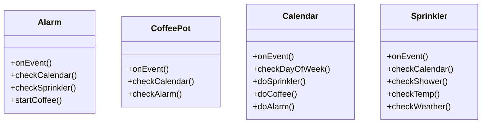

### El dilema de HouseOfTheFuture

Cada vez cuesta más saber qué reglas residen en qué objetos, y cómo deberían relacionarse entre sí los distintos objetos.

## El Mediator en acción

!!! note "Nota al margen"
    ¡Qué alivio no tener que descifrar las quisquillosas reglas de ese reloj despertador!

Con un Mediator añadido al sistema, todos los objetos de electrodomésticos se pueden simplificar enormemente:

- Le comunican al Mediator cuándo cambia su estado.
- Responden a las peticiones del Mediator.

Antes de añadir el Mediator, todos los objetos de electrodomésticos necesitaban conocerse entre sí; es decir, todos estaban fuertemente acoplados. Con el Mediator en su sitio, los objetos de electrodomésticos quedan completamente desacoplados entre sí. El Mediator contiene toda la lógica de control del sistema entero. Cuando un electrodoméstico existente necesita una regla nueva, o cuando se añade un electrodoméstico nuevo al sistema, ya sabes que toda la lógica necesaria se añadirá al Mediator.

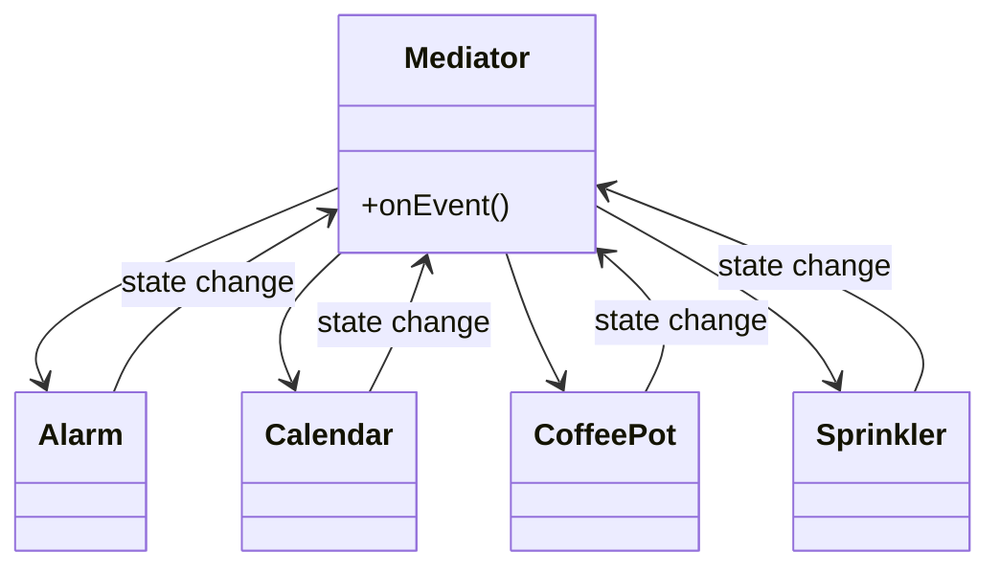

```java
if(alarmEvent){
  checkCalendar()
  checkShower()
  checkTemp()
}

if(weekend) {
  checkWeather()
  // haz otras cosas
}

if(trashDay) {
  resetAlarm()
  // haz otras cosas
}
```

| Mediator: beneficios | Mediator: usos e inconvenientes |
| --- | --- |
| Aumenta la reutilización de los objetos soportados por el Mediator al desacoplarlos del sistema. | El Mediator se usa habitualmente para coordinar componentes de interfaz gráfica relacionados. |
| Simplifica el mantenimiento del sistema al centralizar la lógica de control. | Un inconveniente del patrón Mediator es que, sin un diseño adecuado, el propio objeto Mediator puede volverse excesivamente complejo. |
| Simplifica y reduce la variedad de mensajes enviados entre los objetos del sistema. | |

## Memento

**Usa el patrón Memento cuando necesites poder devolver un objeto a uno de sus estados anteriores; por ejemplo, cuando tu usuario pida un «deshacer».**

### Un escenario

Tu juego de rol interactivo tiene un éxito enorme y ha creado una legión de adictos, todos intentando llegar al legendario «nivel 13». A medida que los usuarios avanzan a niveles del juego más difíciles, aumentan las probabilidades de encontrarse una situación que termine la partida. Los aficionados que han pasado días avanzando hasta un nivel avanzado no es de extrañar que se enfaden cuando su personaje muere y tienen que empezar de cero. El grito es: un comando de «guardar progreso», para que los jugadores puedan almacenar su progreso en el juego y al menos recuperar la mayor parte de sus esfuerzos cuando su personaje es eliminado injustamente. La función de «guardar progreso» debe diseñarse para devolver a una jugadora resucitada al último nivel que completó con éxito.

!!! note "Nota al margen"
    Ten cuidado con la forma en que guardas el estado de la partida. Es bastante complicado y no quiero que nadie más con acceso a él lo estropee y me rompa el código.

## El Memento en funcionamiento

El Memento tiene dos metas:

- Guardar el estado importante de un objeto clave del sistema.
- Mantener la encapsulación del objeto clave.

Teniendo en cuenta el Principio de Responsabilidad Única, también es buena idea mantener separado del objeto clave el estado que estás guardando. Este objeto aparte que contiene el estado es lo que se conoce como el objeto Memento.

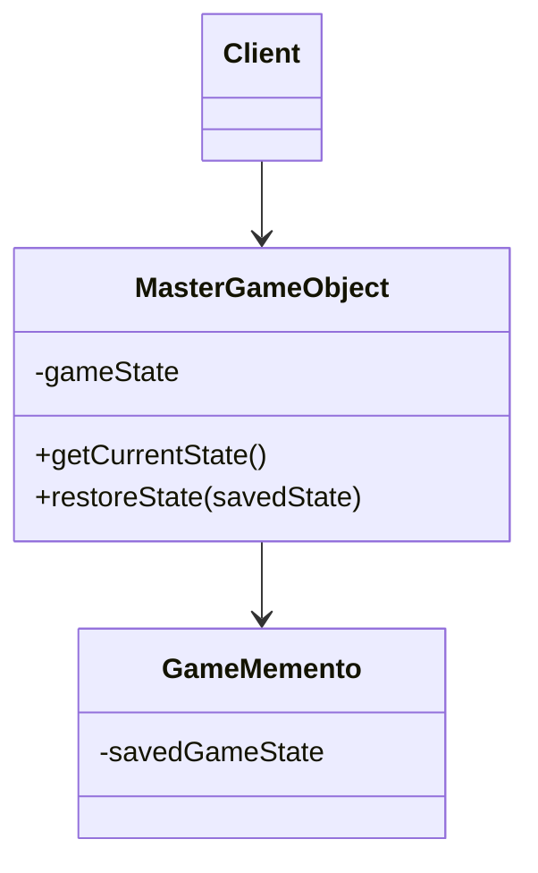

```java
// cuando se alcanza un nivel nuevo
Object saved = (Object) mgo.getCurrentState();

// cuando hay que hacer una restauración
mgo.restoreState(saved);
```

```java
Object getCurrentState() {
    // reunir el estado
    return(gameState);
}

restoreState(Object savedState) {
    // restaurar el estado
}
```

!!! note "Anotaciones del diagrama"
    - Aunque esta no es una implementación nada elaborada, fíjate en que el Client no tiene acceso a los datos del Memento.

| Memento: beneficios | Memento: usos e inconvenientes |
| --- | --- |
| Mantener el estado guardado fuera del objeto clave ayuda a conservar la cohesión. | El Memento se usa para guardar el estado. |
| Mantiene encapsulados los datos del objeto clave. | Un inconveniente de usar Memento es que guardar y restaurar el estado puede llevar bastante tiempo. |
| Proporciona una capacidad de recuperación fácil de implementar. | En sistemas Java, considera usar Serialization para guardar el estado de un sistema. |

## Prototype

**Usa el patrón Prototype cuando crear una instancia de una clase dada sea costoso o complicado.**

### Un escenario

Tu juego de rol interactivo tiene un apetito insaciable de monstruos. A medida que tus héroes recorren un paisaje creado dinámicamente, se encuentran con una cadena interminable de enemigos que deben ser derrotados. Te gustaría que las características de los monstruos evolucionaran con el paisaje cambiante. No tiene mucho sentido que los monstruos con forma de pájaro sigan a tus personajes hasta reinos submarinos. Por último, te gustaría permitir que los jugadores avanzados creen sus propios monstruos personalizados.

!!! note "Nota al margen"
    ¡Vaya! Solo el acto de crear todas estas diferentes clases de instancias de monstruos se está volviendo complicado... Meter todo tipo de detalles de estado en los constructores no parece muy cohesionado. Sería genial que hubiera un único sitio donde se pudieran encapsular todos los detalles de instanciación...

!!! note "Nota al margen"
    Sería mucho más limpio si pudiéramos desacoplar el código que maneja los detalles de crear los monstruos del código que realmente necesita crear las instancias sobre la marcha.

## El Prototype al rescate

El patrón Prototype te permite crear instancias nuevas copiando instancias existentes. (En Java esto suele significar usar el método `clone()`, o deserialización cuando necesites copias profundas). Un aspecto clave de este patrón es que el código del cliente puede crear instancias nuevas sin saber qué clase concreta se está instanciando.

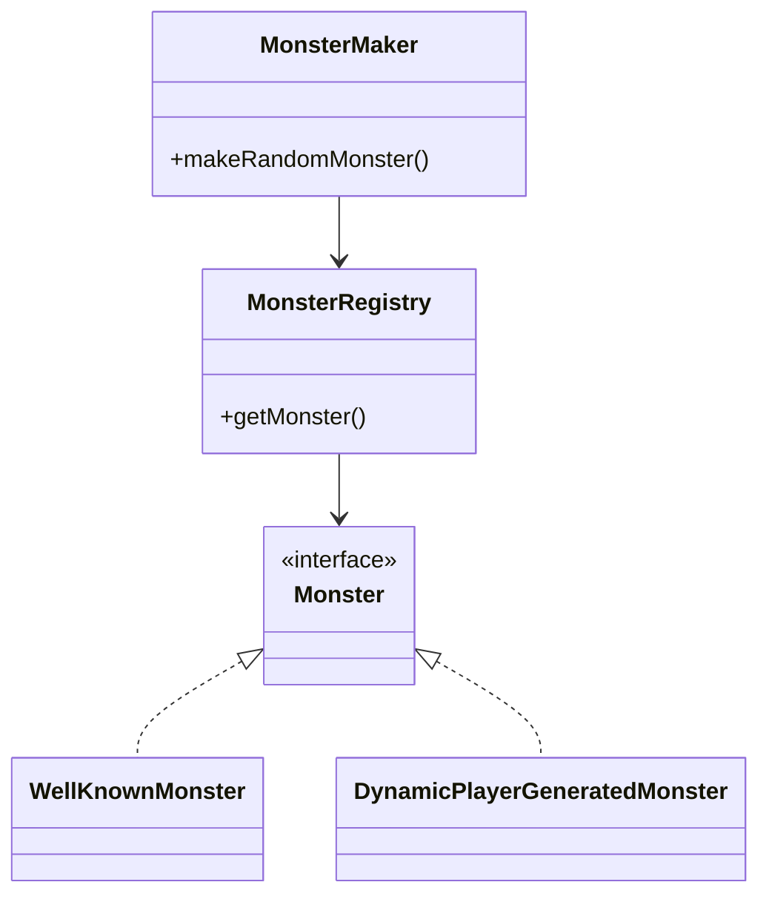

!!! note "Anotaciones del diagrama"
    - El cliente necesita un monstruo nuevo adecuado a la situación actual. (El cliente no sabrá de qué clase de monstruo se trata).
    - El registro encuentra el monstruo adecuado, hace un clon de él y devuelve el clon.

```java
Monster makeRandomMonster() {
    Monster m = MonsterRegistry.getMonster();
}
```

```java
Monster getMonster() {
    // encuentra el monstruo correcto
    return correctMonster.clone();
}
```

| Prototype: beneficios | Prototype: usos e inconvenientes |
| --- | --- |
| Oculta al cliente las complejidades de crear instancias nuevas. | Hay que considerar Prototype cuando un sistema debe crear objetos nuevos de muchos tipos en una jerarquía de clases compleja. |
| Ofrece al cliente la opción de generar objetos cuyo tipo no se conoce. | Un inconveniente de usar Prototype es que hacer una copia de un objeto puede ser complicado a veces. |
| En algunas circunstancias, copiar un objeto puede ser más eficiente que crear un objeto nuevo. | |

## Visitor

**Usa el patrón Visitor cuando quieras añadir capacidades a un compuesto de objetos y la encapsulación no sea importante.**

### Un escenario

Los clientes que concurren al Objectville Diner y al Objectville Pancake House se han vuelto más concienciados con su salud recientemente. Piden información nutricional antes de pedir sus comidas. Como ambos establecimientos están tan dispuestos a crear pedidos especiales, algunos clientes incluso piden información nutricional con base en cada ingrediente.

### La solución que propone Lou

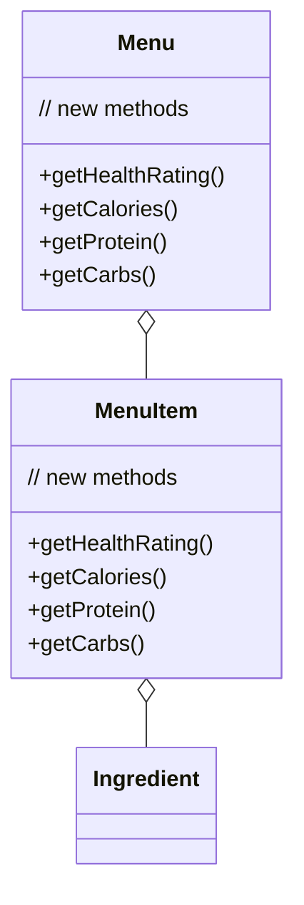

### Las preocupaciones de Mel

**Mel:** «Vaya, parece que estamos abriendo la caja de Pandora. ¿Quién sabe qué método nuevo tendremos que añadir a continuación? Y cada vez que añadimos un método nuevo tenemos que hacerlo en dos sitios. Además, ¿qué pasa si queremos mejorar la aplicación base con, digamos, una clase de recetas? ¡Entonces tendremos que hacer estos cambios en tres sitios distintos...!»

## El Visitor se presenta

El Visitor funciona de la mano con un Traverser. El Traverser sabe cómo navegar hasta todos los objetos de un Composite. El Traverser guía al Visitor a través del Composite para que el Visitor pueda recoger estado a medida que avanza. Una vez recogido el estado, el Client puede hacer que el Visitor realice distintas operaciones sobre ese estado. Cuando se necesita nueva funcionalidad, solo hay que mejorar el Visitor.

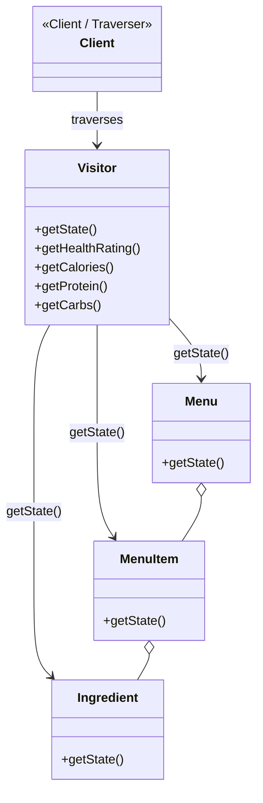

!!! note "Anotaciones del diagrama"
    - El Client pide al Visitor que saque información de la estructura Composite...
    - Todas estas clases del compuesto solo tienen que añadir un método `getState()` (y no preocuparse por exponerse a sí mismas).
    - El Visitor tiene que poder llamar a `getState()` a través de las clases, y aquí es donde puedes añadir métodos nuevos que el cliente pueda usar.
    - Se pueden añadir métodos nuevos al Visitor sin afectar al Composite.
    - El Traverser sabe cómo guiar al Visitor a través de la estructura Composite.

| Visitor: beneficios | Visitor: inconvenientes |
| --- | --- |
| Permite añadir operaciones a una estructura Composite sin cambiar la estructura en sí misma. | La encapsulación de las clases del Composite se rompe cuando se usa el Visitor. |
| Añadir nuevas operaciones es relativamente fácil. | Como interviene la función de recorrido, los cambios en la estructura del Composite son más difíciles. |
| El código de las operaciones que realiza el Visitor está centralizado. | |
