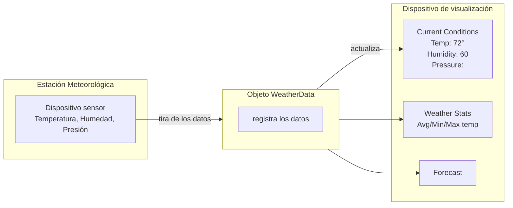
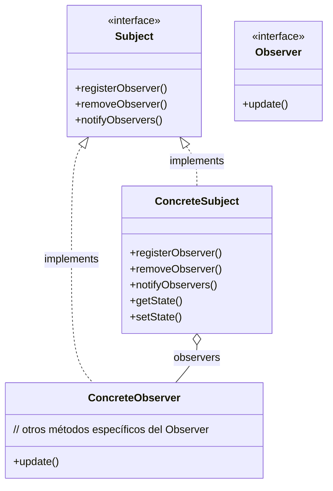
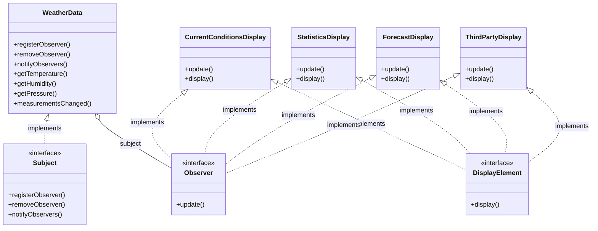

# Capítulo 2: Mantén a tus objetos al tanto

> **Ey Jerry, les estoy notificando a todos que la reunión del Grupo de Patrones se pasó al sábado por la noche. ¡Vamos a estar hablando de lo mejor de lo mejor! ¡Es lo ÚNICO, Jerry!**

No te querrás perder lo que pasa cuando algo interesante ocurre, ¿verdad? Tenemos un patrón que mantiene a tus objetos al tanto cuando pasa algo que les importa. Es el **patrón Observer**. Es uno de los patrones de diseño más usados, y es increíblemente útil. Veremos todo tipo de aspectos interesantes de Observer, como sus relaciones de uno a muchos y el acoplamiento débil. Y, con esos conceptos en mente, ¿cómo evitar ser el alma de la Fiesta de Patrones?

!!! tip "Nota de la traducción"
    Los nombres de clases, interfaces y métodos se mantienen en inglés (`WeatherData`, `Subject`, `Observer`, `measurementsChanged()`...) para que el código siga siendo válido y comparable con el original. La prosa, los comentarios y las explicaciones sí están traducidos.

## Estación meteorológica de seguimiento

!!! quote "Weather-O-Rama, Inc."
    100 Main Street
    Tornado Alley, OK 45021

> **¡Felicidades!**
>
> Tu equipo acaba de ganar el contrato para construir la Estación Meteorológica de Seguimiento de la próxima generación de Weather-O-Rama, Inc., basada en Internet.

**Pliego de condiciones (Statement of Work)**

Felicidades por ser los seleccionados para construir nuestra Estación Meteorológica de Seguimiento de la próxima generación, basada en Internet.

La estación meteorológica estará basada en nuestro objeto `WeatherData` con patente pendiente, que registra las condiciones meteorológicas actuales (temperatura, humedad y presión barométrica). Querríamos que creasen una aplicación que inicialmente proporcione tres elementos de visualización: condiciones actuales, estadísticas meteorológicas y un pronóstico simple, todos ellos actualizados en tiempo real a medida que el objeto `WeatherData` adquiere las mediciones más recientes.

Además, esta es una estación meteorológica ampliable. Weather-O-Rama quiere permitir que otros desarrolladores escriban sus propias pantallas meteorológicas y las conecten directamente. Así que es importante que las nuevas pantallas sean fáciles de añadir en el futuro.

Weather-O-Rama cree que tenemos un gran modelo de negocio: una vez que los clientes estén enganchados, nuestra intención es cobrarles por cada pantalla que utilicen. Y ahora la mejor parte: vamos a pagarles con opciones sobre acciones.

Esperamos ver su diseño y su aplicación alfa.

Sinceramente,
**Johnny Hurricane, CEO**

P.D. ¡Consulten los archivos fuente de `WeatherData` adjuntos!

## Una mirada general a la aplicación Weather Monitoring

Veamos la aplicación Weather Monitoring que tenemos que entregar: tanto lo que Weather-O-Rama nos da como lo que vamos a tener que construir o extender. El sistema tiene tres componentes: la estación meteorológica (el dispositivo físico que adquiere los datos meteorológicos reales), el objeto `WeatherData` (que registra los datos que llegan de la Estación Meteorológica y actualiza las pantallas) y la pantalla que muestra a los usuarios las condiciones meteorológicas actuales.



- **Lo que nos da Weather-O-Rama:** la estación meteorológica con su dispositivo sensor y el objeto `WeatherData`.
- **Lo que tenemos que implementar:** las pantallas de condiciones actuales, estadísticas y pronóstico.
- También necesitaremos **integrar el objeto `WeatherData` con las pantallas**.

!!! note "Nota marginal"
    El objeto `WeatherData` fue escrito por Weather-O-Rama y sabe cómo hablar con la Estación Meteorológica física para obtener datos meteorológicos actualizados. Tendremos que adaptar el objeto `WeatherData` para que sepa cómo actualizar las pantallas. Con suerte, Weather-O-Rama nos ha dado pistas de cómo hacerlo en el código fuente.

Recuerda: somos responsables de implementar tres elementos de visualización distintos: **Current Conditions** (muestra temperatura, humedad y presión), **Weather Statistics** y un **Forecast** simple.

!!! warning "Nuestro trabajo"
    Crear una aplicación que use el objeto `WeatherData` para actualizar tres pantallas: condiciones actuales, estadísticas meteorológicas y pronóstico.

## Desempacando la clase `WeatherData`

Veamos los adjuntos de código fuente que envió Johnny Hurricane, el CEO. Empecemos por la clase `WeatherData`:

```java
public class WeatherData {
    public float getTemperature() { /* ... */ }
    public float getHumidity() { /* ... */ }
    public float getPressure() { /* ... */ }

    public void measurementsChanged() {
        // Tu código va aquí
    }

    // otros métodos
}
```

- Estos tres métodos devuelven las mediciones meteorológicas más recientes de temperatura, humedad y presión barométrica, respectivamente.
- Ahora mismo no nos importa **cómo** consigue estos datos; simplemente sabemos que el objeto `WeatherData` recibe información actualizada de la Estación Meteorológica.
- Fíjate en que cada vez que `WeatherData` tiene valores actualizados, se llama al método `measurementsChanged()`.

```java
/*
 * Este método se llama
 * cada vez que las mediciones
 * meteorológicas han sido actualizadas
 */
public void measurementsChanged() {
    // Tu código va aquí
}
```

Parece que Weather-O-Rama dejó una nota en los comentarios para que añadamos nuestro código aquí. Así que quizá sea aquí donde tenemos que actualizar la pantalla (una vez que la hayamos implementado).

!!! warning "Nuestro trabajo"
    Alterar el método `measurementsChanged()` para que actualice las tres pantallas de condiciones actuales, estadísticas meteorológicas y pronóstico.

## Nuestro objetivo

Sabemos que tenemos que implementar una pantalla y luego hacer que `WeatherData` la actualice cada vez que tenga valores nuevos o, dicho de otro modo, cada vez que se llame al método `measurementsChanged()`. Pero ¿cómo? Pensemos qué queremos lograr:

- Sabemos que la clase `WeatherData` tiene métodos getter para tres valores de medición: temperatura, humedad y presión barométrica.
- Sabemos que el método `measurementsChanged()` se llama cada vez que hay nuevos datos meteorológicos disponibles. (De nuevo, no sabemos ni nos importa cómo se llama este método; solo sabemos que se llama.)
- Tendremos que implementar tres elementos de visualización que usen los datos meteorológicos: una pantalla de condiciones actuales, una pantalla de estadísticas y una pantalla de pronóstico. Estas pantallas deben actualizarse tan a menudo como `WeatherData` tenga mediciones nuevas.
- Para actualizar las pantallas, añadiremos código al método `measurementsChanged()`.

## Objetivo NECESARIO

Pero pensemos también en el futuro; recuerda la constante en el desarrollo de software: el **cambio**. Si la Estación Meteorológica tiene éxito, esperamos que en el futuro haya más de tres pantallas, así que ¿por qué no crear un mercado para pantallas adicionales? Entonces, ¿qué tal si construimos esto?

- **Extensibilidad**: otros desarrolladores querrán crear nuevas pantallas personalizadas. ¿Por qué no permitir que los usuarios añadan (o eliminen) tantos elementos de visualización como quieran a la aplicación? Actualmente conocemos los tres tipos de pantalla iniciales (condiciones actuales, estadísticas y pronóstico), pero esperamos un mercado próspero de nuevas pantallas en el futuro.

!!! tip "¿Todavía no lo tienes claro?"
    Siguiente diapositiva: implementemos esta estación meteorológica.

## Una primera implementación Fallida de la Estación Meteorológica

Aquí va una primera posibilidad de implementación: como hemos discutido, vamos a añadir nuestro código al método `measurementsChanged()` de la clase `WeatherData`:

```java
public class WeatherData {
    // declaraciones de variables de instancia

    public void measurementsChanged() {
        float temp = getTemperature();
        float humidity = getHumidity();
        float pressure = getPressure();

        currentConditionsDisplay.update(temp, humidity, pressure);
        statisticsDisplay.update(temp, humidity, pressure);
        forecastDisplay.update(temp, humidity, pressure);
    }

    // otros métodos de WeatherData aquí
}
```

- Primero, tomamos las mediciones más recientes llamando a los métodos getter de `WeatherData`. Asignamos cada valor a una variable con un nombre apropiado.
- A continuación vamos a **actualizar cada pantalla**... llamando a su método `update` y pasándole las mediciones más recientes.

!!! question "Cuestionario"
    Basándonos en nuestra primera implementación, ¿cuáles de las siguientes aplican? (Elige todas las que apliquen.)

    - A. Estamos programando a implementaciones concretas, no a interfaces.
    - B. Para cada nueva pantalla tendremos que alterar este código.
    - C. No tenemos forma de añadir (o quitar) elementos de visualización en tiempo de ejecución.
    - D. Los elementos de visualización no implementan una interfaz común.
    - E. No hemos encapsulado la parte que cambia.
    - F. Estamos violando la encapsulación de la clase `WeatherData`.

## ¿Qué le pasa a nuestra implementación?

Recuerda todos esos conceptos y principios del Capítulo 1: ¿cuáles estamos violando y cuáles no? Piensa en particular en los efectos del cambio sobre este código. Repasemos nuestro razonamiento mientras miramos el código:

```java
public void measurementsChanged() {
    float temp = getTemperature();
    float humidity = getHumidity();
    float pressure = getPressure();

    currentConditionsDisplay.update(temp, humidity, pressure);
    statisticsDisplay.update(temp, humidity, pressure);
    forecastDisplay.update(temp, humidity, pressure);
}
```

- Al menos parece que estamos usando una interfaz común para hablar con los elementos de visualización: todos tienen un método `update()` que recibe los valores de temperatura, humedad y presión.
- **Al programar a implementaciones concretas**, no tenemos forma de añadir o quitar otros elementos de visualización sin hacer cambios en el código. ¿Y si queremos añadir o quitar pantallas en tiempo de ejecución? Esto parece estar codificado a fuego.
- Parece un área de cambio. Necesitamos **encapsular** esto.

!!! tip
    Umm, sé que soy nuevo aquí, pero dado que estamos en el capítulo del patrón Observer, ¿quizá deberíamos empezar a usarlo?

Buena idea. Veamos Observer, y luego volvemos a averiguar cómo aplicarlo a la aplicación Weather Monitoring.

## Conoce el patrón Observer

Ya sabes cómo funcionan las suscripciones a periódicos o revistas:

1. Un editor de periódicos monta su negocio y empieza a publicar periódicos.
2. Te suscribes a un editor concreto, y cada vez que hay una nueva edición te la entregan. Mientras seas suscriptor, recibes nuevos periódicos.
3. Cancelas la suscripción cuando ya no quieres más periódicos, y dejan de entregártelos.
4. Mientras el editor siga en el negocio, la gente, los hoteles, las aerolíneas y otros negocios se suscriben y se dan de baja del periódico constantemente.

!!! note "Nota marginal"
    ¡Por supuesto que nos suscribimos! No nos queremos perder lo que pasa en Objectville.
## Editores + Suscriptores = patrón Observer

Si entiendes las suscripciones a periódicos, casi entiendes el patrón Observer; solo que llamamos **SUBJECT** al editor y **OBSERVERS** a los suscriptores. Veámoslo más de cerca:

- El objeto **Subject** gestiona unos datos importantes.
- Los observers se han suscrito (se han registrado) en el Subject para recibir actualizaciones cuando cambian los datos del Subject.
- Cuando cambian los datos en el Subject, se notifica a los observers.
- Los nuevos valores de datos se comunican a los observers de alguna forma cuando cambian.
- Este objeto no es un observer, así que no recibe notificación cuando cambian los datos del Subject.

## Un día en la vida del patrón Observer

Vamos a contar una historia con objetos Observer, un Subject y algunos `int`s. (Los `int`s son como datos meteorológicos que el Subject quiere notificar; piénsalo así.)

1. **Un objeto `Duck` llega y le dice al Subject** que quiere convertirse en observer. Duck realmente quiere participar en la acción; esos `int`s que el Subject envía cada vez que su estado cambia parecen bastante interesantes...

    El objeto `Duck` se registra como observer del Subject («regístrame / suscríbete»). El objeto `Duck` **implementa la interfaz `Observer`**, y el Subject guarda una referencia a él. Así, el objeto `Duck` es ahora un observer oficial.

2. **Duck está eufórico.** Está en la lista y espera con mucha anticipación la próxima notificación para poder obtener un `int`.

3. **El Subject obtiene un nuevo valor de datos.** Ahora `Duck` y todos los demás observers reciben una notificación de que el Subject ha cambiado.

4. **El objeto `Mouse` pide ser eliminado como observer** («quítame / cancélame la suscripción»). El objeto `Mouse` ha estado recibiendo `int`s durante siglos y está cansado de ello, así que decide que es hora de dejar de ser observer.

    ¡`Mouse` se acabó y se fue! El Subject reconoce la petición de `Mouse` y lo elimina del conjunto de observers.

5. **El Subject tiene otro nuevo `int`.** Todos los observers reciben otra notificación, **excepto `Mouse`**, que ya no está incluido.

!!! note "Nota marginal"
    No se lo cuentes a nadie, pero `Mouse` echa de menos esos `int`s en secreto... quizá algún día vuelva a pedir ser observer.

## Drama de cinco minutos: un Subject para observar

!!! quote "Lori y Jill"
    *Lori:* Esto es Lori. Busco un puesto de desarrollo Java. Llevo cinco años de experiencia y...

    *Jill:* Hola, soy Jill. He escrito un montón de sistemas empresariales. Me interesa cualquier trabajo que tengas con desarrollo Java.

**Headhunter/Subject**

!!! quote "Headhunter/Subject"
    *Subject:* Esta es Lori. La añado a mi lista. Ah, esto es... uf, sí, tú y todos los demás, cariño. Les avisaré a todos por si acaso.

**Desarrollador de Software #1**

## Dos semanas después...

Jill tiene una vida banditísima, y ya no es observer. También disfruta del buen bonus de firma que recibió porque la empresa no tuvo que pagar a un cazatalentos.

Pero ¿qué ha sido de nuestra dear Lori? Oímos que le está ganando al cazatalentos en su propio juego. No solo sigue siendo observer, ahora tiene su propia lista de llamadas y está notificando a sus propios observers. Lori es un Subject y un Observer todo en uno.

## El patrón Observer definido

Una suscripción a periódico, con su editor y sus suscriptores, es una buena forma de visualizar el patrón. En el mundo real, sin embargo, normalmente verás el patrón Observer definido así:

!!! quote "Definición"
    El patrón **Observer** define una dependencia de uno a muchos entre objetos, de modo que cuando un objeto cambia de estado, todos sus dependientes son notificados y actualizados automáticamente.

Relacionemos esta definición con cómo hemos estado pensando en el patrón:

- **Relación de uno a muchos:** un objeto que contiene el estado.
- **Actualización o notificación automática:** objetos dependientes.
- **Notificación:** cuando el estado de un objeto cambia, todos sus dependientes son notificados.

El subject y los observers definen la relación de uno a muchos. Tenemos **un subject**, que notifica a **muchos observers** cuando algo en el subject cambia. Los observers dependen del subject: cuando el estado del subject cambia, los observers son notificados.

Como descubrirás, hay varias maneras de implementar el patrón Observer, pero casi todas giran en torno a un diseño de clases que incluye las interfaces `Subject` y `Observer`.

## El patrón Observer: el diagrama de clases

Veamos la estructura del patrón Observer, completa con sus clases `Subject` y `Observer`. Aquí está el diagrama de clases:



- Aquí está la interfaz `Subject`. Los objetos usan esta interfaz para registrarse como observers y también para eliminarse de serlo.
- Todos los observers potenciales necesitan implementar la interfaz `Observer`. Esta interfaz tiene un único método, `update()`, que se llama cuando cambia el estado del Subject.
- Un subject concreto siempre implementa la interfaz `Subject`. Además de los métodos de registro y eliminación, el subject concreto implementa un método `notifyObservers()` que se usa para actualizar todos los observers actuales cuando cambia el estado. El subject concreto también puede tener métodos para establecer y obtener su estado (veremos más sobre esto más adelante).
- Cada subject puede tener muchos observers.
- Los observers concretos pueden ser cualquier clase que implemente la interfaz `Observer`. Cada observer se registra en un subject concreto para recibir actualizaciones.

!!! question "Preguntas frecuentes"

    **P: ¿Qué tiene esto que ver con las relaciones de uno a muchos?**

    R: Con el patrón Observer, el Subject es el objeto que contiene el estado y lo controla. Así que hay **UN** subject con muchos observers, y los observers dependen del subject para que los actualice cuando los datos cambian. Esto lleva a un diseño OO más limpio que permitir que muchos objetos controlen los mismos datos. Los observers usan el Subject para que les avise cuándo cambia su estado. Así que hay una relación entre el UNO subject y los MUCHOS observers.

    **P: ¿Cómo entra en juego la dependencia?**

    R: Porque el subject es el único propietario de esos datos, los observers dependen del subject para actualizarlos cuando los datos cambian.

    **P: También he oído hablar del patrón Publish-Subscribe. ¿Es simplemente otro nombre para el patrón Observer?**

    R: No, aunque están relacionados. El patrón Publish-Subscribe es un patrón más complejo que permite a los suscriptores expresar su interés en distintos tipos de mensajes, y separa aún más a los publicadores de los suscriptores. Se usa a menudo en sistemas de middleware.

!!! note "Guru y alumno..."
    **Guru:** ¿Hemos hablado ya de acoplamiento débil?

    **Alumno:** Guru, no recuerdo ninguna conversación así.

    **Guru:** ¿Una cesta tejida apretadamente es rígida o flexible?

    **Alumno:** Rígida, Guru.

    **Guru:** ¿Y las cestas rígidas o flexibles se rompen menos fácilmente?

    **Alumno:** Una cesta flexible tiende a romperse menos.

    **Guru:** ¿Y en nuestro software, sería posible que nuestros diseños se rompieran menos si nuestros objetos estuvieran menos atados entre sí?

    **Alumno:** Guru, veo la verdad de eso. Pero ¿qué significa que los objetos estén menos atados?

    **Guru:** Lo llamamos acoplamiento débil.
    **Guru:** Decimos que un objeto está fuertemente acoplado a otro cuando depende demasiado de ese objeto.

    **Alumno:** ¿Así que un objeto con acoplamiento débil no puede depender de otro objeto?

    **Guru:** Piensa en la naturaleza: todas las cosas vivas dependen entre sí. Del mismo modo, todos los objetos dependen de otros objetos. Pero un objeto con acoplamiento débil no sabe ni le importa demasiado sobre los detalles de otro objeto.

    **Alumno:** Pero Guru, eso no suena a una buena cualidad. Seguro que no saber es peor que saber.

    **Guru:** Estás haciendo bien tus estudios, pero tienes mucho que aprender. Al no saber demasiado sobre otros objetos, podemos crear diseños que manejen el cambio mejor. Diseños con más flexibilidad, como la cesta menos tejida apretadamente.

    **Alumno:** Por supuesto, estoy seguro de que tienes razón. ¿Podrías darme un ejemplo?

    **Guru:** Por hoy es suficiente.

## El poder del acoplamiento débil

Cuando dos objetos tienen acoplamiento débil, pueden interactuar, pero normalmente tienen muy poco conocimiento el uno del otro. Como veremos, los diseños con acoplamiento débil a menudo nos dan mucha flexibilidad. Y, por cierto, el patrón Observer es un gran ejemplo de acoplamiento débil. Repasemos todas las formas en que el patrón logra el acoplamiento débil:

- **Primero**, lo único que el subject sabe de un observer es que implementa cierta interfaz (la interfaz `Observer`). No necesita conocer la clase concreta del observer, qué hace, ni nada más sobre él.
- **Podemos añadir nuevos observers en cualquier momento.** Como lo único de lo que depende el subject es de una lista de objetos que implementan la interfaz `Observer`, podemos añadir nuevos observers cuando queramos. De hecho, podemos reemplazar cualquier observer en tiempo de ejecución por otro observer y el subject seguirá funcionando feliz. Asimismo, podemos quitar observers en cualquier momento. **Nunca necesitamos modificar el subject para añadir nuevos tipos de observers.** Supongamos que llega una nueva clase concreta que debe ser observer. No necesitamos hacer ningún cambio en el subject para acomodar el nuevo tipo de clase; todo lo que tenemos que hacer es implementar la interfaz `Observer` en la nueva clase y registrarla como observer. Al subject no le importa; entregará notificaciones a cualquier objeto que implemente la interfaz `Observer`.
- **Podemos reutilizar subjects u observers independientemente los unos de los otros.** Si tenemos otro uso para un subject o un observer, podemos reutilizarlos fácilmente porque los dos no están fuertemente acoplados.
- **Los cambios en el subject o en un observer no afectarán al otro.** Como los dos tienen acoplamiento débil, somos libres de hacer cambios en cualquiera de los dos, siempre que los objetos sigan cumpliendo con sus obligaciones de implementar las interfaces `Subject` u `Observer`.

!!! question "Principio de diseño"
    **Aspira a diseños con acoplamiento débil** entre objetos que interactúan.

    Los diseños con acoplamiento débil nos permiten construir sistemas OO flexibles que pueden manejar el cambio porque **minimizan la interdependencia entre objetos**.

!!! tip
    ¡Mira! Tenemos un nuevo principio de diseño. ¿Cuántos tipos de cambio puedes identificar aquí?

!!! exercise "Antes de seguir adelante"
    Prueba a esbozar las clases que necesitarás para implementar la Estación Meteorológica, incluyendo la clase `WeatherData` y sus elementos de visualización. Asegúrate de que tu diagrama muestre cómo encajan todas las piezas y también cómo otro desarrollador podría implementar su propio elemento de visualización.

    Si necesitas algo de ayuda, lee la página siguiente; tus compañeros ya están hablando de cómo diseñar la Estación Meteorológica.

## Conversación en el cubículo

Volvamos al proyecto de la Estación Meteorológica. Tus compañeros ya han empezado a pensar en el problema...

**Sue:** Así que, ¿cómo vamos a construir esta cosa?

**Mary:** Bueno, ayuda saber que estamos usando el patrón Observer.

**Sue:** Exacto... pero, ¿cómo lo aplicamos?

**Mary:** Hmm. Volvamos a mirar la definición:

> El patrón Observer define una dependencia de uno a muchos entre objetos, de modo que cuando un objeto cambia de estado, todos sus dependientes son notificados y actualizados automáticamente.

**Mary:** En realidad, eso tiene algo de sentido si lo piensas. Nuestra clase `WeatherData` es el «uno», y nuestro «muchos» son los distintos elementos de visualización que usan las mediciones meteorológicas.

**Sue:** Eso es. La clase `WeatherData` tiene estado... ese estado es la temperatura, la humedad y la presión barométrica, y desde luego eso cambia.

**Mary:** Exacto, y cuando esas mediciones cambian, tenemos que notificar a todos los elementos de visualización para que puedan hacer lo que tengan que hacer con las mediciones.

**Sue:** Genial, ahora creo que veo cómo se puede aplicar el patrón Observer a nuestro problema de la Estación Meteorológica.

**Mary:** Todavía hay algunas cosas que considerar que no estoy segura de entender todavía.

**Sue:** ¿Como qué?

**Mary:** Para empezar, ¿cómo conseguimos que las mediciones meteorológicas lleguen a los elementos de visualización?

**Sue:** Bueno, si miramos el diagrama del patrón Observer, si hacemos que el objeto `WeatherData` sea el subject y los elementos de visualización sean los observers, entonces las pantallas se registrarán ellas mismas en el objeto `WeatherData` para obtener la información que quieren, ¿no?

**Mary:** Sí... y una vez que la Estación Meteorológica conoce un elemento de visualización, entonces simplemente puede llamar a un método para informarle de las mediciones.

**Sue:** Tenemos que recordar que cada elemento de visualización puede ser diferente... así que creo que ahí es donde entra tener una interfaz común. Aunque cada componente tiene un tipo distinto, todos deberían implementar la misma interfaz para que el objeto `WeatherData` sepa cómo enviarles las mediciones.

**Mary:** Entiendo lo que quieres decir. Así que cada visualización tendrá, digamos, un método `update()` que `WeatherData` llamará.

**Sue:** Y `update()` está definido en una interfaz común que todos los elementos implementan...

## Diseñando la Estación Meteorológica

¿Cómo se compara este diagrama con el tuyo?



- Aquí está nuestra interfaz `Subject`. Esto debería resultarte familiar.
- `WeatherData` ahora implementa la interfaz `Subject`.
- Todos nuestros componentes meteorológicos implementan la interfaz `Observer`. Esto les da al Subject una interfaz común con la que hablar cuando llegue el momento de actualizar a los observers.
- Este elemento de visualización muestra las mediciones actuales del objeto `WeatherData`.
- Este mantiene un registro de las mediciones min/avg/max y las muestra.
- Esta pantalla muestra el pronóstico meteorológico según el barómetro.
- Creemos también una interfaz para todos los elementos de visualización que deban implementar. Los elementos de visualización solo necesitan implementar un método `display()`.
- Los desarrolladores pueden implementar las interfaces `Observer` y `DisplayElement` para crear su propio elemento de visualización.

!!! note "Nota marginal"
    Estos tres elementos de visualización deberían tener también un puntero a `WeatherData` etiquetado como «subject», pero este diagrama empezaría a parecer espagueti si lo hiciéramos.

## Implementando la Estación Meteorológica

Muy bien, hemos tenido grandes Pensamientos de Mary y Sue (de hace unas páginas) y tenemos un diagrama que detalla la estructura general de nuestras clases. Así que pongamos en marcha nuestra implementación de la estación meteorológica. Empecemos con las interfaces:

```java
public interface Subject {
    public void registerObserver(Observer o);
    public void removeObserver(Observer o);
    public void notifyObservers();
}
```

- Estos dos métodos toman un `Observer` como argumento, es decir, el observer que se va a registrar o quitar.
- Este método se llama para notificar a todos los observers cuando ha cambiado el estado del Subject.

```java
public interface Observer {
    public void update(float temp, float humidity, float pressure);
}
```

- Estos son los valores de estado que los observers reciben del Subject cuando cambia una medición meteorológica.

```java
public interface DisplayElement {
    public void display();
}
```

- La interfaz `DisplayElement` solo incluye un método, `display()`, que llamaremos cuando el elemento de visualización necesite mostrarse.
- La interfaz `Observer` la implementan todos los observers, así que todos tienen que implementar el método `update()`. Aquí estamos siguiendo el camino de Mary y Sue y pasando las mediciones directamente a los observers.

!!! question "Pregunta de diseño"
    Mary y Sue pensaron que pasar las mediciones directamente a los observers era el método más sencillo de actualizar el estado. ¿Crees que esto es sabio? Pista: ¿es esta un área de la aplicación que podría cambiar en el futuro? Si cambiara, ¿el cambio estaría bien encapsulado, o requeriría cambios en muchas partes del código?

    ¿Puedes pensar en otras maneras de abordar el problema de pasar el estado actualizado a los observers?

    No te preocupes; volveremos a esta decisión de diseño después de terminar la implementación inicial.

## Implementando la interfaz `Subject` en `WeatherData`

Recuerda nuestro primer intento de implementar la clase `WeatherData` al principio del capítulo. Quizá quieras refrescar la memoria. Ahora es hora de volver y hacer las cosas teniendo en mente el patrón Observer:

```java
public class WeatherData implements Subject {
    private List<Observer> observers;
    private float temperature;
    private float humidity;
    private float pressure;

    public WeatherData() {
        observers = new ArrayList<Observer>();
    }

    public void registerObserver(Observer o) {
        observers.add(o);
    }

    public void removeObserver(Observer o) {
        observers.remove(o);
    }

    public void notifyObservers() {
        for (Observer observer : observers) {
            observer.update(temperature, humidity, pressure);
        }
    }

    public void measurementsChanged() {
        notifyObservers();
    }

    public void setMeasurements(float temperature, float humidity, float pressure) {
        this.temperature = temperature;
        this.humidity = humidity;
        this.pressure = pressure;
        measurementsChanged();
    }

    // otros métodos de WeatherData aquí
}
```

- `WeatherData` ahora implementa la interfaz `Subject`.
- Hemos añadido un `ArrayList` para guardar los observers, y lo creamos en el constructor.
- Cuando un observer se registra, simplemente lo añadimos al final de la lista. Del mismo modo, cuando un observer quiere darse de baja, simplemente lo quitamos de la lista.
- Aquí está la parte divertida; aquí es donde les decimos a todos los observers sobre el estado. Como todos son observers, sabemos que todos implementan `update()`, así que sabemos cómo notificarlos. Notificamos a los observers cuando obtenemos mediciones actualizadas de la Estación Meteorológica.

!!! tip
    Bueno, mientras queríamos incluir una bonita pequeña estación meteorológica con cada libro, la editorial no aceptaría eso. Así que, en lugar de leer los datos meteorológicos reales de un dispositivo, vamos a usar este método para probar nuestros elementos de visualización. O, por diversión, podrías escribir código para tomar mediciones de la web.

!!! note "Nota marginal"
    **RECUERDA:** no proporcionamos sentencias `import` y `package` en los listados de código. Obtén el código fuente completo en <https://wickedlysmart.com/head-first-design-patterns>.

## Ahora, construyamos esos elementos de visualización

Ahora que ya tenemos encaminada nuestra clase `WeatherData`, es hora de construir los elementos de visualización. Weather-O-Rama pidió tres: la pantalla de condiciones actuales, la pantalla de estadísticas y la pantalla de pronóstico. Veamos la pantalla de condiciones actuales; cuando te familiarices con este elemento de visualización, echa un vistazo a las pantallas de estadísticas y pronóstico en el directorio de código. Verás que son muy parecidas.

```java
public class CurrentConditionsDisplay implements Observer, DisplayElement {
    private float temperature;
    private float humidity;
    private WeatherData weatherData;

    public CurrentConditionsDisplay(WeatherData weatherData) {
        this.weatherData = weatherData;
        weatherData.registerObserver(this);
    }

    public void update(float temperature, float humidity, float pressure) {
        this.temperature = temperature;
        this.humidity = humidity;
        display();
    }

    public void display() {
        System.out.println("Current conditions: " + temperature
            + "F degrees and " + humidity + "% humidity");
    }
}
```

- Esta visualización implementa la interfaz `Observer` para poder recibir los cambios del objeto `WeatherData`.
- Al constructor se le pasa el objeto `weatherData` (el Subject) y lo usamos para registrar la visualización como observer.
- También implementa `DisplayElement`, porque nuestra API va a exigir que todos los elementos de visualización implementen esta interfaz.
- Cuando se llama a `update()`, guardamos la temperatura y la humedad y llamamos a `display()`.
- El método `display()` simplemente imprime la temperatura y la humedad más recientes.

!!! question "Preguntas frecuentes"

    **P: ¿Es `update()` el mejor sitio para llamar a `display()`?**

    R: En este ejemplo simple tenía sentido llamar a `display()` cuando cambiaron los valores. Sin embargo, tienes razón; hay formas mucho mejores de diseñar cómo se muestran los datos. Lo veremos cuando lleguemos al patrón Model-View-Controller.

    **P: ¿Por qué guardaste una referencia al Subject `WeatherData`? No parece que la uses otra vez después del constructor.**

    R: Cierto, pero en el futuro quizá queramos darse de baja como observer, y sería útil tener ya una referencia al subject.

## Encendiendo la Estación Meteorológica

Primero, vamos a crear un banco de pruebas. La Estación Meteorológica está lista. Todo lo que necesitamos es algo de código que pegue todo junto. Añadiremos unas cuantas pantallas más y generalizaremos un poco las cosas en un momento. Por ahora, aquí está nuestro primer intento:

```java
public class WeatherStation {
    public static void main(String[] args) {
        WeatherData weatherData = new WeatherData();
        CurrentConditionsDisplay currentDisplay =
            new CurrentConditionsDisplay(weatherData);
        StatisticsDisplay statisticsDisplay = new StatisticsDisplay(weatherData);
        ForecastDisplay forecastDisplay = new ForecastDisplay(weatherData);

        weatherData.setMeasurements(80, 65, 30.4f);
        weatherData.setMeasurements(82, 70, 29.2f);
        weatherData.setMeasurements(78, 90, 29.2f);
    }
}
```

- Primero, creamos el objeto `WeatherData`.
- Crea las tres pantallas y pásales el objeto `WeatherData`.
- Simula nuevas mediciones meteorológicas.

!!! tip
    Si no quieres descargar el código, puedes comentar estas dos líneas y ejecutarlo.

Ahora ejecuta el código y deja que el patrón Observer haga su magia:

```text
Current conditions: 80.0F degrees and 65.0% humidity
Avg/Max/Min temperature = 80.0/80.0/80.0
Forecast: Improving weather on the way!
Current conditions: 82.0F degrees and 70.0% humidity
Avg/Max/Min temperature = 81.0/82.0/80.0
Forecast: Watch out for cooler, rainy weather
Current conditions: 78.0F degrees and 90.0% humidity
Avg/Max/Min temperature = 80.0/82.0/78.0
Forecast: More of the same
```

!!! exercise "Ejercicio: programa la pantalla del índice de calor"
    Johnny Hurricane, el CEO de Weather-O-Rama, acaba de llamar y dice que no pueden enviar el producto sin un elemento de visualización de **Heat Index** (índice de calor). Aquí tienes los detalles.

    El índice de calor es un índice que combina temperatura y humedad para determinar la temperatura aparente (lo caliente que se siente realmente). Para calcularlo, tomas la temperatura `T` y la humedad relativa `RH`, y usas esta fórmula:

    ```text
    heatindex = 16.923 + 1.85212 * 10-1 * T + 5.37941 * RH - 1.00254 * 10-1 * T * RH
    + 9.41695 * 10-3 * T2 + 7.28898 * 10-3 * RH2 + 3.45372 * 10-4 * T2 * RH
    - 8.14971 * 10-4 * T * RH2 + 1.02102 * 10-5 * T2 * RH2 - 3.8646 * 10-5 * T3
    + 2.91583 * 10-5 * RH3 + 1.42721 * 10-6 * T3 * RH + 1.97483 * 10-7 * T * RH3
    - 2.18429 * 10-8 * T3 * RH2 + 8.43296 * 10-10 * T2 * RH3
    - 4.81975 * 10-11 * T3 * RH3
    ```

    Así que ya puedes escribir. Es una broma. No te preocupes, no tendrás que escribir esa fórmula; solo crea tu propio archivo `HeatIndexDisplay.java` y copia la fórmula de `heatindex.txt` en él. Puedes conseguir `heatindex.txt` en wickedlysmart.com.

    ¿Cómo funciona? Tendrías que consultar *Head First Meteorology*, o intentar preguntarle a alguien del National Weather Service (o hacer una búsqueda web).

    Cuando termines, tu salida debería ser así:

    ```text
    Current conditions: 80.0F degrees and 65.0% humidity
    Avg/Max/Min temperature = 80.0/80.0/80.0
    Forecast: Improving weather on the way!
    Heat index is 82.95535
    Current conditions: 82.0F degrees and 70.0% humidity
    Avg/Max/Min temperature = 81.0/82.0/80.0
    Forecast: Watch out for cooler, rainy weather
    Heat index is 86.90124
    Current conditions: 78.0F degrees and 90.0% humidity
    Avg/Max/Min temperature = 80.0/82.0/78.0
    Forecast: More of the same
    Heat index is 83.64967
    ```

!!! note "Nota marginal"
    Esto es lo que cambió en esta salida.

## Charla junto a la chimenea: Subject y Observer discuten sobre la forma correcta de llevar la información de estado al Observer

**Subject:**

Me alegra que por fin tengamos la oportunidad de hablar en persona.

**Observer:**

¿Ah, sí? Pensaba que no te importábamos mucho, Observers.

**Subject:**

Bueno, ¿no hago mi trabajo? Siempre te digo lo que está pasando... El hecho de que no sepa realmente quién eres no significa que no me importe. Y además, sí que sé lo más importante de ti: implementas la interfaz `Observer`.

**Observer:**

Sí, pero eso es solo una pequeña parte de lo que soy. De todas formas, sé mucho más sobre ti...

**Subject:**

Ah, sí, ¿como qué?

**Observer:**

Bueno, siempre estás pasando tu estado a nosotros los Observers para que podamos ver lo que pasa dentro de ti. Lo cual llega a ser un poco molesto a veces...

**Subject:**

Bueno, excu-u-u-ú-same. Tengo que enviar mi estado con mis notificaciones para que todos vosotros los perezosos Observers sepáis qué ha pasado.

**Observer:**

Vale, espera un minuto; primero, no somos perezosos, simplemente tenemos otras cosas que hacer entre tus importantísimas notificaciones, señor Subject, y segundo, ¿por qué no nos dejas ir a nosotros a por el estado que queremos en lugar de empujárselo a todo el mundo?

**Subject:**

Bueno... supongo que eso podría funcionar. Aunque tendría que abrirme mucho más, para dejar que todos vosotros los Observors entréis y cojais el estado que necesitáis. Eso podría ser un poco peligroso. No puedo dejaros entrar a husmear mirando todo lo que tengo.

**Observer:**

¿Por qué no escribes simplemente algunos métodos getter públicos que nos dejen extraer el estado que necesitamos?

**Subject:**

Sí, podría dejaros extraer mi estado. Pero, ¿no sería menos cómodo para vosotros? Si tenéis que venir a mí cada vez que queréis algo, quizá tengáis que hacer múltiples llamadas a métodos para conseguir todo el estado que queréis. Por eso prefiero el *push*... así tenéis todo lo que necesitáis en una sola notificación.

**Observer:**

¡No seas tan *pushy*! Hay tantos tipos distintos de nosotros los Observers que no hay forma de que anticipes todo lo que necesitamos. Simplemente deja que vayamos nosotros a por ti a por el estado que necesitamos. Así, si algunos de nosotros solo necesitamos un poco de estado, no estamos obligados a obtenerlo todo. También hace que las cosas sean más fáciles de modificar más adelante. Por ejemplo, si te expandes y añades más estado, si usas *pull* no tienes que ir cambiando las llamadas a `update()` en cada observer; solo tienes que cambiarte a ti para permitir más métodos getter que accedan a nuestro estado adicional.

**Subject:**

Bueno, como suelo decir, no nos llames, ¡nosotros te llamaremos! Pero le daré una vuelta.

**Observer:**

No cuento con ello.

**Subject:**

Nunca se sabe, puede que el infierno se congele.

**Observer:**

Ya veo, siempre el sabiondo...

**Subject:**

Desde luego.

## Buscando el patrón Observer en la naturaleza

El patrón Observer es uno de los patrones más comunes en uso, y encontrarás abundantes ejemplos del patrón usándose en muchas bibliotecas y frameworks. Si miramos, por ejemplo, el Java Development Kit (JDK), tanto las bibliotecas JavaBeans como Swing hacen uso del patrón Observer. El patrón no se limita a Java tampoco; se usa en los eventos de JavaScript y en el protocolo Key-Value Observing de Cocoa y Swift, por nombrar un par de ejemplos más. Una de las ventajas de conocer los patrones de diseño es reconocer y comprender rápidamente la motivación de diseño en tus bibliotecas favoritas. Vamos a hacer una pequeña desviación...

### La biblioteca Swing

Ya sabes probablemente que Swing es el kit de herramientas de Java para interfaces de usuario. Uno de los componentes más básicos de ese kit es la clase `JButton`. Si miras la superclase de `JButton`, `AbstractButton`, encontrarás que tiene muchos métodos *add/remove* de listener. Estos métodos te permiten añadir y quitar observers —o, como se llaman en Swing, *listeners*— para escuchar distintos tipos de eventos que ocurren en el componente Swing. Por ejemplo, un `ActionListener` te permite «escuchar» cualquier tipo de acción que pueda ocurrir en un botón, como una pulsación de botón. Encontrarás varios tipos de listeners por toda la API de Swing.

!!! tip
    Si tienes curiosidad por el patrón Observer en JavaBeans, echa un vistazo a la interfaz `PropertyChangeListener`.

### Una pequeña aplicación que cambia la vida

Bien, nuestra aplicación es bastante simple. Tienes un botón que dice «¿Debería hacerlo?» y cuando haces clic en ese botón, los listeners (observers) responden a la pregunta como quieran. Estamos implementando dos de esos listeners, llamados `AngelListener` y `DevilListener`. Así se comporta la aplicación:

```text
Devil answer: Come on, do it!
Angel answer: Don't do it, you might regret it!
```

    Ahí tienes nuestra interfaz elegante. Y aquí está la salida cuando hacemos clic en el botón.

## Programando la aplicación que cambia la vida

Esta aplicación que cambia la vida requiere muy poco código. Todo lo que tenemos que hacer es crear un objeto `JButton`, añadirlo a un `JFrame` y configurar nuestros listeners. Vamos a usar clases internas para los listeners, que es una técnica común en programación Swing.

```java
public class SwingObserverExample {
    JFrame frame;

    public static void main(String[] args) {
        SwingObserverExample example = new SwingObserverExample();
        example.go();
    }

    public void go() {
        frame = new JFrame();
        JButton button = new JButton("Should I do it?");
        button.addActionListener(new AngelListener());
        button.addActionListener(new DevilListener());
        // Código para configurar el frame aquí
    }

    class AngelListener implements ActionListener {
        public void actionPerformed(ActionEvent event) {
            System.out.println("Don't do it, you might regret it!");
        }
    }

    class DevilListener implements ActionListener {
        public void actionPerformed(ActionEvent event) {
            System.out.println("Come on, do it!");
        }
    }
}
```

- Aplicación Swing sencilla que solo crea un frame y le lanza un botón.
- Convierte los objetos devil y angel en listeners (observers) del botón.
- El código para configurar el frame va aquí.
- Aquí están las definiciones de clase de los observers, definidas como clases internas (pero no tienen que serlo).
- En lugar de `update()`, se llama al método `actionPerformed()` cuando cambia el estado en el subject (en este caso, el botón).

### El código actualizado, usando expresiones lambda

¿Y si llevas tu uso del patrón Observer un paso más allá? Usando una expresión lambda en lugar de una clase interna, puedes saltarte el paso de crear un objeto `ActionListener`. Con una expresión lambda, creamos un objeto función en su lugar, y el objeto función es el observer. Y, cuando pasas ese objeto función a `addActionListener()`, Java se asegura de que su firma coincida con `actionPerformed()`, el único método de la interfaz `ActionListener`. Más tarde, cuando se hace clic en el botón, el objeto botón notifica a sus observers —incluidos los objetos función creados por las expresiones lambda— de que se ha hecho clic, y llama al método `actionPerformed()` de cada listener.

Veamos cómo usarías expresiones lambda como observers para simplificar nuestro código anterior:

```java
public class SwingObserverExample {
    JFrame frame;

    public static void main(String[] args) {
        SwingObserverExample example = new SwingObserverExample();
        example.go();
    }

    public void go() {
        frame = new JFrame();
        JButton button = new JButton("Should I do it?");
        button.addActionListener(event ->
             System.out.println("Don't do it, you might regret it!"));
        button.addActionListener(event ->
             System.out.println("Come on, do it!"));
        // Código para configurar el frame aquí
    }
}
```

- Hemos sustituido los objetos `AngelListener` y `DevilListener` por expresiones lambda que implementan la misma funcionalidad que teníamos antes.
- Hemos eliminado por completo las dos clases `ActionListener` (`DevilListener` y `AngelListener`). Usar expresiones lambda hace este código mucho más conciso.

!!! note "Nota marginal"
    Cuando haces clic en el botón, los objetos función creados por las expresiones lambda son notificados y se ejecuta el método que implementan.

    Las expresiones lambda se añadieron en Java 8. Si no estás familiarizado con ellas, no te preocupes; puedes seguir usando clases internas para tus observers de Swing.

## Revisando push y pull

!!! question "Preguntas frecuentes"

    **P: ¿Pensaba que Java tenía clases `Observer` y `Observable`?**

    R: Buen ojo. Java solía proporcionar una clase `Observable` (el Subject) y una interfaz `Observer` que podías usar para integrar el patrón Observer en tu código. La clase `Observable` proporcionaba métodos para añadir, borrar y notificar observers, de modo que no tenías que escribir ese código. Y la interfaz `Observer` proporcionaba una interfaz exactamente como la nuestra, con un solo método `update()`. Estas clases quedaron obsoletas en Java 9.

    **P: ¿Ofrece Java otro soporte integrado para Observer que reemplace esas clases?**

    R: JavaBeans ofrece soporte integrado a través de `PropertyChangeEvents` que se generan cuando un Bean cambia un tipo particular de propiedad, y envía notificaciones a los `PropertyChangeListeners`. También hay componentes relacionados publisher/subscriber en la Flow API para manejar flujos asíncronos. A la gente le resulta más fácil soportar el patrón Observer básico en su propio código, o quiere algo más robusto, así que las clases `Observer`/`Observable` están siendo retiradas.

!!! tip
    Estaba pensando en la discusión de push/pull que tuvimos antes. ¿Generalizaría un poco más el código si permitiéramos que las pantallas extrajeran sus datos del objeto `WeatherData` según los necesiten? Eso podría hacer más fácil añadir nuevas pantallas en el futuro.

Eso es una buena idea. En nuestro diseño actual de la Estación Meteorológica, estamos haciendo *push* de los tres datos al método `update()` de las pantallas, incluso si las pantallas no necesitan todos esos valores. Eso está bien, pero ¿qué pasa si Weather-O-Rama añade otro valor de datos más adelante, como la velocidad del viento? Entonces tendremos que cambiar todos los métodos `update()` de todas las pantallas, incluso si la mayoría no necesitan ni quieren los datos de velocidad del viento.

    Ahora, si extraemos o empujamos los datos hacia el Observer es un detalle de implementación, pero en muchos casos tiene sentido dejar que los Observers recuperen los datos que necesitan en lugar de pasarles cada vez más datos a través del método `update()`. Después de todo, con el tiempo, esta es un área que puede cambiar y volverse inmanejable. Y sabemos que el CEO Johnny Hurricane querrá expandir la Estación Meteorológica y vender más pantallas, así que demos otra vuelta al diseño y veamos si podemos hacerlo aún más fácil de expandir en el futuro.

Actualizar el código de la Estación Meteorológica para permitir que los Observers extraigan los datos que necesitan es un ejercicio bastante directo. Todo lo que tenemos que hacer es asegurarnos de que el Subject tenga métodos getter para sus datos, y luego cambiar nuestros Observers para que los usen y extraigan los datos apropiados para sus necesidades. Vamos a hacerlo.

## Mientras tanto, de vuelta en Weather-O-Rama

Hay otra forma de manejar los datos en el Subject: podemos confiar en que los Observers los extraigan del Subject según los necesiten. Ahora mismo, cuando cambian los datos del Subject, empujamos los nuevos valores de temperatura, humedad y presión hacia los Observers, pasando esos datos en la llamada a `update()`.

Vamos a configurar las cosas para que, cuando un Observer sea notificado de un cambio, llame a métodos getter del Subject para extraer los valores que necesita.

Para cambiar al uso de *pull*, necesitamos hacer algunos pequeños cambios en nuestro código existente.

**Para que el Subject envíe notificaciones...**

Modificaremos el método `notifyObservers()` en `WeatherData` para que llame al método `update()` de los Observers sin argumentos:

```java
public void notifyObservers() {
    for (Observer observer : observers) {
        observer.update();
    }
}
```

**Para que un Observer reciba notificaciones...**

Luego modificaremos la interfaz `Observer`, cambiando la firma del método `update()` para que no tenga parámetros:

```java
public interface Observer {
    public void update();
}
```

Y finalmente, modificamos cada Observer concreto para cambiar la firma de su respectivo método `update()` y obtener los datos meteorológicos del Subject usando los métodos getter de `WeatherData`. Aquí está el nuevo código para la clase `CurrentConditionsDisplay`:

```java
public void update() {
    this.temperature = weatherData.getTemperature();
    this.humidity = weatherData.getHumidity();
    display();
}
```

!!! note "Nota marginal"
    Aquí estamos usando los métodos getter del Subject que venían incluidos en el código de `WeatherData` de Weather-O-Rama.

## Imanes de código

La clase `ForecastDisplay` está todo desordenada en la nevera. ¿Puedes reconstruir los fragmentos de código para que funcione? Algunas de las llaves se cayeron al suelo y eran demasiado pequeñas para recogerlas, así que siéntete libre de añadir tantas como necesites.

```java
public class ForecastDisplay implements Observer, DisplayElement {
    private float currentPressure = 29.92f;
    private float lastPressure;
    private WeatherData weatherData;

    public ForecastDisplay(WeatherData weatherData) {
        this.weatherData = weatherData;
        weatherData.registerObserver(this);
    }

    public void update() {
        lastPressure = currentPressure;
        currentPressure = weatherData.getPressure();
        display();
    }

    public void display() {
        // display code here
    }
}
```

## Probando el código nuevo

Vale, tienes una pantalla más que actualizar, la de Avg/Min/Max. ¡Adelante, hazlo ahora!

Para estar seguros, ejecutemos el código nuevo:

```text
Current conditions: 80.0F degrees and 65.0% humidity
Avg/Max/Min temperature = 80.0/80.0/80.0
Forecast: Improving weather on the way!
Current conditions: 82.0F degrees and 70.0% humidity
Avg/Max/Min temperature = 81.0/82.0/80.0
Forecast: Watch out for cooler, rainy weather
Current conditions: 78.0F degrees and 90.0% humidity
Avg/Max/Min temperature = 80.0/82.0/78.0
Forecast: More of the same
```

!!! note "Nota marginal"
    ¡Mira! Esto acaba de llegar.

!!! quote "Weather-O-Rama, Inc."
    100 Main Street
    Tornado Alley, OK 45021

> **¡Vaya!**
>
> Tu diseño es fantástico. No solo creaste rápidamente las tres pantallas que te pedimos, sino que además creaste un diseño general que permite que cualquiera cree nuevas pantallas, e incluso permite que los usuarios añadan y quiten pantallas en tiempo de ejecución.
>
> ¡Ingenioso!
>
> Hasta nuestro próximo encargo.

## Herramientas para tu caja de diseño

Bienvenido al final del Capítulo 2. Has añadido algunas cosas nuevas a tu caja de herramientas OO...

### Principios básicos de OO

- Abstracción
- Encapsulación
- Polimorfismo
- Herencia

### Principios de diseño OO

- **Encapsula lo que varía.**
- **Favorece la composición sobre la herencia.**
- **Programa a interfaces, no a implementaciones.**
- **Aspira a diseños con acoplamiento débil** entre objetos que interactúan.

!!! note "Aquí está tu nuevo principio"
    Recuerda, los diseños con acoplamiento débil son mucho más flexibles y resistentes al cambio.

### Patrones OO

- **Strategy**: define una familia de algoritmos, encapsula cada uno y los hace intercambiables. Strategy permite que el algoritmo varíe independientemente de los clientes que lo usan.
- **Observer**: define una dependencia de uno a muchos entre objetos, de modo que cuando un objeto cambia de estado, todos sus dependientes son notificados y actualizados automáticamente.

## Crucigrama de patrones de diseño

¡Es hora de darle algo que hacer a tu cerebro derecho otra vez! Todas las palabras de la solución son de los Capítulos 1 y 2.

| N.º | Dirección | Definición | Respuesta |
| --- | --- | --- | --- |
| 1 | Horizontal | A un Subject le gusta hablar con _______ observers. | MANY |
| 3 | Horizontal | El Subject inicialmente quería _________ todos los datos al Observer. | PUSH |
| 6 | Horizontal | El CEO casi olvidó la pantalla del índice de ________. | HEAT |
| 8 | Horizontal | `CurrentConditionsDisplay` implementa esta interfaz. | OBSERVER |
| 9 | Horizontal | Framework de Java con muchos Observers. | SWING |
| 11 | Horizontal | Un Subject es similar a un __________. | PUBLISHER |
| 12 | Horizontal | A los Observers les gusta ser ___________ cuando algo nuevo sucede. | NOTIFIED |
| 15 | Horizontal | Cómo salir de la lista de Observers. | REMOVEOBSERVER |
| 16 | Horizontal | Lori era a la vez un Observer y una _________. | SUBJECT |
| 18 | Horizontal | El Subject es una ______. | INTERFACE |
| 20 | Horizontal | Quieres mantener tu acoplamiento ________. | LOOSE |
| 21 | Horizontal | Programa a una __________, no a una implementación. | INTERFACE |
| 22 | Horizontal | Devil y Angel son _________ al botón. | LISTENING |
| 1 | Vertical | Ya no quería más ints, así que se eliminó a sí mismo. | MOUSE |
| 2 | Vertical | Temperatura, humedad y __________. | PRESSURE |
| 4 | Vertical | El CEO de Weather-O-Rama lleva el nombre de este tipo de tormenta. | HURRICANE |
| 5 | Vertical | Dice que deberías intentarlo. | DEVILLISTENER |
| 7 | Vertical | El Subject no tiene que saber mucho del _____. | OBSERVERS |
| 10 | Vertical | La clase `WeatherData` __________ la interfaz `Subject`. | IMPLEMENTS |
| 13 | Vertical | No cuentes con esto para la notificación. | ORDER |
| 14 | Vertical | Los Observers son ______ del Subject. | DEPENDENT |
| 17 | Vertical | Implementa este método para ser notificado. | UPDATE |
| 19 | Vertical | Jill consiguió uno propio. | JOB |

## Reto de principios de diseño

Para cada principio de diseño, describe cómo hace uso el patrón Observer de ese principio.

!!! question "Reto de principios de diseño"

    **Identifica los aspectos de tu aplicación que varían y sepáralos de los que se mantienen iguales.**

    **Programa a una interfaz, no a una implementación.**

    **Favorece la composición sobre la herencia.**

## Respuestas

### Cuestionario: desventajas de la primera implementación

Basándonos en nuestra primera implementación, ¿cuáles de las siguientes aplican? (Elige todas las que apliquen.)

- A. Estamos programando a implementaciones concretas, no a interfaces.
- B. Para cada nuevo elemento de visualización necesitamos alterar el código.
- C. No tenemos forma de añadir elementos de visualización en tiempo de ejecución.
- D. Los elementos de visualización no implementan una interfaz común.
- E. No hemos encapsulado lo que cambia.
- F. Estamos violando la encapsulación de la clase `WeatherData`.

### Solución del reto de principios de diseño

!!! question "Solución"

    **Identifica los aspectos de tu aplicación que varían y sepáralos de los que se mantienen iguales.**

    Lo que varía en el patrón Observer es el estado del Subject y el número y los tipos de Observers. Con este patrón, puedes hacer variar los objetos que dependen del estado del Subject sin tener que cambiar ese Subject. ¡Eso es planificar con antelación!

    **Programa a una interfaz, no a una implementación.**

    Tanto el Subject como los Observers usan interfaces. El Subject lleva la cuenta de los objetos que implementan la interfaz `Observer`, mientras que los Observers se registran en la interfaz `Subject` y son notificados por ella. Como hemos visto, esto mantiene las cosas bien y con acoplamiento débil.

    **Favorece la composición sobre la herencia.**

    El patrón Observer usa composición para componer cualquier número de Observers con su Subject. Estas relaciones no se establecen mediante algún tipo de jerarquía de herencia. No, ¡se establecen en tiempo de ejecución por composición!

### Solución de los imanes de código

La clase `ForecastDisplay` está todo desordenada en la nevera. ¿Puedes reconstruir los fragmentos de código para que funcione? Aquí está nuestra solución:

```java
public class ForecastDisplay implements Observer, DisplayElement {
    private float currentPressure = 29.92f;
    private float lastPressure;
    private WeatherData weatherData;

    public ForecastDisplay(WeatherData weatherData) {
        this.weatherData = weatherData;
        weatherData.registerObserver(this);
    }

    public void update() {
        lastPressure = currentPressure;
        currentPressure = weatherData.getPressure();
        display();
    }

    public void display() {
        // display code here
    }
}
```

