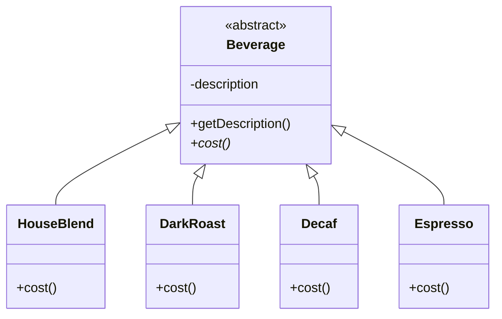
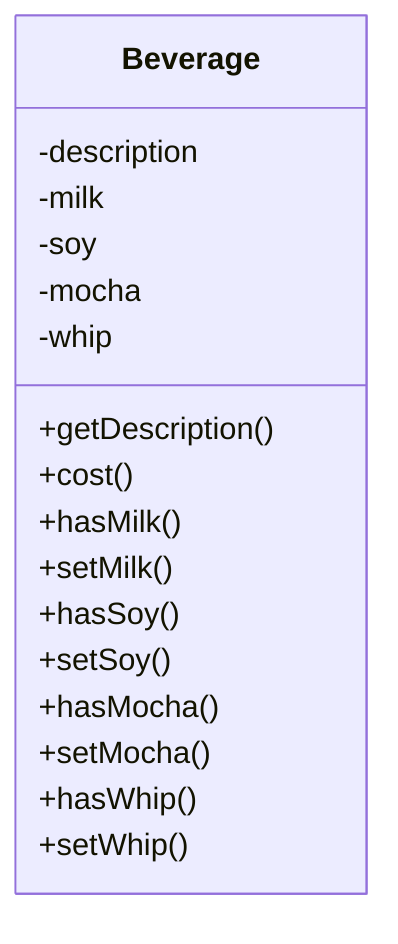
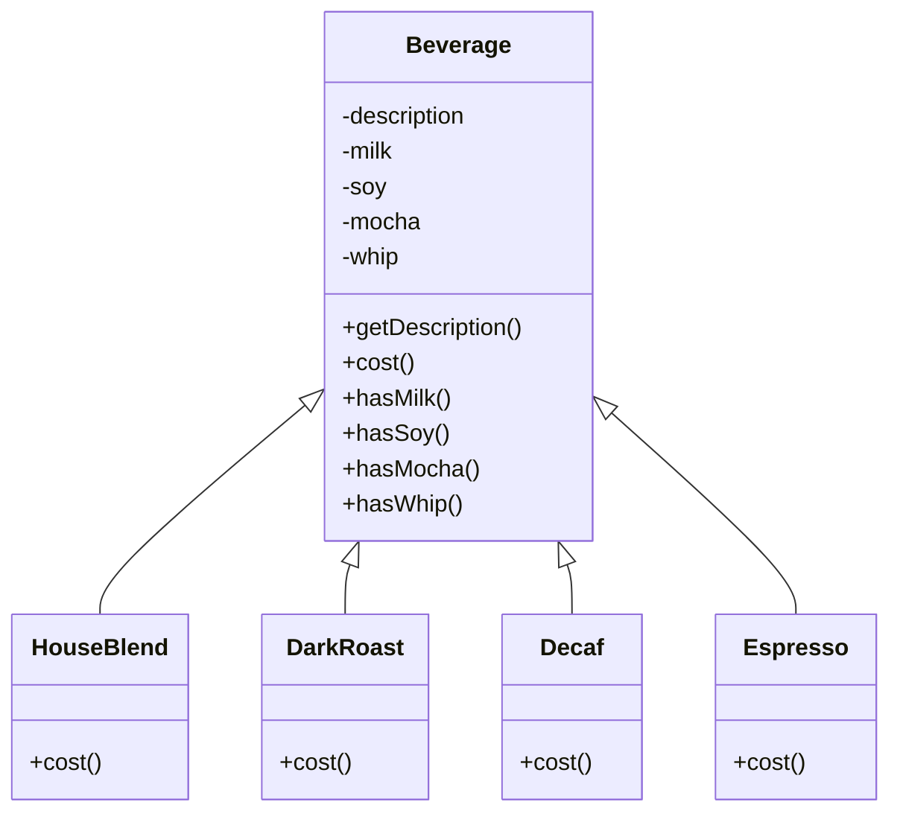
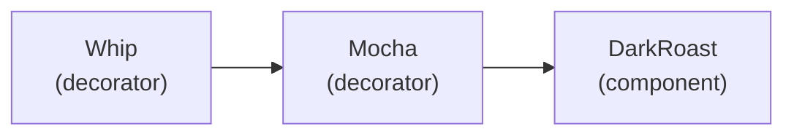
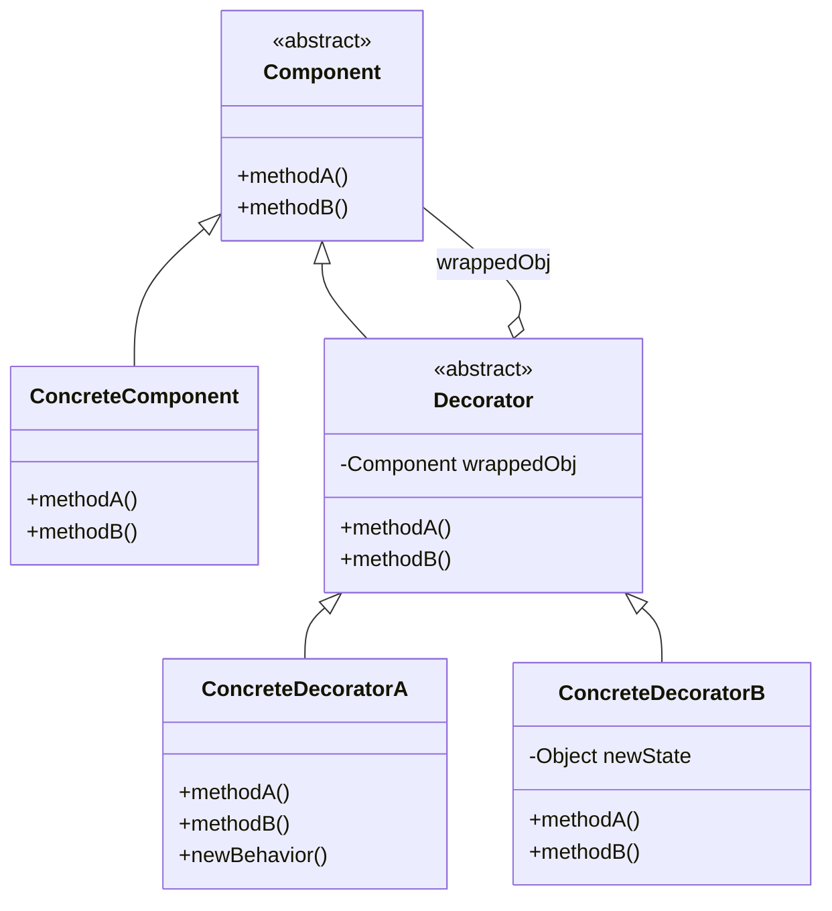
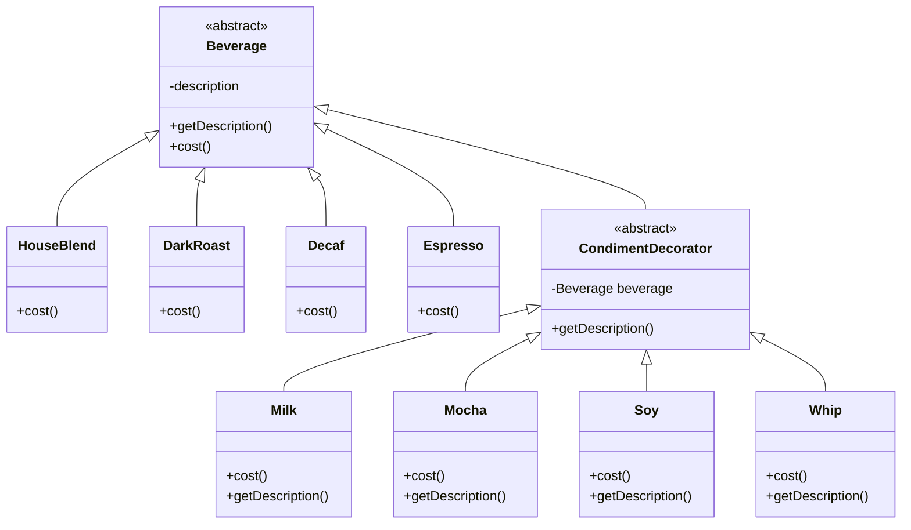
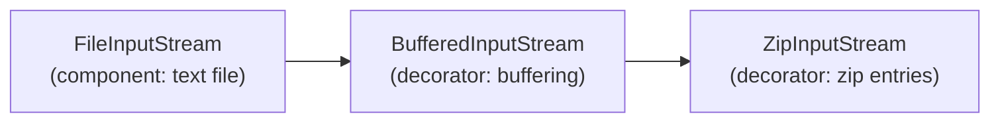
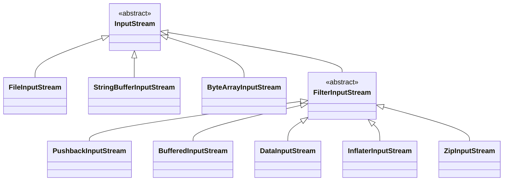

# Capítulo 3: Decorando objetos

> Antes creía que los hombres de verdad subclaseaban todo. Eso fue hasta que aprendí el poder de la extensión en tiempo de ejecución, en lugar de en tiempo de compilación. ¡Ahora mírenme!

Llama a este capítulo «Ojo de diseño para el de la herencia». Volveremos a examinar el uso excesivo típico de la herencia y aprenderás a decorar tus clases en tiempo de ejecución usando una forma de composición de objetos. ¿Por qué? En cuanto conozcas las técnicas de decoración, podrás dar a tus objetos (o a los de alguien más) nuevas responsabilidades sin hacer ningún cambio en el código de las clases subyacentes.

!!! tip "Nota de la traducción"
    Los nombres de clases, interfaces y métodos se mantienen en inglés (`Beverage`, `cost()`, `DarkRoast`...) para que el código siga siendo válido y comparable con el original. La prosa, los comentarios y las explicaciones sí están traducidos.

## Bienvenido a Starbuzz Coffee

Starbuzz Coffee se ha ganado a pulso el nombre de la cafetería de crecimiento más rápido del mundo. Si has visto una en tu barrio, mira a la calle de enfrente; verás otra.

Como han crecido tan rápido, se han volcado en actualizar sus sistemas de pedidos para que coincidan con su oferta de bebidas. Cuando empezaron el negocio diseñaron sus clases así...



- `Beverage` es una clase abstracta, subclaseada por todas las bebidas que se ofrecen en la cafetería.
- La variable de instancia `description` se establece en cada subclase y contiene una descripción de la bebida, como «Most Excellent Dark Roast».
- El método `getDescription()` devuelve la descripción.
- El método `cost()` es abstracto; las subclases necesitan definir su propia implementación.
- Cada subclase implementa `cost()` para devolver el coste de la bebida.

Además de tu café, también puedes pedir varios condimentos como leche vaporizada, soja y mocha (también conocido como chocolate), y que todo se termine coronado con nata montada. Starbuzz cobra un poco por cada condimento, así que realmente necesitan incorporarlos a su sistema de pedidos. Aquí va su primer intento...

!!! note "Explosión de clases"
    Cada subclase `cost()` calcula el coste del café junto con los demás condimentos del pedido.

    ¿Se puede decir «explosión de clases»?

Es bastante obvio que Starbuzz se ha creado una pesadilla de mantenimiento. ¿Qué pasa cuando sube el precio de la leche? ¿Qué hacen cuando añaden un nuevo topping de caramelo?

Yendo más allá del problema de mantenimiento: ¿cuáles de los principios de diseño que hemos visto hasta ahora están violando?

!!! tip "Pista"
    ¡Están violando dos de ellos de forma brutal!

> Esto es estúpido; ¿por qué necesitamos todas estas clases? ¿No podemos usar variables de instancia y herencia en la superclase para llevar el control de los condimentos?

Bueno, vamos a intentarlo. Empecemos con la clase base `Beverage` y añadamos variables de instancia para representar si cada bebida tiene leche, soja, mocha y nata...



- Nuevos valores booleanos para cada condimento.
- Estos métodos obtienen y establecen los valores booleanos de los condimentos.
- Ahora implementaremos `cost()` en `Beverage` (en lugar de mantenerlo abstracto), de modo que pueda calcular los costes asociados a los condimentos de una instancia de bebida concreta. Las subclases seguirán sobrescribiendo `cost()`, pero también invoquen la versión super para poder calcular el coste total de la bebida básica más los costes de los condimentos añadidos.

Ahora añadamos las subclases, una por cada bebida del menú:



- El `cost()` de la superclase calculará los costes de todos los condimentos, mientras que el `cost()` sobrescrito en las subclases extenderá esa funcionalidad para incluir los costes de ese tipo de bebida concreto.
- Cada método `cost()` necesita calcular el coste de la bebida y luego añadir los condimentos llamando a la implementación de `cost()` de la superclase.

!!! exercise "Tu turno"
    Escribe los métodos `cost()` para las siguientes clases (puede ser pseudo-Java):

    ```java
    public class Beverage {
        public double cost() {
        }
    }
    ```

    ```java
    public class DarkRoast extends Beverage {
        public DarkRoast() {
            description = "Most Excellent Dark Roast";
        }
        public double cost() {
        }
    }
    ```

!!! question "Cuestionario"
    ¿Qué requisitos u otros factores podrían cambiar y afectar a este diseño?

- Los cambios de precio de los condimentos nos obligarán a alterar el código existente.
- Los condimentos nuevos nos obligarán a añadir métodos nuevos y alterar el método `cost()` de la superclase.
-Puede que tengamos nuevas bebidas. Para algunas de estas bebidas (¿té helado?), los condimentos no serían apropiados, y sin embargo la subclase `Tea` heredará igualmente métodos como `hasWhip()`.
- ¿Y si un cliente quiere un mocha doble?

> Mira, cinco clases en total. Definitivamente, este es el camino.
>
> No estoy tan seguro; veo algunos problemas potenciales en este enfoque si pienso en cómo podría necesitar cambiar el diseño en el futuro.

!!! note "Nota marginal"
    Como vimos en el Capítulo 1, ¡esto es una muy mala idea!

## Guru y alumno...

**Guru:** Ha pasado algún tiempo desde nuestra última reunión. ¿Has estado meditando profundamente sobre la herencia?

**Alumno:** Sí, Guru. Aunque la herencia es poderosa, he aprendido que no siempre lleva a los diseños más flexibles o mantenibles.

**Guru:** Ah, sí, has avanzado algo. Así que dime, alumno mío, ¿cómo lograrás la reutilización si no es mediante herencia?

**Alumno:** Guru, he aprendido que hay formas de «heredar» comportamiento en tiempo de ejecución mediante composición y delegación.

**Guru:** Por favor, continúa...

**Alumno:** Cuando heredo comportamiento subclaseando, ese comportamiento se fija estáticamente en tiempo de compilación. Además, todas las subclases deben heredar el mismo comportamiento. Sin embargo, si puedo extender el comportamiento de un objeto mediante composición, entonces puedo hacerlo dinámicamente en tiempo de ejecución.

**Guru:** Muy bien; estás empezando a ver el poder de la composición.

**Alumno:** Sí, es posible que añada múltiples responsabilidades nuevas a los objetos mediante esta técnica, incluidas responsabilidades que el diseñador de la superclase ni siquiera había contemplado. ¡Y no tengo que tocar su código!

**Guru:** ¿Qué has aprendido sobre el efecto de la composición en el mantenimiento de tu código?

**Alumno:** Pues bien, eso es justo a lo que iba. Al componer objetos dinámicamente, puedo añadir nueva funcionalidad escribiendo código nuevo en lugar de alterar el código existente. Como no estoy cambiando código existente, las probabilidades de introducir errores o causar efectos secundarios no deseados en el código preexistente se reducen mucho.

**Guru:** Muy bien. Suficiente por hoy. Me gustaría que fueses a meditar más sobre este tema... Recuerda, el código debería estar cerrado (al cambio) como la flor de loto por la tarde, pero abierto (a la extensión) como la flor de loto por la mañana.

## El principio Open-Closed

Vamos con uno de los principios de diseño más importantes.

!!! question "Principio de diseño"
    **Las entidades de software (clases, módulos, funciones, etc.) deberían estar abiertas a la extensión, pero cerradas a la modificación.**

!!! question "Preguntas frecuentes"

    **P: ¿Abierto a la extensión y cerrado a la modificación? Suena muy flexible y abierto a la extensión sin contradicción. ¿Cómo puede un diseño ser ambas cosas?**

    R: Esa es una pregunta muy buena. Ciertamente suena contradictorio al principio. Después de todo, cuanto menos modificable es algo, más difícil es extenderlo, ¿verdad?

    Resulta, sin embargo, que hay algunas técnicas OO ingeniosas que permiten que los sistemas se extiendan, incluso si no podemos cambiar el código subyacente. Piensa en el patrón Observer (del Capítulo 2)... **añadiendo nuevos Observers podemos extender el Subject en cualquier momento, sin añadir código al Subject**. Verás bastantes más formas de extender el comportamiento con otras técnicas de diseño OO.

    **P: ¿Cómo sé qué áreas de cambio son más importantes?**

    R: Eso es en parte cuestión de experiencia en el diseño de sistemas OO y también de conocer el dominio en el que trabajas. Mirar otros ejemplos te ayudará a aprender a identificar áreas de cambio en tus propios diseños.

    Quieres concentrarte en esas áreas que tienen más probabilidades de cambiar en tus diseños y aplicar ahí los principios. **Seguir el principio Open-Closed suele introducir nuevos niveles de abstracción, lo que añade complejidad a nuestro código.**

    !!! warning
        Ten cuidado al elegir las áreas de código que necesitan ser extendidas; **aplicar el principio Open-Closed EN TODAS PARTES es un desperdicio e innecesario**, y puede llevar a un código complejo y difícil de entender.

    **P: Vale, entiendo Observer, pero ¿cómo diseño en general algo que sea extensible y, a la vez, cerrado a la modificación?**

    R: Muchos de los patrones nos dan **diseños probados en el tiempo que protegen tu código de ser modificado, ofreciéndote un medio de extensión**. En este capítulo verás un buen ejemplo de cómo usar el patrón Decorator para seguir el principio Open-Closed.

    **P: ¿Cómo puedo hacer que todas las partes de mi diseño sigan el principio Open-Closed?**

    R: Por lo general no puedes. Hacer que un diseño OO sea flexible y abierto a la extensión sin modificar el código existente lleva tiempo y esfuerzo. En general, no tenemos el lujo de atar cada parte de nuestros diseños (y probablemente sería un desperdicio).

## Conoce el patrón Decorator

> Vale, ya basta de «Club de Diseño Orientado a Objetos». ¡Aquí tenemos problemas reales! ¿Nos recuerdas? ¿Starbuzz Coffee? ¿Crees que podrías usar algunos de esos principios de diseño para ayudarnos de verdad?

Vale, hemos visto que representar nuestras bebidas y condimentos con herencia no ha salido muy bien: obtenemos explosiones de clases y diseños rígidos, o añadimos funcionalidad a la clase base que no es apropiada para algunas subclases.

Así que esto es lo que haremos en su lugar: partiremos de una bebida y la «decoraremos» con los condimentos en tiempo de ejecución. Por ejemplo, si el cliente quiere un Dark Roast con Mocha y Whip, entonces:

1. Empezamos con un objeto `DarkRoast`.
2. Lo decoramos con un objeto `Mocha`.
3. Lo decoramos con un objeto `Whip`.
4. Llamamos al método `cost()` y confiamos en la delegación para sumar los costes de los condimentos.

Vale, pero ¿cómo se «decora» un objeto y cómo entra aquí la delegación? Una pista: piensa en los objetos decorador como «envoltorios». Veamos cómo funciona...

## Construir un pedido con Decorators

Empecemos con nuestro objeto `DarkRoast`.

> Recuerda que `DarkRoast` hereda de `Beverage` y tiene un método `cost()` que calcula el coste de la bebida.

El cliente quiere Mocha, así que creamos un objeto `Mocha` y envolvemos con él el `DarkRoast`.

> El objeto `Mocha` es un decorador. Su tipo refleja el objeto que está decorando; en este caso, un `Beverage`. (Por «refleja» queremos decir que es del mismo tipo.)
>
> Así que `Mocha` también tiene un método `cost()`, y mediante polimorfismo podemos tratar cualquier `Beverage` envuelto en `Mocha` como un `Beverage` también (porque `Mocha` es un subtipo de `Beverage`).

El cliente también quiere Whip, así que creamos un decorador `Whip` y envolvemos con él el `Mocha`.

> `Whip` es un decorador, así que también refleja el tipo de `DarkRoast` e incluye un método `cost()`.

Así que un `DarkRoast` envuelto en `Mocha` y `Whip` sigue siendo un `Beverage` y podemos hacer con él cualquier cosa que haríamos con un `DarkRoast`, incluida llamar a su método `cost()`.



!!! note "El cálculo del coste"
    Ahora toca calcular el coste para el cliente. Lo hacemos llamando a `cost()` en el decorador más externo, `Whip`, y `Whip` delegará el cálculo del coste en los objetos que decora. Y así sucesivamente:

    1. Primero, llamamos a `cost()` en el decorador más externo, `Whip`.
    2. `Whip` llama a `cost()` en `Mocha`.
    3. `Mocha` llama a `cost()` en `DarkRoast`.
    4. `DarkRoast` devuelve su coste, 99 céntimos.
    5. `Mocha` añade su coste, 20 céntimos, al resultado de `DarkRoast`, y devuelve el nuevo total, 1,19 $.
    6. `Whip` añade su total, 10 céntimos, al resultado de `Mocha`, y devuelve el resultado final: 1,29 $.

Vale, esto es lo que sabemos hasta ahora sobre los Decorators...

- Los decoradores tienen el mismo supertipo que los objetos que decoran.
- Puedes usar uno o más decoradores para envolver un objeto.
- Dado que el decorador tiene el mismo supertipo que el objeto que decora, podemos pasar un objeto decorado en lugar del objeto original (envuelto). **¡Punto clave!**
- El decorador añade su propio comportamiento antes y/o después de delegar en el objeto que decora para hacer el resto del trabajo.
- Los objetos se pueden decorar en cualquier momento, así que podemos decorar objetos dinámicamente en tiempo de ejecución con tantos decoradores como queramos.

Ahora veamos cómo funciona esto de verdad, viendo la definición del patrón Decorator y escribiendo algo de código.

## El patrón Decorator definido

Primero echemos un vistazo a la descripción del patrón Decorator:

!!! question "El patrón Decorator"
    **El patrón Decorator adjunta responsabilidades adicionales a un objeto de forma dinámica. Los decoradores proporcionan una alternativa flexible a la subclase para extender la funcionalidad.**

Aunque eso describe el papel del patrón Decorator, no nos da mucha idea de cómo aplicaríamos el patrón a nuestra propia implementación. Veamos el diagrama de clases, que es un poco más revelador (en la página siguiente veremos la misma estructura aplicada al problema de las bebidas).



- Cada componente se puede usar por sí solo o envuelto por un decorador.
- El `ConcreteComponent` es el objeto al que vamos a añadir nuevo comportamiento de forma dinámica. Extiende `Component`.
- Cada decorador **TIENE-UN** (envuelve) un componente, lo que significa que el decorador tiene una variable de instancia que guarda una referencia a un componente.
- Los decoradores implementan la misma interfaz o clase abstracta que el componente que van a decorar.
- Los decoradores pueden extender el estado del componente.
- El `ConcreteDecorator` hereda (de la clase `Decorator`) una variable de instancia para la cosa que decora (el `Component` que envuelve el `Decorator`).
- Los decoradores pueden añadir métodos nuevos; sin embargo, el nuevo comportamiento normalmente se añade haciendo cálculos antes o después de un método existente en el componente.

## Decorando nuestras bebidas

Rehagamos nuestras bebidas de Starbuzz usando el patrón Decorator...



- `Beverage` actúa como nuestra clase componente abstracta.
- Aquí está la referencia al `Beverage` que los decoradores van a envolver.
- Los cuatro componentes concretos, uno por tipo de café.
- Y aquí están nuestros decoradores de condimentos; fíjate en que necesitan implementar no solo `cost()`, sino también `getDescription()`. Veremos por qué en un momento...

!!! question "Tu turno"
    Antes de seguir, piensa en cómo implementarías el método `cost()` de los cafés y de los condimentos. Piensa también en cómo implementarías el método `getDescription()` de los condimentos.

## Conversación de cubículo

Algo de confusión entre herencia y composición.

**Mary:** Vale, estoy un poco confundida... Pensé que no íbamos a usar herencia en este patrón. Creía que íbamos a apoyarnos en la composición.

**Sue:** ¿A qué te refieres?

**Mary:** Mira el diagrama de clases. El `CondimentDecorator` está extendiendo la clase `Beverage`. Eso es herencia, ¿no?

**Sue:** Es verdad. Creo que la clave es que es vital que los decoradores tengan el mismo tipo que los objetos que van a decorar. Así que aquí estamos usando la herencia para conseguir la coincidencia de tipos, pero no estamos usando la herencia para obtener comportamiento.

**Mary:** Vale, veo cómo los decoradores necesitan la misma «interfaz» que los componentes que envuelven, porque necesitan ocupar el lugar del componente. Pero, ¿dónde entra el comportamiento?

**Sue:** Cuando componemos un decorador con un componente, estamos añadiendo nuevo comportamiento. Adquirimos nuevo comportamiento no heredándolo de una superclase, sino componiendo objetos entre sí.

**Mary:** Vale, así que estamos subclaseando la clase abstracta `Beverage` para tener el tipo correcto, no para heredar su comportamiento. El comportamiento llega a través de la composición de decoradores con los componentes base, así como con otros decoradores.

**Sue:** Eso es.

**Mary:** ¡Ah, ya lo pillo! Y como estamos usando composición de objetos, obtenemos muchísima más flexibilidad para mezclar y combinar condimentos y bebidas. Muy elegante.

**Sue:** Sí, si nos apoyamos en la herencia, entonces nuestro comportamiento solo puede determinarse estáticamente en tiempo de compilación. En otras palabras, solo obtenemos el comportamiento que nos da la superclase o el que sobrescribimos. Con la composición, podemos mezclar y combinar decoradores como queramos... en tiempo de ejecución.

**Mary:** Ya entiendo: podemos implementar nuevos decoradores en cualquier momento para añadir nuevo comportamiento. Si nos apoyáramos en la herencia, tendríamos que entrar a cambiar el código existente cada vez que quisiéramos un comportamiento nuevo.

**Sue:** Exacto.

**Mary:** Solo tengo una pregunta más: si lo único que necesitamos heredar es el tipo del componente, ¿por qué no usamos una interfaz en lugar de una clase abstracta para la clase `Beverage`?

**Sue:** Bueno, recuerda que, cuando recibimos este código, Starbuzz ya tenía una clase abstracta `Beverage`. Tradicionalmente el patrón Decorator especifica un componente abstracto, pero en Java, obviamente, podríamos usar una interfaz. Pero siempre intentamos evitar alterar el código existente, así que no lo «arregles» si la clase abstracta funciona bien.

## Formación de nuevos baristas

> Vamos, necesito que me hagas un doble mocha soy latte con whip.

Haz un dibujo de lo que ocurre cuando el pedido es una bebida «doble mocha soy latte con whip». Usa el menú para obtener los precios correctos y dibuja tu esquema usando el mismo formato que usamos antes (unas páginas atrás):

!!! info "Starbuzz Coffee — menú"
    | Cafés | Precio | Condimentos | Precio |
    | --- | --- | --- | --- |
    | House Blend | 0,89 $ | Steamed Milk | 0,10 $ |
    | Dark Roast | 0,99 $ | Mocha | 0,20 $ |
    | Decaf | 1,05 $ | Soy | 0,15 $ |
    | Espresso | 1,99 $ | Whip | 0,10 $ |

!!! tip "Pista"
    Puedes construir «doble mocha soy latte con whip» combinando `HouseBlend`, `Soy`, dos `Mocha` y `Whip`.

## Escribir el código de Starbuzz

Es hora de convertir este diseño en código real. Empecemos con la clase `Beverage`, que no necesita cambiar respecto del diseño original de Starbuzz. Echemos un vistazo:

```java
public abstract class Beverage {
    String description = "Unknown Beverage";

    public String getDescription() {
        return description;
    }

    public abstract double cost();
}
```

- `Beverage` es una clase abstracta con los dos métodos `getDescription()` y `cost()`.
- `getDescription()` ya está implementado por nosotros, pero necesitamos implementar `cost()` en las subclases.

`Beverage` es bastante sencilla. Implementemos también la clase abstracta de los condimentos (el Decorator):

```java
public abstract class CondimentDecorator extends Beverage {
    Beverage beverage;

    public abstract String getDescription();
}
```

- Primero, necesitamos ser intercambiables con un `Beverage`, así que extendemos la clase `Beverage`.
- Aquí está el `Beverage` que cada Decorator va a envolver. Fíjate en que usamos el supertipo `Beverage` para referirnos al `Beverage`, de modo que el Decorator pueda envolver cualquier bebida.
- También vamos a exigir que todos los decoradores de condimentos reimplementen el método `getDescription()`. De nuevo, veremos por qué en un segundo...

## Codificar las bebidas

Ahora que hemos quitado de en medio las clases base, implementemos algunas bebidas. Empezaremos con `Espresso`. Recuerda que necesitamos establecer una descripción para la bebida concreta y también implementar el método `cost()`.

```java
public class Espresso extends Beverage {

    public Espresso() {
        description = "Espresso";
    }

    public double cost() {
        return 1.99;
    }
}
```

- Primero extendemos la clase `Beverage`, ya que esto es una bebida.
- Para encargarnos de la descripción, la establecemos en el constructor de la clase. Recuerda que la variable de instancia `description` se hereda de `Beverage`.
- Finalmente, necesitamos calcular el coste de un Espresso. No tenemos que preocuparnos por añadir condimentos en esta clase, solo devolver el precio de un Espresso: 1,99 $.

```java
public class HouseBlend extends Beverage {

    public HouseBlend() {
        description = "House Blend Coffee";
    }

    public double cost() {
        return .89;
    }
}
```

> Vale, aquí tienes otra bebida. Todo lo que hacemos es establecer la descripción apropiada, «House Blend Coffee», y devolver el coste correcto: 89 ¢.

Puedes crear las otras dos clases de bebida (`DarkRoast` y `Decaf`) exactamente de la misma manera.

## Codificar los condimentos

Si vuelves a mirar el diagrama de clases del patrón Decorator, verás que ya hemos escrito nuestro componente abstracto (`Beverage`), tenemos nuestros componentes concretos (`HouseBlend`) y tenemos nuestro decorador abstracto (`CondimentDecorator`). Ahora toca implementar los decoradores concretos. Aquí está `Mocha`:

```java
public class Mocha extends CondimentDecorator {

    public Mocha(Beverage beverage) {
        this.beverage = beverage;
    }

    public String getDescription() {
        return beverage.getDescription() + ", Mocha";
    }

    public double cost() {
        return beverage.cost() + .20;
    }
}
```

- Recuerda que `CondimentDecorator` extiende `Beverage`.
- `Mocha` es un decorador, así que extendemos `CondimentDecorator`.
- Vamos a instanciar `Mocha` con una referencia a un `Beverage`. Recuerda que esta clase hereda la variable de instancia `Beverage` para guardar la bebida que estamos envolviendo.
- Establecemos esta variable de instancia en el objeto que estamos envolviendo. Aquí estamos pasando la bebida que envolvemos al constructor del decorador.
- Queremos que nuestra descripción incluya no solo la bebida —digamos «Dark Roast»—, sino también cada elemento que decora la bebida (por ejemplo, «Dark Roast, Mocha»). Así que primero delegamos en el objeto que decoramos para obtener su descripción, y luego añadimos «, Mocha» a esa descripción.
- Ahora necesitamos calcular el coste de nuestra bebida con `Mocha`. Primero, delegamos la llamada en el objeto que decoramos para que pueda calcular el coste; luego, añadimos el coste de `Mocha` al resultado.

En la página siguiente instanciaremos de verdad la bebida y la envolveremos con todos sus condimentos (decoradores), pero antes...

!!! exercise "Tu turno"
    Escribe y compila el código de los otros condimentos, `Soy` y `Whip`. Los necesitarás para terminar y probar la aplicación.

## Servir algunos cafés

Enhorabuena. Es hora de recostarse, pedir unos cuantos cafés y maravillarse con el diseño flexible que has creado con el patrón Decorator.

Aquí tienes algo de código de prueba para hacer pedidos:

```java
public class StarbuzzCoffee {

    public static void main(String args[]) {
        Beverage beverage = new Espresso();
        System.out.println(beverage.getDescription()
                + " $" + beverage.cost());

        Beverage beverage2 = new DarkRoast();
        beverage2 = new Mocha(beverage2);
        beverage2 = new Mocha(beverage2);
        beverage2 = new Whip(beverage2);
        System.out.println(beverage2.getDescription()
                + " $" + beverage2.cost());

        Beverage beverage3 = new HouseBlend();
        beverage3 = new Soy(beverage3);
        beverage3 = new Mocha(beverage3);
        beverage3 = new Whip(beverage3);
        System.out.println(beverage3.getDescription()
                + " $" + beverage3.cost());
    }
}
```

- Pide un espresso, sin condimentos, e imprime su descripción y su coste.
- Crea un objeto `DarkRoast`. Envuélvelo con un `Mocha`. Envuélvelo con un segundo `Mocha`. Envuélvelo con un `Whip`.
- Por último, danos un `HouseBlend` con `Soy`, `Mocha` y `Whip`.
- Veremos una forma mucho mejor de crear objetos decorados cuando cubramos los patrones Factory y Builder. Ten en cuenta que el patrón Builder se cubre en el Apéndice.

Ahora, metamos esos pedidos:

```text
% java StarbuzzCoffee
Espresso $1.99
Dark Roast Coffee, Mocha, Mocha, Whip $1.49
House Blend Coffee, Soy, Mocha, Whip $1.34
```

!!! question "Preguntas frecuentes"

    **P: Me preocupa un poco el código que pueda comprobar un componente concreto específico —digamos `HouseBlend`— y hacer algo, como aplicar un descuento. Una vez que he envuelto el `HouseBlend` con decoradores, esto ya no va a funcionar.**

    R: Eso es exactamente así. Si tienes código que se apoya en el tipo del componente concreto, los decoradores romperán ese código. Mientras solo escribas código contra el tipo del componente abstracto, el uso de decoradores seguirá siendo transparente para tu código. Sin embargo, en cuanto empieces a escribir código contra componentes concretos, querrás replantearte el diseño de tu aplicación y tu uso de los decoradores.

    **P: ¿No sería fácil que algún cliente de una bebida acabara con un decorador que no fuera el más externo? Por ejemplo, si tuviera un `DarkRoast` con `Mocha`, `Soy` y `Whip`, sería fácil escribir código que acabara con una referencia a `Soy` en lugar de a `Whip`, lo que significa que no incluiría `Whip` en el pedido.**

    R: Se podría argumentar que con el patrón Decorator tienes que gestionar más objetos y por eso hay más posibilidades de que errores de programación introduzcan el tipo de problemas que sugieres. Sin embargo, normalmente creamos los decoradores usando otros patrones como Factory y Builder. Una vez que hayamos cubierto estos patrones, verás que la creación del componente concreto con su decorador está «bien encapsulada» y no lleva a este tipo de problemas.

    **P: ¿Pueden los decoradores conocer las otras decoraciones de la cadena? Supongamos que quiero que mi método `getDescription()` imprima «Whip, Double Mocha» en lugar de «Mocha, Whip, Mocha». Eso requeriría que mi decorador más externo conociera todos los decoradores que está envolviendo.**

    R: Los decoradores están pensados para añadir comportamiento al objeto que envuelven. Cuando necesitas asomarte a varias capas de la cadena de decoradores, empiezas a forzar el decorador más allá de su verdadera intención. Aun así, esas cosas son posibles. Imagina un decorador `CondimentPrettyPrint` que analice la descripción final y pueda imprimir «Mocha, Whip, Mocha» como «Whip, Double Mocha». Ten en cuenta que `getDescription()` podría devolver un `ArrayList` de descripciones para facilitarlo.

!!! exercise "Tu turno: tamaños"
    Nuestros amigos de Starbuzz han introducido tamaños en su menú. Ahora puedes pedir un café en tall, grande y venti (traducción: pequeño, mediano y grande). Starbuzz lo veía como parte intrínseca de la clase del café, así que han añadido dos métodos a la clase `Beverage`: `setSize()` y `getSize()`. También les gustaría que los condimentos se cobraran según el tamaño, de modo que, por ejemplo, `Soy` cuesta 10 ¢, 15 ¢ y 20 ¢, respectivamente, para cafés tall, grande y venti. La clase `Beverage` actualizada se muestra a continuación.

    ¿Cómo alterarías las clases decorador para manejar este cambio de requisitos?

    ```java
    public abstract class Beverage {
        public enum Size { TALL, GRANDE, VENTI };
        Size size = Size.TALL;
        String description = "Unknown Beverage";

        public String getDescription() {
            return description;
        }

        public void setSize(Size size) {
            this.size = size;
        }

        public Size getSize() {
            return this.size;
        }

        public abstract double cost();
    }
    ```

## Decoradores del mundo real: Java I/O

El gran número de clases del paquete `java.io` es... abrumador. No te sientas solo si dijiste «whoa» la primera (y segunda y tercera) vez que miraste esta API. Pero ahora que conoces el patrón Decorator, las clases de E/S deberían tener más sentido, ya que el paquete `java.io` está basado en gran medida en Decorator. Aquí tienes un conjunto típico de objetos que usan decoradores para añadir funcionalidad a la lectura de datos de un archivo:



- `FileInputStream` es el componente que se está decorando. La biblioteca de E/S de Java suministra varios componentes, como `FileInputStream`, `StringBufferInputStream`, `ByteArrayInputStream` y algunos más. Todos nos dan un componente base desde el que leer bytes.
- `BufferedInputStream` es un decorador concreto. Añade comportamiento de buffering a un `FileInputStream`: almacena la entrada en búfer para mejorar el rendimiento.
- `ZipInputStream` también es un decorador concreto. Añade la capacidad de leer entradas de archivos zip a medida que lee datos.

## Decorar las clases de java.io

`BufferedInputStream` y `ZipInputStream` extienden ambas `FilterInputStream`, que extiende `InputStream`. `InputStream` actúa como la clase decoradora abstracta:



- Aquí está nuestro componente abstracto.
- `FilterInputStream` es un decorador abstracto.
- Estos `InputStream` actúan como los componentes concretos que envolveremos con decoradores. Hay unos cuantos más que no mostramos, como `ObjectInputStream`.
- Y por último, aquí están todos nuestros decoradores concretos.

Puedes ver que esto no es tan distinto del diseño de Starbuzz. Ahora deberías estar en buena posición para revisar la documentación de la API de `java.io` y componer decoradores sobre los distintos flujos de entrada.

Verás que los flujos de salida tienen el mismo diseño. Y probablemente ya hayas descubierto que los flujos `Reader`/`Writer` (para datos basados en caracteres) reflejan de cerca el diseño de las clases de flujos (con algunas diferencias e inconsistencias, pero lo bastante cerca como para entender qué está pasando).

Java I/O también señala uno de los inconvenientes del patrón Decorator: los diseños que usan este patrón a menudo dan como resultado un gran número de clases pequeñas que pueden abrumar a un desarrollador que intenta usar una API basada en Decorator. Pero ahora que sabes cómo funciona Decorator, puedes mantener las cosas en perspectiva y, cuando uses la API cargada de Decorators de otra persona, puedes entender cómo están organizadas sus clases para poder usar fácilmente el envolvimiento y obtener el comportamiento que buscas.

## Escribe tu propio decorador de E/S de Java

Vale, conoces el patrón Decorator y has visto el diagrama de clases de E/S. Deberías estar listo para escribir tu propio decorador de entrada.

¿Qué tal esto?: escribe un decorador que convierta todos los caracteres en mayúsculas a minúsculas en el flujo de entrada. En otras palabras, si leemos «I know the Decorator Pattern therefore I RULE!», tu decorador lo convierte en «i know the decorator pattern therefore i rule!»

> No hay problema. Solo tengo que extender la clase `FilterInputStream` y sobrescribir los métodos `read()`.

```java
public class LowerCaseInputStream extends FilterInputStream {

    public LowerCaseInputStream(InputStream in) {
        super(in);
    }

    public int read() throws IOException {
        int c = in.read();
        return (c == -1 ? c : Character.toLowerCase((char)c));
    }

    public int read(byte[] b, int offset, int len) throws IOException {
        int result = in.read(b, offset, len);
        for (int i = offset; i < offset+result; i++) {
            b[i] = (byte)Character.toLowerCase((char)b[i]);
        }
        return result;
    }
}
```

- Primero, extiende `FilterInputStream`, el decorador abstracto de todos los `InputStream`.
- No te olvides de importar `java.io...` (no se muestra).
- Ahora necesitamos implementar dos métodos `read`. Toman un byte (o un array de bytes) y convierten cada byte (que representa un carácter) a minúscula si es una mayúscula.

!!! warning "Recuerda"
    No incluimos las sentencias `import` y `package` en los listados de código. Consigue el código fuente completo en https://wickedlysmart.com/head-first-design-patterns.

## Prueba tu nuevo decorador de E/S de Java

Escribe algo de código rápido para probar el decorador de E/S:

```java
public class InputTest {
    public static void main(String[] args) throws IOException {
        int c;

        try {
            InputStream in =
                new LowerCaseInputStream(
                    new BufferedInputStream(
                        new FileInputStream("test.txt")));

            while((c = in.read()) >= 0) {
                System.out.print((char)c);
            }

            in.close();
        } catch (IOException e) {
            e.printStackTrace();
        }
    }
}
```

- Configura el `FileInputStream` y decóralo, primero con un `BufferedInputStream` y luego con nuestro flamante filtro `LowerCaseInputStream`.
- Solo usa el flujo para leer caracteres hasta el final del archivo e imprimirlos a medida que avanzas.
- Necesitas crear este archivo.

Archivo `test.txt`:

```text
I know the Decorator Pattern therefore I RULE!
```

Pruébalo:

```text
% java InputTest
i know the decorator pattern therefore i rule!
```

## Patrones al descubierto

!!! example "La entrevista de esta semana: Confesiones de un Decorator"
    **Head First:** Bienvenido, patrón Decorator. Hemos oído que últimamente estás un poco deprimido.

    **Decorator:** Sí, sé que el mundo me ve como el patrón de diseño glamuroso, pero ya sabes, tengo mi buena ración de problemas como todo el mundo.

    **Head First:** ¿Podrías contarnos algunos de tus problemas?

    **Decorator:** Claro. Bueno, ya sabes que tengo el poder de añadir flexibilidad a los diseños, eso es seguro, pero también tengo un lado oscuro. Verás, a veces puedo añadir un montón de clases pequeñas a un diseño, y esto ocasionalmente da como resultado un diseño que no es del todo fácil de entender para los demás.

    **Head First:** ¿Puedes darnos un ejemplo?

    **Decorator:** Piensa en las bibliotecas de Java I/O. Son notoriamente difíciles de entender al principio. Pero si la gente viera las clases como un conjunto de envoltorios alrededor de un `InputStream`, la vida sería mucho más fácil.

    **Head First:** Eso no suena tan mal. Sigues siendo un gran patrón, y mejorar esto es solo cuestión de educación pública, ¿no?

    **Decorator:** Me temo que hay más. Tengo problemas de tipado: verás, a veces la gente toma un trozo de código cliente que se apoya en tipos específicos e introduce decoradores sin pensarlo todo bien. Una cosa buena de mí es que normalmente puedes insertar decoradores de forma transparente y el cliente nunca tiene que saber que está tratando con un decorador. Pero, como decía, algo de código depende de tipos específicos y, cuando empiezas a introducir decoradores, ¡pum! Ocurren cosas malas.

    **Head First:** Bueno, creo que todo el mundo entiende que hay que tener cuidado al insertar decoradores. No creo que sea motivo para estar tan deprimido.

    **Decorator:** Lo sé, intento no estarlo. También tengo el problema de que introducir decoradores puede aumentar la complejidad del código necesario para instanciar el componente. Una vez que tienes decoradores, no solo tienes que instanciar el componente, sino también envolverlo con quién sabe cuántos decoradores.

    **Head First:** La semana que viene entrevistaré a los patrones Factory y Builder. Me han dicho que pueden ser muy útiles con esto...

    **Decorator:** Es cierto; debería hablar con esos chicos más a menudo.

    **Head First:** Bueno, todos pensamos que eres un gran patrón para crear diseños flexibles y mantenerte fiel al principio Open-Closed, así que ¡ánimo y piensa en positivo!

    **Decorator:** Haré lo posible, gracias.

## Herramientas para tu caja de diseño

Has terminado otro capítulo y tienes un nuevo principio y un nuevo patrón en tu caja de herramientas.

!!! abstract "Conceptos básicos de OO"
    - **Abstracción**
    - **Encapsulación**
    - **Polimorfismo**
    - **Herencia**

!!! abstract "Principios de OO"
    - Encapsula lo que varía.
    - Favorece la composición sobre la herencia.
    - Programa contra interfaces, no contra implementaciones.
    - Esfuérzate por lograr diseños débilmente acoplados entre objetos que interactúan.
    - **Las clases deberían estar abiertas a la extensión, pero cerradas a la modificación.**

!!! abstract "Patrones de OO"
    - **Strategy** — define una familia de algoritmos, encapsula cada uno y los hace intercambiables. Strategy permite que el algoritmo varíe independientemente de los clientes que lo usan.
    - **Observer** — define una dependencia de uno a muchos entre objetos, de modo que cuando un objeto cambia de estado, todos sus dependientes son notificados y actualizados automáticamente.
    - **Decorator** — adjunta responsabilidades adicionales a un objeto de forma dinámica. Los decoradores proporcionan una alternativa flexible a la subclase para extender la funcionalidad.

!!! note "Lo que hemos aprendido sobre Decorator"
    - La herencia es una forma de extensión, pero no necesariamente la mejor manera de conseguir flexibilidad en nuestros diseños.
    - En nuestros diseños deberíamos permitir que el comportamiento se extienda sin necesidad de modificar el código existente.
    - La composición y la delegación a menudo pueden usarse para añadir nuevos comportamientos en tiempo de ejecución.
    - El patrón Decorator proporciona una alternativa a la subclase para extender el comportamiento.
    - El patrón Decorator implica un conjunto de clases decoradoras que se usan para envolver componentes concretos.
    - Las clases decoradoras reflejan el tipo de los componentes que decoran. (De hecho, son del mismo tipo que los componentes que decoran, ya sea mediante herencia o implementación de interfaz.)
    - Los decoradores cambian el comportamiento de sus componentes añadiendo nueva funcionalidad antes y/o después (o incluso en lugar) de las llamadas a métodos del componente.
    - Puedes envolver un componente con cualquier número de decoradores.
    - Los decoradores suelen ser transparentes para el cliente del componente, es decir, a menos que el cliente se apoye en el tipo concreto del componente.
    - Los decoradores pueden dar lugar a muchos objetos pequeños en nuestro diseño, y el abuso puede resultar complejo.

    Tenemos ahora el principio Open-Closed para guiarnos. Vamos a esforzarnos por diseñar nuestro sistema de modo que las partes cerradas queden aisladas de nuestras nuevas extensiones.

    Y aquí está nuestro primer patrón para crear diseños que satisfacen el principio Open-Closed. ¿O era realmente el primero? ¿Hay otro patrón que hayamos usado que también siga este principio?

## Soluciones de los ejercicios

!!! success "Solución: escribe los métodos cost()"
    Escribe los métodos `cost()` para las siguientes clases (el pseudo-Java vale). Esta es nuestra solución:

    ```java
    public class Beverage {
        // declare instance variables for milkCost,
        // soyCost, mochaCost, and whipCost, and
        // getters and setters for milk, soy, mocha
        // and whip.
        public double cost() {
            double condimentCost = 0.0;
            if (hasMilk()) {
                condimentCost += milkCost;
            }
            if (hasSoy()) {
                condimentCost += soyCost;
            }
            if (hasMocha()) {
                condimentCost += mochaCost;
            }
            if (hasWhip()) {
                condimentCost += whipCost;
            }
            return condimentCost;
        }
    }
    ```

    ```java
    public class DarkRoast extends Beverage {
        public DarkRoast() {
            description = "Most Excellent Dark Roast";
        }
        public double cost() {
            return 1.99 + super.cost();
        }
    }
    ```

!!! success "Solución: formación de baristas"
    «Doble mocha soy latte con whip»:

    1. Primero, llamamos a `cost()` en el decorador más externo, `Whip`.
    2. `Whip` llama a `cost()` en `Mocha`.
    3. `Mocha` llama a `cost()` en otro `Mocha`.
    4. Después, `Mocha` llama a `cost()` en `Soy`.
    5. ¡Último topping! `Soy` llama a `cost()` en `HouseBlend`.
    6. El método `cost()` de `HouseBlend` devuelve .89 y sale de la pila.
    7. El método `cost()` de `Soy` añade .15 y devuelve el resultado; luego sale de la pila.
    8. El método `cost()` del segundo `Mocha` añade .20 y devuelve el resultado; luego sale de la pila.
    9. El método `cost()` del primer `Mocha` añade .20 y devuelve el resultado; luego sale de la pila.
    10. Finalmente, el resultado vuelve al `cost()` de `Whip`, que añade .10, dándonos un coste final de 1,54 $.

!!! success "Solución: tamaños"
    Nuestros amigos de Starbuzz han introducido tamaños en su menú. Ahora puedes pedir un café en tall, grande y venti (traducción: pequeño, mediano y grande). Starbuzz lo veía como parte intrínseca de la clase del café, así que han añadido dos métodos a la clase `Beverage`: `setSize()` y `getSize()`. También les gustaría que los condimentos se cobraran según el tamaño, de modo que, por ejemplo, `Soy` cuesta 10 ¢, 15 ¢ y 20 ¢, respectivamente, para cafés tall, grande y venti.

    ¿Cómo alterarías las clases decorador para manejar este cambio de requisitos? Esta es nuestra solución.

    ```java
    public abstract class CondimentDecorator extends Beverage {
        public Beverage beverage;

        public abstract String getDescription();

        public Size getSize() {
            return beverage.getSize();
        }
    }
    ```

    ```java
    public class Soy extends CondimentDecorator {
        public Soy(Beverage beverage) {
            this.beverage = beverage;
        }

        public String getDescription() {
            return beverage.getDescription() + ", Soy";
        }

        public double cost() {
            double cost = beverage.cost();
            if (beverage.getSize() == Size.TALL) {
                cost += .10;
            } else if (beverage.getSize() == Size.GRANDE) {
                cost += .15;
            } else if (beverage.getSize() == Size.VENTI) {
                cost += .20;
            }
            return cost;
        }
    }
    ```

    - Añadimos un método, `getSize()`, para los decoradores, que simplemente devuelve el tamaño de la bebida.
    - Aquí obtenemos el tamaño (que se propaga hasta la bebida concreta) y luego añadimos el coste correspondiente.
