# Capítulo 4: El patrón Factory

> **¡A hornear con la bondad de la OO!**
>
> Prepárate para hornear algunos diseños OO débilmente acoplados. Hay más en la creación de objetos que simplemente usar el operador `new`. Aprenderás que la instanciación es una actividad que no siempre debería hacerse a la vista de todos y que a menudo puede provocar problemas de acoplamiento. Y no queremos eso, ¿verdad? Descubre cómo los patrones Factory pueden salvarte de dependencias tan bochornosas.

> Okay, ya van tres capítulos y todavía no has respondido a mi pregunta sobre `new`. Se supone que no debemos programar contra una implementación, pero cada vez que uso `new` es exactamente eso lo que estoy haciendo, ¿verdad?

**Cuando veas «new», piensa «concreto».**

Sí: cuando usas el operador `new` seguro que estás instanciando una clase concreta, así que eso es definitivamente una implementación y no una interfaz. Y haces una buena observación: atar tu código a una clase concreta puede hacerlo más frágil y menos flexible.

```java
Duck duck = new MallardDuck();
```

!!! note "¡Pero tenemos que crear una instancia de una clase concreta!"

    Queremos usar tipos abstractos para mantener el código flexible.

Cuando tenemos un conjunto completo de clases concretas relacionadas, a menudo acabamos escribiendo código como este:

```java
Duck duck;
if (picnic) {
    duck = new MallardDuck();
} else if (hunting) {
    duck = new DecoyDuck();
} else if (inBathTub) {
    duck = new RubberDuck();
}
```

!!! note "Tenemos un montón de clases de patos distintas"

    y no sabemos hasta el momento de ejecución cuál necesitamos instanciar.

Aquí tenemos varias clases concretas que se están instanciando, y la decisión de cuál instanciar se toma en tiempo de ejecución dependiendo de cierto conjunto de condiciones. Cuando ves código como este, sabes que cuando llegue el momento de hacer cambios o extensiones vas a tener que reabrir este código y examinar qué hace falta añadir (o borrar). A menudo este tipo de código acaba repartido en varias partes de la aplicación, lo que hace que el mantenimiento y las actualizaciones sean más difíciles y propensos a errores.

> Pero tienes que crear un objeto en algún momento, y Java solo nos da una forma de crear un objeto, ¿no? Entonces, ¿qué ingenuity hay aquí?

## ¿Qué tiene de malo «new»?

Técnicamente no hay nada malo en el operador `new`. Después de todo, es una parte fundamental de la mayoría de los lenguajes orientados a objetos modernos. El verdadero culpable es nuestra vieja amiga: la diferencia, y cómo la diferencia afecta a nuestro uso de `new`.

Al programar contra una interfaz, sabes que puedes aislarte de muchos de los cambios que podrían producirse en un sistema a largo plazo. ¿Por qué? Porque si tu código está escrito contra una interfaz, funcionará con cualquier clase nueva que implemente esa interfaz mediante polimorfismo. Sin embargo, cuando tienes código que hace uso de muchas clases concretas, estás pidiendo problemas, porque puede que haya que modificar ese código a medida que se añadan nuevas clases concretas. Es decir, tu código no estará «cerrado a la modificación». Para extender tu código con nuevos tipos concretos tendrás que reabrirlo.

!!! note "Recuerda que los diseños deben estar «abiertos a la extensión pero cerrados a la modificación»"

    Consulta el capítulo 3 para repasarlo.

¿Entonces qué puedes hacer? Son momentos como estos en los que puedes recurrir a los principios de diseño OO para buscar pistas. Recuerda: nuestro primer principio trata sobre la diferencia y nos guía para identificar los aspectos que varían y separarlos de lo que se mantiene constante.

!!! question "¿Cómo se encapsula entonces la creación de objetos?"

    ¿Cómo podrías tomar todas las partes de tu aplicación que instancian clases concretas y separarlas o encapsularlas del resto de tu aplicación?

## Identificar los aspectos que varían

Digamos que tienes una pizzería y que, como dueño de una pizzería de vanguardia en Objectville, acabas escribiendo un código como este:

```java
Pizza orderPizza() {
    Pizza pizza = new Pizza();
    pizza.prepare();
    pizza.bake();
    pizza.cut();
    pizza.box();
    return pizza;
}
```

!!! note "Para tener flexibilidad, realmente querríamos que esto fuera una clase abstracta o una interfaz"

    pero por desgracia no podemos instanciar directamente ninguna de las dos.

**Pero necesitas más de un tipo de pizza...**

Así que añadirías algo de código que determina el tipo de pizza apropiado y luego se pone a fabricar la pizza:

```java
Pizza orderPizza(String type) {
    Pizza pizza;
       if (type.equals("cheese")) {
           pizza = new CheesePizza();
       } else if (type.equals("greek") {
           pizza = new GreekPizza();
       } else if (type.equals("pepperoni") {
           pizza = new PepperoniPizza();
       } 
    pizza.prepare();
    pizza.bake();
    pizza.cut();
    pizza.box();
    return pizza;
}
```

!!! note "Ahora estamos pasando el tipo de pizza a orderPizza"

    Según el tipo de pizza, instanciamos la clase concreta correcta y la asignamos a la variable de instancia `pizza`. Fíjate en que cada pizza de aquí tiene que implementar la interfaz `Pizza`. Una vez que tenemos una `Pizza`, la preparamos (ya sabes: extender la masa, poner la salsa y añadir los ingredientes), ¡luego la horneamos, la cortamos y la empaquetamos! Cada subtipo de `Pizza` (`CheesePizza`, `GreekPizza`, etc.) sabe cómo prepareerse a sí mismo.

## Pero la presión está en añadir más tipos de pizza

Te das cuenta de que todos tus competidores han añadido un par de pizzas de moda a sus menús: la pizza de almejas (`Clam Pizza`) y la pizza de verduras (`Veggie Pizza`). Obviamente tienes que mantener el ritmo de la competencia, así que añadirás esos productos a tu carta. Y además hace tiempo que no vendes muchas pizzas griegas, así que decides retirar esa del menú:

```java
Pizza orderPizza(String type) {
    Pizza pizza;
       if (type.equals("cheese")) {
           pizza = new CheesePizza();
       } else if (type.equals("greek") {
           pizza = new GreekPizza();
       } else if (type.equals("pepperoni") {
           pizza = new PepperoniPizza();
       } else if (type.equals("clam") {
           pizza = new ClamPizza();
       } else if (type.equals("veggie") {
           pizza = new VeggiePizza();
       } 
    pizza.prepare();
    pizza.bake();
    pizza.cut();
    pizza.box();
    return pizza;
}
```

!!! warning "Este código NO está cerrado a la modificación"

    Si la pizzería cambia su oferta de pizzas, tenemos que abrir este código y modificarlo.

!!! note "Esto es lo que varía"

    A medida que la selección de pizzas cambie con el tiempo, tendremos que modificar este código una y otra vez.

!!! note "Esto es lo que esperamos que se mantenga igual"

    En su mayor parte, preparar, cocinar y empaquetar una pizza lleva años siendo exactamente igual. Así que no esperamos que este código cambie, solo las pizzas sobre las que opera.

Claramente, decidir qué clase concreta se instancia está arruinando nuestro método `orderPizza()` e impidiendo que esté cerrado a la modificación. Pero ahora que sabemos qué es lo que varía y qué no, probablemente ya es hora de encapsularlo.

## Encapsular la creación de objetos

Así que ahora sabemos que nos convendría sacar la creación de objetos del método `orderPizza()`. Pero ¿cómo? Pues lo que vamos a hacer es coger el código de creación y moverlo fuera, a otro objeto que solo se vaya a ocupa de crear pizzas:

```java
       if (type.equals("cheese")) {
           pizza = new CheesePizza();
       } else if (type.equals("pepperoni") {
           pizza = new PepperoniPizza();
       } else if (type.equals("clam") {
           pizza = new ClamPizza();
       } else if (type.equals("veggie") {
           pizza = new VeggiePizza();
       } 
```

```java
Pizza orderPizza(String type) {
    Pizza pizza;

    pizza.prepare();
    pizza.bake();
    pizza.cut();
    pizza.box();
    return pizza;
}
```

!!! note "Primero extraemos el código de creación de objetos del método `orderPizza()`"

    Después colocamos ese código en un objeto que solo se preocupará de cómo crear pizzas. Si cualquier otro objeto necesita que le creen una pizza, este es el objeto al que debe acudir.

!!! question "¿Qué va a ir aquí?"

Ya le hemos puesto nombre a este nuevo objeto: lo llamamos una **fábrica** (*Factory*).

Las fábricas se encargan de los detalles de la creación de objetos. Una vez que tenemos una `SimplePizzaFactory`, nuestro método `orderPizza()` se convierte en cliente de ese objeto. Cada vez que necesite una pizza, se la pide a la fábrica de pizzas. Se acabaron los días en los que el método `orderPizza()` tenía que saber de pizzas griegas frente a pizzas de almejas. Ahora el método `orderPizza()` solo se preocupa de obtener una pizza que implemente la interfaz `Pizza`, para poder llamar a `prepare()`, `bake()`, `cut()` y `box()`.

!!! example "SimplePizzaFactory"

    (El rótulo desparramado de la página original: *SimplePizzaFactory*, el nombre de nuestra nueva fábrica.)

Todavía tenemos unos cuantos detalles que rellenar aquí; por ejemplo, ¿con qué sustituye el método `orderPizza()` su código de creación? Implementemos una fábrica sencilla para la pizzería y averigüémoslo...

## Construir una fábrica de pizzas sencilla

Empezaremos por la propia fábrica. Lo que vamos a hacer es definir una clase que encapsule la creación de objetos para todas las pizzas. Aquí está:

```java
public class SimplePizzaFactory {
    public Pizza createPizza(String type) {
        Pizza pizza = null;
        if (type.equals("cheese")) {
            pizza = new CheesePizza();
        } else if (type.equals("pepperoni")) {
            pizza = new PepperoniPizza();
        } else if (type.equals("clam")) {
            pizza = new ClamPizza();
        } else if (type.equals("veggie")) {
            pizza = new VeggiePizza();
        }
        return pizza;
    }
}
```

!!! note "Aquí está nuestra nueva clase, la `SimplePizzaFactory`"

    Tiene un único trabajo en la vida: crear pizzas para sus clientes.

!!! note "Primero definimos un método `createPizza()` en la fábrica"

    Este es el método que usarán todos los clientes para instanciar objetos nuevos.

!!! note "Aquí está el código que hemos arrancado del método `orderPizza()`"

    Este código sigue parameterizándose por el tipo de pizza, igual que nuestro método `orderPizza()` original.

!!! question "¿Cuál es la ventaja de esto?"

    Parece que simplemente estamos desplazando el problema a otro objeto.

    **Respuesta:** Una cosa que hay que recordar es que la `SimplePizzaFactory` puede tener muchos clientes. Solo hemos visto el método `orderPizza()`; sin embargo, puede que exista una clase `PizzaShopMenu` que use la fábrica para obtener pizzas con su descripción y precio actuales. También puede que tengamos una clase `HomeDelivery` que gestione las pizzas de otra manera que nuestra clase `PizzaShop` pero que también es cliente de la fábrica. Así, al encapsular la creación de pizzas en una sola clase, ahora tenemos un único sitio donde hacer modificaciones cuando cambie la implementación.

    Y no olvides: también vamos a eliminar casi por completo las instanciaciones concretas de nuestro código de cliente.

!!! question "He visto un diseño similar en el que una fábrica así se define como un método estático. ¿Cuál es la diferencia?"

    **Respuesta:** Definir una fábrica sencilla como método estático es una técnica habitual y suele denominarse fábrica estática. ¿Por qué usar un método estático? Porque no necesitas instanciar ningún objeto para hacer uso del método `create`. Pero también tiene la desventaja de que no puedes heredar de ella y cambiar el comportamiento del método `create`.

## Reelaborar la clase `PizzaStore`

Ahora toca arreglar nuestro código de cliente. Lo que queremos es apoyarnos en la fábrica para que nos cree las pizzas. Estos son los cambios:

```java
public class PizzaStore {
    SimplePizzaFactory factory;

    public PizzaStore(SimplePizzaFactory factory) {
        this.factory = factory;
    }

    public Pizza orderPizza(String type) {
        Pizza pizza;
        pizza = factory.createPizza(type);
        pizza.prepare();
        pizza.bake();
        pizza.cut();
        pizza.box();
        return pizza;
    }
    // other methods here
}
```

!!! note "Primero le damos a `PizzaStore` una referencia a una `SimplePizzaFactory`"

    `PizzaStore` recibe la fábrica por el constructor.

!!! note "Y el método `orderPizza()` usa la fábrica para crear sus pizzas"

    sencillamente reenviando el tipo del pedido.

!!! note "Fíjate en que hemos sustituido el operador `new` por un método `createPizza()` en el objeto fábrica"

    ¡Aquí ya no hay ninguna instanciación concreta!

!!! question "¿Cómo lo aplicamos?"

    Ya sabemos que la composición de objetos nos permite cambiar el comportamiento dinámicamente en tiempo de ejecución (entre otras cosas), porque podemos cambiar implementaciones dentro y fuera. ¿Cómo podríamos aprovechar eso en el `PizzaStore`? ¿Qué implementaciones de fábrica podríamos cambiar dentro y fuera? No lo sabemos por ti, pero estamos pensando en fábricas de pizza estilo Nueva York, Chicago y California (y no olvidemos Nueva York, eh, Haven, también).

## La fábrica simple definida

!!! abstract "Mención de honor de Head First Patterns"

    La fábrica simple no es en realidad un patrón de diseño; es más bien un modismo de programación. Pero como se usa mucho, le concederemos una Mención de Honor de Head First Patterns. Algunos desarrolladores confunden este modismo con el patrón Factory, pero la próxima vez que ocurra puedes demostrar sutilmente que sabes del tema; simplemente no te exhibas mientras les educas sobre la distinción. El hecho de que la fábrica simple no sea un patrón de verdad no significa que no debamos examinar cómo está montada. Veamos el diagrama de clases de nuestra nueva pizzería:

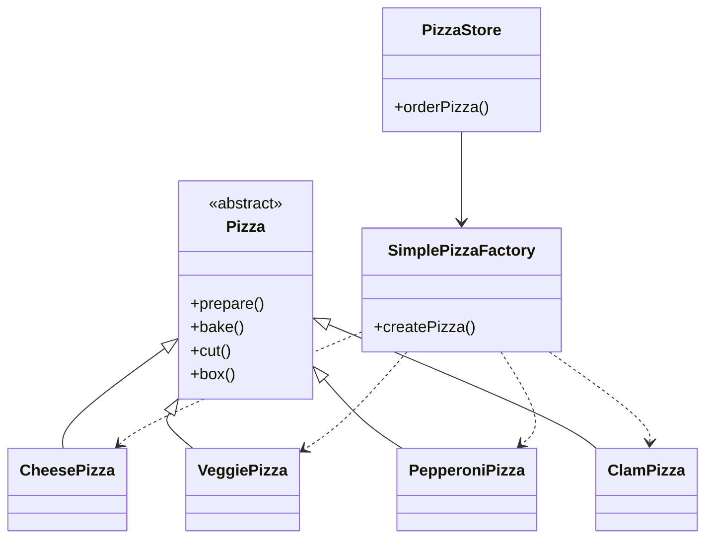

!!! note "Esta es la fábrica donde creamos pizzas"

    Debería ser la única parte de nuestra aplicación que hace referencia a clases `Pizza` concretas.

!!! note "Aquí está el producto de la fábrica: ¡pizza!"

!!! note "Hemos definido `Pizza` como clase abstracta"

    con algunas implementaciones útiles que pueden sobrescribirse.

!!! note "Este es el cliente de la fábrica"

    `PizzaStore` ahora pasa por la `SimplePizzaFactory` para obtener instancias de pizza.

!!! note "El método `create` se declara a menudo de forma estática"

!!! note "Estos son nuestros productos concretos"

    Cada producto debe implementar la interfaz `Pizza`* (que en este caso significa «extender la clase abstracta `Pizza`») y ser concreto. Mientras sea así, la fábrica puede crearlo y devolvérselo al cliente.

!!! note "*Otro recordatorio"

    En los patrones de diseño, la expresión «implementar una interfaz» NO siempre significa «escribir una clase que implemente una interfaz de Java usando la palabra clave `implements` en la declaración de la clase». En el uso general de la expresión, se sigue considerando que una clase concreta que implementa un método de un supertipo (que podría ser una clase abstracta O una interfaz) está «implementando la interfaz» de ese supertipo.

!!! tip "Piensa en la fábrica simple como un calentamiento"

    A continuación exploraremos dos patrones de primer nivel que son ambos fábricas. Pero no te preocupes: ¡hay más pizza que ver!

## Franquiciar la pizzería

Tu pizzería de Objectville le ha ido tan bien que ha arrasado con la competencia y ahora todo el mundo quiere una pizzería en su propio barrio. Como franquiciador, quieres asegurar la calidad de las operaciones de la franquicia, y para eso quieres que utilicen tu código contrastado a lo largo de los años. Pero ¿qué pasa con las diferencias regionales? Cada franquicia podría querer ofrecer distintos estilos de pizza (Nueva York, Chicago y California, por nombrar algunos), dependiendo de dónde esté situada la tienda y de los gustos de los connoisseurs locales de pizza.

!!! note "Sí, distintas zonas de Estados Unidos sirven estilos de pizza muy diferentes"

    desde las pizzas de masa profunda de Chicago, hasta la masa fina de Nueva York, hasta la pizza al estilo californiano (algunos dirían que con frutas y frutos secos por encima).

!!! note "Quieres que todas las pizzerías de la franquicia aprovechen tu código `PizzaStore`"

    de modo que las pizzas que prepara la fábrica estilo NY se preparen exactamente igual.

!!! note "Una franquicia quiere una fábrica que haga pizzas estilo NY"

    masa fina, salsa sabrosa y un poquito de queso.

!!! note "Otra franquicia quiere una fábrica que haga pizzas estilo Chicago"

    a sus clientes les gustan las pizzas con masa gruesa, salsa rica y tonnes de queso.

### Ya hemos visto un enfoque...

Si quitamos la `SimplePizzaFactory` y creamos tres fábricas distintas —`NYPizzaFactory`, `ChicagoPizzaFactory` y `CaliforniaPizzaFactory`— entonces simplemente podemos componer el `PizzaStore` con la fábrica apropiada y la franquicia queda lista. Ese es un enfoque.

Veamos cómo quedaría eso...

```java
NYPizzaFactory nyFactory = new NYPizzaFactory();
PizzaStore nyStore = new PizzaStore(nyFactory);
nyStore.orderPizza("Veggie");

ChicagoPizzaFactory chicagoFactory = new ChicagoPizzaFactory();
PizzaStore chicagoStore = new PizzaStore(chicagoFactory);
chicagoStore.orderPizza("Veggie");
```

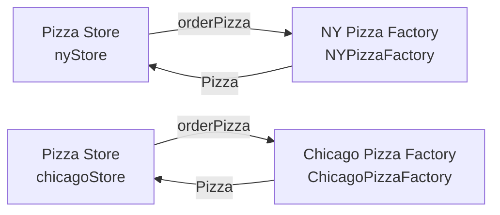

!!! note "Aquí creamos una fábrica para hacer pizzas estilo NY"

    Luego creamos un `PizzaStore` y le pasamos una referencia a la fábrica de NY.

!!! note "…y cuando hacemos pizzas obtenemos pizzas estilo NY"

    Y lo mismo para las pizzerías de Chicago: creamos una fábrica para pizzas de Chicago y creamos una tienda componiéndola con una fábrica de Chicago. Cuando hacemos pizzas, obtenemos las de estilo Chicago.

### Pero querrías un poco más de control de calidad...

> Llevo años haciendo pizza, así que se me ocurrió añadir mis propias «mejoras» a los procedimientos del `PizzaStore`…

Así que pusiste a prueba en el mercado la idea de la `SimpleFactory` y lo que descubriste fue que las franquicias estaban usando tu fábrica para crear pizzas, pero empezaron a emplear sus propios procedimientos caseros para el resto del proceso: horneaban las cosas un poco distinto, se olvidaban de cortar la pizza y usaban cajas de terceros. Repensando el problema un poco, ves que lo que realmente querrías es crear un marco (*framework*) que atara la tienda y la creación de pizzas, y que al mismo tiempo permitiera que las cosas sigan siendo flexibles.

En nuestro código inicial, antes de la `SimplePizzaFactory`, teníamos el código de creación de pizzas atado al `PizzaStore`, pero no era flexible. Así que, ¿cómo podemos tener la pizza y comérnosla también?

!!! warning "No es lo que quieres en una buena franquicia"

    No quieres saber qué pone el franquiciado en sus pizzas.

## Un marco para la pizzería

Hay una manera de localizar en la clase `PizzaStore` todas las actividades de creación de pizzas y, al mismo tiempo, dar libertad a las franquicias para que tengan su propio estilo regional. Lo que vamos a hacer es devolver el método `createPizza()` al `PizzaStore`, pero esta vez como método abstracto, y después crear una subclase de `PizzaStore` para cada estilo regional. Primero, veamos los cambios en el `PizzaStore`:

```java
public abstract class PizzaStore {
    public Pizza orderPizza(String type) {
        Pizza pizza;
        pizza = createPizza(type);
        pizza.prepare();
        pizza.bake();
        pizza.cut();
        pizza.box();
        return pizza;
    }

    abstract Pizza createPizza(String type);
}
```

!!! note "`PizzaStore` ahora es abstracta (mira el porqué más abajo)"

    Ahora `createPizza` vuelve a ser una llamada a un método del `PizzaStore` en lugar de a un objeto fábrica. Todo esto tiene exactamente el mismo aspecto…

!!! note "Hemos movido nuestro objeto fábrica a este método"

    Nuestro «método de fábrica» ahora es abstracto en `PizzaStore`.

Ahora tenemos una tienda esperando a las subclases; vamos a tener una subclase por cada tipo regional (`NYPizzaStore`, `ChicagoPizzaStore`, `CaliforniaPizzaStore`) y cada subclase va a tomar la decisión sobre qué compone una pizza. Veamos cómo va a funcionar esto.

## Permitir que las subclases decidan

Recuerda: la pizzería ya tiene un sistema de pedidos muy afinado en el método `orderPizza()` y quieres asegurarte de que sea consistente en todas las franquicias. Lo que varía entre las pizzerías regionales es el estilo de pizzas que hacen —la pizza de Nueva York tiene masa fina, la de Chicago es gruesa, etc.— y vamos a empujar todas esas variaciones dentro del método `createPizza()` y hacer que sea responsable de crear el tipo correcto de pizza. La manera de hacerlo es dejar que cada subclase de `PizzaStore` defina cómo es el método `createPizza()`. Así que tendremos varias subclases concretas de `PizzaStore`, cada una con sus propias variaciones de pizza, todas encajando dentro del marco de `PizzaStore` y sigue aprovechando el afinado método `orderPizza()`.

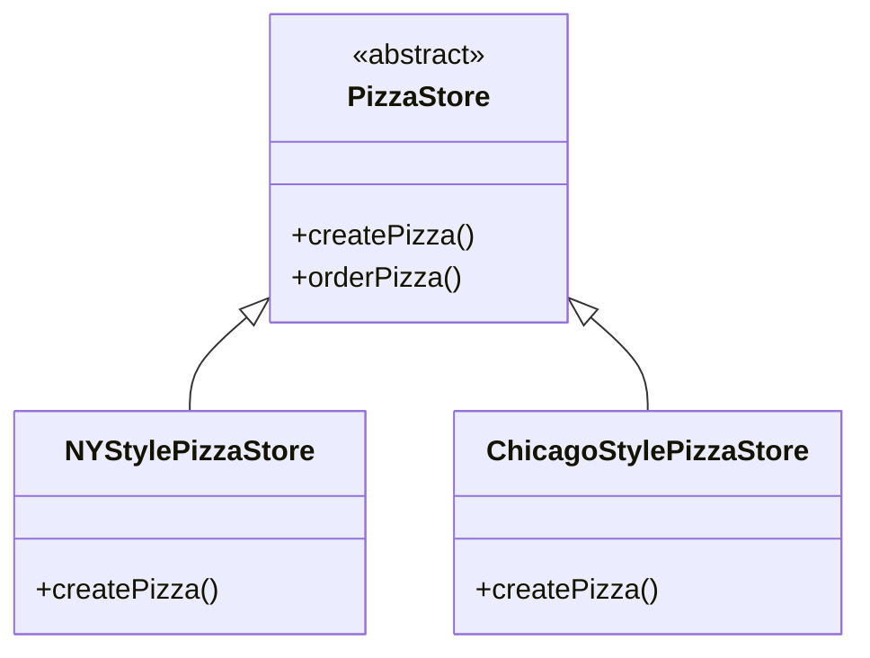

!!! note "Cada subclase aporta una implementación del método `createPizza()`, sobrescribiendo el método abstracto `createPizza()` de `PizzaStore`, mientras todas las subclases hacen uso del método `orderPizza()` definido en `PizzaStore`"

    Si quisiéramos forzar esto de verdad, podríamos declarar el método `orderPizza()` como `final`.

!!! note "De forma similar, al usar la subclase de Chicago obtenemos una implementación de `createPizza()` con ingredientes de Chicago"

    Recuerda: `createPizza()` es abstracto en `PizzaStore`, así que todos los subtipos de `PizzaStore` DEBEN implementar el método.

!!! note "Si una franquicia quiere pizzas estilo NY para sus clientes, usa la subclase de NY"

    que tiene su propio método `createPizza()`, creando pizzas estilo NY.

```java
public Pizza createPizza(type) {
    if (type.equals("cheese") {
        pizza = new NYStyleCheesePizza();
    } else if (type.equals("pepperoni") {
        pizza = new NYStylePepperoniPizza();
    } else if (type.equals("clam") {
        pizza = new NYStyleClamPizza();
    } else if (type.equals("veggie") {
        pizza = new NYStyleVeggiePizza();
    }
}
```

```java
public Pizza createPizza(type) {
    if (type.equals("cheese") {
        pizza = new ChicagoStyleCheesePizza();
    } else if (type.equals("pepperoni") {
        pizza = new ChicagoStylePepperoniPizza();
    } else if (type.equals("clam") {
        pizza = new ChicagoStyleClamPizza();
    } else if (type.equals("veggie") {
        pizza = new ChicagoStyleVeggiePizza();
    }
}
```

!!! question "No lo entiendo"

    Las subclases de `PizzaStore` son solo subclases. ¿Cómo van a decidir nada? No veo ningún código de toma de decisiones lógicas en `NYStylePizzaStore`…

Bien, piénsalo desde el punto de vista del método `orderPizza()` del `PizzaStore`: está definido en la clase abstracta `PizzaStore`, pero los tipos concretos solo se crean en las subclases.

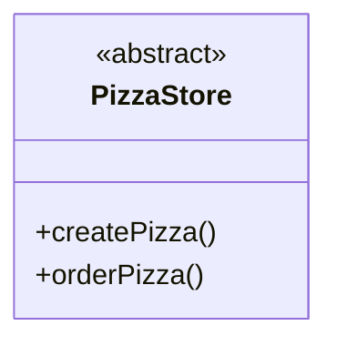

!!! note "`orderPizza()` está definido en el `PizzaStore` abstracto, no en las subclases"

    Así que el método no tiene ni idea de qué subclase está realmente ejecutando el código y haciendo las pizzas.

Ahora, para llevar esto un poco más lejos, el método `orderPizza()` hace muchas cosas con un objeto `Pizza` (como `prepare`, `bake`, `cut`, `box`), pero como `Pizza` es abstracta, `orderPizza()` no tiene ni idea de qué clases concretas reales están implicadas. En otras palabras: ¡está desacoplado!

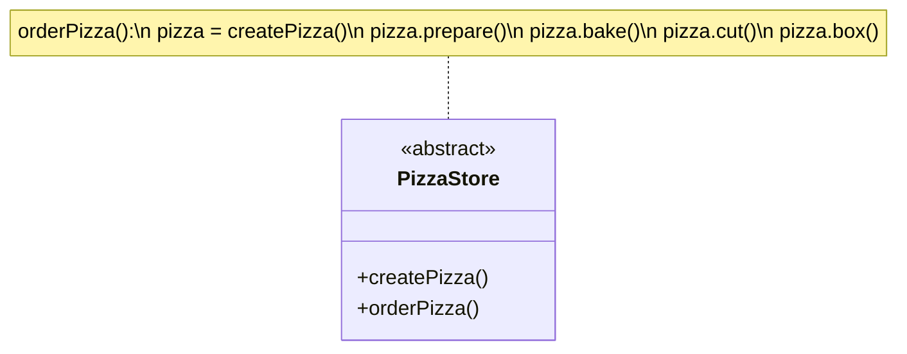

!!! note "`orderPizza()` llama a `createPizza()` para obtener realmente el objeto pizza"

    Pero ¿de qué clase de pizza saldr? El método `orderPizza()` no puede decidir; no sabe cómo. Entonces, ¿quién decide?

Cuando `orderPizza()` llama a `createPizza()`, una de tus subclases entra en acción para crear la pizza. ¿De qué clase se hará la pizza? Pues eso lo decide la elección de pizzería a la que pidas: `NYStylePizzaStore` o `ChicagoStylePizzaStore`.

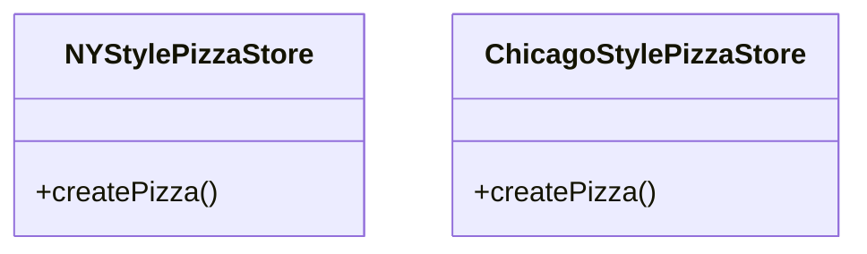

Entonces, ¿hay una decisión en tiempo real que tengan que tomar las subclases? No, pero desde la perspectiva de `orderPizza()`, si elegiste un `NYStylePizzaStore`, esa subclase es la que determina qué pizza se hace. Así que las subclases no están realmente «decidiendo» —fuiste tú quien decidió al elegir qué tienda querías—, pero sí determinan qué clase de pizza se fabrica.

## Construyamos una `PizzaStore`

Ser franquicia tiene sus ventajas. Obtienes gratis toda la funcionalidad del `PizzaStore`. Todo lo que tienen que hacer las tiendas regionales es heredar de `PizzaStore` y proporcionar un método `createPizza()` que implemente su estilo de pizza. Nosotros nos encargaremos de los tres grandes estilos de pizza para los franquiciados. Aquí está el estilo regional de Nueva York:

```java
public class NYPizzaStore extends PizzaStore {
    Pizza createPizza(String item) {
        if (item.equals("cheese") {
            return new NYStyleCheesePizza();
        } else if (item.equals("veggie")) {
            return new NYStyleVeggiePizza();
        } else if (item.equals("clam")) {
            return new NYStyleClamPizza();
        } else if (item.equals("pepperoni")) {
            return new NYStylePepperoniPizza();
        } else return null;
    }
}
```

!!! note "`createPizza()` devuelve una `Pizza`, y la subclase es completamente responsable de qué `Pizza` concreta instancia"

!!! note "La `NYPizzaStore` extiende `PizzaStore`, así que hereda el método `orderPizza()` (entre otros)"

    Tenemos que implementar `createPizza()`, ya que es abstracto en `PizzaStore`.

!!! note "Aquí es donde creamos nuestras clases concretas"

    Para cada tipo de `Pizza` creamos el estilo NY.

!!! note "*Ten en cuenta que el método `orderPizza()` de la superclase no tiene ni idea de qué `Pizza` estamos creando"

    ¡Solo sabe que puede prepararla, hornearla, cortarla y empaquetarla!

Una vez que tengamos construidas nuestras subclases de `PizzaStore`, será hora de ver lo que ocurre al pedir una pizza o dos. Pero antes de eso, ¿por qué no intentas construir tú las pizzerías estilo Chicago y estilo California en la página siguiente?

!!! exercise "Tu turno"

    Ya hemos resuelto la `NYPizzaStore`; solo faltan dos más y ¡estaremos listos para franquiciar! Escribe aquí las implementaciones de `PizzaStore` estilo Chicago y estilo California.

## Declarar un método de fábrica

Con un par de transformaciones en la clase `PizzaStore`, hemos pasado de tener un objeto que se encarga de la instanciación de nuestras clases concretas a tener un conjunto de subclases que asumen ahora esa responsabilidad. Vamos a mirar más de cerca:

```java
public abstract class PizzaStore {
    public Pizza orderPizza(String type) {
        Pizza pizza;
        pizza = createPizza(type);
        pizza.prepare();
        pizza.bake();
        pizza.cut();
        pizza.box();
        return pizza;
    }

    protected abstract Pizza createPizza(String type);

    // other methods here
}
```

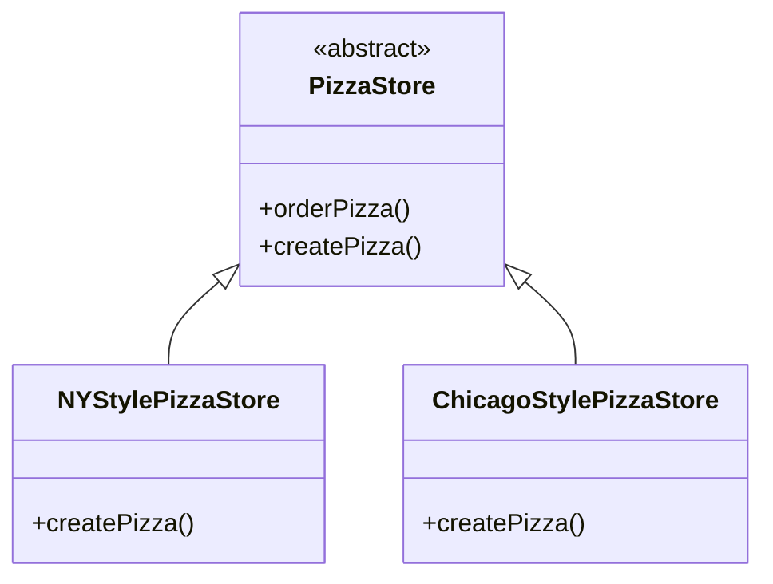

!!! note "Las subclases de `PizzaStore` se encargan de la instanciación de objetos por nosotros en el método `createPizza()`"

    Toda la responsabilidad de instanciar pizzas se ha movido a un método que actúa como una fábrica.

!!! note "De cerca: el código"

    Un método de fábrica gestiona la creación de objetos y la encapsula en una subclase. Esto desacopla el código de cliente de la superclase del código de creación de objetos de la subclase.

    ```java
    abstract Product factoryMethod(String type)
    ```

    - Un método de fábrica es abstracto, así que las subclases se encargan de la creación de objetos.
    - Un método de fábrica puede estar parameterizado (o no) para elegir entre varias variaciones de un producto.
    - Un método de fábrica aísla al cliente (el código de la superclase, como `orderPizza()`) de saber qué clase concreta de producto se crea realmente.
    - Un método de fábrica devuelve un `Product` que normalmente se usa dentro de los métodos definidos en la superclase.

### Veamos cómo funciona: pedir pizzas con el método de fábrica de pizzas

> Me gusta la pizza estilo NY... ya sabes, masa fina y crujiente con un poquito de queso y una salsa buenísima.

**Ethan**

> Me gusta la pizza deep dish estilo Chicago, con masa gruesa y un montón de queso.

**Joel**

!!! note "Ethan tiene que pedir su pizza en una pizzería de NY"

!!! note "Joel tiene que pedir su pizza en una pizzería de Chicago"

    ¡El mismo método de pedido de pizza, pero un tipo de pizza distinto!

### ¿Y entonces cómo la piden?

**1.** Primero, Joel y Ethan necesitan una instancia de un `PizzaStore`. Joel necesita instanciar un `ChicagoPizzaStore` y Ethan necesita un `NYPizzaStore`.

**2.** Con un `PizzaStore` en la mano, tanto Ethan como Joel llaman al método `orderPizza()` y pasan el tipo de pizza que quieren (queso, verduras, etc.).

**3.** Para crear las pizzas se llama al método `createPizza()`, que está definido en las dos subclases `NYPizzaStore` y `ChicagoPizzaStore`. Tal y como las definimos, el `NYPizzaStore` instancia una pizza estilo NY y el `ChicagoPizzaStore` instancia una pizza estilo Chicago. En cualquiera de los dos casos, la `Pizza` se devuelve al método `orderPizza()`.

**4.** El método `orderPizza()` no tiene ni idea de qué clase de pizza se creó, pero sabe que es una pizza y la prepara, la hornea, la corta y la empaqueta para Ethan y Joel.

### Veamos cómo se hacen realmente estas pizzas...

!!! info "Detrás de las bambalinas"

    **1.** Sigamos el pedido de Ethan: primero necesitamos un `NYPizzaStore`.

    ```java
    PizzaStore nyPizzaStore = new NYPizzaStore();
    ```

    Crea una instancia de `NYPizzaStore`.

    **2.** Ahora que tenemos una tienda, podemos tomar un pedido.

    ```java
    nyPizzaStore.orderPizza("cheese");
    ```

    Se llama al método `orderPizza()` sobre la instancia `nyPizzaStore` (el método definido dentro de `PizzaStore` se ejecuta).

    ```mermaid
    flowchart LR
    client["cliente"]
    store["nyPizzaStore<br/>objeto"]
    client -->|"orderPizza('cheese')"| store
    store -->|"createPizza('cheese')"| pizza["Pizza<br/>objeto"]
    ```

    **3.** El método `orderPizza()` llama entonces al método `createPizza()`:

    ```java
    Pizza pizza  = createPizza("cheese");
    ```

    Recuerda: `createPizza()`, el método de fábrica, está implementado en la subclase. En este caso devuelve una `Pizza` de queso estilo NY.

    **4.** Por fin tenemos la pizza sin preparar en la mano y el método `orderPizza()` termina de prepararla:

    ```java
    pizza.prepare();
    pizza.bake();
    pizza.cut();
    pizza.box();
    ```

!!! note "Todos estos métodos están definidos en la pizza concreta devuelta por el método de fábrica `createPizza()`, definido en el `NYPizzaStore`"

    El método `orderPizza()` recibe una `Pizza` sin saber exactamente qué clase concreta es.

## Solo nos falta una cosa: ¡pizzas!

Nuestra pizzería no va a ser muy popular sin algunas pizzas, así que vamos a implementarlas. Empezaremos con una clase abstracta `Pizza`, y todas las pizzas concretas se derivarán de ella.

```java
public abstract class Pizza {
    String name;
    String dough;
    String sauce;
    List<String> toppings = new ArrayList<String>();

    void prepare() {
        System.out.println("Preparing " + name);
        System.out.println("Tossing dough...");
        System.out.println("Adding sauce...");
        System.out.println("Adding toppings: ");
        for (String topping : toppings) {
            System.out.println("   " + topping);
        }
    }

    void bake() {
        System.out.println("Bake for 25 minutes at 350");
    }

    void cut() {
        System.out.println("Cutting the pizza into diagonal slices");
    }

    void box() {
        System.out.println("Place pizza in official PizzaStore box");
    }

    public String getName() {
        return name;
    }
}
```

!!! note "Cada `Pizza` tiene un nombre, un tipo de masa, un tipo de salsa y un conjunto de ingredientes"

!!! note "La preparación sigue una serie de pasos en un orden particular"

!!! note "La clase abstracta proporciona algunos valores por defecto básicos para hornear, cortar y empaquetar"

!!! note "RECUERDA"

    No proporcionamos sentencias `import` ni `package` en los listados de código. Consigue el código fuente completo en el sitio web wickedlysmart: https://wickedlysmart.com/head-first-design-patterns. Si pierdes esta URL, siempre puedes encontrarla rápidamente en la sección de introducción.

### Ahora solo necesitamos algunas subclases concretas...

¿Qué tal si definimos pizzas de queso de Nueva York y de estilo Chicago?

```java
public class NYStyleCheesePizza extends Pizza {
    public NYStyleCheesePizza() {
        name = "NY Style Sauce and Cheese Pizza";
        dough = "Thin Crust Dough";
        sauce = "Marinara Sauce";
        toppings.add("Grated Reggiano Cheese");
    }
}
```

!!! note "La pizza de NY tiene su propia salsa estilo marinara y masa fina"

    ¡Y un ingrediente: queso Reggiano!

```java
public class ChicagoStyleCheesePizza extends Pizza {
    public ChicagoStyleCheesePizza() {
        name = "Chicago Style Deep Dish Cheese Pizza";
        dough = "Extra Thick Crust Dough";
        sauce = "Plum Tomato Sauce";
        toppings.add("Shredded Mozzarella Cheese");
    }

    void cut() {
        System.out.println("Cutting the pizza into square slices");
    }
}
```

!!! note "La pizza de Chicago usa tomates de arbusto como salsa junto con masa extra gruesa"

!!! note "La pizza deep dish estilo Chicago lleva muchísimo queso mozzarella"

!!! note "La pizza estilo Chicago también sobrescribe el método `cut()` para que las porciones se corten en cuadrados"

## Ya has esperado suficiente. ¡Hora de unas pizzas!

```java
public class PizzaTestDrive {
    public static void main(String[] args) {
        PizzaStore nyStore = new NYPizzaStore();
        PizzaStore chicagoStore = new ChicagoPizzaStore();

        Pizza pizza = nyStore.orderPizza("cheese");
        System.out.println("Ethan ordered a " + pizza.getName() + "\n");

        pizza = chicagoStore.orderPizza("cheese");
        System.out.println("Joel ordered a " + pizza.getName() + "\n");
    }
}
```

!!! note "Primero creamos dos tiendas distintas"

    Usamos una tienda para preparar el pedido de Ethan…

!!! note "…y la otra para el de Joel"

```text
File  Edit   Window  Help  YouWantMootzOnThatPizza?
%java PizzaTestDrive
Preparing NY Style Sauce and Cheese Pizza
Tossing dough...
Adding sauce...
Adding toppings:
   Grated Reggiano cheese
Bake for 25 minutes at 350
Cutting the pizza into diagonal slices
Place pizza in official PizzaStore box
Ethan ordered a NY Style Sauce and Cheese Pizza
Preparing Chicago Style Deep Dish Cheese Pizza
Tossing dough...
Adding sauce...
Adding toppings:
   Shredded Mozzarella Cheese
Bake for 25 minutes at 350
Cutting the pizza into square slices
Place pizza in official PizzaStore box
Joel ordered a Chicago Style Deep Dish Cheese Pizza
```

!!! note "Ambas pizzas se preparan"

    se añaden los ingredientes, y las pizzas se hornean, se cortan y se empaquetan. Nuestra superclase nunca tuvo que conocer los detalles; la subclase se encarga todo eso simplemente instanciando la pizza correcta.

## Por fin llega el momento de conocer el patrón Método de Fábrica

Todos los patrones de fábrica encapsulan la creación de objetos. El patrón Método de Fábrica encapsula la creación de objetos dejando que sean las subclases quienes decidan qué objetos crear. Veamos estos diagramas de clases para conocer a los personajes de este patrón:

### Las clases Creator

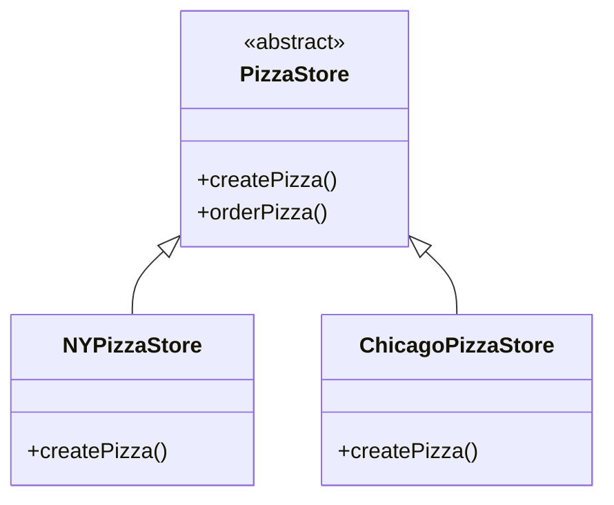

!!! note "Esta es nuestra clase creator abstracta"

    Define un método abstracto de fábrica que las subclases implementan para producir productos.

!!! note "A menudo el creator contiene código que depende de un producto abstracto"

    y el creator nunca sabe realmente qué producto concreto se produjo.

!!! note "El método `createPizza()` es nuestro método de fábrica"

    Produce productos.

!!! note "Como cada franquicia recibe su propia subclase de `PizzaStore`"

    es libre de crear su propio estilo de pizza implementando `createPizza()`.

!!! note "Las clases que producen productos se denominan concrete creators"

### Las clases Product

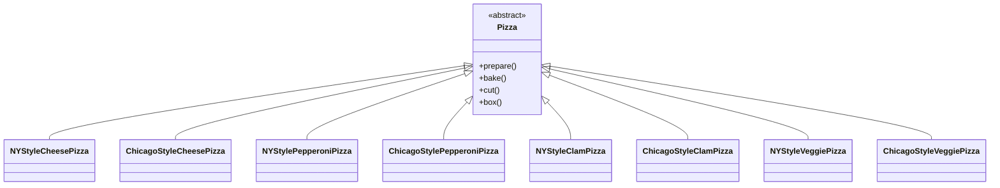

!!! note "Las fábricas producen productos, y en el `PizzaStore` nuestro producto es una `Pizza`"

!!! note "Estos son los productos concretos"

    Todas las pizzas que producen nuestras tiendas.

## Ver los creators y los productos en paralelo

Por cada creator concreto suele haber un conjunto completo de productos que crea. Los creators de pizza de Chicago crean distintos tipos de pizza estilo Chicago, los creators de pizza de Nueva York crean distintos tipos de pizza estilo Nueva York, etc. De hecho, podemos ver nuestros conjuntos de clases Creator y sus correspondientes clases Product como jerarquías paralelas. Veamos las dos jerarquías de clases paralelas y cómo se relacionan:

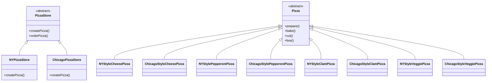

!!! note "Fíjate en cómo estas jerarquías de clases son paralelas"

    Ambas tienen clases abstractas que son extendidas por clases concretas, que conocen implementaciones específicas para las pizzas de NY y de Chicago.

!!! note "El `NYPizzaStore` encapsula todo el conocimiento sobre cómo hacer pizzas estilo NY"

!!! note "El `ChicagoPizzaStore` encapsula todo el conocimiento sobre cómo hacer pizzas estilo Chicago"

    El método de fábrica es la clave para encapsular este conocimiento.

!!! exercise "Puzle de diseño"

    Necesitamos otra clase de pizza para esos californianos tan locos (locos en el buen sentido, por supuesto). Dibuja otro conjunto paralelo de clases que tendrías que añadir para incorporar una nueva región de California a nuestro `PizzaStore`.

    ```mermaid
    classDiagram
        class PizzaStore {
            <<abstract>>
            +createPizza()
            +orderPizza()
        }
        class NYPizzaStore
        class ChicagoPizzaStore
        class YourDrawing {
            <<aquí va tu dibujo>>
        }
        NYPizzaStore : +createPizza()
        ChicagoPizzaStore : +createPizza()
        PizzaStore <|-- NYPizzaStore
        PizzaStore <|-- ChicagoPizzaStore
        PizzaStore ..> YourDrawing
    ```

    Ahora, escribe las cinco cosas más extrañas que se te ocurran para ponerle a una pizza. ¡Y después ya estarás listo para abrir un negocio de pizza en California!

## El patrón Método de Fábrica definido

Es hora de sacar la definición oficial del patrón Método de Fábrica:

!!! abstract "Definición del patrón Método de Fábrica"

    El patrón Método de Fábrica define una interfaz para crear un objeto, pero deja que las subclases decidan qué clase instanciar. Método de Fábrica permite que una clase difiera la instanciación a sus subclases.

Como con toda fábrica, el patrón Método de Fábrica nos da una forma de encapsular las instanciaciones de tipos concretos. Si miras el diagrama de clases de abajo, puedes ver que la clase abstracta Creator te da una interfaz con un método para crear objetos, también conocido como el «método de fábrica». Cualquier otro método implementado en el Creator abstracto está escrito para operar sobre productos producidos por el método de fábrica. Solo las subclases implementan realmente el método de fábrica y crean productos.

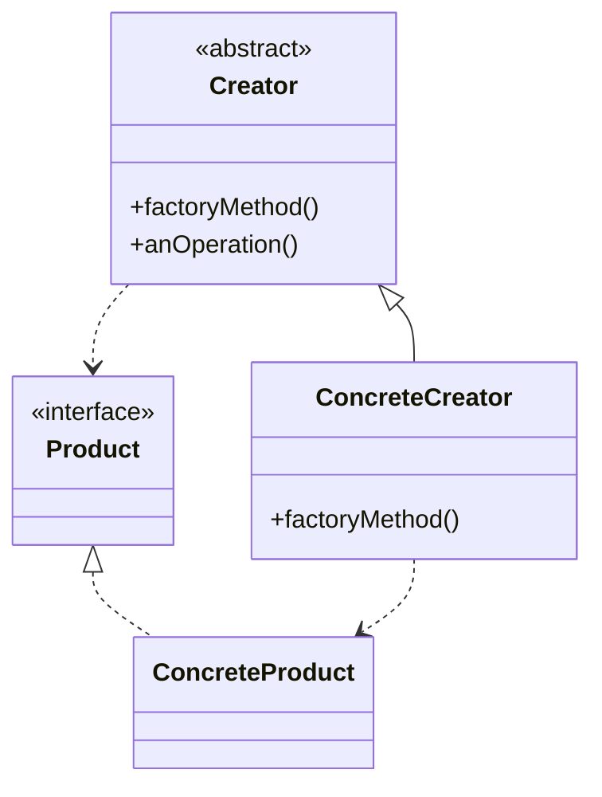

!!! note "Podrías preguntarles qué significa «decidir»"

    pero apostamos a que ahora lo entiendes tú mejor que ellos.

!!! note "Creator es una clase que contiene las implementaciones de todos los métodos para manipular productos"

    excepto el método de fábrica.

!!! note "El `factoryMethod()` abstracto es lo que todas las subclases de Creator deben implementar"

    Es el método que produce realmente los productos.

!!! note "Todos los productos deben implementar la misma interfaz"

    para que las clases que usan los productos puedan referirse a la interfaz, no a la clase concreta.

!!! note "`ConcreteCreator` implementa el `factoryMethod()`"

!!! note "`ConcreteCreator` es responsable de crear uno o más productos concretos"

    Es la única clase que tiene el conocimiento de cómo crear esos productos.

!!! question "¿Por qué usamos la palabra «decidir»?"

    Como en la definición oficial, oirás a menudo decir a los desarrolladores: «el patrón Método de Fábrica deja que las subclases decidan qué clase instanciar». Como la clase Creator está escrita sin conocimiento de los productos reales que se van a crear, decimos «decidir» no porque el patrón permita que las propias subclases decidan, sino porque la decisión en realidad depende de qué subclase se usa para crear el producto.

## Guru y alumno...

**Guru:** Cuéntame sobre tu formación.

**Alumno:** Guru, he llevado más allá mi estudio del «encapsular lo que varía».

**Guru:** Continúa...

**Alumno:** He aprendido que uno puede encapsular el código que crea objetos. Cuando tienes código que instancia clases concretas, esa es un área de cambio frecuente. He aprendido una técnica llamada «fábricas» que te permite encapsular ese comportamiento de instanciación.

**Guru:** Y esas «fábricas», ¿de qué beneficio son?

**Alumno:** Son muchos. Al colocar todo mi código de creación en un solo objeto o método, evito la duplicación en mi código y proporciono un único sitio donde hacer el mantenimiento. Eso también significa que los clientes dependen solo de interfaces y no de las clases concretas necesarias para instanciar objetos. Como he aprendido en mis estudios, esto me permite programar contra una interfaz y no contra una implementación, y eso hace que mi código sea más flexible y extensible en el futuro.

**Guru:** Sí, tus instintos de OO están creciendo. ¿Tienes alguna pregunta para tu guru hoy?

**Alumno:** Guru, sé que al encapsular la creación de objetos estoy programando contra abstracciones y desacoplando mi código de cliente de las implementaciones reales. Pero mi código de fábrica todavía tiene que usar clases concretas para instanciar objetos reales. ¿No me estoy volviendo a engañar a mí mismo?

**Guru:** La creación de objetos es una realidad de la vida; tenemos que crear objetos o nunca escribiremos una sola aplicación Java. Pero, con conocimiento de esa realidad, podemos diseñar nuestro código de modo que hayamos acorralado ese código de creación como las ovejas cuya lana te taparías los ojos. Una vez acorralado, podemos proteger y cuidar el código de creación. Si dejamos que nuestro código de creación ande suelto, entonces nunca recogeremos su «lana».

**Alumno:** Guru, veo la verdad en esto.

**Guru:** Como sabía. Ahora, por favor, ve y medita sobre las dependencias entre objetos.

!!! exercise "Tu turno"

    Finjamos que nunca has oído hablar de una fábrica OO. Aquí tienes una versión «muy dependiente» de `PizzaStore` que no usa ninguna fábrica. Necesitamos que hagas una cuenta del número de clases concretas de pizza de las que depende esta clase. Si añadirás pizzas estilo California a este `PizzaStore`, ¿de cuántas clases dependería entonces?

```java
public class DependentPizzaStore {
    public Pizza createPizza(String style, String type) {
        Pizza pizza = null;
        if (style.equals("NY")) {
            if (type.equals("cheese")) {
                pizza = new NYStyleCheesePizza();
            } else if (type.equals("veggie")) {
                pizza = new NYStyleVeggiePizza();
            } else if (type.equals("clam")) {
                pizza = new NYStyleClamPizza();
            } else if (type.equals("pepperoni")) {
                pizza = new NYStylePepperoniPizza();
            }
        } else if (style.equals("Chicago")) {
            if (type.equals("cheese")) {
                pizza = new ChicagoStyleCheesePizza();
            } else if (type.equals("veggie")) {
                pizza = new ChicagoStyleVeggiePizza();
            } else if (type.equals("clam")) {
                pizza = new ChicagoStyleClamPizza();
            } else if (type.equals("pepperoni")) {
                pizza = new ChicagoStylePepperoniPizza();
            }
        } else {
            System.out.println("Error: invalid type of pizza");
            return null;
        }
        pizza.prepare();
        pizza.bake();
        pizza.cut();
        pizza.box();
        return pizza;
    }
}
```

!!! note "Gestiona todas las pizzas estilo NY"

!!! note "Gestiona todas las pizzas estilo Chicago"

    Aquí puedes escribir tu número… y también el de California.

## Mirar las dependencias entre objetos

Cuando instancias un objeto directamente, estás dependiendo de su clase concreta. Echa un vistazo a nuestro `PizzaStore` *muy dependiente* de hace una página. Crea todos los objetos de pizza justo en la clase `PizzaStore` en lugar de delegar en una fábrica.

Si dibujamos un diagrama que represente esa versión del `PizzaStore` y todos los objetos de los que depende, esto es lo que obtenemos:

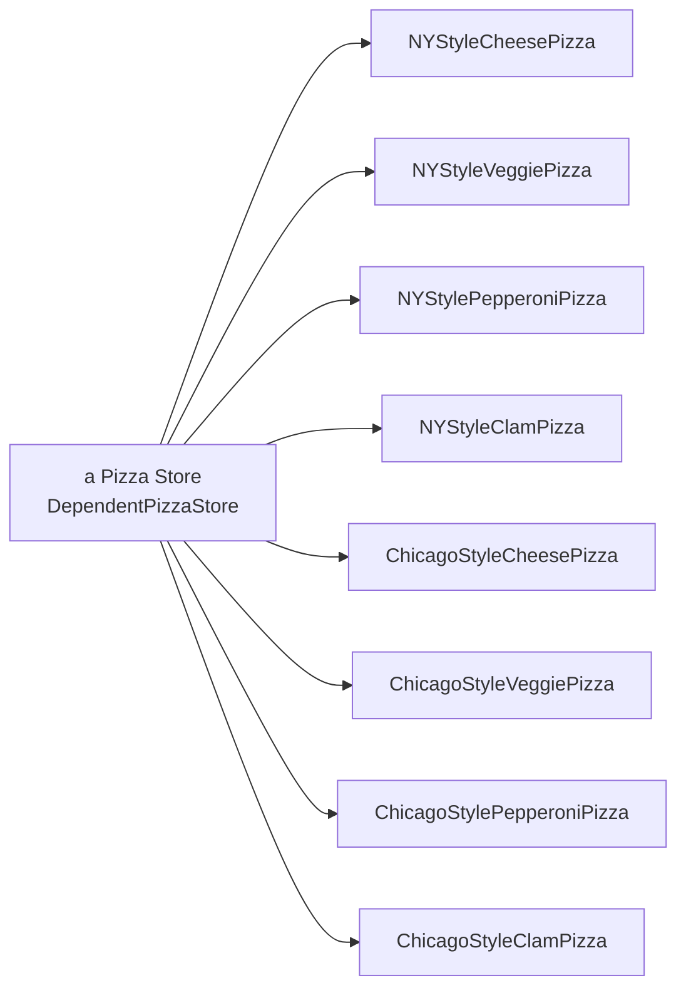

!!! note "Esta versión del `PizzaStore` depende de todos esos objetos de pizza"

    porque los está creando directamente.

!!! note "Si cambia la implementación de estas clases, es posible que tengamos que modificar el `PizzaStore`"

!!! note "Como cualquier cambio en las implementaciones concretas de las pizzas afecta al `PizzaStore`"

    decimos que el `PizzaStore` «depende» de las implementaciones de pizza.

!!! note "Cada nuevo tipo de pizza que añadimos crea otra dependencia para el `PizzaStore`"

## El principio de inversión de dependencias

Debería quedar bastante claro que reducir las dependencias a clases concretas en nuestro código es una «buena cosa». De hecho, ¡tenemos un principio de diseño OO que formaliza esta noción; e incluso puedes usarlo para impresionar a los directivos en la sala! Tu aumento más que compensará el coste de este libro y ganarás la admiración de tus compañeros desarrolladores.

!!! question "Principio de diseño"
    **Dependa de las abstracciones. No dependa de las clases concretas.**

A primera vista, este principio suena mucho como «Programe contra una interfaz, no contra una implementación», ¿verdad? Es parecido; sin embargo, el Principio de Inversión de Dependencias hace una afirmación incluso más fuerte sobre la abstracción. Sugiere que nuestros componentes de alto nivel no deberían depender de nuestros componentes de bajo nivel; más bien, ambos deberían depender de abstracciones.

Pero ¿qué demonios significa eso?

Bueno, empecemos mirando de nuevo el diagrama de la pizzería de la página anterior. `PizzaStore` es nuestro componente «de alto nivel» y las implementaciones de pizza son nuestros «componentes de bajo nivel», y está claro que `PizzaStore` depende de las clases concretas de pizza.

Ahora bien, este principio nos dice que deberíamos escribir nuestro código de manera que dependamos de abstracciones, no de clases concretas. Eso vale tanto para nuestros módulos de alto nivel como para nuestros módulos de bajo nivel.

Pero ¿cómo hacemos eso? Pensemos en cómo aplicaríamos este principio a nuestra implementación de `PizzaStore`, tan dependiente...

## Aplicar el principio

El problema principal del `PizzaStore` tan dependiente es que depende de cada tipo de pizza, porque en realidad instancia tipos concretos en su método `orderPizza()`.

Aunque hemos creado una abstracción, `Pizza`, en este código estamos creando `Pizza` concretas, así que no obtenemos mucho de esa abstracción.

¿Cómo podemos sacar esas instanciaciones del método `orderPizza()`? Bueno, como ya sabemos, el patrón Factory Method nos permite hacer exactamente eso.

Así que, después de haber aplicado el patrón Factory Method, nuestro diagrama queda así:

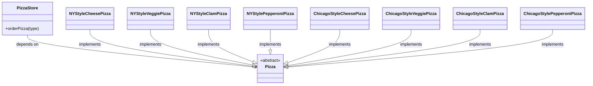

- `PizzaStore` ahora depende solo de `Pizza`, la clase abstracta.
- `Pizza` es una clase abstracta... una abstracción.
- Las clases concretas de pizza dependen también de la abstracción `Pizza`, porque implementan la interfaz `Pizza` (recuerda, estamos usando «interfaz» en sentido general) en la clase abstracta `Pizza`.

Tras aplicar Factory Method, notarás que nuestro componente de alto nivel, el `PizzaStore`, y nuestros componentes de bajo nivel, las pizzas, dependen ambos de `Pizza`, la abstracción. Factory Method no es la única técnica para seguir el Principio de Inversión de Dependencias, pero es una de las más potentes.

!!! note
    *Vale, entiendo la parte de la dependencia, pero ¿por qué se llama inversión de dependencias?*

!!! question "¿Dónde está la «inversión»?"
    La «inversión» del nombre Principio de Inversión de Dependencias está ahí porque invierte la forma en que normalmente piensas sobre tu diseño OO. Mira el diagrama de la página anterior. Fíjate en que los componentes de bajo nivel dependen ahora de una abstracción de nivel superior. Del mismo modo, el componente de alto nivel también está atado a la misma abstracción.

Así que, el gráfico de dependencias de arriba abajo que dibujamos hace un par de páginas se ha invertido, y ahora tanto los módulos de alto nivel como los de bajo nivel dependen de la abstracción.

Veamos también el razonamiento que hay detrás del proceso de diseño típico y cómo introducir el principio puede invertir la forma en que pensamos sobre el diseño...

## Invertir tu pensamiento...

Vale, así que necesitas implementar una pizzería. ¿Cuál es el primer pensamiento que te viene a la cabeza?

*Hmmm*, las pizzerías preparan, hornean y empaquetan pizzas. Así que mi tienda tiene que ser capaz de fabricar un montón de pizzas distintas: `CheesePizza`, `VeggiePizza`, `ClamPizza`, etc.

Exacto, empiezas por arriba y sigues hacia abajo hasta las clases concretas. Pero, como has visto, no quieres que tu pizzería conozca los tipos concretos de pizza, ¡porque entonces dependerá de todas esas clases concretas!

Ahora vamos a «invertir» tu pensamiento... en lugar de empezar por arriba, empieza por las `Pizza` y piensa qué puedes abstraer.

Bueno, una `CheesePizza`, una `VeggiePizza` y una `ClamPizza` son todas solo `Pizza`, así que deberían compartir una interfaz `Pizza`.

¡Exacto! estás pensando en la abstracción `Pizza`. Así que ahora, vuelve atrás y piensa de nuevo en el diseño de la pizzería.

Como ahora tengo una abstracción `Pizza`, puedo diseñar mi pizzería sin preocuparme de las clases concretas de pizza.

Cerca. Pero para hacer eso tendrás que apoyarte en una fábrica para sacar esas clases concretas de tu pizzería. Una vez que lo hayas hecho, tus distintos tipos concretos de pizza dependen solo de una abstracción, y tu tienda también. Hemos tomado un diseño en el que la tienda dependía de clases concretas y hemos invertido esas dependencias (junto con tu pensamiento).

## Algunas directrices para ayudarte a seguir el principio...

Las siguientes directrices pueden ayudarte a evitar diseños OO que violen el Principio de Inversión de Dependencias:

!!! tip "Las directrices"
    Ninguna variable debería mantener una referencia a una clase concreta.

    !!! note
        Si usas `new`, mantendrás una referencia a una clase concreta. ¡Usa una fábrica para sortear eso!

    Ninguna clase debería derivar de una clase concreta.

    !!! note
        Si derivas de una clase concreta, dependerás de una clase concreta. Deriva de una abstracción, como una interfaz o una clase abstracta.

    Ningún método debería sobrescribir un método implementado de cualquiera de sus clases base.

    !!! note
        Si sobrescribes un método implementado, entonces tu clase base no era realmente una abstracción desde el principio. Esos métodos implementados en la clase base están pensados para ser compartidos por todas tus subclases.

!!! note
    *Pero un momento, ¿no son estas directrices imposibles de seguir? Si las sigo, nunca podré escribir ni un solo programa!*

¡Exactamente tienes razón! Como muchos de nuestros principios, esto es una_directriz que deberías perseguir, más que una regla que tengas que seguir todo el tiempo. Claramente, ¡todos y cada uno de los programas Java escritos hasta ahora violan estas directrices!

Pero, si interiorizas estas directrices y las tienes en el fondo de tu mente cuando diseñas, sabrás cuándo estás violando el principio y tendrás una buena razón para hacerlo. Por ejemplo, si tienes una clase que probablemente no va a cambiar, y lo sabes, entonces no es el fin del mundo si instancias una clase concreta en tu código. Piénsalo: instanciamos objetos `String` constantemente sin pensarlo dos veces. ¿Viola eso el principio? Sí. ¿Está bien? Sí. ¿Por qué? Porque es muy poco probable que `String` cambie.

Si, por otro lado, una clase que escribes probablemente va a cambiar, tienes buenas técnicas como Factory Method para encapsular ese cambio.

## Mientras tanto, de vuelta en la pizzería...

El diseño de la pizzería está tomando forma de verdad: tiene un marco de trabajo flexible y hace un buen trabajo a la hora de cumplir los principios de diseño.

Ahora, la clave del éxito de Objectville Pizza siempre han sido los ingredientes frescos y de calidad, y lo que has descubierto es que con el nuevo marco de trabajo tus franquicias han seguido tus procedimientos, pero algunas franquicias han estado sustituyendo ingredientes de calidad inferior en sus pizzas para reducir los costes y aumentar sus márgenes. Sabes que tienes que hacer algo, porque a largo plazo esto va a perjudicar a la marca Objectville.

!!! note
    Es decir, el horneado, el corte, el empaquetado, etc.

!!! note "Ingredientes"
    Pepperoni, masa (Dough), salsa (Sauce), queso (Cheese) y vegetales (Veggies).

### Asegurar la consistencia de tus ingredientes

¿Y cómo vas a asegurarte de que cada franquicia usa ingredientes de calidad? ¡Vas a construir una fábrica que los produzca y los envíe a tus franquicias!

Ahora solo hay un problema con este plan: las franquicias están situadas en distintas regiones, y lo que es salsa roja en Nueva York no es salsa roja en Chicago. Así que tienes un conjunto de ingredientes que hay que enviar a Nueva York y otro conjunto distinto que hay que enviar a Chicago. Veámoslo más de cerca:

| Chicago — `PizzaMenu` | New York — `PizzaMenu` |
| --- | --- |
| **Cheese Pizza**<br>Plum Tomato Sauce, Mozzarella, Parmesan, Oregano | **Cheese Pizza**<br>Marinara Sauce, Reggiano, Garlic |
| **Veggie Pizza**<br>Plum Tomato Sauce, Mozzarella, Parmesan, Eggplant, Spinach, Black Olives | **Veggie Pizza**<br>Marinara Sauce, Reggiano, Mushrooms, Onions, Red Peppers |
| **Clam Pizza**<br>Plum Tomato Sauce, Mozzarella, Parmesan, Clams | **Clam Pizza**<br>Marinara Sauce, Reggiano, Fresh Clams |
| **Pepperoni Pizza**<br>Plum Tomato Sauce, Mozzarella, Parmesan, Eggplant, Spinach, Black Olives, Pepperoni | **Pepperoni Pizza**<br>Marinara Sauce, Reggiano, Mushrooms, Onions, Red Peppers, Pepperoni |

!!! note
    Tenemos las mismas familias de productos (masa, salsa, queso, vegetales, carnes) pero diferentes implementaciones según la región.

## Familias de ingredientes...

Nueva York usa un conjunto de ingredientes y Chicago otro. Dada la popularidad de Objectville Pizza, no pasará mucho tiempo antes de que también tengas que enviar otro conjunto de ingredientes regionales a California, ¿y después qué? ¿Austin?

Para que esto funcione, vas a tener que averiguar cómo gestionar las familias de ingredientes.

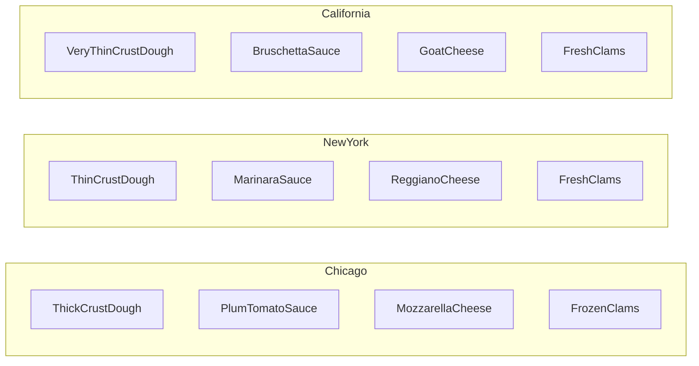

!!! note
    Todas las pizzas de Objectville están hechas con los mismos componentes, pero cada región tiene una implementación diferente de esos componentes.

!!! note
    Cada familia consiste en un tipo de masa, un tipo de salsa, un tipo de queso y un topping de marisco (junto con algunos más que no hemos mostrado, como vegetales y especias). En total, estas tres regiones constituyen familias de ingredientes, con cada región implementando una familia completa de ingredientes.

## Construir las fábricas de ingredientes

Ahora vamos a construir una fábrica para crear nuestros ingredientes; la fábrica será responsable de crear cada ingrediente de la familia de ingredientes. En otras palabras, la fábrica tendrá que crear masa, salsa, queso, etc... Verás cómo vamos a gestionar las diferencias regionales en breve.

Empecemos definiendo una interfaz para la fábrica que va a crear todos nuestros ingredientes:

```java
public interface PizzaIngredientFactory {
    public Dough createDough();
    public Sauce createSauce();
    public Cheese createCheese();
    public Veggies[] createVeggies();
    public Pepperoni createPepperoni();
    public Clams createClam();
}
```

!!! note
    Para cada ingrediente definimos un método de creación en nuestra interfaz. Aquí hay muchas clases nuevas, una por ingrediente.

Con esa interfaz, esto es lo que vamos a hacer:

1. Construir una fábrica para cada región. Para ello, crearás una subclase de `PizzaIngredientFactory` que implemente cada método de creación.
2. Implementar un conjunto de clases de ingredientes que se usen con la fábrica, como `ReggianoCheese`, `RedPeppers` y `ThickCrustDough`. Estas clases se pueden compartir entre regiones cuando sea apropiado.
3. Después todavía tendremos que conectar todo esto integrando nuestras nuevas fábricas de ingredientes en nuestro viejo código de `PizzaStore`.

## Construir la fábrica de ingredientes de Nueva York

Vale, aquí tienes la implementación de la fábrica de ingredientes de Nueva York. Esta fábrica se especializa en salsa marinara, queso reggiano, almejas frescas, etc.

!!! note
    La fábrica de ingredientes de NY implementa la interfaz para todas las fábricas de ingredientes.

```java
public class NYPizzaIngredientFactory implements PizzaIngredientFactory {
    public Dough createDough() {
        return new ThinCrustDough();
    }
    public Sauce createSauce() {
        return new MarinaraSauce();
    }
    public Cheese createCheese() {
        return new ReggianoCheese();
    }
    public Veggies[] createVeggies() {
        Veggies veggies[] = { new Garlic(), new Onion(), new Mushroom(), new RedPepper() };
        return veggies;
    }
    public Pepperoni createPepperoni() {
        return new SlicedPepperoni();
    }
    public Clams createClam() {
        return new FreshClams();
    }
}
```

!!! note
    Para cada ingrediente de la familia de ingredientes, creamos la versión de Nueva York.

!!! note
    Para los vegetales, devolvemos un array de `Veggies`. Aquí los hemos fijado en el código. Podríamos hacer esto más sofisticado, pero eso no aporta realmente nada al aprendizaje del patrón Factory, así que lo mantendremos simple.

!!! note
    El mejor pepperoni en lonchas. Este se comparte entre Nueva York y Chicago. Asegúrate de usarlo en la página siguiente, cuando te toque implementar tú mismo la fábrica de Chicago.

!!! note
    Nueva York está en la costa; obtiene almejas frescas. Chicago tiene que conformarse con congeladas.

!!! exercise "Tu turno"
    Escribe la `ChicagoPizzaIngredientFactory`. Puedes hacer referencia a las siguientes clases en tu implementación: `EggPlant`, `Spinach`, `ThickCrustDough`, `SlicedPepperoni`, `BlackOlives`, `PlumTomatoSauce`, `FrozenClams` y `MozzarellaCheese`.

## Rehacer las pizzas...

Ya tenemos nuestras fábricas en marcha y listas para producir ingredientes de calidad; ahora solo necesitamos rehacer nuestras `Pizza` para que usen únicamente ingredientes producidos por fábricas. Empecemos por nuestra clase abstracta `Pizza`:

```java
public abstract class Pizza {
    String name;
    Dough dough;
    Sauce sauce;
    Veggies veggies[];
    Cheese cheese;
    Pepperoni pepperoni;
    Clams clam;
    abstract void prepare();
    void bake() {
        System.out.println("Bake for 25 minutes at 350");
    }
    void cut() {
        System.out.println("Cutting the pizza into diagonal slices");
    }
    void box() {
        System.out.println("Place pizza in official PizzaStore box");
    }
    void setName(String name) {
        this.name = name;
    }
    String getName() {
        return name;
    }
    public String toString() {
        // code to print pizza here
    }
}
```

!!! note
    Cada pizza mantiene un conjunto de ingredientes que se usan en su preparación.

!!! note
    Hemos hecho que el método `prepare` sea abstracto. Aquí es donde vamos a reunir los ingredientes necesarios para la pizza, que por supuesto vendrán de la fábrica de ingredientes.

!!! note
    Nuestros demás métodos se quedan igual, con la excepción del método `prepare`.

## Rehacer las pizzas, continuación...

Ahora que tienes una clase abstracta `Pizza` con la que trabajar, es hora de crear las pizzas estilo Nueva York y estilo Chicago; solo que esta vez obtendrán sus ingredientes directamente de la fábrica. ¡Se acabó los días de escatimar con los ingredientes por parte de los franquiciados!

Cuando escribimos el código de Factory Method teníamos una `NYCheesePizza` y una clase `ChicagoCheesePizza`. Si miras las dos clases, lo único que difiere es el uso de ingredientes regionales. Las pizzas se hacen exactamente igual (masa + salsa + queso). Lo mismo ocurre con las otras pizzas: Veggie, Clam, etc. Todas siguen los mismos pasos de preparación; solo tienen ingredientes distintos.

Así que, lo que verás es que realmente no necesitamos dos clases para cada pizza; la fábrica de ingredientes se va a encarga de gestionar por nosotros las diferencias regionales.

Aquí tienes el `CheesePizza`:

```java
public class CheesePizza extends Pizza {
    PizzaIngredientFactory ingredientFactory;
    public CheesePizza(PizzaIngredientFactory ingredientFactory) {
        this.ingredientFactory = ingredientFactory;
    }
    void prepare() {
        System.out.println("Preparing " + name);
        dough = ingredientFactory.createDough();
        sauce = ingredientFactory.createSauce();
        cheese = ingredientFactory.createCheese();
    }
}
```

!!! note
    Para hacer una pizza ahora necesitamos una fábrica que proporcione los ingredientes. Así que cada clase `Pizza` recibe una fábrica en su constructor, que se guarda en una variable de instancia.

!!! note
    ¡Aquí es donde ocurre la magia!

!!! note
    El método `prepare()` recorre la creación de una pizza de queso, y cada vez que necesita un ingrediente, le pide a la fábrica que lo produzca.

### Código de cerca

El código de `Pizza` usa la fábrica con la que ha sido compuesto para producir los ingredientes que se usan en la pizza. Los ingredientes producidos dependen de qué fábrica estemos usando. A la clase `Pizza` no le importa; sabe cómo hacer pizzas. Ahora, está desacoplada de las diferencias en los ingredientes regionales y se puede reutilizar fácilmente cuando haya fábricas para Austin, Nashville y más allá.

```java
sauce = ingredientFactory.createSauce();
```

!!! note
    Estamos asignando a la variable de instancia `sauce` la salsa específica usada en esta pizza.

!!! note
    Esta es nuestra variable de instancia `ingredientFactory`.

!!! note
    La clase `Pizza` no le importa qué fábrica se use, siempre y cuando sea una fábrica de ingredientes.

!!! note
    El método `createSauce()` devuelve la salsa que se usa en su región. Si esta es una fábrica de ingredientes de NY, obtenemos salsa marinara.

Veamos también el `ClamPizza`:

```java
public class ClamPizza extends Pizza {
    PizzaIngredientFactory ingredientFactory;
    public ClamPizza(PizzaIngredientFactory ingredientFactory) {
        this.ingredientFactory = ingredientFactory;
    }
    void prepare() {
        System.out.println("Preparing " + name);
        dough = ingredientFactory.createDough();
        sauce = ingredientFactory.createSauce();
        cheese = ingredientFactory.createCheese();
        clam = ingredientFactory.createClam();
    }
}
```

!!! note
    `ClamPizza` también guarda una fábrica de ingredientes.

!!! note
    Para hacer una pizza de almejas, el método `prepare()` reúne los ingredientes adecuados de su fábrica local.

!!! note
    Si es una fábrica de Nueva York, las almejas serán frescas; si es de Chicago, serán congeladas.

## Visitar de nuevo nuestras pizzerías

Ya casi estamos; solo necesitamos hacer una visita rápida a nuestras tiendas franquiciadas para asegurarnos de que están usando las pizzas correctas. También necesitamos darles una referencia a sus fábricas de ingredientes locales:

```java
public class NYPizzaStore extends PizzaStore {
    protected Pizza createPizza(String item) {
        Pizza pizza = null;
        PizzaIngredientFactory ingredientFactory =
            new NYPizzaIngredientFactory();
        if (item.equals("cheese")) {
            pizza = new CheesePizza(ingredientFactory);
            pizza.setName("New York Style Cheese Pizza");
        } else if (item.equals("veggie")) {
            pizza = new VeggiePizza(ingredientFactory);
            pizza.setName("New York Style Veggie Pizza");
        } else if (item.equals("clam")) {
            pizza = new ClamPizza(ingredientFactory);
            pizza.setName("New York Style Clam Pizza");
        } else if (item.equals("pepperoni")) {
            pizza = new PepperoniPizza(ingredientFactory);
            pizza.setName("New York Style Pepperoni Pizza");
        }
        return pizza;
    }
}
```

!!! note
    La tienda de NY se compone con una fábrica de ingredientes de pizza de Nueva York. Se usará para producir los ingredientes de todas las pizzas estilo NY.

!!! note
    Ahora pasamos a cada pizza la fábrica que debe usarse para producir sus ingredientes. Mira atrás una página y asegúrate de entender cómo funcionan juntas la pizza y la fábrica.

!!! note
    Para cada tipo de `Pizza`, instanciamos una nueva `Pizza` y le damos la fábrica que necesita para conseguir sus ingredientes.

!!! note
    Compara esta versión del método `createPizza()` con la de la implementación de Factory Method anterior en el capítulo.

## ¿Qué hemos hecho?

Fue toda una serie de cambios en el código; ¿qué hicimos exactamente?

Proporcionamos un medio de crear una familia de ingredientes para pizzas introduciendo un nuevo tipo de fábrica llamado Abstract Factory.

1. Una Abstract Factory proporciona una interfaz para crear una familia de productos. ¿Qué es una familia? En nuestro caso, es todo lo que necesitamos para hacer una pizza: masa, salsa, queso, carnes y vegetales.

    !!! note
        Define la interfaz.

2. De la fábrica abstracta derivamos una o más fábricas concretas que producen los mismos productos, pero con implementaciones diferentes.

    !!! note
        Proporciona implementaciones para los productos.

3. A continuación escribimos nuestro código para que use la fábrica y crear productos. Al pasar distintas fábricas, obtenemos distintas implementaciones de esos productos. Pero nuestro código cliente no cambia.

    !!! note
        Pizza hecha con ingredientes producidos por una fábrica concreta.

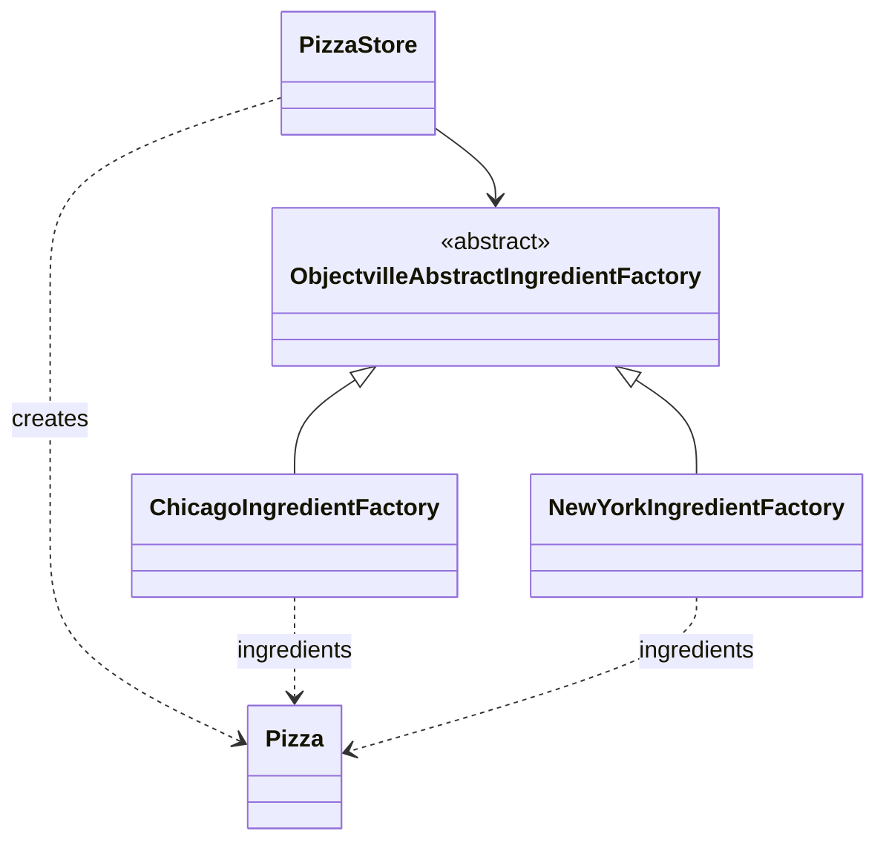

## Más pizza para Ethan y Joel...

Ethan y Joel no se cansan de Objectville Pizza. Lo que no saben es que ahora sus pedidos hacen uso de las nuevas fábricas de ingredientes. Así que ahora, cuando piden...

- **Joel:** Me quedo con Chicago.
- **Ethan:** Todavía me encanta el estilo NY.

La primera parte del proceso de pedido no ha cambiado en absoluto. Sigamos el pedido de Ethan otra vez:

### Entre bastidores

1. Primero necesitamos un `NYPizzaStore`:

    ```java
    PizzaStore nyPizzaStore = new NYPizzaStore();
    ```

    !!! note
        Crea una instancia de `NYPizzaStore`.

2. Ahora que tenemos una tienda, podemos tomar un pedido:

    ```java
    nyPizzaStore.orderPizza("cheese");
    ```

    !!! note
        Se llama al método `orderPizza()` en la instancia `nyPizzaStore`.

3. El método `orderPizza()` llama primero al método `createPizza()`:

    ```java
    Pizza pizza  = createPizza("cheese");
    ```

    !!! note
        (Véase en la página siguiente.)

### Desde aquí las cosas cambian, porque estamos usando una fábrica de ingredientes

4. Cuando se llama al método `createPizza()`, es cuando interviene nuestra fábrica de ingredientes:

    ```java
    Pizza pizza = new CheesePizza(nyIngredientFactory);
    ```

    !!! note
        Se elige la fábrica de ingredientes y se instancia en el `PizzaStore`, y luego se pasa al constructor de cada pizza.

    !!! note
        Crea una instancia de `Pizza` que se compone con la fábrica de ingredientes de Nueva York. La instancia de `Pizza` guarda una referencia a la variable `ingredientFactory`.

5. A continuación necesitamos preparar la pizza. Una vez que se llama al método `prepare()`, se le pide a la fábrica que prepare los ingredientes:

    ```java
    void prepare() {
        dough = factory.createDough();
        sauce = factory.createSauce();
        cheese = factory.createCheese();
    }
    ```

    !!! note
        Masa fina, marinara, reggiano.

    !!! note
        Para la pizza de Ethan se usa la fábrica de ingredientes de Nueva York, y por eso obtenemos los ingredientes de NY.

6. Finalmente, tenemos la pizza preparada en la mano y el método `orderPizza()` hornea, corta y empaqueta la pizza.

## Patrón Abstract Factory definido

Estamos añadiendo otro patrón de fábrica más a nuestra familia de patrones, uno que nos permite crear familias de productos. Veamos la definición oficial de este patrón:

!!! question "Definición"
    El patrón **Abstract Factory** proporciona una interfaz para crear familias de objetos relacionados o dependientes sin especificar sus clases concretas.

Ya hemos visto sin duda que Abstract Factory permite que un cliente use una interfaz abstracta para crear un conjunto de productos relacionados sin saber (ni importar) de los productos concretos que realmente se producen. De este modo, el cliente queda desacoplado de todos los detalles de los productos concretos. Veamos el diagrama de clases para ver cómo encaja todo esto:

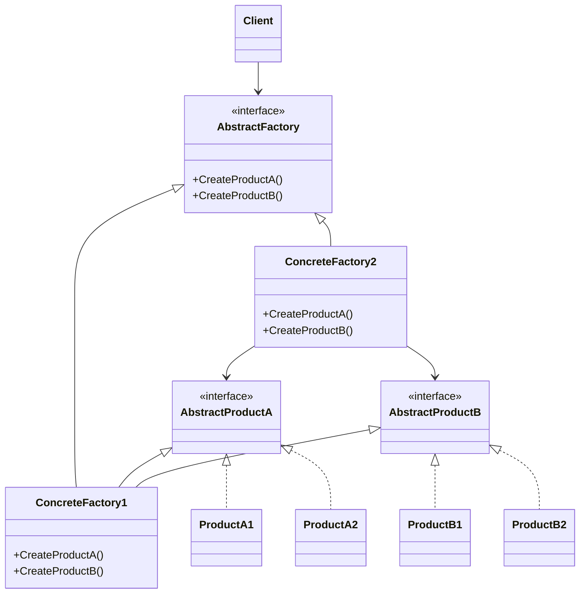

!!! note
    El `Client` está escrito contra la fábrica abstracta y luego se compone en tiempo de ejecución con una fábrica real.

!!! note
    La Abstract Factory define la interfaz que todas las fábricas concretas deben implementar, que consiste en un conjunto de métodos para producir productos.

!!! note
    Este es el producto de la familia. Cada fábrica concreta puede producir un conjunto completo de productos.

!!! note
    Las fábricas concretas implementan las distintas familias de productos. Para crear un producto, el cliente usa una de estas fábricas, así que nunca tiene que instanciar un objeto de producto.

Ese diagrama de clases es bastante complicado; veamos todo en términos de nuestro `PizzaStore`:

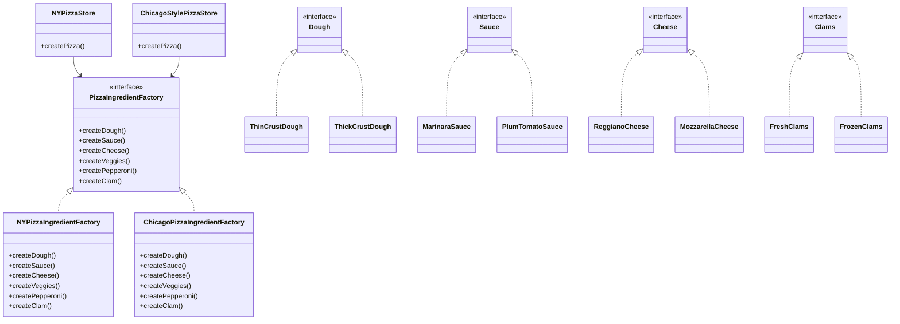

!!! note
    Los clientes de la Abstract Factory son las dos instancias de nuestro `PizzaStore`, `NYPizzaStore` y `ChicagoStylePizzaStore`.

!!! note
    La `PizzaIngredientFactory` abstracta es la interfaz que define cómo hacer una familia de productos relacionados: todo lo que necesitamos para hacer una pizza.

!!! note
    El trabajo de las fábricas de pizza concretas es fabricar ingredientes de pizza. Cada fábrica sabe cómo crear los objetos adecuados para su región.

!!! note
    Cada fábrica produce una implementación diferente para la familia de productos.

!!! note
    He observado que cada método de la Abstract Factory en realidad parece un método de fábrica (`createDough()`, `createSauce()`, etc.). Cada método se declara abstracto y las subclases lo sobrescriben para crear algún objeto. ¿No es eso un método de fábrica?

!!! question "¿Hay un método de fábrica escondido dentro de la Abstract Factory?"
    ¡Buen ojo! Sí, a menudo los métodos de una Abstract Factory se implementan como métodos de fábrica. Tiene sentido, ¿no? El trabajo de una Abstract Factory es definir una interfaz para crear un conjunto de productos. Cada método de esa interfaz es responsable de crear un producto concreto, y nosotros implementamos una subclase de la Abstract Factory para suministrar esas implementaciones. Así que los métodos de fábrica son una forma natural de implementar tus métodos de producto en tus fábricas abstractas.

## Patrones al descubierto

!!! example "La entrevista de esta semana: Factory Method y Abstract Factory, el uno sobre el otro"

    **HeadFirst:** ¡Vaya, una entrevista con dos patrones a la vez! Esto es toda una novedad para nosotros.

    **Factory Method:** Pues a mí no me entusiasma mucho que me metan en el mismo saco que a Abstract Factory, ya sabes. El hecho de que los dos somos patrones de fábrica no significa que no debamos tener nuestras propias entrevistas.

    **HeadFirst:** No te enfades, queríamos entrevistaros a la vez para poder aclarar cualquier confusión sobre quién es quién para los lectores. Sí que tenéis semejanzas, y he oído que a veces la gente os confunde.

    **Abstract Factory:** Es cierto, ha habido veces en que me han confundido con Factory Method, y sé que tú has tenido problemas similares, Factory Method. Los dos somos muy buenos desacoplando aplicaciones de implementaciones concretas; lo que hacemos es de maneras distintas. Así que puedo entender por qué la gente a veces nos confunde.

    **Factory Method:** Bueno, todavía me fastidia. Después de todo, yo uso clases para crear y tú usas objetos; ¡eso es totalmente distinto!

    **HeadFirst:** ¿Puedes explicar algo más sobre eso, Factory Method?

    **Abstract Factory:** ¿De qué te ríes, Factory Method?

    **Factory Method:** <risitas>

    **Factory Method:** Oh, no me vengas con eso, ¡eso es muy importante! Cambiar tu interfaz significa que tienes que entrar y cambiar la interfaz de cada subclase. Eso suena a mucho trabajo.

    **Abstract Factory:** Claro. Tanto Abstract Factory como yo creamos objetos; ese es nuestro trabajo. Pero yo lo hago por herencia...

    **Abstract Factory:** ...y yo lo hago por composición de objetos.

    **Factory Method:** Exacto. Así que eso significa que, para crear objetos usando Factory Method, necesitas extender una clase y proporcionar una implementación para un método de fábrica.

    **Abstract Factory:** Sí, pero necesito una interfaz grande, porque estoy acostumbrado a crear familias enteras de productos. Tú solo creas un producto, así que no necesitas realmente una interfaz grande, solo necesitas un método.

    **HeadFirst:** ¿Y ese método de fábrica qué hace?

    **Factory Method:** ¡Crea objetos, por supuesto! Quiero decir, todo el sentido del patrón Factory Method es que usas una subclase para que haga la creación por ti. De ese modo, los clientes solo necesitan conocer el tipo abstracto que están usando; de la subclase se preocupa el tipo concreto. Así que, en otras palabras, yo mantengo a los clientes desacoplados de los tipos concretos.

    **HeadFirst:** Abstract Factory, he oído que tú usas a menudo métodos de fábrica para implementar tus fábricas concretas, ¿no?

    **Abstract Factory:** Sí, lo admito, mis fábricas concretas a menudo implementan un método de fábrica para crear sus productos. En mi caso, se usan únicamente para crear productos...

    **Factory Method:** ...mientras que en mi caso yo normalmente implemento código en el creador abstracto que hace uso de los tipos concretos que crean las subclases.

    **Abstract Factory:** Y yo también, solo que lo hago de una manera distinta.

    **HeadFirst:** Sigue, Abstract Factory... has dicho algo sobre la composición de objetos.

    **Abstract Factory:** Proporciono un tipo abstracto para crear una familia de productos. Las subclases de este tipo definen cómo se producen esos productos. Para usar la fábrica, instancias una y la pasas a algún código que está escrito contra el tipo abstracto. Así que, como Factory Method, mis clientes están desacoplados de los productos concretos que usan.

    **HeadFirst:** Ah, vale, así que otra ventaja es que agrupas un conjunto de productos relacionados.

    **Abstract Factory:** Eso es.

    **HeadFirst:** ¿Qué pasa si necesitas extender ese conjunto de productos relacionados para, digamos, añadir otro? ¿No requiere eso cambiar tu interfaz?

    **Abstract Factory:** Es cierto; mi interfaz tiene que cambiar si se añaden productos nuevos, y ya sé que a la gente no le gusta hacer eso....

    **Factory Method:** Gracias. Recuérdame, Abstract Factory, y úsame siempre que tengas familias de productos que necesites crear y quieras asegurarte de que tus clientes crean productos que pertenecen juntos.

    **Abstract Factory:** Eso es.

    **Factory Method:** Y yo soy Factory Method; úsame para desacoplar tu código cliente de las clases concretas que necesites instanciar, o si no sabes de antemano todas las clases concretas que vas a necesitar. Para usarme, ¡solo extiéndeme e implementa mi método de fábrica!

    **HeadFirst:** Suena a que los dos hacéis bien lo vuestro. Estoy seguro de que a la gente le gusta tener opción; después de todo, las fábricas son tan útiles que querrán usarlas en toda clase de situaciones distintas. Los dos encapsuláis la creación de objetos para mantener las aplicaciones débilmente acopladas y menos dependientes de las implementaciones, lo cual es genial, ya sea que estés usando Factory Method o Abstract Factory. ¿Puedo darle a cada uno una palabra de despedida?

    **Factory Method:** Claro.

    **Abstract Factory:** Gracias.

## Factory Method y Abstract Factory comparados

`PizzaStore` se implementa como Factory Method porque queremos poder crear un producto que varía por región. Con Factory Method, cada región obtiene su propia fábrica concreta, que sabe cómo hacer pizzas apropiadas para la zona.

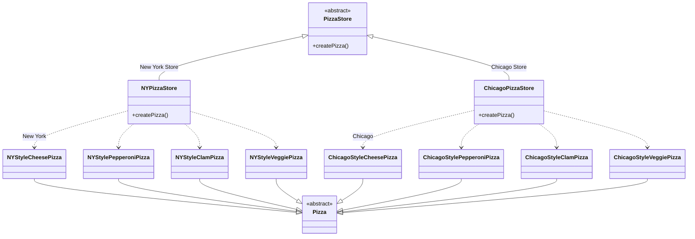

!!! note
    `PizzaStore` proporciona una interfaz abstracta para crear un producto.

!!! note
    Cada subclase decide qué clase concreta instanciar. Las subclases son instanciadas por los métodos Factory Method.

!!! note
    Este es el producto del `PizzaStore`. Los clientes solo dependen de este tipo abstracto. El método `createPizza()` está parametrizado por el tipo de pizza, así que podemos devolver muchos tipos de productos de pizza.

`PizzaIngredientFactory` se implementa como Abstract Factory porque necesitamos crear familias de productos (los ingredientes). Cada subclase implementa los ingredientes usando sus propios proveedores regionales.

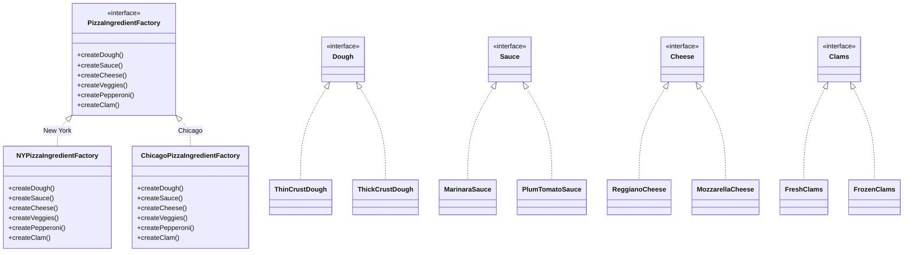

!!! note
    `PizzaIngredientFactory` proporciona una interfaz abstracta para crear una familia de productos.

!!! note
    Cada subclase concreta crea una familia de productos. Los métodos para crear productos en una Abstract Factory a menudo se implementan con un Factory Method: por ejemplo, la subclase decide el tipo de masa... o el tipo de almejas.

!!! note
    Cada ingrediente representa un producto que es producido por un Factory Method en la Abstract Factory. Las subclases de producto crean conjuntos paralelos de familias de productos. Aquí tenemos una familia de ingredientes de Nueva York y una familia de Chicago.

## Herramientas para tu caja de diseño

En este capítulo hemos añadido dos herramientas más a tu caja de herramientas: **Factory Method** y **Abstract Factory**. Ambos patrones encapsulan la creación de objetos y te permiten desacoplar tu código de los tipos concretos.

!!! abstract "Conceptos básicos de OO"
    - Abstracción
    - Encapsulación
    - Polimorfismo
    - Herencia

!!! abstract "Principios de OO"
    - Encapsula lo que varía.
    - Favorece la composición sobre la herencia.
    - Programa contra interfaces, no contra implementaciones.
    - Aspira a diseños con acoplamiento débil entre objetos que interactúan.
    - **Las clases deberían estar abiertas a la extensión, pero cerradas a la modificación.**

!!! abstract "Patrones de OO"
    - **Strategy** — define una familia de algoritmos, encapsula cada uno y los hace intercambiables. Strategy permite que el algoritmo varíe independientemente de los clientes que lo usan.
    - **Observer** — define una dependencia de uno a muchos entre objetos, de modo que cuando un objeto cambia de estado, todos sus dependientes son notificados y actualizados automáticamente.
    - **Decorator** — adjunta responsabilidades adicionales a un objeto de forma dinámica. Los decoradores proporcionan una alternativa flexible a la subclase para extender la funcionalidad.
    - **Abstract Factory** — proporciona una interfaz para crear familias de objetos relacionados o dependientes sin especificar sus clases concretas.
    - **Factory Method** — define una interfaz para crear un objeto, pero deja que las subclases decidan qué clase instanciar. Factory Method permite que una clase difiera la instanciación a las subclases.

!!! note "Lo que hemos aprendido"
    - Todas las fábricas encapsulan la creación de objetos.
    - Simple Factory, aunque no es un patrón de diseño de pleno derecho, es una forma sencilla de desacoplar a tus clientes de las clases concretas.
    - Factory Method se apoya en la herencia: la creación de objetos se delega en las subclases, que implementan el método de fábrica para crear los objetos.
    - Abstract Factory se apoya en la composición de objetos: la creación de objetos se implementa en métodos expuestos en la interfaz de la fábrica.
    - Todos los patrones de fábrica promueven el acoplamiento débil al reducir la dependencia de tu aplicación con respecto a las clases concretas.
    - La intención de Factory Method es permitir que una clase difiera la instanciación a sus subclases.
    - La intención de Abstract Factory es crear familias de objetos relacionados sin tener que depender de sus clases concretas.
    - El Principio de Inversión de Dependencias nos guía para evitar las dependencias de tipos concretos y aspirar a las abstracciones, no a las clases concretas.
    - Las fábricas son una técnica poderosa para programar contra abstracciones, no contra clases concretas.

    Tenemos un nuevo principio que nos guía a mantener las cosas abstractas siempre que sea posible. Ambos de estos nuevos patrones encapsulan la creación de objetos y dan lugar a diseños más desacoplados y flexibles. Las clases deberían estar abiertas a la extensión, pero cerradas a la modificación.

## Crucigrama de patrones de diseño

Ha sido un capítulo largo. Coge un trozo de pizza y relájate mientras haces este crucigrama; todas las palabras de la solución son de este capítulo.

| N.º | Dirección | Definición |
| --- | --- | --- |
| 1 | Horizontal | En Factory Method, cada franquicia es _________. |
| 3 | Horizontal | Abstract Factory crea una _________ de productos. |
| 6 | Horizontal | El papel de `PizzaStore` en el patrón Factory Method. |
| 8 | Vertical | En Abstract Factory, cada fábrica de ingredientes es una _________. |
| 9 | Vertical | Cuando usas `new`, estás programando contra una ___________. |
| 11 | Vertical | `createPizza()` es un ____________. |
| 13 | Vertical | En Factory Method, el `PizzaStore` y las `Pizza` concretas dependen todos de esta abstracción. |
| 14 | Vertical | Cuando una clase instancia un objeto de una clase concreta, está ___________ en ese objeto. |
| 15 | Horizontal | Todos los patrones de fábrica nos permiten __________ la creación de objetos. |
| 2 | Vertical | Usamos ___________ en Simple Factory y en Abstract Factory, y herencia en Factory Method. |
| 4 | Vertical | En Factory Method, ¿quién decide qué clase instanciar? |
| 5 | Vertical | No es un patrón de fábrica REAL, pero resultaba muy útil. |
| 7 | Vertical | Todas las pizzas estilo Nueva York usan este tipo de queso. |
| 10 | Horizontal | A Ethan le gusta este tipo de pizza. |
| 12 | Horizontal | A Joel le gusta este tipo de pizza. |

## Soluciones de los ejercicios

!!! success "Solución: las pizzerías de Chicago y de California"
    Ya hemos terminado la `NYPizzaStore`; solo faltan dos más y estaremos listos para franquiciar. Escribe aquí las implementaciones de `PizzaStore` de estilo Chicago y de estilo California:

    ```java
    public class ChicagoPizzaStore extends PizzaStore {
        protected Pizza createPizza(String item) {
            if (item.equals("cheese")) {
                return new ChicagoStyleCheesePizza();
            } else if (item.equals("veggie")) {
                return new ChicagoStyleVeggiePizza();
            } else if (item.equals("clam")) {
                return new ChicagoStyleClamPizza();
            } else if (item.equals("pepperoni")) {
                return new ChicagoStylePepperoniPizza();
            } else return null;
        }
    }
    ```

    ```java
    public class CaliforniaPizzaStore extends PizzaStore {
        protected Pizza createPizza(String item) {
            if (item.equals("cheese")) {
                return new CaliforniaStyleCheesePizza();
            } else if (item.equals("veggie")) {
                return new CaliforniaStyleVeggiePizza();
            } else if (item.equals("clam")) {
                return new CaliforniaStyleClamPizza();
            } else if (item.equals("pepperoni")) {
                return new CaliforniaStylePepperoniPizza();
            } else return null;
        }
    }
    ```

    !!! note
        Ambas tiendas son casi exactamente como la tienda de Nueva York... solo crean distintos tipos de pizzas.

    !!! note
        Para la pizza de Chicago, simplemente tenemos que asegurarnos de crear pizzas estilo Chicago... y para la pizzería de California, creamos pizzas estilo California.

### Solución del reto de diseño

Necesitamos otro tipo de pizza para esos californianos tan locos (locos en el buen sentido, por supuesto). Dibuja otro conjunto paralelo de clases que tendrías que añadir para incorporar una nueva región de California a nuestro `PizzaStore`.

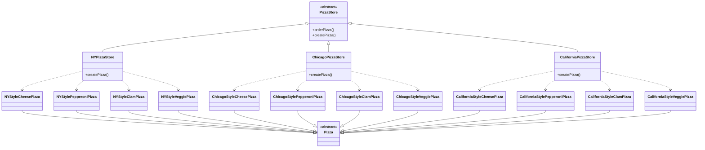

!!! note
    Aquí está todo lo que necesitas para añadir una pizzería de California: la clase concreta de pizzería y las pizzas estilo California.

Vale, ahora escribe las cinco cosas más tontas que se te ocurran para poner sobre una pizza. Después, ¡estarás listo para abrir un negocio de pizzas en California!

!!! note
    Aquí van nuestras sugerencias: puré de patatas con ajo asado, salsa BBQ, corazones de alcachofa, M&M's y cacahuetes.

!!! success "Solución: cuenta las dependencias de `PizzaStore`"
    Fingamos que nunca has oído hablar de una fábrica OO. Aquí tienes una versión «muy dependiente» de `PizzaStore` que no usa ninguna fábrica. Necesitamos que cuentes cuántas clases concretas de pizza de las que depende esta clase. Si añadieras pizzas estilo California a `PizzaStore`, ¿de cuántas clases dependería entonces? Aquí está nuestra solución.

    ```java
    public class DependentPizzaStore {
        public Pizza createPizza(String style, String type) {
            Pizza pizza = null;
            if (style.equals("NY")) {
                if (type.equals("cheese")) {
                    pizza = new NYStyleCheesePizza();
                } else if (type.equals("veggie")) {
                    pizza = new NYStyleVeggiePizza();
                } else if (type.equals("clam")) {
                    pizza = new NYStyleClamPizza();
                } else if (type.equals("pepperoni")) {
                    pizza = new NYStylePepperoniPizza();
                }
            } else if (style.equals("Chicago")) {
                if (type.equals("cheese")) {
                    pizza = new ChicagoStyleCheesePizza();
                } else if (type.equals("veggie")) {
                    pizza = new ChicagoStyleVeggiePizza();
                } else if (type.equals("clam")) {
                    pizza = new ChicagoStyleClamPizza();
                } else if (type.equals("pepperoni")) {
                    pizza = new ChicagoStylePepperoniPizza();
                }
            } else {
                System.out.println("Error: invalid type of pizza");
                return null;
            }
            pizza.prepare();
            pizza.bake();
            pizza.cut();
            pizza.box();
            return pizza;
        }
    }
    ```

    !!! note
        Maneja todas las pizzas estilo NY.

    !!! note
        Maneja todas las pizzas estilo Chicago.

    !!! note
        Puedes escribir aquí tus respuestas numéricas: **8** clases concretas de pizza de las que depende, y **12** si también se cuentan las de California.

!!! success "Solución: la fábrica de ingredientes de Chicago"
    Adelante, escribe la `ChicagoPizzaIngredientFactory`; puedes hacer referencia a las siguientes clases en tu implementación:

    ```java
    public class ChicagoPizzaIngredientFactory
        implements PizzaIngredientFactory
    {
        public Dough createDough() {
            return new ThickCrustDough();
        }
        public Sauce createSauce() {
            return new PlumTomatoSauce();
        }
        public Cheese createCheese() {
            return new MozzarellaCheese();
        }
        public Veggies[] createVeggies() {
            Veggies veggies[] = { new BlackOlives(),
                                  new Spinach(),
                                  new Eggplant() };
            return veggies;
        }
        public Pepperoni createPepperoni() {
            return new SlicedPepperoni();
        }
        public Clams createClam() {
            return new FrozenClams();
        }
    }
    ```

    Clases de referencia: `EggPlant`, `Spinach`, `ThickCrustDough`, `SlicedPepperoni`, `BlackOlives`, `PlumTomatoSauce`, `FrozenClams`, `MozzarellaCheese`.

## Solución del crucigrama de patrones de diseño

Ha sido un capítulo largo. Coge un trozo de pizza y relájate mientras haces este crucigrama; todas las palabras de la solución son de este capítulo. Aquí está la solución.

| N.º | Dirección | Definición | Respuesta |
| --- | --- | --- | --- |
| 1 | Horizontal | En Factory Method, cada franquicia es _________. | CONCRETE CREATOR |
| 3 | Horizontal | Abstract Factory crea una _________ de productos. | FAMILY |
| 6 | Horizontal | El papel de `PizzaStore` en el patrón Factory Method. | CREATOR |
| 8 | Vertical | En Abstract Factory, cada fábrica de ingredientes es una _________. | CONCRETE FACTORY |
| 9 | Vertical | Cuando usas `new`, estás programando contra una ___________. | IMPLEMENTATION |
| 11 | Vertical | `createPizza()` es un ____________. | FACTORY METHOD |
| 13 | Vertical | En Factory Method, el `PizzaStore` y las `Pizza` concretas dependen todos de esta abstracción. | PIZZA |
| 14 | Vertical | Cuando una clase instancia un objeto de una clase concreta, está ___________ en ese objeto. | DEPENDENT |
| 15 | Horizontal | Todos los patrones de fábrica nos permiten __________ la creación de objetos. | ENCAPSULATE |
| 2 | Vertical | Usamos ___________ en Simple Factory y en Abstract Factory, y herencia en Factory Method. | COMPOSITION |
| 4 | Vertical | En Factory Method, ¿quién decide qué clase instanciar? | SUBCLASS |
| 5 | Vertical | No es un patrón de fábrica REAL, pero resultaba muy útil. | SIMPLE |
| 7 | Vertical | Todas las pizzas estilo Nueva York usan este tipo de queso. | REGGIANO |
| 10 | Horizontal | A Ethan le gusta este tipo de pizza. | VEGGIE |
| 12 | Horizontal | A Joel le gusta este tipo de pizza. | CHICAGO STYLE |
