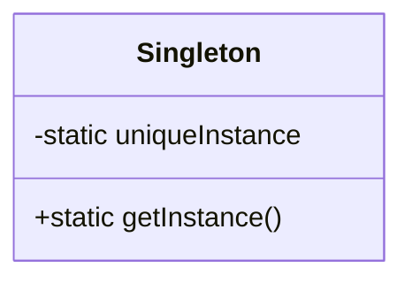

# Capítulo 5: El patrón Singleton

> **Objetos únicos**
>
> Nuestra próxima parada es el patrón Singleton, nuestro boleto para crear objetos únicos de los que existe una sola y única instancia, siempre. Quizá te alegre saber que, de todos los patrones, el Singleton es el más simple en lo que se refiere a su diagrama de clases; de hecho, ¡el diagrama contiene una única clase! Pero no te acomodes demasiado; a pesar de su simplicidad desde el punto de vista del diseño de clases, va a exigir un pensar profundo orientado a objetos en su implementación. Así que ponte la gorra de pensador y vamos allá.

!!! note "Nota al margen"
    **Objetos únicos**

    - ¿Le estás hablando a mí o al coche?
    - Ah, ¿y cuándo me devuelven mi manopla de horno?
    - Te digo que es ÚNICA DE SU CLASE. Mira las líneas, las curvas, la carrocería, los faros.

## Uno y solo uno

!!! note "Nota al margen"
    **Uno y solo uno**

    - ¿Qué es esto? ¿Un capítulo entero sobre cómo instanciar un solo objeto?
    - Eso es un solo y ÚNICO objeto.

**Desarrollador:** ¿De qué sirve eso?

**Guru:** Hay muchos objetos de los que solo necesitamos uno: grupos de hilos (*thread pools*), cachés, cuadros de diálogo, objetos que gestionan las preferencias y los ajustes del registro, objetos usados para el registro de eventos (*logging*) y objetos que actúan como controladores de dispositivo para dispositivos como impresoras y tarjetas gráficas. De hecho, para muchos de estos tipos de objetos, si instanciáramos más de uno nos enfrentaríamos a toda clase de problemas: un comportamiento incorrecto del programa, el uso excesivo de recursos o resultados inconsistentes.

**Desarrollador:** Vale, así que quizá haya clases que deberían instanciarse una sola vez, pero ¿de verdad necesito un capítulo entero para eso? ¿No puedo hacerlo simplemente por convención o mediante variables globales? Ya sabes, por ejemplo en Java podría hacerlo con una variable estática.

**Guru:** De muchas maneras, el patrón Singleton es una convención para garantizar que se instancia uno y solo un objeto de una clase dada. Si tienes una forma mejor, al mundo le gustaría oírla; pero recuerda, como todos los patrones, el patrón Singleton es un método contrastado en el tiempo para garantizar que solo se cree un objeto. El patrón Singleton también nos da un punto de acceso global, igual que una variable global, pero sin los inconvenientes.

**Desarrollador:** ¿Qué inconvenientes?

**Guru:** Bueno, aquí tienes un ejemplo: si asignas un objeto a una variable global, ese objeto se podría crear cuando tu aplicación arranca. ¿Verdad? ¿Y si ese objeto consume muchos recursos y tu aplicación nunca llega a usarlo? Como veremos, con el patrón Singleton podemos crear nuestros objetos solo cuando se necesitan.

**Desarrollador:** Esto sigue sin parecerme algo que debería ser tan difícil.

**Guru:** Si manejas bien las variables y los métodos estáticos de una clase, así como los modificadores de acceso, no lo es. Pero, en cualquier caso, resulta interesante ver cómo funciona un Singleton y, por simple que suene, el código de un Singleton es difícil de dejar bien. Pregúntate a ti mismo: ¿cómo evito que se instancie más de un objeto? No es tan obvio, ¿verdad?

## El pequeño Singleton

### Un pequeño ejercicio socrático al estilo de *The Little Lisper*

**El pequeño Singleton:** ¿Cómo crearías un único objeto?

**Tú:**

```java
new MyObject();
```

**El pequeño Singleton:** Sí, por supuesto. ¿Y si otro objeto quisiera crear un `MyObject`? ¿Podría llamar a `new` sobre `MyObject` otra vez?

**Tú:** Sí. Bueno, solo si es una clase pública.

**El pequeño Singleton:** Así que, siempre que tengamos una clase, ¿siempre podemos instanciarla una o más veces?

**Tú:** Sí.

**El pequeño Singleton:** ¿Y si no lo es?

**Tú:** Bueno, si no es una clase pública, solo las clases del mismo paquete pueden instanciarla. Pero todavía pueden instanciarla más de una vez.

**El pequeño Singleton:** Hmm, interesante.

**Tú:** No, nunca lo había pensado, pero supongo que tiene sentido porque es una definición válida.

**El pequeño Singleton:** ¿Sabías que podías hacer esto?

```java
public MyClass {
   private MyClass() {}
}
```

**El pequeño Singleton:** ¿Qué significa esto?

**Tú:** Supongo que es una clase que no se puede instanciar porque tiene un constructor privado.

**El pequeño Singleton:** Bueno, ¿existe ALGÚN objeto que pudiera usar el constructor privado?

**Tú:** Hmm, creo que el código de `MyClass` es el único código que podría llamarlo. Pero eso no tiene mucho sentido.

**El pequeño Singleton:** ¿Por qué no?

**Tú:** Porque tendría que tener una instancia de la clase para llamarlo, y no puedo tener una instancia porque ninguna otra clase puede instanciarla. Es un problema del huevo y la gallina: puedo usar el constructor desde un objeto de tipo `MyClass`, pero nunca podré instanciar ese objeto porque ningún otro objeto puede usar «`new MyClass()`».

**El pequeño Singleton:** Vale. Solo era una idea.

**Tú:** `MyClass` es una clase con un método estático. Podemos llamar al método estático así:

```java
MyClass.getInstance();
```

**El pequeño Singleton:** ¿Qué significa esto?

```java
public MyClass {
   public static MyClass getInstance() {
   }
}
```

**El pequeño Singleton:** ¿Por qué usaste `MyClass` en lugar del nombre de algún objeto?

**Tú:** Bueno, `getInstance()` es un método estático; dicho de otro modo, es un método de CLASE. Necesitas usar el nombre de la clase para referenciar un método estático.

**El pequeño Singleton:** Muy interesante. ¿Y si lo juntamos todo?

**Tú:** Vaya, desde luego que puedes.

*¿Ahora sí puedo instanciar un `MyClass`?*

```java
public MyClass {
    private MyClass() {}
    public static MyClass getInstance() {
        return new MyClass();
    }
}
```

```java
MyClass.getInstance();
```

**El pequeño Singleton:** Bien, ahora ¿se te ocurre una segunda forma de instanciar un objeto? ¿Puedes completar el código de modo que solo se cree NUNCA más de UNA instancia de `MyClass`?

**Tú:** Sí, creo que sí...

*(Encontrarás el código en la página siguiente.)*

## Desmontando la implementación clásica del patrón Singleton

!!! note "Nota marginal"
    Tenemos una variable estática que guarda nuestra única instancia de la clase `Singleton`. Vamos a renombrar `MyClass` a `Singleton`.

    Nuestro constructor está declarado como privado; solo `Singleton` puede instanciar esta clase.

    El método `getInstance()` nos da una forma de instanciar la clase y, además, de devolver una instancia de ella.

    Por supuesto, `Singleton` es una clase normal; tiene otras variables de instancia y otros métodos útiles.

    Si estás simplemente hojeando el libro, no escribas este código a ciegas; lo veremos con más detalle más adelante en el capítulo.

```java
public class Singleton {
    private static Singleton uniqueInstance;
    // other useful instance variables here
    private Singleton() {}
    public static Singleton getInstance() {
        if (uniqueInstance == null) {
            uniqueInstance = new Singleton();
        }
        return uniqueInstance;
    }
    // other useful methods here
}
```

### El código de cerca

!!! note "El código de cerca"
    Si `uniqueInstance` es `null`, es que todavía no hemos creado la instancia...

    `uniqueInstance` guarda nuestra ÚNICA instancia; recuerda, es una variable estática.

    ...y, si no existe, instanciamos `Singleton` a través de su constructor privado y la asignamos a `uniqueInstance`. Fíjate en que, si nunca necesitamos la instancia, esta nunca llega a crearse; esto es instanciación perezosa (*lazy*).

    Si `uniqueInstance` no era `null`, es que se había creado previamente. Simplemente caemos hasta la sentencia `return`.

    Para cuando llegamos a este código ya tenemos una instancia, y la devolvemos.

```java
if (uniqueInstance == null) {
    uniqueInstance = new Singleton();
}
return uniqueInstance;
```

## Patrones al descubierto

!!! example "La entrevista de esta semana: Confesiones de un Singleton"
    **Head First:** Hoy tenemos el placer de traerles una entrevista con un objeto Singleton. ¿Por qué no empiezan contándonos algo sobre ustedes?

    **Singleton:** Bueno, soy totalmente único; ¡solo hay uno de mí!

    **Head First:** ¿Uno?

    **Singleton:** Sí, uno. Estoy basado en el patrón Singleton, que garantiza que en todo momento solo hay una instancia de mí.

    **Head First:** Eso sí que parece un desperdicio, ¿no? Alguien se tomó el tiempo de desarrollar una clase completa y ahora todo lo que obtenemos es un solo objeto.

    **Singleton:** Así es. Mi constructor está declarado como privado.

    **Head First:** ¿Y cómo funciona eso? ¿Cómo se los instancia a USTEDES?

    **Singleton:** A ver, llegar a un objeto Singleton en tu aplicación es hacer uso del mismo recurso global.

    **Head First:** Cuéntenos más...

    **Singleton:** Ah, sirvo para toda clase de cosas. Ser único a veces tiene sus ventajas, ya sabes. Se me usa a menudo para gestionar conjuntos de recursos, como conjuntos de conexiones o de hilos.

    **Head First:** Con todo respeto, ¿solo uno de los de su especie? Eso suena solo.

    **Singleton:** Como solo hay uno de mí, sí, tengo trabajo, pero estaría bien que más desarrolladores me conocieran: muchos desarrolladores se encuentran con errores porque tienen varias copias de objetos dando vueltas por ahí de las que ni siquiera son conscientes.

    **Head First:** Bueno, si se nos permite preguntar: ¿cómo saben que solo hay uno de ustedes? ¿Acaso cualquiera con un nuevo operador no puede crear «un nuevo ustedes»?

    **Singleton:** ¡No! Soy realmente único.

    **Head First:** Bueno, ¿hacen los desarrolladores un juramento de no instanciarlos más de una vez?

    **Singleton:** Por supuesto que no. La verdad es que… esto se está poniendo un poco personal, pero… no tengo constructor público.

    **Head First:** ¡SIN CONSTRUCTOR PÚBLICO! Oh, perdón, ¿sin constructor público?

    **Singleton:** ¡En absoluto! Hay poder en UNO. Supongamos que tienen un objeto que contiene ajustes del registro. No querrán tener varias copias de ese objeto y de sus valores dando vueltas por ahí: eso conduciría al caos. Al usar un objeto como yo pueden asegurarse de que todos los objetos de su aplicación estén usando el mismo objeto; no instancian ninguno, simplemente piden una instancia. Así que mi clase tiene un método estático llamado `getInstance()`. Llámenlo y apareceré al instante, listo para trabajar. De hecho, es posible que ya esté ayudando a otros objetos cuando me pidan.

    **Head First:** Bueno, señor Singleton, parece que hay bastante bajo la manga para que todo esto funcione. Gracias por revelarse y esperamos volver a hablar con usted pronto.

## La fábrica de chocolate

Todo el mundo sabe que todas las fábricas de chocolate modernas tienen calderas controladas por computadora. El trabajo de la caldera es recibir chocolate y leche, ponerlos a hervir y pasarlos a la siguiente fase de fabricación de barras de chocolate.

Aquí está la clase controladora de la `ChocolateBoiler` industrial de Choc-O-Holic, Inc. Echa un vistazo al código; te darás cuenta de que se han esforzado mucho por asegurar que no pasen cosas malas, como vaciar 500 galones de mezcla sin hervir, o llenar la caldera cuando ya está llena, o hervir una caldera vacía.

```java
public class ChocolateBoiler {
    private boolean empty;
    private boolean boiled;
    private ChocolateBoiler() {
        empty = true;
        boiled = false;
    }
    public void fill() {
        if (isEmpty()) {
            empty = false;
            boiled = false;
            // fill the boiler with a milk/chocolate mixture
        }
    }
    public void drain() {
        if (!isEmpty() && isBoiled()) {
            // drain the boiled milk and chocolate
            empty = true;
        }
    }
    public void boil() {
        if (!isEmpty() && !isBoiled()) {
            // bring the contents to a boil
            boiled = true;
        }
    }
    public boolean isEmpty() {
        return empty;
    }
    public boolean isBoiled() {
        return boiled;
    }
}
```

!!! note "Notas marginales"
    Este código solo arranca cuando la caldera está vacía.

    Para llenar la caldera tiene que estar vacía y, una vez llena, ponemos a `false` las banderas `empty` y `boiled`.

    Para vaciar la caldera, tiene que estar llena (no vacía) y también hervida. Una vez que la vaciamos, ponemos `empty` de nuevo a `true`.

    Para hervir la mezcla, la caldera tiene que estar llena y no debe estar ya hervida. Una vez hervida, ponemos la bandera `boiled` a `true`.

Choc-O-Holic ha hecho un trabajo decente al asegurar que no pasen cosas malas, ¿no crees? Dicho de otro modo, seguramente sospechas que, si se sueltan dos instancias de `ChocolateBoiler`, pueden pasar cosas muy malas.

¿Cómo podrían salir mal las cosas si se creara más de una instancia de `ChocolateBoiler` en una aplicación?

!!! exercise "Ejercicio"
    ¿Puedes ayudar a Choc-O-Holic a mejorar su clase `ChocolateBoiler` convirtiéndola en un Singleton?

```java
public class ChocolateBoiler {
    private boolean empty;
    private boolean boiled;
             ChocolateBoiler() {
        empty = true;
        boiled = false;
    }
    public void fill() {
        if (isEmpty()) {
           empty = false;
           boiled = false;
           // fill the boiler with a milk/chocolate mixture
        }
    }
    // rest of ChocolateBoiler code...
}
```

## El patrón Singleton definido

Ahora que ya tienes en la cabeza la implementación clásica de Singleton, es hora de sentarte, disfrutar de una barra de chocolate y revisar los detalles más finos del patrón Singleton.

Empecemos por la definición concisa del patrón:

> **El patrón Singleton asegura que una clase tenga una sola instancia y proporciona un punto de acceso global a ella.**

No hay grandes sorpresas ahí. Pero vamos a desglosarlo un poco más:

!!! note "Qué está pasando realmente aquí"
    - Estamos tomando una clase y dejándole gestionar una única instancia de sí misma. También estamos impidiendo que cualquier otra clase cree una instancia nueva por su cuenta. Para obtener una instancia tienes que pasar por la propia clase.

    - También estamos proporcionando un punto de acceso global a la instancia: siempre que necesites una instancia, solo tienes que preguntar a la clase y te devolverá la única instancia.

Como has visto, podemos implementarlo de modo que el Singleton se cree de forma perezosa (*lazy*), lo cual es especialmente importante para los objetos que consumen muchos recursos.

Vale, veamos el diagrama de clases:



!!! note "Notas marginales"
    La variable de clase `uniqueInstance` guarda nuestra única y sola instancia de `Singleton`.

    El método `getInstance()` es estático, lo que significa que es un método de clase, así que puedes acceder cómodamente a este método desde cualquier parte de tu código usando `Singleton.getInstance()`. Es tan fácil como acceder a una variable global, pero obtenemos beneficios como la instanciación perezosa desde el propio Singleton.

    Una clase que implemente el patrón Singleton es algo más que un Singleton; es una clase de propósito general con su propio conjunto de datos y métodos.

## Hershey, PA: Houston, tenemos un problema...

Parece que la caldera de chocolate nos ha fallado; a pesar de que mejoramos el código usando el patrón Singleton clásico, de algún modo el método `fill()` de la caldera fue capaz de empezar a llenar la caldera cuando ya había una tanda de leche y chocolate hirviendo. ¡Eso son 500 galones de leche (y chocolate) derramados! ¿Qué ha pasado?

!!! note "Nota al margen"
    ¡No sabemos qué ha pasado! El nuevo código del Singleton estaba funcionando bien. Lo único que se nos ocurre es que acabáramos de añadir algunas optimizaciones al controlador de la caldera de chocolate que hace uso de múltiples hilos.

¿Podría la incorporación de hilos haber causado esto? ¿No es cierto que, una vez que hemos puesto la variable `uniqueInstance` a la única instancia de `ChocolateBoiler`, todas las llamadas a `getInstance()` deberían devolver la misma instancia? ¿Verdad?

## Sé la JVM

!!! exercise "Sé la JVM"
    Tenemos dos hilos, cada uno ejecutando este código. Tu trabajo es hacer de JVM y determinar si existe algún caso en el que dos hilos puedan acabar con objetos de caldera distintos.

    **Pista:** en realidad solo necesitas mirar la secuencia de operaciones del método `getInstance()` y el valor de `uniqueInstance` para ver cómo podrían solaparse. Usa los imanes de código para que te ayuden a estudiar cómo podría intercalarse el código y crear dos objetos de caldera.

    ¡Asegúrate de comprobar tu respuesta en la página 188 antes de continuar!

```java
ChocolateBoiler boiler =
    ChocolateBoiler.getInstance();
boiler.fill();
boiler.boil();
boiler.drain();
```

```java
public static ChocolateBoiler
getInstance() {
    if (uniqueInstance == null) {
    uniqueInstance =
    new ChocolateBoiler();
    }
    return uniqueInstance;
}
```

!!! note "La rejilla del ejercicio"
    Rellena a mano estas tres columnas —**Hilo uno**, **Hilo dos** y **Valor de `uniqueInstance`**— para cada línea de código, e indica en qué momento se solapan los dos hilos. La solución está al final del capítulo.

## Abordando el multihilo

Nuestros problemas de multihilo se resuelven casi trivialmente haciendo que `getInstance()` sea un método `synchronized`:

!!! note "Nota marginal"
    Al añadir la palabra clave `synchronized` a `getInstance()`, obligamos a que todos los hilos esperen su turno antes de poder entrar en el método. Es decir, dos hilos no pueden entrar en el método al mismo tiempo.

```java
public class Singleton {
    private static Singleton uniqueInstance;
    // other useful instance variables here
    private Singleton() {}
    public static synchronized Singleton getInstance() {
        if (uniqueInstance == null) {
            uniqueInstance = new Singleton();
        }
        return uniqueInstance;
    }
    // other useful methods here
}
```

!!! note "Nota al margen"
    Estoy de acuerdo en que esto arregla el problema. Pero la sincronización es cara; ¿es eso un problema?

Buen punto, y en realidad es algo peor de lo que supposeis: el único momento en que la sincronización es relevante es la primera vez que se pasa por este método. Dicho de otro modo, una vez que hemos puesto la variable `uniqueInstance` a una instancia de `Singleton`, ya no tenemos ninguna necesidad de más de sincronizar este método. ¡Tras la primera vez, la sincronización es un lastre totalmente innecesario!

## ¿Podemos mejorar el multihilo?

Para la mayoría de las aplicaciones Java, obviamente necesitamos asegurarnos de que el Singleton funciona en presencia de múltiples hilos. Pero sincronizar el método `getInstance()` es caro, así que ¿qué hacemos?

Pues bien, tenemos algunas opciones...

### 1. No hacer nada si el rendimiento de `getInstance()` no es crítico para tu aplicación

Exacto; si llamar al método `getInstance()` no supone una sobrecarga sustancial para tu aplicación, olvídate de ello. Sincronizar `getInstance()` es directo y eficaz. Ten en mente solo que sincronizar un método puede reducir el rendimiento en un factor de 100, así que, si una parte de tu código con mucho tráfico empieza a usar `getInstance()`, quizá tengas que reconsiderarlo.

### 2. Pasa a una instancia creada ansiosamente en lugar de creada perezosamente

Si tu aplicación siempre crea y usa una instancia del Singleton, o si la sobrecarga de la creación y de los aspectos de ejecución del Singleton no es onerosa, quizá quieras crear tu Singleton ansiosamente, así:

!!! note "Notas marginales"
    Adelante, crea una instancia de `Singleton` en un inicializador estático. Este código tiene la garantía de ser seguro frente a hilos.

    Ya tenemos una instancia, así que solo hay que devolverla.

```java
public class Singleton {
    private static Singleton uniqueInstance = new Singleton();
    private Singleton() {}
    public static Singleton getInstance() {
        return uniqueInstance;
    }
}
```

Con este enfoque, delegamos en la JVM la creación de la única instancia del Singleton cuando se carga la clase. La JVM garantiza que la instancia se creará antes de que algún hilo acceda a la variable estática `uniqueInstance`.

### 3. Usar el «doble comprobamiento bloqueante» para reducir el uso de la sincronización en `getInstance()`

Con el doble comprobamiento bloqueante, primero comprobamos si hay una instancia creada y, si no, ENTONCES sincronizamos. De este modo, solo sincronizamos la primera vez que pasamos, que es justo lo que queremos.

Veamos el código:

!!! note "Notas marginales"
    Comprueba si hay una instancia y, si no hay, entra en un bloque `synchronized`.

    Fíjate en que ¡solo sincronizamos la primera vez que pasamos!

    Una vez dentro del bloque, comprueba de nuevo y, si sigue siendo `null`, crea una instancia.

    La palabra clave `volatile` asegura que múltiples hilos manejen correctamente la variable `uniqueInstance` mientras se está inicializando a la instancia del Singleton.

```java
public class Singleton {
    private volatile static Singleton uniqueInstance;
    private Singleton() {}
    public static Singleton getInstance() {
        if (uniqueInstance == null) {
            synchronized (Singleton.class) {
                if (uniqueInstance == null) {
                    uniqueInstance = new Singleton();
                }
            }
        }
        return uniqueInstance;
    }
}
```

Si el rendimiento es un problema en tu uso del método `getInstance()`, entonces este modo de implementar el Singleton puede reducir drásticamente la sobrecarga.

!!! warning "El doble comprobamiento bloqueante no funciona en Java 1.4 ni anteriores"
    Si por algún motivo estás usando una versión antigua de Java, por desgracia, en la versión 1.4 de Java y anteriores, muchas JVM contienen implementaciones de la palabra clave `volatile` que permiten una sincronización incorrecta para el doble comprobamiento bloqueante. Si debes usar una JVM anterior a Java 5, considera otros métodos de implementar tu Singleton.

## Mientras tanto, de vuelta en la fábrica de chocolate...

Mientras nosotros estábamos fuera diagnosticando los problemas de multihilo, la caldera de chocolate se ha arreglado y está lista para funcionar. Pero primero tenemos que arreglar los problemas de multihilo. Tenemos algunas soluciones a mano, cada una con sus propias ventajas e inconvenientes, así que ¿qué solución vamos a emplear?

!!! exercise "Ejercicio"
    Para cada solución, describe su aplicabilidad al problema de arreglar el código de la caldera de chocolate:

    - **Sincronizar el método `getInstance()`:**
    - **Usar la instanciación ansiosa:**
    - **Usar el doble comprobamiento bloqueante:**

### ¡Felicidades!

En este punto, la fábrica de chocolate es un cliente contento y Choc-O-Holic se congratuló de que le aplicaran algo de experiencia a su código de la caldera. Elijas la solución de multihilo que aplicaras, la caldera debería estar en buen estado y sin más accidentes. ¡Felicidades!; no solo has conseguido escapar de 500 libras de chocolate caliente en este capítulo, sino que además has atravesado todos los problemas potenciales del patrón Singleton.

## Preguntas y respuestas

**P:** Para un patrón tan simple, compuesto por una sola clase, el Singleton parece tener algunos problemas.

**R:** Bueno, ¡ya te avisamos desde el principio! Pero no dejes que los problemas te desanimen; aunque el Singleton no está pensado necesariamente como una solución que pueda encajar en una biblioteca. Además, el código del Singleton es trivial de añadir a cualquier clase existente. Por último, si estás usando un gran número de Singletons en tu aplicación, deberías revisar tu diseño con lupa. Los Singletons están pensados para usarse con moderación.

**P:** ¿Y qué pasa con la reflexión y la serialización/deserialización?

**R:** Sí, la reflexión y la serialización/deserialización también pueden plantear problemas con los Singletons. Si eres un usuario avanzado de Java que usa reflexión, serialización y deserialización, tendrás que tener esto en cuenta. Si cambias tu constructor, hay otro problema. La implementación de Singleton se basa en una variable estática, así que, si haces una subclase de forma directa, todas tus clases derivadas compartirán la misma variable de instancia. Probablemente eso no es lo que tenías en mente. Así que, para que la subclasificación funcione, es necesario implementar en la clase base una especie de registro.

**P:** Antes hablamos del principio de acoplamiento débil. ¿No está violando el Singleton este principio? Después de todo, cada objeto de nuestro código que dependa del Singleton va a quedar fuertemente acoplado a ese objeto concreto.

**R:** Sí, y de hecho esta es una crítica habitual al patrón Singleton. El principio de acoplamiento débil dice «esfuérzate por lograr diseños débilmente acoplados entre objetos que interactúan». Es fácil que los Singletons violen este principio: si haces un cambio en el Singleton, probablemente tendrás que hacer un cambio en todos los objetos conectados a él. Este escenario puede dar lugar a errores sutiles y difíciles de encontrar que involucran el orden de inicialización. A menos que haya una razón de peso para implementar tu «singleton» de esta forma, es mucho mejor quedarse en el mundo de los objetos.

**P:** Siempre me han enseñado que una clase debería hacer una sola cosa y solo una. Que una clase haga dos cosas se considera un mal diseño OO. ¿No está violando el Singleton esto también?

**R:** Te estarías refiriendo al Principio de Responsabilidad Única, y sí, tienes razón: el Singleton es responsable no solo de gestionar su única instancia (y de proporcionar acceso global), sino también de aquello que sea su papel principal en tu aplicación. Así que, sin ninguna duda, podrías argumentar que asume dos responsabilidades. No obstante, no es difícil ver que hay utilidad en una clase que gestiona su propia instancia; sin duda hace el diseño global más sencillo. Además, muchos desarrolladores están familiarizados con el patrón Singleton tal como es de uso generalizado. Dicho esto, algunos desarrolladores sienten la necesidad de abstraer la funcionalidad del Singleton.

**P:** Tampoco entiendo del todo por qué las variables globales son peores que un Singleton.

**R:** En Java, las variables globales son básicamente referencias estáticas a objetos. Hay un par de desventajas al usar variables globales de este modo. Ya hemos mencionado una: la cuestión de la instanciación perezosa frente a la ansiosa. Pero tenemos que tener presente la intención del patrón: asegurar que solo exista una instancia de una clase y proporcionar acceso global. Una variable global puede proporcionar lo último, pero no lo primero. Las variables globales también tienden a empujar a los desarrolladores a contaminar el espacio de nombres con un montón de referencias globales a objetos pequeños. Los Singletons no animan a hacer lo mismo, pero también pueden ser explotados de todos modos.

**P:** ¿No puedo simplemente crear una clase en la que todos los métodos y variables estén definidos como `static`? ¿No sería eso lo mismo que un Singleton?

**R:** Sí, si tu clase es autocontenida y no depende de una inicialización compleja. Sin embargo, debido a la forma en que se manejan las inicializaciones estáticas en Java, esto puede ponerse muy enrevesado, especialmente si intervienen varias clases.

**P:** ¿Y qué hay de los cargadores de clases? He oído que existe la posibilidad de que dos cargadores de clases acaben cada uno con su propia instancia de `Singleton`.

**R:** Sí, es cierto, ya que cada cargador de clases define un espacio de nombres. Si tienes dos o más cargadores de clases, puedes cargar la misma clase varias veces (una vez en cada cargador de clases). Ahora bien, si esa clase resulta ser un Singleton, como tenemos más de una versión de la clase, también tenemos más de una instancia de `Singleton`. Así que, si estás usando varios cargadores de clases y Singletons, ten cuidado. Una manera de salir del problema es especificar tú mismo el cargador de clases.

**P:** Quería subclasar mi código de Singleton, pero me encontré con problemas. ¿Está bien subclasar un Singleton?

**R:** Uno de los problemas de subclasar un Singleton es que el constructor es privado. No puedes extender una clase con un constructor privado. Así que, lo primero que tendrás que hacer es cambiar tu constructor para que sea `public` o `protected`. Pero entonces ya no es realmente un Singleton, porque otras clases pueden instanciarlo.

## ¿Y si usáramos un enum?

!!! note "Nota al margen"
    Me acabo de dar cuenta de... creo que podemos resolver muchos de los problemas de Singleton usando un enum. ¿Es correcto?

¡Ah, buena idea!

Muchos de los problemas que hemos discutido —preocuparnos por la sincronización, los problemas de carga de clases, la reflexión y los problemas de serialización/deserialización— se pueden resolver todos usando un enum para crear tu Singleton. Así es como lo harías:

```java
public enum Singleton {
    UNIQUE_INSTANCE;
    // more useful fields here
}
```

```java
public class SingletonClient {
    public static void main(String[] args) {
        Singleton singleton = Singleton.UNIQUE_INSTANCE;
        // use the singleton here
    }
}
```

Sí, eso es todo. El Singleton más simple que existe, ¿verdad? Ahora, quizá te estés preguntando: ¿por qué pasamos por todo aquello de crear una clase Singleton con un método `getInstance()` y luego sincronizarlo, y así sucesivamente? Lo hicimos para que entiendas de verdad, a fondo, cómo funciona un Singleton. Ahora que lo sabes, ya puedes usar `enum` siempre que necesites un Singleton y aun así sacarle buena nota a esa pregunta de entrevista en Java: «¿cómo implementas un Singleton sin usar `enum`?».

!!! note "Nota marginal"
    Y en los buenos tiempos, cuando teníamos que ir andando a la escuela, cuesta arriba, con nieve, en ambas direcciones, Java no tenía enums.

!!! exercise "Ejercicio"
    ¿Puedes reestructurar Choc-O-Holic para que use un enum? Inténtalo.

## Herramientas para tu caja de herramientas de diseño

Ya has añadido otro patrón a tu caja de herramientas.

Singleton te da otro método de creación de objetos; en este caso, objetos únicos.

!!! note "Notas marginales"
    - El patrón Singleton asegura que tengas como máximo una instancia de una clase en tu aplicación.
    - El patrón Singleton también proporciona un punto de acceso global a esa instancia.
    - La implementación de Java del patrón Singleton hace uso de un constructor privado, un método estático combinado con una variable estática.
    - Examina tus restricciones de rendimiento y de recursos y elige con cuidado una implementación de Singleton adecuada para tu aplicación.
    - **Ten cuidado con el doble comprobamiento bloqueante**: no es seguro frente a hilos en versiones anteriores a Java 5.
    - Ten cuidado si usas varios cargadores de clases; esto podría derrotar la implementación del Singleton y dar como resultado múltiples instancias.
    - Puedes usar los enums de Java para simplificar tu implementación de Singleton.

!!! abstract "Fundamentos de OO"
    - Abstracción
    - Encapsulación
    - Polimorfismo
    - Herencia

!!! abstract "Principios de OO"
    - Encapsula lo que varía.
    - Favorece la composición sobre la herencia.
    - Programa a interfaces, no a implementaciones.
    - Esfuérzate por lograr diseños débilmente acoplados entre objetos que interactúan.
    - Las clases deberían estar abiertas a la extensión, pero cerradas a la modificación.
    - Depende de las abstracciones. No dependas de las clases concretas.

!!! abstract "Patrones de OO"
    - **Strategy** — define una familia de algoritmos, encapsula cada uno y los hace intercambiables. Strategy permite que el algoritmo varíe independientemente de los clientes que lo usan.
    - **Observer** — define una dependencia de uno a muchos entre objetos, de modo que cuando un objeto cambia de estado, todos sus dependientes son notificados y actualizados automáticamente.
    - **Decorator** — adjunta responsabilidades adicionales a un objeto de forma dinámica. Los decoradores proporcionan una alternativa flexible a la subclase para extender la funcionalidad.
    - **Abstract Factory** — proporciona una interfaz para crear familias de objetos relacionados o dependientes sin especificar sus clases concretas.
    - **Factory Method** — define una interfaz para crear un objeto, pero deja que las subclases decidan qué clase instanciar. Factory Method permite que una clase difiera la instanciación a sus subclases.
    - **Singleton** — asegura que una clase tenga solo una instancia y proporciona un punto de acceso global a ella.

!!! note "Resumen"
    Cuando necesites asegurarte de que en tus aplicaciones multihilo solo hay una instancia de una clase dando vueltas por tu aplicación (y deberíamos considerar que todas las aplicaciones son multihilo), recurre al Singleton.

    Como has visto, a pesar de su aparente simplicidad, hay muchos detalles involucrados en la implementación del Singleton. Ahora que has leído este capítulo, ya estás listo para salir ahí fuera y usar el Singleton en el mundo real.

## Crucigrama de patrones de diseño

!!! note "Nota"
    La retícula del crucigrama original no es reproducible en Markdown, por lo que se conservan las definiciones y sus soluciones.

¡Siéntate, abre esa caja de chocolate que te mandaron para resolver el problema de multihilo y disfruta de un rato de calma resolviendo este pequeño crucigrama; todas las palabras de la solución son de este capítulo.

| N.º | Dirección | Definición | Respuesta |
| --- | --- | --- | --- |
| 1 | Vertical | Se añade al chocolate en la caldera. | MILK |
| 2 | Vertical | Enfoque de multihilo defectuoso si no se usa Java 5 o posterior (dos palabras). | DOUBLE-CHECKED |
| 3 | Horizontal | Empresa que produce calderas. | CHOC-O-HOLIC |
| 3 | Vertical | Era «única de su clase». | CAR |
| 4 | Vertical | Múltiples __________ pueden causar problemas (dos palabras). | CLASS LOADERS |
| 5 | Vertical | Si no te preocupan por la instanciación perezosa, puedes crear tu instancia __________. | STATICALLY |
| 6 | Horizontal | Una implementación incorrecta provocó que esto se desbordara. | KLSBOILER |
| 7 | Horizontal | El patrón Singleton tiene una. | CLASS |
| 8 | Vertical | Una ventaja frente a las variables globales: creación ________. | LAZY |
| 9 | Vertical | Capital del chocolate de EE. UU. | HERSHEY |
| 10 | Horizontal | Para derrotar del todo al nuevo constructor, tenemos que declarar el constructor como __________. | PRIVATE |
| 11 | Vertical | El Singleton asegura que solo exista una de estas cosas. | INSTANCE |
| 12 | Horizontal | La implementación clásica no maneja esto. | MULTTHREADING |
| 13 | Horizontal | El patrón Singleton proporciona una única instancia y __________ (tres palabras). | GLOBAL ACCESS POINT |
| 14 | Horizontal | Una forma fácil de crear Singletons en Java. | ENUM |
| 15 | Horizontal | El Singleton se avergonzaba de no tener un __________ público. | CONSTRUCTOR |
| 16 | Horizontal | Un Singleton es una clase que gestiona una instancia de ________. | ITSELF |

## Solución de «Sé la JVM»

!!! success "Sé la JVM — solución"
    Tenemos dos hilos, cada uno ejecutando este código. ¡Vaya, esto no tiene buena pinta! Se devuelven ¡dos objetos distintos! ¡Tenemos dos instancias de `ChocolateBoiler`!

!!! note "Solución paso a paso"
    **Hilo uno** va por delante: comprueba `uniqueInstance`, ve que es `null` y le asigna `<object1>`. **Hilo dos**, entre medias, también ve `null` y le asigna `<object2>`. Cuando cada hilo sale del método, cada uno devuelve un objeto distinto.

| Paso | Hilo uno | Hilo dos | Valor de `uniqueInstance` |
| --- | --- | --- | --- |
| 1 | `if (uniqueInstance == null)` | | `null` |
| 2 | | `if (uniqueInstance == null)` | `null` |
| 3 | `uniqueInstance = new ChocolateBoiler();` | | `<object1>` |
| 4 | | `uniqueInstance = new ChocolateBoiler();` | `<object2>` |
| 5 | `return uniqueInstance;` | `return uniqueInstance;` | |

```java
public static ChocolateBoiler getInstance() {
    if (uniqueInstance == null) {
        uniqueInstance = new ChocolateBoiler();
    }
    return uniqueInstance;
}
```

## Soluciones de los ejercicios

### Solución: convertir `ChocolateBoiler` en un Singleton

```java
public class ChocolateBoiler {
    private boolean empty;
    private boolean boiled;
    private static ChocolateBoiler uniqueInstance;
    private ChocolateBoiler() {
        empty = true;
        boiled = false;
    }
    public static ChocolateBoiler getInstance() {
        if (uniqueInstance == null) {
            uniqueInstance = new ChocolateBoiler();
        }
        return uniqueInstance;
    }
    public void fill() {
        if (isEmpty()) {
            empty = false;
            boiled = false;
            // fill the boiler with a milk/chocolate mixture
        }
    }
   // rest of ChocolateBoiler code...
}
```

### Solución: secciones de multihilo

Para cada solución, describe su aplicabilidad al problema de arreglar el código de la caldera de chocolate:

- **Sincronizar el método `getInstance()`:** una técnica directa que tiene la garantía de funcionar. No parece que tengamos ningún problema de rendimiento con la caldera de chocolate, así que esta sería una buena elección.
- **Usar la instanciación ansiosa:** siempre vamos a instanciar la caldera de chocolate en nuestro código, así que inicializar la instancia estáticamente no causaría ningún problema. Esta solución funcionaría igual de bien que el método sincronizado, aunque quizá sea menos obvia para un desarrollador familiarizado con el patrón estándar.
- **Usar el doble comprobamiento bloqueante:** dado que no tenemos problemas de rendimiento, el doble comprobamiento bloqueante parece innecesario. Además, tendríamos que asegurarnos de estar ejecutando al menos Java 5.

## Crucigrama de patrones de diseño: soluciones

| N.º | Dirección | Respuesta |
| --- | --- | --- |
| 1 | Vertical | MILK |
| 2 | Vertical | DOUBLE-CHECKED |
| 3 | Horizontal | CHOC-O-HOLIC |
| 3 | Vertical | CAR |
| 4 | Vertical | CLASS LOADERS |
| 5 | Vertical | STATICALLY |
| 6 | Horizontal | KLSBOILER |
| 7 | Horizontal | CLASS |
| 8 | Vertical | LAZY |
| 9 | Vertical | HERSHEY |
| 10 | Horizontal | PRIVATE |
| 11 | Vertical | INSTANCE |
| 12 | Horizontal | MULTTHREADING |
| 13 | Horizontal | GLOBAL ACCESS POINT |
| 14 | Horizontal | ENUM |
| 15 | Horizontal | CONSTRUCTOR |
| 16 | Horizontal | ITSELF |
