# Capítulo 6: El patrón Command: encapsulando la invocación

> Estas cajas de entrega ultrasecreta han revolucionado la industria del espionaje. Yo simplemente dejo mi petición y la gente desaparece, los gobiernos cambian de la noche a la mañana, y me lavan la ropa. No tengo que preocuparme de cuándo, dónde ni cómo; ¡simplemente ocurre!

En este capítulo, llevamos la encapsulación a un nivel completamente nuevo: vamos a encapsular la invocación de métodos. Así es: al encapsular la invocación de métodos podemos cristalizar trozos de cómputo de modo que el objeto que invoca el cómputo no tenga que preocuparse de cómo hacer las cosas, simplemente usa nuestro método cristalizado para conseguirlo. También podemos hacer cosas muy inteligentes con estas invocaciones de método encapsuladas, como guardarlas para llevar un registro o reutilizarlas para implementar funcionalidad de deshacer en nuestro código.

!!! tip "Nota de la traducción"
    Los nombres de clases, interfaces y métodos se mantienen en inglés (`Light`, `GarageDoor`, `on()`, `setCommand()`...) para que el código siga siendo válido y comparable con el original. La prosa, los comentarios y las explicaciones sí están traducidos.

## Automatización doméstica o nada

!!! quote "Home Automation or Bust, Inc."
    1221 Industrial Avenue, Suite 2000
    Future City, IL 62914

> **¡Saludos!**
>
> Recientemente recibí una demostración y un informe de Johnny Hurricane, CEO de Weather-O-Rama, sobre su nueva estación meteorológica ampliable. Tengo que decir que me quedé muy impresionado con la arquitectura del software y me gustaría pediros que diseñaseis la API de nuestro nuevo Mando a Distancia de Automatización Doméstica. A cambio de vuestros servicios, con gusto os recompensaremos generosamente con opciones sobre acciones de Home Automation or Bust, Inc.

Deberíais haber recibido ya un prototipo de nuestro mando a distancia realmente rompedor para vuestra consideración. El mando a distancia tiene siete ranuras programables (cada una puede asignarse a un dispositivo distinto del hogar), junto con los botones correspondientes de encendido y apagado. El mando también tiene un botón global de deshacer.

También estoy adjuntando a este correo un conjunto de clases Java que fueron creadas por varios proveedores para controlar dispositivos de automatización doméstica como luces, ventiladores, jacuzzis, equipos de audio y otros electrodomésticos controlables similares. Nos gustaría que creaseis una API para programar el mando a distancia de modo que cada ranura pueda asignarse a controlar un dispositivo o un conjunto de dispositivos. Tened en cuenta que es importante que podamos controlar todos los dispositivos actuales, y también cualquier dispositivo futuro que los proveedores puedan suministrar.

Dado el trabajo que hicisteis en la estación meteorológica de Weather-O-Rama, sabemos que haréis un gran trabajo con nuestro mando a distancia.

Estamos deseando ver vuestro diseño.

Atentamente,
**Bill Thompson, CEO**

## ¡Hardware gratis! Veamos el Mando a Distancia...

!!! note "Anotaciones del diagrama"
    - Hay botones de encendido y apagado para cada una de las siete ranuras.
    - Tenemos siete ranuras que programar. Podemos colocar un dispositivo distinto en cada ranura y controlarlo con los botones.
    - Estos dos botones se usan para controlar el dispositivo del hogar almacenado en la ranura uno...
    - ...y estos dos controlan el dispositivo del hogar almacenado en la ranura dos...
    - ...y así sucesivamente.
    - Saca tu Sharpie y escribe aquí los nombres de tus dispositivos.
    - Este es el botón global de deshacer que deshace la operación del último botón que se pulsó.

## Una mirada a las clases de los proveedores

Veamos las clases de proveedores que el CEO adjuntó a su correo. Estas deberían darte una idea de las interfaces de los objetos que necesitamos controlar desde el mando a distancia.

!!! note "Vaya..."
    Hay muchísimos tipos de dispositivos distintos que vamos a necesitar ser capaces de controlar.

```mermaid
classDiagram
    class CeilingLight {
        +on()
        +off()
        +dim()
    }
    class Stereo {
        +on()
        +off()
        +setCd()
        +setDvd()
        +setRadio()
        +setVolume()
    }
    class TV {
        +on()
        +off()
        +setInputChannel()
        +setVolume()
    }
    class ApplianceControl {
        +on()
        +off()
    }
    class FaucetControl {
        +openValve()
        +closeValve()
    }
    class CeilingFan {
        +circulate()
        +high()
        +medium()
        +low()
        +getSpeed()
    }
    class Hottub {
        +jetsOn()
        +jetsOff()
        +setTemperature()
    }
    class OutdoorLight {
        +on()
        +off()
    }
    class GarageDoor {
        +up()
        +down()
        +stop()
        +lightOn()
        +lightOff()
    }
    class GardenLight {
        +on()
        +off()
        +setDuskTime()
        +setDawnTime()
    }
    class Thermostat {
        +setTemperature()
        +manualOn()
        +manualOff()
    }
    class Sprinkler {
        +waterOn()
        +waterOff()
    }
    class SecurityControl {
        +arm()
        +disarm()
    }
    class Light {
        +on()
        +off()
    }
```

!!! note "Y eso que..."
    Interfaces muy distintas entre estos dispositivos.

Parece que tenemos un montón de clases distintas aquí, y no mucho esfuerzo por parte de la industria para llegar a un conjunto de interfaces comunes. No solo eso, sino que además parece que podemos esperar más de estas clases en el futuro. Diseñar una API de mando a distancia va a ser interesante. Vamos allá con el diseño.

## Conversación de cubículo

Tus compañeros ya están discutiendo cómo diseñar la API del mando a distancia...

**Sue:** Bueno, tenemos otro diseño que hacer. Mi primera observación es que tenemos un mando a distancia sencillo con botones de encendido y apagado, pero un conjunto de clases de proveedores que son bastante diversas.

**Mary:** Sí, pensaba que íbamos a ver un montón de clases con métodos `on()` y `off()`, pero aquí tenemos métodos como `dim()`, `setTemperature()`, `setVolume()`, `setInputChannel()` y `waterOn()`.

**Sue:** Y no solo eso: por lo que parece, podemos esperar más clases de proveedores en el futuro con métodos igual de diversos.

**Mary:** Creo que es importante que lo veamos como una separación de responsabilidades.

**Sue:** ¿Qué quieres decir?

**Mary:** Lo que quiero decir es que el mando a distancia debería saber cómo interpretar las pulsaciones de botones y hacer peticiones, pero no debería saber mucho sobre automatización doméstica ni sobre cómo encender un jacuzzi.

**Sue:** Pero si el mando es tonto y solo sabe hacer peticiones genéricas, ¿cómo diseñamos el mando para que pueda invocar una acción que, por ejemplo, encienda una luz o abra una puerta de garaje?

**Mary:** No estoy segura, pero no queremos que el mando a distancia tenga que conocer los detalles de las clases de los proveedores.

**Sue:** ¿Qué quieres decir?

**Mary:** No queremos que el mando a distancia consista en un montón de sentencias `if`, del tipo «si `slot1 == Light`, entonces `light.on()`, y si no, si `slot1 == Hottub`, entonces `hottub.jetsOn()`». Ya sabemos que eso es un mal diseño.

**Sue:** Estoy de acuerdo. Cada vez que salga una nueva clase de proveedor habría que meternos y modificar el código, lo que podría crear errores y más trabajo para nosotros.

!!! note "Nota al margen"
    Oye, no podía dejar de oír esto. Desde el Capítulo 1 vengo empollándome los Patrones de Diseño. Creo que hay un patrón llamado «Patrón Command» que podría ayudar.

**Mary:** ¿Ah, sí? Cuéntanos más.

**Joe:** El Patrón Command te permite desacoplar a quien solicita una acción del objeto que realmente la ejecuta. Así que, aquí el solicitante sería el mando a distancia y el objeto que ejecuta la acción sería una instancia de una de tus clases de proveedores.

**Sue:** ¿Cómo es eso posible? ¿Cómo podemos desacoplarlos? Después de todo, cuando pulso un botón, el mando tiene que encender una luz.

**Joe:** Puedes hacer eso introduciendo objetos comando en tu diseño. Un objeto comando encapsula una petición de hacer algo (como encender una luz) sobre un objeto concreto (digamos, el objeto luz de la sala de estar). Así que, si guardamos un objeto comando para cada botón, cuando se pulse el botón le pedimos al objeto comando que haga algo de trabajo. El mando a distancia no tiene ni idea de cuál es el trabajo, simplemente tiene un objeto comando que sabe cómo hablar con el objeto correcto para que el trabajo se haga. Así que, ya lo ves, ¡el mando está desacoplado del objeto luz!

**Sue:** Esto desde luego suena como que va en la dirección correcta.

**Mary:** Aun así, me cuesta bastante entender el patrón.

**Joe:** Dado que los objetos están tan desacoplados, cuesta un poco imaginar cómo funciona realmente el patrón.

**Mary:** Déjame ver si al menos tengo la idea correcta: usando este patrón, podríamos crear una API en la que estos objetos comando se puedan cargar en las ranuras de los botones, permitiendo que el código del mando a distancia se mantenga muy sencillo. Y los objetos comando encapsulan cómo realizar una tarea de automatización doméstica junto con el objeto que necesita llevarla a cabo.

**Joe:** Sí, creo que sí. También creo que este patrón te puede ayudar con ese botón de deshacer, pero todavía no he estudiado esa parte.

**Mary:** Esto suena muy estimulante, pero creo que me queda un poco de trabajo para realmente «coger» el patrón.

**Sue:** A mí también.

## Mientras tanto, de vuelta en la Cafetería..., o, Una breve introducción al patrón Command

Como dijo Joe, es un poco difícil de entender el patrón Command con solo escuchar su descripción. Pero no temas: tenemos algunos amigos listos para echar una mano. ¿Recuerdas nuestra amable Cafetería del Capítulo 1? Ha pasado un tiempo desde que visitamos a Alice, Flo y al cocinero de pedidos rápidos, pero tenemos una buena razón para volver (más allá de la comida y de la gran conversación): la Cafetería nos ayudará a entender el patrón Command.

Así que, vamos a hacer una pequeña desviatura de vuelta a la Cafetería y estudiar las interacciones entre los clientes, la camarera, los pedidos y el cocinero de pedidos rápidos. A través de estas interacciones vas a entender los objetos que intervienen en el patrón Command y además vas a obtener una idea de cómo funciona el desacoplamiento. Después de eso, vamos a Rematar esa API del mando a distancia.

!!! note "Objectville Diner"
    Ojalá estuvieras aquí...

## Registrándonos en el Objectville Diner...

Vale, todos sabemos cómo funciona la Cafetería: la Camarera toma el Pedido, lo deja en el mostrador de pedidos y dice «¡Pedido listo!». El Cocinero de pedidos rápidos prepara tu comida a partir del Pedido.

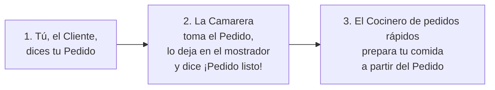

## Estudiemos la interacción con algo más de detalle...

...y, dado que esta Cafetería está en Objectville, ¡pensemos también en los objetos y en las llamadas a métodos que hay implicadas!

!!! note "El Order consiste en..."
    un comprobante de pedido y los elementos de menú del Cliente que están escritos en él.

> **Yo quiero una hamburguesa con queso y un malteada.**

- El Cliente sabe lo que quiere y crea un Order.
    - `takeOrder()` → `createOrder()`
- La Camarera toma el Order y, cuando le toca, llama a su método `orderUp()` para comenzar la preparación del Order.
    - `orderUp()`
- El Cocinero de pedidos rápidos sigue las instrucciones del Order y produce la comida. El Order dirige al Cocinero de pedidos rápidos con métodos como `makeBurger()`.
    - `makeBurger(), makeShake()` → `output`

## Los roles y responsabilidades del Objectville Diner

### Un comprobante de pedido encapsula una petición de preparar una comida.

```java
public void orderUp() {
    cook.makeBurger();
    cook.makeShake();
}
```

!!! note "Nota al margen"
    Piensa en el comprobante de pedido como en un objeto que actúa como una petición para preparar una comida. Como cualquier objeto, se puede pasar de un sitio a otro: de la Camarera al mostrador de pedidos, o a la siguiente Camarera que relevo su turno. Tiene una interfaz que consta de un solo método, `orderUp()`, que encapsula las acciones necesarias para preparar la comida. También tiene una referencia al objeto que necesita prepararla (en nuestro caso, el Cocinero de pedidos rápidos). Está encapsulado en el sentido de que la Camarera no tiene que saber qué hay en el Order ni siquiera quién prepara la comida; solo necesita pasar el comprobante por la ventanilla de pedidos y gritar «¡Pedido listo!».

!!! note "Nota al margen"
    Vale, en la vida real a una camarera probablemente le da igual lo que pone en el comprobante del pedido y quién lo cocina, pero esto es Objectville...¡colabora con nosotros!

### El trabajo de la Camarera es tomar comprobantes de pedido e invocar sobre ellos el método `orderUp()`.

!!! note "Nota al margen"
    La Camarera lo tiene fácil: toma un Order del Cliente y sigue ayudando a clientes hasta que regresa al mostrador de pedidos, y entonces invoca el método `orderUp()` para que se prepare la comida. Como ya hemos discutido, en Objectville a la Camarera no le preocupa en absoluto lo que hay en el Order ni quién va a prepararlo; simplemente sabe que los comprobantes de pedido tienen un método `orderUp()` que puede llamar para que el trabajo se haga.

!!! note "Nota al margen"
    No me pidas a mí que cocine, yo solo tomo pedidos y grito «¡Pedido listo!»

!!! note "Nota al margen"
    Ahora, a lo largo del día, el método `takeOrder()` de la Camarera va siendo parametrizado con distintos comprobantes de pedido de distintos clientes, pero eso no la intimida; sabe que todos los comprobantes de pedido soportan el método `orderUp()` y puede llamar a `orderUp()` en cualquier momento en que necesite que se prepare una comida.

!!! note "Nota al margen"
    Puedes decir sin ninguna duda que la Camarera y yo estamos desacoplados. Ni siquiera es mi tipo.

### El Cocinero de pedidos rápidos tiene el conocimiento necesario para preparar la comida.

!!! note "Nota al margen"
    El Cocinero de pedidos rápidos es el objeto que realmente sabe cómo preparar comidas. Una vez que la Camarera ha invocado el método `orderUp()`, el Cocinero de pedidos rápidos toma el relevo e implementa todos los métodos que son necesarios para crear comidas.

!!! note "Nota al margen"
    Fíjate en que la Camarera y el Cocinero están totalmente desacoplados: la Camarera tiene comprobantes de pedido que encapsulan los detalles de la comida; simplemente llama a un método de cada Order para que se prepare. Asimismo, el Cocinero recibe sus instrucciones del comprobante de pedido; nunca necesita comunicarse directamente con la Camarera.

!!! note "Nota al margen"
    Vale, tenemos una Cafetería con una Camarera que está desacoplada del Cocinero de pedidos rápidos mediante un comprobante de pedido. ¿Y qué?

!!! note "Nota al margen"
    Ten paciencia, vamos por buen camino...

Piensa en la Cafetería como en un modelo para un patrón de diseño OO que nos permite separar un objeto que hace una petición de los objetos que reciben y ejecutan esas peticiones. Por ejemplo, en nuestra API del mando a distancia necesitamos separar el código que se invoca cuando pulsamos un botón de los objetos de las clases específicas de cada proveedor que llevan a cabo esas peticiones. ¿Y si cada ranura del mando a distancia contuviera un objeto como el comprobante de pedido de la Cafetería? Entonces, cuando se pulsara un botón, podríamos limitar a llamar al equivalente del método `orderUp()` de ese objeto y encender las luces sin que el mando a distancia supiera los detalles de cómo conseguir que eso ocurra ni qué objetos están haciéndolo ocurrir.

Ahora, cambiemos un poco de marcha y traduzcamos toda esta conversación de la Cafetería al patrón Command...

!!! warning "Antes de seguir adelante"
    Dedica algo de tiempo a estudiar el diagrama de hace dos páginas junto con los roles y responsabilidades del Objectville Diner hasta que creas que le has guardado la vuelta a los objetos y a las relaciones del Objectville Diner. Cuando lo hayas hecho, prepárate para clavar el patrón Command.

## De la Cafetería al patrón Command

Vale, ya hemos pasado suficiente tiempo en el Objectville Diner como para conocer bien todas las personalidades y sus responsabilidades. Ahora vamos a reelaborar el diagrama de la Cafetería para que refleje el patrón Command. Verás que todos los participantes son los mismos; solo han cambiado los nombres.

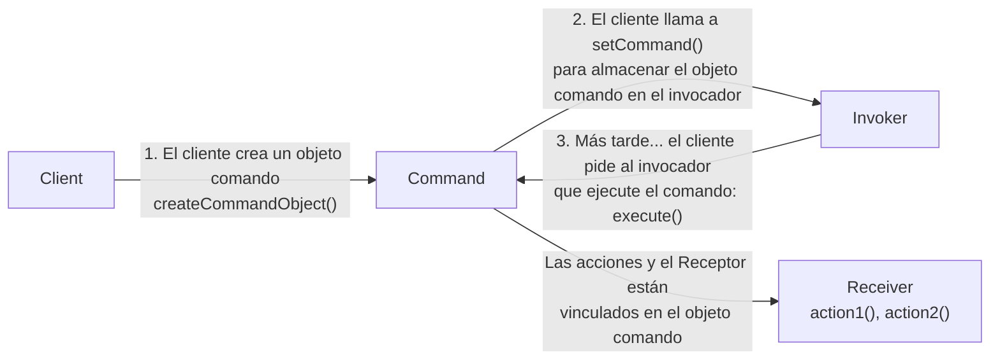

```java
public void execute() {
    receiver.action1();
    receiver.action2();
}
```

!!! note "Anotaciones del diagrama"
    - El objeto `Command` proporciona un único método, `execute()`, que encapsula las acciones y puede llamarse para invocar las acciones sobre el Receptor.
    - El `Client` es responsable de crear el objeto `Command`.
    - El `Client` llama a `setCommand()` sobre un objeto `Invoker` y le pasa el objeto `Command`, donde queda almacenado hasta que se necesite.
    - El objeto comando consiste en un conjunto de acciones sobre un `Receiver`.
    - El objeto `Command` encapsula las acciones y el `Receiver`; `execute()` invoca las acciones necesarias para atender la petición.
    - Nota: como veremos más adelante en el capítulo, una vez que el comando se carga en el invocador, se puede usar y descartar, o puede permanecer y usarse muchas veces.

!!! note "Cargando el Invoker"
    El invocador contiene un comando y en algún momento le pide al comando que/sbinjekOut una petición llamando a su método `execute()`.

## Del Diner al patrón Command

Empareja los objetos y métodos de la Cafetería con los nombres correspondientes del patrón Command.

| Command Pattern | Diner |
| --- | --- |
| Command | Waitress |
| `execute()` | `orderUp()` |
| Client | Order |
| Invoker | Customer |
| Receiver | Short-Order Cook |
| `setCommand()` | `takeOrder()` |

## Nuestro primer objeto comando

¿No va siendo hora de construir nuestro primer objeto comando? Vamos a escribir algo de código para el mando a distancia. Aunque todavía no hemos averiguado cómo diseñar la API del mando a distancia, construir algunas cosas de abajo arriba nos puede ayudar...

### Implementando la interfaz `Command`

Lo primero de todo: todos los objetos comando implementan la misma interfaz, que consta de un único método. En la Cafetería llamamos a este método `orderUp()`; sin embargo, normalmente simplemente usamos el nombre `execute()`.

Esta es la interfaz `Command`:

```java
public interface Command {
    public void execute();
}
```

!!! note "Nota al margen"
    Simple. Todo lo que necesitamos es un único método llamado `execute()`.

### Implementando un comando para encender una luz

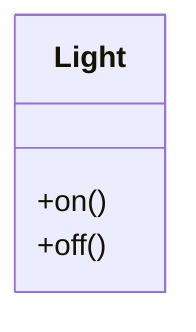

Ahora, digamos que quieres implementar un comando para encender una luz. Atendiendo a nuestro conjunto de clases de proveedores, la clase `Light` tiene dos métodos: `on()` y `off()`. Así puedes implementar esto como un comando:

```java
public class LightOnCommand implements Command {
    Light light;
    public LightOnCommand(Light light) {
        this.light = light;
    }
    public void execute() {
        light.on();
    }
}
```

!!! note "Nota al margen"
    Esto es un comando, así que tenemos que implementar la interfaz `Command`.

!!! note "Nota al margen"
    Al constructor se le pasa la luz concreta que este comando va a controlar (digamos, la luz de la sala de estar) y la guarda en la variable de instancia `light`. Cuando se llama a `execute()`, esta es la luz que va a ser el receptor de la petición.

!!! note "Nota al margen"
    El método `execute()` llama al método `on()` sobre el objeto receptor, que es la luz que estamos controlando.

Ahora que tienes una clase `LightOnCommand`, veamos si podemos darle uso...

## Usando el objeto comando

Vale, hagamos las cosas sencillas: digamos que tenemos un mando a distancia con un solo botón y su correspondiente ranura para guardar un dispositivo que controlar:

```java
public class SimpleRemoteControl {
    Command slot;
    public SimpleRemoteControl() {}
    public void setCommand(Command command) {
        slot = command;
    }
    public void buttonWasPressed() {
        slot.execute();
    }
}
```

!!! note "Nota al margen"
    Tenemos una ranura para guardar nuestro comando, que controlará un dispositivo.

!!! note "Nota al margen"
    Tenemos un método para establecer el comando que la ranura va a controlar. Este se podría llamar varias veces si el cliente de este código quisiera cambiar el comportamiento del botón del mando a distancia.

!!! note "Nota al margen"
    Este método se llama cuando se pulsa el botón. Lo único que hacemos es tomar el comando actual vinculado a la ranura y llamar a su método `execute()`.

### Creando una prueba sencilla para usar el Mando a Distancia

Aquí tienes un poco de código para probar el mando a distancia sencillo. Vamos a mirarlo y señalar cómo encajan las piezas con el diagrama del patrón Command:

```java
public class RemoteControlTest {
    public static void main(String[] args) {
        SimpleRemoteControl remote = new SimpleRemoteControl();
        Light light = new Light();
        LightOnCommand lightOn = new LightOnCommand(light);
        remote.setCommand(lightOn);
        remote.buttonWasPressed();
    }
}
```

!!! note "Nota al margen"
    Este es nuestro `Client` en el lenguaje del patrón Command.

!!! note "Nota al margen"
    El mando a distancia es nuestro `Invoker`; se le pasará un objeto comando que podrá usarse para hacer peticiones.

!!! note "Nota al margen"
    Ahora creamos un objeto `Light`. Este será el `Receiver` de la petición.

!!! note "Nota al margen"
    Aquí creamos un comando y le pasamos el `Receiver`.

!!! note "Nota al margen"
    Aquí le pasamos el comando al `Invoker`.

!!! note "Nota al margen"
    Y entonces simulamos la pulsación del botón.

!!! note "Nota al margen"
    Aquí está la salida de la ejecución de este código de prueba.

```text
%java RemoteControlTest
Light is On
%
```

## Tu turno

Ha llegado el momento de que implementes la clase `GarageDoorOpenCommand`. Primero, escribe el código de la clase de abajo. Necesitarás el diagrama de clases de `GarageDoor`.

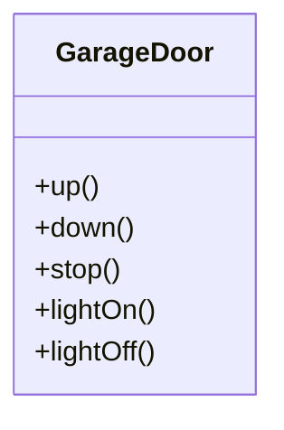

```java
public class GarageDoorOpenCommand 
    implements Command {
    // Tu código aquí
}
```

Ahora que tienes tu clase, ¿cuál es la salida del siguiente código? (Pista: el método `up()` de `GarageDoor` imprime «Garage Door is Open» cuando termina.)

```java
public class RemoteControlTest {
    public static void main(String[] args) {
        SimpleRemoteControl remote = new SimpleRemoteControl();
        Light light = new Light();
        GarageDoor garageDoor = new GarageDoor();
        LightOnCommand lightOn = new LightOnCommand(light);
        GarageDoorOpenCommand garageOpen = 
            new GarageDoorOpenCommand(garageDoor);
        remote.setCommand(lightOn);
        remote.buttonWasPressed();
        remote.setCommand(garageOpen);
        remote.buttonWasPressed();
    }
}
```

```text
%java RemoteControlTest
Tu salida aquí.
```

## El patrón Command definido

Has pasado tu tiempo en el Objectville Diner, has implementado en parte la API del mando a distancia y, en el proceso, te has hecho una idea bastante buena de cómo interactúan las clases y los objetos en el patrón Command. Ahora vamos a definir el patrón Command y clavar todos los detalles. Empecemos por su definición oficial:

!!! abstract "Definición"
    El patrón Command encapsula una petición como un objeto, permitiéndote así parametrizar otros objetos con distintas peticiones, poner en cola o registrar las peticiones, y soportar operaciones deshacibles.

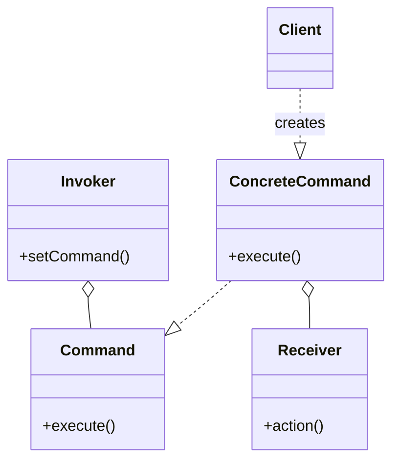

```java
public void execute() {
    receiver.action();
}
```

!!! note "Nota al margen"
    Una petición encapsulada.

Vamos a recorrer esto. Sabemos que un objeto comando encapsula una petición vinculando un conjunto de acciones sobre un receptor concreto. Para conseguirlo, empaqueta las acciones y el receptor en un objeto que expone un único método, `execute()`. Cuando se llama, `execute()` provoca que las acciones se invoquen sobre el receptor. Desde fuera, ningún otro objeto sabe realmente qué acciones se ejecutan ni sobre qué receptor; solo saben que si llaman al método `execute()`, su petición será atendida.

También hemos visto un par de ejemplos de parametrizar un objeto con un comando. En la Cafetería, la Camarera se parametrizaba con múltiples pedidos a lo largo del día. En el mando a distancia sencillo, primero cargamos la ranura del botón con un comando «luz encendida» y más tarde lo reemplazamos con un comando «puerta del garaje abierta». Como la Camarera, tu ranura del mando no se preocupaba de qué objeto comando tuviera, siempre que implementara la interfaz `Command`.

!!! note "Nota al margen"
    Un invocador (por ejemplo, una ranura del mando a distancia) puede parametrizarse con distintas peticiones.

Lo que todavía no hemos encontrado es el uso de comandos para implementar colas y registros y soportar operaciones de deshacer. No te preocupes, esas son extensiones bastante directas del patrón Command básico, y llegaremos a ellas pronto. También podemos soportar fácilmente lo que se conoce como el Meta Command Pattern una vez que tengamos lo básico en su sitio. El Meta Command Pattern te permite crear macros de comandos para que puedas ejecutar múltiples comandos a la vez.

## El patrón Command definido: el diagrama de clases

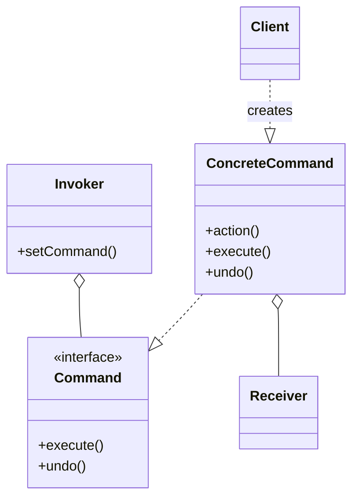

```java
public void execute() {
    receiver.action()
}
```

!!! note "Anotaciones del diagrama"
    - `Command` declara una interfaz para todos los comandos. Como ya sabes, un comando se invoca a través de su método `execute()`, que le pide a un receptor que realice una acción. También notarás que esta interfaz tiene un método `undo()`, que veremos un poco más adelante en el capítulo.
    - El `Invoker` contiene un comando y en algún momento le pide al comando que atienda una petición llamando a su método `execute()`.
    - El `Client` es responsable de crear un `ConcreteCommand` y establecer su `Receiver` llamando a su método `execute()`.
    - El `ConcreteCommand` define un vínculo entre una acción y un `Receiver`. El `Invoker` hace una petición llamando a `execute()` y el `ConcreteCommand` la lleva a cabo llamando a una o más acciones sobre el `Receiver`.
    - El `Receiver` sabe cómo realizar el trabajo necesario para atender la petición. Cualquier clase puede actuar como `Receiver`.
    - El método `execute()` invoca las acciones necesarias sobre el receptor para atender la petición.

!!! question "¿Cómo respalda el diseño del patrón Command el desacoplamiento entre el invocador de una petición y el receptor de esa petición?"

## ¿Por dónde empezamos?

!!! note "Nota al margen"
    Vale, creo que ya tengo una buena idea del patrón Command. Buen consejo, Joe; creo que vamos a parecer unas estrellas cuando terminemos la API del Mando a Distancia.

**Mary:** A mí también. Así que, ¿por dónde empezamos?

**Sue:** Como hicimos con el `SimpleRemote`, necesitamos proporcionar una forma de asignar comandos a las ranuras. En nuestro caso tenemos siete ranuras, cada una con un botón de encendido y otro de apagado. Así que podríamos asignar comandos al mando a distancia más o menos así:

```java
onCommands[0] = onCommand;
offCommands[0] = offCommand;
```

...y así para cada una de las siete ranuras de comando.

**Mary:** Eso tiene sentido, salvo por los objetos `Light`. ¿Cómo sabe el mando a distancia cuál es la luz de la sala de estar y cuál es la de la cocina?

**Sue:** ¡Ah, pues precisamente eso es lo que NO sabe! El mando a distancia no sabe nada más que cómo llamar a `execute()` sobre el objeto comando correspondiente cuando se pulsa un botón.

**Mary:** Sí, más o menos lo tengo, pero en la implementación, ¿cómo nos aseguramos de que los objetos correctos encienden y apagan los dispositivos correctos?

**Sue:** Cuando creamos los comandos que se van a cargar en el mando a distancia, creamos un `LightCommand` que está vinculado al objeto luz de la sala de estar y otro que está vinculado al objeto luz de la cocina. Recuerda: el receptor de la petición queda vinculado al comando en el que está encapsulado. Así que, para cuando se pulsa el botón, a nadie le importa qué luz es cuál; simplemente ocurre lo correcto cuando se llama al método `execute()`.

**Mary:** Creo que lo tengo. Implementemos el mando a distancia y creo que esto se va a aclarar.

**Sue:** Suena bien. Vamos a intentarlo...

## Asignando Commands a las ranuras

Así que tenemos un plan: vamos a asignar un comando a cada ranura del mando a distancia. Esto convierte al mando a distancia en nuestro invocador. Cuando se pulsa un botón, se llama al método `execute()` sobre el comando correspondiente, lo que provoca que se invoquen acciones sobre el receptor (como luces, ventiladores de techo y equipos de audio).

!!! note "Anotaciones del diagrama"
    - (1) Cada ranura recibe un comando.
    - (2) Cuando se pulsa el botón, se llama al método `execute()` sobre el comando correspondiente.
    - (3) En el método `execute()`, se invoquen acciones sobre el receptor.

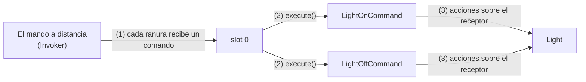

!!! note "Anotaciones del diagrama"
    - `CeilingFanOnCommand` y `CeilingFanOffCommand` sobre un `CeilingFan`.
    - `GarageDoorUpCommand` y `GarageDoorDownCommand` sobre un `GarageDoor`.
    - `HottubOnCommand` y `HottubOffCommand` sobre un `Hottub`.
    - `StereoOnWithCDCommand` y `StereoOffCommand` sobre un `Stereo`.

    Nos preocuparemos de las ranuras restantes en un momento.

    En nuestro código encontrarás que cada nombre de comando tiene «Command» añadido, pero al imprimir, por desgracia, nos hemos quedado sin espacio para algunos de ellos.

    El Invoker

## Implementando el Mando a Distancia

Esta vez, el mando a distancia se va a encargar de siete comandos de encendido y apagado, que guardaremos en los arrays correspondientes.

```java
public class RemoteControl {
    Command[] onCommands;
    Command[] offCommands;
    public RemoteControl() {
        onCommands = new Command[7];
        offCommands = new Command[7];
        Command noCommand = new NoCommand();
        for (int i = 0; i < 7; i++) {
            onCommands[i] = noCommand;
            offCommands[i] = noCommand;
        }
    }
    public void setCommand(int slot, Command onCommand, Command offCommand) {
        onCommands[slot] = onCommand;
        offCommands[slot] = offCommand;
    }
    public void onButtonWasPushed(int slot) {
        onCommands[slot].execute();
    }
    public void offButtonWasPushed(int slot) {
        offCommands[slot].execute();
    }
    public String toString() {
        StringBuffer stringBuff = new StringBuffer();
        stringBuff.append("\n------ Remote Control -------\n");
        for (int i = 0; i < onCommands.length; i++) {
            stringBuff.append("[slot " + i + "] " + onCommands[i].getClass().getName()
                + "    " + offCommands[i].getClass().getName() + "\n");
        }
        return stringBuff.toString();
    }
}
```

!!! note "Nota al margen"
    En el constructor, lo único que necesitamos hacer es instanciar e inicializar los arrays de encendido y apagado.

!!! note "Nota al margen"
    El método `setCommand()` toma una posición de ranura y un comando de encendido y otro de apagado para que sean guardados en esa ranura.

!!! note "Nota al margen"
    Coloca esos comandos en los arrays de encendido y apagado para su uso posterior.

!!! note "Nota al margen"
    Cuando se pulsa un botón de encendido o de apagado, el hardware se encarga de llamar a los métodos `onButtonWasPushed()` u `offButtonWasPushed()` correspondientes.

!!! note "Nota al margen"
    Sobrescribimos `toString()` para imprimir cada ranura y su comando correspondiente. Ya lo usaremos cuando probemos el mando a distancia.

!!! note "Nota al margen"
    Espera un segundo, ¿qué pasa con ese `NoCommand` que está cargado en los slots 4 a 6? ¿Estás intentando hacerte el listo?

Buen ojo. Nos hemos colado discretamente algo ahí. En el mando a distancia no queríamos comprobar si había un comando cargado cada vez que hacíamos referencia a un slot. Por ejemplo, en el método `onButtonWasPushed()` necesitaríamos un código como este:

```java
public void onButtonWasPushed(int slot) {
    if (onCommands[slot] != null) {
        onCommands[slot].execute();
    }
}
```

¿Y cómo nos libramos de eso? ¡Implementando un comando que no hace nada!

```java
public class NoCommand implements Command {
    public void execute() { }
}
```

Luego, en el constructor de `RemoteControl`, asignamos a cada slot un objeto `NoCommand` por defecto y así sabemos que siempre habrá algún comando al que llamar en cada slot.

```java
Command noCommand = new NoCommand();
for (int i = 0; i < 7; i++) {
    onCommands[i] = noCommand;
    offCommands[i] = noCommand;
}
```

Así que en la salida de nuestra ejecución de pruebas solo estás viendo los slots que tienen asignado un comando distinto del objeto `NoCommand` por defecto, que asignamos al crear el constructor de `RemoteControl`.

!!! note "Nota al margen: objeto nulo"
    El objeto `NoCommand` es un ejemplo de **objeto nulo**. Un objeto nulo resulta útil cuando no tienes un objeto con significado que devolver y, aun así, quieres quitarle al cliente la responsabilidad de gestionar `null`. Por ejemplo, en nuestro mando a distancia no teníamos un objeto con significado que asignar a cada slot de fábrica, así que proporcionamos un objeto `NoCommand` que actúa como sustituto y no hace nada cuando se llama a su método `execute()`.

    Encontrarás usos de los objetos nulos junto con muchos patrones de diseño, e incluso a veces verás «Objeto nulo» enumerado como patrón de diseño.

## Escribamos esa documentación...

!!! quote "Diseño de la API del Mando a Distancia para Home Automation or Bust, Inc."
    Nos complace presentarles el siguiente diseño y la interfaz de programación de aplicaciones de su Mando a Distancia de Automatización Doméstica. Nuestro objetivo principal de diseño fue mantener el código del mando a distancia lo más simple posible, de modo que no requiera cambios a medida que se produzcan nuevas clases de proveedores. Con ese fin hemos empleado el patrón Command para desacoplar lógicamente la clase `RemoteControl` de las Clases de Proveedor. Creemos que esto reducirá el coste de producir el mando, así como que reducirá drásticamente sus costes de mantenimiento continuos.

    El siguiente diagrama de clases ofrece una visión general de nuestro diseño:

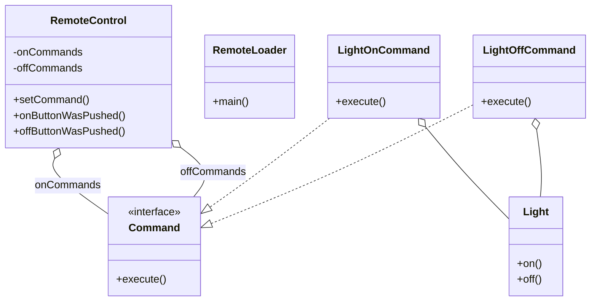

- La clase `RemoteControl` gestiona un conjunto de objetos `Command`, uno por botón. Cuando se pulsa un botón, se llama al método `ButtonWasPushed()` correspondiente, que invoca el método `execute()` del comando. Ese es todo el alcance del conocimiento que tiene el mando de las clases que está invocando, ya que el objeto `Command` desacopla el mando de las clases que hacen el trabajo real de automatización doméstica. Todos los comandos del mando a distancia implementan la interfaz `Command`, que consta de un único método: `execute()`. Los comandos encapsulan un conjunto de acciones sobre una clase de proveedor concreta. El mando invoca esas acciones llamando al método `execute()`.
- El `RemoteLoader` crea el número de objetos `Command` que se cargan en los slots del Mando a Distancia. Cada objeto comando encapsula una petición a un dispositivo de automatización doméstica.
- Las Clases de Proveedor se usan para realizar el trabajo real de automatización doméstica sobre los dispositivos. Aquí estamos usando la clase `Light` como ejemplo. Mediante la interfaz `Command`, implementamos cada acción que se puede invocar pulsando un botón del mando a distancia con un objeto `Command` sencillo. El objeto `Command` guarda una referencia a un objeto que es una instancia de una Clase de Proveedor e implementa un método `execute()` que llama a uno o más métodos de ese objeto. Aquí mostramos dos de esas clases, que encienden y apagan una luz, respectivamente.

```java
public void execute() {
    light.on()
}
```

```java
public void execute() {
    light.off()
}
```

## Representar comandos con lambdas

¿Quieres llevar tu programación con el patrón Command al siguiente nivel? Puedes usar las expresiones lambda de Java para saltarte el paso de crear todos esos objetos comando concretos. Con expresiones lambda, en lugar de instanciar los objetos comando concretos, puedes usar objetos función en su lugar. En otras palabras, podemos usar un objeto función como comando. Y ya que estamos aquí, también podemos borrar todas esas clases Command concretas.

Veamos cómo usarías expresiones lambda como comandos para simplificar nuestro código anterior:

### El código actualizado, usando expresiones lambda

```java
public class RemoteLoader {
    public static void main(String[] args) {
        RemoteControl remoteControl = new RemoteControl();
        Light livingRoomLight = new Light("Living Room");
        ...
        LightOnCommand livingRoomLightOn =
            new LightOnCommand(livingRoomLight);
        LightOffCommand livingRoomLightOff =
            new LightOffCommand(livingRoomLight);
        ...
        remoteControl.setCommand(0,() -> livingRoomLight.on(),
                                 () -> livingRoomLight.off());
        ...
    }
}
```

- Creamos el objeto `Light` como siempre...
- ...pero podemos eliminar el `LightOnCommand` y el `LightOffCommand` concretos, es decir, los objetos.
- En su lugar, escribiremos los comandos concretos como expresiones lambda que hacen el mismo trabajo que hacía el método `execute()` del comando concreto: es decir, encender la luz o apagarla.
- Más tarde, cuando hagas clic en uno de los botones del mando, el mando llama al método `execute()` del objeto comando del slot de ese botón, que está representado por esta expresión lambda.

Una vez que hemos reemplazado los comandos concretos por expresiones lambda, podemos borrar todas esas clases comando concretas (`LightOnCommand`, `LightOffCommand`, `HottubOnCommand`, `HottubOffCommand`, etc.). Si haces esto con todos los comandos concretos, reducirás el número total de clases de la aplicación del mando a distancia de 22 a 9.

!!! warning "Ojo"
    Fíjate en que solo puedes hacer esto si tu interfaz `Command` tiene un único método abstracto. En cuanto añadamos un segundo método abstracto, la forma abreviada con lambdas dejará de funcionar.

    Si te gusta esta técnica, consulta tu referencia favorita de Java para obtener más información sobre las expresiones lambda.

!!! note "Nota al margen"
    ¡Buen trabajo! Parece que has creado un diseño terrificífico, pero ¿no te estás olvidando de una cosita que pidió el cliente? ¡¡¡EL BOTÓN DE DESHACER!!!

¡Vaya! Casi se nos ha olvidado... Por suerte, una vez que tenemos nuestras clases `Command` básicas, añadir deshacer es fácil. Vamos a recorrer paso a paso cómo añadir deshacer a nuestros comandos y al mando a distancia...

## ¿Qué estamos haciendo?

Vale, necesitamos añadir funcionalidad para soportar el botón de deshacer del mando. Funciona así: digamos que la Luz del Salón está apagada y pulsas el botón de encendido del mando. Obviamente, la luz se enciende. Ahora, si pulsas el botón de deshacer, se revertirá la última acción; en este caso, la luz se apagará. Antes de meternos en ejemplos más complejos, vamos a poner a funcionar la luz con el botón de deshacer:

**1**

Cuando los comandos soportan deshacer, tienen un método `undo()` que refleja el método `execute()`. Lo que `execute()` hizo por última vez, `undo()` lo revierte. Así que, antes de poder añadir deshacer a nuestros comandos, necesitamos añadir un método `undo()` a la interfaz `Command`:

```java
public interface Command {
    public void execute();
    public void undo();
}
```

- Aquí está el nuevo método `undo()`.

Eso ha sido bastante sencillo.

Ahora, vamos a entrar en los comandos de `Light` e implementar el método `undo()`.

## Implementando la función deshacer

**2**

Empecemos con `LightOnCommand`: si se hubiera llamado al método `execute()` de `LightOnCommand`, entonces el último método que se llamó fue `on()`. Sabemos que `undo()` tiene que hacer lo contrario, llamando al método `off()`.

```java
public class LightOnCommand implements Command {
    Light light;
    public LightOnCommand(Light light) {
        this.light = light;
    }
    public void execute() {
        light.on();
    }
    public void undo() {
        light.off();
    }
}
```

- `execute()` enciende la luz, así que `undo()` simplemente la vuelve a apagar.

¡Tarta fácil! Ahora, `LightOffCommand`. Aquí el método `undo()` solo tiene que llamar al método `on()` de `Light`.

```java
public class LightOffCommand implements Command {
    Light light;
    public LightOffCommand(Light light) {
        this.light = light;
    }
    public void execute() {
        light.off();
    }
    public void undo() {
        light.on();
    }
}
```

- Y aquí, `undo()` vuelve a encender la luz.

¿Podría ser más fácil? Vale, todavía no hemos terminado; necesitamos meter un poco de soporte en el Mando a Distancia para llevar la cuenta del último botón pulsado y de la pulsación del botón de deshacer.

**3**

Para añadir soporte al botón de deshacer, solo tenemos que hacer unos pocos cambios pequeños en la clase `RemoteControl`. Así es como lo vamos a hacer: añadiremos una nueva variable de instancia para registrar el último comando invocado; luego, cada vez que se pulse el botón de deshacer, recuperamos ese comando e invocamos su método `undo()`.

```java
public class RemoteControlWithUndo {
    Command[] onCommands;
    Command[] offCommands;
    Command undoCommand;
    public RemoteControlWithUndo() {
        onCommands = new Command[7];
        offCommands = new Command[7];
        Command noCommand = new NoCommand();
        for(int i=0;i<7;i++) {
            onCommands[i] = noCommand;
            offCommands[i] = noCommand;
        }
        undoCommand = noCommand;
    }
    public void setCommand(int slot, Command onCommand, Command offCommand) {
        onCommands[slot] = onCommand;
        offCommands[slot] = offCommand;
    }
    public void onButtonWasPushed(int slot) {
        onCommands[slot].execute();
        undoCommand = onCommands[slot];
    }
    public void offButtonWasPushed(int slot) {
        offCommands[slot].execute();
        undoCommand = offCommands[slot];
    }
    public void undoButtonWasPushed() {
        undoCommand.undo();
    }
    public String toString() {
        // toString code here...
    }
}
```

- Aquí es donde guardamos el último comando ejecutado para el botón de deshacer.
- Igual que los demás slots, deshacer empieza con un `noCommand`, así que pulsar deshacer antes que cualquier otro botón no hará absolutamente nada.
- Cuando se pulsa un botón, tomamos el comando y primero lo ejecutamos; después guardamos una referencia a él en la variable de instancia `undoCommand`. Lo hacemos tanto para los comandos on como para los comandos off.
- Cuando se pulsa el botón de deshacer, invocamos el método `undo()` del comando almacenado en `undoCommand`. Esto deshace la operación del último comando ejecutado.
- Actualización para añadir los `undoCommands`.

## Probando el botón de deshacer

!!! warning "Es hora de poner a prueba ese botón de deshacer"
    Vale, vamos a retocar un poco el arnés de pruebas para probar el botón de deshacer:

```java
public class RemoteLoader {
    public static void main(String[] args) {
        RemoteControlWithUndo remoteControl = new RemoteControlWithUndo();
        Light livingRoomLight = new Light("Living Room");
        LightOnCommand livingRoomLightOn =
                new LightOnCommand(livingRoomLight);
        LightOffCommand livingRoomLightOff =
                new LightOffCommand(livingRoomLight);
        remoteControl.setCommand(0, livingRoomLightOn, livingRoomLightOff);
        remoteControl.onButtonWasPushed(0);
        remoteControl.offButtonWasPushed(0);
        System.out.println(remoteControl);
        remoteControl.undoButtonWasPushed();
        remoteControl.offButtonWasPushed(0);
        remoteControl.onButtonWasPushed(0);
        System.out.println(remoteControl);
        remoteControl.undoButtonWasPushed();
    }
}
```

- Crea una `Light` y nuestros nuevos comandos `LightOnCommand` y `LightOffCommand` con deshacer activado.
- Añade los comandos de la luz al mando en el slot 0.
- Enciende la luz, la apaga y luego deshace.
- Luego apaga la luz, la vuelve a encender y deshace.

Y aquí están los resultados de las pruebas...

```text
% java RemoteLoader
Light is on
Light is off
------ Remote Control -------
[slot 0] LightOnCommand        LightOffCommand
[slot 1] NoCommand             NoCommand
[slot 2] NoCommand             NoCommand
[slot 3] NoCommand             NoCommand
[slot 4] NoCommand             NoCommand
[slot 5] NoCommand             NoCommand
[slot 6] NoCommand             NoCommand
[undo] LightOffCommand
Light is on
Light is off
Light is on
------ Remote Control -------
[slot 0] LightOnCommand        LightOffCommand
[slot 1] NoCommand             NoCommand
[slot 2] NoCommand             NoCommand
[slot 3] NoCommand             NoCommand
[slot 4] NoCommand             NoCommand
[slot 5] NoCommand             NoCommand
[slot 6] NoCommand             NoCommand
[undo] LightOnCommand
Light is off
```

- Enciende la luz y luego la apaga.
- Aquí están los comandos de la luz.
- Ahora deshacer contiene el `LightOffCommand`, el último comando invocado.
- Se pulsó deshacer... el `undo()` del `LightOffCommand` vuelve a encender la luz.
- Luego apagamos la luz y la volvemos a encender.
- Ahora deshacer contiene el `LightOnCommand`, el último comando invocado.
- Se pulsó deshacer, así que la luz vuelve a estar apagada.

## Usando el estado para implementar Deshacer

Vale, implementar deshacer en `Light` fue instructivo, pero demasiado fácil. Normalmente necesitamos gestionar algo de estado para implementar deshacer. Probemos algo un poco más interesante, como el `CeilingFan` de las clases de proveedor. La clase `CeilingFan` permite fijar una serie de velocidades, además de un método de apagado.

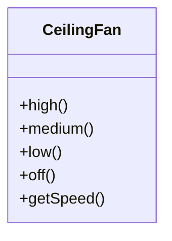

Aquí está el código fuente de la clase `CeilingFan`:

```java
public class CeilingFan {
    public static final int HIGH = 3;
    public static final int MEDIUM = 2;
    public static final int LOW = 1;
    public static final int OFF = 0;
    String location;
    int speed;
    public CeilingFan(String location) {
        this.location = location;
        speed = OFF;
    }
    public void high() {
        speed = HIGH;
        // code to set fan to high
    } 
    public void medium() {
        speed = MEDIUM;
        // code to set fan to medium 
    }
    public void low() {
        speed = LOW;
        // code to set fan to low
    }
    public void off() {
        speed = OFF;
        // code to turn fan off
    }
    public int getSpeed() {
        return speed;
    }
}
```

- Fíjate en que la clase `CeilingFan` guarda el estado local que representa la velocidad del ventilador de techo.
- Estos métodos fijan la velocidad del ventilador de techo.
- Podemos obtener la velocidad actual del ventilador de techo usando `getSpeed()`.

!!! note "Nota al margen"
    Mmm, así que para implementar deshacer correctamente tendría que tener en cuenta la velocidad previa del ventilador de techo...

## Añadir deshacer al ventilador de techo

Ahora vamos a abordar cómo añadir deshacer a los distintos comandos del Ventilador de Techo. Para hacerlo, necesitamos registrar el último ajuste de velocidad del ventilador y, si se llama al método `undo()`, restaurar el ventilador a su ajuste anterior. Aquí está el código del `CeilingFanHighCommand`:

```java
public class CeilingFanHighCommand implements Command {
    CeilingFan ceilingFan;
    int prevSpeed;
    public CeilingFanHighCommand(CeilingFan ceilingFan) {
        this.ceilingFan = ceilingFan;
    }
    public void execute() {
        prevSpeed = ceilingFan.getSpeed();
        ceilingFan.high();
    }
    public void undo() {
        if (prevSpeed == CeilingFan.HIGH) {
            ceilingFan.high();
        } else if (prevSpeed == CeilingFan.MEDIUM) {
            ceilingFan.medium();
        } else if (prevSpeed == CeilingFan.LOW) {
            ceilingFan.low();
        } else if (prevSpeed == CeilingFan.OFF) {
            ceilingFan.off();
        }
    }
}
```

- Hemos añadido estado local para llevar la cuenta de la velocidad anterior del ventilador.
- En `execute()`, antes de cambiar la velocidad del ventilador, necesitamos registrar primero su estado anterior, por si acaso necesitamos deshacer nuestras acciones.
- Para deshacer, fijamos la velocidad del ventilador de nuevo a su velocidad anterior.

Tenemos tres comandos de ventilador de techo más que escribir: low, medium y off. ¿Ves cómo se implementan?

## Prepárate para probar el ventilador de techo

Es hora de cargar nuestro mando a distancia con los comandos del ventilador de techo. Vamos a cargar el botón *on* del slot 0 con el ajuste *medium* del ventilador y el slot 1 con el ajuste *high*. Ambos botones *off* correspondientes contendrán el comando de apagar el ventilador de techo.

Aquí está nuestro script de pruebas:

```java
public class RemoteLoader {
    public static void main(String[] args) {
        RemoteControlWithUndo remoteControl = new RemoteControlWithUndo();
        CeilingFan ceilingFan = new CeilingFan("Living Room");
        CeilingFanMediumCommand ceilingFanMedium = 
                new CeilingFanMediumCommand(ceilingFan);
        CeilingFanHighCommand ceilingFanHigh = 
                new CeilingFanHighCommand(ceilingFan);
        CeilingFanOffCommand ceilingFanOff = 
                new CeilingFanOffCommand(ceilingFan);
        remoteControl.setCommand(0, ceilingFanMedium, ceilingFanOff);
        remoteControl.setCommand(1, ceilingFanHigh, ceilingFanOff);
        remoteControl.onButtonWasPushed(0);
        remoteControl.offButtonWasPushed(0);
        System.out.println(remoteControl);
        remoteControl.undoButtonWasPushed();
        remoteControl.onButtonWasPushed(1);
        System.out.println(remoteControl);
        remoteControl.undoButtonWasPushed();
    }
}
```

- Aquí instanciamos tres comandos: medium, high y off.
- Aquí ponemos medium en el slot 0 y high en el slot 1. También cargamos el comando off.
- Primero, ponemos el ventilador en medium.
- Luego lo apagamos.
- ¡Deshacer! Debería volver a medium...
- Esta vez lo ponemos en high.
- Y, un deshacer más; debería volver a medium.

## Probando el ventilador de techo...

Vale, ¡activemos el mando, carguémoslo con comandos y pulsemos algunos botones!

```text
% java RemoteLoader
Living Room ceiling fan is on medium
Living Room ceiling fan is off
------ Remote Control -------
[slot 0] CeilingFanMediumCommand    CeilingFanOffCommand
[slot 1] CeilingFanHighCommand      CeilingFanOffCommand
[slot 2] NoCommand                  NoCommand
[slot 3] NoCommand                  NoCommand
[slot 4] NoCommand                  NoCommand
[slot 5] NoCommand                  NoCommand
[slot 6] NoCommand                  NoCommand
[undo] CeilingFanOffCommand
Living Room ceiling fan is on medium
Living Room ceiling fan is on high
------ Remote Control -------
[slot 0] CeilingFanMediumCommand    CeilingFanOffCommand
[slot 1] CeilingFanHighCommand      CeilingFanOffCommand
[slot 2] NoCommand                  NoCommand
[slot 3] NoCommand                  NoCommand
[slot 4] NoCommand                  NoCommand
[slot 5] NoCommand                  NoCommand
[slot 6] NoCommand                  NoCommand
[undo] CeilingFanHighCommand
Living Room ceiling fan is on medium
%
```

- Ponemos el ventilador de techo en medium y luego lo apagamos.
- Aquí están los comandos en el mando a distancia...
- ...y deshacer tiene el último comando ejecutado, el `CeilingFanOffCommand`, con la velocidad anterior *medium*.
- Deshacemos el último comando y vuelve a medium.
- Ahora lo ponemos en high.
- Ahora, high es el último comando ejecutado.
- Un deshacer más y el ventilador de techo vuelve a velocidad medium.

## ¡Todos los mandos necesitan un modo fiesta!

¿De qué sirve tener un mando si no puedes pulsar un solo botón y tener las luces atenuadas, el estéreo y el televisor encendidos, y el spa en marcha?

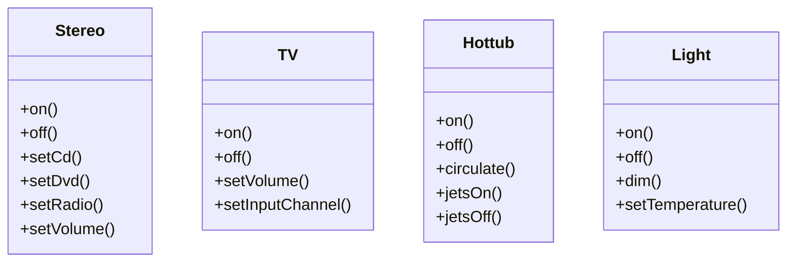

!!! note "Nota al margen"
    Mmm, nuestro mando a distancia necesitaría un botón para cada dispositivo, así que no creo que podamos hacer esto.

!!! note "Nota al margen"
    Un momento, Sue, no estés tan segura. ¡Creo que podemos hacerlo sin cambiar el mando en absoluto!

- La idea de Mary es crear un nuevo tipo de Command que pueda ejecutar otros Commands... ¡y más de uno! ¿Buena idea, verdad?

```java
public class MacroCommand implements Command {
    Command[] commands;
    public MacroCommand(Command[] commands) {
        this.commands = commands;
    }
    public void execute() {
        for (int i = 0; i < commands.length; i++) {
            commands[i].execute();
        }
    }
}
```

- Toma un array de Commands y guárdalos en el `MacroCommand`.
- Cuando el mando ejecuta la macro, va ejecutando esos comandos de uno en uno.

## Usando un comando macro

Repasemos paso a paso cómo usamos un comando macro:

**1**

Primero creamos el conjunto de comandos que queremos meter en la macro:

```java
Light light = new Light("Living Room");
TV tv = new TV("Living Room");
Stereo stereo = new Stereo("Living Room");
Hottub hottub = new Hottub();
```

- Crea todos los dispositivos: una luz, un televisor, un estéreo y un spa.

```java
LightOnCommand lightOn = new LightOnCommand(light);
StereoOnCommand stereoOn = new StereoOnCommand(stereo);
TVOnCommand tvOn = new TVOnCommand(tv);
HottubOnCommand hottubOn = new HottubOnCommand(hottub);
```

- Ahora crea todos los comandos On para controlarlos.

También necesitaremos comandos para los botones *off*. Escribe aquí el código para crearlos:

**2**

A continuación creamos dos arrays, uno para los comandos On y otro para los comandos Off, y los cargamos con los comandos correspondientes:

```java
Command[] partyOn = { lightOn, stereoOn, tvOn, hottubOn};
Command[] partyOff = { lightOff, stereoOff, tvOff, hottubOff};
```

- Crea un array para los comandos On y un array para los comandos Off...

```java
MacroCommand partyOnMacro = new MacroCommand(partyOn);
MacroCommand partyOffMacro = new MacroCommand(partyOff);
```

- ...y crea dos macros correspondientes para contenerlos.

**3**

Luego asignamos el `MacroCommand` a un botón como siempre:

```java
remoteControl.setCommand(0, partyOnMacro, partyOffMacro);
```

- Asigna el comando macro a un botón como harías con cualquier comando.

**4**

Por fin, solo necesitamos pulsar algunos botones y ver si esto funciona.

```java
System.out.println(remoteControl);
System.out.println("--- Pushing Macro On---");
remoteControl.onButtonWasPushed(0);
System.out.println("--- Pushing Macro Off---");
remoteControl.offButtonWasPushed(0);
```

Aquí tienes la salida.

```text
% java RemoteLoader
------ Remote Control -------
[slot 0] MacroCommand    MacroCommand
[slot 1] NoCommand       NoCommand
[slot 2] NoCommand       NoCommand
[slot 3] NoCommand       NoCommand
[slot 4] NoCommand       NoCommand
[slot 5] NoCommand       NoCommand
[slot 6] NoCommand       NoCommand
[undo] NoCommand
--- Pushing Macro On---
Light is on
Living Room stereo is on
Living Room TV is on
Living Room TV channel is set for DVD
Hottub is heating to a steaming 104 degrees
Hottub is bubbling!
--- Pushing Macro Off---
Light is off
Living Room stereo is off
Living Room TV is off
Hottub is cooling to 98 degrees
```

- Aquí están los dos comandos macro.
- Todos los Commands de la macro se ejecutan cuando invocamos la macro *on*...
- ...y cuando invocamos la macro *off*. Parece que funciona.

!!! exercise "Ejercicio con comandos macro"
    Lo único que le falta a nuestro `MacroCommand` es su funcionalidad de deshacer. Cuando se pulsa el botón de deshacer después de un comando macro, todos los comandos que se invocaron en la macro deben deshacer sus acciones anteriores. Aquí está el código de `MacroCommand`; ve y implementa el método `undo()`:

    ```java
    public class MacroCommand implements Command {
        Command[] commands;
        public MacroCommand(Command[] commands) {
            this.commands = commands;
        }
        public void execute() {
            for (int i = 0; i < commands.length; i++) {
                commands[i].execute();
            }
        }
        public void undo() {
        }
    }
    ```

!!! question "Preguntas frecuentes"

    **P: ¿Siempre necesito un receptor? ¿No podría el propio objeto comando implementar los detalles del método `execute()`?**

    R: En general, buscamos objetos comando «tontos» que simplemente invoquen una acción sobre un receptor; sin embargo, hay muchos ejemplos de objetos comando «inteligentes» que implementan la mayor parte, o toda, la lógica necesaria para llevar a cabo una petición. Seguro que puedes hacer esto; solo ten en cuenta que ya no tendrás el mismo nivel de desacoplamiento entre el invocador y el receptor, ni serás capaz de parametrizar tus comandos con receptores.

    **P: ¿Cómo puedo implementar un historial de operaciones de deshacer?**

    R: Buena pregunta. Es bastante fácil, de hecho; en lugar de guardar solo una referencia al último comando ejecutado, guardas una pila de comandos anteriores. Luego, cada vez que se pulse deshacer, tu invocador extrae el primer elemento de la pila y llama a su método `undo()`.

    **P: ¿Podría haber implementado el modo fiesta como un Command creando una `PartyCommand` y poniendo en su método `execute()` las llamadas para ejecutar los otros Commands de `PartyCommand`?**

    R: Podrías; sin embargo, estarías esencialmente codificando a fuego el modo fiesta dentro de `PartyCommand`. ¿Para qué molestarse? Con `MacroCommand` puedes decidir dinámicamente qué Commands quieres incluir en `PartyCommand`, así que tienes más flexibilidad usando `MacroCommands`. En general, `MacroCommand` es una solución más elegante y requiere menos código nuevo.

## Más usos del patrón Command: poner solicitudes en cola

Los comandos nos dan una forma de empaquetar un trozo de cálculo (un receptor y un conjunto de acciones) y pasarlo como un objeto de primera clase. Ahora bien, el cálculo en sí se puede invocar mucho después de que una aplicación cliente cree el objeto comando. De hecho, incluso se puede invocar desde un hilo diferente. Podemos aplicar este escenario a muchas aplicaciones útiles, como planificadores, grupos de hilos y colas de trabajos, por nombrar algunos.

- Los objetos que implementan la interfaz de comandos se añaden a la cola.

Imagina una cola de trabajos: añades comandos a la cola por un extremo y, en el otro extremo, hay un grupo de hilos. Los hilos ejecutan el siguiente script: extraen un comando de la cola, llaman a su método `execute()`, esperan a que la llamada termine y luego descartan el objeto comando y recuperan uno nuevo.

- Los hilos extraen comandos de la cola de uno en uno y llaman a su método `execute()`. Una vez terminado, vuelven a por un nuevo objeto comando.
- Esto nos da una forma eficaz de limitar el cálculo a un número fijo de hilos.

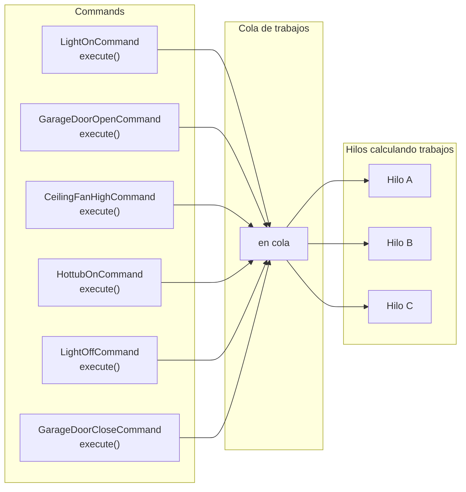

Fíjate en que las clases de la cola de trabajo están totalmente desacopladas de los objetos que hacen el cálculo. Un minuto un hilo puede estar calculando una operación financiera y al siguiente puede estar recuperando algo de la red. A los objetos de la cola de trabajo no les importa; solo recuperan comandos y llaman a `execute()`. Asimismo, mientras pongas en la cola objetos que implementen el patrón Command, se invocará su método `execute()` cuando haya un hilo disponible.

!!! tip "Para pensar"
    ¿Cómo podría un servidor web hacer uso de una cola así? ¿Qué otras aplicaciones se te ocurren?

## Más usos del patrón Command: registrar solicitudes

La semántica de algunas aplicaciones exige que registremos todas las acciones y que podamos recuperarnos de un fallo invocando de nuevo esas acciones. El patrón Command puede soportar esta semántica con la adición de dos métodos: `store()` y `load()`. En Java podríamos usar la serialización de objetos para implementar estos métodos, pero se aplican las advertencias habituales sobre el uso de la serialización para la persistencia.

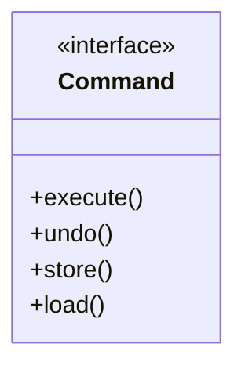

¿Cómo funciona esto? A medida que ejecutamos comandos, guardamos un historial de ellos en disco. Cuando ocurre un fallo, recargamos los objetos comando e invocamos sus métodos `execute()` en lote y en orden.

- Cada comando se almacena en disco a medida que se ejecuta.
- Tras un fallo del sistema, los objetos se recargan y se ejecutan en el orden correcto.

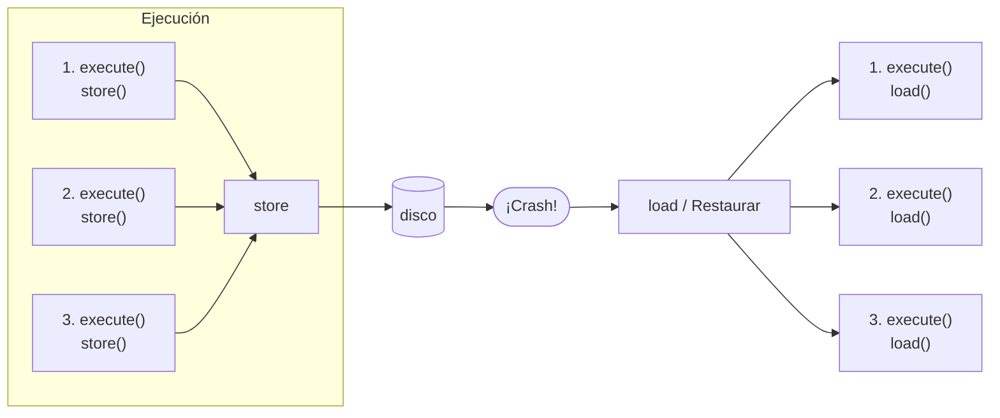

Ahora, este tipo de registro no tendría sentido para un mando a distancia; sin embargo, hay muchas aplicaciones que invocan acciones sobre estructuras de datos grandes que no se pueden guardar rápidamente cada vez que se produce un cambio. Usando el registro, podemos guardar todas las operaciones desde el último punto de control y, si hay un fallo del sistema, aplicar esas operaciones a nuestro punto de control. Toma, por ejemplo, una aplicación de hoja de cálculo: podríamos querer implementar la recuperación ante fallos registrando las acciones sobre la hoja de cálculo en lugar de escribir una copia de la hoja en disco cada vez que ocurre un cambio. En aplicaciones más avanzadas, estas técnicas pueden ampliarse para aplicarse a conjuntos de operaciones de forma transaccional, de modo que todas las operaciones se completen o ninguna lo haga.

## El patrón Command en el mundo real

¿Recuerdas la pequeña aplicación que cambia la vida del Capítulo 2? En ese capítulo vimos cómo la biblioteca Swing de Java está llena de Observers en forma de `ActionListener` que escuchan (u observan) eventos de los componentes de la interfaz de usuario. Pues resulta que `ActionListener` no es solo una interfaz Observer: también es una interfaz Command, y nuestras clases `AngelListener` y `DevilListener` no son solo Observers, sino también Commands concretas.

!!! note "Nota al margen"
    Aquí tienes nuestra preciosa interfaz.

!!! note "Nota al margen"
    Y aquí tienes la salida cuando hacemos clic en el botón.

```text
%java SwingObserverExample
Come on, do it!
Don't do it, you might regret it!
%
```

¡Correcto! ¡Tenemos dos patrones en un mismo ejemplo!

Aquí tienes el código (las partes importantes, al menos) de la pequeña aplicación que cambia la vida del Capítulo 2. A ver si puedes identificar quién es el Client, cuáles son los Commands, quién es el Invoker y quién es el Receiver.

```java
public class SwingObserverExample {
    // Set up ...
        JButton button = new JButton("Should I do it?");
        button.addActionListener(new AngelListener());
        button.addActionListener(new DevilListener());
        // Set frame properties here
    }
    class AngelListener implements ActionListener {
        public void actionPerformed(ActionEvent event) {
            System.out.println("Don't do it, you might regret it!");
        }
    }
    class DevilListener implements ActionListener {
        public void actionPerformed(ActionEvent event) {
            System.out.println("Come on, do it!");
        }
    }
}
```

!!! success "Solución del ejercicio"
    Aquí tienes el código (las partes importantes, al menos) de la pequeña aplicación que cambia la vida del Capítulo 2. ¿Puedes identificar quién es el Client, cuáles son los Commands, quién es el Invoker y quién es el Receiver? Aquí está nuestra solución.

    ```java
    public class SwingObserverExample {
    // Set up ...
            JButton button = new JButton("Should I do it?");
            button.addActionListener(new AngelListener());
            button.addActionListener(new DevilListener());
            // Set frame properties here
        }
        class AngelListener implements ActionListener {
            public void actionPerformed(ActionEvent event) {
                System.out.println("Don't do it, you might regret it!");
            }
        }
        class DevilListener implements ActionListener {
            public void actionPerformed(ActionEvent event) {
                System.out.println("Come on, do it!");
            }
        }
    }
    ```

    - El botón es nuestro Invoker. El botón llama a los métodos `actionPerformed()` (como `execute()`) de los commands (los `ActionListener`) cuando haces clic en el botón.
    - El Client es la clase que configura los componentes Swing y establece los commands (`AngelListener` y `DevilListener`) en el Invoker (el Button).
    - `ActionListener` es la interfaz Command: tiene un único método, `actionPerformed()`, que, como `execute()`, se ejecuta cuando se invoca el comando.
    - `AngelListener` y `DevilListener` son nuestros Commands concretos. Implementan la interfaz de comandos (en este caso, `ActionListener`).
    - El Receiver en este ejemplo es el objeto `System`. Recuerda, invocar un comando da lugar a acciones sobre el Receiver. En una aplicación Swing típica esto acabaría llamando a acciones sobre otros componentes de la interfaz de usuario.

## Herramientas para tu caja de diseño

¡Tu caja de herramientas empieza a estar bastante cargada! En este capítulo hemos añadido un patrón que nos permite encapsular una petición de quien sabe cómo realizarla en objetos Command: almacenarlos, pasarlos de un sitio a otro e invocarlos cuando los necesitemos.

### Conceptos básicos de OO

- Abstracción
- Encapsulación
- Polimorfismo
- Herencia

### Principios de diseño OO

- **Encapsula lo que varía.**
- **Favorece la composición sobre la herencia.**
- **Programa contra interfaces, no contra implementaciones.**
- **Aspira a diseños con acoplamiento débil** entre objetos que interactúan.
- **Las clases deberían estar abiertas a la extensión, pero cerradas a la modificación.**
- **Depende de abstracciones. No dependas de clases concretas.**

### El patrón Command

- Un objeto Command está en el centro de este desacoplamiento y encapsula un receptor junto con una acción (o un conjunto de acciones).
- Un invocador hace una petición de un objeto Command llamando a su método `execute()`, que invoca esas acciones sobre el receptor.
- Los invocadores se pueden parametrizar con Commands, incluso dinámicamente en tiempo de ejecución.
- Los Commands pueden soportar deshacer implementando un método `undo()` que restaura el objeto a su estado anterior a la última llamada al método `execute()`.
- Los MacroCommands son una extensión sencilla del patrón Command que permite múltiples comandos que se van a invocar. Del mismo modo, cuando un objeto cambia de estado, todos sus MacroCommands pueden soportar fácilmente `undo()`.
- En la práctica, no es raro que los objetos Command «inteligentes» implementen ellos mismos la petición en lugar de delegarla en un receptor.
- Los Commands también se pueden usar para implementar sistemas de registro y sistemas transaccionales.

### Patrones de OO

- **Strategy** — define una familia de algoritmos, encapsula cada uno y los hace intercambiables. Strategy permite que el algoritmo varíe independientemente de los clientes que lo usan.
- **Observer** — define una dependencia de uno a muchos entre objetos, de modo que cuando un objeto cambia de estado, todos sus dependientes son notificados y actualizados automáticamente.
- **Decorator** — adjunta responsabilidades adicionales a un objeto de forma dinámica. Los decoradores proporcionan una alternativa flexible a la subclase para extender la funcionalidad.
- **Abstract Factory** — proporciona una interfaz para crear familias de clases relacionadas o dependientes sin especificar sus clases concretas.
- **Factory Method** — define una interfaz para crear un objeto, pero deja que las subclases decidan qué clase instanciar. Factory Method permite que una clase difiera la instanciación a sus subclases.
- **Singleton** — asegura que una clase tiene solo una instancia y proporciona un punto global de acceso a ella.
- **Command** — encapsula una petición como un objeto, lo que te permite parametrizar a los clientes con diferentes peticiones, poner en cola o registrar peticiones, y soportar operaciones que se puedan deshacer.

## Crucigrama de patrones de diseño

!!! example "Crucigrama de patrones de diseño"
    Es hora de respirar un poco y dejar que todo esto cale. Es otro crucigrama; todas las palabras de la solución son de este capítulo.

| N.º | Dirección | Definición |
| --- | --- | --- |
| 5 | Horizontal | Nuestra ciudad favorita. |
| 6 | Horizontal | La empresa que nos trajo los negocios de boca en boca. |
| 7 | Horizontal | El papel del cliente en el patrón Command. |
| 9 | Horizontal | Objeto que conoce las acciones y el receptor. |
| 12 | Horizontal | El invocador y el receptor están _________. |
| 13 | Horizontal | Nuestro primer objeto comando controlaba esto. |
| 15 | Horizontal | La camarera era una. |
| 16 | Horizontal | Comida del restaurante de Dr. Seuss (cuatro palabras). |
| 17 | Horizontal | Algo más que Command puede hacer. |
| 1 | Vertical | El Cocinero y esta persona estaban definitivamente desacoplados. |
| 2 | Vertical | La Camarera no hizo esto. |
| 3 | Vertical | Un comando encapsula esto. |
| 4 | Vertical | Actúan como los receptores en el mando a distancia (dos palabras). |
| 8 | Vertical | Objeto que sabe cómo hacer las cosas. |
| 10 | Vertical | Lleva a cabo una petición. |
| 11 | Vertical | Todos los comandos tienen esto. |
| 14 | Vertical | Un comando __________ un conjunto de acciones y un receptor. |

!!! example "Solución"
    Relaciona los objetos y métodos del restaurante con los nombres correspondientes del patrón Command.

| Restaurante | Patrón Command |
| --- | --- |
| Waitress (camarera) | Command |
| Short-Order Cook (cocinero de pedidos rápidos) | execute() |
| Order (pedido) | Client |
| Customer (cliente) | Invoker |
| takeOrder() | Receiver |
| | setCommand() |

!!! success "Solución: la clase GarageDoorOpenCommand"

    Aquí tienes el código de la clase `GarageDoorOpenCommand`.

    ```java
    public class GarageDoorOpenCommand implements Command {
        GarageDoor garageDoor;
        public GarageDoorOpenCommand(GarageDoor garageDoor) {
            this.garageDoor = garageDoor;
        }
        public void execute() {
            garageDoor.up();
        }
    }
    ```

    Aquí tienes la salida:

    ```text
    %java RemoteControlTest
    Light is on
    Garage Door is Open
    %
    ```

!!! success "Solución del ejercicio con comandos macro"

    Aquí tienes el método `undo()` para el `MacroCommand`.

    ```java
    public class MacroCommand implements Command {
        Command[] commands;
        public MacroCommand(Command[] commands) {
            this.commands = commands;
        }
        public void execute() {
            for (int i = 0; i < commands.length; i++) {
                commands[i].execute();
            }
        }
        public void undo() {
            for (int i = commands.length - 1; i >= 0; i--) {
                commands[i].undo();
            }
        }
    }
    ```

    !!! question "Solución"
        Aquí tienes el código para crear los comandos del botón off.

        ```java
        LightOffCommand lightOff = new LightOffCommand(light);
        StereoOffCommand stereoOff = new StereoOffCommand(stereo);
        TVOffCommand tvOff = new TVOffCommand(tv);
        HottubOffCommand hottubOff = new HottubOffCommand(hottub);
        ```
