# Capítulo 7: Los patrones Adapter y Facade

> En este capítulo vamos a intentar proezas imposibles como encajar un clavo cuadrado en un agujero redondo. ¿Suena imposible? No cuando tenemos patrones de diseño. ¿Recuerdas el patrón Decorator? Envolvíamos objetos para darles nuevas responsabilidades. Ahora vamos a envolver algunos objetos con un propósito distinto: hacer que sus interfaces parezcan algo que no son. ¿Por qué haríamos eso? Para poder adaptar un diseño que espera una interfaz a una clase que implementa una interfaz diferente. Y no es todo eso; mientras estamos en ello, vamos a ver otro patrón que envuelve objetos para simplificar sus interfaces.

!!! note "Citas de apertura"
    - «¿Crees que los lectores se están llevando realmente la impresión de que estamos presenciando una carrera de caballos en lugar de estar sentados en un estudio fotográfico?»
    - «Esa es la belleza de nuestra profesión: podemos hacer que las cosas parezcan algo que no son.»
    - «Envuelto en este abrigo, parezco un…»
    - «¡Soy un hombre distinto! ¿Se supone que soy un partido de fútbol?»

## Adaptadores por todas partes

No tendrás ningún problema para entender lo que es un adaptador OO porque el mundo real está lleno de ellos. ¿Qué tal este ejemplo?

¿Alguna vez has tenido que usar en Gran Bretaña un portátil fabricado en Estados Unidos? Entonces probablemente hayas necesitado un adaptador de corriente alterna...

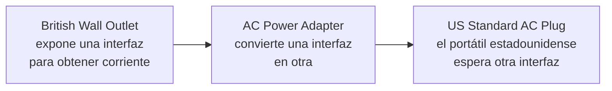

Ya sabes qué hace el adaptador: se coloca entre el enchufe de tu portátil y la toma de corriente alterna británica; su trabajo es adaptar la toma británica para que puedas enchufar tu portátil y recibir corriente. O míralo de otro modo: el adaptador cambia la interfaz de la toma por una que tu portátil espera.

!!! tip "Nota marginal"
    ¿Cuántos otros adaptadores del mundo real se te ocurren?

Algunos adaptadores de corriente alterna son simples: solo cambian la forma de la toma para que coincida con tu enchufe y dejan pasar la corriente alterna tal cual; pero otros adaptadores son más complejos por dentro y pueden necesitar subir o bajar la potencia para ajustarse a las necesidades de tus dispositivos.

Bien, ese es el mundo real; ¿qué hay de los adaptadores orientados a objetos? Pues nuestros adaptadores OO juegan el mismo papel que sus equivalentes reales: toman una interfaz y la adaptan a otra que el cliente espera.

## Adaptadores orientados a objetos

Supón que tienes un sistema de software existente al que necesitas integrar una nueva biblioteca de clases de un proveedor, pero el nuevo proveedor diseñó sus interfaces de forma distinta al anterior:

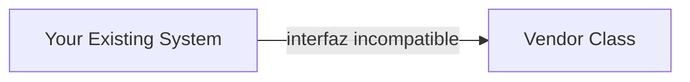

!!! warning "Nota marginal"
    Su interfaz no coincide con aquella contra la que escribiste tu código. ¡Esto no va a funcionar!

Vale, no quieres resolver el problema cambiando tu código existente (y no puedes cambiar el código del proveedor). ¿Qué haces pues? Bueno, puedes escribir una clase que adapte la interfaz del nuevo proveedor a la que tú esperas.

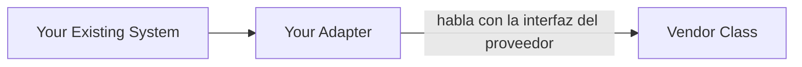

!!! note "Nota marginal"
    El adaptador implementa la interfaz que esperan tus clases... ...y habla con la interfaz del proveedor para atender tus peticiones.

El adaptador actúa como intermediario: recibe las peticiones del cliente y las convierte en peticiones que tengan sentido en las clases del proveedor.

!!! tip "Nota marginal"
    ¿Puedes pensar en una solución que NO te obligue a TI a escribir NINGÚN código adicional para integrar las clases del nuevo proveedor? ¿Qué tal si es el propio proveedor quien suministra la clase de adaptador?

!!! info "Sin cambios en el código"
    Tu sistema existente sigue igual.

!!! warning "Código nuevo"
    Aparece una clase `Adapter` nueva.

> *Si anda como un pato y suena como un pato, entonces debe ser... tal vez un pavo envuelto con un adaptador de pato...*

Es hora de ver un adaptador en acción. ¿Recuerdas nuestros patos del capítulo 1? Repasemos una versión ligeramente simplificada de las interfaces y clases `Duck`.

```java
public interface Duck {
    public void quack();
    public void fly();
}
```

!!! note "Nota marginal"
    Esta vez, nuestros patos implementan una interfaz `Duck` que permite que los patos graznar y volar.

Aquí tienes una subclase de `Duck`, el `MallardDuck`:

```java
public class MallardDuck implements Duck {
    public void quack() {
        System.out.println("Quack");
    }
    public void fly() {
        System.out.println("I'm flying");
    }
}
```

!!! note "Nota marginal"
    Implementaciones simples: `MallardDuck` simplemente imprime lo que está haciendo.

Ahora toca conocer a la última ave del corral:

!!! note "Nota marginal"
    Los pavos no graznan, hacen glu-glu. Los pavos pueden volar, aunque solo pueden volar distancias cortas.

```java
public interface Turkey {
    public void gobble();
    public void fly();
}
```

```java
public class WildTurkey implements Turkey {
    public void gobble() {
        System.out.println("Gobble gobble");
    }
    public void fly() {
        System.out.println("I'm flying a short distance");
    }
}
```

!!! note "Nota marginal"
    Aquí tienes una implementación concreta de `Turkey`; como `MallardDuck`, simplemente imprime sus acciones.

Ahora, supón que te faltan objetos `Duck` y te gustaría usar algunos objetos `Turkey` en su lugar. Obviamente no podemos usar los pavos directamente porque tienen una interfaz distinta. Así que vamos a escribir un Adapter:

## Prueba de manejo del adaptador

!!! exercise "Código de cerca"
    Primero, necesitas implementar la interfaz del tipo al que te estás adaptando. Esta es la interfaz que tu cliente espera ver.

    A continuación, necesitamos obtener una referencia al objeto que estamos adaptando; aquí lo hacemos mediante el constructor.

    Ahora tenemos que implementar todos los métodos de la interfaz; la traducción de `quack()` entre las clases es fácil: solo hay que llamar al método `gobble()`.

    Aunque ambas interfaces tienen un método `fly()`, los pavos vuelan a pequeños trocitos: no pueden hacer vuelos de larga distancia como los patos. Para mapear entre el `fly()` de un `Duck` y el de un `Turkey`, necesitamos llamar al método `fly()` del `Turkey` cinco veces para compensarlo.

```java
public class TurkeyAdapter implements Duck {
    Turkey turkey;
    public TurkeyAdapter(Turkey turkey) {
        this.turkey = turkey;
    }
    public void quack() {
        turkey.gobble();
    }
    public void fly() {
        for(int i=0; i < 5; i++) {
            turkey.fly();
        }
    }
}
```

Ahora solo necesitamos algo de código para poner a prueba nuestro adaptador:

```java
public class DuckTestDrive {
    public static void main(String[] args) {
        Duck duck = new MallardDuck();
        Turkey turkey = new WildTurkey();
        Duck turkeyAdapter = new TurkeyAdapter(turkey);
        System.out.println("The Turkey says...");
        turkey.gobble();
        turkey.fly();
        System.out.println("\nThe Duck says...");
        testDuck(duck);
        System.out.println("\nThe TurkeyAdapter says...");
        testDuck(turkeyAdapter);
    }
    static void testDuck(Duck duck) {
        duck.quack();
        duck.fly();
    }
}
```

!!! note "Notas marginales"
    - Creemos un `Duck`... ...y un `Turkey`. Y luego envolvemos el pavo en un `TurkeyAdapter`, que lo hace parecer un `Duck`. Después probamos el `Turkey`: que hace glu-glu, que vuela. Ahora probamos el pato llamando al método `testDuck()`, que espera un objeto `Duck`. Y ahora la gran prueba: ¡intentamos pasar el pavo como si fuera un pato... Este es nuestro método `testDuck()`; recibe un pato y llama a sus métodos `quack()` y `fly()`.

**Prueba de ejecución**

```text
File  Edit   Window  Help  Don'tForgetToDuck
%java DuckTestDrive
The Turkey says...
Gobble gobble
I'm flying a short distance
The Duck says...
Quack
I'm flying
The TurkeyAdapter says...
Gobble gobble
I'm flying a short distance
I'm flying a short distance
I'm flying a short distance
I'm flying a short distance
I'm flying a short distance
```

!!! note "Notas marginales"
    El pavo hace glu-glu y vuela una distancia corta. El pato grazna y vuela tal como esperarías. Y el adaptador hace glu-glu cuando se llama a `quack()` y vuela unas cuantas veces cuando se llama a `fly()`. El método `testDuck()` nunca sabe que tiene un pavo disfrazado de pato.

## El patrón Adapter explicado

Ahora que tenemos una idea de lo que es un Adapter, demos un paso atrás y volvamos a mirar todas las piezas:

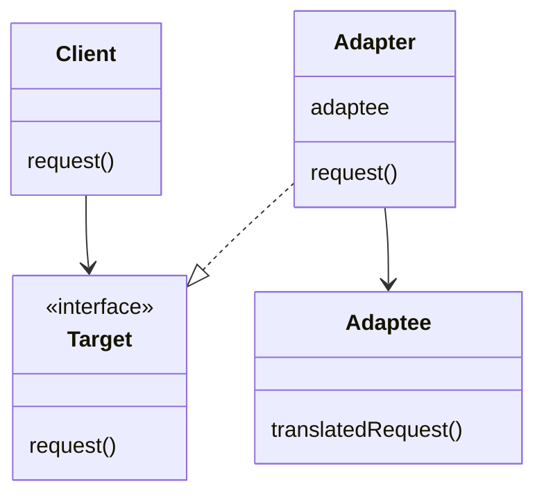

!!! note "Notas marginales"
    - El Client se implementa contra la interfaz destino.
    - El Adapter implementa la interfaz destino y contiene una instancia del Adaptee.
    - `Turkey` fue el adaptee. `TurkeyAdapter` implementó la interfaz destino, `Duck`.

### Así es como el cliente usa el adaptador

1. El cliente hace una petición al adaptador llamando a un método suyo mediante la interfaz destino.
2. El adaptador traduce la petición en una o más llamadas al adaptee usando la interfaz del adaptee.
3. El cliente recibe los resultados de la llamada y nunca sabe que hay un adaptador haciendo la traducción.

!!! note "Nota marginal"
    Fíjate en que el Client y el Adaptee están desacoplados: ninguno sabe nada del otro.

!!! exercise "Tu turno"
    Digamos que también necesitamos un Adapter que convierta un `Duck` en un `Turkey`. Llamémoslo `DuckAdapter`. Escribe esa clase: ¿cómo has resuelto el método `fly()` (después de todo, sabemos que los patos vuelan más lejos que los pavos)? Consulta las respuestas al final del capítulo para ver nuestra solución. ¿Se te ha ocurrido una forma mejor?

!!! question "Preguntas frecuentes"
    **P: ¿Cuánto trabajo de «adaptación» tiene que hacer un adaptador? Parece que, si necesito implementar una interfaz destino grande, podría tener MUCHÍSIMO trabajo encima.**

    R: El papel del patrón Adapter es convertir una interfaz en otra. Aunque la mayoría de los ejemplos del patrón Adapter muestran un adaptador que envuelve a un solo adaptee, ambos sabemos que el mundo suele ser algo más desordenado. Así que es muy posible que te encuentres con situaciones en las que un adaptador contiene dos o más adaptees necesarios para implementar la interfaz destino. Esto tiene relación con otro patrón llamado patrón Facade; la gente suele confundir los dos. Recuérdanos que volvamos a este punto cuando hablemos de las facades más adelante en este capítulo.

    **P: ¿Un adaptador envuelve siempre una sola clase y solo una?**

    R: Podrías hacerlo, por supuesto. El trabajo de implementar un adaptador es realmente proporcional al tamaño de la interfaz que necesitas soportar como interfaz destino.

    **P: ¿Qué pasa si tengo partes viejas y partes nuevas en mi sistema, y las partes viejas esperan la interfaz del proveedor antiguo, pero ya escribimos las partes nuevas para usar la interfaz del proveedor nuevo? Va a ser confuso usar un adaptador aquí y la interfaz sin envolver allí. ¿No sería mejor que simplemente escribiera mi código más antiguo y me olvidara del adaptador?**

    R: No necesariamente. Una cosa que puedes hacer es crear un Two Way Adapter (adaptador bidireccional) que soporte ambas interfaces. Para crear un Two Way Adapter, simplemente implementa las dos interfaces implicadas, de modo que el adaptador pueda actuar como la interfaz antigua o como la nueva.

## Patrón Adapter definido

Ya basta de patos, pavos y adaptadores de corriente alterna; vamos a lo serio y veamos la definición oficial del patrón Adapter:

!!! abstract "Definición"
    El patrón Adapter convierte la interfaz de una clase en otra interfaz que los clientes esperan. Adapter permite que clases que de otro modo no podrían trabajar juntas por tener interfaces incompatibles lo hagan.

Ahora bien, sabemos que este patrón nos permite usar un cliente con una interfaz incompatible creando un Adapter que hace la conversión. Esto actúa desacoplando al cliente de la interfaz implementada y, si prevemos que la interfaz cambiará con el tiempo, el adaptador encapsula ese cambio para que el cliente no tenga que modificarse cada vez que necesite operar contra una interfaz distinta.

Hemos visto el comportamiento en tiempo de ejecución del patrón; veamos también su diagrama de clases:

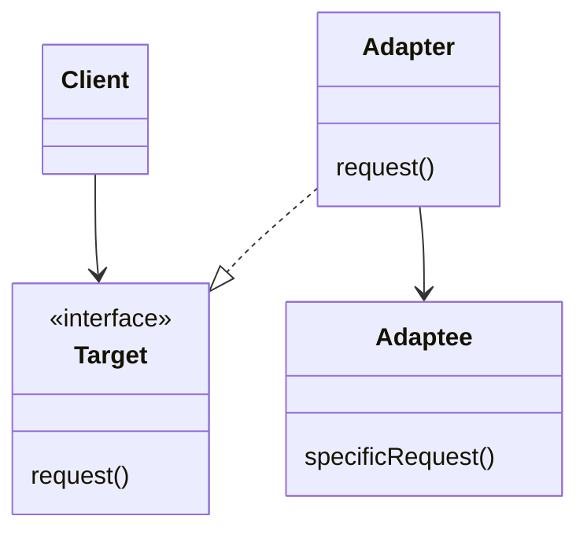

!!! note "Notas marginales"
    - El Adapter implementa la interfaz Target.
    - El cliente solo ve la interfaz Target.
    - Todas las peticiones se delegan al Adaptee. El Adapter está compuesto con el Adaptee.

El patrón Adapter rebosa de buenos principios de diseño orientado a objetos: echa un vistazo al uso de composición de objetos para envolver el adaptee con una interfaz alterada. Este enfoque tiene la ventaja adicional de que podemos usar un adaptador con cualquier subclase del adaptee. Echa también un vistazo a cómo el patrón acopla al cliente a una interfaz y no a una implementación: podríamos usar varios adaptadores, cada uno convirtiendo un conjunto de clases de back-end distinto. O podríamos añadir nuevas implementaciones a posteriori, siempre que se adhieran a la interfaz Target.

## Adaptadores de objeto y de clase

Ahora, a pesar de haber definido el patrón, todavía no te hemos contado toda la historia. En realidad hay dos tipos de adaptadores: los adaptadores de objeto y los adaptadores de clase. Este capítulo ha cubierto los adaptadores de objeto, y el diagrama de clases de la página anterior es el diagrama de un adaptador de objeto.

Entonces, ¿qué es un adaptador de clase y por qué no te hemos hablado de él? Porque necesitas herencia múltiple para implementarlo, y eso no es posible en Java. Pero eso no significa que no puedas encontrarte con la necesidad de usar adaptadores de clase más adelante, cuando trabajes con tu lenguaje favorito de herencia múltiple. Veamos el diagrama de clases de la herencia múltiple:

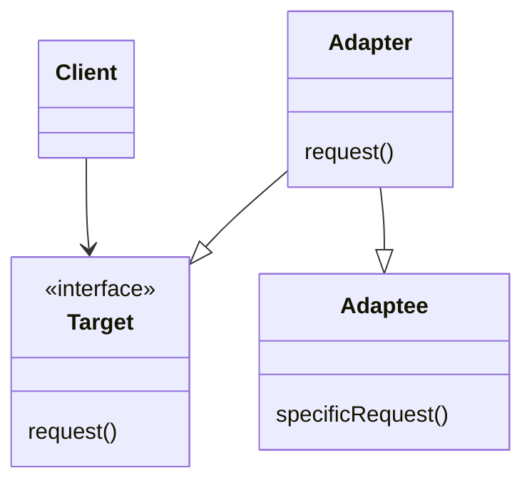

!!! note "Nota marginal"
    En lugar de usar composición para adaptar el Adaptee, el Adapter ahora hereda de las clases Adaptee y Target.

¿Te resulta familiar? Exacto: la única diferencia es que con un adaptador de clase heredamos de Target y de Adaptee, mientras que con un adaptador de objeto usamos composición para pasar las peticiones a un Adaptee.

!!! question "Piensa en esto"
    Los adaptadores de objeto y los de clase usan dos medios distintos para adaptar el adaptee (composición frente a herencia). ¿Cómo afectan estas diferencias de implementación a la flexibilidad del adaptador?

## Ejercicio: los imanes del pato

!!! exercise "Los imanes del pato"
    Tu trabajo consiste en coger los imanes del pato y del pavo y arrastrarlos sobre la parte del diagrama que describe el papel que desempeñó ese ave en nuestro ejemplo anterior. (Intenta no volver hacia atrás por las páginas.) Después añade tus propias anotaciones para describir cómo funciona.

Arrastra estos sobre el diagrama de clases para mostrar qué parte del diagrama representa la clase `Duck` y cuál representa la clase `Turkey`.

**Class Adapter**


**Object Adapter**


## Solución: los imanes del pato

!!! success "Solución"
    Nota: el adaptador de clase usa herencia múltiple, así que no puedes hacerlo en Java...

**Class Adapter**

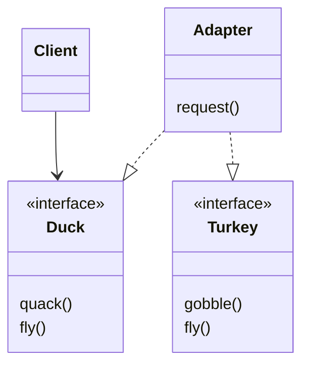

!!! note "Notas marginales"
    - El cliente cree que está hablando con un pato. El Target es la clase `Duck`. Esto es lo que el cliente invoca.
    - La clase `Turkey` no tiene los mismos métodos que `Duck`. El Adapter deja que el `Turkey` responda a peticiones sobre un `Duck` extendiendo AMBAS clases (`Duck` y `Turkey`).

**Object Adapter**


!!! note "Notas marginales"
    - La clase `Turkey` no tiene la misma interfaz que `Duck`. En otras palabras, los pavos no tienen métodos `quack()`, etc.
    - El cliente cree que está hablando con un pato. Igual que con el Class Adapter, el Target es la clase `Duck`. Esto es lo que el cliente invoca.
    - El Adapter implementa la interfaz `Duck`, pero cuando recibe una llamada a un método se da la vuelta y delega las llamadas en `Turkey`.

## Charla junto a la chimenea: el adaptador de objeto y el adaptador de clase

***Charla de esta noche:*** el adaptador de objeto y el adaptador de clase se enfrentan cara a cara.

**Adaptador de objeto:** Como uso composición, tengo ventaja. Puedo adaptar no solo una clase adaptee, sino cualquiera de sus subclases. En mi parte del mundo nos gusta usar composición en lugar de herencia; puede que ahorres unas pocas líneas de código, pero lo único que hago es escribir un poco de código para delegar en el adaptee. Nos gusta mantener las cosas flexibles. ¿Te preocupa un pequeño objeto? Quizá puedas sobrescribir un método rápidamente, pero cualquier comportamiento que añada a mi código de adaptador funciona con mi clase de adaptee y con todas sus subclases. ¡Venga, no me pidas milagros, solo necesito componer con la subclase para que eso funcione.

**Adaptador de clase:** Eso es cierto, tengo problemas con eso porque estoy comprometido con una clase de adaptee concreta, pero tengo una enorme ventaja: no tengo que reimplementar todo mi adaptee. También puedo sobrescribir el comportamiento de mi adaptee si lo necesito, porque solo estoy heredando.

**Adaptador de objeto:** ¿Flexible quizá, pero eficiente? No. Hay exactamente uno de mí, no un adaptador más un adaptee.

**Adaptador de clase:** Sí, pero ¿qué pasa si una subclase de Adaptee añade algún comportamiento nuevo? Entonces ¿qué?

**Adaptador de objeto:** Si quieres ver algo desordenado... mírate en un espejo.

## Adaptadores del mundo real

Veamos el uso de un Adapter sencillo en el mundo real (algo más serio que los patos, al menos):

### Enumerators

Si llevas un tiempo con Java, probablemente recuerdes que los primeros tipos de colección (`Vector`, `Stack`, `Hashtable` y unos cuantos más) implementan un método, `elements()`, que devuelve una `Enumeration`. La interfaz `Enumeration` te permite recorrer los elementos de una colección sin conocer los detalles concretos de cómo se gestionan en la colección.

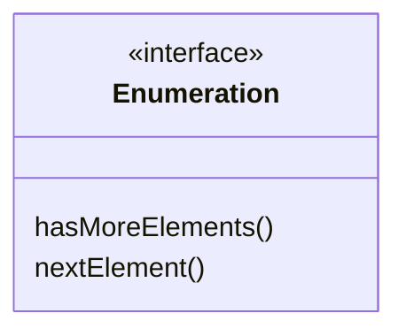

!!! note "Nota marginal"
    Te indica si quedan más elementos en la colección. Te da el siguiente elemento de la colección.

### Iterators

Las clases `Collection` más recientes usan una interfaz `Iterator` que, como la interfaz `Enumeration`, te permite iterar por un conjunto de elementos de una colección, y añade la posibilidad de eliminar elementos.

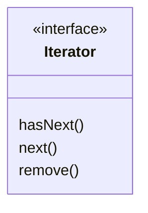

!!! note "Nota marginal"
    Análogo a `hasMoreElements()` en la interfaz `Enumeration`. Este método solo te dice si ya has visto todos los elementos de la colección. Te da el siguiente elemento de la colección. Elimina un elemento de la colección.

### Usar Enumerators con código que espera Iterators

A veces nos encontramos con código heredado que expone la interfaz `Enumeration` y sin embargo nos gustaría que nuestro código nuevo usara solo `Iterator`. Parece que necesitamos construir un adaptador.

## Adaptar una Enumeration a un Iterator

Primero veremos las dos interfaces para averiguar cómo se mapean los métodos de una a otra. En otras palabras, averiguaremos qué hay que llamar en el adaptee cuando el cliente invoca un método sobre el target.

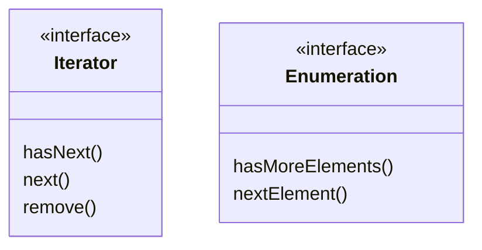

!!! note "Notas marginales"
    - Interfaz target. Estos dos métodos parecen fáciles. Se corresponden directamente con `hasNext()` y `next()` en `Iterator`.
    - Interfaz adaptee. Pero ¿qué pasa con este método `remove()` de `Iterator`? En `Enumeration` no hay nada parecido.

### Diseñando el adaptador

Así deberían quedar las clases: necesitamos un adaptador que implemente la interfaz Target y que esté compuesto con un adaptee. Los métodos `hasNext()` y `next()` van a ser sencillos de mapear de target a adaptee: simplemente los dejamos pasar. Pero ¿qué haces con `remove()`? Piénsalo un momento (y lo resolveremos en la página siguiente). Por ahora, aquí está el diagrama de clases:

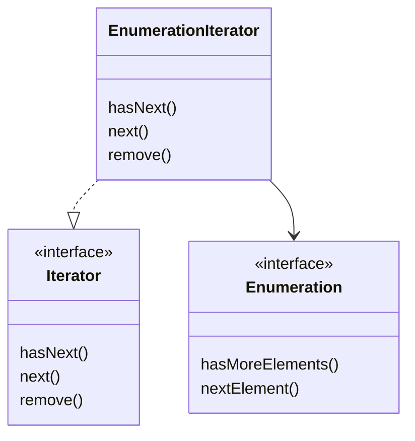

!!! note "Notas marginales"
    - Estamos haciendo que las `Enumeration` de tu código antiguo parezcan `Iterator` para tu código nuevo, aunque debajo haya realmente una `Enumeration`.
    - Una clase que implementa la interfaz `Enumeration` es el adaptee. `EnumerationIterator` es el adaptador.

### Lidiar con el método remove()

Bueno, sabemos que `Enumeration` no soporta `remove()`. Es una interfaz de «solo lectura». No hay forma de implementar un método `remove()` completamente funcional en el adaptador. Lo mejor que podemos hacer es lanzar una excepción en tiempo de ejecución. Por suerte, los diseñadores de la interfaz `Iterator` previeron esta necesidad y definieron el método `remove()` de modo que admite un `UnsupportedOperationException`.

Este es un caso en el que el adaptador no es perfecto; los clientes tendrán que estar atentos a posibles excepciones, pero siempre que el cliente sea cuidadoso y el adaptador esté bien documentado, esta es una solución perfectamente razonable.

### Escribiendo el adaptador EnumerationIterator

Aquí tienes código sencillo pero eficaz para todas esas clases heredadas que todavía producen `Enumeration`:

```java
public class EnumerationIterator implements Iterator<Object> {
    Enumeration<?> enumeration;
    public EnumerationIterator(Enumeration<?> enumeration) {
        this.enumeration = enumeration;
    }
    public boolean hasNext() {
        return enumeration.hasMoreElements();
    }
    public Object next() {
        return enumeration.nextElement();
    }
    public void remove() {
        throw new UnsupportedOperationException();
    }
}
```

!!! note "Notas marginales"
    - Como estamos adaptando una `Enumeration` a un `Iterator`, nuestro Adapter implementa la interfaz `Iterator`... tiene que parecer un `Iterator`. La `Enumeration` que estamos adaptando la guardamos en una variable de instancia porque usamos composición.
    - El método `hasNext()` del `Iterator` se delega en el método `hasMoreElements()` de la `Enumeration`... y el método `next()` del `Iterator` se delega en el método `nextElement()` de la `Enumeration`.
    - Desafortunadamente no podemos soportar el método `remove()` de `Iterator`, así que tenemos que rendirnos (en otras palabras, ¡nos rendimos!). Aquí simplemente lanzamos una excepción.

!!! exercise "Tu turno"
    Aunque Java se ha ido por la vía de la interfaz `Iterator`, sigue habiendo código de cliente heredado que depende de la interfaz `Enumeration`, así que un Adapter que convierta un `Iterator` en una `Enumeration` podría ser potencialmente útil. Escribe un Adapter que adapte un `Iterator` a una `Enumeration`. Puedes probar tu código adaptando un `ArrayList`. La clase `ArrayList` soporta la interfaz `Iterator` pero no soporta `Enumeration`.

!!! question "Piensa en esto"
    Algunos adaptadores de corriente alterna hacen más que solo cambiar la interfaz: añaden otras funciones como protección contra sobretensiones, luces indicadoras y otros adornos. Si tuvieras que implementar este tipo de funciones, ¿qué patrón usarías?

## Charla junto a la chimenea: el patrón Decorator y el patrón Adapter

***Charla de esta noche:*** el patrón Decorator y el patrón Adapter discuten sus diferencias.

**Decorator:** Soy importante. Mi trabajo tiene que ver con la responsabilidad: ya sabes que cuando interviene un Decorator, se van a añadir nuevas responsabilidades o comportamientos a tu diseño. Puede que sea cierto, pero no creas que no trabajamos duro. Cuando tenemos que decorar una interfaz grande, uf, eso puede ser mucho código. Qué gracioso. No creas que nos llevamos todo el mérito; a veces soy solo un decorador más que está siendo envuelto por quién sabe cuántos otros decoradores. Cuando una llamada a un método se me delega, no tienes ni idea de cuántos otros decoradores ya la han atendido y no sabes si algún día te reconocerán tus esfuerzos por atender la petición.

**Adapter:** Vosotros los decoradores queréis todo el mérito mientras que nosotros los adaptadores estamos en las trincheras haciendo el trabajo sucio: convirtiendo interfaces. Puede que nuestros trabajos no sean glamurosos, pero nuestros clientes seguro que nos agradecen que les simplifiquemos la vida. Intentad ser un adaptador cuando tengáis que juntar varias clases para proporcionar la interfaz que tu cliente espera. Eso sí que es difícil. Pero tenemos un dicho: «Un cliente desacoplado es un cliente feliz». Oye, si los adaptadores hacen su trabajo, nuestros clientes ni siquiera saben que estamos aquí. Puede ser un trabajo ingrato. Pero lo grande que tenemos los adaptadores es que permitimos que los clientes hagan uso de nuevas bibliotecas y subconjuntos sin cambiar una sola línea de código; simplemente confían en que hagamos la conversión por ellos. Oye, es un nicho, pero se nos da bien.

**Decorator:** Bueno, los decoradores también hacemos eso, solo que permitimos añadir comportamiento nuevo a las clases sin alterar el código existente. Sigo diciendo que los adaptadores son solo decoradores «bonitos»: al fin y al cabo, tú también, como nosotros, envuelves un objeto.

**Adapter:** No, no, no, de ninguna manera. Nosotros siempre convertimos la interfaz de lo que envolvemos; tú nunca lo haces. Yo diría que un decorador es como un adaptador; lo único es que ¡no cambias la interfaz!

**Decorator:** Eh, no. Nuestro trabajo en esta vida es extender los comportamientos o responsabilidades de los objetos que envolvemos; no somos un simple paso de nada.

**Adapter:** Oye, ¿a quién llamas simple paso de nada? Baja aquí y veremos cuánto aguantas convirtiendo unas cuantas interfaces.

**Decorator:** Quizá deberíamos aceptar que no estamos de acuerdo. En el papel nos parecemos algo, pero está clarísimo que estamos a años luz en cuanto a nuestra intención.

**Adapter:** Oh, sí, totalmente de acuerdo.

## Y ahora, para algo diferente...

***Hay otro patrón en este capítulo.***

Ya has visto cómo el patrón Adapter convierte la interfaz de una clase en otra que el cliente espera. También sabes que en Java conseguimos esto envolviendo el objeto que tiene una interfaz incompatible con un objeto que implementa la correcta.

Vamos a ver ahora un patrón que altera una interfaz, pero por un motivo diferente: simplificar la interfaz. Se denomina apropiadamente patrón Facade, porque este patrón oculta toda la complejidad de una o más clases detrás de una fachada limpia y bien iluminada.

!!! exercise "Empareja cada patrón con su intención"
    | Patrón | Intención |
    | --- | --- |
    | Decorator | No altera la interfaz, pero añade responsabilidad |
    | Adapter | Convierte una interfaz en otra |
    | Facade | Simplifica una interfaz |

## Hogar, dulce hogar: el cine

Antes de sumergirnos en los detalles del patrón Facade, veamos una obsesión nacional creciente: construir un buen cine para ver de un tirón todas esas películas y series de televisión. Haz tu investigación y hayas montado un sistema asesino con reproductor de streaming, sistema de proyección por vídeo, pantalla automatizada, sonido envolvente e incluso una máquina de palomitas.

Echa un vistazo a todos los componentes que has unido:

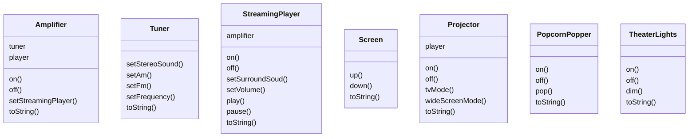

!!! note "Nota marginal"
    Esa es un montón de clases, un montón de interacciones y un gran conjunto de interfaces que aprender y usar.

Te has pasado semanas pasando cable, montando el proyector, haciendo todas las conexiones y ajustando todo con fino detalle. Ahora es hora de ponerlo todo en marcha y disfrutar de una película...

## Ver una película (la forma difícil)

***Elige una película, relájate y prepárate para la magia del cine.*** Ah, solo hay una cosa: para ver la película necesitas realizar unas cuantas tareas:

1. Encender la máquina de palomitas
2. Poner la máquina a hacer palomitas
3. Atenuar las luces
4. Bajar la pantalla
5. Encender el proyector
6. Poner la entrada del proyector en el reproductor de streaming
7. Poner el proyector en modo panorámico
8. Encender el amplificador de sonido
9. Poner el amplificador en la entrada del reproductor de streaming
10. Poner el amplificador en sonido envolvente
11. Poner el volumen del amplificador a nivel medio (5)
12. Encender el reproductor de streaming
13. Empezar a reproducir la película

!!! tip "Pensamiento lateral"
    Ya estoy agotado y todo lo que he hecho es encenderlo todo.

Veamos esas mismas tareas en términos de las clases y las llamadas a métodos necesarias para realizarlas:

| Tarea | Llamadas |
| --- | --- |
| Encender la máquina de palomitas y ponerla a hacer palomitas... | `popper.on();`<br/>`popper.pop();` |
| Atenuar las luces al 10 %... | `lights.dim(10);` |
| Bajar la pantalla... | `screen.down();` |
| Encender el proyector y ponerlo en modo panorámico para la película... | `projector.on();`<br/>`projector.setInput(player);`<br/>`projector.wideScreenMode();` |
| Encender el amplificador, ponerlo en el reproductor de streaming, dejarlo en modo envolvente y subir el volumen a 5... | `amp.on();`<br/>`amp.setStreamingPlayer(player);`<br/>`amp.setSurroundSound();`<br/>`amp.setVolume(5);` |
| Encender el reproductor de streaming... | `player.on();` |
| Y por FIN, ¡reproducir la película! | `player.play(movie);` |

!!! note "Nota marginal"
    ¡Seis clases distintas implicadas!

***Pero hay más...***

- Cuando termine la película, ¿cómo apagas todo? ¿No tendrías que volver a hacer todo esto, pero al revés?
- ¿No sería igual de complejo escuchar la radio?
- Si decides mejorar tu sistema, probablemente tendrás que aprender un procedimiento ligeramente distinto.

Bueno, ¿qué hacer? ¡La complejidad de usar tu cine en casa se está volviendo evidente! Veamos cómo puede sacarnos el patrón Facade de este lío para que podamos disfrutar de la película...

## Luces, cámara, ¡Facade!

Una Facade es justo lo que necesitas: con el patrón Facade puedes tomar un subsistema complejo y hacerlo más fácil de usar implementando una clase `Facade` que proporcione una interfaz única y más razonable. No te preocupes; si necesitas la potencia del subsistema complejo, ahí sigue para que lo uses, pero si lo único que necesitas es una interfaz clara, la Facade está ahí para ti.

Veamos cómo opera la `Facade`:

1. Crea una `Facade` para el sistema de cine en casa. Para hacerlo creamos una nueva clase, `HomeTheaterFacade`, que expone unos cuantos métodos sencillos como `watchMovie()`.
2. La clase `Facade` trata el subsistema de cine en casa como un único componente y llama a los métodos del subsistema para implementar su sencillo método `watchMovie()`.

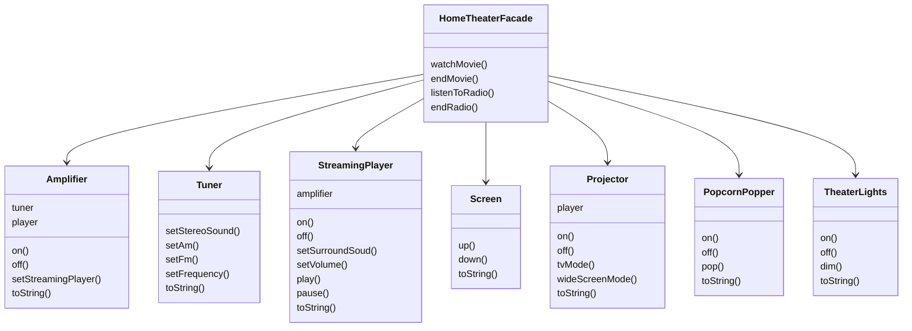

!!! note "Nota marginal"
    El subsistema que la `Facade` está simplificando.

3. Tu código de cliente ahora llama a métodos en la facade del cine en casa, no en el subsistema. Así que ahora, para ver una película, solo llamamos a un método, `watchMovie()`, y se encarga de comunicarse con las luces, el reproductor de streaming, el proyector, el amplificador, la pantalla y la máquina de palomitas por nosotros.

!!! note "Nota marginal"
    Un cliente del subsistema de facades. Exdirector del club de ciencia A/V del instituto Rushmore High.

4. La `Facade` sigue dejando el subsistema accesible para que pueda usarse directamente. Si necesitas la funcionalidad avanzada de las clases del subsistema, ahí están disponibles para tu uso.

!!! tip "Pensamiento lateral"
    ¡Necesito mi acceso de bajo nivel!

## Construyendo tu facade de cine en casa

Repasemos la construcción de la clase `HomeTheaterFacade`. El primer paso es usar composición para que la facade tenga acceso a todos los componentes del subsistema:

```java
public class HomeTheaterFacade {
    Amplifier amp;
    Tuner tuner;
    StreamingPlayer player;
    Projector projector;
    TheaterLights lights;
    Screen screen;
    PopcornPopper popper;
    public HomeTheaterFacade(Amplifier amp,
                 Tuner tuner,
                 StreamingPlayer player,
                 Projector projector,
                 Screen screen,
                 TheaterLights lights,
                 PopcornPopper popper) {
        this.amp = amp;
        this.tuner = tuner;
        this.player = player;
        this.projector = projector;
        this.screen = screen;
        this.lights = lights;
        this.popper = popper;
    }
    // other methods here
}
```

!!! note "Notas marginales"
    - Aquí está la composición; estos son todos los componentes del subsistema que vamos a usar.
    - A la facade se le pasa una referencia a cada componente del subsistema en su constructor. La facade asigna después cada uno a su variable de instancia correspondiente.
    - Estamos a punto de rellenar esto...

## Implementando la interfaz simplificada

Ahora es hora de reunir los componentes del subsistema en una interfaz unificada. Implementemos los métodos `watchMovie()` y `endMovie()`:

```java
public void watchMovie(String movie) {
    System.out.println("Get ready to watch a movie...");
    popper.on();
    popper.pop();
    lights.dim(10);
    screen.down();
    projector.on();
    projector.wideScreenMode();
    amp.on();
    amp.setStreamingPlayer(player);
    amp.setSurroundSound();
    amp.setVolume(5);
    player.on();
    player.play(movie);
}
public void endMovie() {
    System.out.println("Shutting movie theater down...");
    popper.off();
    lights.on();
    screen.up();
    projector.off();
    amp.off();
    player.stop();
    player.off();
}
```

!!! note "Notas marginales"
    - `watchMovie()` sigue la misma secuencia que teníamos que hacer a mano antes, pero la envuelve en un método práctico que hace todo el trabajo. Fíjate en que para cada tarea estamos delegando la responsabilidad en el componente correspondiente del subsistema.
    - Y `endMovie()` se encarga de apagar todo por nosotros. De nuevo, cada tarea se delega en el componente adecuado del subsistema.

!!! question "Piensa en esto"
    Piensa en las facades que has encontrado en la API de Java. ¿Dónde te gustaría tener algunas nuevas?

## Hora de ver una película (la forma fácil)

***¡Empieza la función!***

```java
public class HomeTheaterTestDrive {
    public static void main(String[] args) {
        // instantiate components here
        HomeTheaterFacade homeTheater =
                new HomeTheaterFacade(amp, tuner, player,
                        projector, screen, lights, popper);
        homeTheater.watchMovie("Raiders of the Lost Ark");
        homeTheater.endMovie();
    }
}
```

!!! note "Notas marginales"
    - Aquí estamos creando los componentes directamente en la prueba de manejo. Normalmente al cliente se le entrega una facade; no tiene que construir una él mismo.
    - Primero instanciamos la `Facade` con todos los componentes del subsistema.
    - Usa la interfaz simplificada para poner en marcha la película, y después apagarla.

Aquí tienes la salida:

```text
File  Edit   Window  Help  SnakesWhy'dItHaveToBeSnakes?
%java HomeTheaterTestDrive
Get ready to watch a movie...
Popcorn Popper on
Popcorn Popper popping popcorn!
Theater Ceiling Lights dimming to 10%
Theater Screen going down
Projector on
Projector in widescreen mode (16x9 aspect ratio)
Amplifier on
Amplifier setting Streaming player to Streaming Player
Amplifier surround sound on (5 speakers, 1 subwoofer)
Amplifier setting volume to 5
Streaming Player on
Streaming Player playing "Raiders of the Lost Ark"
Shutting movie theater down...
Popcorn Popper off
Theater Ceiling Lights on
Theater Screen going up
Projector off
Amplifier off
Streaming Player stopped "Raiders of the Lost Ark"
Streaming Player off
%
```

!!! note "Notas marginales"
    - Llamar al `watchMovie()` de la `Facade` hace todo este trabajo por nosotros... y aquí, como estamos viendo la película, llamar a `endMovie()` lo apaga todo.

## Patrón Facade definido

Para usar el patrón Facade, creamos una clase que simplifica y unifica un conjunto de clases más complejas que pertenecen a un subsistema. A diferencia de muchos patrones, Facade es bastante directo; no hay abstracciones que te den vueltas en la cabeza. Pero eso no lo hace menos potente: el patrón Facade nos permite evitar el acoplamiento fuerte entre clientes y subsistemas y, como veremos en breve, también nos ayuda a adherirnos a un nuevo principio orientado a objetos.

Antes de introducir ese nuevo principio, veamos la definición oficial del patrón:

!!! abstract "Definición"
    El patrón Facade proporciona una interfaz unificada a un conjunto de interfaces de un subsistema. Facade define una interfaz de más alto nivel que hace que el subsistema sea más fácil de usar.

Aquí no hay mucho que no sepas ya, pero una de las cosas más importantes que debes recordar sobre un patrón es su intención. Esta definición nos dice a gritos y por encima que el propósito de la facade es hacer que un subsistema sea más fácil de usar a través de una interfaz simplificada. Puedes ver esto en el diagrama de clases del patrón:

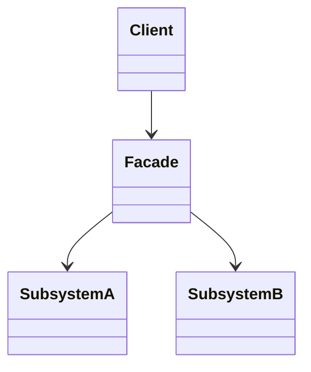

!!! note "Notas marginales"
    - Interfaz unificada y más fácil de usar.
    - Cliente contento cuyo trabajo se acaba de volver más fácil por culpa de la facade.
    - Subsistema más complejo. Clases del subsistema.

Eso es todo; ¡ya tienes otro patrón más en la mochila! Ahora es hora de ese nuevo principio OO. Cuidado, este puede rechazar algunas afirmaciones!

## El principio del menor conocimiento

El principio del menor conocimiento nos guía a reducir las interacciones entre objetos a unos pocos «amigos» cercanos. El principio suele enunciarse así:

!!! abstract "Principio de diseño"
    Principio del menor conocimiento: habla únicamente con tus amigos inmediatos.

Pero ¿qué significa esto en términos reales? Significa que, cuando estés diseñando un sistema, para cualquier objeto, tengas cuidado con el número de clases con las que interactúa y también con cómo llega a interactuar con esas clases.

Este principio nos evita crear diseños que tienen un gran número de clases acopladas entre sí, de modo que los cambios en una parte del sistema se desbordan hacia otras partes. Cuando construyes muchas dependencias entre muchas clases, estás construyendo un sistema frágil que será costoso de mantener y complejo de entender para los demás.

!!! question "Piensa en esto"
    ¿A cuántas clases está acoplado este código?

```java
public float getTemp() {
    return station.getThermometer().getTemperature();
}
```

## Cómo NO ganar amigos e influir en objetos

Vale, pero ¿cómo consigues que no hagas esto? El principio ofrece algunas directrices: toma cualquier objeto y, desde cualquier método de ese objeto, invoca únicamente métodos que pertenezcan a:

- El objeto mismo
- Objetos pasados como parámetro al método
- Cualquier objeto que el método cree o instancie
- Cualquier componente del objeto

!!! note "Nota marginal"
    Fíjate en que estas directrices nos dicen que no llamemos a métodos de objetos devueltos por llamadas a otros métodos.

Esto suena un poco estricto, ¿verdad? ¿Qué tiene de malo llamar al método de un objeto que nos ha devuelto otra llamada? Bueno, si hiciéramos eso, estaríamos haciendo una petición a la subparte de otro objeto (y aumentando el número de objetos que conocemos directamente). En esos casos, el principio nos obliga a pedirle al objeto que haga la petición por nosotros; así no tenemos que conocer sus objetos componentes (y mantenemos pequeño nuestro círculo de amigos). Por ejemplo:

```java
public float getTemp() {
    Thermometer thermometer = station.getThermometer();
    return thermometer.getTemperature();
}
```

!!! note "Nota marginal"
    Sin el principio. Aquí obtenemos el objeto `thermometer` de la estación y luego llamamos nosotros mismos al método `getTemperature()`.

```java
public float getTemp() {
    return station.getTemperature();
}
```

!!! note "Nota marginal"
    Con el principio. Cuando aplicamos el principio, añadimos a la clase `Station` un método que hace la petición al termómetro por nosotros. Esto reduce el número de clases de las que dependemos.

!!! tip "Nota marginal"
    Piensa en un «componente» como cualquier objeto referenciado por una variable de instancia. En otras palabras, piensa en esto como una relación HAS-A.

### Mantén tus llamadas a métodos dentro de los límites...

Aquí tienes una clase `Car` que demuestra todas las maneras que tienes de llamar a métodos y seguir cumpliendo el principio del menor conocimiento:

```java
public class Car {
    Engine engine;
    // other instance variables
    public Car() {
        // initialize engine, etc.
    }
    public void start(Key key) {
        Doors doors = new Doors();
        boolean authorized = key.turns();
        if (authorized) {
            engine.start();
            updateDashboardDisplay();
            doors.lock();
        }
    }
    public void updateDashboardDisplay() {
        // update display
    }
}
```

!!! note "Notas marginales"
    - Aquí tienes un componente de esta clase. Podemos llamar a sus métodos.
    - Aquí estamos creando un objeto nuevo; sus métodos son legales.
    - Puedes llamar a un método de un objeto al que se le pasa como parámetro.
    - Puedes llamar a un método de un componente del objeto.
    - Puedes llamar a un método local dentro del objeto.
    - Puedes llamar a un método de un objeto que creas o instancies.

!!! question "Preguntas frecuentes"
    **P: Existe otro principio llamado Ley de Demeter; ¿cómo se relacionan?**

    R: Los dos son uno y el mismo, y verás estos términos usados de forma intercambiable. Preferimos usar el principio del menor conocimiento por dos razones: (1) el nombre es más intuitivo y (2) el uso de la palabra «Ley» implica que siempre hay que aplicar este principio. De hecho, ningún principio es una ley; todos los principios deberían usarse cuando y donde sean útiles.

    **P: ¿Tiene algún inconveniente aplicar el principio del menor conocimiento?**

    R: Sí; mientras el principio reduce las dependencias entre objetos y los estudios han demostrado que esto reduce el mantenimiento del software, también ocurre que aplicar este principio supone escribir más clases «envoltorio» para manejar llamadas a otros componentes. Esto puede traducirse en una complejidad y un tiempo de desarrollo mayores, así como en un menor rendimiento en tiempo de ejecución.

!!! exercise "Tu turno"
    ¿Alguno de estas clases viola el principio del menor conocimiento? ¿Por qué o por qué no?

```java
public House {
    WeatherStation station;
    // other methods and constructor
    public float getTemp() {
        return station.getThermometer().getTemperature();
    }
}
```

```java
public House {
    WeatherStation station;
    // other methods and constructor
    public float getTemp() {
        Thermometer thermometer = station.getThermometer();
        return getTempHelper(thermometer);
    }
    public float getTempHelper(Thermometer thermometer) {
        return thermometer.getTemperature();
    }
}
```

!!! warning "Zona de casco duro"
    Ten cuidado con las suposiciones que se caen.

!!! question "Piensa en esto"
    ¿Se te ocurre un uso habitual de Java que viole el principio del menor conocimiento? ¿Debería preocuparte?

!!! success "Respuesta"
    ¿Qué tal `System.out.println()`?

## El patrón Facade y el principio del menor conocimiento

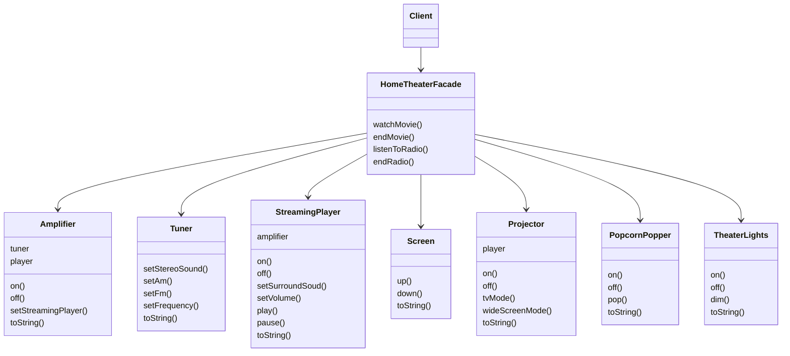

!!! note "Notas marginales"
    - Este cliente solo tiene un amigo: la `HomeTheaterFacade`. En programación OO, tener un solo amigo ¡es BUENA cosa!
    - La `HomeTheaterFacade` gestiona todos esos componentes del subsistema para el cliente. Mantiene al cliente simple y flexible.
    - Podemos mejorar los componentes del cine en casa sin afectar al cliente.
    - Intentamos que los subsistemas también respeten el principio del menor conocimiento. Si esto se vuelve demasiado complejo y hay demasiados amigos entrelazados, podemos introducir facades adicionales para formar capas de subsistemas.

## Herramientas para tu caja de herramientas de diseño

**Tu caja de herramientas se está volviendo pesada.** En este capítulo hemos añadido un par de patrones que nos permiten alterar interfaces y reducir el acoplamiento entre los clientes y los sistemas que utilizan.

- Cuando necesites usar una clase existente y su interfaz no sea la que quieres, usa un adaptador.
- Cuando necesites simplificar y unificar una interfaz grande o un conjunto complejo de interfaces, usa una facade.
- Un adaptador cambia una interfaz por otra que el cliente espera.
- Una facade desacopla a un cliente de un subsistema complejo.
- Implementar un adaptador puede requerir poco trabajo o muchísimo, dependiendo del tamaño y la complejidad de la interfaz destino.
- Implementar una facade requiere componer la facade con su subsistema y usar delegación para realizar el trabajo de la facade.
- Hay dos formas del patrón Adapter: adaptadores de objeto y de clase. Los adaptadores de clase requieren herencia múltiple.
- Puedes implementar más de una facade para un subsistema.
- Un adaptador envuelve un objeto para cambiar su interfaz, un decorador envuelve un objeto para añadir nuevos comportamientos y responsabilidades, y una facade «envuelve» un conjunto de objetos para simplificar.

!!! note "Bases de OO"
    Abstracción, encapsulación, polimorfismo y herencia.

!!! note "Principios de OO"
    - Encapsula lo que varía.
    - Prefiere la composición frente a la herencia.
    - Programa hacia interfaces, no hacia implementaciones.
    - Persigue diseños débilmente acoplados entre objetos que interactúan.
    - Las clases deben estar abiertas a la extensión pero cerradas a la modificación.
    - Depende de las abstracciones. No dependas de clases concretas.
    - Habla solo con tus amigos.

!!! note "Patrones de OO"
    - **Strategy** (Estrategia) - Define una familia de algoritmos, encapsula cada uno y los hace intercambiables. Strategy permite que el algoritmo varíe de forma independiente de los clientes que lo usan.
    - **Observer** - Define una dependencia de uno a muchos entre objetos de modo que, cuando un objeto cambia de estado, todos sus dependientes son notificados y actualizados.
    - **Decorator** - Añade responsabilidades adicionales a un objeto dinámicamente. Los decoradores ofrecen una alternativa flexible a la subclasificación para ampliar la funcionalidad.
    - **Abstract Factory** - Proporciona una interfaz para crear familias de objetos relacionados o dependientes sin especificar sus clases concretas.
    - **Factory Method** - Define una interfaz para crear un objeto, pero deja que las subclases decidan qué clase instanciar. Factory Method permite que una clase difiera la instanciación a sus subclases.
    - **Singleton** - Asegura que una clase tenga una sola instancia y proporciona un punto de acceso global a ella.
    - **Command** - Encapsula una petición como un objeto, lo que te permite parametrizar a los clientes con distintas peticiones, encolar o registrar peticiones y soportar operaciones deshacibles.

!!! note "Adapter (Adapter)"
    Convierte la interfaz de una clase en otra interfaz que los clientes esperan. Permite que clases que de otro modo no podrían colaborar por tener interfaces incompatibles lo hagan.

!!! note "Facade (Facade)"
    Proporciona una interfaz unificada a un conjunto de interfaces de un subsistema. Facade define una interfaz de más alto nivel que hace que el subsistema sea más fácil de usar.

!!! note "Nota marginal"
    Tenemos una nueva técnica para mantener un bajo nivel de acoplamiento en nuestros diseños (recuerda, habla solo con tus amigos)... ...y DOS patrones nuevos. Cada uno cambia una interfaz: el adaptador para convertir y la facade para unificar y simplificar.

## Crucigrama de patrones de diseño

***Sí, es otro crucigrama. Todas las palabras de la solución son de este capítulo.***

| N.º | Dirección | Definición | Respuesta |
| --- | --- | --- | --- |
| 1 | Horizontal | ¿Verdadero o falso? Los adaptadores solo pueden envolver un objeto. | |
| 5 | Horizontal | Un Adapter __________ una interfaz. | |
| 6 | Horizontal | La película que vimos (cinco palabras). | |
| 7 | Horizontal | Un __________ añade comportamiento nuevo. | |
| 11 | Horizontal | Adapter con dos papeles (dos palabras). | |
| 14 | Horizontal | La facade sigue ofreciendo ________ acceso de bajo nivel. | |
| 15 | Horizontal | Los patos lo hacen mejor que los pavos. | |
| 16 | Horizontal | Inconveniente del principio del menor conocimiento: demasiados __________. | |
| 17 | Horizontal | Un __________ simplifica una interfaz. | |
| 19 | Horizontal | El nuevo sueño americano (dos palabras). | |
| 2 | Vertical | El Decorator llamó al Adapter esto (tres palabras). | |
| 3 | Vertical | Una ventaja de Facade. | |
| 4 | Vertical | Principio que no era tan fácil como sonaba (dos palabras). | |
| 8 | Vertical | Haciéndose pasar por un pato. | |
| 9 | Vertical | Ejemplo que viola el principio del menor conocimiento: `System.out.__________`. | |
| 10 | Vertical | Si estás en Gran Bretaña, quizá necesites uno de estos (dos palabras). | |
| 12 | Vertical | Ninguna película está completa sin esto. | |
| 13 | Vertical | El cliente del Adapter usa la interfaz __________. | |
| 18 | Vertical | Se puede decir que un Adapter y un Decorator ________ un objeto. | |

## Soluciones de los ejercicios

!!! success "Solución: escribe la clase DuckAdapter"
    Ahora estamos adaptando pavos a patos, así que implementamos la interfaz `Turkey`. Guardamos una referencia al `Duck` que estamos adaptando. También creamos un objeto aleatorio; echa un vistazo al método `fly()` para ver cómo se usa. Un `gobble` se convierte simplemente en un `quack`. Como los patos vuelan mucho más lejos que los pavos, decidimos volar con el pato solo una de cada cinco veces en promedio.

```java
public class DuckAdapter implements Turkey {
    Duck duck;
    Random rand;
    public DuckAdapter(Duck duck) {
        this.duck = duck;
        rand = new Random();
    }
    public void gobble() {
        duck.quack();
    }
    public void fly() {
        if (rand.nextInt(5) == 0) {
            duck.fly();
        }
    }
}
```

!!! success "Solución: las clases House y el principio del menor conocimiento"
    ¡Viola el principio del menor conocimiento! Estás llamando al método de un objeto devuelto por otra llamada. ¡No viola el principio del menor conocimiento! Esto parece una forma de colarse por la puerta de atrás en el principio. ¿Ha cambiado realmente algo desde que acabamos de mover la llamada a otro método?

```java
public House {
    WeatherStation station;
    // other methods and constructor
    public float getTemp() {
        return station.getThermometer().getTemperature();
    }
}
```

```java
public House {
    WeatherStation station;
    // other methods and constructor
    public float getTemp() {
        Thermometer thermometer = station.getThermometer();
        return getTempHelper(thermometer);
    }
    public float getTempHelper(Thermometer thermometer) {
        return thermometer.getTemperature();
    }
}
```

!!! success "Solución: escribe un adapter que adapte un Iterator a una Enumeration"
    Fíjate en que mantenemos el parámetro de tipo genérico para que esto funcione con cualquier tipo de objeto.

```java
public class IteratorEnumeration implements Enumeration<Object> {
    Iterator<?> iterator;
    public IteratorEnumeration(Iterator<?> iterator) {
        this.iterator = iterator;
    }
    public boolean hasMoreElements() {
        return iterator.hasNext();
    }
    public Object nextElement() {
        return iterator.next();
    }
}
```

!!! success "Solución: empareja cada patrón con su intención"
    | Patrón | Intención |
    | --- | --- |
    | Decorator | No altera la interfaz, pero añade responsabilidad |
    | Adapter | Convierte una interfaz en otra |
    | Facade | Simplifica una interfaz |

## Crucigrama de patrones de diseño: solución

| N.º | Dirección | Definición | Respuesta |
| --- | --- | --- | --- |
| 1 | Horizontal | ¿Verdadero o falso? Los adaptadores solo pueden envolver un objeto. | `FALSE` |
| 5 | Horizontal | Un Adapter __________ una interfaz. | `CONVERTS` |
| 6 | Horizontal | La película que vimos (cinco palabras). | `RAIDERS OF THE LOST ARK` |
| 7 | Horizontal | Un __________ añade comportamiento nuevo. | `DECORATOR` |
| 11 | Horizontal | Adapter con dos papeles (dos palabras). | `TWO WAY` |
| 14 | Horizontal | La facade sigue ofreciendo ________ acceso de bajo nivel. | `ALLOWS` |
| 15 | Horizontal | Los patos lo hacen mejor que los pavos. | `FLIES` |
| 16 | Horizontal | Inconveniente del principio del menor conocimiento: demasiados __________. | `TRAPPERS` |
| 17 | Horizontal | Un __________ simplifica una interfaz. | `FACADE` |
| 19 | Horizontal | El nuevo sueño americano (dos palabras). | `HOME THEATER` |
| 2 | Vertical | El Decorator llamó al Adapter esto (tres palabras). | — |
| 3 | Vertical | Una ventaja de Facade. | `DECOUPLING` |
| 4 | Vertical | Principio que no era tan fácil como sonaba (dos palabras). | `LEAST KNOWLEDGE` |
| 8 | Vertical | Haciéndose pasar por un pato. | `TWO WAY ADAPTER` |
| 9 | Vertical | Ejemplo que viola el principio del menor conocimiento: `System.out.__________`. | `PRINTLN` |
| 10 | Vertical | Si estás en Gran Bretaña, quizá necesites uno de estos (dos palabras). | `POWER ADAPTER` |
| 12 | Vertical | Ninguna película está completa sin esto. | `POPCORN` |
| 13 | Vertical | El cliente del Adapter usa la interfaz __________. | `TARGET` |
| 18 | Vertical | Se puede decir que un Adapter y un Decorator ________ un objeto. | `WRAP` |

!!! note "Nota del traductor"
    Las letras de la entrada 2 (vertical) no se han podido reconstruir con fiabilidad a partir de la extracción de texto de la página: el PDF pierde la posición vertical de cada letra al extraer el contenido. El resto de las respuestas sí se corresponde con las letras impresas en la solución original.
