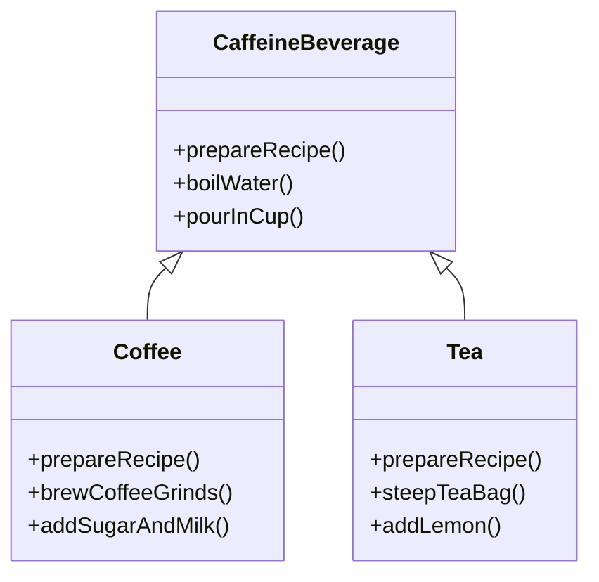
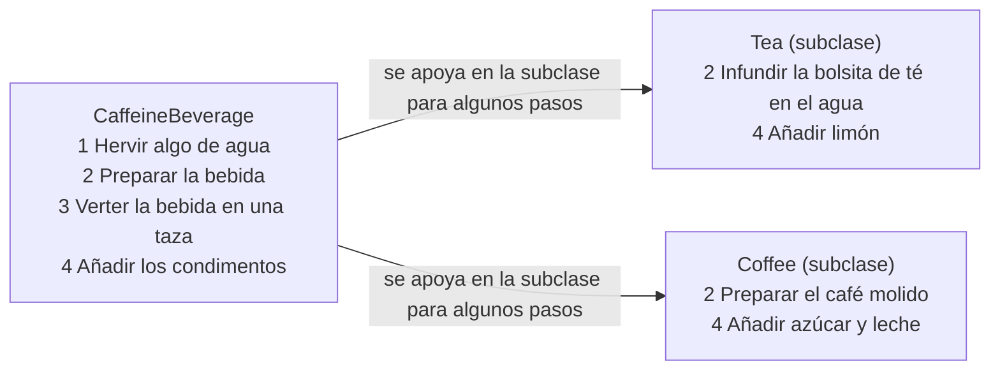
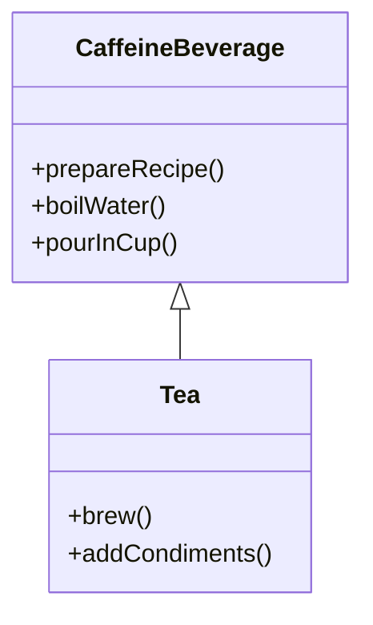
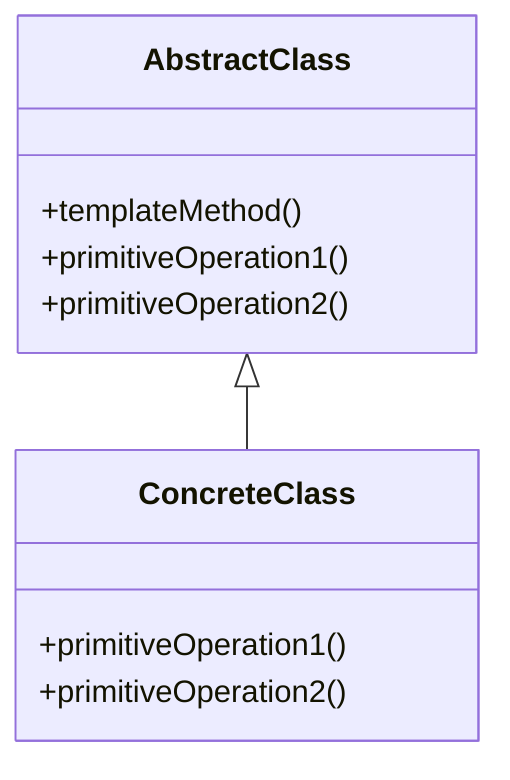
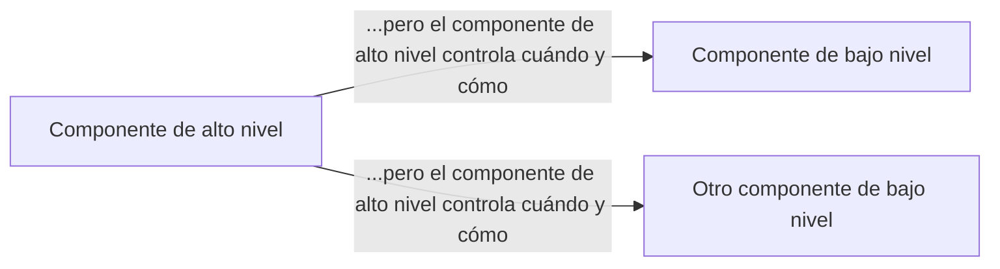
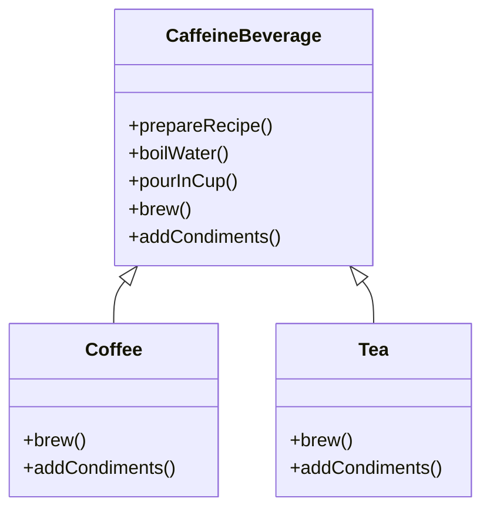

# Capítulo 8: El patrón Template Method: encapsulando algoritmos

> Estamos en una racha de encapsulación: hemos encapsulado la creación de objetos, la invocación de métodos, las interfaces complejas, los patos, las pizzas... ¿qué podría venir después? Vamos a bajar al terreno de los fragmentos: vamos a encapsular trozos de algoritmo para que las subclases puedan engancharse por su cuenta a un cálculo cuando les apetezca. Hasta vamos a aprender un principio de diseño inspirado en Hollywood. Empecemos...

## Un poco más de cafeína

Hay gente que no puede vivir sin su café; hay gente que no puede vivir sin su té. ¿El ingrediente común? ¡La cafeína, por supuesto!

Pero hay más: el té y el café se preparan de maneras muy parecidas. Veámoslo:

!!! warning "Manual de barista de Starbuzz Coffee"
    **¡Baristas! Por favor, sigan estas recetas al pie de la letra cuando preparen bebidas de Starbuzz.**

    **Receta de café de Starbuzz**

    ```text
    (1) Hervir algo de agua
    (2) Preparar el café con el agua hirviendo
    (3) Verter el café en la taza
    (4) Añadir azúcar y leche
    ```

!!! warning "Receta de té de Starbuzz"

    ```text
    (1) Hervir algo de agua
    (2) Infusionar el té en el agua hirviendo
    (3) Verter el té en la taza
    (4) Añadir limón
    ```

    Todas las recetas son secretos comerciales de Starbuzz Coffee y deben mantenerse estrictamente confidenciales.

!!! tip "Nota marginal"
    La receta del café se parece muchísimo a la del té, ¿no te parece?

## Preparando clases de café y té (en Java)

Vamos a jugar al «programador barista» y a escribir un poco de código para crear café y té. Aquí tienes el café:

```java
public class Coffee {
    void prepareRecipe() {
        boilWater();
        brewCoffeeGrinds();
        pourInCup();
        addSugarAndMilk();
    }
    public void boilWater() {
        System.out.println("Boiling water");
    }
    public void brewCoffeeGrinds() {
        System.out.println("Dripping Coffee through filter");
    }
    public void pourInCup() {
        System.out.println("Pouring into cup");
    }
    public void addSugarAndMilk() {
        System.out.println("Adding Sugar and Milk");
    }
}
```

!!! note "Notas marginales"
    - Aquí tienes nuestra clase `Coffee` para preparar café. Y aquí está nuestra receta de café, tal cual sale del manual de formación.
    - Cada uno de los pasos está implementado como un método independiente.
    - Cada uno de estos métodos implementa un paso del algoritmo. Hay un método para hervir el agua, otro para preparar el café, otro para verter el café en una taza y otro para añadir azúcar y leche.

## Y ahora el té...

```java
public class Tea {
    void prepareRecipe() {
        boilWater();
        steepTeaBag();
        pourInCup();
        addLemon();
    }
    public void boilWater() {
        System.out.println("Boiling water");
    }
    public void steepTeaBag() {
        System.out.println("Steeping the tea");
    }
    public void addLemon() {
        System.out.println("Adding Lemon");
    }
    public void pourInCup() {
        System.out.println("Pouring into cup");
    }
}
```

!!! note "Notas marginales"
    Esto se parece muchísimo a lo que acabamos de implementar en `Coffee`; los pasos segundo y cuarto son distintos, pero en lo esencial es la misma receta.
    - Fíjate en que estos dos métodos son exactamente los mismos que en `Coffee`. Así que aquí tenemos claramente duplicación de código.
    - Estos dos métodos están especializados para `Tea`.

!!! question "Nota marginal"
    Cuando tenemos duplicación de código, es buena señal de que necesitamos limpiar el diseño. Parece que aquí deberíamos abstraer la parte común en una clase base, ya que el café y el té son tan parecidos.

!!! exercise "Rompecabezas de diseño"
    Ya has visto que las clases `Coffee` y `Tea` tienen bastante duplicación de código. Echa otro vistazo a las clases `Coffee` y `Tea` y dibuja un diagrama de clases que muestre cómo rediseñarías las clases para eliminar la redundancia.

## Vamos a abstraer ese Coffee y ese Tea

Parece que tenemos un ejercicio de diseño bastante directo entre manos con las clases `Coffee` y `Tea`. Tu primer intento podría haber sido algo así:



!!! note "Notas marginales"
    - Los métodos `boilWater()` y `pourInCup()` son compartidos por ambas subclases, así que están definidos en la superclase.
    - El método `prepareRecipe()` difiere en cada subclase, así que se define como abstracto. Cada subclase implementa su propia receta.
    - Cada subclase sobrescribe el método `prepareRecipe()` e implementa su propia receta.
    - Los métodos específicos de `Coffee` y de `Tea` se quedan en las subclases.

¿Hemos hecho un buen trabajo con el rediseño? Hmmmm, échale otro vistazo. ¿Se nos está escapando alguna otra cosa en común? ¿En qué otros sentidos se parecen `Coffee` y `Tea`?

## Llevando el diseño más lejos...

Bueno, ¿qué más tienen en común `Coffee` y `Tea`? Empecemos por las recetas.

!!! warning "Receta de café de Starbuzz"

    ```text
    (1) Hervir algo de agua
    (2) Preparar el café con el agua hirviendo
    (3) Verter el café en la taza
    (4) Añadir azúcar y leche
    ```

!!! warning "Receta de té de Starbuzz"

    ```text
    (1) Hervir algo de agua
    (2) Infusionar el té en el agua hirviendo
    (3) Verter el té en la taza
    (4) Añadir limón
    ```

Fíjate en que ambas recetas siguen el mismo algoritmo:

1. Hervir algo de agua.
2. Usar el agua caliente para extraer el café o el té.
3. Verter la bebida resultante en una taza.
4. Añadir a la bebida los condimentos apropiados.

!!! note "Notas marginales"
    - Estas dos recetas ya están abstraídas a la clase base; solo se aplican a bebidas distintas.

Así que, ¿podemos encontrar una manera de abstraer también `prepareRecipe()`? Sí, vamos a averiguarlo...

## Abstrayendo prepareRecipe()

Vamos paso a paso abstrayendo `prepareRecipe()` de cada subclase (es decir, de las clases `Coffee` y `Tea`)...

**1**

El primer problema que tenemos es que `Coffee` usa los métodos `brewCoffeeGrinds()` y `addSugarAndMilk()`, mientras que `Tea` usa los métodos `steepTeaBag()` y `addLemon()`.

| Tea | Coffee |
| --- | --- |
| `void prepareRecipe() {`<br>`    boilWater();`<br>`    steepTeaBag();`<br>`    pourInCup();`<br>`    addLemon();`<br>`}` | `void prepareRecipe() {`<br>`    boilWater();`<br>`    brewCoffeeGrinds();`<br>`    pourInCup();`<br>`    addSugarAndMilk();`<br>`}` |

Piénsalo: infusionar el té y preparar el café no son tan distintos; son más o menos análogos. Así que vamos a inventar un nombre de método nuevo, digamos `brew()`, y usaremos el mismo nombre tanto si estamos preparando café como si estamos infusionando té.

Asimismo, añadir azúcar y leche es más o menos lo mismo que añadir un limón: en ambos casos estamos añadiendo condimentos a la bebida. Vamos también a inventar un nombre nuevo, `addCondiments()`, que se encargue de esto. Así que nuestro nuevo método `prepareRecipe()` tendrá este aspecto:

```java
void prepareRecipe() {
    boilWater();
    brew();
    pourInCup();
    addCondiments();
}
```

!!! tip "Nota marginal"
    (El código está en la página siguiente.)

**2**

Ahora tenemos un nuevo método `prepareRecipe()`, pero tenemos que encajarlo en el código. Para ello empezaremos por la superclase `CaffeineBeverage`:

```java
public abstract class CaffeineBeverage {
    final void prepareRecipe() {
        boilWater();
        brew();
        pourInCup();
        addCondiments();
    }
    abstract void brew();
    abstract void addCondiments();
    void boilWater() {
        System.out.println("Boiling water");
    }
    void pourInCup() {
        System.out.println("Pouring into cup");
    }
}
```

!!! note "Notas marginales"
    - `CaffeineBeverage` es abstracta, igual que en el diseño de clases.
    - Ahora, el mismo método `prepareRecipe()` se usará para preparar tanto `Tea` como `Coffee`.
    - `prepareRecipe()` se declara `final` porque no queremos que nuestras subclases puedan sobrescribir este método ¡y cambiar la receta!
    - Hemos generalizado los pasos 2 y 4 a `brew()` (preparar la bebida) y `addCondiments()` (añadir condimentos).
    - Como `Coffee` y `Tea` resuelven estos métodos de maneras distintas, van a tener que declararse abstractos. ¡Que las subclases se preocupen de eso!
    - Recuerda que movimos estos métodos a la clase `CaffeineBeverage` (en nuestro diagrama de clases).

**3**

Por fin tenemos que ocuparnos de las clases `Coffee` y `Tea`. Ahora delegan en `CaffeineBeverage` la gestión de la receta, así que solo tienen que encargarse de la preparación y de los condimentos:

```java
public class Tea extends CaffeineBeverage {
    public void brew() {
        System.out.println("Steeping the tea");
    }
    public void addCondiments() {
        System.out.println("Adding Lemon");
    }
}
```

```java
public class Coffee extends CaffeineBeverage {
    public void brew() {
        System.out.println("Dripping Coffee through filter");
    }
    public void addCondiments() {
        System.out.println("Adding Sugar and Milk");
    }
}
```

!!! note "Notas marginales"
    - Como en nuestro diseño, ahora `Tea` y `Coffee` extienden de `CaffeineBeverage`.
    - `Tea` necesita definir `brew()` y `addCondiments()`: los dos métodos abstractos de `CaffeineBeverage`.
    - Con `Coffee` igual, salvo que `Coffee` se ocupa del café, y del azúcar y la leche en lugar de la bolsita de té y el limón.

!!! exercise "Tu turno"
    Dibuja ahora el nuevo diagrama de clases, ahora que hemos movido la implementación de `prepareRecipe()` a la clase `CaffeineBeverage`. Consulta las soluciones al final del capítulo.

## ¿Qué hemos hecho?

Hemos reconocido que las dos recetas son esencialmente la misma, aunque algunos de los pasos requieren implementaciones distintas. Así que hemos generalizado la receta y la hemos colocado en la clase base.

| Paso | Tea | Coffee | CaffeineBeverage |
| --- | --- | --- | --- |
| 1 | Hervir algo de agua | Hervir algo de agua | Hervir algo de agua |
| 2 | Infundir la bolsita de té en el agua | Preparar el café molido | Preparar la bebida |
| 3 | Verter el té en una taza | Verter el café en una taza | Verter la bebida en una taza |
| 4 | Añadir limón | Añadir azúcar y leche | Añadir los condimentos |



!!! note "Notas marginales"
    - La clase `CaffeineBeverage` conoce y controla los pasos de la receta, y ejecuta por sí misma los pasos 1 y 3, pero se apoya en `Tea` o en `Coffee` para hacer los pasos 2 y 4.
    - La subclase `Tea` generaliza algunos pasos de `CaffeineBeverage`.
    - La subclase `Coffee` generaliza algunos pasos de `CaffeineBeverage`.

## Conoce el patrón Template Method

Básicamente acabamos de implementar el patrón Template Method. ¿Y eso qué es? Veamos la estructura de la clase `CaffeineBeverage`; contiene el «método plantilla» real:

```java
public abstract class CaffeineBeverage {
    final void prepareRecipe() {
        boilWater();
        brew();
        pourInCup();
        addCondiments();
    }
    abstract void brew();
    abstract void addCondiments();
    void boilWater() {
        // implementation
    }
    void pourInCup() {
        // implementation
    }
}
```

!!! note "Notas marginales"
    - `prepareRecipe()` es nuestro método plantilla. ¿Por qué?
    - Porque: (1) es un método, después de todo. (2) sirve de plantilla para un algoritmo, en este caso un algoritmo para preparar bebidas con cafeína. (3) nos permite que las subclases decidan cómo implementar los distintos pasos.
    - En la plantilla, cada paso del algoritmo está representado por un método. Algunos métodos los gestiona esta clase... ...y otros los gestiona la subclase.
    - Los métodos que tiene que aportar una subclase se declaran abstractos.

!!! abstract "Definición"
    El patrón Template Method define los pasos de un algoritmo y permite que las subclases aporten la implementación de uno o más de esos pasos.

## Vamos a preparar un té...

Vamos a recorrer la preparación de un té y a seguir el rastro de cómo funciona el método plantilla. Verás que el método plantilla controla el algoritmo; en ciertos puntos del algoritmo, deja que la subclase aporte la implementación de los pasos...

```java
boilWater();
brew();
pourInCup();
addCondiments();
```

!!! note "Nota marginal"
    El método `prepareRecipe()` controla el algoritmo. Nadie puede cambiarlo y cuenta con que las subclases aporten toda o parte de la implementación.

**1**

Vale, primero necesitamos un objeto `Tea`...

```java
Tea myTea = new Tea();
```

**2**

Y luego llamamos al método plantilla:

```java
myTea.prepareRecipe();
```

lo cual sigue el algoritmo para preparar bebidas con cafeína...

**3**

Primero hervimos el agua:

```java
boilWater();
```

y esto ocurre en `CaffeineBeverage`.



**4**

A continuación necesitamos infusionar el té, algo que solo la subclase sabe hacer:

```java
brew();
```

**5**

Ahora vertemos el té en la taza; esto es igual para todas las bebidas, así que ocurre en `CaffeineBeverage`:

```java
pourInCup();
```

**6**

Por último, añadimos los condimentos, que son específicos de cada bebida, así que los implementa la subclase:

```java
addCondiments();
```

## ¿Qué nos ha dado el patrón Template Method?

| Tea y Coffee capabilities limitadas | Nueva y moderna implementación de CaffeineBeverage, impulsada por el patrón Template Method |
| --- | --- |
| `Coffee` y `Tea` llevan las riendas; controlan el algoritmo. | La clase `CaffeineBeverage` lleva las riendas; tiene el algoritmo y lo protege. |
| El código está duplicado entre `Coffee` y `Tea`. | La clase `CaffeineBeverage` maximiza la reutilización entre las subclases. |
| Los cambios en el algoritmo requieren abrir las subclases y hacer varios cambios. | El algoritmo vive en un único sitio y los cambios en el código solo hay que hacerlos ahí. |
| Las clases están organizadas en una estructura que exige mucho trabajo para añadir una nueva bebida con cafeína. | El patrón Template Method ofrece un framework al que se pueden enchufar otras bebidas con cafeína. Las nuevas bebidas solo tienen que implementar un par de métodos. |
| El conocimiento del algoritmo y de cómo implementarlo está repartido entre muchas clases. | La clase `CaffeineBeverage` concentra el conocimiento sobre el algoritmo y se apoya en las subclases para que aporten implementaciones completas. |

## Patrón Template Method definido

Ya has visto cómo funciona el patrón Template Method en nuestro ejemplo del té y el café; ahora, echa un vistazo a la definición oficial y fija todos los detalles:

!!! abstract "Definición"
    El patrón Template Method define el esqueleto de un algoritmo en un método, aplazar algunos pasos a las subclases. Template Method permite que las subclases redefinan ciertos pasos de un algoritmo sin cambiar la estructura del algoritmo.

Todo este patrón va de crear una plantilla para un algoritmo. ¿Y qué es una plantilla? Como ya has visto, es simplemente un método; más concretamente, es un método que define un algoritmo como un conjunto de pasos. Uno o varios de estos pasos se definen como abstractos y los implementa una subclase. Esto garantiza que la estructura del algoritmo se mantenga sin cambios, mientras las subclases aportan parte de la implementación.

Veamos el diagrama de clases:



!!! note "Notas marginales"
    - El método plantilla se sirve de las operaciones primitivas para implementar un algoritmo. Está desacoplado de la implementación real de esas operaciones.
    - La clase `AbstractClass` contiene el método plantilla... ...y versiones abstractas de las operaciones usadas en el método plantilla.
    - Puede haber muchas `ConcreteClass`, cada una implementando el conjunto completo de operaciones que necesita el método plantilla.
    - La clase `ConcreteClass` implementa las operaciones abstractas, que se llaman cuando el `templateMethod()` las necesita.

## El código de cerca

Vamos a mirar de cerca cómo se define la `AbstractClass`, incluyendo el método plantilla y las operaciones primitivas.

```java
abstract class AbstractClass {
    final void templateMethod() {
        primitiveOperation1();
        primitiveOperation2();
        concreteOperation();
    }
    abstract void primitiveOperation1();
    abstract void primitiveOperation2();
    void concreteOperation() {
        // implementation here
    }
}
```

!!! note "Notas marginales"
    - Aquí tenemos nuestra clase abstracta; se declara abstracta y está pensada para que la subclasen clases que aportan implementaciones de las operaciones.
    - Este es el método plantilla. Se declara `final` para impedir que las subclases reestructurez la secuencia de pasos del algoritmo.
    - El método plantilla define la secuencia de pasos, cada uno representado por un método.
    - En este ejemplo, dos de las operaciones primitivas las tienen que implementar las subclases concretas.
    - También tenemos una operación concreta definida en la clase abstracta. Esta podría ser sobrescrita por las subclases, o podríamos impedir la sobrescritura declarando `concreteOperation()` como `final`. Hablamos más de esto enseguida...

## El código bien de cerca

Ahora vamos a mirar todavía más de cerca los tipos de método que pueden ir en la clase abstracta:

```java
abstract class AbstractClass {
    final void templateMethod() {
        primitiveOperation1();
        primitiveOperation2();
        concreteOperation();
        hook();
    }
    abstract void primitiveOperation1();
    abstract void primitiveOperation2();
    final void concreteOperation() {
        // implementation here
    }
    void hook() {}
}
```

!!! note "Notas marginales"
    - Hemos cambiado `templateMethod()` para incluir una llamada a un método nuevo.
    - Todavía tenemos nuestros métodos de operaciones primitivas; estos son abstractos y los implementan las subclases concretas.
    - Una operación concreta está definida en la clase abstracta. Esta se declara `final` para que las subclases no puedan sobrescribirla. Puede usarse directamente en el método plantilla, o ser usada por las subclases.
    - También podemos tener métodos concretos que no hacen nada por defecto; los llamamos «hooks» (ganchos). Las subclases son libres de sobrescribirlos, pero no están obligadas. Veremos en la siguiente página cuánto nos pueden servir.

## Conectado al Template Method...

!!! tip "Nota marginal"
    Con un hook, puedo sobrescribir el método o no. Es cosa mía. Si no lo hago, la clase abstracta proporciona una implementación por defecto.

!!! tip "Nota marginal"
    Es un método concreto, ¡pero no hace nada!

Un hook es un método que se declara en la clase abstracta, pero al que solo se le da una implementación vacía o por defecto. Esto da a las subclases la capacidad de «engancharse» al algoritmo en distintos puntos, si así lo desean; una subclase también es libre de ignorar el hook. Los hooks tienen varios usos; veamos uno ahora. Más adelante hablaremos de otros usos:

```java
public abstract class CaffeineBeverageWithHook {
    final void prepareRecipe() {
        boilWater();
        brew();
        pourInCup();
        if (customerWantsCondiments()) {
            addCondiments();
        }
    }
    abstract void brew();
    abstract void addCondiments();
    void boilWater() {
        System.out.println("Boiling water");
    }
    void pourInCup() {
        System.out.println("Pouring into cup");
    }
    boolean customerWantsCondiments() {
        return true;
    }
}
```

!!! note "Notas marginales"
    - Hemos añadido una pequeña sentencia condicional que basa su resultado en un método concreto, `customerWantsCondiments()`. Si el cliente QUIERE condimentos, entonces y solo entonces llamamos a `addCondiments()`.
    - Aquí hemos definido un método con una implementación por defecto (casi) vacía. Este método simplemente devuelve `true` y no hace nada más.
    - Este es un hook porque la subclase puede sobrescribir este método, pero no está obligada.

## Usando el hook

Para usar el hook, lo sobrescribimos en nuestra subclase. Aquí, el hook controla si la clase `CaffeineBeverage` evalúa una cierta parte del algoritmo, es decir, si añade un condimento a la bebida.

Pero, ¿cómo sabemos si el cliente quiere el condimento? ¡Simplemente preguntándoselo!

```java
public class CoffeeWithHook extends CaffeineBeverageWithHook {
    public void brew() {
        System.out.println("Dripping Coffee through filter");
    }
    public void addCondiments() {
        System.out.println("Adding Sugar and Milk");
    }
    public boolean customerWantsCondiments() {
        String answer = getUserInput();
        if (answer.toLowerCase().startsWith("y")) {
            return true;
        } else {
            return false;
        }
    }
    private String getUserInput() {
        String answer = null;
        System.out.print("Would you like milk and sugar with your coffee (y/n)? ");
        BufferedReader in = new BufferedReader(new InputStreamReader(System.in));
        try {
            answer = in.readLine();
        } catch (IOException ioe) {
            System.err.println("IO error trying to read your answer");
        }
        if (answer == null) {
            return "no";
        }
        return answer;
    }
}
```

!!! note "Notas marginales"
    - Aquí es donde sobrescribes el hook y aportas tu propia funcionalidad.
    - Obtiene la entrada del usuario sobre la decisión de los condimentos y devuelve `true` o `false`, en función de lo que se haya introducido.
    - Este código pregunta si al usuario le gustaría leche y azúcar y obtiene la respuesta por línea de comandos.

## Probémoslo

Vale, el agua está hirviendo... Aquí tienes el código de prueba, donde creamos un té caliente y un café caliente:

```java
public class BeverageTestDrive {
    public static void main(String[] args) {
        TeaWithHook teaHook = new TeaWithHook();
        CoffeeWithHook coffeeHook = new CoffeeWithHook();
        System.out.println("\nMaking tea...");
        teaHook.prepareRecipe();
        System.out.println("\nMaking coffee...");
        coffeeHook.prepareRecipe();
    }
}
```

!!! note "Notas marginales"
    - Crea un té.
    - Crea un café.
    - ¡Y llama a `prepareRecipe()` en los dos!

Y vamos a darle una vuelta...

```text
File  Edit   Window  Help  send-more-honesttea
%java BeverageTestDrive
Making tea...
Boiling water
Steeping the tea
Pouring into cup
Would you like lemon with your tea (y/n)? y
Adding Lemon
Making coffee...
Boiling water
Dripping Coffee through filter
Pouring into cup
Would you like milk and sugar with your coffee (y/n)? n
%
```

!!! note "Notas marginales"
    Una taza humeante de té y, por supuesto, ¡sí queremos ese limón!
    - Y una buena taza de café caliente, pero nos pasaremos de los condimentos que engordan la cintura.

!!! question "Nota marginal"
    Ahora, yo habría pensado que una funcionalidad como la de preguntar al cliente podría haberla usado todas las subclases, ¿no?

Sabes qué, estamos de acuerdo contigo. Pero tienes que admitir que, antes de que se te ocurriera, era un ejemplo bastante cojonudo de cómo se puede usar un hook para controlar condicionalmente el flujo del algoritmo en la clase abstracta, ¿verdad?

Estamos seguros de que se te ocurren muchos otros escenarios más realistas en los que podrías usar el método plantilla y los hooks en tu propio código.

!!! question "Preguntas frecuentes"
    **P: Cuando estoy creando un método plantilla, ¿cómo sé cuándo usar métodos abstractos y cuándo usar hooks?**

    R: Usa métodos abstractos cuando tu subclase DEBA aportar la implementación del método o del paso del algoritmo. Usa hooks cuando esa parte del algoritmo sea opcional. Con los hooks, una subclase puede decidir implementar ese hook, pero no está obligada.

    **P: ¿Una subclase tiene que implementar todos los métodos abstractos de la `AbstractClass`?**

    R: Sí, cada subclase concreta define el conjunto completo de métodos abstractos y aporta una implementación completa de los pasos indefinidos del algoritmo del método plantilla.

    **P: Parece que debería mantener mis métodos abstractos pequeños en número; de lo contrario, implementarlos en la subclase será un buen trabajo.**

    R: Ten en cuenta, además, que algunos pasos serán opcionales, así que puedes implementar esos como hooks en lugar de como métodos abstractos, aligerando así la carga de las subclases de tu clase abstracta.

    **P: ¿Para qué se supone que sirven realmente los hooks?**

    R: Los hooks tienen algunos usos. Como acabamos de decir, un hook puede ofrecer una forma de que una subclase implemente una parte opcional de un algoritmo o, si no es importante para la implementación de la subclase, esta puede saltárselo. Otro uso es darle a la subclase la oportunidad de reaccionar a algún paso del método plantilla que está a punto de ocurrir o acaba de ocurrir. Por ejemplo, un método hook como `justReorderedList()` permite que la subclase realice alguna actividad (como volver a mostrar una representación en pantalla) después de que una lista interna se haya reordenado. Como ya has visto, un hook también puede darle a la subclase la capacidad de tomar una decisión por la clase abstracta.

## El principio de Hollywood

!!! tip "Nota marginal"
    Ya me has oído decir esto antes y lo repetiré: «¡No me llames, yo te llamaré!»

Tenemos otro principio de diseño para ti; se llama el principio de Hollywood:

!!! abstract "Principio de diseño"
    **El principio de Hollywood**

    «No nos llames, nosotros te llamaremos a ti.»

Fácil de recordar, ¿verdad? Pero, ¿qué tiene que ver esto con el diseño OO?

El principio de Hollywood nos da una forma de evitar la «podredumbre de dependencias». La podredumbre de dependencias ocurre cuando tienes componentes de alto nivel dependiendo de componentes de bajo nivel, que dependen de componentes de alto nivel, que dependen de componentes laterales, que dependen de componentes de bajo nivel, y así sucesivamente. Cuando entra la podredumbre, ya nadie puede entender con facilidad cómo está diseñado un sistema.

Con el principio de Hollywood, permitimos que los componentes de bajo nivel se enganchen a sí mismos a un sistema, pero los componentes de alto nivel determinan cuándo se necesitan y cómo. En otras palabras, los componentes de alto nivel dan a los componentes de bajo nivel el tratamiento de «no nos llames, nosotros te llamaremos».



!!! note "Notas marginales"
    - Los componentes de bajo nivel pueden participar en el cálculo...
    - ...pero los componentes de alto nivel controlan cuándo y cómo.
    - Un componente de bajo nivel nunca llama directamente a un componente de alto nivel.

## El principio de Hollywood y el Template Method

La conexión entre el principio de Hollywood y el patrón Template Method probablemente es bastante evidente: cuando diseñamos con el patrón Template Method, le estamos diciendo a las subclases «no nos llames, nosotros te llamaremos». ¿Cómo? Veamos otro vistazo a nuestro diseño de `CaffeineBeverage`:



!!! note "Notas marginales"
    - `CaffeineBeverage` es nuestro componente de alto nivel. Tiene el control sobre el algoritmo de la receta, y llama a las subclases solo cuando las necesita para la implementación de un método.
    - Los clientes de las bebidas dependerán de la abstracción `CaffeineBeverage` en lugar de un `Tea` o un `Coffee` concreto, lo que reduce las dependencias del sistema en conjunto.
    - `Tea` y `Coffee` nunca llaman a la clase abstracta directamente sin que se las haya «llamado» antes.
    - Las subclases se usan simplemente para aportar detalles de implementación.

!!! exercise "Piensa en esto"
    ¿Qué otros patrones se apoyan en el principio de Hollywood?

    **El patrón Factory Method y el patrón Observer. ¿Alguno más?**

## Template Methods en la vida real

El patrón Template Method es un patrón muy común y vas a encontrarlo mucho por ahí. Eso sí, hay que tener buen ojo, porque hay muchas implementaciones de métodos plantilla que no se parecen demasiado al diseño de manual del patrón.

Este patrón aparece tan a menudo porque es una excelente herramienta de diseño para crear frameworks, donde el framework controla cómo se hace algo, pero te deja a ti (la persona que usa el framework) especificar tus propios detalles sobre lo que realmente ocurre en cada paso del algoritmo del framework.

Vamos a dar un pequeño recorrido por algunos usos en la vida real (bueno, vale, en la API de Java)...

!!! tip "Nota marginal"
    En la formación estudiamos los patrones clásicos. Sin embargo, cuando estamos en el mundo real, tenemos que aprender a reconocer los patrones fuera de contexto. También tenemos que aprender a reconocer variaciones de los patrones, porque en el mundo real un agujero cuadrado no siempre es del todo cuadrado.

## Ordenar con Template Method

¿Qué es algo que hacemos a menudo con los arrays? ¡Ordenarlos!

Al reconocerlo, los diseñadores de la clase `Arrays` de Java nos han proporcionado un wad: un conveniente método plantilla para ordenar. Veamos cómo opera este método; hemos recortado un poco este código para que sea más fácil explicarlo. Si quieres verlo entero, ve al código fuente de Java y échale un vistazo.

```java
public static void sort(Object[] a) {
    Object aux[] = (Object[])a.clone();
    mergeSort(aux, a, 0, a.length, 0);
}
```

!!! note "Notas marginales"
    - En realidad aquí tenemos dos métodos que actúan juntos para proporcionar la funcionalidad de ordenación.
    - El primer método, `sort()`, es solo un método auxiliar que crea una copia del array y la pasa como array de destino al método `mergeSort()`. También pasa la longitud del array y le dice a la ordenación que empiece por el primer elemento.
    - Este es un método concreto, ya definido en la clase `Arrays`.

```java
private static void mergeSort(Object src[], Object dest[],
int low, int high, int off) 
{
    // a lot of other code here
    for (int i=low; i<high; i++){
        for (int j=i; j>low &&
             ((Comparable)dest[j-1]).compareTo((Comparable)dest[j])>0; j--)
        {
            swap(dest, j, j-1);
        }
    }
    // and a lot of other code here
}
```

!!! note "Notas marginales"
    - El método `mergeSort()` contiene el algoritmo de ordenación y se apoya en una implementación del método `compareTo()` para completar el algoritmo. Si te interesa el meollo de cómo se hace la ordenación, tendrás que consultar el código fuente de Java.
    - `compareTo()` es el método que tenemos que implementar para «rellenar» el método plantilla.
    - Piensa en esto como el método plantilla.

## Tengo patos que ordenar...

Supón que tienes un array de patos que quieres ordenar. ¿Cómo lo haces? Pues el método plantilla `sort()` de `Arrays` nos da el algoritmo, pero tienes que decirle cómo comparar los patos, y eso se hace implementando el método `compareTo()`... ¿Te cuadra?

!!! question "Nota marginal"
    No, no me cuadra. ¿No deberíamos estar subclasando algo? Pensaba que eso era justo lo del patrón Template Method. Un array no subclasa nada, así que no entiendo cómo íbamos a usar `sort()`.

Buen punto. Aquí está el asunto: los diseñadores de `sort()` querían que fuera útil para todos los arrays, así que tuvieron que hacer de `sort()` un método estático que se pudiera usar desde cualquier sitio. Pero eso está bien, ya que funciona casi igual que si estuviera en una superclase.

Ahora, aquí hay un detalle más: como `sort()` no está definido realmente en nuestra superclase, el método `sort()` necesita saber que has implementado el método `compareTo()`, o si no, no tienes la pieza necesaria para completar el algoritmo de ordenación.

Para jugar esto, los diseñadores hicieron uso de la interfaz `Comparable`. Lo único que tienes que hacer es implementar esta interfaz, que tiene un método (sorpresa): `compareTo()`.

### ¿Qué es compareTo()?

El método `compareTo()` compara dos objetos y devuelve si uno es menor, mayor o igual que el otro. `sort()` usa esto como base para su comparación de los objetos del array.

!!! question "Nota marginal"
    Ni idea. Eso es justo lo que nos dice `compareTo()`. ¿Soy mayor que tú?

## Comparando patos y patos

Vale, ya sabes que si quieres ordenar `Duck`s, vas a tener que implementar este método `compareTo()`; al hacerlo, le darás a la clase `Arrays` lo que necesita para completar el algoritmo y ordenar tus patos.

Aquí tienes la implementación del pato:

```java
public class Duck implements Comparable<Duck> {
    String name;
    int weight;
    public Duck(String name, int weight) {
        this.name = name;
        this.weight = weight;
    }
    public String toString() {
        return name + " weighs " + weight;
    }
    public int compareTo(Duck otherDuck) {
        if (this.weight < otherDuck.weight) {
            return -1;
        } else if (this.weight == otherDuck.weight) {
            return 0;
        } else { // this.weight > otherDuck.weight
            return 1;
        }
    }
}
```

!!! note "Notas marginales"
    - Recuerda que tenemos que implementar la interfaz `Comparable` ya que no estamos subclasando de verdad.
    - Nuestros patos tienen un nombre y un peso. Lo dejamos simple; ¡todo lo que hacen los patos es imprimir su nombre y su peso!
    - Vale, aquí está lo que necesita `sort()`...
    - `compareTo()` recibe otro pato con el que comparar ESTE pato. Aquí es donde especificamos cómo se comparan los patos. Si ESTE pato pesa menos que `otherDuck`, devolvemos `-1`; si pesan lo mismo, devolvemos `0`; y si ESTE pato pesa más, devolvemos `1`.

## Vamos a ordenar unos patos

Aquí tienes la prueba de ordenación de patos...

```java
public class DuckSortTestDrive {
    public static void main(String[] args) {
        Duck[] ducks = { 
                         new Duck("Daffy", 8), 
                         new Duck("Dewey", 2),
                         new Duck("Howard", 7),
                         new Duck("Louie", 2),
                         new Duck("Donald", 10), 
                         new Duck("Huey", 2)
         };
        System.out.println("Before sorting:");
        display(ducks);
        Arrays.sort(ducks);
        System.out.println("\nAfter sorting:");
        display(ducks);
    }
    public static void display(Duck[] ducks) {
        for (Duck d : ducks) {
            System.out.println(d);
        }
    }
}
```

!!! note "Notas marginales"
    - Necesitamos un array de patos; estos tienen buena pinta.
    - Fíjate en que llamamos al método estático `sort()` de `Arrays` y le pasamos nuestros patos. ¡Es hora de ordenar!
    - Vamos a imprimirlos para ver sus nombres y pesos.

```text
File  Edit   Window  Help  DonaldNeedsToGoOnADiet
%java DuckSortTestDrive
Before sorting:
Daffy weighs 8
Dewey weighs 2
Howard weighs 7
Louie weighs 2
Donald weighs 10
Huey weighs 2
After sorting:
Dewey weighs 2
Louie weighs 2
Huey weighs 2
Howard weighs 7
Daffy weighs 8
Donald weighs 10
%
```

!!! note "Notas marginales"
    - Los patos sin ordenar.
    - Los patos ordenados.

!!! question "Nota marginal"
    ¡Que empiece la ordenación!

!!! note "Tras las cámaras"
    El método `sort()` controla el algoritmo; ninguna clase puede cambiarlo. `sort()` cuenta con una clase `Comparable` para que aporte la implementación de `compareTo()`. No hay herencia, al contrario que en un método plantilla típico.

!!! exercise "Ejercicio 1"
    Sabemos que deberíamos preferir la composición frente a la herencia, ¿verdad? Pues bien, los implementadores del método plantilla `sort()` decidieron no usar herencia y, en su lugar, implementar `sort()` como un método estático que se compone con un `Comparable` en tiempo de ejecución. ¿Cómo es esto mejor? ¿Cómo es peor? ¿Cómo abordarías tú este problema? ¿Los arrays de Java hacen que este problema sea particularmente peliagudo?

!!! exercise "Ejercicio 2"
    Piensa en otro patrón que sea una especialización del método plantilla. En esta especialización, las operaciones primitivas se usan para crear y devolver objetos. ¿Qué patrón es este?

## Conversación junto a la chimenea: Template Method y Strategy
**Template Method:**

**Strategy:**

**Factory Method:**

!!! note "Intervenciones"
    - **Template Method**: Eh, Strategy, ¿qué haces en mi capítulo?
    - **Strategy**: Pensaba que me había tocado quedarme con alguien aburrido como Factory Method.
    - **Template Method**: ¡Eh, ¡he oído eso!
    - **Strategy**: No, soy yo, aunque ten cuidado: tú y Factory Method estáis relacionados, ¿verdad?
    - **Template Method**: ¡Solo estaba bromeando! Pero, en serio, ¿qué haces aquí? ¡No-nos hacíamos desde hace siete capítulos!
    - **Strategy**: Había oído que estabais en el último borrador de vuestro capítulo y pensé en pasarme a ver cómo iba todo. Tenemos mucho en común, así que pensé que quizá pueda echar una mano...
    - **Template Method**: Quizá quieras recordar al lector de qué te ocupas, ya que ha pasado mucho tiempo.
    - **Strategy**: No lo sé, desde el Capítulo 1 la gente me para en la calle diciendo: «¿No eres tú ese patrón...?». Así que creo que ya saben quién soy. Pero, por tu bien: defino una familia de algoritmos y los hago intercambiables. Como cada algoritmo está encapsulado, el cliente puede usar distintos algoritmos fácilmente.
    - **Template Method**: Vaya, eso sí que suena parecido a lo que hago yo. Pero mi intención es algo distinta de la tuya; mi trabajo es definir el contorno de un algoritmo, pero dejar que mis subclases hagan parte del trabajo. Así, puedo tener distintas implementaciones de los pasos individuales de un algoritmo y mantener el control sobre la estructura del algoritmo. Parece que tienes que renunciar al control de tus algoritmos.
    - **Strategy**: No estoy seguro de que lo diría exactamente así... y además, no estoy atado a la herencia para las implementaciones de los algoritmos. Ofrezco a los clientes una elección de implementación de algoritmo mediante composición de objetos.
    - **Template Method**: Me acuerdo de eso. Pero yo tengo más control sobre mi algoritmo y no duplico código. De hecho, si todas las partes de mi algoritmo son iguales salvo, digamos, una línea, entonces mis clases son mucho más eficientes que las tuyas. Todo mi código duplicado acaba en la superclase, así que todas las subclases pueden compartirlo.
    - **Strategy**: Puede que seas un poco más eficiente (solo un poco) y que requieras menos objetos. Y puede que también seas un poco menos complicado en comparación con mi modelo de delegación, pero yo soy más flexible porque uso composición de objetos. Conmigo, los clientes pueden cambiar sus algoritmos en tiempo de ejecución simplemente usando un objeto de estrategia distinto. Venga, ¡no me eligieron para el Capítulo 1 para nada!
    - **Template Method**: Sí, bueno, me alegro mucho por ti, pero no olvides que soy el patrón más usado del mundo. ¿Por qué? Porque proporciono un método fundamental de reutilización de código que permite que las subclases especifiquen su comportamiento. Estoy seguro de que ves que esto es perfecto para crear frameworks.
    - **Strategy**: Sí, supongo... pero, ¿qué hay de la dependencia? Tú eres mucho más dependiente que yo.
    - **Template Method**: ¿Cómo que eso? Mi superclase es abstracta.
    - **Strategy**: Pero tienes que depender de métodos implementados en tus subclases, que forman parte de tu algoritmo. ¡Yo no dependo de nadie; ¡puedo hacer yo mismo todo el algoritmo!
    - **Template Method**: Como te he dicho, Strategy, me alegro mucho por ti. Gracias por haber pasado, pero me queda terminar el resto de este capítulo.
    - **Strategy**: Vale, vale, no te pongas delicado. Te dejo trabajar, pero avísame si necesitas mis técnicas especiales de todos modos; siempre me alegra poder ayudar.
    - **Template Method**: Entendido. «No nos llames, nosotros te llamaremos...»

## Crucigrama de patrones de diseño

***Volvemos al crucigrama.*** Es esa hora de nuevo... Todas las palabras de la solución son de este capítulo, salvo la definición de la entrada 16, que se ha perdido en la extracción del texto de origen.

| N.º | Dirección | Definición | Respuesta |
| --- | --- | --- | --- |
| 1 | Horizontal | Huey, Louie y Dewey pesan todos __________ libras. | |
| 2 | Horizontal | El método plantilla suele definirse en una clase ________. | |
| 4 | Horizontal | En este capítulo te hemos dado más _________. | |
| 7 | Horizontal | Los pasos del algoritmo que deben aportar las subclases se suelen declarar ___________. | |
| 11 | Horizontal | El método hook de `JFrame` que sobrescribimos para imprimir «¡Yo mando!!». | |
| 12 | Horizontal | ___________ tiene un método plantilla `subList()`. | |
| 13 | Horizontal | Tipo de ordenación usado en `Arrays`. | |
| 14 | Horizontal | El patrón Template Method usa _____________ para aplazar la implementación a otras clases. | |
| 15 | Horizontal | «No nos llames, nosotros te llamaremos» se conoce como el principio _________. | |
| 16 | Horizontal | [Pérdida en la extracción del texto de origen.] | |
| 1 | Vertical | Café y _______. | |
| 3 | Vertical | Factory Method es una __________ del patrón Template Method. | |
| 5 | Vertical | Un método plantilla define los pasos de un ________. | |
| 6 | Vertical | Patrón de cabeza grande. | |
| 8 | Vertical | Los pasos del algoritmo ________ se implementan mediante métodos hook. | |
| 9 | Vertical | Nuestra cafetería favorita en Objectville. | |
| 10 | Vertical | La clase `Arrays` implementa su método plantilla como un método _______. | |
| 15 | Vertical | Un método de la superclase abstracta que no hace nada o proporciona un comportamiento por defecto se llama un método ____________. | |

## Herramientas para tu caja de herramientas de diseño

***Hemos añadido Template Method a tu caja de herramientas.***

!!! success "Un método plantilla"
    - Un método plantilla define los pasos de un algoritmo, y se los aplaza a las subclases para que las implementen.
    - Con Template Method, puedes reutilizar código como un pro sin perder el control de tus algoritmos.
    - La clase abstracta del método plantilla puede definir métodos concretos, métodos abstractos y hooks.
    - Los métodos abstractos los implementan las subclases.
    - Los hooks son métodos que no hacen nada, o que tienen un comportamiento por defecto en la clase abstracta, pero que pueden ser sobrescritos en la subclase.
    - Para impedir que las subclases cambien el algoritmo del método plantilla, declara el método plantilla como `final`.

!!! note "Nuestro principio más nuevo"
    ¡No nos llames, nosotros te llamaremos!

    Este principio te recuerda que tus superclases son las que llevan las riendas, así que deja que llamen a los métodos de tus subclases cuando los necesiten, tal como hacen en Hollywood.

!!! note "Nuestro patrón más nuevo"
    Y nuestro patrón más nuevo permite que las clases que implementan un algoritmo aplacen algunos pasos a las subclases.

!!! tip "Nota marginal"
    El principio de Hollywood nos guía a poner la toma de decisiones en los módulos de alto nivel, que pueden decidir cómo y cuándo llamar a los módulos de bajo nivel.

    Verás muchos usos del patrón Template Method en código del mundo real, pero (como con cualquier patrón) no esperes que todo esté diseñado «al pie de la letra».

    Los patrones Strategy y Template Method ambos encapsulan algoritmos, el primero por composición y el otro por herencia.

    Factory Method es una especialización de Template Method.

!!! note "Bases de OO"
    Abstracción, encapsulación, polimorfismo e herencia.

!!! note "Principios de OO"
    - Encapsula lo que varía.
    - Prefiere la composición frente a la herencia.
    - Programa hacia interfaces, no hacia implementaciones.
    - Persigue diseños débilmente acoplados entre los objetos que interactúan.
    - Las clases deben estar abiertas a la extensión pero cerradas a la modificación.
    - Depende de las abstracciones. No dependas de clases concretas.
    - Habla solo con tus amigos.
    - ¡No nos llames, nosotros te llamaremos!

!!! note "Patrones de OO"
    - **Strategy** - Define una familia de algoritmos, encapsula cada uno y los hace intercambiables. Strategy permite que el algoritmo varíe de forma independiente de los clientes que lo usan.
    - **Observer** - Define una dependencia de uno a muchos entre objetos, de modo que cuando un objeto cambia de estado, todos sus dependientes son notificados y actualizados.
    - **Decorator** - Añade responsabilidades adicionales a un objeto dinámicamente. Los decoradores ofrecen una alternativa flexible a la subclasificación para ampliar la funcionalidad.
    - **Abstract Factory** - Proporciona una interfaz para crear familias de objetos relacionados o dependientes sin especificar sus clases concretas.
    - **Factory Method** - Define una interfaz para crear un objeto, pero deja que las subclases decidan qué clase instanciar. Factory Method permite que una clase aplace la instanciación a sus subclases.
    - **Singleton** - Asegura que una clase tenga una sola instancia y proporciona un punto de acceso global a ella.
    - **Command** - Encapsula una petición como un objeto, lo que te permite parametrizar a los clientes con distintas peticiones, encolar o registrar peticiones y soportar operaciones deshacibles.
    - **Adapter** - [El original repite aquí, por error de imprenta, la descripción del patrón Command.]
    - **Facade** - [El original repite aquí, por error de imprenta, la descripción del patrón Command.]
    - **Template Method** - Define el esqueleto de un algoritmo en una operación, parametriza a los clientes con distintas subclases y aplaza la implementación a otras clases.

## Soluciones de los ejercicios

!!! success "Solución: dibuja el nuevo diagrama de clases"
    Ahora que hemos movido `prepareRecipe()` a la clase `CaffeineBeverage`, el diagrama de clases queda así:

    ```mermaid
    classDiagram
    class CaffeineBeverage {
        +prepareRecipe()
        +boilWater()
        +pourInCup()
        +brew()
        +addCondiments()
    }
    class Coffee {
        +brew()
        +addCondiments()
    }
    class Tea {
        +brew()
        +addCondiments()
    }
    CaffeineBeverage <|-- Coffee
    CaffeineBeverage <|-- Tea
    ```

!!! success "Solución: empareja cada patrón con su descripción"
    | Patrón | Descripción |
    | --- | --- |
    | Template Method | Las subclases deciden cómo implementar los pasos de un algoritmo. |
    | Strategy | Encapsula comportamientos intercambiables y usa delegación para decidir qué comportamiento usar. |
    | Factory Method | Las subclases deciden qué clases concretas crear. |

## Crucigrama de patrones de diseño: solución

| N.º | Dirección | Definición | Respuesta |
| --- | --- | --- | --- |
| 1 | Horizontal | Huey, Louie y Dewey pesan todos __________ libras. | `TWO` |
| 2 | Horizontal | El método plantilla suele definirse en una clase ________. | `ABSTRACT` |
| 4 | Horizontal | En este capítulo te hemos dado más _________. | `CAFFEINE` |
| 7 | Horizontal | Los pasos del algoritmo que deben aportar las subclases se suelen declarar ___________. | `ABSTRACT` |
| 11 | Horizontal | El método hook de `JFrame` que sobrescribimos para imprimir «¡Yo mando!!». | `PAINT` |
| 12 | Horizontal | ___________ tiene un método plantilla `subList()`. | `ABSTRACTLIST` |
| 13 | Horizontal | Tipo de ordenación usado en `Arrays`. | `MERGESORT` |
| 14 | Horizontal | El patrón Template Method usa _____________ para aplazar la implementación a otras clases. | `INHERITANCE` |
| 15 | Horizontal | «No nos llames, nosotros te llamaremos» se conoce como el principio _________. | `HOLLYWOOD` |
| 16 | Horizontal | [Pérdida en la extracción del texto de origen.] | `COMPOSITION` |
| 1 | Vertical | Café y _______. | `TEA` |
| 3 | Vertical | Factory Method es una __________ del patrón Template Method. | `SPECIALIZATION` |
| 5 | Vertical | Un método plantilla define los pasos de un ________. | `ALGORITHM` |
| 6 | Vertical | Patrón de cabeza grande. | `STRATEGY` |
| 8 | Vertical | Los pasos del algoritmo ________ se implementan mediante métodos hook. | `OPTIONAL` |
| 9 | Vertical | Nuestra cafetería favorita en Objectville. | `STARBUZZ` |
| 10 | Vertical | La clase `Arrays` implementa su método plantilla como un método _______. | `STATIC` |
| 15 | Vertical | Un método de la superclase abstracta que no hace nada o proporciona un comportamiento por defecto se llama un método ____________. | `HOOK` |

!!! note "Nota del traductor"
    La definición de la entrada 16 (horizontal) no se ha podido recuperar: el PDF pierde esa línea al extraer el texto de la página. La respuesta `COMPOSITION` sí se ha podido verificar, porque todas las letras de esa palabra se imprimen en la solución original. Algunas letras sueltas de la rejilla (`H` de `ALGORITHM`, `T` y `O` de `OPTIONAL`, la `T` de `STATIC` y la `W` de `HOLLYWOOD`) tampoco aparecen en la extracción, pero se deducen sin ambigüedad de las pistas y de las demás letras de la rejilla.

    En la página de «Herramientas para tu caja de herramientas de diseño», las descripciones de los patrones `Adapter` y `Facade` están repetidas literalmente tal cual se imprimen en el original, que contiene un error de imprenta: ambas repiten la descripción del patrón `Command`.
