# Capítulo 9: Colecciones bien gestionadas

> Hay muchas maneras de meter objetos en una colección. Mételos en un `Array`, en una `Stack`, en una `List`, en un mapa hash: tú eliges. Cada una tiene sus propias ventajas y sus propios compromisos. Pero en algún momento tus clientes querrán iterar sobre esos objetos y, cuando lo hagan, ¿vas a mostrarles tu implementación? ¡Desde luego esperamos que no! Eso no sería profesional. Bueno, no hace falta que arriesgues tu carrera; en este capítulo vas a ver cómo puedes permitir que tus clientes iteren por tus objetos sin llegar a echar ni un vistazo a cómo los almacenas. También vas a aprender a crear colecciones de objetos que pueden saltar por encima de algunas estructuras de datos impresionantes de un solo salto. Y si eso no basta, también vas a aprender alguna cosita sobre la responsabilidad de los objetos.

!!! note "Nota marginal"

    *¡Y un día te diré que mantengo mis colecciones bien encapsuladas!*

!!! tip "Nota de la traducción"

    Los nombres de clases, interfaces, métodos y de los platos de los menús (`MenuItem`, `PancakeHouseMenu`, `hasNext()`, `ArrayList`...) se mantienen en inglés para que el código siga siendo válido, comparable con el original y coherente con las salidas de consola que se muestran más adelante. La prosa, las explicaciones y los rótulos sí están traducidos.

## Noticia de última hora: Objectville Diner y Objectville Pancake House se fusionan

¡Menuda noticia! Ahora podemos llevarnos esos desayunos de panqueques tan::_DELICIOSOS_ en el Pancake House y esos almuerzos tan::_RICO_ en el Diner, todo en un mismo sitio. Pero parece que hay un pequeño problema...

**Lou:** Hemos acordado una implementación para los elementos del menú...

**Mel:** Quieren usar mi menú del Pancake House como el menú del desayuno y el menú del Diner como el menú de la comida.

**Lou:** Quieren usar mi `ArrayList` del Pancake House para guardar sus elementos de menú, y yo usé un `Array`.

**Mel:** Ninguno de los dos está dispuesto a cambiar nuestras implementaciones... simplemente tenemos demasiado código escrito que depende de ellas.

**Lou:** ...pero no podemos ponernos de acuerdo sobre cómo implementar nuestros menús. Ese payaso de ahí usó un `Array`.

## Echa un vistazo a los elementos del menú

Al menos Lou y Mel están de acuerdo en la implementación de los `MenuItem`. Veamos los elementos de cada menú y echemos también un vistazo a la implementación.

!!! note "Notas marginales"

    - El menú del Diner tiene un montón de platos de comida, mientras que el Pancake House se compone de platos de desayuno.
    - Cada elemento del menú tiene un nombre, una descripción y un precio.

### Objectville Diner

| Plato | Descripción | Precio |
| --- | --- | --- |
| **Vegetarian BLT** | (Fakin') Bacon with lettuce & tomato on whole wheat | 2.99 |
| **BLT** | Bacon with lettuce & tomato on whole wheat | 2.99 |
| **Soup of the day** | A bowl of the soup of the day, with a side of potato salad | 3.29 |
| **Hot Dog** | A hot dog, with sauerkraut, relish, onions, topped with cheese | 3.05 |
| **Steamed Veggies and Brown Rice** | A medley of steamed vegetables over brown rice | 3.99 |

### Objectville Pancake House

| Plato | Descripción | Precio |
| --- | --- | --- |
| **K&B's Pancake Breakfast** | Pancakes with scrambled eggs and toast | 2.99 |
| **Regular Pancake Breakfast** | Pancakes with fried eggs, sausage | 2.99 |
| **Blueberry Pancakes** | Pancakes made with fresh blueberries, and blueberry syrup | 3.49 |
| **Waffles** | Waffles with your choice of blueberries or strawberries | 3.59 |

```java
public class MenuItem {
    String name;
    String description;
    boolean vegetarian;
    double price;
    public MenuItem(String name, 
                    String description, 
                    boolean vegetarian, 
                    double price) 
    {
        this.name = name;
        this.description = description;
        this.vegetarian = vegetarian;
        this.price = price;
    }
    public String getName() {
        return name;
    }
    public String getDescription() {
        return description;
    }
    public double getPrice() {
        return price;
    }
    public boolean isVegetarian() {
        return vegetarian;
    }
}
```

!!! note "Notas marginales"

    - Un `MenuItem` consta de un nombre, una descripción, un indicador que señala si el plato es vegetariano y un precio. Pasas todos esos valores al constructor para inicializar el `MenuItem`.
    - Estos métodos getter te permiten acceder a los campos del elemento del menú.

## Las implementaciones de menú de Lou y Mel

Veamos ahora en qué están discutiendo Lou y Mel. Los dos han invertido mucho tiempo y mucho código en la forma en que almacenan sus elementos de menú, y hay además un montón de código otro que depende de ello.

**Lou:** Yo usé un `ArrayList` para poder ampliar mi menú fácilmente.

!!! note "Nota marginal"

    Aquí tienes la implementación de Lou del menú del Pancake House.

```java
public class PancakeHouseMenu {
    List<MenuItem> menuItems;
    public PancakeHouseMenu() {
        menuItems = new ArrayList<MenuItem>();
        addItem("K&B's Pancake Breakfast", 
            "Pancakes with scrambled eggs and toast", 
            true,
            2.99);
        addItem("Regular Pancake Breakfast", 
            "Pancakes with fried eggs, sausage", 
            false,
            2.99);
        addItem("Blueberry Pancakes",
            "Pancakes made with fresh blueberries",
            true,
            3.49);
        addItem("Waffles",
            "Waffles with your choice of blueberries or strawberries",
            true,
            3.59);
    }
    public void addItem(String name, String description,
                        boolean vegetarian, double price)
    {
        MenuItem menuItem = new MenuItem(name, description, vegetarian, price);
        menuItems.add(menuItem);
    }
    public ArrayList<MenuItem> getMenuItems() {
        return menuItems;
    }
    // other menu methods here
}
```

!!! note "Notas marginales"

    - Lou usa una clase `ArrayList` para almacenar sus elementos de menú.
    - Cada elemento del menú se añade a la `ArrayList` aquí, en el constructor.
    - Cada `MenuItem` tiene un nombre, una descripción, un indicador de si es o no un plato vegetariano, y el precio.
    - Para añadir un elemento al menú, Lou crea un nuevo objeto `MenuItem`, pasándole cada argumento, y luego lo añade a la `ArrayList`.
    - El método `getMenuItems()` devuelve la lista de elementos del menú.
    - Lou tiene un montón de código de menú más que depende de la implementación con `ArrayList`. ¡No quiere tener que reescribir todo ese código!

**Mel:** ¡Ja! ¿Un `ArrayList`...? ¡Yo usé un `Array` DE VERDAD, así puedo controlar el tamaño máximo de mi menú!

!!! note "Nota marginal"

    Y aquí tienes la implementación de Mel del menú del Diner.

```java
public class DinerMenu {
    static final int MAX_ITEMS = 6;
    int numberOfItems = 0;
    MenuItem[] menuItems;
    public DinerMenu() {
        menuItems = new MenuItem[MAX_ITEMS];
        addItem("Vegetarian BLT",
            "(Fakin') Bacon with lettuce & tomato on whole wheat", true, 2.99);
        addItem("BLT",
            "Bacon with lettuce & tomato on whole wheat", false, 2.99);
        addItem("Soup of the day",
            "Soup of the day, with a side of potato salad", false, 3.29);
        addItem("Hotdog",
            "A hot dog, with sauerkraut, relish, onions, topped with cheese",
            false, 3.05);
        // a couple of other Diner Menu items added here
    }
    public void addItem(String name, String description, 
                         boolean vegetarian, double price) 
    {
        MenuItem menuItem = new MenuItem(name, description, vegetarian, price);
        if (numberOfItems >= MAX_ITEMS) {
            System.err.println("Sorry, menu is full!  Can't add item to menu");
        } else {
            menuItems[numberOfItems] = menuItem;
            numberOfItems = numberOfItems + 1;
        }
    }
    public MenuItem[] getMenuItems() {
        return menuItems;
    }
    // other menu methods here
}
```

!!! note "Notas marginales"

    - Igual que Lou, Mel crea sus elementos de menú en el constructor, usando el método auxiliar `addItem()`.
    - `addItem()` recibe todos los parámetros necesarios para crear un `MenuItem` e instancia uno. También comprueba que no hayamos superado el límite de tamaño del menú.
    - Mel quiere mantener su menú por debajo de cierto tamaño (presumiblemente para no tener que memorizar demasiadas recetas).
    - `getMenuItems()` devuelve el array de elementos del menú.
    - Igual que Lou, Mel tiene un montón de código que depende de que la implementación de su menú sea un `Array`. Está demasiado ocupado cocinando para reescribir todo eso.

## ¿Cuál es el problema de tener dos representaciones de menú distintas?

!!! note "Nota marginal"

    La `Waitress` se está volviendo habilitada para Java.

Para ver por qué tener dos representaciones de menú distintas complica las cosas, intentemos implementar un cliente que use los dos menús. Imagina que te han contratado en la nueva empresa formada por la fusión del Diner y el Pancake House para crear una camarera habilitada para Java (esto es Objectville, después de todo). La especificación de la camarera habilitada para Java dice que puede imprimir un menú personalizado para los clientes bajo demanda, e incluso decirte si un plato es vegetariano sin tener que preguntar al cocinero; ¡eso sí que es una innovación!

Echemos un vistazo a la especificación de la camarera y luego repasemos lo que habría que hacer para implementarla...

### Especificación de la camarera habilitada para Java

```text
Java-Enabled Waitress: code-name "Alice"

printMenu()
   - prints every item on the breakfast and
     lunch menus
printBreakfastMenu()
   - prints just breakfast items
printLunchMenu()
   - prints just lunch items
printVegetarianMenu()
   - prints all vegetarian menu items
isItemVegetarian(name)
   - given the name of an item, returns true
     if the items is vegetarian, otherwise,
     returns false
```

!!! note "Nota marginal"

    Esta es la especificación de la `Waitress`.

## Implementando la especificación: nuestro primer intento

Empecemos repasando cómo implementaríamos el método `printMenu()`:

**1**

Para imprimir todos los elementos de cada menú, necesitas llamar al método `getMenuItems()` de `PancakeHouseMenu` y de `DinerMenu` para recuperar sus respectivos elementos de menú. Fíjate en que cada una devuelve un tipo distinto:

```java
PancakeHouseMenu pancakeHouseMenu = new PancakeHouseMenu();
ArrayList<MenuItem> breakfastItems = pancakeHouseMenu.getMenuItems();
DinerMenu dinerMenu = new DinerMenu();
MenuItem[] lunchItems = dinerMenu.getMenuItems();
```

!!! note "Notas marginales"

    - El método se ve igual, pero las llamadas devuelven tipos distintos.
    - La implementación se transparenta: los platos de desayuno están en una `ArrayList` y los de comida en un `Array`.

**2**

Ahora, para imprimir los elementos del `PancakeHouseMenu`, recorremos con un bucle los elementos del `ArrayList` `breakfastItems`. Y para imprimir los del Diner, recorremos el `Array` con otro bucle:

```java
for (int i = 0; i < breakfastItems.size(); i++) {
    MenuItem menuItem = breakfastItems.get(i);
    System.out.print(menuItem.getName() + " ");
    System.out.println(menuItem.getPrice() + " ");
    System.out.println(menuItem.getDescription());
}
for (int i = 0; i < lunchItems.length; i++) {
    MenuItem menuItem = lunchItems[i];
    System.out.print(menuItem.getName() + " ");
    System.out.println(menuItem.getPrice() + " ");
    System.out.println(menuItem.getDescription());
}
```

!!! note "Notas marginales"

    - Ahora tenemos que implementar dos bucles distintos para recorrer las dos implementaciones de los elementos del menú: un bucle para la `ArrayList`... y otro para el `Array`.

**3**

Implementar todos los demás métodos de la `Waitress` va a ser una variación del mismo tema. Siempre vamos a necesitar obtener los dos menús y usar dos bucles para iterar sobre sus elementos. Y si se adquiere otro restaurante con una implementación distinta, entonces tendremos tres bucles.

## ¿Cuál es el objetivo?

!!! exercise "Basándonos en nuestra implementación de `printMenu()`"

    ¿Cuáles de las siguientes afirmaciones se cumplen?

    - **A.** Estamos programando contra las implementaciones concretas de `PancakeHouseMenu` y `DinerMenu`, y no contra una interfaz.
    - **B.** La `Waitress` no implementa la API de `Waitress` de Java y por tanto no se está adhiriendo a un estándar.
    - **C.** Si decidiéramos dejar de usar `DinerMenu` y pasar a otro tipo de menú que implementara su lista de elementos de menú con una tabla hash, tendríamos que modificar muchísimo código en la `Waitress`.
    - **D.** La `Waitress` necesita saber cómo representa cada menú su colección interna de elementos de menú; esto viola la encapsulación.
    - **E.** Tenemos código duplicado: el método `printMenu()` necesita dos bucles separados para iterar sobre los dos distintos tipos de menús. Y si añadéramos un tercer menú, tendríamos otro bucle más.
    - **F.** La implementación no está basada en MXML (Menu XML) y por tanto no es tan interoperable como debería.

### ¿Y ahora qué?

Mel y Lou nos están poniendo en una situación difícil. No quieren cambiar sus implementaciones porque eso supondría reescribir una barbaridad de código que hay en cada una de sus clases de menú. Pero si alguno de los dos no cede, entonces nos va a tocar implementar una `Waitress` que será difícil de mantener y de extender.

Realmente sería genial si encontráramos la manera de permitirles implementar la misma interfaz para sus menús (ya están casi, salvo por el tipo de retorno del método `getMenuItems()`). Así podemos minimizar las referencias concretas en el código de la `Waitress` y, con suerte, eliminar también los múltiples bucles necesarios para iterar sobre ambos menús.

¿Te suena bien? Pues bien, ¿cómo vamos a lograrlo?

## ¿Podemos encapsular la iteración?

Si hemos aprendido algo en este libro, es a encapsular lo que varía. Es obvio qué es lo que cambia aquí: la iteración provocada por las distintas colecciones de objetos que devuelven los menús. Pero ¿podemos encapsular esto? Veamos la idea...

**1**

Para iterar por los platos de desayuno usamos los métodos `size()` y `get()` del `ArrayList`:

```java
for (int i = 0; i < breakfastItems.size(); i++) {
    MenuItem menuItem = breakfastItems.get(i);
}
```

!!! note "Nota marginal"

    `get()` nos ayuda a recorrer cada elemento.

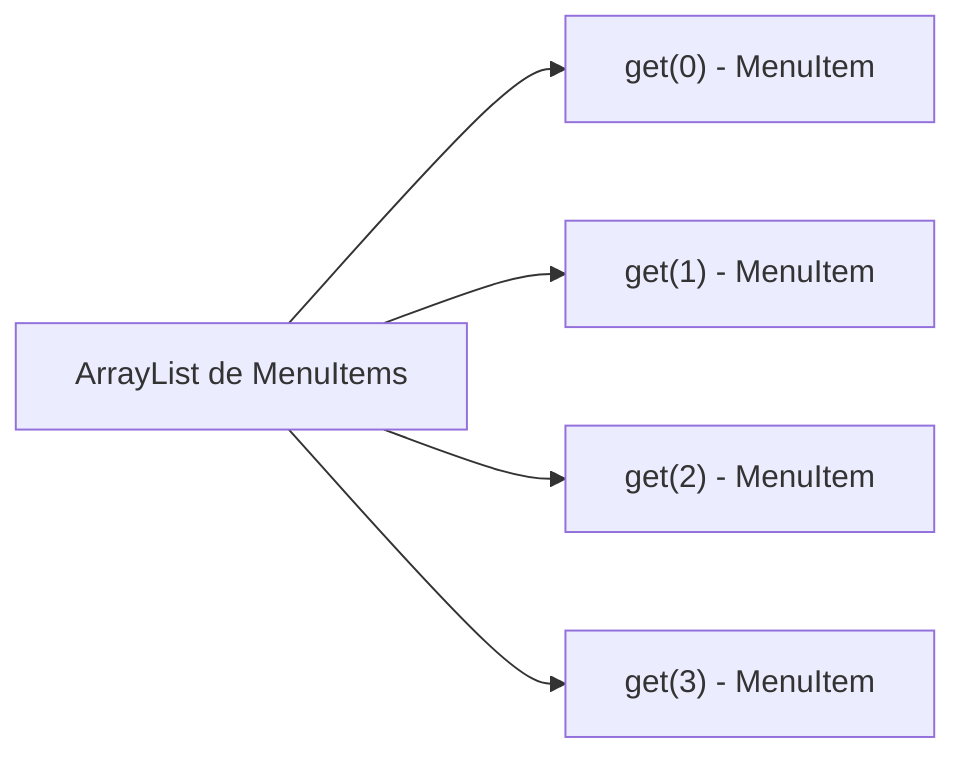

**2**

Y para iterar por los platos de comida usamos el campo `length` del array y la notación de subíndices sobre el `Array` de `MenuItem`:

```java
for (int i = 0; i < lunchItems.length; i++) {
    MenuItem menuItem = lunchItems[i];
}
```

!!! note "Notas marginales"

    - Usamos los subíndices del array para recorrer los elementos.

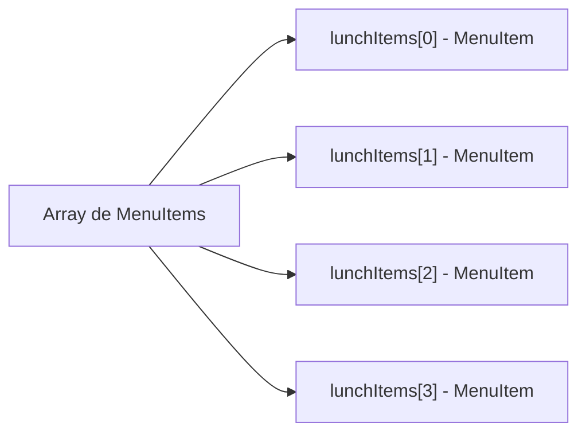

## Encapsulando la iteración

¿Y si creáramos un objeto, llamémosle `Iterator`, que encapsule la forma en que iteramos por una colección de objetos? Probémoslo con el `ArrayList`:

**3**

Le pedimos al `breakfastMenu` un iterador de sus `MenuItem`:

```java
Iterator iterator = breakfastMenu.createIterator();
while (iterator.hasNext()) {
    MenuItem menuItem = iterator.next();
}
```

!!! note "Notas marginales"

    - Mientras queden elementos pendientes... obtenemos el siguiente elemento.
    - El cliente simplemente llama a `hasNext()` y a `next()`; entre bastidores, el iterador llama a `get()` sobre el `ArrayList`.

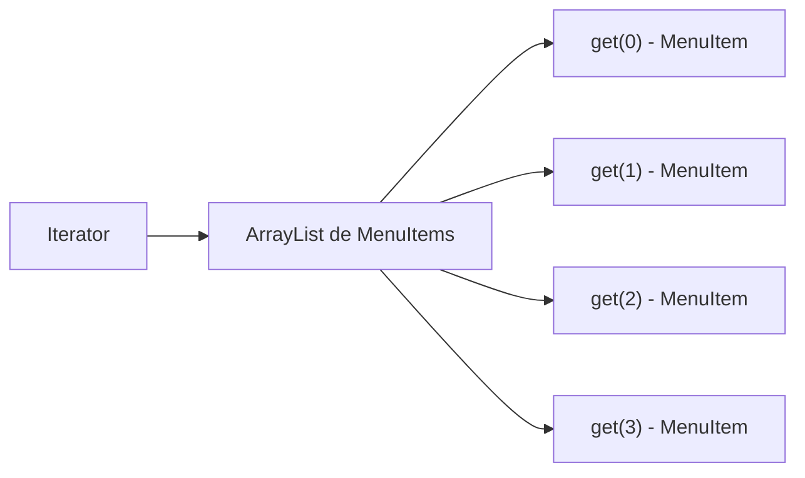

**4**

Probémoslo también con el `Array`:

```java
Iterator iterator = lunchMenu.createIterator();
while (iterator.hasNext()) {
    MenuItem menuItem = iterator.next();
}
```

!!! note "Notas marginales"

    - ¡Vaya! Este código es exactamente el mismo que el del `breakfastMenu`.
    - Aquí la situación es la misma: el cliente solo llama a `hasNext()` y a `next()`; entre bastidores, el iterador indexa el `Array`.

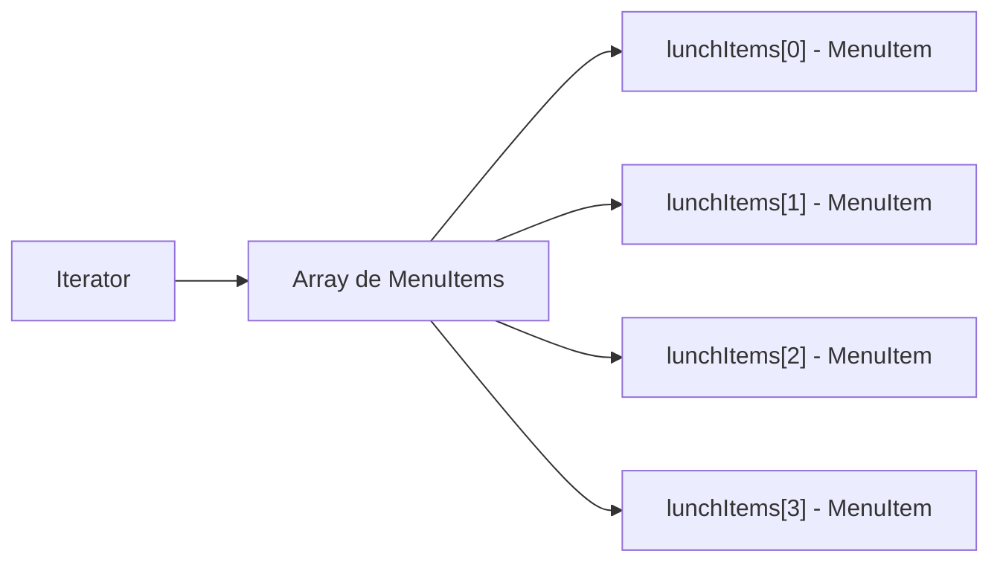

## Conoce el patrón Iterator

Bueno, parece que nuestro plan de encapsular la iteración podría funcionar de verdad; y como ya habrás adivinado, se trata de un patrón de diseño llamado patrón Iterator.

Lo primero que tienes que saber del patrón Iterator es que se apoya en una interfaz llamada `Iterator`. Aquí tienes una posible interfaz `Iterator`:

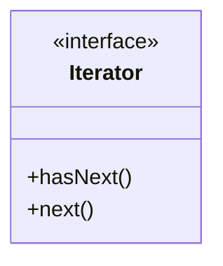

!!! note "Notas marginales"

    - El método `hasNext()` nos dice si quedan más elementos en el agregado que iterar.
    - El método `next()` devuelve el siguiente objeto del agregado.

Ahora, una vez que tenemos esta interfaz, podemos implementar `Iterator` para cualquier tipo de colección de objetos: arrays, listas, mapas hash... elige tu colección de objetos favorita. Digamos que quisiéramos implementar el `Iterator` para el `Array` que usa el `DinerMenu`. Sería así:

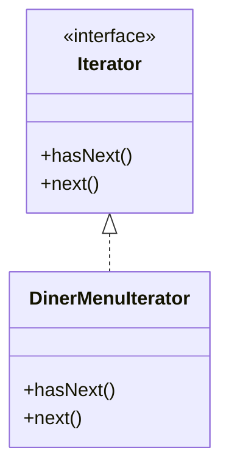

!!! note "Notas marginales"

    - Cuando decimos COLECCIÓN simplemente queremos decir un grupo de objetos. Pueden estar almacenados en estructuras de datos muy distintas como listas, arrays o mapas hash, pero siguen siendo colecciones. A veces también las llamamos AGREGADOS.
    - `DinerMenuIterator` es una implementación de `Iterator` que sabe cómo iterar sobre un array de `MenuItem`.

Vamos a implementar este `Iterator` e incorporarlo al `DinerMenu` para ver cómo funciona...

## Añadiendo un Iterator al DinerMenu

Para añadir un iterador al `DinerMenu`, primero tenemos que definir la interfaz `Iterator`:

```java
public interface Iterator {
    boolean hasNext();
    MenuItem next();
}
```

!!! note "Notas marginales"

    - Aquí están nuestros dos métodos: el método `hasNext()` devuelve un booleano que indica si quedan o no más elementos sobre los que iterar... y el método `next()` devuelve el siguiente elemento.

Y ahora necesitamos implementar un `Iterator` concreto que funcione para el menú del Diner:

```java
public class DinerMenuIterator implements Iterator {
    MenuItem[] items;
    int position = 0;
    public DinerMenuIterator(MenuItem[] items) {
        this.items = items;
    }
    public MenuItem next() {
        MenuItem menuItem = items[position];
        position = position + 1;
        return menuItem;
    }
    public boolean hasNext() {
        if (position >= items.length || items[position] == null) {
            return false;
        } else {
            return true;
        }
    }
}
```

!!! note "Notas marginales"

    - Implementamos la interfaz `Iterator`.
    - `position` mantiene la posición actual de la iteración sobre el array.
    - El constructor toma el array de elementos de menú sobre el que vamos a iterar.
    - El método `next()` devuelve el siguiente elemento del array e incrementa la posición.
    - El método `hasNext()` comprueba si hemos visto ya todos los elementos del array y devuelve `true` si queda algo más por iterar.
    - Como el cocinero del Diner reservó un array de tamaño máximo, no solo tenemos que comprobar si estamos al final del array, sino también si el siguiente elemento es `null`, lo que indica que ya no quedan más elementos.

## Rehaciendo el DinerMenu con Iterator

Vale, ya tenemos el iterador. Ahora toca integrarlo en el `DinerMenu`; lo único que tenemos que hacer es añadir un método que cree un `DinerMenuIterator` y lo devuelva al cliente:

```java
public class DinerMenu {
    static final int MAX_ITEMS = 6;
    int numberOfItems = 0;
    MenuItem[] menuItems;
    // constructor here
    // addItem here
    public MenuItem[] getMenuItems() {
        return menuItems;
    }
    public Iterator createIterator() {
        return new DinerMenuIterator(menuItems);
    }
    // other menu methods here
}
```

!!! note "Notas marginales"

    - Ya no necesitaremos el método `getMenuItems()`; de hecho, no lo queremos, ¡porque expone nuestra implementación interna!
    - Aquí está el método `createIterator()`. Crea un `DinerMenuIterator` a partir del array `menuItems` y lo devuelve al cliente.
    - Estamos devolviendo la interfaz `Iterator`. El cliente no necesita saber cómo se mantienen los `MenuItem` en el `DinerMenu`, ni necesita saber cómo está implementado el `DinerMenuIterator`. Solo necesita usar los iteradores para recorrer los elementos del menú.

!!! exercise "Te toca a ti"

    Adelante, implementa tú mismo el `PancakeHouseIterator` y haz los cambios necesarios para incorporarlo al `PancakeHouseMenu`.

## Arreglando el código de la Waitress

Ahora necesitamos integrar el código del iterador en la clase `Waitress`. Deberíamos poder eliminar parte de la redundancia en el proceso. La integración es bastante sencilla: primero creamos un método `printMenu()` que recibe un `Iterator`; luego usamos el método `createIterator()` de cada menú para recuperar el `Iterator` y se lo pasamos al método nuevo.

```java
public class Waitress {
    PancakeHouseMenu pancakeHouseMenu;
    DinerMenu dinerMenu;
    public Waitress(PancakeHouseMenu pancakeHouseMenu, DinerMenu dinerMenu) {
        this.pancakeHouseMenu = pancakeHouseMenu;
        this.dinerMenu = dinerMenu;
    }
    public void printMenu() {
        Iterator pancakeIterator = pancakeHouseMenu.createIterator();
        Iterator dinerIterator = dinerMenu.createIterator();
        System.out.println("MENU\n----\nBREAKFAST");
        printMenu(pancakeIterator);
        System.out.println("\nLUNCH");
        printMenu(dinerIterator);
    }
    private void printMenu(Iterator iterator) {
        while (iterator.hasNext()) {
            MenuItem menuItem = iterator.next();
            System.out.print(menuItem.getName() + ", ");
            System.out.print(menuItem.getPrice() + " -- ");
            System.out.println(menuItem.getDescription());
        }
    }
    // other methods here
}
```

!!! note "Notas marginales"

    - Nuevo y mejorado con `Iterator`.
    - En el constructor, la clase `Waitress` toma los dos menús.
    - El método `printMenu()` ahora crea dos iteradores, uno para cada menú... y luego llama al `printMenu()` sobrecargado con cada iterador.
    - El `printMenu()` sobrecargado comprueba si queda algún elemento más, obtiene el siguiente elemento, y usa el `Iterator` para recorrer los elementos del menú e imprimirlos.
    - Usa el elemento para obtener el nombre, el precio y la descripción e imprimirlos.
    - ¡Fíjate en que hemos pasado a tener un solo bucle!

## Probando nuestro código

Ha llegado el momento de ponerlo todo a prueba. Escribamos un poco de código de prueba y veamos cómo funciona la `Waitress`...

!!! note "Notas marginales"

    - Primero creamos los nuevos menús.
    - Luego creamos una `Waitress` y le pasamos los menús.
    - Luego los imprimimos.

```java
public class MenuTestDrive {
    public static void main(String args[]) {
        PancakeHouseMenu pancakeHouseMenu = new PancakeHouseMenu();
        DinerMenu dinerMenu = new DinerMenu();
        Waitress waitress = new Waitress(pancakeHouseMenu, dinerMenu);
        waitress.printMenu();
    }
}
```

Aquí está la ejecución de la prueba...

```text
% java DinerMenuTestDrive
MENU
----
BREAKFAST
K&B's Pancake Breakfast, 2.99 -- Pancakes with scrambled eggs and toast
Regular Pancake Breakfast, 2.99 -- Pancakes with fried eggs, sausage
Blueberry Pancakes, 3.49 -- Pancakes made with fresh blueberries
Waffles, 3.59 -- Waffles with your choice of blueberries or strawberries
LUNCH
Vegetarian BLT, 2.99 -- (Fakin') Bacon with lettuce & tomato on whole wheat
BLT, 2.99 -- Bacon with lettuce & tomato on whole wheat
Soup of the day, 3.29 -- Soup of the day, with a side of potato salad
Hot Dog, 3.05 -- A hot dog, with sauerkraut, relish, onions, topped with cheese
Steamed Veggies and Brown Rice, 3.99 -- Steamed vegetables over brown rice
Pasta, 3.89 -- Spaghetti with marinara sauce, and a slice of sourdough bread
%
```

!!! note "Notas marginales"

    - Primero iteramos por el menú de panqueques... y después por el menú de comida, todo con el mismo código de iteración.

## ¿Qué hemos hecho hasta ahora?

Para empezar, hemos vuelto muy felices a los cocineros de Objectville. Resolvieron sus diferencias y conservaron sus propias implementaciones. Una vez que les dimos un `PancakeHouseMenuIterator` y un `DinerMenuIterator`, todo lo que tuvieron que hacer fue añadir un método `createIterator()` y quedaron listos.

También nos hemos ayudado a nosotros mismos en el proceso. La `Waitress` será mucho más fácil de mantener y de extender en el futuro. Vamos a repasar exactamente lo que hicimos y a pensar en las consecuencias:

**Mel:** ¡Yupi! Ningún cambio de código aparte de añadir el método `createIterator()`.

!!! note "Nota marginal"

    ¡Una hamburguesa de soja!

| Implementación difícil de mantener de la Waitress | Waitress impulsada por el patrón Iterator |
| --- | --- |
| Los menús no están bien encapsulados; se ve que el Diner usa un `ArrayList` y el Pancake House un `Array`. | Las implementaciones de los menús están encapsuladas. La `Waitress` no tiene ni idea de cómo guardan los menús su colección de elementos de menú. |
| Necesitamos dos bucles para iterar por los `MenuItem`. | Solo necesitamos un bucle que gestione polimórficamente cualquier colección de elementos, siempre que implemente `Iterator`. |
| La `Waitress` está atada a clases concretas (`MenuItem[]` y `ArrayList`). | La `Waitress` ahora usa una interfaz (`Iterator`). |
| La `Waitress` está atada a dos clases `Menu` concretas distintas, a pesar de que sus interfaces son casi idénticas. | Las interfaces de `Menu` son ahora exactamente iguales y, ay, ay, todavía no tenemos una interfaz común, lo que significa que la `Waitress` sigue atada a dos clases `Menu` concretas. Mejor arreglar eso. |

## Revisando nuestro diseño actual...

Antes de limpiar las cosas, echemos una mirada de conjunto a nuestro diseño actual.

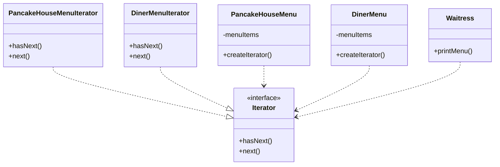

!!! note "Notas marginales"

    - El `Iterator` permite desacoplar la `Waitress` de la implementación real de las clases concretas. No necesita saber si un `Menu` está implementado con un `Array`, un `ArrayList` o con notas adhesivas (Post-it). Todo lo que le importa es que puede obtener un `Iterator` para hacer su iteración.
    - Estos dos menús implementan exactamente el mismo conjunto de métodos, pero no implementan la misma interfaz. Lo vamos a arreglar, y así liberamos a la `Waitress` de cualquier dependencia de `Menu` concreto.
    - `PancakeHouseMenu` y `DinerMenu` implementan el nuevo método `createIterator()`; son responsables de crear el iterador para sus respectivos elementos de menú.
    - Fíjate en que el iterador nos da una forma de recorrer los elementos de un agregado sin obligar al agregado a ensuciar su propia interfaz con un montón de métodos para soportar el recorrido de sus elementos. También permite que la implementación del iterador viva fuera del agregado; en otras palabras, hemos encapsulado la iteración.

## Haciendo algunas mejoras...

Vale, ya sabemos que las interfaces de `PancakeHouseMenu` y `DinerMenu` son exactamente iguales y, sin embargo, todavía no hemos definido una interfaz común para ellas. Así que vamos a hacerlo y a dejar la `Waitress` un poco más limpia.

Puede que te preguntes por qué no estamos usando la interfaz `Iterator` de Java: lo hicimos para que pudieras ver cómo construir un iterador desde cero. Ahora que ya lo hemos hecho, vamos a pasar a usar la interfaz `Iterator` de Java, porque obtendremos mucha ventaja al implementarla en lugar de nuestra interfaz `Iterator` casera. ¿Qué clase de ventaja? Ya lo verás enseguida.

Primero, echemos un vistazo a la interfaz `java.util.Iterator`:

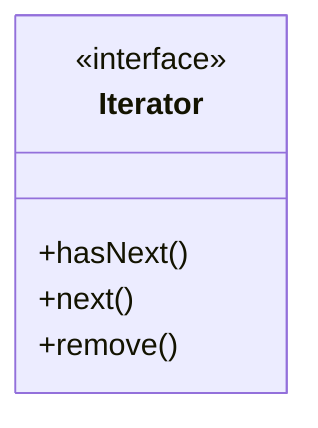

!!! note "Notas marginales"

    - Esto se parece exactamente a nuestra definición anterior... salvo que tenemos un método adicional que nos permite eliminar del agregado el último elemento devuelto por el método `next()`.

Esto va a ser pan comido: solo tenemos que cambiar la interfaz que extienden `PancakeHouseMenuIterator` y `DinerMenuIterator`, ¿verdad? Casi... en realidad, es todavía más fácil. No solo `java.util` tiene su propia interfaz `Iterator`, sino que `ArrayList` tiene un método `iterator()` que devuelve un iterador. En otras palabras, nunca necesitamos implementar nuestro propio iterador para `ArrayList`. Aun así, sí necesitaremos nuestra implementación para el `DinerMenu`, porque se apoya en un `Array`, que no soporta el método `iterator()`.

!!! question "Preguntas frecuentes"

    **P: ¿Y si no quiero ofrecer la posibilidad de eliminar algo de la colección de objetos subyacente?**

    R: Se considera que el método `remove()` es opcional. No tienes que ofrecer funcionalidad de eliminación. Pero deberías ofrecer el método porque forma parte de la interfaz `Iterator`. Si no vas a permitir `remove()` en tu iterador, lanza la excepción en tiempo de ejecución `java.lang.UnsupportedOperationException`. La documentación de la API de `Iterator` especifica que esta excepción puede lanzarse desde `remove()`, y cualquier cliente que sea buen ciudadano comprobará si aparece esta excepción al llamar al método `remove()`.

    **P: ¿Cómo se comporta `remove()` con varios hilos que puedan estar usando iteradores distintos sobre la misma colección de objetos?**

    R: El comportamiento del método `remove()` no está especificado si la colección cambia mientras estás iterando sobre ella. Así que debes tener cuidado al diseñar tu propio código multihilo cuando accedas a una colección de forma concurrente.

## Limpiando las cosas con java.util.Iterator

Empecemos por el `PancakeHouseMenu`. Pasarlo a `java.util.Iterator` va a ser fácil. Simplemente borramos la clase `PancakeHouseMenuIterator`, añadimos un `import java.util.Iterator` en la parte superior de `PancakeHouseMenu` y cambiamos una línea de `PancakeHouseMenu`:

```java
public Iterator<MenuItem> createIterator() {
    return menuItems.iterator();
}
```

!!! note "Nota marginal"

    En lugar de crear nuestro propio iterador ahora, simplemente llamamos al método `iterator()` sobre el `ArrayList` `menuItems` (más sobre esto en un momento).

Y ya está, `PancakeHouseMenu` está terminado. Ahora necesitamos hacer los cambios para que `DinerMenu` funcione con `java.util.Iterator`.

!!! note "Nota marginal"

    Primero importamos `java.util.Iterator`, la interfaz que vamos a implementar.

```java
import java.util.Iterator;

public class DinerMenuIterator implements Iterator<MenuItem> {
    MenuItem[] items;
    int position = 0;
    public DinerMenuIterator(MenuItem[] items) {
        this.items = items;
    }
    public MenuItem next() {
        //implementation here
    }
    public boolean hasNext() {
        //implementation here
    }
    public void remove() {
        throw new UnsupportedOperationException
                    ("You shouldn't be trying to remove menu items.");
    }
}
```

!!! note "Notas marginales"

    - Ninguno de los métodos que tenemos ahora cambia...
    - ...pero recuerda, el método `remove()` es opcional en la interfaz `Iterator`. Que nuestra camarera quite elementos del menú no tiene mucho sentido, así que simplemente lanzaremos una excepción si lo intenta.

## Casi estamos...

Ahora solo necesitamos darle a los menús una interfaz común y retocar un poco la `Waitress`. La interfaz `Menu` es bastante sencilla: quizá queramos añadirle algún método más en el futuro, como `addItem()`, pero por ahora vamos a dejar que los cocineros controlen sus menús manteniendo ese método fuera de la interfaz pública:

```java
public interface Menu {
    public Iterator<MenuItem> createIterator();
}
```

!!! note "Nota marginal"

    Esta es una interfaz sencilla que simplemente permite a los clientes obtener un iterador de los elementos del menú.

Ahora tenemos que añadir `implements Menu` tanto a la definición de la clase `PancakeHouseMenu` como a la de `DinerMenu`, y actualizar la clase `Waitress`:

```java
import java.util.Iterator;

public class Waitress {
    Menu pancakeHouseMenu;
    Menu dinerMenu;
    public Waitress(Menu pancakeHouseMenu, Menu dinerMenu) {
        this.pancakeHouseMenu = pancakeHouseMenu;
        this.dinerMenu = dinerMenu;
    }
    public void printMenu() {
        Iterator<MenuItem> pancakeIterator = pancakeHouseMenu.createIterator();
        Iterator<MenuItem> dinerIterator = dinerMenu.createIterator();
        System.out.println("MENU\n----\nBREAKFAST");
        printMenu(pancakeIterator);
        System.out.println("\nLUNCH");
        printMenu(dinerIterator);
    }
    private void printMenu(Iterator iterator) {
        while (iterator.hasNext()) {
            MenuItem menuItem = iterator.next();
            System.out.print(menuItem.getName() + ", ");
            System.out.print(menuItem.getPrice() + " -- ");
            System.out.println(menuItem.getDescription());
        }
    }
    // other methods here
}
```

!!! note "Notas marginales"

    - Ahora la `Waitress` también usa `java.util.Iterator`.
    - Tenemos que sustituir las clases `Menu` concretas por la interfaz `Menu`.
    - Aquí no cambia nada.

## ¿Qué nos aporta esto?

Las clases `PancakeHouseMenu` y `DinerMenu` implementan una interfaz, `Menu`. Esto permite que la `Waitress` se refiera a cada objeto de menú usando la interfaz en lugar de la clase concreta. Así que estamos reduciendo la dependencia entre la `Waitress` y las clases concretas «programando a una interfaz, no a una implementación».

Además, la nueva interfaz `Menu` tiene un método, `createIterator()`, que implementan `PancakeHouseMenu` y `DinerMenu`. Cada clase de menú asume la responsabilidad de crear un `Iterator` concreto que sea apropiado para su implementación interna de los elementos del menú.

!!! note "Notas marginales"

    - Aquí está nuestra nueva interfaz `Menu`. Especifica el nuevo método `createIterator()`.
    - Esto resuelve el problema de la `Waitress` dependiendo de los `Menu` concretos.
    - Hemos desacoplado `Waitress` de la implementación de los menús, así que ahora solo necesitamos preocuparnos por los `Menu` y los `Iterators`.

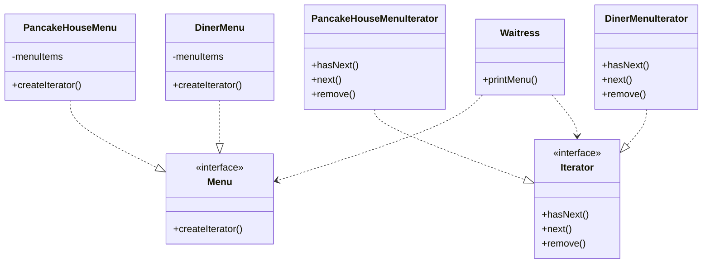

!!! note "Notas marginales"

    - `PancakeHouseMenu` y `DinerMenu` implementan ahora la interfaz `Menu`, lo que significa que necesitan implementar el nuevo método `createIterator()`.
    - `DinerMenu` devuelve un `DinerMenuIterator` a partir de su array de elementos de menú.
    - Estamos usando ahora el iterador de `ArrayList` que proporciona `java.util`. Ya no necesitamos `PancakeHouseMenuIterator`.
    - Cada `Menu` concreto es responsable de crear la clase `Iterator` concreta apropiada.

## Patrón Iterator definido

Ya has visto cómo implementar el patrón Iterator con tu propio iterador. También has visto cómo Java soporta los iteradores en algunas de sus clases orientadas a colecciones (`ArrayList`). Ahora es el momento de ver la definición oficial del patrón:

!!! abstract "Definición"

    El patrón Iterator proporciona una forma de acceder a los elementos de un objeto agregado secuencialmente sin exponer su representación subyacente.

!!! tip "Nota marginal"

    También coloca la tarea de recorrido en el objeto iterador, y no en el agregado, lo que simplifica la interfaz y la implementación del agregado, y deja la responsabilidad donde debe estar.

Esto tiene mucho sentido: el patrón te da una manera de recorrer los elementos de un agregado sin tener que saber cómo están representados por debajo. Lo has visto con las dos implementaciones de los menús. Pero el efecto de usar iteradores en tu diseño es igual de importante: una vez que tienes una forma uniforme de acceder a los elementos de todos tus objetos agregados, puedes escribir código polimórfico que funcione con cualquiera de esos agregados, igual que el método `printMenu()`, al que no le importa si los elementos del menú están guardados en un `Array` o en un `ArrayList` (o en cualquier otra cosa que pueda crear un `Iterator`), siempre que pueda conseguir un `Iterator`.

El otro impacto importante en tu diseño es que el patrón Iterator se queda con la responsabilidad de recorrer los elementos y le pasa esa responsabilidad al objeto iterador, no al objeto agregado. Esto no solo mantiene más sencilla la interfaz y la implementación del agregado, sino que además quita la responsabilidad de la iteración al agregado y mantiene al agregado centrado en aquello en lo que debe estar centrado (gestionar una colección de objetos), y no en la iteración.

## La estructura del patrón Iterator

Echemos un vistazo al diagrama de clases para poner todas las piezas en contexto...

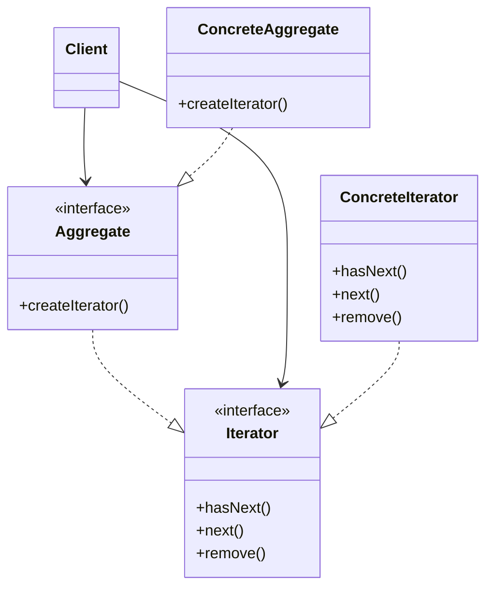

!!! note "La interfaz `Iterator`"
    La interfaz `Iterator` proporciona la interfaz que todos los iteradores deben implementar, y un conjunto de métodos para recorrer los elementos de una colección.

!!! note "La interfaz `Aggregate`"
    Tener una interfaz común para tus agregados resulta práctico para tu cliente: desacopla a tu cliente de la implementación de tu colección de objetos.

!!! note "Aquí estamos usando `java.util.Iterator`"
    Si no quieres usar la interfaz `Iterator` de Java, siempre puedes crear la tuya propia.

!!! note "El `ConcreteAggregate`"
    El `ConcreteAggregate` tiene una colección de objetos e implementa el método que devuelve un `Iterator` para su colección.

!!! note "El `ConcreteIterator`"
    El `ConcreteIterator` es responsable de gestionar la posición actual de la iteración. Cada `ConcreteAggregate` es responsable de instanciar un `ConcreteIterator` que pueda iterar sobre su colección de objetos.

!!! exercise "Piensa en esto"
    El diagrama de clases del patrón Iterator se parece mucho a otro patrón que ya has estudiado; ¿se te ocurre cuál es? Pista: una subclase decide qué objeto crear.

## El principio de responsabilidad única

!!! note "Nota marginal"
    Cada responsabilidad de una clase es un área de cambio potencial. Más de una responsabilidad significa más de un área de cambio.

¿Y qué pasa si dejamos que nuestros agregados implementen tanto sus colecciones internas y operaciones relacionadas como los métodos de iteración? Bueno, ya sabemos que eso aumentaría el número de métodos del agregado, ¿y qué? ¿Por qué es tan malo? Pues bien, para ver por qué, primero tienes que reconocer que cuando permitimos que una clase no solo se ocupe de sus propios asuntos (gestionar algún tipo de agregado) sino que además asuma más responsabilidades (como la iteración), le hemos dado a la clase dos motivos para cambiar. ¿Dos? Sí, dos: puede cambiar si la colección cambia de alguna manera, y puede cambiar si cambia la forma en que iteramos. Así que una vez más nuestro amigo el CAMBIO está en el centro de otro principio de diseño:

!!! abstract "Principio de diseño"
    Una clase debe tener una única responsabilidad.

Sabemos que queremos evitar el cambio en nuestras clases porque modificar código ofrece toda clase de oportunidades para que se colen problemas. Tener dos formas de cambiar aumenta la probabilidad de que la clase cambie en el futuro, y cuando lo haga, afectará a dos aspectos de tu diseño. ¿La solución? El principio nos guía para asignar cada responsabilidad a una clase, y solo a una clase. Correcto, es así de fácil, aunque tampoco es que sea tan fácil: separar responsabilidades en el diseño es una de las cosas más difíciles de hacer. Nuestros cerebros son sencillamente demasiado buenos viendo un conjunto de comportamientos y agrupándolos juntos, incluso cuando en realidad hay dos o más responsabilidades. La única forma de tener éxito es ser diligentes al examinar tus diseños y estar atentos a las señales de que una clase está cambiando de más de una manera a medida que tu sistema crece.

!!! abstract "OO Glue"
    **Cohesión** es un término que oirás usar como medida de lo cerca que una clase o un módulo soporta un único propósito o responsabilidad.

    Decimos que un módulo o una clase tiene una cohesión alta cuando está diseñado en torno a un conjunto de funciones relacionadas, y decimos que tiene una cohesión baja cuando está diseñado en torno a un conjunto de funciones no relacionadas.

    La cohesión es un concepto más general que el principio de responsabilidad única, pero los dos están estrechamente relacionados.

    Las clases que se adhieren al principio tienden a tener una cohesión alta y son más mantenibles que las clases que asumen múltiples responsabilidades y tienen una cohesión baja.

### Tu turno

!!! exercise "Ejercicio de responsabilidad única"
    Examina estas clases y determina cuáles tienen múltiples responsabilidades.

    ```mermaid
    classDiagram
        class Game {
            +login()
            +signup()
            +move()
            +fire()
            +rest()
        }
        class DeckOfCards {
            +hasNext()
            +next()
            +remove()
            +addCard()
            +removeCard()
            +shuffle()
        }
        class Person {
            +setName()
            +setAddress()
            +setPhoneNumber()
            +save()
            +load()
        }
        class ShoppingCart {
            +add()
            +remove()
            +checkOut()
            +saveForLater()
        }
        class Phone {
            +dial()
            +hangUp()
            +talk()
            +sendData()
            +flash()
        }
        class GumballMachine {
            +getCount()
            +getState()
            +getLocation()
        }
        class Iterator {
            <<interface>>
            +hasNext()
            +next()
            +remove()
        }
    ```

!!! exercise "Ejercicio de cohesión"
    Determina si estas clases tienen una cohesión baja o alta.

    ```mermaid
    classDiagram
        class Game {
            +login()
            +signup()
            +move()
            +fire()
            +rest()
            +getHighScore()
            +getName()
        }
        class GameSession {
            +login()
            +signup()
        }
        class PlayerActions {
            +move()
            +fire()
            +rest()
        }
        class Player {
            +getHighScore()
            +getName()
        }
    ```

!!! warning "Zona de casco duro"
    Cuidado con las suposiciones que se caen.

## Preguntas sin tonterías

!!! question "¿Por qué son diferentes estos métodos?"
    **Pregunta:** He visto que otros libros muestran el diagrama de clases del Iterator con los métodos `first()`, `next()`, `isDone()` y `currentItem()`. ¿Por qué son diferentes estos métodos?

    **Respuesta:** Esos son los nombres de métodos «clásicos» que se han usado. Estos nombres han cambiado con el tiempo y ahora tenemos `next()`, `hasNext()`, e incluso `remove()` en `java.util.Iterator`. Echemos un vistazo a los métodos clásicos. El `next()` y el `currentItem()` se han fusionado en un solo método en `java.util`. El método `isDone()` se ha convertido en `hasNext()`, pero no tenemos ningún método que corresponda a `first()`. Eso es porque en Java tendemos a obtener simplemente un iterador nuevo cada vez que necesitamos empezar el recorrido. Sin embargo, puedes ver que hay muy poca diferencia entre estas interfaces. De hecho, hay todo un abanico de comportamientos que puedes darle a tus iteradores. El método `remove()` es un ejemplo de una extensión en `java.util.Iterator`.

!!! question "Si uso Java, ¿no usaré siempre `java.util.Iterator`?"
    **Pregunta:** Si estoy usando Java, ¿no querré siempre usar la interfaz `java.util.Iterator` para poder usar mis propias implementaciones de iterador con clases que ya están usando los iteradores de Java?

    **Respuesta:** Probablemente. Si tienes una interfaz `Iterator` común, seguro que te hará más fácil mezclar y combinar tus propios agregados con agregados de Java como `ArrayList` y `Vector`. Pero recuerda, si necesitas añadir funcionalidad a tu interfaz `Iterator` para tus agregados, siempre puedes extender la interfaz `Iterator`.

!!! question "¿Puedo implementar un Iterator que retroceda?"
    **Pregunta:** ¿Podría implementar un `Iterator` que pueda ir hacia atrás además de hacia adelante?

    **Respuesta:** Definitivamente. En ese caso, probablemente querrás añadir dos métodos, uno para ir al elemento anterior, y otro para decirte cuándo estás al principio de la colección de elementos. El Java Collections Framework proporciona otro tipo de interfaz de iterador llamada `ListIterator`. Este iterador añade `previous()` y otros cuantos métodos a la interfaz `Iterator` estándar. Lo admite cualquier `Collection` que implemente la interfaz `List`.

!!! question "¿`Enumeration` implementa el patrón Iterator?"
    **Pregunta:** He visto una interfaz `Enumeration` en Java; ¿implementa el patrón Iterator?

    **Respuesta:** Hablamos de esto en el capítulo del patrón Adapter (Capítulo 7). ¿Te acuerdas? `java.util.Enumeration` es una implementación más antigua de `Iterator` que desde entonces ha sido reemplazada por `java.util.Iterator`. `Enumeration` tiene dos métodos, `hasMoreElements()`, que corresponde a `hasNext()`, y `nextElement()`, que corresponde a `next()`. Sin embargo, probablemente querrás usar `Iterator` en lugar de `Enumeration`, ya que más clases de Java lo admiten. Si necesitas convertir de uno a otro, revisa de nuevo el Capítulo 7, donde implementaste el adapter para `Enumeration` e `Iterator`.

!!! question "¿Quién define el orden de iteración?"
    **Pregunta:** ¿Quién define el orden de la iteración en una colección como `Hashtable`, que es inherentemente no ordenada?

    **Respuesta:** Los iteradores no implican ningún orden. Las colecciones subyacentes pueden no estar ordenadas, como en una tabla hash o en un saco; incluso pueden contener duplicados. Así que el orden está relacionado tanto con las propiedades de la colección subyacente como con la implementación. En general, no deberías hacer ninguna suposición sobre el orden a menos que la documentación de la `Collection` indique lo contrario.

!!! question "Iteradores «internos» y «externos»"
    **Pregunta:** He oído hablar de iteradores «internos» y «externos». ¿Qué son? ¿De qué tipo implementamos en el ejemplo?

    **Respuesta:** Implementamos un iterador externo, lo que significa que el cliente controla la iteración llamando a `next()` para obtener el siguiente elemento. Un iterador interno está controlado por el propio iterador. En ese caso, como es el iterador quien va recorriendo los elementos, tienes que decirle al iterador qué hacer con esos elementos según los va atravesando. Eso significa que necesitas una forma de pasarle una operación a un iterador. Los iteradores internos son menos flexibles que los iteradores externos porque el cliente no tiene el control de la iteración. Sin embargo, algunos podrían argumentar que son más fáciles de usar porque simplemente les pasas una operación y les dices que iteren, y ellos hacen todo el trabajo por ti.

!!! question "Iteración polimórfica"
    **Pregunta:** Has dicho que podemos escribir «código polimórfico» usando un iterador; ¿me lo puedes explicar mejor?

    **Respuesta:** Cuando escribimos métodos que aceptan `Iterator` como parámetros, estamos usando iteración polimórfica. Eso significa que estamos creando código que puede iterar sobre cualquier colección siempre que admita `Iterator`. No nos importa cómo esté implementada la colección; podemos escribir código que itere sobre ella igualmente.

!!! question "El bucle for mejorado de Java"
    **Pregunta:** ¿Usar el bucle `for` mejorado de Java tiene algo que ver con los iteradores?

    **Respuesta:** ¡Buena pregunta! Sí, y para afrontar esa pregunta necesitamos entender otra interfaz: la interfaz `Iterable` de Java. Este es un buen momento para hacer exactamente eso...

## Conoce la interfaz `Iterable` de Java

Ya dominas la interfaz `Iterator` de Java, pero hay otra interfaz que necesitas conocer: `Iterable`. La interfaz `Iterable` la implementa todos los tipos `Collection` de Java. ¿Adivina qué? En tu código que usa el `ArrayList`, ya has estado usando esta interfaz. Echemos un vistazo a la interfaz `Iterable`:

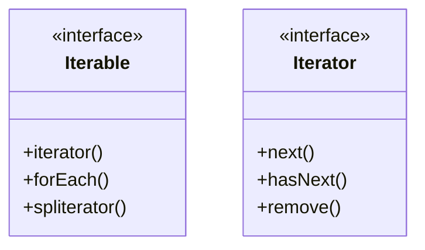

!!! note "Aquí está la interfaz `Iterable`"

!!! note "El método `iterator()`"
    La interfaz `Iterable` incluye un método `iterator()` que devuelve un iterador que implementa la interfaz `Iterator`.

!!! note "La interfaz `Iterator`"
    Ya conoces la interfaz `Iterator`; es la misma interfaz que hemos estado usando con nuestros iteradores del Diner y de la Pancake House.

!!! note "Las clases `Collection`"
    Todas las clases `Collection`, como `ArrayList`, implementan la interfaz `Collection`, que hereda de la interfaz `Iterable`, así que todas las clases `Collection` son `Iterable`.

!!! note "El método `spliterator()`"
    La interfaz `Iterable` también incluye el método `spliterator()`, que ofrece formas aún más avanzadas de recorrer una colección.

## El bucle `for` mejorado de Java

Tomemos un objeto cuya clase implemente la interfaz `Iterable`... ¿por qué no la colección `ArrayList` que usamos para los elementos del menú de la Pancake House?

```java
List<MenuItem> menuItems = new ArrayList<MenuItem>();
```

Podemos iterar sobre el `ArrayList` de la manera que venimos:

```java
Iterator iterator = menu.iterator();
while (iterator.hasNext()) {
    MenuItem menuItem = iterator.next();
    System.out.print(menuItem.getName() + ", ");
    System.out.print(menuItem.getPrice() + " -- ");
    System.out.println(menuItem.getDescription());
}
```

!!! note "Esta es la forma en que hemos estado iterando"
    Esta es la forma en la que hemos estado haciendo iteración sobre nuestras colecciones, usando un iterador junto con los métodos `hasNext()` y `next()`.

O bien, dado que sabemos que el `ArrayList` es un `Iterable`, podríamos usar la forma abreviada del `for` mejorado de Java:

```java
for (MenuItem item: menu) {
    System.out.print(menuItem.getName() + ", ");
    System.out.print(menuItem.getPrice() + " -- ");
    System.out.println(menuItem.getDescription());
}
```

!!! note "Aquí podemos prescindir del iterador explícito"
    Aquí podemos prescindir del iterador explícito, así como de los métodos `hasNext()` y `next()`.

!!! note "Parece una gran manera de usar los Iterators"
    Parece una gran manera de usar los iteradores que de verdad produce un código simple: se acaban las llamadas a los métodos `hasNext()` o `next()`. Así que, ¿podremos reestructurar nuestro código de la `Waitress` para usar `Iterable` y el `for` mejorado en ambos menús?

## No tan rápido; los Arrays no son Iterables

Tenemos malas noticias: puede que el Diner no haya tomado la mejor decisión al usar un `Array` como base para sus menús. Como resulta, los Arrays no son `Collection` de Java y por tanto no implementan la interfaz `Iterable`. Dado eso, no podemos consolidar tan fácilmente nuestro código de la `Waitress` en un solo método que acepte un `Iterable` y usarlo tanto con los `breakfastItems` de la Pancake House como con los `lunchItems` del Diner. Si intentas cambiar el método `printMenu()` de la `Waitress` para que acepte un `Iterable` en lugar de un `Iterator`, y usar el bucle for-each en lugar de la API del `Iterator`, así:

```java
public void printMenu(Iterable<MenuItem> iterable) {
    for (MenuItem menuItem : iterable) {
        // print menuItem
    }
}
```

!!! note "Esto solo funcionará con el `ArrayList`"
    Esto solo funcionará con el `ArrayList` que estamos usando para el menú de la Pancake House.

...obtendrás un error de compilación cuando intentes pasar el array `lunchItems` a `printMenu()`:

```java
printMenu(lunchItems);
```

!!! note "¡Error de compilación!"
    ¡Los Arrays no son Iterables!

porque, de nuevo, los Arrays no implementan la interfaz `Iterable`. Si mantienes ambos bucles en el código de la `Waitress`, volvemos a empezar: la `Waitress` vuelve a depender de los tipos de agregado que usamos para almacenar los menús, y además tiene código duplicado: un bucle para el `ArrayList` y otro bucle para el `Array`. Entonces, ¿qué hacemos? Pues bien, hay muchas maneras de resolver este problema, pero son un poco secundarias, como lo sería reestructurar nuestro código. Después de todo, este capítulo va del patrón Iterator, no de la interfaz `Iterable` de Java. Pero la buena noticia es que conoces `Iterable`, conoces su relación con la interfaz `Iterator` de Java y con el patrón Iterator. Así que, sigamos avanzando, ya que tenemos una implementación excelente aunque no-nosbeneficiemos de un poco de azúcar sintáctico del bucle `for` de Java.

Probablemente hayas visto el método `forEach()` en el menú de `Iterable`. Se usa como base del `for` mejorado de Java, pero también puedes usarlo directamente con los `Iterable`. Así funciona:

```java
breakfastItems.forEach(item -> System.out.println(item));
```

!!! note "Aquí hay un `Iterable`"
    Aquí hay un `Iterable`, en este caso nuestro `ArrayList` de elementos de menú de la Pancake House. Estamos llamando a `forEach()`... y le pasamos una lambda que toma un `menuItem` y simplemente lo imprime. Así que este código imprimirá todos los elementos de la colección.

## Una nueva adquisición

!!! note "Una nueva adquisición"
    Menos mal que estás aprendiendo el patrón Iterator, porque acabo de oír que Objectville Mergers and Acquisitions ha cerrado otro trato... nos vamos a fusionar con Objectville Café y a adoptar su menú de cena.

    Vaya, y ya creíamos que las cosas estaban complicadas. Ahora, ¿qué vamos a hacer?

    Venga, piénsalo de forma positiva. Estoy seguro de que podemos encontrar una manera de integrarlos en el patrón Iterator.

## Un vistazo al menú del café

Aquí está el menú del café. No parece que sea muy difícil integrar la clase `CafeMenu` en nuestro marco de trabajo... echémosle un vistazo.

```java
public class CafeMenu {
    Map<String, MenuItem> menuItems = new HashMap<String, MenuItem>();
    public CafeMenu() {
        addItem("Veggie Burger and Air Fries",
            "Veggie burger on a whole wheat bun, lettuce, tomato, and fries",
            true, 3.99);
        addItem("Soup of the day",
            "A cup of the soup of the day, with a side salad",
            false, 3.69);
        addItem("Burrito",
            "A large burrito, with whole pinto beans, salsa, guacamole",
            true, 4.29);
    }
    public void addItem(String name, String description, 
                        boolean vegetarian, double price) 
    {
        MenuItem menuItem = new MenuItem(name, description, vegetarian, price);
        menuItems.put(name, menuItem);
    }
    public Map<String, MenuItem> getMenuItems() {
        return menuItems;
    }
}
```

!!! note "`CafeMenu` no implementa nuestra nueva interfaz `Menu`"
    Pero esto se arregla fácilmente.

!!! note "El café guarda sus elementos de menú en un `HashMap`"
    ¿Admite eso un `Iterator`? Lo veremos en breve...

!!! note "Como los otros Menus"
    Los elementos de menú se inicializan en el constructor.

!!! note "Aquí creamos un nuevo `MenuItem`"
    Y lo añadimos al `HashMap` de `menuItems`.

!!! note "El valor es el objeto `menuItem`"

!!! note "La clave es el nombre del elemento"

!!! note "Ya no necesitaremos esto"

!!! exercise "Antes de pasar página"
    Antes de mirar la página siguiente, anota rápidamente las tres cosas que tenemos que hacerle a este código para encajarlo en nuestro marco de trabajo:

    1.
    2.
    3.

## Rehaciendo el código del menú del café

Rehagamos el código de `CafeMenu`. Vamos a ocuparnos de implementar la interfaz `Menu`, y también necesitamos resolver cómo crear un `Iterator` para los valores almacenados en el `HashMap`. Las cosas son un poco diferentes que cuando hicimos lo mismo con el `ArrayList`; échale un vistazo...

```java
public class CafeMenu implements Menu {
    Map<String, MenuItem> menuItems = new HashMap<String, MenuItem>();
    public CafeMenu() {
        // constructor code here
    }
    public void addItem(String name, String description, 
                        boolean vegetarian, double price) 
    {
        MenuItem menuItem = new MenuItem(name, description, vegetarian, price);
        menuItems.put(name, menuItem);
    }
    public Map<String, MenuItem> getMenuItems() {
        return menuItems;
    }
    public Iterator<MenuItem> createIterator() {
        return menuItems.values().iterator();
    }
}
```

!!! note "`CafeMenu` implementa la interfaz `Menu`"
    Así que la `Waitress` puede usarla igual que los otros dos Menus.

!!! note "Estamos usando `HashMap`"
    Porque es una estructura de datos común para almacenar valores.

!!! note "Podemos deshacernos de `getItems()`"
    Igual que antes, podemos deshacernos de `getItems()` para no exponerle la implementación de `menuItems` a la `Waitress`.

!!! note "Aquí es donde implementamos el método `createIterator()`"
    Fíjate en que no estamos obteniendo un `Iterator` para el `HashMap` entero, solo para los valores.

### Código de cerca

Un `HashMap` es algo más complejo que un `ArrayList` porque admite tanto claves como valores, pero todavía podemos obtener un `Iterator` para los valores (que son los `MenuItem`).

```java
    public Iterator<MenuItem> createIterator() {
        return menuItems.values().iterator();
    }
```

!!! note "Primero obtenemos los valores del `HashMap`"
    Que no es más que una colección de todos los objetos del `HashMap`.

!!! note "Por suerte esa colección admite el método `iterator()`"
    Que devuelve un objeto de tipo `java.util.Iterator`.

!!! question "Piensa en esto"
    ¿Estamos violando aquí el principio del menor conocimiento? ¿Qué podemos hacer al respecto?

## Añadiendo el menú del café a la `Waitress`

Ahora toca modificar la `Waitress` para que admita nuestro nuevo `Menu`. Ahora que la `Waitress` espera `Iterator`, debería ser sencillo:

```java
public class Waitress {
    Menu pancakeHouseMenu;
    Menu dinerMenu;
    Menu cafeMenu;
    public Waitress(Menu pancakeHouseMenu, Menu dinerMenu, Menu cafeMenu) {
        this.pancakeHouseMenu = pancakeHouseMenu;
        this.dinerMenu = dinerMenu;
        this.cafeMenu = cafeMenu;
    }
    public void printMenu() {
        Iterator<MenuItem> pancakeIterator = pancakeHouseMenu.createIterator();
        Iterator<MenuItem> dinerIterator = dinerMenu.createIterator();
        Iterator<MenuItem> cafeIterator = cafeMenu.createIterator();
        System.out.println("MENU\n----\nBREAKFAST");
        printMenu(pancakeIterator);
        System.out.println("\nLUNCH");
        printMenu(dinerIterator);
        System.out.println("\nDINNER");
        printMenu(cafeIterator);
    }
    private void printMenu(Iterator iterator) {
        while (iterator.hasNext()) {
            MenuItem menuItem = iterator.next();
            System.out.print(menuItem.getName() + ", ");
            System.out.print(menuItem.getPrice() + " -- ");
            System.out.println(menuItem.getDescription());
        }
    }
}
```

!!! note "El menú del café se le pasa a la `Waitress`"
    En el constructor junto con los otros menús, y lo guardamos en una variable de instancia.

!!! note "Estamos usando el menú del café"
    Para nuestra cena. Lo único que tenemos que hacer para imprimirlo es crear el iterador y pasárselo a `printMenu()`. ¡Eso es todo!

!!! note "Nada cambia aquí"

## Desayuno, almuerzo Y cena

Actualicemos nuestra ejecución de pruebas para asegurarnos de que todo esto funciona.

```java
public class MenuTestDrive {
    public static void main(String args[]) {
        PancakeHouseMenu pancakeHouseMenu = new PancakeHouseMenu();
        DinerMenu dinerMenu = new DinerMenu();
        CafeMenu cafeMenu = new CafeMenu();
        Waitress waitress = new Waitress(pancakeHouseMenu, dinerMenu, cafeMenu);
        waitress.printMenu();
    }
}
```

!!! note "Creamos un `CafeMenu`... y se lo pasamos a la `waitress`"

!!! note "Ahora, al imprimir, deberíamos ver los tres menús"

### Aquí está la ejecución de pruebas; ¡echa un vistazo al nuevo menú de cena del café!

```text
% java DinerMenuTestDrive
MENU
----
BREAKFAST
K&B's Pancake Breakfast, 2.99 -- Pancakes with scrambled eggs and toast
Regular Pancake Breakfast, 2.99 -- Pancakes with fried eggs, sausage
Blueberry Pancakes, 3.49 -- Pancakes made with fresh blueberries
Waffles, 3.59 -- Waffles with your choice of blueberries or strawberries
LUNCH
Vegetarian BLT, 2.99 -- (Fakin') Bacon with lettuce & tomato on whole wheat
BLT, 2.99 -- Bacon with lettuce & tomato on whole wheat
Soup of the day, 3.29 -- Soup of the day, with a side of potato salad
Hot Dog, 3.05 -- A hot dog, with sauerkraut, relish, onions, topped with cheese
Steamed Veggies and Brown Rice, 3.99 -- Steamed vegetables over brown rice
Pasta, 3.89 -- Spaghetti with marinara sauce, and a slice of sourdough bread
DINNER
Soup of the day, 3.69 -- A cup of the soup of the day, with a side salad
Burrito, 4.29 -- A large burrito, with whole pinto beans, salsa, guacamole
Veggie Burger and Air Fries, 3.99 -- Veggie burger on a whole wheat bun,
 lettuce, tomato, and fries
%
```

!!! note "Primero iteramos"
    Primero iteramos a través del menú de panqueques... y luego el menú del Diner... y finalmente el nuevo menú del café, todo con el mismo código de iteración.

## ¿Qué hicimos?

Queríamos darle a la `Waitress` una forma fácil de iterar sobre los elementos del menú...

### `ArrayList`

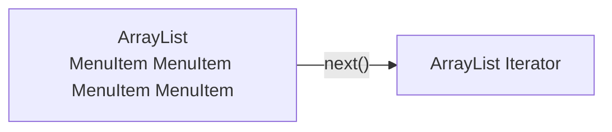

!!! note
    Nuestros elementos de menú tenían dos implementaciones diferentes...

### `Array`

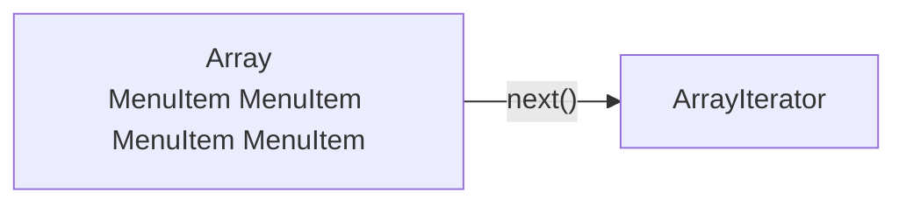

!!! note
    ...y dos interfaces diferentes para iterar. Y no queríamos que ella supiera cómo están implementados los elementos del menú.

### Desacoplamos a la `Waitress`...

Le dimos a la `Waitress` un `Iterator` para cada tipo de grupo de objetos sobre el que necesitaba iterar...

El `ArrayList` tiene un iterador incorporado... así que le dimos uno para el `ArrayList`...

!!! note
    El `Array` no tiene un `Iterator` incorporado, así que construimos el nuestro.

...y uno para el `Array`.

Ahora no tiene que preocuparse de qué implementación usamos; siempre usa la misma interfaz — `Iterator` — para iterar sobre los elementos del menú. Se ha desacoplado de la implementación.

### ...y Flexiblecimos la `Waitress`

Dándole un `Iterator`, la hemos desacoplado de la implementación de los elementos de menú, así que la `Waitress` sabe qué hacer. Y es mejor para nosotros, porque los detalles de implementación no quedan expuestos.

### `HashMap`

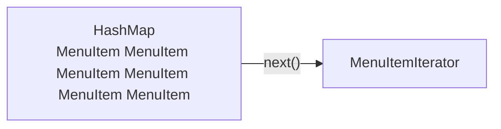

!!! note
    Añadimos fácilmente otra implementación de elementos de menú, y como proporcionamos un `Iterator`, podemos añadir fácilmente nuevos Menus si queremos. Construir un `Iterator` para los valores del `HashMap` fue fácil: cuando llamas a `values.iterator()` obtienes un `Iterator`. Lo cual es mejor para ella, porque ahora puede usar el mismo código para iterar sobre cualquier grupo de objetos. Y es mejor para nosotros porque los detalles de implementación no quedan expuestos.

### ¡Pero hay más!

Java te da un montón de clases «Collection» que te permiten almacenar y recuperar grupos de objetos; por ejemplo, `Vector` y `LinkedList`.

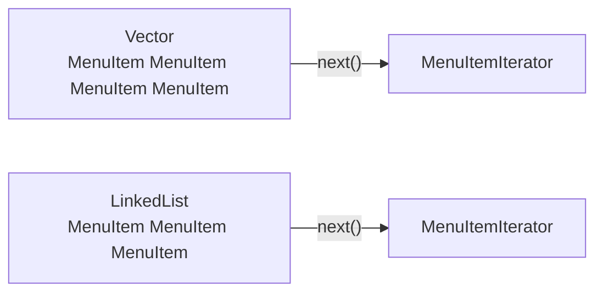

!!! note
    La mayoría tienen interfaces diferentes.

Pero casi todas admiten una forma de obtener un `Iterator`.

### ...¡y más!

!!! note
    Y si no admiten `Iterator`, no hay problema, porque ahora ya sabes cómo construir el tuyo.

## Iteradores y colecciones

Hemos estado usando un par de clases que forman parte del Java Collections Framework. Este «framework» no es más que un conjunto de clases e interfaces, incluyendo `ArrayList`, que hemos estado usando, y muchas otras como `Vector`, `LinkedList`, `Stack` y `PriorityQueue`. Cada una de estas clases implementa la interfaz `java.util.Collection`, que contiene un montón de métodos útiles para manipular grupos de objetos. Echemos un vistazo rápido a la interfaz:

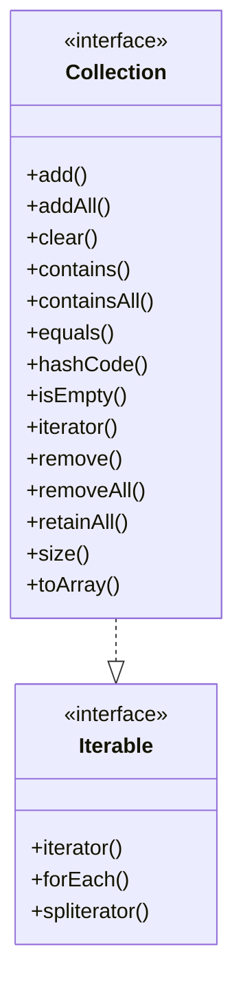

!!! note "No olvides la interfaz `Collection`"
    La interfaz `Collection` implementa la interfaz `Iterable`.

!!! note "Hay de todo aquí"
    Como puedes ver, hay toda clase de cosas buenas. Puedes añadir y quitar elementos de tu colección sin siquiera saber cómo está implementada.

!!! note "Aquí está nuestro viejo amigo, el método `iterator()`"
    Con este método puedes obtener un `Iterator` para cualquier clase que implemente la interfaz `Collection`.

!!! note "Otros métodos útiles"
    Otros métodos útiles incluyen `size()`, para obtener el número de elementos, y `toArray()`, para convertir tu colección en un array.

Si una clase implementa `Iterable`, sabemos que la clase implementa un método `iterator()`. Ese método devuelve un iterador que implementa la interfaz `Iterator`. Esta interfaz también incluye un método `forEach()` por defecto que se puede usar como otra forma de recorrer la colección. Además de todo eso, Java incluso ofrece un poco de azúcar sintáctico para la iteración, con su bucle `for` mejorado. Veamos cómo funciona.

!!! note "Nota marginal"
    `HashMap` es una de las pocas clases que admite `Iterator` indirectamente. Como viste cuando implementamos el `CafeMenu`, podías obtener un `Iterator` de ella, pero solo recuperando primero su `Collection` llamada `values`. Si lo piensas, esto tiene sentido: el `HashMap` contiene dos conjuntos de objetos: claves y valores. Si queremos iterar sobre sus valores, primero tenemos que recuperarlos del `HashMap`, y después obtener el iterador.

!!! note
    Lo bonito de las Collections y los Iterators es que cada objeto `Collection` sabe cómo crear su propio `Iterator`. Al llamar a `iterator()` sobre un `ArrayList` obtienes un `Iterator` concreto hecho para `ArrayList`, pero nunca necesitas ver ni preocuparte por la clase concreta que usa; simplemente usas la interfaz `Iterator`.

## Imanes de código

!!! exercise "Imanes de código"
    Los Chefs han decidido que quieren poder alternar los elementos de su menú de almuerzo; en otras palabras, ofrecerán algunos elementos el lunes, miércoles, viernes y domingo, y otros elementos el martes, jueves y sábado. Alguien ya escribió el código de un nuevo `Iterator` «Alternating» de `DinerMenu` para que alterne los elementos del menú, pero lo barajó y lo pegó en la nevera del Diner como broma. ¿Puedes volver a armarlo? Algunas de las llaves se quedaron en el suelo y eran demasiado pequeñas para recogerlas, así que siéntete libre de añadir tantas como necesites.

    ```java
    MenuItem menuItem = items[position];
    position = position + 2;
    return menuItem;
    import java.util.Iterator;
    import java.util.Calendar;
                }
    public Object next() {
    public AlternatingDinerMenuIterator(MenuItem[] items)
            this.items = items;
            position = Calendar.DAY_OF_WEEK % 2;
    implements Iterator<MenuItem>
                            public void remove() {
        MenuItem[] items;
    int position;
                    public class AlternatingDinerMenuIterator
                                          }
        public boolean hasNext() {
                throw new UnsupportedOperationException(
                    "Alternating Diner Menu Iterator does not support remove()");
        if (position >= items.length || items[position] == null) {
            return false;
        } else {
            return true;
                                        }
        }
    ```

## ¿Está la `Waitress` lista para salir en antena?

La `Waitress` ha recorrido un largo camino, pero tienes que admitir que esas tres llamadas a `printMenu()` están quedando bastante feas. Seamos realistas: cada vez que añadimos un menú nuevo vamos a tener que abrir la implementación de la `Waitress` y añadir más código. ¿Se puede decir «violando el principio abierto-cerrado»?

```java
    public void printMenu() {
        Iterator<MenuItem> pancakeIterator = pancakeHouseMenu.createIterator();
        Iterator<MenuItem> dinerIterator = dinerMenu.createIterator();
        Iterator<MenuItem> cafeIterator = cafeMenu.createIterator();
        System.out.println("MENU\n----\nBREAKFAST");
        printMenu(pancakeIterator);
        System.out.println("\nLUNCH");
        printMenu(dinerIterator);
        System.out.println("\nDINNER");
        printMenu(cafeIterator);
    }
```

!!! note "Tres llamadas a `createIterator()`"

!!! note "Tres llamadas a `printMenu`"
    Cada vez que añadimos o quitamos un menu, vamos a tener que abrir este código para hacer cambios.

No es culpa de la `Waitress`. Hemos hecho un gran trabajo desacoplando la implementación de los menús y extrayendo la iteración a un iterador. Pero todavía estamos manejando los menús como objetos separados e independientes: necesitamos una forma de gestionarlos juntos.

!!! exercise "Piensa en esto"
    La `Waitress` todavía tiene que hacer tres llamadas a `printMenu()`, una por cada menú. ¿Se te ocurre una forma de combinar los menús para que solo haya que hacer una llamada? O quizá para que se le pase un `Iterator` a la `Waitress` y pueda iterar sobre todos los menús.

## Un nuevo diseño

!!! note "Un nuevo diseño"
    Esto no está tan mal. Todo lo que tenemos que hacer es empaquetar los menús en un `ArrayList` y luego recorrer cada `Menu`. El código de la `Waitress` va a quedar simple y manejará cualquier número de menús.

Suena a que el chef va por buen camino. Vamos a intentarlo:

```java
public class Waitress {
    List<Menu> menus;
    public Waitress(List<Menu> menus) {
        this.menus = menus;
    }
    public void printMenu() {
        Iterator<Menu> menuIterator = menus.iterator();
        while(menuIterator.hasNext()) {
            Menu menu = menuIterator.next();
            printMenu(menu.createIterator());
        }
    }
    void printMenu(Iterator<MenuItem> iterator) {
        while (iterator.hasNext()) {
            MenuItem menuItem = iterator.next();
            System.out.print(menuItem.getName() + ", ");
            System.out.print(menuItem.getPrice() + " -- ");
            System.out.println(menuItem.getDescription());
        }
    }
}
```

!!! note "Ahora tomamos una lista de menús"
    En lugar de cada menú por separado.

!!! note "Y recorremos los menús"
    Pasando el iterador de cada menú al método `printMenu()` sobrecargado.

!!! note "Aquí no cambia nada"

Esto tiene muy buena pinta, aunque hemos perdido los nombres de los menús, pero podríamos añadir los nombres a cada menú.

## Justo cuando creíamos que era seguro...

!!! note "Nuevo peligro"
    Acabo de oír que el Diner va a crear un menú de postres que va a ser una inserción en su menú habitual.

Ahora quieren añadir un submenú de postres. Vale, ¿y ahora qué? Ahora tenemos que admitir no solo múltiples menús, sino menús dentro de menús. Sería bonito si pudiéramos simplemente hacer que el menú de postres fuera un elemento de la colección `DinerMenu`, pero eso no va a funcionar tal y como está implementado ahora. Lo que queremos (algo así):

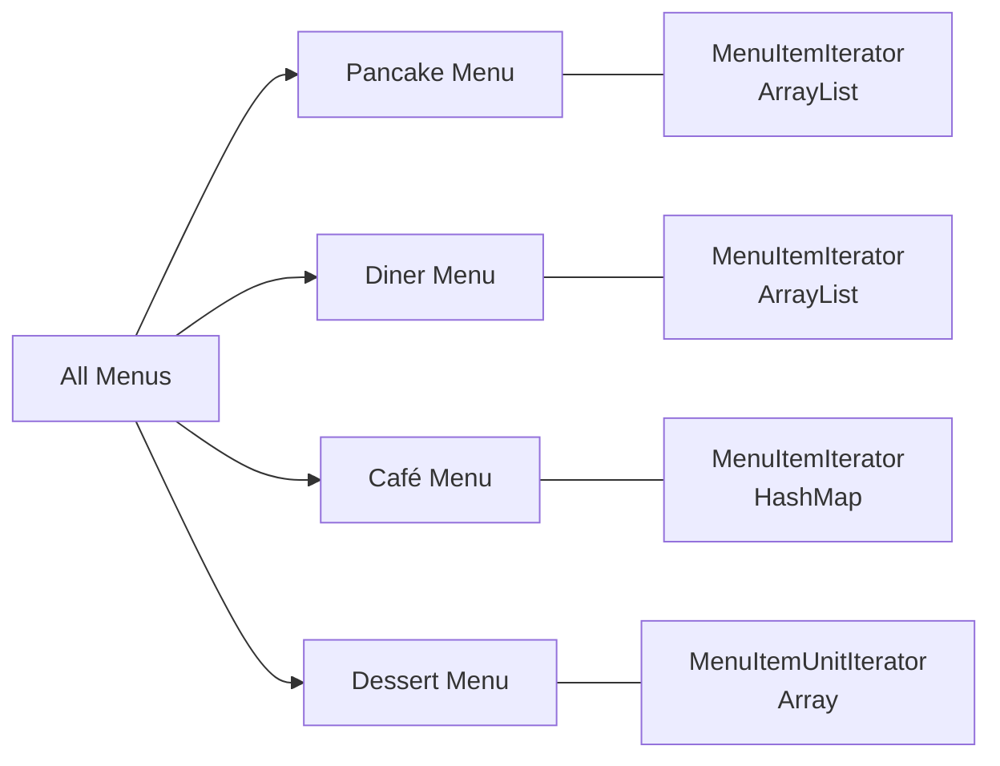

!!! note "Aquí está nuestro `ArrayList`"
    Que contiene los menús de cada restaurante.

!!! note "El `Diner Menu` tiene que contener un submenú"
    Pero en realidad no podemos asignarle un menu a un array de `MenuItem` porque los tipos son distintos, así que esto no va a funcionar.

!!! warning "¡Pero esto no va a funcionar!"
    No podemos asignarle un menú de postres a un array de `MenuItem`.

!!! warning "¡Hora de cambiar!"

## ¿Qué necesitamos?

Ha llegado el momento de tomar una decisión ejecutiva y reestructurar la implementación del chef en algo lo bastante general como para funcionar con todos los menús (y ahora los submenús). Así es, vamos a decirle a los chefs que ha llegado la hora de que reimplementemos sus menús. La realidad es que hemos alcanzado un nivel de complejidad tal que, si no reestructuramos el diseño ahora, nunca vamos a tener un diseño que pueda acomodar nuevas adquisiciones o submenús. Entonces, ¿qué es lo que realmente necesitamos de nuestro nuevo diseño?

- Necesitamos algún tipo de estructura con forma de árbol que admita menús, submenús y elementos de menú.
- Necesitamos asegurarnos de mantener una forma de recorrer los elementos de cada menú que sea al menos tan cómoda como lo que estamos haciendo ahora con los iteradores.
- Puede que necesitemos recorrer los elementos de una manera más flexible. Por ejemplo, puede que necesitemos iterar solo sobre el menú de postres del Diner, o puede que necesitemos iterar sobre el menú completo del Diner, incluido el submenú de postres.

!!! note "Nota marginal"
    Llega un momento en el que tenemos que reestructurar nuestro código para que pueda crecer. No hacerlo nos dejaría con un código rígido e inflexible que no tiene esperanza alguna de dar nuevos frutos.

Como necesitamos representar menús, submenús anidados y elementos de menú, podemos encajarlos de forma natural en una estructura con forma de árbol.

!!! note "Tenemos que admitir Menus... y submenús... y elementos de menú"

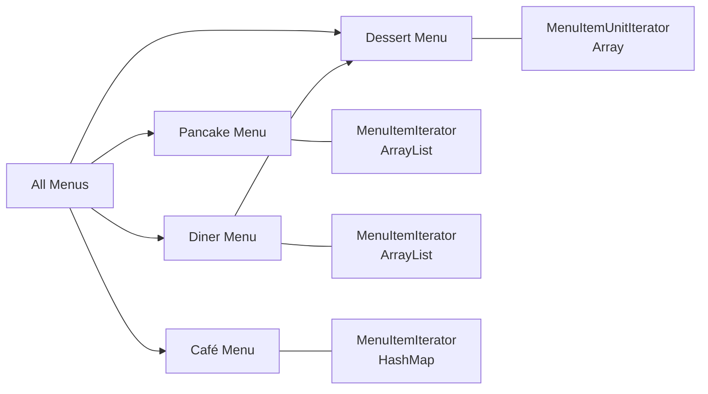

!!! note "Todavía tenemos que ser capaces de recorrer todos los elementos"
    ...del árbol.

!!! note "También tenemos que ser capaces de recorrerlos de manera más flexible"
    Por ejemplo, sobre un solo menú.

!!! exercise "Piensa en esto"
    ¿Cómo gestionarías este nuevo contratiempo en los requisitos de nuestro diseño? Piénsalo antes de pasar página.

## El patrón Composite definido

¡Correcto! Vamos a introducir otro patrón para resolver este problema. No hemos abandonado a Iterator —seguirá formando parte de nuestra solución—, pero el problema de gestionar los menús ha adquirido una nueva dimensión que Iterator no resuelve. Así que vamos a dar un paso atrás y a resolverlo con el patrón Composite.

No vamos a dar rodeos con este patrón; vamos a exponer ya la definición oficial:

!!! abstract "Definición del patrón Composite"
    El patrón Composite te permite componer objetos en estructuras de árbol que representen jerarquías de parte-todo. Composite permite que los clientes traten los objetos individuales y las composiciones de objetos de manera uniforme.

Piensemos en esto en términos de nuestros menús: este patrón nos da una forma de crear una estructura de árbol capaz de manejar un grupo anidado de menús y de elementos de menú dentro de la misma estructura. Al poner menús y elementos dentro de la misma estructura creamos una jerarquía parte-todo —es decir, un árbol de objetos hecho de partes (menús y elementos de menú), pero que puede tratarse como un todo, como un gran menú *uber*.

!!! note "Aquí tienes una estructura de árbol."

!!! note "Los elementos con elementos hijos se llaman nodos."

!!! note "Los elementos sin hijos se llaman hojas."

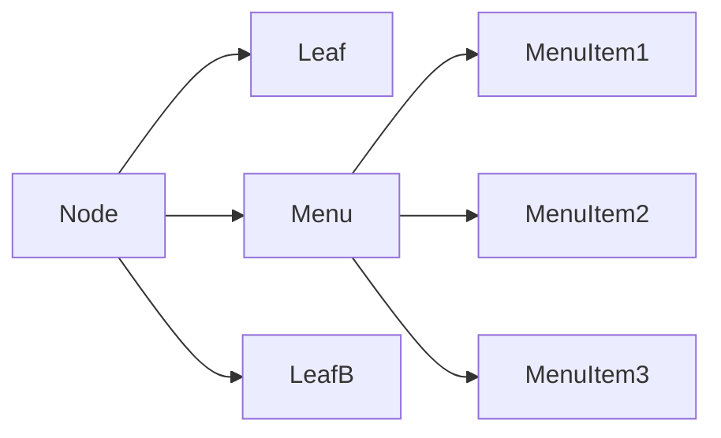

!!! note "Podemos representar nuestro Menu y nuestros MenuItems en una estructura de árbol."

!!! note "Los menús son nodos y los MenuItems son hojas."

Una vez que tenemos nuestro menú *uber*, podemos usar este patrón para tratar «los objetos individuales y las composiciones de objetos de manera uniforme». ¿Qué significa eso? Significa que, si tenemos una estructura de árbol de menús, submenús y quizá sub-submenús junto con elementos de menú, entonces cualquier menú es una «composición» porque puede contener tanto otros menús como elementos de menú. Los objetos individuales son simplemente los elementos de menú: no contienen otros objetos. Como ya verás, usar un diseño que siga el patrón Composite nos va a permitir escribir algo de código sencillo que pueda aplicar la misma operación (¡como imprimir!) sobre toda la estructura de menús.

**El patrón Composite nos permite construir estructuras de objetos con forma de árboles que contienen tanto composiciones de objetos como objetos individuales como nodos.**

!!! note "...y tratarlos como un todo..."

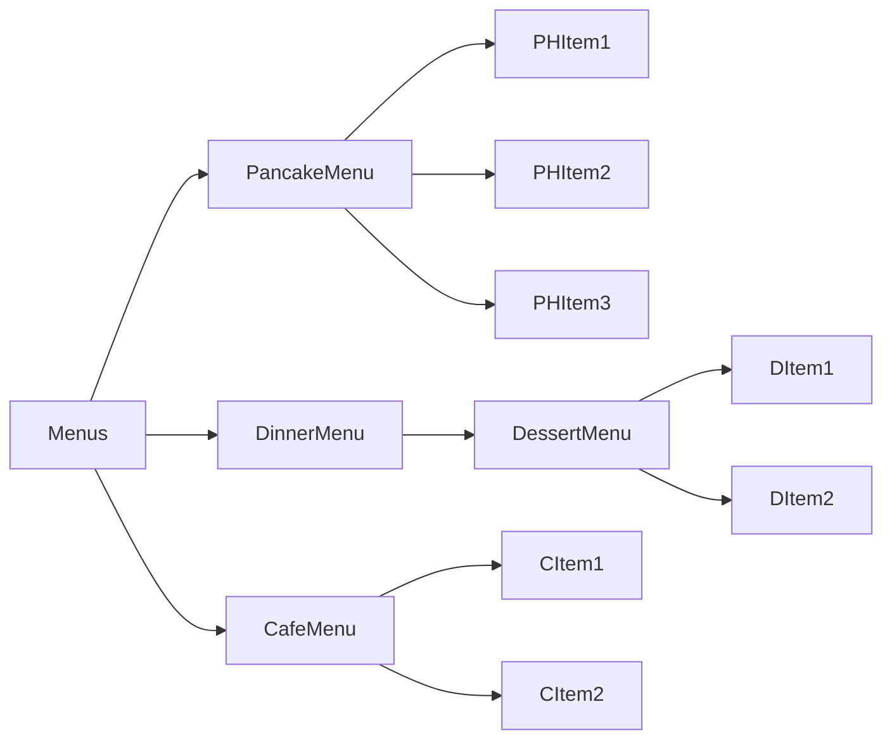

**Usando una estructura compuesta podemos aplicar las mismas operaciones sobre los compuestos y sobre los objetos individuales. En otras palabras, en la mayoría de los casos podemos ignorar las diferencias entre las composiciones de objetos y los objetos individuales.**

!!! note "Las operaciones se pueden aplicar al conjunto..."

```mermaid
flowchart LR
    printAll --> Menus
    Menus --> PancakeMenu
    Menus --> DinnerMenu
    Menus --> CafeMenu
    PancakeMenu --> PHItem1
    PancakeMenu --> PHItem2
    DinnerMenu --> DessertMenu
    DessertMenu --> DItem1
    CafeMenu --> CItem1
```

**Usando una estructura compuesta podemos aplicar las mismas operaciones sobre los compuestos y sobre los objetos individuales. En otras palabras, en la mayoría de los casos podemos ignorar las diferencias entre las composiciones de objetos y los objetos individuales.**

!!! note "...o sobre las partes."

```mermaid
flowchart LR
    printParts --> PHItem1
    printParts --> DItem1
    printParts --> CItem1
    Menus --> PancakeMenu
    Menus --> DinnerMenu
    Menus --> CafeMenu
    PancakeMenu --> PHItem1
    PancakeMenu --> PHItem2
    DinnerMenu --> DessertMenu
    DessertMenu --> DItem1
    CafeMenu --> CItem1
```

```mermaid
classDiagram
    class Client
    class Component {
        <<abstract>>
        operation()
        add(Component)
        remove(Component)
        getChild(int)
    }
    class Leaf {
        operation()
    }
    class Composite {
        operation()
        add(Component)
        remove(Component)
        getChild(int)
    }
    Component <|-- Leaf
    Component <|-- Composite
    Client --> Component
    Composite o-- Component : children
```

!!! note "El Component define una interfaz para todos los objetos de la composición: tanto el compuesto como las hojas."

!!! note "El Component puede implementar un comportamiento por defecto para add(), remove(), getChild() y sus operaciones."

!!! note "El Client usa la interfaz Component para manipular los objetos de la composición."

!!! note "Fíjate en que la hoja también hereda métodos como add(), remove() y getChild(), que no necesariamente tienen mucho sentido para un nodo hoja. Volveremos sobre este asunto."

!!! note "Una hoja no tiene hijos."

!!! note "Una hoja define el comportamiento de los elementos de la composición. Lo hace implementando las operaciones que soporta el Composite."

!!! note "El Composite también implementa las operaciones relacionadas con la hoja. Ojo: algunas de ellas puede que no tengan sentido en un Composite, y en ese caso habría que generar una excepción."

!!! note "El papel del Composite es definir el comportamiento de los componentes que tienen hijos y almacenar los componentes hijos."

!!! question "P: Component, Composite, árboles? Estoy confundido."
    Un compuesto contiene componentes. Los componentes vienen en dos sabores: compuestos y elementos hoja. ¿Suena recursivo? Lo es. Un compuesto contiene un conjunto de hijos; esos hijos pueden ser otros compuestos o elementos hoja. Cuando organizas los datos así obtienes una estructura de árbol (en realidad, una estructura de árbol invertida) con un compuesto en la raíz y ramas de compuestos creciendo hasta las hojas.

!!! question "P: ¿Cómo se relaciona esto con los iteradores?"
    Recuerda, estamos tomando un enfoque nuevo. Vamos a reimplementar los menús con una solución nueva: el patrón Composite. Así que no busques alguna transformación mágica de un iterador a un compuesto. Dicho esto, los dos funcionan muy bien juntos. Pronto verás que podemos usar iteradores de un par de maneras en la implementación del compuesto.

## Diseñando menús con Composite

Así que, ¿cómo aplicamos el patrón Composite a nuestros menús? Para empezar necesitamos crear una interfaz de componente; esta actúa como la interfaz común tanto para los menús como para los elementos de menú, y nos permite tratarlos de manera uniforme. En otras palabras, podemos llamar al mismo método sobre menús o sobre elementos de menú.

Puede que no tenga sentido llamar a algunos de los métodos sobre un elemento de menú o sobre un menú, pero eso ya lo resolveremos, y lo resolveremos dentro de nada. Por ahora, echemos un vistazo a un boceto de cómo van a encajar los menús en una estructura del patrón Composite:

```mermaid
classDiagram
    class Waitress
    class MenuComponent {
        <<abstract>>
        getName()
        getDescription()
        getPrice()
        isVegetarian()
        print()
        add(MenuComponent)
        remove(MenuComponent)
        getChild(int)
    }
    class MenuItem {
        getName()
        getDescription()
        getPrice()
        isVegetarian()
        print()
    }
    class Menu {
        menuComponents
        getName()
        getDescription()
        print()
        add(MenuComponent)
        remove(MenuComponent)
        getChild(int)
    }
    Waitress --> MenuComponent
    MenuComponent <|-- MenuItem
    MenuComponent <|-- Menu
```

!!! note "MenuComponent representa la interfaz tanto para MenuItem como para Menu. Hemos usado una clase abstracta porque queremos ofrecer implementaciones por defecto de estos métodos."

!!! note "La Waitress va a usar la interfaz MenuComponent para acceder tanto a los Menus como a los MenuItems."

!!! note "Tenemos algunos de los mismos métodos que recordarás de nuestras versiones anteriores de MenuItem y de Menu, y hemos añadido print(), add(), remove() y getChild(). Describiremos la manipulación de los componentes en breve, cuando implementemos nuestras nuevas clases Menu y MenuItem."

!!! note "Aquí tienes los métodos para estos componentes."

!!! note "Tanto MenuItem como Menu sobrescriben print()."

!!! note "MenuItem sobrescribe los métodos que tienen sentido, y usa las implementaciones por defecto de MenuComponent para los que no lo tienen (como add(): no tiene sentido añadir un componente a un MenuItem... solo podemos añadir componentes a un Menu)."

!!! note "Menu también sobrescribe los métodos que tienen sentido, como una forma de añadir y quitar elementos de menú (¡u otros menús!) de su menuComponents. Además, usaremos los métodos getName() y getDescription() para devolver el nombre y la descripción del menú."

## Implementando MenuComponent

!!! warning "Todos los componentes deben implementar la interfaz MenuComponent; sin embargo, como las hojas y los nodos tienen papeles distintos, no siempre podemos definir una implementación por defecto para cada método que tenga sentido. A veces, lo mejor que puedes hacer es lanzar una excepción en tiempo de ejecución."

Vale, vamos a empezar por la clase abstracta MenuComponent; recuerda, el papel del componente de menú es proporcionar una interfaz para las hojas y para los nodos compuestos. Ahora quizá estés pensando: «¿MenuComponent no está jugando dos papeles?». Puede que sí, y volveremos sobre ese punto. Sin embargo, por ahora vamos a proporcionar una implementación por defecto de los métodos, de modo que si el MenuItem (la hoja) o el Menu (el compuesto) no quiere implementar alguno de los métodos (como getChild() para un nodo hoja), pueda recurrir a un comportamiento básico:

!!! note "MenuComponent proporciona implementaciones por defecto para todos los métodos."

!!! note "Como algunos de estos métodos solo tienen sentido para los MenuItems, y otros solo tienen sentido para los Menus, la implementación por defecto es UnsupportedOperationException. Así, si MenuItem o Menu no soporta una operación, no tiene que hacer nada: simplemente puede heredar la implementación por defecto."

```java
public abstract class MenuComponent {
    public void add(MenuComponent menuComponent) {
        throw new UnsupportedOperationException();
    }
    public void remove(MenuComponent menuComponent) {
        throw new UnsupportedOperationException();
    }
    public MenuComponent getChild(int i) {
        throw new UnsupportedOperationException();
    }
    public String getName() {
        throw new UnsupportedOperationException();
    }
    public String getDescription() {
        throw new UnsupportedOperationException();
    }
    public double getPrice() {
        throw new UnsupportedOperationException();
    }
    public boolean isVegetarian() {
        throw new UnsupportedOperationException();
    }
    public void print() {
        throw new UnsupportedOperationException();
    }
}
```

!!! note "Hemos agrupado juntos los métodos de «compuesto» —es decir, los métodos para añadir, quitar y obtener MenuComponents."

!!! note "Aquí están los métodos de «operación»; estos los usan los MenuItems. Resulta que también podemos usar un par de ellos en Menu, como verás dentro de un par de páginas cuando mostremos el código de Menu."

!!! note "print() es un método de «operación» que implementarán tanto nuestros Menus como nuestros MenuItems, pero aquí proporcionamos una operación por defecto."

## Implementando el MenuItem

!!! tip "Me alegra que vayamos por este camino. Creo que esto me va a dar la flexibilidad que necesito para implementar ese menú de crêpes que siempre he querido."

Vale, vamos a darle una oportunidad a la clase MenuItem. Recuerda, esta es la clase hoja en el diagrama de Composite, y implementa el comportamiento de los elementos del compuesto.

!!! note "Primero tenemos que extender la interfaz MenuComponent."

!!! note "El constructor solo toma el nombre, la descripción, etc., y guarda una referencia a todos ellos. Esto es prácticamente igual que nuestra implementación antigua de MenuItem."

```java
public class MenuItem extends MenuComponent {
    String name;
    String description;
    boolean vegetarian;
    double price;
    public MenuItem(String name,
                    String description,
                    boolean vegetarian,
                    double price)
    {
        this.name = name;
        this.description = description;
        this.vegetarian = vegetarian;
        this.price = price;
    }
    public String getName() {
        return name;
    }
    public String getDescription() {
        return description;
    }
    public double getPrice() {
        return price;
    }
    public boolean isVegetarian() {
        return vegetarian;
    }
    public void print() {
        System.out.print("  " + getName());
        if (isVegetarian()) {
            System.out.print("(v)");
        }
        System.out.println(", " + getPrice());
        System.out.println("     -- " + getDescription());
    }
}
```

!!! note "Aquí tienes nuestros métodos getter: igual que en nuestra implementación anterior."

!!! note "Esto es diferente de la implementación anterior. Aquí estamos sobrescribiendo el método print() de la clase MenuComponent. Para MenuItem, este método imprime la entrada completa del menú: nombre, descripción, precio y si es vegetariano o no."

## Implementando el menú Composite

Ahora que ya tenemos el MenuItem, solo nos falta la clase compuesta, a la que llamamos Menu. Recuerda, la clase compuesta puede contener MenuItems o otros Menus. Hay un par de métodos de MenuComponent que esta clase no implementa, getPrice() e isVegetarian(), porque esos no tienen mucho sentido para un Menu.

!!! note "Menu puede tener cualquier número de hijos de tipo MenuComponent. Usaremos un ArrayList interno para almacenarlos."

!!! note "Menu también es un MenuComponent, igual que MenuItem."

!!! note "Esto es diferente de nuestra implementación antigua: vamos a darle a cada Menu un nombre y una descripción. Antes, simplemente confabulábamos con tener clases distintas para cada menú."

```java
public class Menu extends MenuComponent {
    List<MenuComponent> menuComponents = new ArrayList<MenuComponent>();
    String name;
    String description;
    public Menu(String name, String description) {
        this.name = name;
        this.description = description;
    }
    public void add(MenuComponent menuComponent) {
        menuComponents.add(menuComponent);
    }
    public void remove(MenuComponent menuComponent) {
        menuComponents.remove(menuComponent);
    }
    public MenuComponent getChild(int i) {
        return menuComponents.get(i);
    }
    public String getName() {
        return name;
    }
    public String getDescription() {
        return description;
    }
    public void print() {
        System.out.print("\n" + getName());
        System.out.println(", " + getDescription());
        System.out.println("---------------------");
    }
}
```

!!! note "Aquí tienes cómo se añaden MenuItems u otros Menus a un Menu. Como tanto los MenuItems como los Menus son MenuComponents, solo necesitamos un método para hacer ambas cosas."

!!! note "También puedes quitar un MenuComponent u obtener un MenuComponent."

!!! note "Aquí tienes los métodos getter para obtener el nombre y la descripción."

!!! note "Fíjate en que no sobrescribimos getPrice() ni isVegetarian(), porque esos métodos no tienen sentido para un Menu (aunque se podría argumentar que isVegetarian() sí que lo tendría). Si alguien intenta llamar a esos métodos sobre un Menu, obtendrá una UnsupportedOperationException."

!!! note "Para imprimir el Menu, imprimimos su nombre y su descripción."

### Corrigiendo el método print()

!!! tip "Un momento, no entiendo la implementación de print(). Pensaba que debía poder aplicar las mismas operaciones a un compuesto que a una hoja. Si aplico print() a un compuesto con esta implementación, lo único que obtengo es un simple nombre y una descripción de menú. No obtengo una impresión del COMPUESTO."

**Buen ojo.** Como Menu es un compuesto y contiene tanto MenuItems como otros Menus, su método print() debería imprimir todo lo que contiene. Si no lo hace, tendremos que recorrer el compuesto entero e imprimir nosotros mismos cada elemento. Eso iría en contra del propósito de tener una estructura compuesta.

Como ya verás, implementar print() correctamente es fácil porque podemos confiar en que cada componente sepa imprimirse a sí mismo. Todo esIBLEmente recursivo y con gancho. Échale un vistazo:

!!! note "Solo tenemos que cambiar el método print() para que no imprima únicamente la información sobre este Menu, sino todos los componentes de este Menu: otros Menus y MenuItems."

```java
public class Menu extends MenuComponent {
    List<MenuComponent> menuComponents = new ArrayList<MenuComponent>();
    String name;
    String description;
    // constructor code here
    // other methods here
    public void print() {
        System.out.print("\n" + getName());
        System.out.println(", " + getDescription());
        System.out.println("---------------------");
        for (MenuComponent menuComponent : menuComponents) {
           menuComponent.print();
        }
    }
}
```

!!! note "¡Mira! Podemos usar un Iterator entre bastidores, gracias al bucle for mejorado. Lo usamos para recorrer todos los componentes del Menu... que podrían ser otros Menus, o podrían ser MenuItems. Como tanto los Menus como los MenuItems implementan print(), simplemente llamamos a print() y el resto es cosa suya."

!!! warning "NOTA: si durante esta iteración nos encontramos con otro objeto Menu, su método print() iniciará otra iteración, y así sucesivamente."

## Preparativos para la prueba de conducir...

Ya era hora de poner este código a prueba, pero antes tenemos que actualizar el código de la Waitress; después de todo, ella es la cliente principal de este código:

!!! note "¡Sí! El código de la Waitress es realmente así de sencillo."

!!! note "Ahora solo le pasamos el componente de menú de nivel superior, el que contiene todos los demás menús. Lo hemos llamado allMenus."

```java
public class Waitress {
    MenuComponent allMenus;
    public Waitress(MenuComponent allMenus) {
        this.allMenus = allMenus;
    }
    public void printMenu() {
        allMenus.print();
    }
}
```

!!! note "Todo lo que tiene que hacer para imprimir toda la jerarquía de menús —todos los menús y todos los elementos de menú— es llamar a print() sobre el menú de nivel superior."

!!! note "¡Vamos a tener una Waitress muy feliz!"

Vale, una última cosa antes de escribir nuestra prueba de conducción. Vamos a tener una idea de cómo va a quedar el menú compuesto en tiempo de ejecución:

!!! note "El menú de nivel superior contiene todos los menús y todos los elementos."

!!! note "Cada Menu y cada MenuItem implementa la interfaz MenuComponent."

```mermaid
flowchart LR
    TopLevel --> PancakeMenu
    TopLevel --> DinerMenu
    TopLevel --> CafeMenu
    TopLevel --> DessertMenu
    PancakeMenu --> PHLeaf1
    PancakeMenu --> PHLeaf2
    PancakeMenu --> PHLeaf3
    DinerMenu --> DLeaf1
    DinerMenu --> DLeaf2
    DinerMenu --> DessertMenu
    DessertMenu --> DSLeaf1
    DessertMenu --> DSLeaf2
    CafeMenu --> CLeaf1
    CafeMenu --> CLeaf2
    CafeMenu --> CLeaf3
```

!!! note "Cada Menu contiene elementos..."

!!! note "...o elementos y otros menús."

## Ahora la prueba de conducción...

Vale, ahora solo necesitamos una prueba de conducción. A diferencia de nuestra versión anterior, vamos a manejar toda la creación de los menús en la prueba de conducción. Podríamos pedirle a cada cocinero que nos dé su nuevo menú, pero vamos a probarlo todo primero. Aquí tienes el código:

!!! note "Primero creamos todos los objetos de menú."

!!! note "También necesitamos un menú de nivel superior al que llamaremos allMenus."

```java
public class MenuTestDrive {
    public static void main(String args[]) {
        MenuComponent pancakeHouseMenu =
            new Menu("PANCAKE HOUSE MENU", "Breakfast");
        MenuComponent dinerMenu =
            new Menu("DINER MENU", "Lunch");
        MenuComponent cafeMenu =
            new Menu("CAFE MENU", "Dinner");
        MenuComponent dessertMenu =
            new Menu("DESSERT MENU", "Dessert of course!");
        MenuComponent allMenus = new Menu("ALL MENUS", "All menus combined");
        allMenus.add(pancakeHouseMenu);
        allMenus.add(dinerMenu);
        allMenus.add(cafeMenu);
        // add menu items here
        dinerMenu.add(new MenuItem(
            "Pasta",
            "Spaghetti with Marinara Sauce, and a slice of sourdough bread",
            true,
            3.89));
        dinerMenu.add(dessertMenu);
        dessertMenu.add(new MenuItem(
            "Apple Pie",
            "Apple pie with a flakey crust, topped with vanilla ice cream",
            true,
            1.59));
        // add more menu items here
        Waitress waitress = new Waitress(allMenus);
        waitress.printMenu();
    }
}
```

!!! note "Estamos usando el método add() del Composite para añadir cada menú al menú de nivel superior, allMenus."

!!! note "Ahora tenemos que añadir todos los elementos de menú. Aquí tienes un ejemplo; para el resto, mira el código fuente completo."

!!! note "Y también estamos añadiendo un menú a un menú. Al dinerMenu le da igual que todo lo que contiene, sea un elemento de menú o un menú, es un MenuComponent."

!!! note "Añadimos algo de tarta de manzana al menú de postres..."

!!! note "Una vez que hemos construido toda la jerarquía de menús, le entregamos el conjunto a la Waitress y, como ya has visto, es tan fácil como una tarta de manzana para que lo imprima."

## Preparativos para otra prueba de conducción...

!!! note "NOTA: esta salida está basada en el código fuente completo."

```text
% java MenuTestDrive
ALL MENUS, All menus combined
---------------------
PANCAKE HOUSE MENU, Breakfast
---------------------
  K&B’s Pancake Breakfast(v), 2.99
     -- Pancakes with scrambled eggs and toast
  Regular Pancake Breakfast, 2.99
     -- Pancakes with fried eggs, sausage
  Blueberry Pancakes(v), 3.49
     -- Pancakes made with fresh blueberries, and blueberry syrup
  Waffles(v), 3.59
     -- Waffles with your choice of blueberries or strawberries
DINER MENU, Lunch
---------------------
  Vegetarian BLT(v), 2.99
     -- (Fakin’) Bacon with lettuce & tomato on whole wheat
  BLT, 2.99
     -- Bacon with lettuce & tomato on whole wheat
  Soup of the day, 3.29
     -- A bowl of the soup of the day, with a side of potato salad
  Hot Dog, 3.05
     -- A hot dog, with sauerkraut, relish, onions, topped with cheese
  Steamed Veggies and Brown Rice(v), 3.99
     -- Steamed vegetables over brown rice
  Pasta(v), 3.89
     -- Spaghetti with marinara sauce, and a slice of sourdough bread
DESSERT MENU, Dessert of course!
---------------------
  Apple Pie(v), 1.59
     -- Apple pie with a flakey crust, topped with vanilla ice cream
  Cheesecake(v), 1.99
     -- Creamy New York cheesecake, with a chocolate graham crust
  Sorbet(v), 1.89
     -- A scoop of raspberry and a scoop of lime
CAFE MENU, Dinner
---------------------
  Veggie Burger and Air Fries(v), 3.99
     -- Veggie burger on a whole wheat bun, lettuce, tomato, and fries
  Soup of the day, 3.69
     -- A cup of the soup of the day, with a side salad
  Burrito(v), 4.29
     -- A large burrito, with whole pinto beans, salsa, guacamole
%
```

!!! note "Aquí están todos nuestros menús... lo imprimimos todo simplemente llamando a print() sobre el menú de nivel superior."

!!! note "El nuevo menú de postres se imprime cuando estamos imprimiendo todos los componentes del Diner menu."

!!! tip "¿Cuál es el lío? Primero nos decís Una Clase, Una Responsabilidad, y ahora nos dabais un patrón con dos responsabilidades en una sola clase. El patrón Composite gestiona una jerarquía Y realiza operaciones relacionadas con los Menus."

**Hay algo de verdad en esa observación.** Podríamos decir que el patrón Composite cambia el Principio de Responsabilidad Única por transparencia. ¿Qué es la transparencia? Pues bien, al permitir que la interfaz Component contenga tanto las operaciones de gestión de hijos como las operaciones de hoja, un cliente puede tratar de manera uniforme tanto a los compuestos como a las hojas; así que si un elemento es un nodo compuesto o un nodo hoja le resulta transparente al cliente.

Ahora bien, dado que tenemos ambos tipos de operaciones en la clase Component, perdemos algo de seguridad, porque un cliente podría intentar hacer algo inapropiado o sin sentido sobre un elemento (como intentar añadir un menú a un elemento de menú). Esta es una decisión de diseño; podríamos llevar el diseño en la dirección contraria y separar las responsabilidades en interfaces. Eso haría que nuestro diseño fuera seguro, en el sentido de que cualquier llamada inapropiada sobre los elementos se detectaría en tiempo de compilación o de ejecución, pero perderíamos la transparencia y nuestro código tendría que usar condicionales y el operador instanceof.

Así que, para volver a tu pregunta, este es un caso clásico de compromiso. Nos guiamos por principios de diseño, pero siempre necesitamos observar el efecto que tienen sobre nuestros diseños. A veces hacemos las cosas a propósito de una manera que parece violar el principio. En algunos casos, sin embargo, esto es cuestión de perspectiva; por ejemplo, puede que parezca incorrecto tener operaciones de gestión de hijos en las hojas (como add(), remove() y getChild()), pero siempre puedes desplazar tu perspectiva y ver una hoja como un nodo con cero hijos.

## Patterns Exposed

*La entrevista de esta semana: el patrón Composite, sobre cuestiones de implementación.*

**HeadFirst:** Estamos aquí esta noche hablando con el patrón Composite. ¿Por qué no nos cuentas algo sobre ti, Composite?

**Composite:** Claro... Soy el patrón que debes usar cuando tienes colecciones de objetos con relaciones todo-parte y quieres poder tratar esos objetos de manera uniforme.

**HeadFirst:** Vale, vamos directo al grano... ¿A qué te refieres con relaciones todo-parte?

**Composite:** Imagina una interfaz gráfica de usuario (GUI); allí suele haber un componente de nivel superior, como un Frame o un Panel, que contiene otros componentes, como menús, paneles de texto, barras de desplazamiento y botones. Así que tu GUI consta de varias partes, pero cuando la muestras, por lo general la piensas como un todo. Le dices al componente de nivel superior que se muestre, y confías en que ese componente muestre todas sus partes. Llamamos objetos compuestos a los componentes que contienen otros componentes, y objetos hoja a los componentes que no contienen otros componentes.

**HeadFirst:** Ah... ingenioso. Pero he oído que algunos clientes están tan preocupados por este asunto que exigen interfaces separadas para objetos distintos, de modo que no se permita hacer llamadas a métodos sin sentido. ¿Sigue siendo el patrón Composite?

**Composite:** Sí. Es una versión mucho más segura del patrón Composite, pero exige que el cliente compruebe el tipo de cada objeto antes de hacer la llamada, para poder hacer la conversión correctamente.

**HeadFirst:** Eso implica que todos los objetos tienen la misma interfaz. ¿Qué pasa si tienes objetos en tu compuesto que hacen cosas distintas?

**Composite:** Para que el compuesto funcione de forma transparente para el cliente, tienes que implementar la misma interfaz para todos los objetos del compuesto; de lo contrario, el cliente tiene que preocuparse por qué interfaz está implementando cada objeto, lo cual viene a anular el propósito. Obviamente eso significa que a veces tendrás objetos para los que algunas llamadas a métodos no tengan sentido.

**HeadFirst:** ¿Los hijos llegan a apuntar hacia arriba, a sus padres?

**Composite:** Sí, un componente puede tener un puntero a su padre para que el recorrido de la estructura sea más fácil. Y, si tienes una referencia a un hijo y necesitas borrarlo, tendrás que pedirle al padre que quite al hijo. Tener la referencia al padre también lo facilita.

**HeadFirst:** Hay bastante en lo que pensar en tu implementación. ¿Hay otros aspectos que deberíamos tener en cuenta al implementar el patrón Composite?

**Composite:** En realidad, sí los hay. Uno es el orden de los hijos. ¿Y si tienes un compuesto que necesita mantener a sus hijos en un orden concreto? Entonces necesitarás un esquema de gestión más sofisticado para añadir y quitar hijos, y tendrás que tener cuidado con la forma de recorrer la jerarquía.

**HeadFirst:** Buen punto, no se me había ocurrido.

**Composite:** ¿Y pensaste en el caché?

**HeadFirst:** ¿El caché?

**Composite:** Sí, el caché. A veces, si la estructura compuesta es compleja o cara de recorrer, resulta útil implementar caché de los nodos compuestos. Por ejemplo, si estás recorriendo constantemente un compuesto y todos sus hijos para calcular algún resultado, podrías implementar una caché que guarde temporalmente el resultado para ahorrar recorridos.

**HeadFirst:** Bueno, hay mucho más en los patrones Composite de lo que yo habría imaginado nunca. Antes de cerrar, una pregunta más: ¿cuál consideras tu mayor fortaleza?

**Composite:** Creo que tendría que decir, sin duda, que simplifico la vida de mis clientes. Mis clientes no tienen que preocuparse por si están tratando con un objeto compuesto o con un objeto hoja, así que no tienen que escribir sentencias if por todas partes para asegurarse de que están llamando a los métodos correctos sobre los objetos correctos. A menudo, pueden hacer una sola llamada a un método y ejecutar una operación sobre una estructura entera.

**HeadFirst:** Eso sí que suena como un beneficio importante. No hay duda de que eres un patrón útil para tener a mano al recoger y gestionar objetos. Y, con esto, se nos acaba el tiempo. Muchas gracias por acompañarnos y vuelve pronto para otro Patterns Exposed.

## Crucigrama de patrones de diseño

*Envuelve tu cerebro alrededor de este crucigrama de compuestos.*

**HORIZONTALES**

!!! exercise
    1. Collection e Iterator están en este paquete.
    3. Esta clase da soporte indirectamente a Iterator.
    8. Los iteradores suelen crearse usando este patrón (dos palabras).
    12. Una clase debería tener una sola razón para hacer esto.
    13. Esto lo encapsulamos.
    15. Los paquetes de interfaces de usuario suelen usar este patrón para sus componentes.
    16. Nombre del principio que dice que solo hay una responsabilidad por clase (dos palabras).
    17. Este menú nos obligó a cambiar toda nuestra implementación.

**VERTICALES**

!!! exercise
    2. No tiene hijos.
    4. Fusionado con el Diner (dos palabras).
    5. El patrón Iterator desacopla al cliente del ________ del agregado.
    6. Un objeto independiente que puede recorrer una colección.
    7. Los valores de HashMap y ArrayList implementan esta interfaz.
    9. La habilitamos con Java.
    10. Un componente puede ser un compuesto o esto.
    11. Un compuesto contiene estos.
    12. Tercera empresa adquirida.
    14. Borramos PancakeHouseMenuIterator porque esta clase ya proporciona un iterador.

!!! exercise "Relaciona cada patrón con su descripción"
    | Patrón | Descripción |
    |---|---|
    | Strategy | Los clientes tratan las colecciones de objetos y los objetos individuales de manera uniforme |
    | Adapter | Proporciona una forma de recorrer una colección de objetos sin exponer la implementación de la colección |
    | Iterator | Simplifica la interfaz de un grupo de clases |
    | Facade | Cambia la interfaz de una o más clases |
    | Composite | Permite que un grupo de objetos sea notificado cuando cambia algún estado |
    | Observer | Encapsula comportamientos intercambiables y usa delegación para decidir cuál usar |

## Herramientas para tu caja de herramientas de diseño

Dos patrones nuevos para tu caja de herramientas: dos grandes formas de tratar con colecciones de objetos.

### Principios OO

!!! note "Conceptos básicos de OO"
    - **Abstracción**: encapsula lo que varía. Favorece la composición sobre la herencia.
    - **Encapsulación**: programa contra interfaces, no contra implementaciones.
    - **Polimorfismo**: aspira a diseños débilmente acoplados entre los objetos que interactúan. Las clases deberían estar abiertas a la extensión pero cerradas a la modificación. Depende de las abstracciones, no de las clases concretas.
    - **Herencia**: habla solo con tus amigos. No nos llames, te llamaremos nosotros. Una clase debería tener una sola razón para cambiar.

!!! note "Otro principio importante basado en el cambio, dentro de un diseño."

!!! note "Otro capítulo dos-en-uno."

- Un Iterator da acceso a los elementos de un agregado sin exponer su estructura interna.
- Un Iterator se encarga del trabajo de iterar sobre un agregado y lo encapsula en otro objeto.
- Cuando usamos un Iterator, liberamos al agregado de la responsabilidad de soportar operaciones para recorrer sus datos.
- Un Iterator proporciona una interfaz común para recorrer los elementos de un agregado, lo que te permite usar polimorfismo al escribir código que usa los elementos del agregado.
- La interfaz Iterable proporciona un medio de obtener un iterador y habilita el bucle for mejorado de Java.
- El patrón Composite permite que los clientes traten los compuestos y los objetos individuales de manera uniforme.
- Un Component es cualquier objeto de una estructura Composite.
- Los Components pueden ser otros compuestos o hojas.
- Hay muchos compromisos de diseño al implementar Composite. Necesitas equilibrar la transparencia y la seguridad con tus necesidades.

!!! exercise "Ejercicio de la Waitress"
    Basándonos en nuestra implementación de printMenu(), ¿cuáles de las siguientes afirmaciones se aplican?

    - A. Estamos programando contra las implementaciones concretas de PancakeHouseMenu y DinerMenu, y no contra una interfaz.
    - B. La Waitress no implementa la API de Waitress en Java, así que no está adhiriéndose a un estándar.
    - C. Si decidiéramos cambiar de DinerMenu a otro tipo de menú que implementara su lista de elementos de menú con una tabla hash, tendríamos que modificar mucho código en la Waitress.
    - D. La Waitress necesita saber cómo representa cada menú su colección interna de elementos de menú; esto viola la encapsulación.
    - E. Tenemos código duplicado: el método printMenu() necesita dos bucles separados para iterar sobre los dos distintos tipos de menús. Y si añadéramos un tercer menú, tendríamos otro bucle más.
    - F. La implementación no está basada en MXML (Menu XML), y por tanto no es tan interoperable como debería ser.

    Antes de pasar a la página siguiente, anota rápidamente las tres cosas que tenemos que hacer con este código para encajarlo en nuestro framework:

    1. Implementar la interfaz Menu.
    2. Deshacernos de getItems().
    3. Añadir createIterator() y devolver un Iterator que pueda recorrer los valores del HashMap.

## Solución de los imanes de código

El iterador «Alternating» de DinerMenu, descolocado.

```java
import java.util.Iterator;
import java.util.Calendar;
public class AlternatingDinerMenuIterator
    implements Iterator<MenuItem>
{
    MenuItem[] items;
    int position;
    public AlternatingDinerMenuIterator(MenuItem[] items)
    {
        this.items = items;
        position = Calendar.DAY_OF_WEEK % 2;
    }
    public boolean hasNext() {
        if (position >= items.length || items[position] == null) {
            return false;
        } else {
            return true;
        }
    }
    public MenuItem next() {
        MenuItem menuItem = items[position];
        position = position + 2;
        return menuItem;
    }
    public void remove() {
        throw new UnsupportedOperationException(
            "Alternating Diner Menu Iterator does not support remove()");
    }
}
```

!!! note "Fíjate en que esta implementación del Iterator no soporta remove()."

## Solución

!!! success "Relaciona cada patrón con su descripción"
    | Patrón | Descripción |
    |---|---|
    | Composite | Los clientes tratan las colecciones de objetos y los objetos individuales de manera uniforme |
    | Iterator | Proporciona una forma de recorrer una colección de objetos sin exponer la implementación de la colección |
    | Facade | Simplifica la interfaz de un grupo de clases |
    | Adapter | Cambia la interfaz de una o más clases |
    | Observer | Permite que un grupo de objetos sea notificado cuando cambia algún estado |
    | Strategy | Encapsula comportamientos intercambiables y usa delegación para decidir cuál usar |

## Crucigrama de patrones de diseño: solución

*Envuelve tu cerebro alrededor de este crucigrama de compuestos. Aquí tienes nuestra solución.*

```text
 1  Across   JAVA.UTIL
 2  Down     LEAF
 3  Across   WAITRESS
 4  Down     PANCAKEHOUSE
 5  Down     IMPLEMENTATION
 6  Down     ITERATOR
 7  Down     COLLECTION
 8  Across   FACTORYMETHOD
 9  Down     WAITRESS
10  Down     LEAF
11  Down     CHILDREN
12  Down     CAFE
13  Across   ITERATION
14  Down     MENU
15  Across   UICOMPOSITE
16  Across   SINGLERESPONSIBILITY
17  Across   DESSERT
```
